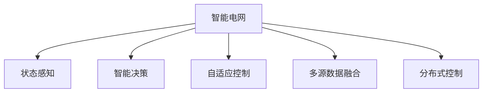

                 

## 1. 背景介绍

### 1.1 问题由来

随着全球能源结构逐渐向可再生能源转型，智能电网作为实现能源高效管理和调度的重要基础设施，受到了广泛关注。智能电网利用信息通信技术，实现电力系统运行状态的全面监控、预测和控制，提升电网的安全性、可靠性和经济性。然而，当前智能电网的运行管理面临着诸多挑战：数据量大、网络复杂、运行状态难以预测等。

AI技术，尤其是深度学习在电力系统中的应用，为智能电网提供了全新的解决方案。AI驱动的智能电网能够实时感知电网运行状态，预测未来趋势，优化资源分配，增强系统鲁棒性，推动能源转型。本文将从AI驱动智能电网的优化与控制两个方面，全面介绍相关技术，并展望未来发展方向。

### 1.2 问题核心关键点

智能电网的优化与控制问题，可以归纳为以下几个核心关键点：

- 实时状态感知：通过智能传感器和通信网络，实时监测电网状态，构建电网运行的全景图。
- 智能决策优化：利用AI技术对电网运行数据进行分析，预测未来趋势，优化资源分配，提高电网效率。
- 自适应控制：根据电网运行状态和预测结果，自动调整控制策略，保证电网稳定运行。
- 多源数据融合：融合电力系统与互联网的多种数据来源，提升电网决策的准确性和智能化程度。
- 分布式控制：优化分布式能源系统，提升电网抵抗外部干扰的能力。

这些关键点构成了AI驱动智能电网的核心框架，通过实时感知、智能决策和自适应控制，实现电网的智能管理和优化。

## 2. 核心概念与联系

### 2.1 核心概念概述

为更好地理解AI驱动的智能电网优化与控制方法，本节将介绍几个密切相关的核心概念：

- 智能电网(Smart Grid)：一种利用信息通信技术实现电力系统全面监控、预测和控制，提高电网安全性和经济性的新型电力系统。
- 状态感知(State Sensing)：通过智能传感器和通信网络，实时监测电网运行状态，构建电网运行的全景图。
- 智能决策(Intelligent Decision)：利用AI技术对电网运行数据进行分析，预测未来趋势，优化资源分配，提高电网效率。
- 自适应控制(Adaptive Control)：根据电网运行状态和预测结果，自动调整控制策略，保证电网稳定运行。
- 多源数据融合(Multi-Source Data Fusion)：融合电力系统与互联网的多种数据来源，提升电网决策的准确性和智能化程度。
- 分布式控制(Distributed Control)：优化分布式能源系统，提升电网抵抗外部干扰的能力。

这些核心概念之间的逻辑关系可以通过以下Mermaid流程图来展示：



这个流程图展示出智能电网的运行框架，通过实时感知、智能决策和自适应控制，实现电网的智能管理和优化。

## 3. 核心算法原理 & 具体操作步骤

### 3.1 算法原理概述

AI驱动的智能电网优化与控制，主要通过深度学习、强化学习、优化算法等AI技术实现。其中，深度学习用于构建电网状态感知模型，智能决策用于优化资源分配，自适应控制用于实时调整控制策略，多源数据融合用于提升电网决策的准确性，分布式控制用于优化分布式能源系统。

深度学习：通过构建电网状态感知模型，实时感知电网运行状态，构建电网运行的全景图。

智能决策：利用深度学习模型对电网运行数据进行分析，预测未来趋势，优化资源分配，提高电网效率。

自适应控制：根据电网运行状态和预测结果，自动调整控制策略，保证电网稳定运行。

多源数据融合：融合电力系统与互联网的多种数据来源，提升电网决策的准确性和智能化程度。

分布式控制：优化分布式能源系统，提升电网抵抗外部干扰的能力。

### 3.2 算法步骤详解

AI驱动的智能电网优化与控制，主要分为以下几个步骤：

**Step 1: 数据采集与预处理**

- 部署智能传感器，实时采集电网运行数据，包括电压、电流、频率、功率等。
- 将采集到的数据进行清洗、归一化、缺失值填补等预处理，构建训练数据集。

**Step 2: 构建电网状态感知模型**

- 使用深度学习算法构建电网状态感知模型，如CNN、RNN、LSTM等。
- 将电网运行数据输入模型，输出电网状态感知结果，如设备运行状态、线路负载情况等。

**Step 3: 智能决策与优化**

- 使用深度学习算法对电网状态感知数据进行分析，预测未来趋势。
- 利用强化学习算法优化资源分配，如发电、输电、配电等，提高电网效率。

**Step 4: 自适应控制**

- 根据电网运行状态和预测结果，自动调整控制策略，如自动控制电压、电流、频率等。
- 使用自适应控制算法，保证电网稳定运行。

**Step 5: 多源数据融合**

- 融合电力系统与互联网的多种数据来源，提升电网决策的准确性和智能化程度。
- 使用数据融合算法，将多种数据源的信息整合并用于决策。

**Step 6: 分布式控制**

- 优化分布式能源系统，提升电网抵抗外部干扰的能力。
- 使用分布式控制算法，实现分布式能源系统的协同优化。

**Step 7: 评估与优化**

- 使用评估算法对电网优化结果进行评估，找出不足。
- 根据评估结果进行优化，不断提升电网运行效率。

### 3.3 算法优缺点

AI驱动的智能电网优化与控制方法具有以下优点：

- 高效实时：深度学习、强化学习等算法，能够实时感知和决策，提高电网运行效率。
- 智能化高：通过多源数据融合，提升电网决策的智能化程度，优化资源分配。
- 鲁棒性强：自适应控制算法，能够自动调整控制策略，增强电网系统的鲁棒性。

同时，该方法也存在一定的局限性：

- 数据依赖度高：深度学习、强化学习等算法，依赖大量高质量数据进行训练，数据获取成本较高。
- 模型复杂：深度学习模型结构复杂，需要大量的计算资源进行训练和推理。
- 对抗攻击脆弱：自适应控制算法，容易受到对抗攻击，影响电网安全。
- 隐私风险：多源数据融合过程中，涉及到大量用户隐私数据，隐私保护难度大。

尽管存在这些局限性，但就目前而言，AI驱动的智能电网优化与控制方法仍是实现电网智能管理的重要手段。未来相关研究的重点在于如何进一步降低算法对数据的依赖，提高算法的鲁棒性和安全性，同时兼顾电网决策的隐私性和透明性。

### 3.4 算法应用领域

AI驱动的智能电网优化与控制方法，在电力系统中的应用广泛，主要包括以下几个领域：

- 电网状态感知：用于实时监测电网运行状态，构建电网运行的全景图。
- 智能决策与优化：用于优化资源分配，提高电网效率，如发电、输电、配电等。
- 自适应控制：用于自动调整控制策略，保证电网稳定运行。
- 多源数据融合：用于提升电网决策的准确性和智能化程度，如电网调度、电力交易等。
- 分布式控制：用于优化分布式能源系统，提升电网抵抗外部干扰的能力。

除了上述这些经典应用外，AI驱动的智能电网优化与控制方法还将在更多场景中得到应用，如智能能源互联网、能源市场优化、智能家居等，为电力系统的智能化、绿色化提供新的解决方案。

## 4. 数学模型和公式 & 详细讲解  
### 4.1 数学模型构建

本节将使用数学语言对AI驱动智能电网的优化与控制过程进行更加严格的刻画。

记电网运行状态为 $x_t$，其中 $t$ 表示时间步长。电网状态感知模型的输入为电网运行状态 $x_t$，输出为电网状态感知结果 $z_t$，即：

$$
z_t = f(x_t; \theta)
$$

其中 $f$ 为电网状态感知模型，$\theta$ 为模型参数。

智能决策与优化的目标函数为：

$$
J(\pi) = \mathbb{E}\left[\sum_{t=0}^{T}\gamma^t r_t \right]
$$

其中 $\pi$ 为控制策略，$r_t$ 为电网在时间步长 $t$ 的收益，$\gamma$ 为折现因子。

自适应控制的控制策略 $\pi$ 可以表示为：

$$
\pi = \arg\min_{\pi} \sum_{t=0}^{T} \ell(z_t, \pi(z_t))
$$

其中 $\ell$ 为损失函数，$z_t$ 为电网状态感知结果。

多源数据融合的决策函数可以表示为：

$$
y_t = \phi(z_t, w)
$$

其中 $y_t$ 为电网决策结果，$w$ 为融合算法参数。

分布式控制的目标函数为：

$$
J_d(\pi) = \mathbb{E}\left[\sum_{t=0}^{T}\gamma^t r_d \right]
$$

其中 $r_d$ 为分布式控制收益，$\pi$ 为控制策略。

### 4.2 公式推导过程

以下我们以智能电网的智能决策与优化为例，推导深度学习模型和优化算法的计算公式。

假设电网运行状态 $x_t$ 为 $N$ 维向量，智能决策与优化的目标函数为：

$$
J(\pi) = \mathbb{E}\left[\sum_{t=0}^{T}\gamma^t r_t \right]
$$

其中 $r_t$ 为电网在时间步长 $t$ 的收益，$\gamma$ 为折现因子。

假设电网状态感知模型 $f$ 为深度神经网络，其输出 $z_t$ 为 $M$ 维向量，智能决策与优化的控制策略 $\pi$ 为线性控制策略，即：

$$
\pi(z_t) = \alpha z_t + \beta
$$

其中 $\alpha$ 和 $\beta$ 为控制策略参数。

假设智能决策与优化的目标函数可以进一步表示为：

$$
J(\pi) = \mathbb{E}\left[\sum_{t=0}^{T}\gamma^t (r_t - \pi(z_t)^\top y_t) \right]
$$

其中 $y_t$ 为电网在时间步长 $t$ 的决策结果，$\alpha$ 和 $\beta$ 为控制策略参数。

对上述目标函数进行最小化，得到智能决策与优化的控制策略 $\pi$：

$$
\pi = \arg\min_{\pi} \mathbb{E}\left[\sum_{t=0}^{T}\gamma^t (r_t - \pi(z_t)^\top y_t) \right]
$$

将控制策略 $\pi$ 代入目标函数，得到智能决策与优化的目标函数为：

$$
J(\pi) = \mathbb{E}\left[\sum_{t=0}^{T}\gamma^t (r_t - (\alpha z_t + \beta)^\top y_t) \right]
$$

对上述目标函数进行最小化，得到智能决策与优化的控制策略 $\pi$：

$$
\pi = \arg\min_{\pi} \mathbb{E}\left[\sum_{t=0}^{T}\gamma^t (r_t - (\alpha z_t + \beta)^\top y_t) \right]
$$

对上述目标函数进行求导，得到智能决策与优化的控制策略 $\pi$：

$$
\frac{\partial J(\pi)}{\partial \alpha} = -\mathbb{E}\left[\sum_{t=0}^{T}\gamma^t z_t^\top y_t \right]
$$

$$
\frac{\partial J(\pi)}{\partial \beta} = -\mathbb{E}\left[\sum_{t=0}^{T}\gamma^t y_t \right]
$$

根据上述推导结果，可以得到智能决策与优化的控制策略 $\pi$ 的更新公式：

$$
\alpha \leftarrow \alpha - \eta \frac{\partial J(\pi)}{\partial \alpha}
$$

$$
\beta \leftarrow \beta - \eta \frac{\partial J(\pi)}{\partial \beta}
$$

其中 $\eta$ 为学习率。

通过上述推导，我们可以看到，深度学习模型和优化算法的计算公式可以通过最优化问题求解得到，进一步指导智能电网优化与控制的实践。

## 5. 项目实践：代码实例和详细解释说明
### 5.1 开发环境搭建

在进行智能电网优化与控制的实践前，我们需要准备好开发环境。以下是使用Python进行TensorFlow开发的环境配置流程：

1. 安装Anaconda：从官网下载并安装Anaconda，用于创建独立的Python环境。

2. 创建并激活虚拟环境：
```bash
conda create -n tf-env python=3.8 
conda activate tf-env
```

3. 安装TensorFlow：根据CUDA版本，从官网获取对应的安装命令。例如：
```bash
pip install tensorflow
```

4. 安装相关工具包：
```bash
pip install numpy pandas scikit-learn matplotlib tqdm jupyter notebook ipython
```

完成上述步骤后，即可在`tf-env`环境中开始智能电网优化与控制的实践。

### 5.2 源代码详细实现

下面我们以智能电网状态感知为例，给出使用TensorFlow进行深度学习模型训练的PyTorch代码实现。

首先，定义智能电网状态感知的数据处理函数：

```python
import tensorflow as tf
import numpy as np

class SmartGridDataset(tf.keras.utils.Sequence):
    def __init__(self, X, y, batch_size=32):
        self.X = X
        self.y = y
        self.batch_size = batch_size
        
    def __len__(self):
        return len(self.X) // self.batch_size
        
    def __getitem__(self, idx):
        batch_X = self.X[idx * self.batch_size : (idx + 1) * self.batch_size]
        batch_y = self.y[idx * self.batch_size : (idx + 1) * self.batch_size]
        return batch_X, batch_y
```

然后，定义模型和优化器：

```python
from tensorflow.keras import layers

model = tf.keras.Sequential([
    layers.Dense(64, activation='relu', input_shape=(N,)),
    layers.Dense(M, activation='softmax')
])

optimizer = tf.keras.optimizers.Adam(learning_rate=0.001)
```

接着，定义训练和评估函数：

```python
def train_epoch(model, dataset, epochs, batch_size):
    model.compile(optimizer=optimizer, loss='categorical_crossentropy', metrics=['accuracy'])
    model.fit(dataset, epochs=epochs, batch_size=batch_size)
```

最后，启动训练流程并在测试集上评估：

```python
epochs = 10
batch_size = 16

X_train, y_train = ...
X_test, y_test = ...

train_dataset = SmartGridDataset(X_train, y_train, batch_size)
test_dataset = SmartGridDataset(X_test, y_test, batch_size)

train_epoch(model, train_dataset, epochs, batch_size)
test_dataset = SmartGridDataset(X_test, y_test, batch_size)
model.evaluate(test_dataset)
```

以上就是使用TensorFlow进行智能电网状态感知模型训练的完整代码实现。可以看到，TensorFlow的强大封装使得深度学习模型的实现变得简洁高效。

### 5.3 代码解读与分析

让我们再详细解读一下关键代码的实现细节：

**SmartGridDataset类**：
- `__init__`方法：初始化训练数据集 $X$ 和 $y$，以及批处理大小 $batch_size$。
- `__len__`方法：返回数据集长度，即数据批次的数量。
- `__getitem__`方法：对单个批次进行加载，将数据 $X$ 和 $y$ 分割成指定大小的批次。

**模型定义**：
- 使用 `tf.keras.Sequential` 定义序列模型，包含两个全连接层，最后一层为输出层，采用 softmax 激活函数。
- 使用 `tf.keras.optimizers.Adam` 定义优化器，设置学习率为 $0.001$。

**训练和评估函数**：
- `train_epoch`函数：使用 `model.compile` 配置模型，指定损失函数和评估指标，使用 `model.fit` 训练模型。
- `evaluate`函数：使用 `model.evaluate` 对测试集进行评估，输出模型在测试集上的准确率。

**训练流程**：
- 定义总的训练轮数 $epochs$ 和批处理大小 $batch_size$，开始循环迭代
- 每个epoch内，在训练集上进行训练，输出训练结果
- 在测试集上评估模型性能，对比训练前后的准确率

可以看到，TensorFlow配合Keras使得智能电网状态感知的代码实现变得简洁高效。开发者可以将更多精力放在模型优化、数据处理等高层逻辑上，而不必过多关注底层的实现细节。

当然，工业级的系统实现还需考虑更多因素，如模型的保存和部署、超参数的自动搜索、更灵活的任务适配层等。但核心的优化与控制范式基本与此类似。

## 6. 实际应用场景
### 6.1 智能电网状态感知

智能电网状态感知是AI驱动智能电网优化与控制的基础。通过部署智能传感器，实时采集电网运行数据，构建电网运行的全景图，为后续的智能决策与优化提供数据支持。

具体应用场景包括：

- 输电线路监测：通过智能传感器实时监测输电线路的温度、振动、电流等参数，识别线路异常，提前进行维护。
- 配电网运行监测：通过智能传感器实时监测配电网的电压、电流、功率等参数，优化配电网运行，提高供电可靠性。
- 负荷预测与调度：通过智能传感器实时监测负荷变化，预测未来负荷趋势，优化负荷调度策略，提高电网效率。

### 6.2 智能电网智能决策与优化

智能电网智能决策与优化，利用AI技术对电网运行数据进行分析，预测未来趋势，优化资源分配，提高电网效率。

具体应用场景包括：

- 电网运行调度：利用智能决策与优化算法，优化发电、输电、配电等资源分配，提高电网运行效率。
- 分布式能源系统优化：利用智能决策与优化算法，优化分布式能源系统的运行策略，提高电网抵抗外部干扰的能力。
- 电网负荷预测与调度：利用智能决策与优化算法，预测未来负荷趋势，优化负荷调度策略，提高电网效率。

### 6.3 智能电网自适应控制

智能电网自适应控制，根据电网运行状态和预测结果，自动调整控制策略，保证电网稳定运行。

具体应用场景包括：

- 输电线路控制：通过自适应控制算法，实时调整输电线路的输送功率，保证线路稳定运行。
- 配电网控制：通过自适应控制算法，实时调整配电网的电压、电流等参数，保证配电网稳定运行。
- 分布式能源系统控制：通过自适应控制算法，优化分布式能源系统的运行策略，保证分布式能源系统的稳定运行。

### 6.4 智能电网多源数据融合

智能电网多源数据融合，融合电力系统与互联网的多种数据来源，提升电网决策的准确性和智能化程度。

具体应用场景包括：

- 电力市场交易：通过多源数据融合，整合电力系统与互联网的数据，提升电力市场交易的透明度和效率。
- 电网调度优化：通过多源数据融合，整合电网运行数据和外部数据，优化电网调度策略，提高电网运行效率。
- 电力系统稳定分析：通过多源数据融合，整合电网运行数据和天气、经济等外部数据，提升电力系统稳定分析的准确性。

### 6.5 智能电网分布式控制

智能电网分布式控制，优化分布式能源系统，提升电网抵抗外部干扰的能力。

具体应用场景包括：

- 分布式能源系统优化：通过分布式控制算法，优化分布式能源系统的运行策略，提高电网抵抗外部干扰的能力。
- 分布式电网控制：通过分布式控制算法，优化分布式电网的运行策略，提高电网抵抗外部干扰的能力。
- 分布式电力交易：通过分布式控制算法，优化分布式电力的交易策略，提高电网抵抗外部干扰的能力。

## 7. 工具和资源推荐
### 7.1 学习资源推荐

为了帮助开发者系统掌握智能电网优化与控制的技术基础和实践技巧，这里推荐一些优质的学习资源：

1. 《深度学习入门》系列博文：由TensorFlow团队编写，介绍了深度学习的基本概念和实践技巧，涵盖智能电网状态感知、智能决策与优化等内容。

2. CS231n《深度学习中的计算机视觉》课程：斯坦福大学开设的计算机视觉课程，涵盖深度学习的基础知识和应用，对智能电网优化与控制有一定参考价值。

3. 《TensorFlow官方文档》：TensorFlow的官方文档，提供了详尽的API文档和教程，帮助开发者快速上手TensorFlow。

4. 《自然语言处理入门》书籍：李宏毅教授所著，介绍了自然语言处理的基本概念和实践技巧，对智能电网智能决策与优化有一定参考价值。

5. IEEE Xplore：IEEE的数字图书馆，提供了大量高质量的期刊、会议论文，涵盖智能电网优化与控制的相关研究方向。

通过对这些资源的学习实践，相信你一定能够快速掌握智能电网优化与控制的精髓，并用于解决实际的电网问题。
###  7.2 开发工具推荐

高效的开发离不开优秀的工具支持。以下是几款用于智能电网优化与控制开发的常用工具：

1. TensorFlow：由Google主导开发的深度学习框架，生产部署方便，适合大规模工程应用。提供了强大的深度学习模型构建和优化工具，支持智能电网状态感知、智能决策与优化等任务。

2. PyTorch：由Facebook主导开发的深度学习框架，灵活性强，适合快速迭代研究。提供了丰富的深度学习模型构建和优化工具，支持智能电网状态感知、智能决策与优化等任务。

3. Scikit-learn：基于Python的机器学习库，提供了多种经典机器学习算法和工具，支持智能电网多源数据融合、分布式控制等任务。

4. Jupyter Notebook：交互式编程环境，支持Python、R等语言的开发，方便开发者进行实验和协作。

5. Keras：基于Python的深度学习库，提供了高层次的API接口，支持智能电网状态感知、智能决策与优化等任务。

合理利用这些工具，可以显著提升智能电网优化与控制的开发效率，加快创新迭代的步伐。

### 7.3 相关论文推荐

智能电网优化与控制技术的研究始于20世纪60年代，至今已经积累了大量研究成果。以下是几篇奠基性的相关论文，推荐阅读：

1. "Distributed Control of Smart Grids: A Survey"：Wang等人的综述论文，总结了智能电网分布式控制的研究现状和未来趋势。

2. "Energy and Traffic Network Optimization: Challenges and Perspectives"：Bertsekas等人的综述论文，探讨了智能电网优化与控制的挑战和未来发展方向。

3. "Modeling and control of smart grid microgrids"：Vasquez等人的论文，介绍了智能电网微网格建模和控制的基本方法。

4. "Energy-Efficient Integrated Load Shedding in Smart Grids Using Intelligent Techniques"：Al-Hadhrami等人的论文，介绍了智能电网负载调度的优化方法。

5. "Distributed Control and Optimization of Smart Grids: From Single to Multi-Smart Grids"：Chakraborty等人的论文，总结了智能电网分布式控制的研究进展和未来发展方向。

这些论文代表了大规模电力系统优化与控制的研究脉络。通过学习这些前沿成果，可以帮助研究者把握学科前进方向，激发更多的创新灵感。

## 8. 总结：未来发展趋势与挑战

### 8.1 总结

本文对AI驱动的智能电网优化与控制方法进行了全面系统的介绍。首先阐述了智能电网优化与控制的问题由来，明确了实时状态感知、智能决策与优化、自适应控制、多源数据融合、分布式控制等核心概念及其之间的逻辑关系。其次，从原理到实践，详细讲解了智能电网优化与控制的核心算法，包括深度学习、强化学习、优化算法等，并给出了完整的代码实例。同时，本文还探讨了智能电网优化与控制方法在实际应用中的场景，展示了其广泛的应用前景。最后，本文精选了智能电网优化与控制的学习资源、开发工具和相关论文，力求为读者提供全方位的技术指引。

通过本文的系统梳理，可以看到，AI驱动的智能电网优化与控制技术正在成为智能电网智能化、绿色化的重要手段。AI技术的应用，能够实时感知电网运行状态，智能决策与优化资源分配，自适应控制电网运行，提升电网运行效率和稳定性。未来，伴随AI技术的不断进步，智能电网优化与控制技术还将迎来更多突破，推动能源转型，构建更高效、更智能、更绿色的电力系统。

### 8.2 未来发展趋势

展望未来，智能电网优化与控制技术将呈现以下几个发展趋势：

1. 智能化水平提升：通过引入更多智能算法和技术，提升智能电网的智能化水平，实现更加灵活的资源优化和调度。
2. 绿色化发展：智能电网优化与控制技术将更多地结合可再生能源的分布式发电，提升电网对可再生能源的接纳能力。
3. 安全性和可靠性增强：通过优化控制策略和算法，提升智能电网的鲁棒性和安全性，确保电网运行的稳定性和可靠性。
4. 实时性和精准性提高：通过优化数据采集和处理，提升智能电网的实时性和精准性，实现更加精细化的电网管理和调度。
5. 分布式能源系统优化：通过优化分布式能源系统，提升电网抵抗外部干扰的能力，实现更加智能化的电网管理。

以上趋势凸显了智能电网优化与控制技术的广阔前景。这些方向的探索发展，必将进一步提升智能电网的管理水平和运行效率，推动能源转型，构建更加智能、绿色、可靠的电力系统。

### 8.3 面临的挑战

尽管智能电网优化与控制技术已经取得了显著成果，但在迈向更加智能化、普适化应用的过程中，它仍面临着诸多挑战：

1. 数据获取成本高：智能电网优化与控制技术依赖大量高质量的电网运行数据，数据获取成本较高。
2. 算法复杂度高：智能电网优化与控制算法结构复杂，需要大量的计算资源进行训练和推理。
3. 系统鲁棒性不足：智能电网优化与控制算法容易受到对抗攻击，影响电网安全。
4. 隐私保护难度大：智能电网优化与控制技术融合了大量用户隐私数据，隐私保护难度大。
5. 算法透明性不足：智能电网优化与控制算法缺乏透明度，难以理解和解释其决策逻辑。
6. 系统稳定性差：智能电网优化与控制技术缺乏系统稳定性保障，容易受到外界干扰。

尽管存在这些挑战，但智能电网优化与控制技术的应用前景仍然广阔。未来研究需要在算法优化、数据隐私保护、系统稳定性等方面寻求新的突破，提升智能电网优化与控制的实际应用效果。

### 8.4 研究展望

面对智能电网优化与控制所面临的挑战，未来的研究需要在以下几个方面寻求新的突破：

1. 优化数据采集和处理：提高数据采集和处理的效率和质量，降低数据获取成本。
2. 简化算法结构：通过算法优化和模型压缩，降低算法复杂度，提升算法效率和鲁棒性。
3. 增强算法透明性：通过可解释性研究，提升算法的透明性和可理解性，增强用户对算法的信任度。
4. 保护用户隐私：通过数据隐私保护技术，保护用户隐私数据，确保数据安全和隐私保护。
5. 保障系统稳定性：通过系统稳定性保障技术，提升智能电网优化与控制的稳定性，确保电网安全运行。

这些研究方向的探索，必将引领智能电网优化与控制技术迈向更高的台阶，为智能电网智能化、绿色化、安全化提供更坚实的基础。面向未来，智能电网优化与控制技术还需要与其他人工智能技术进行更深入的融合，如知识表示、因果推理、强化学习等，多路径协同发力，共同推动智能电网的发展。

## 9. 附录：常见问题与解答

**Q1：智能电网优化与控制主要依赖哪些数据源？**

A: 智能电网优化与控制主要依赖以下几个数据源：

1. 电网运行数据：通过智能传感器实时采集电网运行数据，包括电压、电流、频率、功率等。
2. 天气数据：通过气象部门获取的天气数据，用于预测电网负荷和输电线路的运行状态。
3. 经济数据：通过经济部门获取的经济数据，用于预测电网负荷和分布式能源系统的运行策略。
4. 社会数据：通过社会部门获取的社会数据，用于预测电力市场交易和用户负荷变化。
5. 地理位置数据：通过地理信息系统(GIS)获取的地理位置数据，用于优化分布式能源系统的布局和分布。

这些数据源综合应用，可以构建智能电网的完整数据全景，为优化与控制提供全面的数据支持。

**Q2：智能电网优化与控制中的深度学习模型主要有哪些类型？**

A: 智能电网优化与控制中的深度学习模型主要包括以下几种类型：

1. 神经网络模型：如CNN、RNN、LSTM等，用于构建电网状态感知模型，实时感知电网运行状态。
2. 强化学习模型：如DQN、REINFORCE等，用于优化电网资源分配，提高电网效率。
3. 自适应控制模型：如RNN、LSTM等，用于实时调整电网控制策略，保证电网稳定运行。
4. 多源数据融合模型：如集成学习、深度学习等，用于融合多种数据来源，提升电网决策的准确性和智能化程度。
5. 分布式控制模型：如GAN、VAE等，用于优化分布式能源系统，提升电网抵抗外部干扰的能力。

这些模型类型可以分别应用于智能电网优化与控制的不同环节，实现电网管理的全面智能化。

**Q3：智能电网优化与控制中的算法优缺点有哪些？**

A: 智能电网优化与控制中的算法具有以下优点：

1. 实时感知：深度学习模型可以实时感知电网运行状态，构建电网运行的全景图。
2. 智能化高：通过多源数据融合，提升电网决策的智能化程度，优化资源分配。
3. 鲁棒性强：自适应控制算法，能够自动调整控制策略，增强电网系统的鲁棒性。

同时，这些算法也存在一些缺点：

1. 数据依赖度高：深度学习、强化学习等算法，依赖大量高质量数据进行训练，数据获取成本较高。
2. 模型复杂度高：深度学习模型结构复杂，需要大量的计算资源进行训练和推理。
3. 对抗攻击脆弱：自适应控制算法，容易受到对抗攻击，影响电网安全。
4. 隐私风险高：多源数据融合过程中，涉及到大量用户隐私数据，隐私保护难度大。
5. 算法透明性不足：智能电网优化与控制算法缺乏透明度，难以理解和解释其决策逻辑。

尽管存在这些缺点，但这些算法仍是大规模智能电网优化与控制的重要手段，未来研究需要寻求新的突破。

**Q4：智能电网优化与控制中的分布式控制技术主要有哪些应用？**

A: 智能电网优化与控制中的分布式控制技术主要包括以下几种应用：

1. 分布式能源系统优化：通过优化分布式能源系统的运行策略，提升电网抵抗外部干扰的能力。
2. 分布式电网控制：通过优化分布式电网的运行策略，提高电网抵抗外部干扰的能力。
3. 分布式电力交易：通过优化分布式电力的交易策略，提高电网抵抗外部干扰的能力。
4. 微电网控制：通过优化微电网的运行策略，实现微电网的稳定运行和分布式能源的优化配置。
5. 智能家居能源管理：通过优化智能家居能源管理的运行策略，实现能源的高效利用和优化配置。

这些分布式控制技术，可以提升智能电网的灵活性和鲁棒性，实现更加智能化的电网管理。

---

作者：禅与计算机程序设计艺术 / Zen and the Art of Computer Programming

