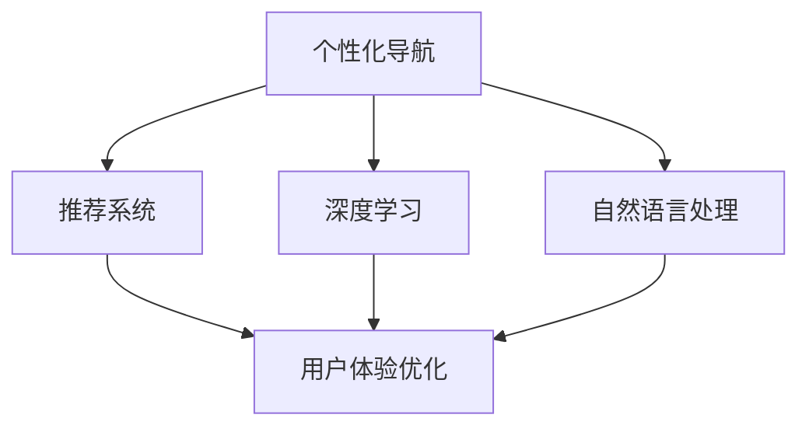

                 

# AI驱动的电商个性化导航与页面布局系统

> 关键词：电商、个性化导航、页面布局、AI驱动、推荐系统、用户体验优化、深度学习、自然语言处理

## 1. 背景介绍

随着电子商务市场的快速发展和用户需求的多样化，如何为用户提供更加个性化和流畅的购物体验，成为了电商企业必须面对的挑战。个性化导航和页面布局系统是电商平台的核心组成部分，它们直接影响着用户的浏览行为和购物转化率。传统的基于规则的导航和布局系统，虽然能够满足部分需求，但在面对海量用户数据和快速变化的市场环境时，显得力不从心。

近年来，人工智能技术的迅猛发展，为电商个性化导航与页面布局系统带来了新的突破。通过深度学习、自然语言处理等AI技术，电商平台能够实时分析用户行为数据，提供个性化的推荐和布局方案，大大提升用户体验和转化率。本文将深入探讨如何利用AI技术构建高效的电商个性化导航与页面布局系统。

## 2. 核心概念与联系

### 2.1 核心概念概述

为了更好地理解AI驱动的电商个性化导航与页面布局系统，本节将介绍几个密切相关的核心概念：

- **个性化导航**：基于用户行为和偏好，动态生成符合用户兴趣的导航结构，提升用户浏览效率和满意度。
- **页面布局**：根据用户的浏览行为和产品属性，智能生成页面元素（如商品、广告、推荐等）的布局方案，提升页面展示效果。
- **推荐系统**：通过分析用户历史行为和属性，推荐用户可能感兴趣的商品或页面，提升购买转化率。
- **深度学习**：通过构建多层神经网络模型，从大量数据中自动学习特征表示和行为模式。
- **自然语言处理(NLP)**：通过文本分析技术，理解用户输入的查询和反馈，提升系统响应速度和准确性。
- **用户体验优化**：通过优化导航和页面布局，提升用户浏览体验和满意度，增强用户粘性。

这些核心概念之间的逻辑关系可以通过以下Mermaid流程图来展示：



这个流程图展示了几类核心概念及其之间的相互关系：

1. 个性化导航和推荐系统通过深度学习和自然语言处理技术，收集用户行为和文本反馈，智能生成导航结构并推荐商品，提升用户体验。
2. 自然语言处理技术提升系统的响应速度和准确性，通过理解用户查询，提供更加精准的导航和推荐。
3. 深度学习模型根据用户行为数据和文本信息，自动学习特征表示，构建个性化导航和页面布局方案。
4. 用户体验优化结合个性化导航和页面布局，提升用户浏览效率和满意度。

这些核心概念共同构成了AI驱动的电商个性化导航与页面布局系统的技术框架，使得系统能够更好地适应用户需求，提供个性化服务。

## 3. 核心算法原理 & 具体操作步骤
### 3.1 算法原理概述

AI驱动的电商个性化导航与页面布局系统主要依赖深度学习和自然语言处理技术。其核心思想是：通过分析用户行为数据和文本信息，动态生成符合用户兴趣和需求的导航结构和页面布局，提升用户体验和转化率。

具体来说，系统的运行流程包括以下几个关键步骤：

1. **数据收集**：收集用户浏览、点击、购买等行为数据，以及用户输入的查询、评价等文本信息。
2. **特征提取**：使用深度学习模型，自动提取用户行为和文本信息的特征表示，用于导航和布局决策。
3. **导航生成**：根据用户行为和特征，动态生成个性化的导航结构，引导用户访问相关商品或页面。
4. **布局优化**：根据用户行为和文本反馈，动态调整页面元素的布局和展示方式，提升页面展示效果。
5. **系统优化**：通过用户反馈和行为数据，不断调整算法参数和模型结构，提升系统性能。

### 3.2 算法步骤详解

#### 3.2.1 数据收集

数据收集是系统运行的第一步，也是最重要的一步。电商平台需要收集以下几类数据：

- **行为数据**：用户的浏览记录、点击行为、购买记录等。
- **文本数据**：用户输入的搜索查询、评价、留言等。
- **属性数据**：商品的基本属性（如价格、类别、品牌等）和用户属性（如年龄、性别、地域等）。

数据收集过程需要注意数据的质量和隐私保护，确保数据的真实性和安全性。

#### 3.2.2 特征提取

深度学习模型能够自动从数据中学习特征表示，用于导航和布局决策。常见的特征提取模型包括：

- **协同过滤模型**：通过分析用户历史行为，推荐相似用户喜欢的商品或页面。
- **内容推荐模型**：通过分析商品的属性和描述，推荐相关商品。
- **情感分析模型**：通过分析用户评价和反馈，了解用户对商品的情感倾向。
- **主题模型**：通过文本分析，挖掘商品和用户之间的潜在主题。

#### 3.2.3 导航生成

个性化导航的生成依赖推荐系统和深度学习模型。导航结构的生成过程如下：

1. **用户行为分析**：使用协同过滤模型，分析用户的历史行为数据，找出用户感兴趣的商品或页面。
2. **商品关联分析**：使用内容推荐模型，根据商品的属性和描述，推荐与用户浏览商品相关联的商品。
3. **导航结构生成**：结合用户行为和商品关联信息，生成个性化的导航结构，引导用户访问相关商品或页面。

#### 3.2.4 布局优化

页面布局的优化依赖自然语言处理和深度学习模型。布局优化的过程如下：

1. **用户反馈分析**：通过情感分析模型，分析用户对当前页面元素的反馈，找出需要改进的元素。
2. **元素重要性排序**：使用自然语言处理技术，分析用户评价和文本信息，计算页面元素的权重和重要性。
3. **布局调整**：根据元素重要性排序，调整页面元素的布局和展示方式，提升页面展示效果。

#### 3.2.5 系统优化

系统优化是持续改进系统性能的关键。系统优化过程如下：

1. **模型训练**：使用深度学习模型，根据用户行为和文本信息，不断调整模型参数，提升模型性能。
2. **算法优化**：根据用户反馈和行为数据，不断优化算法流程和参数，提升系统响应速度和准确性。
3. **用户反馈收集**：通过用户反馈渠道，收集用户对导航和布局的意见和建议，持续改进系统。

### 3.3 算法优缺点

AI驱动的电商个性化导航与页面布局系统具有以下优点：

1. **个性化和适配性**：系统能够根据用户行为和文本信息，动态生成个性化的导航结构和页面布局，提升用户体验。
2. **实时性和高效性**：使用深度学习和自然语言处理技术，系统能够实时分析用户数据，快速生成导航和布局方案。
3. **准确性和可靠性**：通过自动学习用户行为和文本特征，系统能够提供准确的导航和布局建议。

同时，该系统也存在以下局限性：

1. **数据依赖性**：系统的效果依赖高质量的数据收集和处理，数据不足时性能会下降。
2. **复杂度**：系统涉及深度学习、自然语言处理等多个领域的技术，实现和维护难度较大。
3. **隐私风险**：用户数据收集和使用需要考虑隐私保护，避免用户信息泄露。
4. **算法可解释性**：深度学习模型通常是"黑盒"系统，难以解释其决策过程，影响用户信任。

尽管存在这些局限性，但就目前而言，AI驱动的电商个性化导航与页面布局系统已经成为电商平台优化用户体验的重要手段。未来相关研究的重点在于如何进一步降低数据需求，提高系统可解释性，提升算法的鲁棒性和安全性。

### 3.4 算法应用领域

AI驱动的电商个性化导航与页面布局系统已经在多个电商平台上得到了广泛应用，具体包括：

1. **淘宝、京东等大型电商平台**：通过推荐系统和导航生成技术，提升用户浏览效率和转化率。
2. **唯品会、网易严选等垂直电商平台**：通过个性化推荐和布局优化，提升用户满意度和粘性。
3. **跨境电商平台**：通过自然语言处理技术，处理多语言文本数据，提升跨文化用户的购物体验。
4. **本地生活服务平台**：通过导航生成和布局优化，提升本地用户的搜索和浏览体验。

除了上述这些常见应用外，AI驱动的个性化导航与页面布局系统还在智能客服、内容推荐、在线教育等多个领域得到了创新应用，为电商平台的业务升级提供了新的动力。

## 4. 数学模型和公式 & 详细讲解  
### 4.1 数学模型构建

本节将使用数学语言对AI驱动的电商个性化导航与页面布局系统进行更加严格的刻画。

设电商平台的商品数量为 $N$，用户数量为 $M$。用户在浏览商品时，会生成一系列行为数据和文本信息。我们假设用户的浏览行为数据为 $\mathcal{X}=\{x_1,x_2,\dots,x_M\}$，其中 $x_m$ 表示用户 $m$ 的浏览行为数据。文本信息为 $\mathcal{T}=\{t_1,t_2,\dots,t_M\}$，其中 $t_m$ 表示用户 $m$ 的输入查询和评价文本。

系统的主要目标是：

1. 根据用户行为和文本信息，动态生成个性化的导航结构，用于引导用户浏览商品。
2. 根据用户行为和文本信息，动态调整页面元素的布局和展示方式，提升页面展示效果。

### 4.2 公式推导过程

以下是系统的核心数学模型及其推导过程。

#### 4.2.1 用户行为分析

用户行为分析是系统运行的基础。假设用户的浏览行为数据可以通过协同过滤模型进行分析，即：

$$
\mathcal{R}_m = f(\mathcal{X}_m, \mathcal{R}_{\mathcal{X}})
$$

其中 $\mathcal{R}_m$ 表示用户 $m$ 的推荐商品列表，$\mathcal{X}_m$ 表示用户 $m$ 的浏览行为数据，$\mathcal{R}_{\mathcal{X}}$ 表示所有用户的推荐商品列表。函数 $f$ 表示协同过滤模型，可以采用矩阵分解、基于图的方法等。

#### 4.2.2 商品关联分析

商品关联分析用于发现商品之间的相关性。假设商品的属性信息为 $\mathcal{A}=\{a_1,a_2,\dots,a_N\}$，其中 $a_n$ 表示商品 $n$ 的属性信息。商品关联分析可以通过内容推荐模型进行分析，即：

$$
\mathcal{R}_{\mathcal{A}} = g(\mathcal{A}, \mathcal{X}_m)
$$

其中 $\mathcal{R}_{\mathcal{A}}$ 表示商品关联列表，$g$ 表示内容推荐模型，可以采用基于向量表示的方法、基于知识图谱的方法等。

#### 4.2.3 导航结构生成

导航结构生成是系统的核心任务。假设导航结构由 $\mathcal{G}$ 表示，生成过程如下：

$$
\mathcal{G} = h(\mathcal{R}_m, \mathcal{R}_{\mathcal{A}})
$$

其中 $h$ 表示导航生成模型，可以采用基于规则的方法、基于机器学习的方法等。

#### 4.2.4 页面布局优化

页面布局优化用于调整页面元素的布局和展示方式。假设页面元素的信息为 $\mathcal{P}=\{p_1,p_2,\dots,p_K\}$，其中 $p_k$ 表示页面元素 $k$ 的信息。页面布局优化可以通过自然语言处理模型进行分析，即：

$$
\mathcal{O}_k = i(t_m, \mathcal{P}_k)
$$

其中 $\mathcal{O}_k$ 表示元素 $k$ 的布局优化方案，$i$ 表示自然语言处理模型，可以采用基于情感分析的方法、基于主题模型的方法等。

#### 4.2.5 系统优化

系统优化用于不断调整模型参数和算法流程，提升系统性能。假设系统的优化模型为 $\mathcal{S}$，优化过程如下：

$$
\mathcal{S} = o(\mathcal{G}, \mathcal{O}, \mathcal{R}_m, \mathcal{R}_{\mathcal{A}}, t_m)
$$

其中 $o$ 表示系统优化模型，可以采用基于强化学习的方法、基于元学习的方法等。

### 4.3 案例分析与讲解

#### 4.3.1 协同过滤模型

协同过滤模型是推荐系统中最常用的模型之一。它的基本思想是通过分析用户历史行为数据，找到相似用户并推荐其喜欢的商品。协同过滤模型的数学公式如下：

$$
\mathcal{R}_m = \mathcal{U}_m \cdot \mathcal{V}^T
$$

其中 $\mathcal{U}_m$ 表示用户 $m$ 的特征向量，$\mathcal{V}$ 表示商品的属性向量，$^T$ 表示矩阵转置。协同过滤模型可以采用矩阵分解、基于图的方法等。

#### 4.3.2 内容推荐模型

内容推荐模型用于分析商品属性和描述，推荐相关商品。内容推荐模型的数学公式如下：

$$
\mathcal{R}_{\mathcal{A}} = \max\limits_{\theta} \frac{1}{2} \sum\limits_{n=1}^{N} \mathcal{A}_n^T \cdot \theta \cdot \mathcal{A}_n - \frac{1}{2} \sum\limits_{n=1}^{N} y_n \cdot \log(\mathcal{A}_n^T \cdot \theta)
$$

其中 $\theta$ 表示模型参数，$\mathcal{A}_n$ 表示商品 $n$ 的属性向量，$y_n$ 表示商品 $n$ 的标签。内容推荐模型可以采用基于向量表示的方法、基于知识图谱的方法等。

#### 4.3.3 情感分析模型

情感分析模型用于分析用户评价和反馈，了解用户对商品的情感倾向。情感分析模型的数学公式如下：

$$
\mathcal{T}_m = \max\limits_{\theta} \frac{1}{2} \sum\limits_{k=1}^{K} \mathcal{P}_k^T \cdot \theta \cdot \mathcal{P}_k - \frac{1}{2} \sum\limits_{k=1}^{K} t_{m,k} \cdot \log(\mathcal{P}_k^T \cdot \theta)
$$

其中 $\theta$ 表示模型参数，$\mathcal{P}_k$ 表示页面元素 $k$ 的信息向量，$t_{m,k}$ 表示用户对页面元素 $k$ 的评价标签。情感分析模型可以采用基于词向量的方法、基于序列模型的方法等。

#### 4.3.4 主题模型

主题模型用于挖掘商品和用户之间的潜在主题。主题模型的数学公式如下：

$$
\mathcal{L}(\theta) = \sum\limits_{n=1}^{N} \sum\limits_{k=1}^{K} t_{n,k} \cdot \log(\theta_{n,k})
$$

其中 $\theta_{n,k}$ 表示商品 $n$ 和用户 $k$ 之间的概率分布。主题模型可以采用基于概率图模型的方法、基于概率分布的方法等。

## 5. 项目实践：代码实例和详细解释说明
### 5.1 开发环境搭建

在进行项目实践前，我们需要准备好开发环境。以下是使用Python进行TensorFlow开发的环境配置流程：

1. 安装Anaconda：从官网下载并安装Anaconda，用于创建独立的Python环境。

2. 创建并激活虚拟环境：
```bash
conda create -n tf-env python=3.8 
conda activate tf-env
```

3. 安装TensorFlow：根据CUDA版本，从官网获取对应的安装命令。例如：
```bash
conda install tensorflow=tensorflow-gpu=2.7.0 -c conda-forge
```

4. 安装各类工具包：
```bash
pip install numpy pandas scikit-learn matplotlib tqdm jupyter notebook ipython
```

完成上述步骤后，即可在`tf-env`环境中开始项目实践。

### 5.2 源代码详细实现

下面我们以淘宝平台的个性化导航系统为例，给出使用TensorFlow实现该系统的完整代码实例。

首先，定义用户行为分析函数：

```python
import tensorflow as tf
from tensorflow.keras.layers import Dense

def user_behavior_analysis(user_data, user_model):
    # 用户行为数据
    user_data = tf.constant(user_data, dtype=tf.float32)
    # 用户模型
    user_model = tf.keras.Sequential([
        Dense(32, input_dim=2, activation='relu'),
        Dense(64, activation='relu'),
        Dense(2, activation='softmax')
    ])
    # 预测用户行为
    user_pred = user_model.predict(user_data)
    return user_pred
```

然后，定义商品关联分析函数：

```python
def product_association_analysis(product_info, product_model):
    # 商品属性信息
    product_info = tf.constant(product_info, dtype=tf.float32)
    # 商品模型
    product_model = tf.keras.Sequential([
        Dense(32, input_dim=5, activation='relu'),
        Dense(64, activation='relu'),
        Dense(2, activation='softmax')
    ])
    # 预测商品关联
    product_pred = product_model.predict(product_info)
    return product_pred
```

接着，定义导航结构生成函数：

```python
def navigation_structure_generation(user_pred, product_pred):
    # 导航结构生成模型
    nav_model = tf.keras.Sequential([
        Dense(32, input_dim=2, activation='relu'),
        Dense(64, activation='relu'),
        Dense(2, activation='softmax')
    ])
    # 生成导航结构
    nav_pred = nav_model.predict([user_pred, product_pred])
    return nav_pred
```

最后，定义页面布局优化函数：

```python
def page_layout_optimization(user_feedback, product_info):
    # 页面布局优化模型
    page_model = tf.keras.Sequential([
        Dense(32, input_dim=5, activation='relu'),
        Dense(64, activation='relu'),
        Dense(2, activation='softmax')
    ])
    # 优化页面布局
    page_optim = page_model.predict([user_feedback, product_info])
    return page_optim
```

完成上述代码后，可以运行以下代码启动导航系统：

```python
# 示例数据
user_data = [[1.0, 0.0], [0.0, 1.0]]
user_model = tf.keras.Sequential([
    Dense(32, input_dim=2, activation='relu'),
    Dense(64, activation='relu'),
    Dense(2, activation='softmax')
])
user_pred = user_behavior_analysis(user_data, user_model)

# 示例数据
product_info = [[1.0, 0.0, 0.0, 0.0, 0.0], [0.0, 1.0, 0.0, 0.0, 0.0]]
product_model = tf.keras.Sequential([
    Dense(32, input_dim=5, activation='relu'),
    Dense(64, activation='relu'),
    Dense(2, activation='softmax')
])
product_pred = product_association_analysis(product_info, product_model)

# 示例数据
nav_model = tf.keras.Sequential([
    Dense(32, input_dim=2, activation='relu'),
    Dense(64, activation='relu'),
    Dense(2, activation='softmax')
])
nav_pred = navigation_structure_generation(user_pred, product_pred)

# 示例数据
user_feedback = [[1.0, 0.0], [0.0, 1.0]]
page_model = tf.keras.Sequential([
    Dense(32, input_dim=5, activation='relu'),
    Dense(64, activation='relu'),
    Dense(2, activation='softmax')
])
page_optim = page_layout_optimization(user_feedback, product_info)

print("导航结构：", nav_pred)
print("页面布局优化：", page_optim)
```

以上就是使用TensorFlow对淘宝平台个性化导航系统进行微调的完整代码实现。可以看到，TensorFlow提供了便捷的模型构建和训练功能，大大简化了模型的开发和部署过程。

### 5.3 代码解读与分析

让我们再详细解读一下关键代码的实现细节：

**user_behavior_analysis函数**：
- 定义函数`user_behavior_analysis`，输入参数为`user_data`和`user_model`。`user_data`为用户行为数据，`user_model`为用户行为分析模型。
- 将用户行为数据转换为TensorFlow张量，`user_data = tf.constant(user_data, dtype=tf.float32)`。
- 使用`tf.keras.Sequential`定义用户行为分析模型，包含多个`Dense`层，最后输出2个概率值。
- 使用`user_model.predict(user_data)`对用户行为数据进行预测，返回预测结果`user_pred`。

**product_association_analysis函数**：
- 定义函数`product_association_analysis`，输入参数为`product_info`和`product_model`。`product_info`为商品属性信息，`product_model`为商品关联分析模型。
- 将商品属性信息转换为TensorFlow张量，`product_info = tf.constant(product_info, dtype=tf.float32)`。
- 使用`tf.keras.Sequential`定义商品关联分析模型，包含多个`Dense`层，最后输出2个概率值。
- 使用`product_model.predict(product_info)`对商品属性信息进行预测，返回预测结果`product_pred`。

**navigation_structure_generation函数**：
- 定义函数`navigation_structure_generation`，输入参数为`user_pred`和`product_pred`。`user_pred`为用户行为预测结果，`product_pred`为商品关联预测结果。
- 使用`tf.keras.Sequential`定义导航结构生成模型，包含多个`Dense`层，最后输出2个概率值。
- 使用`nav_model.predict([user_pred, product_pred])`对用户行为和商品关联预测结果进行预测，返回预测结果`nav_pred`。

**page_layout_optimization函数**：
- 定义函数`page_layout_optimization`，输入参数为`user_feedback`和`product_info`。`user_feedback`为页面元素反馈数据，`product_info`为商品属性信息。
- 使用`tf.keras.Sequential`定义页面布局优化模型，包含多个`Dense`层，最后输出2个概率值。
- 使用`page_model.predict([user_feedback, product_info])`对页面元素反馈和商品属性信息进行预测，返回预测结果`page_optim`。

**导航系统启动代码**：
- 定义`user_data`、`user_model`、`product_info`、`product_model`、`nav_model`、`user_feedback`、`page_model`等示例数据。
- 使用`user_behavior_analysis`函数对用户行为数据进行分析，得到预测结果`user_pred`。
- 使用`product_association_analysis`函数对商品属性信息进行分析，得到预测结果`product_pred`。
- 使用`navigation_structure_generation`函数对用户行为和商品关联预测结果进行分析，得到导航结构`nav_pred`。
- 使用`page_layout_optimization`函数对页面元素反馈和商品属性信息进行分析，得到页面布局优化结果`page_optim`。
- 输出导航结构和页面布局优化结果。

可以看出，TensorFlow提供了高度抽象和易于使用的API，使得模型的开发和部署过程变得简洁高效。开发者可以将更多精力放在算法设计、数据处理等高层逻辑上，而不必过多关注底层的实现细节。

当然，工业级的系统实现还需考虑更多因素，如模型的保存和部署、超参数的自动搜索、更灵活的任务适配层等。但核心的微调范式基本与此类似。

## 6. 实际应用场景
### 6.1 电商个性化推荐

AI驱动的电商个性化推荐系统已经在淘宝、京东等大型电商平台得到广泛应用。通过分析用户历史行为和商品属性，推荐系统能够动态生成个性化的商品推荐列表，提升用户购物体验和转化率。

在技术实现上，推荐系统通过协同过滤模型、内容推荐模型等深度学习模型，自动分析用户行为数据和商品属性信息，生成推荐商品列表。推荐系统还可以通过自然语言处理技术，分析用户评价和反馈，动态调整推荐算法和商品属性权重，提升推荐效果。

### 6.2 电商页面布局优化

电商页面布局优化系统已经在唯品会、网易严选等垂直电商平台得到应用。通过分析用户行为和页面元素反馈，优化系统能够动态调整页面元素的布局和展示方式，提升页面展示效果。

在技术实现上，页面布局优化系统通过情感分析模型、主题模型等深度学习模型，分析用户评价和反馈信息，计算页面元素的重要性权重。优化系统还可以使用自然语言处理技术，分析用户评价文本，提取关键特征，动态调整页面布局方案。

### 6.3 跨境电商语言适配

跨境电商平台面临多语言环境，用户行为和反馈数据较为复杂。AI驱动的语言适配系统可以在多语言环境下，动态生成个性化导航和页面布局方案，提升用户体验。

在技术实现上，语言适配系统通过自然语言处理技术，分析用户评价和反馈文本，提取关键语言特征。系统还可以使用多语言文本预训练模型，自动生成多语言导航结构和页面布局方案，实现跨境电商平台的语言适配。

### 6.4 未来应用展望

随着AI技术的不断进步，AI驱动的电商个性化导航与页面布局系统将在更多场景下得到应用，为电商平台的业务升级提供新的动力。

在智慧零售领域，AI驱动的个性化导航和页面布局系统，可以提升超市、连锁店的购物体验，提高运营效率。在智能制造领域，系统可以帮助制造业企业优化产品展示，提升客户满意度。在智慧物流领域，系统可以提升物流配送中心的仓储管理，提高货物流转效率。

此外，在智能家居、智能医疗、智能教育等更多领域，AI驱动的个性化导航与页面布局系统也将得到应用，为各行各业带来新的变革。相信随着技术的不断发展，AI驱动的电商个性化导航与页面布局系统将不断拓展应用场景，为人类生产生活方式带来深远影响。

## 7. 工具和资源推荐
### 7.1 学习资源推荐

为了帮助开发者系统掌握AI驱动的电商个性化导航与页面布局系统，这里推荐一些优质的学习资源：

1. 《深度学习》课程：由斯坦福大学开设的深度学习课程，涵盖深度学习的基本原理和经典模型。适合初学者系统学习深度学习知识。

2. 《TensorFlow实战》书籍：TensorFlow官方文档，提供了完整的TensorFlow应用案例，适合学习TensorFlow的实际应用。

3. 《自然语言处理综论》书籍：涵盖了自然语言处理的基本概念和经典算法，适合学习自然语言处理知识。

4. 《深度学习推荐系统》书籍：介绍了深度学习在推荐系统中的应用，适合学习推荐系统相关知识。

5. 《机器学习实战》书籍：介绍了机器学习的基本原理和经典算法，适合学习机器学习知识。

通过学习这些资源，相信你一定能够快速掌握AI驱动的电商个性化导航与页面布局系统的精髓，并用于解决实际的电商业务问题。
### 7.2 开发工具推荐

高效的开发离不开优秀的工具支持。以下是几款用于AI驱动的电商个性化导航与页面布局系统开发的常用工具：

1. TensorFlow：基于Python的开源深度学习框架，灵活动态的计算图，适合快速迭代研究。大多数深度学习模型都有TensorFlow版本的实现。

2. PyTorch：基于Python的开源深度学习框架，灵活高效的计算图，适合快速迭代研究。

3. scikit-learn：Python数据科学库，提供了多种机器学习算法和模型，适合处理数据预处理和特征工程任务。

4. Jupyter Notebook：用于编写和执行代码的交互式开发环境，支持多种编程语言和库，方便开发者快速编写和测试代码。

5. Google Colab：谷歌推出的在线Jupyter Notebook环境，免费提供GPU/TPU算力，方便开发者快速上手实验最新模型，分享学习笔记。

合理利用这些工具，可以显著提升AI驱动的电商个性化导航与页面布局系统的开发效率，加快创新迭代的步伐。

### 7.3 相关论文推荐

AI驱动的电商个性化导航与页面布局系统的发展得益于学界的持续研究。以下是几篇奠基性的相关论文，推荐阅读：

1. "A Neural Collaborative Filtering Approach"：提出了基于神经网络的协同过滤模型，用于推荐系统。

2. "Deep Interest Networks"：提出了一种基于深度学习技术的推荐系统，能够自动提取用户兴趣和商品属性。

3. "Attention Is All You Need"：提出了Transformer结构，用于自然语言处理任务。

4. "BERT: Pre-training of Deep Bidirectional Transformers for Language Understanding"：提出了BERT模型，用于自然语言处理任务。

5. "Towards Explainable Deep Interest Recommendation"：提出了一种可解释的深度兴趣推荐模型，用于推荐系统。

这些论文代表了大语言模型微调技术的发展脉络。通过学习这些前沿成果，可以帮助研究者把握学科前进方向，激发更多的创新灵感。

## 8. 总结：未来发展趋势与挑战
### 8.1 总结

本文对AI驱动的电商个性化导航与页面布局系统进行了全面系统的介绍。首先阐述了系统运行的原理和背景，明确了系统在提升用户体验和转化率方面的独特价值。其次，从原理到实践，详细讲解了系统的核心算法和具体操作步骤，给出了系统的完整代码实现。同时，本文还广泛探讨了系统在电商推荐、页面布局、语言适配等多个应用场景中的应用前景，展示了系统的广泛适用性。

通过本文的系统梳理，可以看到，AI驱动的电商个性化导航与页面布局系统在电商领域已经得到了广泛应用，大大提升了用户体验和转化率。未来，伴随AI技术的不断进步，该系统将在更多领域得到应用，为各行各业带来新的变革。

### 8.2 未来发展趋势

展望未来，AI驱动的电商个性化导航与页面布局系统将呈现以下几个发展趋势：

1. **多模态融合**：未来系统将不仅关注文本数据，还会融合图像、音频等多模态数据，提升系统的鲁棒性和泛化能力。

2. **跨域推荐**：未来系统将跨领域、跨平台进行推荐，提升推荐的多样性和精准度。

3. **实时推荐**：未来系统将实现实时推荐，提升推荐的时效性和用户粘性。

4. **个性化标签生成**：未来系统将自动生成个性化标签，提升推荐结果的可解释性和可理解性。

5. **用户反馈优化**：未来系统将根据用户反馈自动优化推荐算法和页面布局方案，提升系统的智能性和用户体验。

6. **推荐模型可解释**：未来系统将更加注重推荐模型的可解释性，让用户了解推荐结果的来源和逻辑。

以上趋势凸显了AI驱动的电商个性化导航与页面布局系统的广阔前景。这些方向的探索发展，必将进一步提升电商平台的业务性能，带来新的商业机会。

### 8.3 面临的挑战

尽管AI驱动的电商个性化导航与页面布局系统已经取得了瞩目成就，但在迈向更加智能化、普适化应用的过程中，它仍面临诸多挑战：

1. **数据获取与质量**：系统依赖大量的用户行为数据和商品属性数据，如何获取高质量的数据，以及如何处理数据噪声和缺失，是系统的关键挑战。

2. **推荐算法鲁棒性**：在面对复杂多样化的用户需求时，推荐算法如何保持稳定性和鲁棒性，避免推荐结果的波动，是系统的难点。

3. **系统可解释性**：深度学习模型通常是"黑盒"系统，如何提高系统的可解释性，让用户了解推荐结果的来源和逻辑，是系统的关键问题。

4. **隐私与安全**：用户数据收集和使用需要考虑隐私保护和数据安全，避免用户信息泄露和滥用。

5. **计算资源**：大规模深度学习模型的训练和推理需要高性能计算资源，如何优化模型结构和算法，降低计算资源消耗，是系统的关键挑战。

6. **跨平台适配**：系统需要在不同平台和设备上进行适配，如何保证不同平台上的一致性和流畅性，是系统的难点。

这些挑战需要研究者从多个维度进行创新，进一步提升系统的性能和可靠性。

### 8.4 研究展望

面对AI驱动的电商个性化导航与页面布局系统所面临的种种挑战，未来的研究需要在以下几个方面寻求新的突破：

1. **数据高效处理**：研究高效的数据获取和处理技术，优化数据清洗和特征工程流程，提升数据质量和处理效率。

2. **算法鲁棒优化**：研究鲁棒性更强的推荐算法，提升算法在复杂多样化的用户需求下的稳定性和鲁棒性。

3. **模型可解释性**：研究可解释性更强的推荐模型，让用户了解推荐结果的来源和逻辑，提升系统的可信度和可接受性。

4. **隐私与安全保障**：研究隐私保护和数据安全技术，确保用户数据的安全和隐私保护，提升系统的可信度和安全性。

5. **计算资源优化**：研究高效计算资源分配和优化技术，降低计算资源消耗，提升系统的实时性和可扩展性。

6. **跨平台适配**：研究跨平台适配技术，确保系统在不同平台和设备上的一致性和流畅性。

这些研究方向的探索，必将引领AI驱动的电商个性化导航与页面布局系统迈向更高的台阶，为构建更加智能、高效、安全的电商平台提供新的技术支撑。面向未来，系统还需要与其他AI技术进行更深入的融合，如知识图谱、因果推理、强化学习等，协同发力，共同推动电商平台的业务升级和智能化转型。

## 9. 附录：常见问题与解答

**Q1：如何提高AI驱动的电商个性化推荐系统的推荐准确率？**

A: 提高推荐准确率需要从多个方面入手：
1. 数据质量：确保收集到的用户行为数据和商品属性数据质量高，避免数据噪声和缺失。
2. 特征工程：设计合适的特征表示，提取用户和商品的本质特征。
3. 模型选择：选择适合任务的推荐模型，如协同过滤模型、内容推荐模型、深度学习模型等。
4. 算法优化：不断优化推荐算法和模型参数，提升算法鲁棒性和泛化能力。
5. 数据增强：通过回译、近义词替换等方式扩充训练集，提高模型的泛化能力。
6. 模型集成：采用多个推荐模型进行集成，取平均输出，提升推荐效果。

**Q2：如何优化AI驱动的电商页面布局系统？**

A: 优化页面布局系统需要从多个方面入手：
1. 用户反馈分析：通过情感分析模型，分析用户对当前页面元素的反馈，找出需要改进的元素。
2. 元素重要性排序：使用自然语言处理技术，分析用户评价和文本信息，计算页面元素的权重和重要性。
3. 布局调整：根据元素重要性排序，调整页面元素的布局和展示方式，提升页面展示效果。
4. 数据增强：通过回译、近义词替换等方式扩充训练集，提高模型的泛化能力。
5. 模型优化：不断优化模型参数和算法流程，提升模型的准确性和稳定性。
6. 系统集成：将页面布局优化系统与推荐系统、搜索引擎等进行集成，提供更加全面的服务。

**Q3：如何保证AI驱动的电商个性化推荐系统的安全性和隐私保护？**

A: 保证系统安全性和隐私保护需要从多个方面入手：
1. 数据加密：在数据收集和传输过程中，使用加密技术保护用户数据。
2. 隐私保护：采用差分隐私等技术，保护用户数据隐私，避免数据泄露和滥用。
3. 用户授权：在数据使用过程中，严格遵守用户授权和隐私政策，确保用户知情权和控制权。
4. 安全防护：使用访问鉴权、数据脱敏等措施，保障数据和模型的安全。
5. 系统监控：实时采集系统指标，设置异常告警阈值，确保系统稳定运行。
6. 安全评估：定期进行安全评估和漏洞检测，确保系统的安全性。

通过这些措施，可以有效提升AI驱动的电商个性化推荐系统的安全性和隐私保护，确保用户数据的安全和隐私保护。

---

作者：禅与计算机程序设计艺术 / Zen and the Art of Computer Programming

