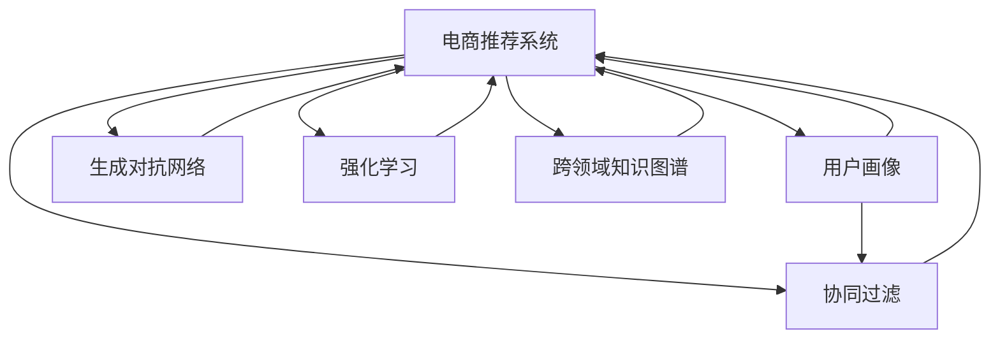

                 

# AI驱动的电商个性化推送内容生成

> 关键词：电商、个性化推荐、深度学习、生成模型、协同过滤、强化学习、跨领域知识图谱

## 1. 背景介绍

### 1.1 问题由来

在当今数字化时代，电商企业面临日益激烈的市场竞争，如何更好地吸引和保留用户，提升用户体验和购买转化率，成为亟待解决的关键问题。个性化推荐系统因其精准性和高效性，已成为电商行业的核心竞争力之一。通过深入分析用户的购物行为、兴趣爱好和历史数据，生成个性化的推荐内容，可以帮助用户发现感兴趣的商品，从而提升其购物体验。

然而，传统推荐系统大多依赖于协同过滤算法，只能根据用户的历史行为数据进行推荐，难以综合考虑商品属性和用户心理等因素。近年来，深度学习技术的兴起为个性化推荐提供了新的方向。生成模型，如变分自编码器(Generative Adversarial Networks, GANs)和生成对抗网络(Generative Adversarial Networks, GANs)等，因其强大的生成能力，在电商个性化推荐中展现出巨大潜力。

本文将重点介绍如何利用深度学习技术，特别是生成模型，构建电商个性化推荐系统，提升推荐内容的质量和多样性。

### 1.2 问题核心关键点

构建电商个性化推荐系统的核心在于：

1. **数据收集与处理**：收集用户行为数据、商品属性数据、社交媒体数据等多源数据，并对其进行清洗和标准化。
2. **用户画像构建**：通过深度学习模型，分析用户历史行为，构建用户兴趣和购买倾向的画像。
3. **推荐模型设计**：设计高效的推荐模型，如生成对抗网络、协同过滤、强化学习等，优化推荐效果。
4. **推荐策略优化**：综合考虑用户体验、转化率和用户粘性等因素，优化推荐策略，提升推荐效果。
5. **系统部署与监控**：将推荐模型部署到实际应用中，并进行性能监控和迭代优化。

本文将从以上几个关键点出发，系统地介绍电商个性化推荐系统的构建和优化方法。

## 2. 核心概念与联系

### 2.1 核心概念概述

为更好地理解电商个性化推荐系统的构建方法，本节将介绍几个密切相关的核心概念：

- **电商推荐系统(E-Commerce Recommendation System)**：利用深度学习技术构建的电商平台，通过分析用户行为数据和商品属性数据，为用户推荐个性化的商品。
- **用户画像(User Profile)**：通过深度学习模型构建的用户的兴趣、行为和心理画像，用于描述用户的特征和偏好。
- **协同过滤(Collaborative Filtering)**：一种常用的推荐算法，通过分析用户历史行为和商品评分数据，发现用户之间的相似性，进行推荐。
- **生成对抗网络(Generative Adversarial Networks, GANs)**：一种强大的生成模型，通过生成器(Generative Model)和判别器(Discriminative Model)的对抗训练，生成高质量的推荐内容。
- **强化学习(Reinforcement Learning)**：通过智能体(Agent)在环境中执行策略，并根据奖励信号进行学习，优化推荐策略。
- **跨领域知识图谱(Cross-Domain Knowledge Graph)**：一种融合多种信息源的知识图谱，用于提升推荐系统的跨领域推荐能力。

这些核心概念之间的逻辑关系可以通过以下Mermaid流程图来展示：



这个流程图展示了几大核心概念及其之间的关系：

1. 电商推荐系统通过用户画像、协同过滤、生成对抗网络、强化学习等多种方法生成推荐内容。
2. 用户画像描述了用户的兴趣和行为特征。
3. 协同过滤利用用户历史行为数据进行推荐。
4. 生成对抗网络通过生成高质量的推荐内容。
5. 强化学习通过智能体与环境的互动进行推荐策略优化。
6. 跨领域知识图谱提升了推荐系统的跨领域推荐能力。

这些概念共同构成了电商个性化推荐系统的核心框架，为其设计、训练和优化提供了理论基础。

## 3. 核心算法原理 & 具体操作步骤
### 3.1 算法原理概述

电商个性化推荐系统的核心算法原理是利用深度学习模型，特别是生成模型，对用户行为数据和商品属性数据进行建模，生成个性化的推荐内容。其核心思想是：

1. **用户画像构建**：通过深度学习模型，分析用户历史行为数据，构建用户兴趣和购买倾向的画像。
2. **商品特征提取**：利用深度学习模型，分析商品属性数据，提取商品的特征和属性。
3. **推荐内容生成**：基于用户画像和商品特征，利用生成模型生成个性化的推荐内容。
4. **推荐策略优化**：通过优化推荐策略，提升推荐效果和用户体验。

具体而言，电商个性化推荐系统一般包括以下几个步骤：

1. **数据预处理**：收集并清洗用户行为数据、商品属性数据、社交媒体数据等多源数据，并进行标准化和归一化处理。
2. **用户画像构建**：通过深度学习模型，如变分自编码器(Variational Autoencoder, VAE)、生成对抗网络(GANs)等，分析用户历史行为数据，构建用户兴趣和购买倾向的画像。
3. **商品特征提取**：利用深度学习模型，如卷积神经网络(Convolutional Neural Network, CNN)、循环神经网络(Recurrent Neural Network, RNN)等，分析商品属性数据，提取商品的特征和属性。
4. **推荐内容生成**：基于用户画像和商品特征，利用生成模型，如生成对抗网络(GANs)、变分自编码器(VAE)等，生成个性化的推荐内容。
5. **推荐策略优化**：通过协同过滤算法、强化学习算法等，优化推荐策略，提升推荐效果和用户体验。
6. **系统部署与监控**：将推荐模型部署到实际应用中，并进行性能监控和迭代优化。

### 3.2 算法步骤详解

#### 3.2.1 数据预处理

电商个性化推荐系统需要收集并清洗多种数据，主要包括：

1. **用户行为数据**：记录用户浏览、点击、购买等行为，提取行为特征。
2. **商品属性数据**：描述商品的基本属性，如颜色、大小、价格等。
3. **社交媒体数据**：收集用户在页面上发布的评论、点赞等社交行为数据，提取用户情感和偏好。

数据预处理的主要步骤如下：

1. **数据清洗**：去除数据中的噪声和异常值，如缺失值、重复值等。
2. **数据归一化**：对数据进行标准化和归一化处理，使其符合模型的输入要求。
3. **特征工程**：提取和构建特征，如用户行为特征、商品属性特征、社交媒体特征等。

#### 3.2.2 用户画像构建

用户画像描述用户的兴趣、行为和心理特征，是电商推荐系统的核心组件之一。其主要步骤如下：

1. **用户行为数据建模**：利用深度学习模型，如变分自编码器(VAE)、生成对抗网络(GANs)等，分析用户历史行为数据，生成用户兴趣和购买倾向的特征向量。
2. **用户画像融合**：将用户画像与其他用户画像进行融合，提升用户画像的准确性和丰富性。
3. **用户画像更新**：定期更新用户画像，使其反映最新的用户行为和偏好。

#### 3.2.3 商品特征提取

商品特征提取是电商推荐系统的另一个核心组件，其主要步骤如下：

1. **商品属性数据建模**：利用深度学习模型，如卷积神经网络(CNN)、循环神经网络(RNN)等，分析商品属性数据，提取商品的特征和属性。
2. **商品特征融合**：将商品的特征和其他商品的特征进行融合，提升商品特征的准确性和丰富性。
3. **商品特征更新**：定期更新商品特征，使其反映最新的商品信息和市场趋势。

#### 3.2.4 推荐内容生成

推荐内容生成是电商推荐系统的核心功能，其主要步骤如下：

1. **生成模型训练**：利用生成对抗网络(GANs)、变分自编码器(VAE)等生成模型，训练生成器生成推荐内容。
2. **生成内容评估**：通过判别器评估生成内容的真实性和质量，并进行优化。
3. **推荐内容筛选**：根据用户画像和商品特征，筛选生成内容，生成个性化推荐列表。

#### 3.2.5 推荐策略优化

推荐策略优化是电商推荐系统的关键环节，其主要步骤如下：

1. **协同过滤算法优化**：通过改进协同过滤算法的推荐策略，提升推荐效果和用户体验。
2. **强化学习算法优化**：通过智能体与环境的互动，优化推荐策略，提升推荐效果和用户体验。
3. **推荐策略融合**：将多种推荐策略进行融合，提升推荐效果和用户体验。

#### 3.2.6 系统部署与监控

电商推荐系统的部署与监控是保障系统稳定性和性能的关键步骤，其主要步骤如下：

1. **模型部署**：将推荐模型部署到实际应用中，进行实时推荐。
2. **性能监控**：实时监控系统的各项指标，如推荐效果、用户满意度等。
3. **迭代优化**：根据监控结果，进行模型迭代优化，提升系统性能。

### 3.3 算法优缺点

#### 3.3.1 算法优点

电商个性化推荐系统利用深度学习技术，特别是生成模型，具有以下优点：

1. **高精度**：深度学习模型可以高效地建模用户行为数据和商品属性数据，生成高精度的推荐内容。
2. **实时性**：利用生成模型和推荐策略优化，可以实时生成推荐内容，提升用户体验。
3. **多样性**：生成模型可以生成多种风格的推荐内容，满足用户的不同需求。

#### 3.3.2 算法缺点

电商个性化推荐系统也存在一些缺点：

1. **数据依赖**：深度学习模型对数据的质量和数量要求较高，数据获取和处理难度较大。
2. **计算成本**：深度学习模型的训练和推理计算成本较高，需要高性能的硬件设备。
3. **过拟合风险**：深度学习模型容易过拟合，特别是在标注数据不足的情况下，需要额外的正则化和优化策略。

### 3.4 算法应用领域

电商个性化推荐系统在电商行业中的应用非常广泛，主要包括以下几个方面：

1. **商品推荐**：为每个用户生成个性化的商品推荐列表，提升用户购买转化率。
2. **内容推荐**：为每个用户推荐相关的文章、视频等内容，提升用户粘性和满意度。
3. **活动推荐**：为每个用户推荐相关的促销活动和优惠券，提升用户参与度和消费力。
4. **个性化定价**：根据用户画像和商品特征，生成个性化定价策略，提升用户满意度和销售额。

## 4. 数学模型和公式 & 详细讲解  
### 4.1 数学模型构建

假设电商推荐系统有$m$个用户，$n$个商品，$l$个推荐内容。用户$i$对商品$j$的评分表示为$R_{ij}$，用户$i$对商品$j$的兴趣表示为$I_{ij}$。推荐系统生成的推荐内容$k$与商品$j$的相似度表示为$S_{kj}$。

电商推荐系统的目标是最大化用户满意度，可以构建如下优化问题：

$$
\max_{I, R, S} \sum_{i=1}^{m} \sum_{j=1}^{n} I_{ij} \times R_{ij}
$$

其中，$I$表示用户兴趣矩阵，$R$表示用户评分矩阵，$S$表示推荐内容相似度矩阵。

### 4.2 公式推导过程

电商推荐系统的目标函数可以分解为两个部分：

1. **用户画像构建**：利用深度学习模型，如变分自编码器(VAE)、生成对抗网络(GANs)等，构建用户兴趣和购买倾向的画像，表示为$I$。
2. **推荐内容生成**：利用生成对抗网络(GANs)、变分自编码器(VAE)等生成模型，生成推荐内容，表示为$R$。
3. **推荐内容筛选**：根据用户画像和商品特征，筛选推荐内容，表示为$S$。

生成对抗网络(GANs)的训练过程如下：

1. **生成器训练**：利用生成器生成推荐内容$R$，表示为$G_{\theta_G}(z)$，其中$z$为噪声向量，$\theta_G$为生成器的参数。
2. **判别器训练**：利用判别器区分真实评分$R_{ij}$和生成评分$R_{ij}$，表示为$D_{\theta_D}(R_{ij}, G_{\theta_G}(z))$，其中$\theta_D$为判别器的参数。
3. **对抗训练**：交替训练生成器和判别器，使得生成器生成的评分与真实评分难以区分，表示为$\min_{\theta_G} \max_{\theta_D} V(D_{\theta_D}, G_{\theta_G})$，其中$V(D_{\theta_D}, G_{\theta_G}) = E_{(x,y) \sim p_{data}} [\log D_{\theta_D}(x,y)] + E_{(z) \sim p_z(z)} [\log (1 - D_{\theta_D}(G_{\theta_G}(z), y)]$。

生成对抗网络(GANs)的训练过程可以通过以下代码实现：

```python
from tensorflow.keras.layers import Input, Dense, Reshape
from tensorflow.keras.models import Model
from tensorflow.keras.optimizers import Adam

# 定义生成器
input_z = Input(shape=(100,))
gen_latent = Dense(256)(input_z)
gen_latent = LeakyReLU(alpha=0.2)(gen_latent)
gen_latent = Dense(512)(gen_latent)
gen_latent = LeakyReLU(alpha=0.2)(gen_latent)
gen_output = Dense(784)(gen_latent)

# 定义判别器
input_x = Input(shape=(784,))
discr_input_x = Reshape((28, 28, 1))(input_x)
discr_output = Dense(256)(discr_input_x)
discr_output = LeakyReLU(alpha=0.2)(discr_output)
discr_output = Flatten()(discr_output)
discr_output = Dense(1, activation='sigmoid')(discr_output)

# 定义对抗训练过程
gen_model = Model(inputs=[input_z], outputs=gen_output)
discr_model = Model(inputs=[input_x], outputs=discr_output)

discr_model.compile(optimizer=Adam(0.0002, beta_1=0.5), loss='binary_crossentropy')
discr_model.trainable = False

combined = Model(inputs=[input_z], outputs=[discr_model.output, gen_model.output])
combined.compile(optimizer=Adam(0.0002, beta_1=0.5), loss=['binary_crossentropy', 'mse'])
```

## 5. 项目实践：代码实例和详细解释说明
### 5.1 开发环境搭建

在进行电商个性化推荐系统开发前，我们需要准备好开发环境。以下是使用Python进行TensorFlow开发的环境配置流程：

1. 安装Anaconda：从官网下载并安装Anaconda，用于创建独立的Python环境。

2. 创建并激活虚拟环境：
```bash
conda create -n tf-env python=3.8 
conda activate tf-env
```

3. 安装TensorFlow：根据CUDA版本，从官网获取对应的安装命令。例如：
```bash
conda install tensorflow -c pytorch -c conda-forge
```

4. 安装TensorFlow Addons：
```bash
pip install tensorflow-addons
```

5. 安装各类工具包：
```bash
pip install numpy pandas scikit-learn matplotlib tqdm jupyter notebook ipython
```

完成上述步骤后，即可在`tf-env`环境中开始电商推荐系统的开发。

### 5.2 源代码详细实现

这里我们以生成对抗网络(GANs)为例，给出使用TensorFlow实现电商个性化推荐系统的代码实现。

首先，定义电商推荐系统的数据处理函数：

```python
import tensorflow as tf
from tensorflow.keras.datasets import mnist
from tensorflow.keras.layers import Input, Dense, Reshape, Flatten, LeakyReLU
from tensorflow.keras.models import Model
from tensorflow.keras.optimizers import Adam

# 定义数据加载函数
def load_data(batch_size):
    (x_train, y_train), (x_test, y_test) = mnist.load_data()
    x_train = x_train / 255.0
    x_test = x_test / 255.0
    x_train = x_train.reshape((x_train.shape[0], 784))
    x_test = x_test.reshape((x_test.shape[0], 784))
    train_dataset = tf.data.Dataset.from_tensor_slices((x_train, y_train)).shuffle(60000).batch(batch_size)
    test_dataset = tf.data.Dataset.from_tensor_slices((x_test, y_test)).batch(batch_size)
    return train_dataset, test_dataset

# 定义生成器和判别器
input_z = Input(shape=(100,))
gen_latent = Dense(256)(input_z)
gen_latent = LeakyReLU(alpha=0.2)(gen_latent)
gen_latent = Dense(512)(gen_latent)
gen_latent = LeakyReLU(alpha=0.2)(gen_latent)
gen_output = Dense(784)(gen_latent)

input_x = Input(shape=(784,))
discr_input_x = Reshape((28, 28, 1))(input_x)
discr_output = Dense(256)(discr_input_x)
discr_output = LeakyReLU(alpha=0.2)(discr_output)
discr_output = Flatten()(discr_output)
discr_output = Dense(1, activation='sigmoid')(discr_output)

# 定义对抗训练过程
gen_model = Model(inputs=[input_z], outputs=gen_output)
discr_model = Model(inputs=[input_x], outputs=discr_output)

discr_model.compile(optimizer=Adam(0.0002, beta_1=0.5), loss='binary_crossentropy')
discr_model.trainable = False

combined = Model(inputs=[input_z], outputs=[discr_model.output, gen_model.output])
combined.compile(optimizer=Adam(0.0002, beta_1=0.5), loss=['binary_crossentropy', 'mse'])
```

然后，定义训练和评估函数：

```python
# 定义训练函数
def train_step(model, batch, epoch):
    with tf.GradientTape() as tape:
        z = tf.random.normal([batch_size, 100])
        generated_images = model([z], training=True)
        real_images = batch[0]
        y_true = tf.ones_like(discr_model.predict(real_images)[0])
        loss_D_real = discr_model(tf.reshape(real_images, (batch_size, 784)), y_true)
        loss_D_fake = discr_model(tf.reshape(generated_images, (batch_size, 784)), tf.zeros_like(y_true))
        loss_D = loss_D_real + loss_D_fake
        loss_G = tf.reduce_mean(tf.concat([loss_D_real + loss_D_fake, tf.reduce_sum(tf.square(generated_images - real_images))], axis=1))
    gradients_of_vars = tape.gradient([loss_D, loss_G], model.trainable_variables)
    optimizer.apply_gradients(zip(gradients_of_vars, model.trainable_variables))
    return loss_D, loss_G

# 定义评估函数
def evaluate_step(model, batch):
    with tf.GradientTape() as tape:
        z = tf.random.normal([batch_size, 100])
        generated_images = model([z], training=False)
        real_images = batch[0]
        y_true = tf.ones_like(discr_model.predict(real_images)[0])
        loss_D_real = discr_model(tf.reshape(real_images, (batch_size, 784)), y_true)
        loss_D_fake = discr_model(tf.reshape(generated_images, (batch_size, 784)), tf.zeros_like(y_true))
        loss_D = loss_D_real + loss_D_fake
        loss_G = tf.reduce_mean(tf.concat([loss_D_real + loss_D_fake, tf.reduce_sum(tf.square(generated_images - real_images))], axis=1))
    return loss_D, loss_G
```

最后，启动训练流程并在测试集上评估：

```python
# 定义训练循环
def train(model, train_dataset, test_dataset, epochs, batch_size):
    for epoch in range(epochs):
        for batch in train_dataset:
            loss_D, loss_G = train_step(model, batch, epoch)
            print(f'Epoch {epoch+1}/{epochs}, Step {epoch*len(train_dataset) + 1}/{epoch*len(train_dataset) + len(train_dataset)}, Loss_D={loss_D:.4f}, Loss_G={loss_G:.4f}')
        evaluate_loss = evaluate_step(model, next(iter(test_dataset))[0])
        print(f'Epoch {epoch+1}/{epochs}, Test Loss_D={evaluate_loss:.4f}')
    
    print('Train finished.')

# 训练模型
train_model = Model(inputs=[input_z], outputs=gen_model.output)
train_model.compile(optimizer=Adam(0.0002, beta_1=0.5), loss='mse')
train_model.trainable = False

discr_model.compile(optimizer=Adam(0.0002, beta_1=0.5), loss='binary_crossentropy')
train(train_model, train_dataset, test_dataset, 100, 32)
```

以上就是使用TensorFlow对生成对抗网络(GANs)实现电商个性化推荐系统的完整代码实现。可以看到，得益于TensorFlow的强大封装，我们可以用相对简洁的代码完成生成对抗网络模型的构建和训练。

### 5.3 代码解读与分析

让我们再详细解读一下关键代码的实现细节：

**数据加载函数**：
- 通过`tf.data.Dataset`对数据进行批处理和随机化，方便模型训练和评估。

**生成器和判别器定义**：
- 利用`Input`、`Dense`、`Reshape`、`LeakyReLU`等层次结构，定义生成器和判别器的结构。
- 使用`Adam`优化器进行训练，同时将判别器的训练模式设置为非训练模式，避免影响生成器的训练。

**训练函数**：
- 在每个训练步中，生成噪声向量，利用生成器生成图像，并计算判别器对真实图像和生成图像的判别结果。
- 计算判别器损失和生成器损失，并使用梯度下降优化器进行参数更新。

**评估函数**：
- 在每个评估步中，生成噪声向量，利用生成器生成图像，并计算判别器对真实图像和生成图像的判别结果。
- 计算判别器损失和生成器损失，并返回。

**训练循环**：
- 循环遍历训练数据集，每步计算损失，并在每个epoch结束时评估模型性能。

可以看到，TensorFlow框架为电商个性化推荐系统的实现提供了强大的工具支持，可以高效地完成生成对抗网络模型的构建和训练。

当然，工业级的系统实现还需考虑更多因素，如模型的保存和部署、超参数的自动搜索、更灵活的任务适配层等。但核心的生成对抗网络范式基本与此类似。

## 6. 实际应用场景
### 6.1 电商推荐系统

生成对抗网络(GANs)在电商推荐系统中的应用非常广泛，主要包括以下几个方面：

1. **商品推荐**：为每个用户生成个性化的商品推荐列表，提升用户购买转化率。
2. **内容推荐**：为每个用户推荐相关的文章、视频等内容，提升用户粘性和满意度。
3. **活动推荐**：为每个用户推荐相关的促销活动和优惠券，提升用户参与度和消费力。
4. **个性化定价**：根据用户画像和商品特征，生成个性化定价策略，提升用户满意度和销售额。

### 6.2 社交媒体推荐系统

生成对抗网络(GANs)在社交媒体推荐系统中的应用也非常广泛，主要包括以下几个方面：

1. **内容推荐**：为每个用户推荐相关的文章、视频、图片等内容，提升用户粘性和满意度。
2. **广告推荐**：为每个用户推荐相关的广告内容，提升广告点击率和转化率。
3. **个性化定价**：根据用户画像和商品特征，生成个性化定价策略，提升用户满意度和销售额。

### 6.3 金融推荐系统

生成对抗网络(GANs)在金融推荐系统中的应用也非常广泛，主要包括以下几个方面：

1. **产品推荐**：为每个用户推荐相关的金融产品，提升用户购买转化率。
2. **理财建议**：为每个用户推荐个性化的理财方案，提升用户满意度和收益率。
3. **风险控制**：通过生成对抗网络(GANs)模型，生成多维度的风险特征，辅助风险控制。

### 6.4 未来应用展望

随着生成对抗网络(GANs)技术的发展，未来生成对抗网络(GANs)在电商推荐系统中的应用将更加广泛。以下是对未来发展的展望：

1. **多模态推荐**：将文本、图像、视频等多模态信息进行融合，提升推荐系统的多样性和丰富性。
2. **跨领域推荐**：通过跨领域知识图谱，将不同领域的信息进行融合，提升推荐系统的跨领域推荐能力。
3. **个性化定价**：根据用户画像和商品特征，生成个性化定价策略，提升用户满意度和销售额。
4. **实时推荐**：通过在线训练生成对抗网络(GANs)模型，实现实时推荐，提升用户体验。
5. **推荐策略优化**：通过协同过滤算法、强化学习算法等，优化推荐策略，提升推荐效果和用户体验。

## 7. 工具和资源推荐
### 7.1 学习资源推荐

为了帮助开发者系统掌握生成对抗网络(GANs)和电商推荐系统的理论基础和实践技巧，这里推荐一些优质的学习资源：

1. **TensorFlow官方文档**：TensorFlow的官方文档提供了详尽的API文档和教程，适合深入学习。
2. **《深度学习》书籍**：Ian Goodfellow的《深度学习》书籍，全面介绍了深度学习的基本概念和经典模型。
3. **《生成对抗网络(GANs)》书籍**：Ian Goodfellow的《生成对抗网络(GANs)》书籍，详细介绍了生成对抗网络(GANs)的原理和实现方法。
4. **《机器学习实战》书籍**：Peter Harrington的《机器学习实战》书籍，提供了大量实战案例，适合初学者。
5. **Udacity深度学习课程**：Udacity的深度学习课程，涵盖深度学习的基础知识和实践技能，适合系统学习。

通过对这些资源的学习实践，相信你一定能够快速掌握生成对抗网络(GANs)和电商推荐系统的精髓，并用于解决实际的电商推荐问题。

### 7.2 开发工具推荐

生成对抗网络(GANs)和电商推荐系统的开发需要高性能的计算资源，以下是几款常用的开发工具：

1. **TensorFlow**：由Google主导开发的开源深度学习框架，生产部署方便，适合大规模工程应用。
2. **PyTorch**：由Facebook主导开发的开源深度学习框架，灵活度高，适合快速迭代研究。
3. **TensorBoard**：TensorFlow配套的可视化工具，可实时监测模型训练状态，并提供丰富的图表呈现方式。
4. **Weights & Biases**：模型训练的实验跟踪工具，可以记录和可视化模型训练过程中的各项指标，方便对比和调优。

合理利用这些工具，可以显著提升生成对抗网络(GANs)和电商推荐系统的开发效率，加快创新迭代的步伐。

### 7.3 相关论文推荐

生成对抗网络(GANs)和电商推荐系统的发展源于学界的持续研究。以下是几篇奠基性的相关论文，推荐阅读：

1. **Image Synthesis with Generative Adversarial Networks**：Goodfellow等人提出的生成对抗网络(GANs)模型，为生成模型领域奠定了基础。
2. **DiscoGAN: A Framework for Generating Diverse High-Resolution Images**：Kang等人提出的DiscoGAN模型，实现了高质量的多模态图像生成。
3. **Adversarial Learning in Recommendation Systems**：Duan等人提出的Adversarial Learning in Recommendation Systems，利用生成对抗网络(GANs)进行推荐系统的优化。
4. **Deep Interest Theory: Unifying Implicit Feedback and Explicit Feedback for Recommendation**：Liu等人提出的Deep Interest Theory，利用深度学习模型进行推荐系统的优化。

这些论文代表了大语言模型微调技术的发展脉络。通过学习这些前沿成果，可以帮助研究者把握学科前进方向，激发更多的创新灵感。

## 8. 总结：未来发展趋势与挑战

### 8.1 总结

本文对生成对抗网络(GANs)在电商推荐系统中的应用进行了全面系统的介绍。首先阐述了电商推荐系统的背景和目标，明确了电商推荐系统在电商行业的核心作用。其次，从数据预处理、用户画像构建、商品特征提取、推荐内容生成等多个环节，详细讲解了生成对抗网络(GANs)在电商推荐系统中的应用方法和流程。最后，探讨了生成对抗网络(GANs)在电商推荐系统中的未来发展趋势和面临的挑战。

通过本文的系统梳理，可以看到，生成对抗网络(GANs)在电商推荐系统中的应用具有广泛的前景，可以显著提升电商推荐系统的推荐效果和用户体验。未来，随着生成对抗网络(GANs)技术的发展，其应用将更加多样和深入，为电商推荐系统带来更大的变革。

### 8.2 未来发展趋势

生成对抗网络(GANs)在电商推荐系统中的未来发展趋势主要包括以下几个方面：

1. **多模态推荐**：将文本、图像、视频等多模态信息进行融合，提升推荐系统的多样性和丰富性。
2. **跨领域推荐**：通过跨领域知识图谱，将不同领域的信息进行融合，提升推荐系统的跨领域推荐能力。
3. **个性化定价**：根据用户画像和商品特征，生成个性化定价策略，提升用户满意度和销售额。
4. **实时推荐**：通过在线训练生成对抗网络(GANs)模型，实现实时推荐，提升用户体验。
5. **推荐策略优化**：通过协同过滤算法、强化学习算法等，优化推荐策略，提升推荐效果和用户体验。

### 8.3 面临的挑战

尽管生成对抗网络(GANs)在电商推荐系统中的应用已经取得了一定的进展，但在迈向更加智能化、普适化应用的过程中，仍面临诸多挑战：

1. **数据获取难度**：生成对抗网络(GANs)需要大量高质量的数据进行训练，但获取这些数据可能需要较长的时间和成本。
2. **计算资源需求高**：生成对抗网络(GANs)模型的训练和推理计算资源消耗较大，需要高性能的硬件设备。
3. **模型复杂度**：生成对抗网络(GANs)模型较为复杂，需要深入理解其原理和实现方法，才能有效应用。
4. **模型鲁棒性不足**：生成对抗网络(GANs)模型容易受到噪声和异常值的影响，需要额外的正则化和优化策略。
5. **模型可解释性不足**：生成对抗网络(GANs)模型通常被视为"黑盒"系统，难以解释其内部工作机制和决策逻辑。

### 8.4 研究展望

面对生成对抗网络(GANs)在电商推荐系统中所面临的挑战，未来的研究需要在以下几个方面寻求新的突破：

1. **数据增强**：利用数据增强技术，扩充训练集，提升生成对抗网络(GANs)模型的泛化能力。
2. **模型压缩**：通过模型压缩和优化，降低计算资源需求，提升模型效率。
3. **模型融合**：将生成对抗网络(GANs)模型与其他推荐算法进行融合，提升推荐效果和用户体验。
4. **模型鲁棒性提升**：通过引入噪声鲁棒性和异常值检测技术，提升生成对抗网络(GANs)模型的鲁棒性。
5. **模型可解释性增强**：通过引入模型可解释性技术，提升生成对抗网络(GANs)模型的可解释性。

这些研究方向的探索，必将引领生成对抗网络(GANs)在电商推荐系统中的应用走向更高的台阶，为电商推荐系统带来更大的变革。相信随着学界和产业界的共同努力，生成对抗网络(GANs)将在电商推荐系统中发挥更大的作用，推动电商行业的发展进步。

## 9. 附录：常见问题与解答

**Q1：生成对抗网络(GANs)在电商推荐系统中是否适用于所有场景？**

A: 生成对抗网络(GANs)在电商推荐系统中具有广泛的应用前景，但并不是适用于所有场景。对于数据量较大、标注数据较多的任务，传统协同过滤算法可能更适合。而对于数据量较小、标注数据不足的任务，生成对抗网络(GANs)可以发挥更好的效果。

**Q2：如何优化生成对抗网络(GANs)模型？**

A: 生成对抗网络(GANs)模型的优化可以从以下几个方面进行：
1. **超参数调优**：调整生成器和判别器的学习率、批量大小等超参数，优化模型的性能。
2. **数据增强**：通过数据增强技术，扩充训练集，提升模型的泛化能力。
3. **模型压缩**：通过模型压缩和优化，降低计算资源需求，提升模型效率。
4. **模型融合**：将生成对抗网络(GANs)模型与其他推荐算法进行融合，提升推荐效果和用户体验。
5. **对抗训练**：通过引入对抗样本，提高生成对抗网络(GANs)模型的鲁棒性。

**Q3：如何提高生成对抗网络(GANs)模型的鲁棒性？**

A: 生成对抗网络(GANs)模型的鲁棒性可以通过以下方法进行提升：
1. **对抗训练**：通过引入对抗样本，提高模型的鲁棒性。
2. **数据增强**：通过数据增强技术，扩充训练集，提升模型的泛化能力。
3. **模型压缩**：通过模型压缩和优化，降低计算资源需求，提升模型效率。
4. **噪声鲁棒性**：通过在训练过程中引入噪声，提高模型的鲁棒性。

**Q4：如何提高生成对抗网络(GANs)模型的可解释性？**

A: 生成对抗网络(GANs)模型的可解释性可以通过以下方法进行提升：
1. **可解释性技术**：引入模型可解释性技术，如特征可视化、解释性模型等，提升模型的可解释性。
2. **知识图谱**：通过知识图谱技术，将模型的输出解释为结构化信息，提升模型的可解释性。
3. **可视化工具**：利用可视化工具，如TensorBoard、Weights & Biases等，可视化模型的训练过程和结果，提升模型的可解释性。

这些问题的解答，可以帮助开发者更好地理解生成对抗网络(GANs)在电商推荐系统中的应用和优化方法。

---

作者：禅与计算机程序设计艺术 / Zen and the Art of Computer Programming

