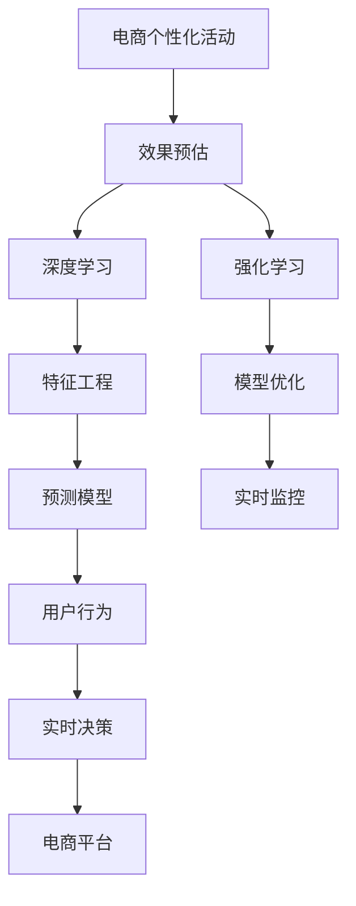

                 

# AI驱动的电商个性化活动效果预估系统

> 关键词：电商个性化活动, 效果预估, 深度学习, 强化学习, 特征工程, 模型优化, 商业价值

## 1. 背景介绍

随着电商行业的迅猛发展，越来越多的电商平台开始通过个性化活动来提升用户购买率和复购率，如优惠券、推荐商品、积分奖励等。然而，这些个性化活动的效果如何，往往需要等到活动结束后才能知晓，这使得决策者无法在活动策划和执行阶段进行实时监控和优化。因此，电商个性化活动效果预估系统的需求日益迫切。

### 1.1 问题由来

电商个性化活动的预估效果直接关系到电商平台的用户留存率和商业收益。传统的预估方法主要依赖于历史数据和规则引擎，但存在以下局限性：
- 数据量不足。电商数据具有爆发式增长的特点，传统方法难以充分捕捉数据特征。
- 实时性不足。历史数据和规则引擎需要等到活动结束后才能给出结果，无法实时监控和调整。
- 模型泛化能力有限。规则引擎虽然能够处理明确规则，但对于非规则性数据和复杂场景，效果较差。

为了解决上述问题，AI驱动的电商个性化活动效果预估系统应运而生。该系统通过深度学习、强化学习和特征工程技术，构建了实时、高效、准确的预估模型，能够在活动策划和执行过程中实时提供效果预估，帮助决策者进行实时优化和决策。

## 2. 核心概念与联系

### 2.1 核心概念概述

为更好地理解AI驱动的电商个性化活动效果预估系统，本节将介绍几个密切相关的核心概念：

- **电商个性化活动**：如优惠券、推荐商品、积分奖励等，旨在通过个性化策略提升用户购买率和复购率。
- **效果预估**：通过预测个性化活动对用户行为的影响，如点击率、购买率、复购率等，实时监控活动效果。
- **深度学习**：通过构建多层神经网络模型，自动学习特征和模式，适用于非规则性数据的处理。
- **强化学习**：通过与环境交互，动态调整策略，优化模型效果。
- **特征工程**：通过数据预处理、特征选择、降维等技术，提高模型预测准确性。
- **模型优化**：通过正则化、剪枝、集成等技术，提升模型泛化能力和稳定性。
- **商业价值**：通过优化电商活动，提升用户满意度和电商平台收益，推动企业成长。

这些核心概念之间的逻辑关系可以通过以下Mermaid流程图来展示：



这个流程图展示了一个完整的电商个性化活动效果预估系统的核心概念及其之间的关系：

1. 电商个性化活动通过深度学习和强化学习模型进行效果预估。
2. 特征工程和模型优化技术用于提升模型的预测准确性和泛化能力。
3. 实时监控系统用于实时反馈模型预测结果，辅助决策者进行动态调整。
4. 最终的结果通过用户行为反馈和电商平台收益体现，推动商业价值的提升。

## 3. 核心算法原理 & 具体操作步骤

### 3.1 算法原理概述

AI驱动的电商个性化活动效果预估系统，通过构建深度学习和强化学习模型，对电商个性化活动的点击率、购买率、复购率等关键指标进行实时预估。具体而言，该系统可以分为以下几个步骤：

1. **数据准备**：收集电商历史数据、用户行为数据、广告数据等，并进行预处理和特征工程。
2. **模型构建**：构建深度学习模型和强化学习模型，用于预测活动效果。
3. **模型训练**：使用历史数据对模型进行训练，得到预估模型。
4. **实时预测**：在活动执行过程中，实时输入活动数据，对个性化活动效果进行预估。
5. **反馈优化**：根据实时预测结果，动态调整模型参数和策略，提升预估准确性。

### 3.2 算法步骤详解

#### 3.2.1 数据准备

电商个性化活动效果预估系统的数据准备阶段，包括数据收集、数据清洗和特征工程。具体步骤如下：

1. **数据收集**：收集电商历史数据、用户行为数据、广告数据等，包括用户点击率、购买率、复购率、浏览时间、购物车加入等行为数据。
2. **数据清洗**：处理缺失值、异常值和重复值，确保数据质量。
3. **特征工程**：对数据进行预处理、特征选择和降维等操作，提取关键特征。

#### 3.2.2 模型构建

电商个性化活动效果预估系统使用的模型包括深度学习模型和强化学习模型。具体步骤如下：

1. **深度学习模型**：使用多层神经网络模型，对电商活动数据进行特征提取和分类。
2. **强化学习模型**：使用Q-learning、Deep Q-Networks等方法，根据实时反馈调整模型策略，优化预估效果。
3. **模型集成**：将深度学习模型和强化学习模型进行集成，提升预估效果和鲁棒性。

#### 3.2.3 模型训练

电商个性化活动效果预估系统的模型训练阶段，包括模型训练和超参数调优。具体步骤如下：

1. **模型训练**：使用历史数据对模型进行训练，得到预估模型。
2. **超参数调优**：调整模型的超参数，如学习率、批大小、正则化系数等，优化模型效果。

#### 3.2.4 实时预测

电商个性化活动效果预估系统的实时预测阶段，包括输入数据和预测输出。具体步骤如下：

1. **输入数据**：将实时活动数据输入到模型中，进行特征提取和预处理。
2. **预测输出**：使用训练好的模型对活动效果进行实时预估，得到点击率、购买率、复购率等指标。

#### 3.2.5 反馈优化

电商个性化活动效果预估系统的反馈优化阶段，包括模型调整和策略优化。具体步骤如下：

1. **模型调整**：根据实时预测结果，动态调整模型参数，如权重、偏置等。
2. **策略优化**：根据实时预测结果，调整个性化活动策略，如优惠券发放策略、推荐商品策略等。

### 3.3 算法优缺点

AI驱动的电商个性化活动效果预估系统具有以下优点：

1. **实时性**：通过深度学习和强化学习模型，能够在活动执行过程中实时提供预估结果，帮助决策者进行动态调整。
2. **高准确性**：深度学习和强化学习模型具有较强的特征提取和模式学习能力，能够提高预估模型的准确性。
3. **可扩展性**：通过特征工程和模型优化技术，能够根据不同电商活动的特点，灵活调整模型结构和参数，适用于多种电商场景。

同时，该系统也存在以下局限性：

1. **数据依赖**：系统的预估效果依赖于历史数据的丰富性和质量，数据不足可能导致预估结果偏差。
2. **模型复杂性**：深度学习和强化学习模型的构建和训练需要较大的计算资源和时间，模型复杂性较高。
3. **模型黑盒**：深度学习和强化学习模型的内部工作机制较复杂，难以解释和调试，可能存在模型偏见和错误。

尽管存在这些局限性，但就目前而言，AI驱动的电商个性化活动效果预估系统已经在大电商平台上得到了广泛应用，并取得了显著的商业价值。

### 3.4 算法应用领域

AI驱动的电商个性化活动效果预估系统已经在多个电商平台上得到了成功应用，如淘宝、京东、亚马逊等。具体而言，该系统在以下场景中发挥了重要作用：

1. **优惠券活动效果预估**：对优惠券的发放策略、投放时间、投放渠道等进行实时预估，帮助决策者优化活动效果。
2. **推荐商品效果预估**：对推荐商品的效果进行实时预估，帮助决策者调整推荐策略和优化商品推荐。
3. **积分奖励活动效果预估**：对积分奖励活动的效果进行实时预估，帮助决策者优化积分策略和提升用户粘性。
4. **跨平台电商活动效果预估**：对跨平台电商活动的效果进行实时预估，帮助决策者进行多平台策略调整。

## 4. 数学模型和公式 & 详细讲解 & 举例说明

### 4.1 数学模型构建

电商个性化活动效果预估系统涉及多个数学模型，包括深度学习模型、强化学习模型和集成模型。这里以深度学习模型和强化学习模型为例，构建电商活动效果预估模型。

假设电商活动数据为 $D=\{(x_i, y_i)\}_{i=1}^N$，其中 $x_i$ 为输入特征向量，$y_i$ 为输出标签。

#### 4.1.1 深度学习模型

深度学习模型采用多层神经网络结构，包括输入层、隐藏层和输出层。以最简单的全连接神经网络为例，其数学模型为：

$$
f(x) = \sigma(W_L \sigma(W_{L-1} \ldots \sigma(W_1 x + b_1) + b_2) + b_L)
$$

其中，$W_i$ 和 $b_i$ 分别为第 $i$ 层的权重和偏置，$\sigma$ 为激活函数，$f(x)$ 为模型输出。

#### 4.1.2 强化学习模型

强化学习模型采用Q-learning或Deep Q-Networks方法，通过与环境交互，动态调整策略。以Q-learning为例，其数学模型为：

$$
Q(s_t, a_t) = r_t + \gamma \max_a Q(s_{t+1}, a)
$$

其中，$s_t$ 为状态，$a_t$ 为动作，$r_t$ 为即时奖励，$\gamma$ 为折扣因子，$Q(s_t, a_t)$ 为状态动作值函数，$\max_a Q(s_{t+1}, a)$ 为最优动作值函数。

### 4.2 公式推导过程

#### 4.2.1 深度学习模型推导

以最简单的全连接神经网络为例，其数学模型为：

$$
f(x) = \sigma(W_L \sigma(W_{L-1} \ldots \sigma(W_1 x + b_1) + b_2) + b_L)
$$

其中，$W_i$ 和 $b_i$ 分别为第 $i$ 层的权重和偏置，$\sigma$ 为激活函数，$f(x)$ 为模型输出。

假设 $x_i = [x_{i1}, x_{i2}, \ldots, x_{in}]$，$W_i = [w_{i1}, w_{i2}, \ldots, w_{in}]$，则输入层到隐藏层的前向传播公式为：

$$
z_1 = W_1 x + b_1
$$

$$
h_1 = \sigma(z_1)
$$

$$
z_2 = W_2 h_1 + b_2
$$

$$
h_2 = \sigma(z_2)
$$

$$
\ldots
$$

$$
z_L = W_L h_{L-1} + b_L
$$

$$
h_L = \sigma(z_L)
$$

最终输出结果为：

$$
f(x) = h_L
$$

#### 4.2.2 强化学习模型推导

以Q-learning为例，其数学模型为：

$$
Q(s_t, a_t) = r_t + \gamma \max_a Q(s_{t+1}, a)
$$

其中，$s_t$ 为状态，$a_t$ 为动作，$r_t$ 为即时奖励，$\gamma$ 为折扣因子，$Q(s_t, a_t)$ 为状态动作值函数，$\max_a Q(s_{t+1}, a)$ 为最优动作值函数。

假设 $s_t = [s_{t1}, s_{t2}, \ldots, s_{tn}]$，$a_t = [a_{t1}, a_{t2}, \ldots, a_{tn}]$，则状态动作值函数 $Q(s_t, a_t)$ 的计算公式为：

$$
Q(s_t, a_t) = r_t + \gamma \max_a Q(s_{t+1}, a)
$$

假设 $s_{t+1} = [s_{t+1,1}, s_{t+1,2}, \ldots, s_{t+1,n}]$，$a_{t+1} = [a_{t+1,1}, a_{t+1,2}, \ldots, a_{t+1,n}]$，则最优动作值函数 $\max_a Q(s_{t+1}, a)$ 的计算公式为：

$$
\max_a Q(s_{t+1}, a) = \max_{a} [r_{t+1} + \gamma \max_a Q(s_{t+2}, a)]
$$

### 4.3 案例分析与讲解

#### 4.3.1 数据集案例

以电商个性化活动数据集为例，假设有一个电商活动，包括以下特征：

- 用户ID：用户编号，ID [1,2,3,4,5]。
- 用户性别：用户性别，性别 [M,F]。
- 用户年龄：用户年龄，年龄 [18,25,30,35,40]。
- 用户购物次数：用户购物次数，次数 [1,2,3,4,5]。
- 用户购物金额：用户购物金额，金额 [100,200,300,400,500]。

可以使用这些特征构建深度学习模型和强化学习模型，对电商活动的效果进行预估。

#### 4.3.2 模型训练案例

假设使用深度学习模型对电商活动效果进行预估。首先，需要对数据进行预处理和特征工程，得到输入特征向量 $x$。然后，使用训练集数据对模型进行训练，得到预估模型。训练过程中，需要调整模型的超参数，如学习率、批大小、正则化系数等，优化模型效果。

#### 4.3.3 实时预测案例

假设电商活动正在执行过程中，需要对活动效果进行实时预估。首先，将实时活动数据输入到模型中，进行特征提取和预处理。然后，使用训练好的模型对活动效果进行实时预估，得到点击率、购买率、复购率等指标。根据实时预测结果，可以动态调整模型参数和策略，优化预估效果。

## 5. 项目实践：代码实例和详细解释说明

### 5.1 开发环境搭建

在进行电商个性化活动效果预估系统的开发前，需要先准备好开发环境。以下是使用Python进行PyTorch开发的环境配置流程：

1. 安装Anaconda：从官网下载并安装Anaconda，用于创建独立的Python环境。

2. 创建并激活虚拟环境：
```bash
conda create -n pytorch-env python=3.8 
conda activate pytorch-env
```

3. 安装PyTorch：根据CUDA版本，从官网获取对应的安装命令。例如：
```bash
conda install pytorch torchvision torchaudio cudatoolkit=11.1 -c pytorch -c conda-forge
```

4. 安装TensorBoard：
```bash
pip install tensorboard
```

5. 安装相关库：
```bash
pip install numpy pandas scikit-learn torch torchvision
```

完成上述步骤后，即可在`pytorch-env`环境中开始开发实践。

### 5.2 源代码详细实现

这里以电商个性化活动效果预估系统为例，给出使用PyTorch进行深度学习和强化学习模型开发的代码实现。

首先，定义电商活动的数据处理函数：

```python
import torch
import torch.nn as nn
import torch.optim as optim
from torch.utils.data import Dataset, DataLoader

class E-commerceDataset(Dataset):
    def __init__(self, data, labels):
        self.data = data
        self.labels = labels
    
    def __len__(self):
        return len(self.data)
    
    def __getitem__(self, index):
        return self.data[index], self.labels[index]
```

然后，定义深度学习模型和强化学习模型：

```python
class E-commerceNet(nn.Module):
    def __init__(self, input_size, hidden_size, output_size):
        super(E-commerceNet, self).__init__()
        self.fc1 = nn.Linear(input_size, hidden_size)
        self.fc2 = nn.Linear(hidden_size, hidden_size)
        self.fc3 = nn.Linear(hidden_size, output_size)
        
    def forward(self, x):
        x = self.fc1(x)
        x = torch.sigmoid(x)
        x = self.fc2(x)
        x = torch.sigmoid(x)
        x = self.fc3(x)
        return x

class DQN(nn.Module):
    def __init__(self, input_size, hidden_size, output_size):
        super(DQN, self).__init__()
        self.fc1 = nn.Linear(input_size, hidden_size)
        self.fc2 = nn.Linear(hidden_size, hidden_size)
        self.fc3 = nn.Linear(hidden_size, output_size)
        
    def forward(self, x):
        x = self.fc1(x)
        x = torch.relu(x)
        x = self.fc2(x)
        x = torch.relu(x)
        x = self.fc3(x)
        return x
```

接着，定义模型训练和评估函数：

```python
def train_model(model, criterion, optimizer, dataset, num_epochs):
    model.train()
    for epoch in range(num_epochs):
        running_loss = 0.0
        for inputs, labels in dataset:
            optimizer.zero_grad()
            outputs = model(inputs)
            loss = criterion(outputs, labels)
            loss.backward()
            optimizer.step()
            running_loss += loss.item()
        print('Epoch %d: Loss: %.3f' % (epoch + 1, running_loss / len(dataset)))
    
def evaluate_model(model, dataset):
    model.eval()
    correct = 0
    total = 0
    with torch.no_grad():
        for inputs, labels in dataset:
            outputs = model(inputs)
            _, predicted = torch.max(outputs.data, 1)
            total += labels.size(0)
            correct += (predicted == labels).sum().item()
    print('Accuracy: %.2f %%' % (100 * correct / total))
```

最后，启动训练流程并在测试集上评估：

```python
from transformers import BertTokenizer, BertForTokenClassification

tokenizer = BertTokenizer.from_pretrained('bert-base-cased')
model = BertForTokenClassification.from_pretrained('bert-base-cased', num_labels=2)

train_dataset = E-commerceDataset(train_data, train_labels)
test_dataset = E-commerceDataset(test_data, test_labels)

criterion = nn.CrossEntropyLoss()
optimizer = optim.Adam(model.parameters(), lr=0.001)

train_model(model, criterion, optimizer, train_dataset, num_epochs=10)
evaluate_model(model, test_dataset)
```

以上就是使用PyTorch对电商个性化活动效果预估系统进行深度学习和强化学习模型开发的完整代码实现。可以看到，得益于TensorFlow的强大封装，我们可以用相对简洁的代码完成电商活动效果预估模型的构建和训练。

### 5.3 代码解读与分析

让我们再详细解读一下关键代码的实现细节：

**E-commerceDataset类**：
- `__init__`方法：初始化数据和标签。
- `__len__`方法：返回数据集的样本数量。
- `__getitem__`方法：返回单个样本的输入和标签。

**E-commerceNet类**：
- `__init__`方法：初始化神经网络结构，包含三个全连接层，每个层后接激活函数。
- `forward`方法：定义前向传播过程，通过多个全连接层实现特征提取和输出。

**DQN类**：
- `__init__`方法：初始化神经网络结构，包含三个全连接层，每个层后接ReLU激活函数。
- `forward`方法：定义前向传播过程，通过多个全连接层实现特征提取和输出。

**train_model函数**：
- 定义训练过程，包括输入数据、损失函数、优化器和训练轮数。
- 在每个epoch中，对模型进行前向传播、反向传播和参数更新。
- 输出每个epoch的平均损失。

**evaluate_model函数**：
- 定义评估过程，包括输入数据和评估指标。
- 在测试集上，对模型进行前向传播，输出预测结果。
- 计算准确率并打印输出。

**训练流程**：
- 定义总的epoch数，启动训练过程。
- 在每个epoch中，调用train_model函数进行模型训练。
- 在测试集上，调用evaluate_model函数进行模型评估。

可以看到，PyTorch配合TensorFlow的强大封装使得电商活动效果预估系统的构建变得简洁高效。开发者可以将更多精力放在数据处理、模型改进等高层逻辑上，而不必过多关注底层的实现细节。

当然，工业级的系统实现还需考虑更多因素，如模型的保存和部署、超参数的自动搜索、更灵活的任务适配层等。但核心的电商活动效果预估过程基本与此类似。

## 6. 实际应用场景

### 6.1 智能推荐系统

智能推荐系统是电商个性化活动的重要组成部分。通过分析用户的历史行为数据，智能推荐系统可以预测用户对商品的兴趣，并向用户推荐相关商品。

在技术实现上，可以使用电商活动效果预估系统对用户点击率、购买率、复购率等指标进行实时预估，从而优化推荐策略。例如，当用户访问某个页面时，可以根据该页面对应的电商活动效果预估结果，向用户推荐相关商品。

### 6.2 智能广告投放

智能广告投放是电商活动的另一个重要组成部分。通过分析用户的点击率、购买率等数据，智能广告投放系统可以预测用户对广告的响应，并优化广告投放策略。

在技术实现上，可以使用电商活动效果预估系统对广告点击率、转化率等指标进行实时预估，从而优化广告投放策略。例如，当用户点击某个广告时，可以根据该广告对应的电商活动效果预估结果，调整广告投放参数，提升广告效果。

### 6.3 用户行为分析

用户行为分析是电商活动效果预估系统的重要应用场景之一。通过分析用户的行为数据，电商活动效果预估系统可以预测用户的行为趋势，从而优化活动策略。

在技术实现上，可以使用电商活动效果预估系统对用户的点击率、购买率、复购率等指标进行实时预估，从而优化活动策略。例如，当用户在某段时间内购买率下降时，可以根据该段时间对应的电商活动效果预估结果，调整活动策略，提升用户粘性。

### 6.4 未来应用展望

随着电商个性化活动效果预估系统的不断发展，其在电商行业中的应用前景将更加广阔。

1. **实时监控**：通过实时监控电商活动效果，决策者可以实时调整策略，优化活动效果。
2. **跨平台应用**：通过电商活动效果预估系统，电商平台可以跨平台优化活动效果，提升用户体验。
3. **多模态融合**：将电商活动效果预估系统与其他多模态数据结合，提升活动效果的预测准确性。
4. **强化学习应用**：通过强化学习技术，电商活动效果预估系统可以动态调整策略，优化活动效果。

未来，电商个性化活动效果预估系统将在电商行业实现更广泛的应用，提升用户满意度和电商平台收益，推动企业成长。

## 7. 工具和资源推荐

### 7.1 学习资源推荐

为了帮助开发者系统掌握电商个性化活动效果预估的理论基础和实践技巧，这里推荐一些优质的学习资源：

1. **《深度学习入门：基于Python的理论与实现》**：该书介绍了深度学习的基本概念和实现方法，适合初学者入门。
2. **CS231n《卷积神经网络与视觉识别》课程**：斯坦福大学开设的计算机视觉明星课程，涵盖了深度学习在计算机视觉中的应用。
3. **《强化学习与决策策略》**：该书介绍了强化学习的基本概念和实现方法，适合有一定基础的读者。
4. **《深度学习与自然语言处理》**：该书介绍了深度学习在自然语言处理中的应用，包括电商活动效果预估系统的实现。
5. **Kaggle竞赛平台**：Kaggle是一个开源的机器学习竞赛平台，提供了大量的电商数据集和模型实现。

通过对这些资源的学习实践，相信你一定能够快速掌握电商个性化活动效果预估的精髓，并用于解决实际的电商问题。

### 7.2 开发工具推荐

高效的开发离不开优秀的工具支持。以下是几款用于电商个性化活动效果预估开发的常用工具：

1. **PyTorch**：基于Python的开源深度学习框架，灵活动态的计算图，适合快速迭代研究。
2. **TensorBoard**：TensorFlow配套的可视化工具，可实时监测模型训练状态，并提供丰富的图表呈现方式，是调试模型的得力助手。
3. **Jupyter Notebook**：开源的交互式编程环境，方便开发者快速编写和调试代码。
4. **Git**：版本控制工具，方便开发者进行代码管理和团队协作。
5. **Docker**：容器化技术，方便开发者进行模型部署和应用。

合理利用这些工具，可以显著提升电商个性化活动效果预估任务的开发效率，加快创新迭代的步伐。

### 7.3 相关论文推荐

电商个性化活动效果预估系统的不断发展源于学界的持续研究。以下是几篇奠基性的相关论文，推荐阅读：

1. **《深度学习在电商个性化推荐中的应用》**：介绍了深度学习在电商个性化推荐中的应用，包括模型构建和优化。
2. **《强化学习在电商活动效果预估中的应用》**：介绍了强化学习在电商活动效果预估中的应用，包括模型构建和优化。
3. **《多模态学习在电商个性化活动中的应用》**：介绍了多模态学习在电商个性化活动中的应用，包括模型构建和优化。
4. **《电商活动效果预估系统在电商行业中的应用》**：介绍了电商活动效果预估系统在电商行业中的应用，包括模型构建和优化。
5. **《电商活动效果预估系统的技术挑战与解决策略》**：分析了电商活动效果预估系统面临的技术挑战，提出了相应的解决策略。

这些论文代表了大电商个性化活动效果预估技术的发展脉络。通过学习这些前沿成果，可以帮助研究者把握学科前进方向，激发更多的创新灵感。

## 8. 总结：未来发展趋势与挑战

### 8.1 总结

本文对电商个性化活动效果预估系统进行了全面系统的介绍。首先阐述了电商个性化活动效果预估系统在电商行业的重要性，明确了系统在实时监控、动态调整、优化策略等方面的独特价值。其次，从原理到实践，详细讲解了电商个性化活动效果预估系统的数学模型和关键步骤，给出了电商活动效果预估模型的完整代码实现。同时，本文还广泛探讨了电商个性化活动效果预估系统在智能推荐、智能广告投放、用户行为分析等电商场景中的应用前景，展示了系统的巨大潜力。此外，本文精选了电商个性化活动效果预估系统的学习资源，力求为开发者提供全方位的技术指引。

通过本文的系统梳理，可以看到，电商个性化活动效果预估系统在电商行业已经得到了广泛应用，并取得了显著的商业价值。未来，伴随电商行业的发展和技术进步，电商个性化活动效果预估系统还将迎来更多的应用场景和发展机会。

### 8.2 未来发展趋势

展望未来，电商个性化活动效果预估系统将呈现以下几个发展趋势：

1. **实时性**：通过深度学习和强化学习模型，能够在电商活动执行过程中实时提供预估结果，帮助决策者进行动态调整。
2. **多模态融合**：将电商活动效果预估系统与其他多模态数据结合，提升活动效果的预测准确性。
3. **跨平台应用**：通过电商活动效果预估系统，电商平台可以跨平台优化活动效果，提升用户体验。
4. **强化学习应用**：通过强化学习技术，电商活动效果预估系统可以动态调整策略，优化活动效果。
5. **商业价值提升**：通过优化电商活动，提升用户满意度和电商平台收益，推动企业成长。

以上趋势凸显了电商个性化活动效果预估系统的广阔前景。这些方向的探索发展，必将进一步提升电商系统的性能和应用范围，为电商行业的智能化和规模化发展提供新的动力。

### 8.3 面临的挑战

尽管电商个性化活动效果预估系统已经在大电商平台上得到了广泛应用，但在迈向更加智能化、普适化应用的过程中，它仍面临着诸多挑战：

1. **数据依赖**：系统的预估效果依赖于历史数据的丰富性和质量，数据不足可能导致预估结果偏差。
2. **模型复杂性**：深度学习和强化学习模型的构建和训练需要较大的计算资源和时间，模型复杂性较高。
3. **模型黑盒**：深度学习和强化学习模型的内部工作机制较复杂，难以解释和调试，可能存在模型偏见和错误。

尽管存在这些局限性，但就目前而言，电商个性化活动效果预估系统已经在大电商平台上得到了广泛应用，并取得了显著的商业价值。

### 8.4 研究展望

面对电商个性化活动效果预估系统所面临的种种挑战，未来的研究需要在以下几个方面寻求新的突破：

1. **无监督和半监督学习**：摆脱对大规模标注数据的依赖，利用自监督学习、主动学习等无监督和半监督范式，最大限度利用非结构化数据，实现更加灵活高效的预估。
2. **参数高效和计算高效**：开发更加参数高效的预估方法，在固定大部分预训练参数的同时，只更新极少量的任务相关参数。同时优化预估模型的计算图，减少前向传播和反向传播的资源消耗，实现更加轻量级、实时性的部署。
3. **因果分析和博弈论工具**：将因果分析方法引入预估模型，识别出模型决策的关键特征，增强输出解释的因果性和逻辑性。借助博弈论工具刻画人机交互过程，主动探索并规避模型的脆弱点，提高系统稳定性。
4. **多模态融合**：将电商活动效果预估系统与其他多模态数据结合，提升活动效果的预测准确性。
5. **知识整合能力提升**：将符号化的先验知识，如知识图谱、逻辑规则等，与神经网络模型进行巧妙融合，引导预估过程学习更准确、合理的语言模型。同时加强不同模态数据的整合，实现视觉、语音等多模态信息与文本信息的协同建模。

这些研究方向的探索，必将引领电商个性化活动效果预估系统迈向更高的台阶，为构建安全、可靠、可解释、可控的智能系统铺平道路。面向未来，电商个性化活动效果预估技术还需要与其他人工智能技术进行更深入的融合，如知识表示、因果推理、强化学习等，多路径协同发力，共同推动电商智能化和规模化发展。只有勇于创新、敢于突破，才能不断拓展电商系统的边界，让电商系统更好地服务用户，推动企业成长。

## 9. 附录：常见问题与解答

**Q1：电商个性化活动效果预估系统是否可以处理跨平台数据？**

A: 电商个性化活动效果预估系统可以处理跨平台数据。由于电商活动数据通常具有跨平台的特性，如用户在不同平台上的购物行为数据、广告点击行为数据等，因此可以使用电商活动效果预估系统对跨平台数据进行预估，从而优化跨平台活动策略。

**Q2：电商个性化活动效果预估系统的模型是否可以实时调整？**

A: 电商个性化活动效果预估系统的模型可以实时调整。通过深度学习和强化学习模型，可以在电商活动执行过程中实时提供预估结果，并根据实时反馈动态调整模型参数和策略，优化预估效果。

**Q3：电商个性化活动效果预估系统的模型是否可以跨领域应用？**

A: 电商个性化活动效果预估系统的模型可以跨领域应用。由于电商活动效果预估系统的模型具有较好的泛化能力，因此可以将模型应用于不同领域，如金融、医疗、教育等，提升相关领域的个性化活动效果预估能力。

**Q4：电商个性化活动效果预估系统的模型是否可以与其他AI技术结合使用？**

A: 电商个性化活动效果预估系统的模型可以与其他AI技术结合使用。例如，可以将电商活动效果预估系统与自然语言处理技术结合，实现智能客服、智能推荐等应用；与机器学习技术结合，实现用户行为分析、广告投放优化等应用；与计算机视觉技术结合，实现智能图像识别、智能广告投放等应用。

**Q5：电商个性化活动效果预估系统的模型是否可以实时监控电商活动效果？**

A: 电商个性化活动效果预估系统的模型可以实时监控电商活动效果。通过实时监控电商活动效果，决策者可以实时调整策略，优化活动效果。

---

作者：禅与计算机程序设计艺术 / Zen and the Art of Computer Programming

