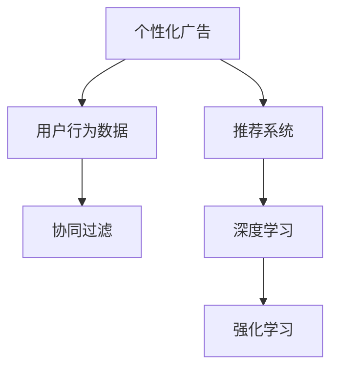

                 

# AI驱动的电商平台个性化广告投放

## 1. 背景介绍

### 1.1 问题由来
随着电子商务的快速发展，电商平台已经成为了消费者获取商品信息的重要渠道。传统电商平台往往采用“一刀切”的广告投放策略，对所有用户投放相同或相似的广告，这样的方式不仅浪费广告预算，也无法满足不同用户的需求和偏好，降低了用户转化率和平台收益。因此，个性化广告投放成为了电商平台提升用户体验和广告效果的关键策略。

### 1.2 问题核心关键点
个性化广告投放的本质在于通过机器学习算法分析用户行为数据，预测用户的偏好和需求，从而实现精准投放。关键在于如何设计有效的预测模型，提取和融合用户的兴趣特征，以及如何在有限的预算下最大化广告效果。

## 2. 核心概念与联系

### 2.1 核心概念概述

为更好地理解基于AI的电商平台个性化广告投放方法，本节将介绍几个密切相关的核心概念：

- **个性化广告**：根据用户的历史行为、兴趣偏好、实时环境等特征，向用户展示与其需求和兴趣相关的广告内容。

- **用户行为数据**：用户在电商平台上的浏览、点击、购买等操作数据，是广告投放模型训练和预测的基础。

- **推荐系统**：通过机器学习算法，为用户推荐可能感兴趣的商品或内容，本质上也是一种个性化策略。

- **协同过滤**：基于用户之间行为和兴趣的相似性进行推荐，如基于用户的协同过滤推荐系统。

- **深度学习**：利用神经网络模型对用户行为数据进行建模，提取高层次特征，提升广告投放的精准度。

- **强化学习**：通过奖励机制优化广告投放策略，提高广告点击率和转化率。

这些核心概念之间的逻辑关系可以通过以下Mermaid流程图来展示：



这个流程图展示了个性化广告投放的核心概念及其之间的关系：

1. 用户行为数据是广告投放的基础。
2. 协同过滤和深度学习等技术，可以从行为数据中提取用户兴趣特征，进行个性化推荐。
3. 强化学习可以优化广告投放策略，提升广告效果。

## 3. 核心算法原理 & 具体操作步骤
### 3.1 算法原理概述

基于AI的电商平台个性化广告投放，通常采用以下步骤：

1. **数据收集与处理**：收集用户行为数据，包括浏览记录、点击行为、购买记录等，进行清洗和标准化处理。
2. **特征工程**：提取用户行为特征，如浏览时间、点击次数、商品类别等，构建特征向量。
3. **模型训练**：使用机器学习或深度学习算法，训练用户兴趣预测模型。
4. **广告投放优化**：根据预测结果，优化广告投放策略，提升广告效果。

### 3.2 算法步骤详解

#### 3.2.1 数据收集与处理

**步骤1: 数据收集**
- 用户行为数据主要来自平台的用户日志，包括点击、浏览、购买等操作。
- 利用爬虫工具收集数据，确保数据的时效性和完整性。

**步骤2: 数据清洗**
- 去除重复、噪声数据，处理缺失值和异常值。
- 标准化数据格式，如统一时间格式、商品ID等。

**步骤3: 数据划分**
- 将数据划分为训练集、验证集和测试集，通常按照时间或用户ID进行划分。
- 保证训练集和验证集之间的重叠，避免过拟合。

#### 3.2.2 特征工程

**步骤1: 特征提取**
- 基于用户行为数据，提取基本的特征，如浏览时长、浏览页面数、购买金额等。
- 引入文本特征，如商品标题、描述、评价等。

**步骤2: 特征选择**
- 使用特征选择算法，选择对用户兴趣预测效果好的特征，减少计算量和存储成本。
- 可以使用卡方检验、互信息等方法。

**步骤3: 特征转换**
- 对数值特征进行归一化处理，如min-max归一化、Z-score标准化等。
- 使用文本向量化技术，如TF-IDF、word2vec等，将文本特征转换为数值特征。

#### 3.2.3 模型训练

**步骤1: 选择模型**
- 根据任务特点和数据量大小，选择合适的机器学习模型或深度学习模型。
- 常用的模型包括决策树、随机森林、XGBoost、神经网络等。

**步骤2: 训练模型**
- 使用训练集数据，训练模型并调整参数，提升模型预测效果。
- 可以使用交叉验证、网格搜索等方法。

**步骤3: 模型评估**
- 使用验证集数据，评估模型的预测效果，如准确率、召回率、F1值等。
- 调整模型参数，提升模型性能。

#### 3.2.4 广告投放优化

**步骤1: 预测用户兴趣**
- 将用户行为数据输入训练好的模型，预测用户的兴趣偏好。
- 可以使用逻辑回归、线性回归、神经网络等模型进行预测。

**步骤2: 选择广告**
- 根据用户兴趣预测结果，选择适合用户的广告。
- 可以考虑广告的多样性和覆盖率，确保广告的相关性。

**步骤3: 投放广告**
- 将广告展示给目标用户，跟踪用户的点击和转化行为。
- 实时监控广告效果，优化投放策略。

### 3.3 算法优缺点

基于AI的电商平台个性化广告投放方法具有以下优点：
1. 提升广告效果：个性化广告能够提高用户的点击率和转化率，提升平台收益。
2. 降低广告成本：通过精准投放，减少无效广告展示，降低广告成本。
3. 提升用户体验：个性化广告能够满足用户的个性化需求，提高用户满意度。

同时，该方法也存在以下缺点：
1. 数据依赖度高：广告投放的效果依赖于高质量的用户行为数据，数据收集和处理成本较高。
2. 模型复杂度高：深度学习模型通常需要大量的训练数据和计算资源，模型调优复杂。
3. 实时性要求高：广告投放需要实时处理用户行为数据，对计算资源的实时性要求较高。
4. 隐私问题：用户行为数据的隐私保护是一个重要问题，需要采取有效的数据安全措施。

尽管存在这些局限性，但就目前而言，基于AI的个性化广告投放方法是提升电商平台广告效果的重要手段。未来相关研究的重点在于如何进一步降低数据依赖，提高模型的实时性和可解释性，同时兼顾隐私保护等关键问题。

### 3.4 算法应用领域

基于AI的电商平台个性化广告投放方法，已经在电商、社交媒体、在线广告等多个领域得到了广泛的应用，取得了显著的效果。具体包括：

- **电商广告投放**：根据用户的浏览和购买历史，推送个性化的商品广告，提升用户的购买转化率。
- **社交媒体广告**：基于用户的社交行为数据，推荐可能感兴趣的内容广告，提高广告的点击率和用户参与度。
- **在线广告投放**：利用用户的浏览记录和搜索行为，展示个性化的广告，提高广告的曝光率和点击率。

除了上述这些经典应用外，基于AI的广告投放方法还被创新性地应用到更多场景中，如智能家居广告、旅游推荐广告、金融理财广告等，为不同领域带来新的突破。

## 4. 数学模型和公式 & 详细讲解  
### 4.1 数学模型构建

基于AI的电商平台个性化广告投放，通常采用以下数学模型进行建模和优化：

假设用户行为数据为 $\mathcal{D}=\{(x_i,y_i)\}_{i=1}^N$，其中 $x_i$ 为特征向量，$y_i$ 为标签，表示用户是否对广告感兴趣。

定义模型 $M$ 的参数为 $\theta$，使用 $f(x_i;\theta)$ 表示模型对用户 $i$ 的兴趣预测概率。则模型的预测结果为：

$$
\hat{y_i} = \begin{cases}
1, & f(x_i;\theta) > \beta \\
0, & f(x_i;\theta) \leq \beta
\end{cases}
$$

其中 $\beta$ 为阈值，通常设置为0.5。

模型的损失函数为交叉熵损失，定义如下：

$$
L(\theta) = -\frac{1}{N}\sum_{i=1}^N \left[y_i\log f(x_i;\theta) + (1-y_i)\log(1-f(x_i;\theta))\right]
$$

### 4.2 公式推导过程

以线性回归模型为例，进行广告投放预测的数学推导。

假设模型 $M$ 的输出为线性回归模型 $f(x_i;\theta) = \theta^T \varphi(x_i)$，其中 $\theta$ 为模型参数，$\varphi(x_i)$ 为特征映射函数。

模型对用户 $i$ 的兴趣预测概率为：

$$
f(x_i;\theta) = \theta^T \varphi(x_i)
$$

模型的预测结果为：

$$
\hat{y_i} = \begin{cases}
1, & f(x_i;\theta) > \beta \\
0, & f(x_i;\theta) \leq \beta
\end{cases}
$$

模型的损失函数为交叉熵损失：

$$
L(\theta) = -\frac{1}{N}\sum_{i=1}^N \left[y_i\log f(x_i;\theta) + (1-y_i)\log(1-f(x_i;\theta))\right]
$$

将 $y_i$ 代入损失函数，得到：

$$
L(\theta) = -\frac{1}{N}\sum_{i=1}^N \left[\log f(x_i;\theta) - \log(1-f(x_i;\theta))y_i\right]
$$

对损失函数求导，得到：

$$
\frac{\partial L(\theta)}{\partial \theta} = -\frac{1}{N}\sum_{i=1}^N \left(\frac{1}{f(x_i;\theta)}-\frac{y_i}{1-f(x_i;\theta)}\right) \varphi(x_i)
$$

在求导过程中，利用了链式法则，并将 $\log$ 函数的导数代入。

### 4.3 案例分析与讲解

假设我们有一个电商平台的广告投放系统，使用线性回归模型进行预测。该系统需要处理用户浏览、点击、购买等行为数据，并根据用户兴趣预测，投放个性化广告。

具体而言，假设用户在电商平台上浏览了一个商品，记为特征向量 $x_i$，模型对用户 $i$ 的兴趣预测概率为 $f(x_i;\theta)$。若用户点击了广告，则 $y_i=1$；若用户没有点击，则 $y_i=0$。此时，模型的交叉熵损失函数为：

$$
L(\theta) = -\frac{1}{N}\sum_{i=1}^N \left[y_i\log f(x_i;\theta) + (1-y_i)\log(1-f(x_i;\theta))\right]
$$

通过反向传播算法，更新模型参数 $\theta$，最小化交叉熵损失函数。当损失函数收敛时，模型能够精准预测用户的兴趣，实现个性化广告投放。

## 5. 项目实践：代码实例和详细解释说明
### 5.1 开发环境搭建

在进行广告投放系统开发前，我们需要准备好开发环境。以下是使用Python进行TensorFlow开发的环境配置流程：

1. 安装Anaconda：从官网下载并安装Anaconda，用于创建独立的Python环境。

2. 创建并激活虚拟环境：
```bash
conda create -n tf-env python=3.8 
conda activate tf-env
```

3. 安装TensorFlow：根据CUDA版本，从官网获取对应的安装命令。例如：
```bash
conda install tensorflow -c conda-forge
```

4. 安装其他相关库：
```bash
pip install pandas scikit-learn matplotlib numpy joblib
```

完成上述步骤后，即可在`tf-env`环境中开始广告投放系统开发。

### 5.2 源代码详细实现

下面我们以一个简单的电商广告投放系统为例，给出使用TensorFlow进行广告投放预测的PyTorch代码实现。

首先，定义数据集和模型：

```python
import tensorflow as tf
import pandas as pd
from sklearn.model_selection import train_test_split
from tensorflow.keras.models import Sequential
from tensorflow.keras.layers import Dense, Dropout
from tensorflow.keras.callbacks import EarlyStopping

# 读取数据集
data = pd.read_csv('user_behavior.csv')

# 数据预处理
features = data[['click_count', 'avg_price', 'last_visit']]
labels = data['interested']

# 特征归一化
from sklearn.preprocessing import StandardScaler
scaler = StandardScaler()
features = scaler.fit_transform(features)

# 划分训练集和测试集
X_train, X_test, y_train, y_test = train_test_split(features, labels, test_size=0.2, random_state=42)

# 构建模型
model = Sequential([
    Dense(64, input_dim=3, activation='relu'),
    Dropout(0.2),
    Dense(1, activation='sigmoid')
])
model.compile(optimizer='adam', loss='binary_crossentropy', metrics=['accuracy'])
```

然后，训练和评估模型：

```python
# 训练模型
model.fit(X_train, y_train, epochs=50, batch_size=32, validation_data=(X_test, y_test), callbacks=[EarlyStopping(patience=5)])

# 评估模型
loss, accuracy = model.evaluate(X_test, y_test)
print(f'Test loss: {loss:.4f}')
print(f'Test accuracy: {accuracy:.4f}')
```

最后，进行广告投放预测：

```python
# 对新用户行为数据进行预测
new_data = [[1, 20, 30]]
new_data = scaler.transform(new_data)
prediction = model.predict(new_data)
print(f'User interested: {prediction:.4f}')
```

以上就是使用TensorFlow进行电商广告投放预测的完整代码实现。可以看到，得益于TensorFlow的高效计算能力和丰富的模型选择，广告投放预测任务变得简单易行。

### 5.3 代码解读与分析

让我们再详细解读一下关键代码的实现细节：

**特征工程**：
- 使用Pandas库读取数据集，并进行初步的预处理。
- 从数据中提取用户的行为特征，如点击次数、平均价格、最近访问时间等。
- 使用StandardScaler对数值特征进行归一化处理。

**模型训练**：
- 使用Keras库构建线性回归模型，包括一个隐藏层和一个输出层。
- 使用Adam优化器和交叉熵损失函数进行训练。
- 使用EarlyStopping回调，防止过拟合。

**模型评估**：
- 在测试集上评估模型性能，输出损失和准确率。
- 对新用户行为数据进行预测，输出模型兴趣预测结果。

**代码实现细节**：
- 使用TensorFlow的Keras API，可以快速构建和训练模型。
- 利用Pandas和StandardScaler等库，方便数据处理和特征工程。
- 使用EarlyStopping回调，防止过拟合，提升模型泛化能力。

## 6. 实际应用场景

### 6.1 智能客服系统

基于AI的电商平台个性化广告投放，可以广泛应用于智能客服系统的构建。智能客服系统能够通过分析用户的历史行为和兴趣偏好，自动生成个性化的推荐广告，从而提升用户满意度和转化率。

在技术实现上，可以收集用户与客服的交互记录，将问题-答案对作为监督数据，训练推荐广告的模型。智能客服系统能够根据用户当前的咨询内容，实时推荐相关广告，提升用户的购买意愿。

### 6.2 金融理财平台

金融理财平台需要向用户推荐各类理财产品和服务，提高用户的理财收益和满意度。基于AI的广告投放方法，可以通过分析用户的理财行为和偏好，生成个性化的金融广告，提升用户的理财体验和平台收益。

具体而言，可以收集用户的理财记录、投资偏好、消费行为等数据，训练推荐广告的模型。金融理财平台能够根据用户的理财需求和偏好，实时推荐合适的理财产品和服务，提高用户的理财转化率和满意度。

### 6.3 在线教育平台

在线教育平台需要向用户推荐各类学习资源和课程，提高用户的学习效率和满意度。基于AI的广告投放方法，可以通过分析用户的学习行为和兴趣偏好，生成个性化的教育广告，提升用户的学习体验和平台收益。

具体而言，可以收集用户的学习记录、学习偏好、课程评价等数据，训练推荐广告的模型。在线教育平台能够根据用户的学习需求和偏好，实时推荐合适的学习资源和课程，提高用户的学习转化率和满意度。

### 6.4 未来应用展望

随着AI技术的不断进步，基于AI的个性化广告投放方法将会在更多领域得到应用，为各行各业带来新的机遇。

在智慧城市领域，基于AI的广告投放方法可以应用于城市事件监测、公共服务推荐等环节，提升城市的智能化水平，增强市民的体验感和满意度。

在智能制造领域，基于AI的广告投放方法可以应用于设备维护、备件推荐等场景，提高设备的利用率和维护效率，降低生产成本。

在未来，基于AI的广告投放方法将在更多的场景中发挥作用，为各行各业带来新的突破和创新。相信随着技术的不断进步和应用场景的拓展，AI驱动的个性化广告投放将引领新一轮的数字化转型浪潮。

## 7. 工具和资源推荐
### 7.1 学习资源推荐

为了帮助开发者系统掌握AI驱动的电商平台个性化广告投放的理论基础和实践技巧，这里推荐一些优质的学习资源：

1. 《深度学习》系列书籍：清华大学出版社，全面介绍了深度学习的基本概念和经典模型，适合初学者入门。

2. TensorFlow官方文档：TensorFlow的官方文档，提供了丰富的教程和样例代码，是学习和实践深度学习的重要资源。

3. PyTorch官方文档：PyTorch的官方文档，提供了详细的API文档和模型库，适合学习和实践深度学习。

4. Keras官方文档：Keras的官方文档，提供了易用的API和丰富的模型选择，适合快速开发深度学习模型。

5. Coursera深度学习课程：由斯坦福大学、Coursera等机构联合开设的深度学习课程，内容丰富，涵盖理论知识和实践技能。

通过对这些资源的学习实践，相信你一定能够快速掌握AI驱动的电商平台个性化广告投放的精髓，并用于解决实际的广告投放问题。

### 7.2 开发工具推荐

高效的开发离不开优秀的工具支持。以下是几款用于AI驱动的电商平台个性化广告投放开发的常用工具：

1. TensorFlow：由Google主导开发的深度学习框架，生产部署方便，适合大规模工程应用。

2. PyTorch：由Facebook主导开发的深度学习框架，灵活高效，适合快速迭代研究。

3. Keras：高层次的深度学习API，易于使用，适合初学者快速上手。

4. Scikit-learn：Python中的机器学习库，提供了丰富的算法和工具，适合进行特征工程和模型训练。

5. Jupyter Notebook：交互式笔记本工具，方便进行代码调试和数据可视化。

6. Google Colab：谷歌推出的在线Jupyter Notebook环境，免费提供GPU/TPU算力，方便进行实验和分享。

合理利用这些工具，可以显著提升广告投放系统的开发效率，加快创新迭代的步伐。

### 7.3 相关论文推荐

AI驱动的电商平台个性化广告投放技术源于学界的持续研究。以下是几篇奠基性的相关论文，推荐阅读：

1. "Click-Through Rate Prediction with Deep Learning for Personalized Display Advertising"：展示了使用深度学习模型进行点击率预测的应用。

2. "A Machine Learning Approach for Predicting Customer Interest for Personalized Advertising"：提出了一种基于机器学习的方法，用于预测客户的广告兴趣。

3. "Deep Personalized Recommendation Using Preference-aware Feature Representation Learning"：介绍了使用深度学习模型进行个性化推荐的原理和方法。

4. "Adaptive Learning Rate Methods for Deep Neural Networks"：介绍了几种自适应学习率方法，用于优化深度学习模型的训练过程。

5. "Interactive Online Learning for Personalized Recommendation Systems"：展示了如何使用在线学习算法，提升个性化推荐系统的性能。

这些论文代表了大语言模型微调技术的发展脉络。通过学习这些前沿成果，可以帮助研究者把握学科前进方向，激发更多的创新灵感。

## 8. 总结：未来发展趋势与挑战

### 8.1 总结

本文对基于AI的电商平台个性化广告投放方法进行了全面系统的介绍。首先阐述了广告投放的背景和意义，明确了个性化广告投放的独特价值。其次，从原理到实践，详细讲解了广告投放的数学模型和关键步骤，给出了广告投放任务开发的完整代码实例。同时，本文还广泛探讨了广告投放方法在智能客服、金融理财、在线教育等多个行业领域的应用前景，展示了广告投放范式的巨大潜力。此外，本文精选了广告投放技术的各类学习资源，力求为读者提供全方位的技术指引。

通过本文的系统梳理，可以看到，基于AI的个性化广告投放方法正在成为电商平台提升广告效果的重要手段。这种精准投放的方式，不仅能够显著提高用户的点击率和转化率，还能有效降低广告成本，提升平台的收益。未来，伴随AI技术的不断进步和应用场景的拓展，基于AI的广告投放方法必将在更多领域得到应用，为各行各业带来新的突破和创新。

### 8.2 未来发展趋势

展望未来，基于AI的电商平台个性化广告投放技术将呈现以下几个发展趋势：

1. 模型规模持续增大。随着算力成本的下降和数据规模的扩张，广告投放模型的参数量还将持续增长。超大规模广告投放模型蕴含的丰富用户行为知识，有望支撑更加复杂多变的广告投放。

2. 广告投放策略智能化。未来将引入更多高级的机器学习算法，如深度强化学习，优化广告投放策略，提升广告效果。

3. 广告投放过程实时化。实时处理用户行为数据，实时优化广告投放策略，提高广告投放的实时性和精准度。

4. 广告投放过程自适应。通过引入自适应学习机制，动态调整广告投放策略，满足用户需求的变化。

5. 广告投放效果可解释。未来广告投放模型将具备更强的可解释性，能够解释广告投放的过程和结果，提升用户信任度。

以上趋势凸显了基于AI的个性化广告投放技术的广阔前景。这些方向的探索发展，必将进一步提升广告投放的效果和用户体验，为电商平台的数字化转型提供有力支持。

### 8.3 面临的挑战

尽管基于AI的个性化广告投放技术已经取得了瞩目成就，但在迈向更加智能化、普适化应用的过程中，它仍面临着诸多挑战：

1. 数据依赖高。广告投放的效果依赖于高质量的用户行为数据，数据收集和处理成本较高。

2. 模型复杂度高。深度学习模型通常需要大量的训练数据和计算资源，模型调优复杂。

3. 实时性要求高。广告投放需要实时处理用户行为数据，对计算资源的实时性要求较高。

4. 隐私问题。用户行为数据的隐私保护是一个重要问题，需要采取有效的数据安全措施。

尽管存在这些局限性，但就目前而言，基于AI的个性化广告投放方法是提升电商平台广告效果的重要手段。未来相关研究的重点在于如何进一步降低数据依赖，提高模型的实时性和可解释性，同时兼顾隐私保护等关键问题。

### 8.4 研究展望

面对基于AI的个性化广告投放所面临的种种挑战，未来的研究需要在以下几个方面寻求新的突破：

1. 探索无监督和半监督广告投放方法。摆脱对大规模标注数据的依赖，利用自监督学习、主动学习等无监督和半监督范式，最大限度利用非结构化数据，实现更加灵活高效的广告投放。

2. 研究广告投放策略的优化方法。开发更加智能化的广告投放策略，引入因果推断和强化学习思想，优化广告投放策略，提高广告效果。

3. 引入更多先验知识。将符号化的先验知识，如知识图谱、逻辑规则等，与神经网络模型进行巧妙融合，引导广告投放过程学习更准确、合理的广告投放规则。

4. 结合因果分析和博弈论工具。将因果分析方法引入广告投放模型，识别出广告投放的关键特征，增强输出解释的因果性和逻辑性。借助博弈论工具刻画人机交互过程，主动探索并规避广告投放模型的脆弱点，提高系统稳定性。

5. 纳入伦理道德约束。在广告投放目标中引入伦理导向的评估指标，过滤和惩罚有偏见、有害的输出倾向。同时加强人工干预和审核，建立广告投放行为的监管机制，确保广告投放符合人类价值观和伦理道德。

这些研究方向的探索，必将引领基于AI的广告投放技术迈向更高的台阶，为构建安全、可靠、可解释、可控的广告投放系统铺平道路。面向未来，基于AI的广告投放技术还需要与其他人工智能技术进行更深入的融合，如知识表示、因果推理、强化学习等，多路径协同发力，共同推动广告投放系统的进步。只有勇于创新、敢于突破，才能不断拓展广告投放的边界，让广告投放技术更好地服务于人类社会。

## 9. 附录：常见问题与解答

**Q1：AI驱动的个性化广告投放如何保证数据的隐私和安全？**

A: 数据的隐私和安全是AI驱动的个性化广告投放面临的重要问题。为了保护用户隐私，可以采用以下措施：
1. 数据脱敏：对敏感数据进行脱敏处理，去除或加密用户的个人信息。
2. 数据加密：使用加密算法对数据进行加密处理，防止数据泄露。
3. 数据匿名化：对数据进行匿名化处理，去除或模糊用户的标识信息。
4. 访问控制：设置严格的访问控制机制，确保只有授权人员可以访问数据。
5. 数据审计：定期对数据使用情况进行审计，防止数据滥用。

通过这些措施，可以有效地保护用户数据隐私，确保广告投放过程的合法合规。

**Q2：AI驱动的个性化广告投放如何避免过拟合？**

A: 过拟合是广告投放模型面临的常见问题。为了避免过拟合，可以采用以下措施：
1. 数据增强：通过对数据进行旋转、缩放、裁剪等处理，增加数据的多样性。
2. 正则化：使用L2正则、Dropout等方法，防止模型过拟合。
3. 早停机制：在训练过程中，实时监控验证集的表现，一旦验证集性能不再提升，立即停止训练。
4. 模型集成：使用多个模型进行集成，取平均值或投票，提升模型的泛化能力。
5. 参数共享：使用共享参数的方式，减少模型的复杂度，防止过拟合。

通过这些措施，可以有效地避免广告投放模型的过拟合，提升模型的泛化能力和鲁棒性。

**Q3：AI驱动的个性化广告投放如何实时调整广告投放策略？**

A: 实时调整广告投放策略是AI驱动的广告投放的重要能力。为了实现实时调整，可以采用以下措施：
1. 实时数据流处理：使用流处理框架，实时处理用户行为数据，动态更新广告投放策略。
2. 在线学习算法：使用在线学习算法，如AdaGrad、SGD等，实时更新模型参数，优化广告投放策略。
3. 分布式系统：使用分布式系统，提高广告投放系统的计算能力和实时性。
4. 缓存机制：使用缓存机制，减少重复计算，提高广告投放系统的响应速度。
5. 特征更新：实时更新广告投放的特征向量，确保模型的及时性。

通过这些措施，可以实现广告投放策略的实时调整，提升广告投放的效果和用户体验。

**Q4：AI驱动的个性化广告投放如何提升广告的点击率和转化率？**

A: 提升广告的点击率和转化率是AI驱动的个性化广告投放的核心目标。为了实现这一目标，可以采用以下措施：
1. 精准投放：基于用户行为数据，精准投放广告，避免无效展示。
2. 优化广告内容：使用A/B测试等方法，优化广告内容，提升用户的点击率。
3. 广告个性化：根据用户兴趣偏好，推送个性化的广告，提升用户的点击率和转化率。
4. 广告多样性：增加广告的多样性，避免广告疲劳，提高用户的点击率和转化率。
5. 广告激励：设置广告激励机制，提高用户的点击率和转化率。

通过这些措施，可以有效地提升广告的点击率和转化率，增加平台的收益和用户满意度。

**Q5：AI驱动的个性化广告投放如何处理用户行为数据？**

A: 处理用户行为数据是AI驱动的个性化广告投放的重要步骤。为了处理用户行为数据，可以采用以下措施：
1. 数据清洗：去除重复、噪声数据，处理缺失值和异常值。
2. 特征提取：提取用户行为特征，如浏览时间、浏览页面数、购买金额等。
3. 特征归一化：对数值特征进行归一化处理，如min-max归一化、Z-score标准化等。
4. 特征转换：使用文本向量化技术，如TF-IDF、word2vec等，将文本特征转换为数值特征。
5. 特征选择：使用特征选择算法，选择对用户兴趣预测效果好的特征，减少计算量和存储成本。
6. 特征工程：将原始数据转换为特征向量，供模型训练和预测使用。

通过这些措施，可以有效地处理用户行为数据，提升广告投放模型的预测效果。

---

作者：禅与计算机程序设计艺术 / Zen and the Art of Computer Programming

