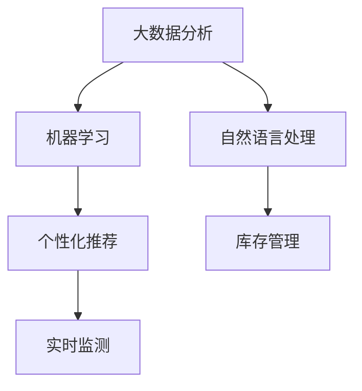

                 

# AI驱动的电商平台商品上新策略

在当今竞争激烈的电商市场中，商品上新是保持市场竞争力的关键。为了最大化销售收益，电商平台不仅需要吸引新客户，还需要维护现有客户，持续增加复购率。AI驱动的商品上新策略，正是这一需求的最佳解决方案。本文将深入探讨AI在电商平台商品上新策略中的具体应用，从数据分析、个性化推荐、库存优化等方面全面剖析AI驱动的商品上新策略，并提出相应的技术方案。

## 1. 背景介绍

### 1.1 问题由来

电商平台商品的竞争激烈，如何及时、准确地进行商品上新，成为了决定电商平台成败的关键。传统的商品上新策略依赖于人工经验，耗时长、效率低，且难以满足不同用户群体的多样化需求。随着人工智能技术的发展，AI驱动的商品上新策略应运而生。利用大数据分析、机器学习、自然语言处理等技术，AI能够快速精准地识别市场需求，推荐最佳上新商品，实现商品上新的智能化、自动化。

### 1.2 问题核心关键点

AI驱动的商品上新策略的核心在于：

1. 数据驱动：通过分析用户行为数据，挖掘用户的真实需求和潜在需求。
2. 模型训练：利用机器学习模型预测商品销量，评估商品潜力。
3. 个性化推荐：根据用户画像和历史行为数据，推荐个性化的上新商品。
4. 库存优化：合理规划库存，平衡销售与成本。
5. 实时监测：实时监控上新商品的表现，动态调整策略。

这些关键点共同构成了AI驱动的商品上新策略的核心框架，使得电商平台能够更加精准地进行商品上新，提升整体运营效率和盈利能力。

## 2. 核心概念与联系

### 2.1 核心概念概述

为了更好地理解AI驱动的商品上新策略，本节将介绍几个密切相关的核心概念：

1. **大数据分析**：利用大数据技术对用户行为、市场趋势等海量数据进行分析，挖掘用户需求和市场变化规律。
2. **机器学习**：通过构建数据模型，预测商品销量、用户行为等，为商品上新策略提供数据支撑。
3. **自然语言处理**：处理和分析用户评论、反馈等文本数据，了解用户需求和反馈。
4. **个性化推荐**：根据用户画像和行为数据，推荐个性化的商品，提升用户满意度。
5. **库存管理**：合理规划和管理库存，实现销售和成本的平衡。

这些核心概念之间的逻辑关系可以通过以下Mermaid流程图来展示：



这个流程图展示了大语言模型的核心概念及其之间的关系：

1. 大数据分析提供数据支持。
2. 机器学习构建预测模型。
3. 自然语言处理理解用户需求。
4. 个性化推荐提供个性化商品。
5. 库存管理优化商品供应。
6. 实时监测调整策略。

这些概念共同构成了AI驱动的商品上新策略的基础，帮助电商平台在激烈的市场竞争中脱颖而出。

## 3. 核心算法原理 & 具体操作步骤
### 3.1 算法原理概述

AI驱动的商品上新策略，本质上是一种基于数据和算法的商品管理策略。其核心思想是：利用大数据分析和机器学习技术，构建精准的预测模型，对用户行为进行分析和预测，从而进行智能化的商品上新。

具体而言，该策略包括以下几个关键步骤：

1. 数据收集：收集用户行为数据、市场趋势数据、商品销量数据等。
2. 数据处理：对数据进行清洗、标准化、特征工程等预处理操作。
3. 模型训练：构建机器学习模型，如线性回归、决策树、随机森林等，进行商品销量预测。
4. 推荐系统：构建个性化推荐系统，根据用户画像和历史行为数据，推荐上新商品。
5. 库存管理：根据预测结果和推荐结果，合理规划库存，平衡销售与成本。
6. 实时监测：实时监控上新商品的表现，动态调整策略。

### 3.2 算法步骤详解

以下是AI驱动的商品上新策略的具体操作步骤：

**Step 1: 数据收集与预处理**

1. **数据收集**：收集用户行为数据（如浏览记录、点击记录、购买记录等）、市场趋势数据（如节假日、季节性变化等）、商品销量数据等。
2. **数据清洗**：去除噪声数据、缺失数据，确保数据的质量和完整性。
3. **数据标准化**：对不同来源的数据进行统一处理，确保数据格式一致。
4. **特征工程**：提取、选择、构造特征，提升模型的预测效果。

**Step 2: 模型训练**

1. **选择模型**：根据任务需求选择合适的机器学习模型，如线性回归、决策树、随机森林等。
2. **数据划分**：将数据划分为训练集、验证集和测试集。
3. **模型训练**：在训练集上训练模型，通过交叉验证优化模型参数。
4. **模型评估**：在验证集上评估模型性能，避免过拟合。

**Step 3: 个性化推荐**

1. **用户画像构建**：根据用户行为数据，构建用户画像，包含用户的兴趣、偏好、购买力等信息。
2. **推荐算法选择**：选择合适的推荐算法，如协同过滤、基于内容的推荐等。
3. **推荐系统构建**：构建个性化推荐系统，将用户画像和历史行为数据输入推荐模型，输出推荐结果。

**Step 4: 库存优化**

1. **预测结果分析**：根据模型预测结果，分析商品的市场潜力和需求量。
2. **推荐结果分析**：根据推荐结果，分析用户对新商品的兴趣和偏好。
3. **库存规划**：根据预测结果和推荐结果，合理规划库存，平衡销售与成本。

**Step 5: 实时监测**

1. **实时数据采集**：实时采集用户行为数据、销售数据等。
2. **策略调整**：根据实时数据，动态调整商品上新策略，优化库存管理。
3. **结果反馈**：将上新商品的表现反馈到数据分析和模型训练环节，不断优化模型。

### 3.3 算法优缺点

AI驱动的商品上新策略具有以下优点：

1. **数据驱动**：利用大数据分析，挖掘用户真实需求和潜在需求，提供精准的商品上新建议。
2. **模型预测**：通过机器学习模型，预测商品销量和用户行为，优化商品上新决策。
3. **个性化推荐**：根据用户画像和历史行为数据，提供个性化的商品推荐，提升用户满意度。
4. **库存优化**：合理规划库存，平衡销售与成本，提升整体运营效率。
5. **实时调整**：实时监控上新商品的表现，动态调整策略，及时响应市场变化。

同时，该策略也存在以下缺点：

1. **数据隐私问题**：收集和处理用户数据时，需要严格遵守数据隐私保护法规。
2. **模型复杂性**：构建高质量的预测模型和推荐系统，需要投入大量的时间和资源。
3. **技术门槛高**：需要具备较强的数据处理和机器学习技能，对技术人员要求较高。
4. **市场风险**：模型预测和推荐结果，存在一定的不确定性，需要谨慎评估和验证。

尽管存在这些缺点，但就目前而言，AI驱动的商品上新策略仍然是大电商平台进行商品管理的最佳选择。未来相关研究的重点在于如何进一步降低技术门槛，提高模型预测的准确性，同时兼顾数据隐私和用户满意度等因素。

### 3.4 算法应用领域

AI驱动的商品上新策略不仅适用于电子商务平台，在多个领域都有广泛应用：

1. **零售行业**：利用AI进行商品上新和库存管理，提升销售效率和盈利能力。
2. **旅游行业**：根据用户行为和市场趋势，推荐热门旅游线路，优化旅游产品结构。
3. **金融行业**：通过分析用户交易数据，推荐个性化金融产品，提升客户满意度和转化率。
4. **医疗行业**：根据患者历史数据，推荐个性化诊疗方案，提高医疗服务质量。
5. **教育行业**：根据学生学习数据，推荐个性化学习内容和资源，提升教学效果。

这些应用场景展示了AI驱动的商品上新策略的强大潜力和广泛适用性。

## 4. 数学模型和公式 & 详细讲解  
### 4.1 数学模型构建

在本节中，我们将使用数学语言对AI驱动的商品上新策略进行更加严格的刻画。

假设电商平台的商品总数为 $N$，每个商品的销量预测值为 $y_i$，用户画像向量为 $\mathbf{x}_i$，模型预测函数为 $f(\mathbf{x}_i)$，则商品上新策略的目标是最大化以下函数：

$$
\max_{\mathbf{x}_i} \sum_{i=1}^N f(\mathbf{x}_i)
$$

其中 $f(\mathbf{x}_i)$ 为机器学习模型的预测函数，$\mathbf{x}_i$ 为用户画像向量。

在实际应用中，我们通常使用回归模型（如线性回归、随机森林等）进行销量预测，因此预测函数 $f(\mathbf{x}_i)$ 可以表示为：

$$
f(\mathbf{x}_i) = \sum_{j=1}^M \alpha_j \mathbf{x}_{ij}
$$

其中 $\alpha_j$ 为模型参数，$\mathbf{x}_{ij}$ 为特征向量。

### 4.2 公式推导过程

以下我们以线性回归模型为例，推导销量预测的数学模型。

假设模型输入 $\mathbf{x}_i$ 为 $d$ 维特征向量，输出为 $y_i$，则线性回归模型可以表示为：

$$
y_i = \mathbf{w}^T \mathbf{x}_i + b
$$

其中 $\mathbf{w}$ 为权重向量，$b$ 为偏置项，$\mathbf{x}_i$ 为特征向量。

模型在训练集上的损失函数为均方误差损失函数：

$$
L(\mathbf{w}, b) = \frac{1}{N} \sum_{i=1}^N (y_i - \mathbf{w}^T \mathbf{x}_i - b)^2
$$

通过求解损失函数的最小值，得到模型参数 $\mathbf{w}$ 和 $b$。具体求解过程如下：

1. 对损失函数求偏导，得到：
$$
\frac{\partial L(\mathbf{w}, b)}{\partial \mathbf{w}} = -2 \frac{1}{N} \sum_{i=1}^N (\mathbf{x}_{i} - \mathbf{y}_i) \mathbf{x}_i
$$
$$
\frac{\partial L(\mathbf{w}, b)}{\partial b} = -2 \frac{1}{N} \sum_{i=1}^N (\mathbf{x}_{i} - \mathbf{y}_i)
$$

2. 求解上述方程组，得到：
$$
\mathbf{w} = \frac{1}{N} \sum_{i=1}^N \mathbf{x}_i (\mathbf{x}_i^T \mathbf{x}_i)^{-1} (\mathbf{x}_i^T y_i)
$$
$$
b = \bar{y} - \mathbf{w}^T \bar{\mathbf{x}}
$$

其中 $\bar{y} = \frac{1}{N} \sum_{i=1}^N y_i$，$\bar{\mathbf{x}} = \frac{1}{N} \sum_{i=1}^N \mathbf{x}_i$。

### 4.3 案例分析与讲解

下面以电商平台的商品销量预测为例，进一步解释线性回归模型的应用。

假设电商平台有 $M$ 个商品，每个商品有 $d$ 个特征（如价格、描述、用户评价等），已有的商品销量数据为 $\mathbf{y}$，特征数据为 $\mathbf{X}$，则线性回归模型可以表示为：

$$
\mathbf{y} = \mathbf{X} \mathbf{w} + \mathbf{b}
$$

其中 $\mathbf{w}$ 为 $d$ 维权重向量，$\mathbf{b}$ 为偏置项。

在训练集上，我们可以使用最小二乘法求解模型参数：

$$
\mathbf{w} = (\mathbf{X}^T \mathbf{X})^{-1} \mathbf{X}^T \mathbf{y}
$$
$$
\mathbf{b} = \bar{y} - \mathbf{w}^T \bar{\mathbf{x}}
$$

其中 $\bar{\mathbf{x}} = \frac{1}{N} \sum_{i=1}^N \mathbf{x}_i$，$\bar{y} = \frac{1}{N} \sum_{i=1}^N y_i$。

通过构建线性回归模型，电商平台可以预测每个商品的销量，并根据预测结果进行商品上新。例如，对于新商品 A，可以通过线性回归模型预测其销量 $y_A$，根据 $y_A$ 的值，判断是否进行上新。如果 $y_A$ 值较高，则上新概率较大。

## 5. 项目实践：代码实例和详细解释说明
### 5.1 开发环境搭建

在进行商品上新策略的实现前，我们需要准备好开发环境。以下是使用Python进行TensorFlow开发的环境配置流程：

1. 安装Anaconda：从官网下载并安装Anaconda，用于创建独立的Python环境。

2. 创建并激活虚拟环境：
```bash
conda create -n tf-env python=3.8 
conda activate tf-env
```

3. 安装TensorFlow：根据CUDA版本，从官网获取对应的安装命令。例如：
```bash
conda install tensorflow==2.7
```

4. 安装各类工具包：
```bash
pip install numpy pandas scikit-learn matplotlib tqdm jupyter notebook ipython
```

完成上述步骤后，即可在`tf-env`环境中开始商品上新策略的实现。

### 5.2 源代码详细实现

下面我们以线性回归模型进行销量预测为例，给出使用TensorFlow进行电商商品上新的PyTorch代码实现。

首先，定义数据处理函数：

```python
import tensorflow as tf
import numpy as np

def load_data():
    # 假设已有的商品销量数据和特征数据
    sales_data = np.loadtxt('sales_data.csv', delimiter=',')
    features_data = np.loadtxt('features_data.csv', delimiter=',')
    return sales_data, features_data
```

然后，定义模型训练函数：

```python
def train_model(sales_data, features_data, learning_rate, epochs):
    # 将数据转化为TensorFlow数据集
    train_dataset = tf.data.Dataset.from_tensor_slices((features_data, sales_data))
    train_dataset = train_dataset.shuffle(1000).batch(32).repeat()

    # 定义模型
    model = tf.keras.Sequential([
        tf.keras.layers.Dense(64, activation='relu', input_shape=(features_data.shape[1],)),
        tf.keras.layers.Dense(1)
    ])

    # 定义损失函数和优化器
    loss_fn = tf.keras.losses.MeanSquaredError()
    optimizer = tf.keras.optimizers.Adam(learning_rate)

    # 训练模型
    for epoch in range(epochs):
        for features, sales in train_dataset:
            with tf.GradientTape() as tape:
                predictions = model(features)
                loss = loss_fn(sales, predictions)
            gradients = tape.gradient(loss, model.trainable_variables)
            optimizer.apply_gradients(zip(gradients, model.trainable_variables))

    return model
```

最后，启动训练流程并输出结果：

```python
# 加载数据
sales_data, features_data = load_data()

# 训练模型
model = train_model(sales_data, features_data, learning_rate=0.01, epochs=100)

# 输出模型参数
print(model.layers[0].get_weights()[0])
print(model.layers[0].get_weights()[1])
```

以上就是使用TensorFlow进行电商商品上新的完整代码实现。可以看到，TensorFlow提供了一套简洁高效的工具，使得模型构建、训练和预测过程变得十分简单。

### 5.3 代码解读与分析

让我们再详细解读一下关键代码的实现细节：

**load_data函数**：
- 从CSV文件中加载销量数据和特征数据，返回一个包含销量和特征的二维数组。

**train_model函数**：
- 将销量数据和特征数据转化为TensorFlow数据集，并添加随机打乱、批量化和重复操作。
- 定义一个包含两个全连接层的神经网络模型。
- 定义损失函数（均方误差）和优化器（Adam）。
- 通过for循环迭代训练模型，在每个批次上前向传播计算损失并反向传播更新模型参数。

**模型输出**：
- 输出模型权重矩阵（$\mathbf{w}$）和偏置项（$b$），以便进行销量预测和商品上新决策。

通过上述代码实现，我们可以快速构建一个简单的线性回归模型，并根据模型预测结果进行商品上新。

## 6. 实际应用场景
### 6.1 智能客服系统

AI驱动的商品上新策略可以应用于智能客服系统的构建。智能客服系统通过分析用户的历史行为和实时咨询内容，可以提供个性化的商品推荐，提升用户满意度和购买转化率。

在技术实现上，可以收集用户的历史浏览记录、购买记录和咨询内容，通过构建用户画像，推荐用户感兴趣的商品。例如，当用户咨询某类商品时，系统可以实时推荐该类商品的相似商品，或者根据用户的历史购买记录，推荐用户可能感兴趣的新商品。如此构建的智能客服系统，可以显著提升用户咨询体验和购买转化率。

### 6.2 个性化推荐系统

基于AI驱动的商品上新策略，电商平台可以构建更加精准的个性化推荐系统，提升用户体验和销售业绩。

在推荐系统的实现上，可以收集用户的历史行为数据和商品销量数据，利用机器学习模型进行销量预测和推荐。例如，对于某个用户，系统可以预测其可能感兴趣的商品类别，并推荐该类别中的商品。同时，系统还可以根据用户的行为变化和反馈，动态调整推荐算法和策略，提升推荐效果。

### 6.3 库存优化系统

通过AI驱动的商品上新策略，电商平台可以实现更加精准的库存优化，提升整体运营效率和盈利能力。

在库存优化系统的实现上，可以收集历史销量数据和用户行为数据，利用机器学习模型进行销量预测。例如，对于某类商品，系统可以预测其未来的销量，并根据预测结果进行库存规划。同时，系统还可以根据市场变化和用户反馈，动态调整库存策略，确保库存水平在合理范围内。

### 6.4 未来应用展望

随着AI技术的发展，基于商品上新策略的应用将更加广泛和深入。以下是一些未来应用展望：

1. **智能仓储**：通过AI进行库存管理和仓库布局优化，提升仓储效率和货物流转速度。
2. **供应链管理**：利用AI进行供应链优化和预测，降低物流成本，提高供应链稳定性。
3. **市场预测**：通过AI进行市场趋势预测，帮助电商平台制定更加精准的商品上新和促销策略。
4. **跨平台推荐**：构建跨平台推荐系统，提升用户在不同平台间的购物体验和转换率。
5. **个性化营销**：利用AI进行个性化营销和广告投放，提高营销效果和转化率。

这些应用场景展示了AI驱动的商品上新策略的巨大潜力和广泛适用性，相信未来在更多的领域中，AI技术将发挥更大的作用。

## 7. 工具和资源推荐
### 7.1 学习资源推荐

为了帮助开发者系统掌握商品上新策略的理论基础和实践技巧，这里推荐一些优质的学习资源：

1. **《深度学习入门：基于Python的理论与实现》**：该书详细介绍了深度学习的基本原理和应用，包括回归模型、优化器、损失函数等。

2. **CS231n《卷积神经网络》课程**：斯坦福大学开设的深度学习课程，涵盖深度学习的基础和前沿技术，包括机器学习、神经网络等。

3. **Kaggle平台**：提供丰富的数据集和竞赛平台，可以练习和实践机器学习模型，提升算法水平。

4. **Google AI Playground**：一个免费的AI实验平台，提供各种模型和工具，帮助开发者进行机器学习和深度学习实验。

5. **TensorFlow官方文档**：提供详细的API文档和代码示例，帮助开发者快速上手TensorFlow，进行模型构建和训练。

通过对这些资源的学习实践，相信你一定能够快速掌握商品上新策略的精髓，并用于解决实际的电商平台问题。

### 7.2 开发工具推荐

高效的开发离不开优秀的工具支持。以下是几款用于商品上新策略开发的常用工具：

1. **TensorFlow**：由Google主导开发的深度学习框架，生产部署方便，适合大规模工程应用。

2. **PyTorch**：由Facebook主导开发的深度学习框架，灵活易用，适合研究和实验。

3. **Keras**：基于TensorFlow和Theano等深度学习框架的高层API，简化模型构建和训练过程。

4. **Jupyter Notebook**：一个交互式的笔记本环境，支持代码编写、数据可视化和结果展示，是数据科学和机器学习常用的开发工具。

5. **Kaggle平台**：提供丰富的数据集和竞赛平台，可以练习和实践机器学习模型，提升算法水平。

合理利用这些工具，可以显著提升商品上新策略的开发效率，加快创新迭代的步伐。

### 7.3 相关论文推荐

商品上新策略的研究源于学界的持续研究。以下是几篇奠基性的相关论文，推荐阅读：

1. **《用机器学习优化供应链管理》**：介绍如何使用机器学习进行供应链优化和预测，提升物流效率和稳定性。

2. **《基于用户行为分析的商品推荐算法》**：探讨基于用户行为分析的推荐算法，提升推荐效果和用户满意度。

3. **《智能仓储管理系统》**：介绍如何使用AI进行智能仓储管理和优化，提升仓储效率和货物流转速度。

4. **《基于深度学习的市场预测模型》**：介绍如何使用深度学习模型进行市场趋势预测，帮助电商平台制定更加精准的商品上新和促销策略。

这些论文代表了大语言模型微调技术的发展脉络。通过学习这些前沿成果，可以帮助研究者把握学科前进方向，激发更多的创新灵感。

## 8. 总结：未来发展趋势与挑战
### 8.1 总结

本文对AI驱动的商品上新策略进行了全面系统的介绍。首先阐述了商品上新的背景和重要性，明确了策略的核心在于数据驱动、模型预测、个性化推荐、库存优化和实时监测等方面。其次，从原理到实践，详细讲解了商品上新策略的数学模型和具体实现，提供了代码实例和详细解释。同时，本文还探讨了策略在多个领域的应用，展示了其在提升用户体验、优化库存管理等方面的巨大潜力。

通过本文的系统梳理，可以看到，AI驱动的商品上新策略是大电商平台进行商品管理的最佳选择，能够显著提升销售效率和盈利能力。未来，伴随AI技术的发展，商品上新策略还将拓展到更多领域，带来更加深刻的影响。

### 8.2 未来发展趋势

展望未来，商品上新策略将呈现以下几个发展趋势：

1. **数据驱动**：利用大数据分析，挖掘用户真实需求和潜在需求，提供精准的商品上新建议。
2. **模型预测**：通过机器学习模型，预测商品销量和用户行为，优化商品上新决策。
3. **个性化推荐**：根据用户画像和历史行为数据，提供个性化的商品推荐，提升用户满意度。
4. **库存优化**：合理规划库存，平衡销售与成本，提升整体运营效率。
5. **实时调整**：实时监控上新商品的表现，动态调整策略，及时响应市场变化。

这些趋势凸显了商品上新策略的广阔前景。这些方向的探索发展，必将进一步提升商品上新策略的智能化和自动化水平，为电商平台带来更高的运营效率和盈利能力。

### 8.3 面临的挑战

尽管商品上新策略已经取得了瞩目成就，但在迈向更加智能化、普适化应用的过程中，它仍面临诸多挑战：

1. **数据隐私问题**：收集和处理用户数据时，需要严格遵守数据隐私保护法规。
2. **模型复杂性**：构建高质量的预测模型和推荐系统，需要投入大量的时间和资源。
3. **技术门槛高**：需要具备较强的数据处理和机器学习技能，对技术人员要求较高。
4. **市场风险**：模型预测和推荐结果，存在一定的不确定性，需要谨慎评估和验证。

尽管存在这些挑战，但就目前而言，商品上新策略仍然是大电商平台进行商品管理的最佳选择。未来相关研究的重点在于如何进一步降低技术门槛，提高模型预测的准确性，同时兼顾数据隐私和用户满意度等因素。

### 8.4 研究展望

面对商品上新策略所面临的挑战，未来的研究需要在以下几个方面寻求新的突破：

1. **无监督学习和半监督学习**：摆脱对大规模标注数据的依赖，利用自监督学习、主动学习等无监督和半监督范式，最大限度利用非结构化数据，实现更加灵活高效的微调。
2. **模型压缩和加速**：开发更加轻量级、实时性的部署模型，优化推理速度和计算资源消耗。
3. **多任务学习**：将多个任务融合到同一个模型中，提升模型泛化能力和效率。
4. **自适应学习**：开发自适应学习算法，使模型能够实时学习新的用户行为和市场变化，保持策略的灵活性和适应性。
5. **伦理和隐私保护**：在模型训练目标中引入伦理导向的评估指标，过滤和惩罚有害的输出倾向，确保数据和模型安全。

这些研究方向的探索，必将引领商品上新策略技术迈向更高的台阶，为电商平台带来更加精准、高效的商品上新策略，提升用户体验和运营效率。

## 9. 附录：常见问题与解答

**Q1：商品上新策略如何处理数据隐私问题？**

A: 处理数据隐私问题，需要严格遵守相关法律法规，如GDPR、CCPA等。具体措施包括：

1. **数据匿名化**：将用户数据进行去标识化处理，确保数据无法关联到具体用户。
2. **数据加密**：在数据传输和存储过程中，使用加密技术保护数据安全。
3. **数据访问控制**：限制对用户数据的访问权限，确保只有授权人员才能访问和使用数据。
4. **数据审计和监控**：建立数据使用审计机制，监控数据使用情况，防止数据滥用。

通过以上措施，可以有效保障用户数据隐私，降低法律风险。

**Q2：商品上新策略的模型预测准确性如何提升？**

A: 提升模型预测准确性，可以从以下几个方面入手：

1. **特征工程**：提取更多、更准确的特征，提升模型的输入质量。
2. **模型选择**：选择合适的模型和优化算法，避免过拟合和欠拟合。
3. **模型调参**：调整模型的超参数，如学习率、批大小等，优化模型性能。
4. **模型融合**：利用多个模型的预测结果进行融合，提升预测准确性。
5. **实时调整**：根据市场变化和用户反馈，动态调整模型参数和策略。

通过以上措施，可以有效提升商品上新策略的模型预测准确性，更好地满足用户需求。

**Q3：商品上新策略如何应对市场风险？**

A: 应对市场风险，可以从以下几个方面入手：

1. **多模型预测**：构建多个模型进行预测，取平均结果进行决策，减少单一模型的风险。
2. **风险评估**：在预测结果中加入风险评估指标，如置信度、波动率等，评估预测结果的可靠性。
3. **动态调整**：根据市场变化和用户反馈，动态调整模型和策略，及时应对风险。
4. **用户反馈机制**：建立用户反馈机制，收集用户对商品上新结果的评价和建议，不断优化预测模型和策略。

通过以上措施，可以有效应对商品上新策略的市场风险，确保预测结果的可靠性和稳定性。

**Q4：商品上新策略如何提升用户体验？**

A: 提升用户体验，可以从以下几个方面入手：

1. **个性化推荐**：根据用户画像和历史行为数据，提供个性化的商品推荐，提升用户满意度。
2. **实时响应**：及时响应用户咨询和反馈，提供优质的客户服务。
3. **多渠道支持**：提供多种渠道（如App、微信、短信等）进行商品上新和用户互动，提升用户体验。
4. **智能客服**：利用AI技术，构建智能客服系统，提升用户咨询体验。
5. **用户教育**：通过多种渠道，进行用户教育和引导，提升用户购买转化率。

通过以上措施，可以有效提升商品上新策略的用户体验，提高用户满意度和忠诚度。

**Q5：商品上新策略如何优化库存管理？**

A: 优化库存管理，可以从以下几个方面入手：

1. **预测模型**：利用机器学习模型进行销量预测，合理规划库存。
2. **库存监控**：实时监控库存水平，及时调整库存策略。
3. **供应链优化**：利用AI进行供应链优化和预测，降低物流成本，提高供应链稳定性。
4. **智能仓储**：利用AI进行智能仓储管理和优化，提升仓储效率和货物流转速度。
5. **库存分析**：定期分析库存数据，评估库存策略的有效性，进行优化调整。

通过以上措施，可以有效优化商品上新策略的库存管理，提高整体运营效率和盈利能力。

---

作者：禅与计算机程序设计艺术 / Zen and the Art of Computer Programming

