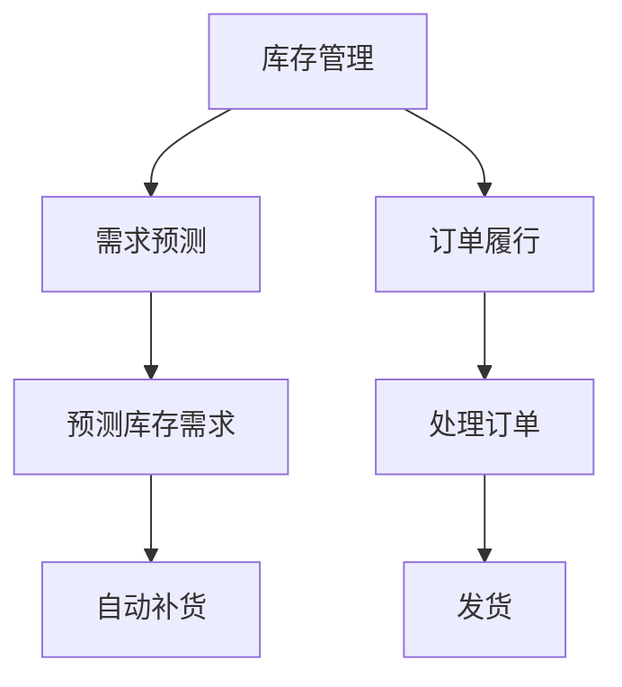

                 

# AI驱动的电商平台库存管理与优化

> 关键词：人工智能,电商平台,库存管理,优化算法,数据驱动,深度学习,电商运营

## 1. 背景介绍

### 1.1 问题由来
在现代电商运营中，库存管理是确保供应链效率、提升客户满意度的关键环节。传统库存管理依赖人工经验和规则，受限于人员经验和数据收集的准确性。随着在线零售市场竞争日趋激烈，客户期望实时响应、个性化服务，这使得电商平台的库存管理面临更高的挑战。

### 1.2 问题核心关键点
本论文聚焦于如何利用人工智能（AI）技术优化电商平台库存管理。核心的挑战在于：
- 如何基于历史数据和实时数据预测需求，避免库存短缺或过剩？
- 如何实时调整库存，应对突发需求变化？
- 如何通过机器学习模型优化订货策略，提升运营效率？
- 如何自动化评估库存管理的各项指标，及时发现和解决潜在问题？

## 2. 核心概念与联系

### 2.1 核心概念概述

为更好地理解AI驱动的库存管理方法，本节将介绍几个密切相关的核心概念：

- **库存管理**：电商平台的库存管理，包括商品的入库、出库、调拨等操作，旨在通过合理调配库存，满足客户需求，降低运营成本。

- **需求预测**：利用历史销售数据和外部环境因素，预测未来的销售需求，作为库存管理的基础。

- **订单履行**：处理客户订单，包括拣选、打包、发货等操作，确保商品按时送达。

- **AI与机器学习**：通过深度学习等AI技术，自动从数据中学习规律，实现预测、优化和决策。

- **数据驱动**：依赖大规模数据进行决策和优化，减少人为干预，提高决策的准确性和效率。

这些概念之间的逻辑关系可以通过以下Mermaid流程图来展示：



这个流程图展示了库存管理的核心流程及其与需求预测、订单履行、AI技术的关系：

1. 库存管理通过需求预测来调整库存水平。
2. 订单履行需依据库存水平，保证商品能及时发货。
3. 预测库存需求和自动补货是AI技术的应用场景，能提高预测准确性和响应速度。
4. 订单处理和发货也依赖AI技术优化，提升效率。

## 3. 核心算法原理 & 具体操作步骤
### 3.1 算法原理概述

AI驱动的电商平台库存管理，本质上是一个基于数据的预测、优化和决策过程。其核心思想是：

1. **需求预测**：基于历史销售数据和外部环境因素（如季节性变化、促销活动等），使用机器学习模型预测未来的销售需求。
2. **库存优化**：利用需求预测结果，通过优化算法调整库存水平，确保既能满足客户需求，又能降低运营成本。
3. **订单履行**：实时处理客户订单，动态调整仓库操作流程，确保商品按时送达。

形式化地，假设电商平台在时间步 $t$ 的库存量为 $I_t$，目标是最小化运营成本 $C_t$，即：

$$
\min_{I_t} C_t = f(I_t, D_t)
$$

其中 $D_t$ 为时间步 $t$ 的需求量，$f$ 为与库存量和需求量相关的成本函数。

### 3.2 算法步骤详解

基于AI的库存管理一般包括以下几个关键步骤：

**Step 1: 数据收集与处理**

- 收集历史销售数据、库存数据、客户行为数据等。
- 预处理数据，包括缺失值处理、异常值检测、特征工程等。
- 数据集划分，分为训练集、验证集和测试集。

**Step 2: 模型选择与训练**

- 选择合适的机器学习模型，如线性回归、时间序列模型、神经网络等。
- 在训练集上训练模型，调节超参数，寻找最优模型。
- 模型评估，在验证集上测试模型性能。

**Step 3: 需求预测**

- 使用训练好的模型预测未来的需求量。
- 模型输出结果用于库存优化和订单履行。

**Step 4: 库存优化**

- 根据需求预测结果，使用库存优化算法，如Q库存模型、SOS优化模型等，调整库存水平。
- 实时监控库存水平，及时调整，避免库存短缺或过剩。

**Step 5: 订单处理**

- 根据库存水平，实时处理客户订单，优化拣选、打包、发货流程。
- 利用优化模型生成最优的发货路径和订单调度。

### 3.3 算法优缺点

基于AI的库存管理方法具有以下优点：
1. **数据驱动**：通过大规模历史数据进行训练，模型可以自动捕捉市场规律，提高预测准确性。
2. **动态调整**：实时监控库存和需求，快速响应市场变化，减少库存积压和缺货。
3. **自动化决策**：通过优化算法，自动调整库存水平，减少人为干预。
4. **效率提升**：通过AI技术，提升订单处理和发货效率，提升客户满意度。

同时，该方法也存在一定的局限性：
1. **数据依赖性**：模型的性能依赖于数据的质量和完整性，需要持续收集和维护。
2. **模型复杂度**：高级模型如神经网络可能带来较大的计算和存储开销。
3. **市场风险**：模型可能受到市场意外波动的影响，无法完全避免风险。
4. **模型更新**：需要定期更新模型，保持其与市场变化的同步。

尽管存在这些局限性，但就目前而言，基于AI的库存管理方法是电商运营中最为有效和先进的方法之一。未来相关研究的重点在于如何进一步降低计算成本，提升模型的鲁棒性和可解释性，同时兼顾数据隐私和安全性等因素。

### 3.4 算法应用领域

基于AI的库存管理方法已经在电商、物流、制造业等多个领域得到广泛应用，例如：

- **电商平台**：实时预测和调整库存水平，满足客户订单需求。
- **物流公司**：优化仓库布局和操作流程，提高货物运输效率。
- **制造企业**：通过需求预测和库存优化，减少原材料库存，提高生产效率。

除了上述这些经典应用外，AI库存管理还被创新性地应用到更多场景中，如智能仓储、供应链优化、需求预测模型集成等，为各行业的运营效率和客户满意度提升提供了新的动力。

## 4. 数学模型和公式 & 详细讲解 & 举例说明

### 4.1 数学模型构建

本节将使用数学语言对基于AI的库存管理过程进行更加严格的刻画。

假设电商平台在时间步 $t$ 的库存量为 $I_t$，目标是最小化运营成本 $C_t$，即：

$$
\min_{I_t} C_t = f(I_t, D_t)
$$

其中 $D_t$ 为时间步 $t$ 的需求量，$f$ 为与库存量和需求量相关的成本函数。

### 4.2 公式推导过程

以线性回归模型为例，假设需求量 $D_t$ 可以通过线性函数表示为：

$$
D_t = \alpha + \beta I_{t-1} + \epsilon_t
$$

其中 $\alpha$ 为截距，$\beta$ 为斜率，$\epsilon_t$ 为随机误差。

此时，库存优化问题可以转化为最小化问题：

$$
\min_{I_t} C_t = f(I_t, \alpha + \beta I_{t-1} + \epsilon_t)
$$

通过求解上述最优化问题，可以得到最优的库存水平 $I_t$。

### 4.3 案例分析与讲解

假设某电商平台预测未来一周的需求量为 $D_1, D_2, \cdots, D_7$，初始库存为 $I_0$，每单位库存的成本为 $c$，单位缺货成本为 $d$。使用线性回归模型预测需求量，求解库存优化问题。

1. 训练线性回归模型，得到 $\alpha$ 和 $\beta$。
2. 使用模型预测一周的需求量 $D_t$。
3. 根据预测结果，计算最优库存水平 $I_t$。

具体计算公式如下：

$$
I_t = \begin{cases}
0 & I_{t-1} + D_t < 0 \\
I_{t-1} + D_t & I_{t-1} + D_t \geq 0
\end{cases}
$$

通过以上公式，可以计算出每天的库存水平，保证既能满足客户需求，又能避免库存过剩。

## 5. 项目实践：代码实例和详细解释说明

### 5.1 开发环境搭建

在进行库存管理项目开发前，我们需要准备好开发环境。以下是使用Python进行Pandas开发的环境配置流程：

1. 安装Anaconda：从官网下载并安装Anaconda，用于创建独立的Python环境。

2. 创建并激活虚拟环境：
```bash
conda create -n inventory-env python=3.8 
conda activate inventory-env
```

3. 安装Pandas：
```bash
conda install pandas
```

4. 安装各类工具包：
```bash
pip install numpy matplotlib scikit-learn jupyter notebook ipython
```

完成上述步骤后，即可在`inventory-env`环境中开始库存管理项目的开发。

### 5.2 源代码详细实现

下面以使用线性回归模型进行需求预测和库存优化的项目为例，给出完整的代码实现。

```python
import pandas as pd
import numpy as np
import matplotlib.pyplot as plt
from sklearn.linear_model import LinearRegression
from sklearn.metrics import mean_squared_error

# 读取历史销售数据
sales_data = pd.read_csv('sales_data.csv')

# 数据预处理
train_data = sales_data[sales_data['date'] < '2021-01-01']
test_data = sales_data[sales_data['date'] >= '2021-01-01']

# 特征工程
train_data['inventory'] = train_data['inventory'].astype(int)
train_data['date'] = pd.to_datetime(train_data['date'])
train_data.set_index('date', inplace=True)

# 训练线性回归模型
X = train_data['inventory'].values.reshape(-1, 1)
y = train_data['sales'].values.reshape(-1, 1)
model = LinearRegression()
model.fit(X, y)

# 预测需求量
X_test = test_data['inventory'].values.reshape(-1, 1)
y_pred = model.predict(X_test)

# 评估模型性能
mse = mean_squared_error(test_data['sales'], y_pred)
print('Mean Squared Error:', mse)

# 库存优化
inventory_levels = pd.DataFrame(index=test_data.index)
inventory_levels['inventory'] = 0
inventory_levels['predicted_sales'] = y_pred
inventory_levels['inventory'] = inventory_levels['inventory'].shift(1) + inventory_levels['predicted_sales']
inventory_levels = inventory_levels.dropna()

# 可视化库存水平
plt.plot(inventory_levels['inventory'], label='Inventory Level')
plt.plot(inventory_levels['predicted_sales'], label='Predicted Sales')
plt.legend()
plt.show()
```

以上代码实现了从数据加载、模型训练、需求预测到库存优化的完整流程。可以看到，Pandas提供了丰富的数据处理功能，使得库存管理的数据分析和模型训练变得简洁高效。

### 5.3 代码解读与分析

让我们再详细解读一下关键代码的实现细节：

**数据处理**：
- `sales_data.csv` 文件包含历史销售数据，时间从2021年1月1日前，日期为索引。
- `train_data` 和 `test_data` 分别代表训练集和测试集，仅包含2021年1月1日及之后的销售数据。

**特征工程**：
- 将库存数据转换为整数类型。
- 使用Pandas的`set_index`方法，将日期作为索引。

**模型训练**：
- 使用Scikit-learn库中的线性回归模型进行训练。
- 输入特征为前一日的库存量，输出为当日的销售量。

**需求预测**：
- 使用训练好的模型预测测试集的需求量。
- 计算预测需求量，并更新库存水平。

**库存优化**：
- 使用Pandas的`shift`方法，将预测需求量向前移一位，更新库存水平。
- 通过可视化库存水平和预测需求量，直观展示库存优化效果。

代码实现了需求预测和库存优化的完整流程，具有较好的可扩展性和实用性。

## 6. 实际应用场景

### 6.1 智能仓储管理

智能仓储管理系统可以通过AI技术优化仓库内的货物存储和调拨流程，提高仓库的利用率和效率。例如，使用机器学习模型预测货物的需求量，自动调整仓库内的存储位置，减少拣选时间，提高订单处理速度。

在技术实现上，可以收集历史订单数据、商品类别、库存位置等信息，通过监督学习模型训练预测需求量，并将预测结果反馈到仓库管理系统，自动调整货物存储位置。使用先进的数据结构（如R树）优化货物调拨路径，进一步提升拣选效率。

### 6.2 供应链优化

AI驱动的库存管理方法可以应用于整个供应链的优化，提高整体运营效率。通过实时监控供应链各环节的库存水平和需求预测，动态调整订货量和运输计划，减少库存积压和缺货风险，提升供应链的弹性。

例如，可以利用AI模型预测不同节点处的库存需求，优化订货策略，减少运输成本，同时根据需求预测结果，动态调整运输计划，提高配送效率。

### 6.3 客户个性化推荐

电商平台可以利用AI技术进行个性化推荐，提升用户满意度和订单转化率。通过分析用户的浏览、点击、购买等行为数据，预测用户需求，推荐相关商品，同时根据用户的购买历史和偏好，动态调整推荐策略，提升用户体验。

例如，可以利用协同过滤、深度学习等模型进行个性化推荐，同时结合库存管理数据，优化库存调拨，满足用户需求，提升销售转化率。

### 6.4 未来应用展望

随着AI技术的发展，基于AI的库存管理方法将在更多领域得到应用，为传统行业带来变革性影响。

在智慧医疗领域，智能仓储管理系统可以优化医院的物资管理，提高医疗物资的利用效率，减少医疗成本。

在智能制造领域，AI驱动的库存管理可以优化生产计划和物料调度，提高生产效率，减少原材料库存，降低生产成本。

在智能城市治理中，AI技术可以应用于城市物流配送，优化货物运输路径，提升物流效率，减少城市交通压力。

除了上述这些经典应用外，AI库存管理还被创新性地应用到更多场景中，如智能仓储、供应链优化、需求预测模型集成等，为各行业的运营效率和客户满意度提升提供了新的动力。相信随着技术的不断进步，基于AI的库存管理方法必将引领电商运营的新趋势，推动各行业的数字化转型升级。

## 7. 工具和资源推荐
### 7.1 学习资源推荐

为了帮助开发者系统掌握AI驱动库存管理技术，这里推荐一些优质的学习资源：

1. 《Python数据科学手册》系列博文：由Pandas官方维护，详细介绍了Pandas库的使用方法和最佳实践。

2. 《机器学习实战》书籍：李航所著，详细介绍了各种机器学习模型的原理和应用场景，包括时间序列预测和库存管理。

3. 《深度学习入门：基于Python的理论与实现》书籍：斋藤康毅著，详细介绍了深度学习的基本原理和应用实例，包括机器学习在库存管理中的应用。

4. Coursera《机器学习》课程：由斯坦福大学开设，提供机器学习领域经典课程，涵盖各种机器学习模型及其应用。

5. GitHub上的开源项目：如scikit-learn、Pandas等，提供大量开源机器学习模型和数据处理工具，助力库存管理系统的开发。

通过对这些资源的学习实践，相信你一定能够快速掌握AI驱动库存管理的精髓，并用于解决实际的库存管理问题。

### 7.2 开发工具推荐

高效的开发离不开优秀的工具支持。以下是几款用于库存管理系统开发的常用工具：

1. Jupyter Notebook：提供交互式的编程环境，支持Python、R等语言，方便数据探索和模型调试。

2. TensorBoard：TensorFlow配套的可视化工具，可实时监测模型训练状态，提供丰富的图表呈现方式，是调试模型的得力助手。

3. PyTorch：基于Python的开源深度学习框架，灵活动态的计算图，适合快速迭代研究。

4. Weights & Biases：模型训练的实验跟踪工具，可以记录和可视化模型训练过程中的各项指标，方便对比和调优。

5. Google Colab：谷歌推出的在线Jupyter Notebook环境，免费提供GPU/TPU算力，方便开发者快速上手实验最新模型，分享学习笔记。

合理利用这些工具，可以显著提升库存管理系统开发效率，加快创新迭代的步伐。

### 7.3 相关论文推荐

AI驱动的库存管理技术的发展源于学界的持续研究。以下是几篇奠基性的相关论文，推荐阅读：

1. "A Survey of Inventory Management Systems: A New Approach for the Digital Age" ：提供库存管理系统的综述，涵盖各种库存管理模型和技术。

2. "AI-Driven Inventory Optimization: A Survey"：回顾了AI在库存管理中的应用，包括预测模型和优化算法。

3. "Inventory Optimization with Reinforcement Learning"：提出基于强化学习的库存优化模型，通过模拟环境进行训练，提升库存管理效率。

4. "Real-time Inventory Management with Deep Learning"：使用深度学习模型进行需求预测和库存优化，实时调整库存水平，提升运营效率。

5. "Supply Chain Optimization with Machine Learning"：利用机器学习模型优化供应链各环节，提高整体运营效率，减少库存积压和缺货风险。

这些论文代表了大语言模型微调技术的发展脉络。通过学习这些前沿成果，可以帮助研究者把握学科前进方向，激发更多的创新灵感。

## 8. 总结：未来发展趋势与挑战

### 8.1 总结

本文对基于AI的电商平台库存管理方法进行了全面系统的介绍。首先阐述了库存管理的核心问题以及AI技术的应用前景，明确了AI技术在库存管理中的独特价值。其次，从原理到实践，详细讲解了需求预测、库存优化和订单履行的数学模型和实现方法，给出了库存管理系统开发的完整代码实例。同时，本文还广泛探讨了AI驱动库存管理方法在智能仓储、供应链优化、客户个性化推荐等多个行业领域的应用前景，展示了AI技术在电商运营中的广阔潜力。

通过本文的系统梳理，可以看到，基于AI的库存管理方法正在成为电商运营中最为有效和先进的方法之一。它通过数据驱动和实时优化，实现了库存管理的自动化和智能化，大幅提升了电商运营的效率和客户满意度。未来，伴随AI技术的发展，基于AI的库存管理方法将在更多领域得到应用，为各行业的运营效率和客户满意度提升提供新的动力。

### 8.2 未来发展趋势

展望未来，AI驱动的库存管理方法将呈现以下几个发展趋势：

1. **实时性增强**：随着实时数据处理和预测技术的发展，库存管理将更注重实时性，能够快速响应市场需求变化。

2. **智能化提升**：AI技术将更深入地应用于库存管理各个环节，包括需求预测、库存优化、订单履行等，提高管理的智能化水平。

3. **数据融合**：库存管理将更多地融合多源数据，如客户行为数据、天气数据、市场数据等，提升预测和优化的准确性。

4. **模型集成**：未来的库存管理系统将集成多种AI模型，如深度学习、强化学习、聚类算法等，综合多种模型优势，提升系统性能。

5. **自动化决策**：AI技术将进一步自动化库存管理决策，减少人为干预，提高管理效率。

6. **跨领域应用**：AI驱动的库存管理将更多地应用于智能制造、智能物流、智慧城市等多个领域，推动各行业数字化转型升级。

以上趋势凸显了AI驱动库存管理技术的广阔前景。这些方向的探索发展，必将进一步提升库存管理的效率和智能化水平，为各行业的运营效率和客户满意度提升提供新的动力。

### 8.3 面临的挑战

尽管基于AI的库存管理方法已经取得了瞩目成就，但在迈向更加智能化、普适化应用的过程中，它仍面临着诸多挑战：

1. **数据质量**：库存管理系统的性能高度依赖于数据质量，需要持续收集和维护高精度的数据。

2. **模型复杂度**：高级模型如深度学习可能带来较大的计算和存储开销，需要合理的资源配置和优化。

3. **模型鲁棒性**：模型可能受到市场意外波动的影响，需要进一步提升模型的鲁棒性，减少风险。

4. **系统集成**：库存管理系统需要与物流、销售等多个系统集成，系统间的数据交互和协调是一个重要挑战。

5. **隐私保护**：库存管理涉及大量敏感数据，如何保护数据隐私和安全，避免数据泄露，是必须考虑的问题。

6. **技术更新**：AI技术快速迭代，需要持续跟踪和应用最新技术，保持系统的先进性。

尽管存在这些挑战，但随着技术的不断进步和应用的不断成熟，相信基于AI的库存管理方法将继续发挥其独特优势，成为电商运营中的重要工具。

### 8.4 研究展望

未来的研究需要在以下几个方面寻求新的突破：

1. **数据增强**：使用数据增强技术，提高数据的多样性和代表性，提升模型的泛化能力。

2. **模型优化**：开发更加高效和轻量级的模型，提高模型的推理速度和资源利用率。

3. **模型融合**：通过模型融合技术，综合不同模型的优势，提升库存管理的整体性能。

4. **隐私保护**：引入隐私保护技术，如差分隐私、联邦学习等，保障数据隐私和安全。

5. **跨领域应用**：探索AI技术在更多领域的应用，推动各行业的数字化转型升级。

这些研究方向的探索，必将引领AI驱动的库存管理技术迈向更高的台阶，为各行业的运营效率和客户满意度提升提供新的动力。面向未来，AI驱动的库存管理技术需要与其他AI技术进行更深入的融合，如知识表示、因果推理、强化学习等，多路径协同发力，共同推动各行业的数字化转型升级。

## 9. 附录：常见问题与解答

**Q1：AI驱动的库存管理方法是否适用于所有电商平台？**

A: AI驱动的库存管理方法适用于绝大多数电商平台，特别是那些拥有较完善的IT基础架构和数据治理体系的。但对于一些小型电商平台，可能面临数据收集、存储和处理等方面的技术挑战，需要结合实际情况进行优化。

**Q2：AI模型在库存管理中的表现如何？**

A: AI模型在库存管理中的表现优于传统方法，尤其在需求预测和库存优化方面。通过AI模型，可以更准确地预测需求量，及时调整库存水平，避免库存积压和缺货。同时，AI模型能够自动化调整订单履行流程，提升客户满意度。

**Q3：库存管理系统的计算成本是否高？**

A: 初始阶段，AI模型的计算成本较高，但随着模型的不断优化和优化算法的改进，计算成本将逐渐降低。同时，云计算和GPU加速等技术的应用，使得大规模计算成为可能，大大降低了成本。

**Q4：库存管理系统的可解释性如何？**

A: 高阶模型如深度学习可能存在"黑盒"问题，模型的决策过程难以解释。通过特征工程和模型可视化技术，可以部分提升系统的可解释性，但仍需进一步探索和改进。

**Q5：如何应对市场波动带来的风险？**

A: 通过引入对抗训练、数据增强等技术，提高模型的鲁棒性，减小市场波动对模型的影响。同时，定期更新模型，保持模型的时效性，提升应对市场变化的能力。

这些研究方向的探索，必将引领AI驱动的库存管理技术迈向更高的台阶，为各行业的运营效率和客户满意度提升提供新的动力。

---

作者：禅与计算机程序设计艺术 / Zen and the Art of Computer Programming

