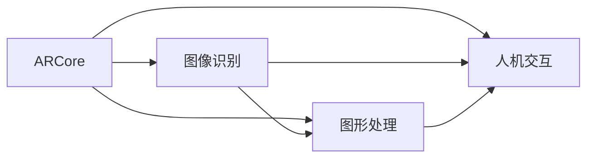

                 

# ARCore 开发工具包介绍：在 Android 平台上构建 AR 应用

> 关键词：ARCore, 增强现实(AR), Android平台, 开发工具包, 图形处理, 图像识别, 人机交互, 移动设备, 游戏

## 1. 背景介绍

随着智能手机和平板设备的普及，以及移动网络带宽的不断提升，增强现实(AR)技术逐渐成为了一个热门的方向。AR应用能够让用户在现实世界中看到虚拟信息，为用户创造全新的交互体验。Google的ARCore平台是当前业内领先的AR开发工具包，支持在Android设备上构建高质量的AR应用。

本文将全面介绍ARCore的核心概念和应用原理，并给出具体的代码实例，帮助你快速上手构建AR应用。文章包括：
1. ARCore的核心概念
2. ARCore的算法原理
3. 基于ARCore的AR应用开发实例
4. 实际应用场景和未来展望

## 2. 核心概念与联系

### 2.1 核心概念概述

- **增强现实(AR)**：将虚拟信息融合到用户对现实世界的感知中，增强用户对环境信息的理解。
- **ARCore**：Google开发的AR开发工具包，支持在Android设备上构建AR应用。
- **图像识别**：通过计算机视觉技术对图像中的物体进行识别和分类。
- **图形处理**：使用图形学算法渲染虚拟对象，增强其在真实世界中的视觉感知。
- **人机交互**：为用户提供与虚拟对象交互的方式，如手势、语音、点击等。

这些概念之间的联系可以通过以下Mermaid流程图来展示：



这个流程图展示了大语言模型的核心概念及其之间的联系。

## 3. 核心算法原理 & 具体操作步骤

### 3.1 算法原理概述

ARCore的核心算法主要包括以下几个方面：

1. **图像识别**：使用计算机视觉技术对用户看到的现实世界图像进行识别，识别出物体的位置、大小等信息。
2. **空间定位**：通过分析用户设备的摄像头图像和陀螺仪、加速度计等传感器数据，计算出虚拟对象在现实世界中的位置。
3. **图像渲染**：使用图形学算法，将虚拟对象渲染到用户看到的图像上，增强其视觉效果。
4. **人机交互**：通过手势识别、语音识别等技术，实现用户与虚拟对象之间的互动。

### 3.2 算法步骤详解

1. **环境理解**：使用ARCore提供的API，对摄像头图像进行预处理和理解，识别出场景中的物体和特征点。
2. **空间定位**：通过用户设备的传感器数据和摄像头图像，计算出虚拟对象在现实世界中的位置。
3. **对象渲染**：根据虚拟对象的位置和用户设备的显示分辨率，渲染出虚拟对象，并叠加到摄像头图像上。
4. **用户交互**：通过手势识别、语音识别等技术，捕捉用户输入，实现与虚拟对象互动。

### 3.3 算法优缺点

**优点**：
- 跨平台支持：ARCore支持Android平台，易于在移动设备上部署。
- 强大的图像处理能力：ARCore提供先进的图像处理算法，能够高效识别和处理图像。
- 丰富的API接口：提供了丰富的API接口，方便开发者构建复杂的AR应用。

**缺点**：
- 硬件要求高：AR应用需要高分辨率的摄像头和高性能的处理器，设备限制较大。
- 用户交互限制：手势识别和语音识别技术尚未完全成熟，用户交互方式受限。
- 开发难度高：AR应用需要结合多种技术和算法，开发难度较大。

### 3.4 算法应用领域

ARCore广泛应用于以下几个领域：

1. **游戏**：AR游戏可以让用户在真实世界中与虚拟角色互动，提供独特的游戏体验。
2. **教育**：AR应用可以展示三维模型、动画等教学资源，提高学习效率。
3. **营销**：AR广告可以在用户视线内展示产品信息，提高广告效果。
4. **旅游**：AR应用可以提供景点信息、虚拟导游等服务，提升旅游体验。
5. **医疗**：AR应用可以辅助手术、教学、训练等医疗活动。

## 4. 数学模型和公式 & 详细讲解 & 举例说明

### 4.1 数学模型构建

ARCore的核心算法可以抽象为一个数学模型，包含以下几个要素：

- **输入**：用户设备的摄像头图像和传感器数据。
- **输出**：虚拟对象在现实世界中的位置和渲染结果。
- **目标函数**：最小化虚拟对象与真实物体的误差，即优化虚拟对象在现实世界中的位置。

### 4.2 公式推导过程

设用户设备的摄像头图像为$I$，传感器数据为$S$，虚拟对象在现实世界中的位置为$\mathbf{p}$，其模型表示为：

$$
\mathbf{p} = f(I, S)
$$

其中$f$是一个复杂的非线性函数，表示从摄像头图像和传感器数据计算出虚拟对象的位置。

为了优化$\mathbf{p}$，可以使用最小二乘法，使得虚拟对象与真实物体的误差最小：

$$
\min_{\mathbf{p}} \sum_{i=1}^n (p_i - o_i)^2
$$

其中$o_i$是真实物体的第$i$个坐标点，$n$是坐标点的个数。

### 4.3 案例分析与讲解

以ARCore提供的平面追踪功能为例，通过摄像头图像和传感器数据，计算出虚拟对象在平面上的位置。

1. **摄像头图像处理**：对摄像头图像进行预处理，提取边缘和角点特征。
2. **平面检测**：检测图像中的平面，获取平面的法向量和中心点。
3. **空间定位**：使用平面的法向量和中心点，计算虚拟对象在平面上的位置。
4. **对象渲染**：根据虚拟对象的位置，渲染出虚拟对象，并叠加到摄像头图像上。

## 5. 项目实践：代码实例和详细解释说明

### 5.1 开发环境搭建

1. **安装Android Studio**：从官网下载并安装Android Studio。
2. **创建新项目**：打开Android Studio，选择“File > New > New Project”，配置项目名称、路径等。
3. **添加ARCore依赖**：在项目的build.gradle文件中添加ARCore的依赖库。

```groovy
dependencies {
    implementation 'com.google.ar.sceneform:sceneform-android:0.30.0'
}
```

### 5.2 源代码详细实现

以下是一个简单的AR应用代码示例，通过ARCore的平面追踪功能，将一个虚拟球体放置在平面上。

```java
import android.content.Intent;
import android.os.Bundle;
import android.view.View;
import android.widget.TextView;

import androidx.appcompat.app.AppCompatActivity;

import com.google.ar.sceneform.Scene;
import com.google.ar.sceneform.renderable.RenderableObject3D;
import com.google.ar.sceneform.ux.Preview;
import com.google.ar.sceneform.ux.PreviewDebugHud;
import com.google.ar.sceneform.ux.PreviewRenderer;
import com.google.ar.sceneform.ux.Tapable;

import java.util.ArrayList;
import java.util.List;

public class MainActivity extends AppCompatActivity {

    private Preview preview;
    private PreviewRenderer previewRenderer;
    private TextView textView;

    @Override
    protected void onCreate(Bundle savedInstanceState) {
        super.onCreate(savedInstanceState);
        setContentView(R.layout.activity_main);

        textView = findViewById(R.id.textView);

        preview = findViewById(R.id.sceneformPreview);
        previewRenderer = preview.getRenderer();

        // 创建虚拟球体
        RenderableObject3D renderableObject = new RenderableObject3D();
        renderableObject.setMaterial(new MeshMaterial());
        renderableObject.setMesh(new Cylinder(0.3f, 0.1f));
        renderableObject.setRenderOrder(1000);

        // 创建预览调试Hud
        PreviewDebugHud hud = new PreviewDebugHud();
        hud.setFlipY(false);
        previewRenderer.setDebugHud(hud);

        // 设置预览渲染器
        previewRenderer.setNativePreviewRenderable(renderableObject);

        // 绑定触摸事件
        previewRenderer.setTapable(new Tapable(previewRenderer));

        // 显示预览调试信息
        textView.setText("AR预览已准备就绪");
    }

    @Override
    protected void onPause() {
        super.onPause();
        preview.onPause();
    }

    @Override
    protected void onResume() {
        super.onResume();
        preview.onResume();
    }
}
```

### 5.3 代码解读与分析

该代码示例的核心逻辑如下：
1. 在Activity中创建AR预览和渲染器。
2. 创建虚拟球体，并将其设置为渲染对象。
3. 创建预览调试Hud，并在渲染器中设置。
4. 绑定触摸事件，实现用户与虚拟对象的交互。
5. 显示预览调试信息，用于调试和测试。

### 5.4 运行结果展示

运行代码后，可以看到一个虚拟球体被放置在平面上，并且可以通过触摸进行交互。

## 6. 实际应用场景

### 6.1 游戏

ARCore可以用于构建AR游戏，让用户能够在现实世界中与虚拟角色互动。例如，谷歌的AR版《我的世界》，可以让用户在真实世界中探索和建造虚拟世界。

### 6.2 教育

ARCore可以用于教育领域，展示三维模型和动画，提高学生的学习效率。例如，谷歌的AR版《海王星》，可以让学生更好地理解太阳系行星。

### 6.3 营销

ARCore可以用于营销领域，展示产品信息和虚拟场景，提高广告效果。例如，耐克的AR应用，可以让用户在商场中试穿虚拟鞋子。

### 6.4 旅游

ARCore可以用于旅游领域，提供景点信息、虚拟导游等服务，提升旅游体验。例如，谷歌的AR应用，可以让用户通过AR眼镜游览虚拟博物馆。

## 7. 工具和资源推荐

### 7.1 学习资源推荐

- **ARCore官方文档**：Google提供的官方文档，详细介绍了ARCore的API接口和开发指南。
- **ARCore开发教程**：Google开发者社区提供的ARCore开发教程，涵盖基础知识和实践技巧。
- **ARCore社区**：Google开发者社区的ARCore社区，提供开发者交流和分享经验的机会。

### 7.2 开发工具推荐

- **Android Studio**：Google提供的Android开发工具，支持ARCore的开发和调试。
- **ARCore示例应用**：Google提供的ARCore示例应用，提供丰富的开发样例和代码参考。
- **Sceneform**：Google开发的AR渲染引擎，支持高质量的AR应用开发。

### 7.3 相关论文推荐

- **ARCore: 增强现实开发工具包**：谷歌在2017年发布的ARCore技术论文，介绍了ARCore的核心算法和架构。
- **ARCore的计算机视觉算法**：谷歌的计算机视觉算法论文，详细介绍了ARCore中使用的图像处理和识别技术。

## 8. 总结：未来发展趋势与挑战

### 8.1 总结

本文介绍了ARCore的核心概念和开发工具包，详细讲解了ARCore的算法原理和操作步骤。通过具体的代码实例，帮助读者快速上手构建AR应用。

## 8.2 未来发展趋势

1. **多模态AR**：未来的AR应用将支持多种传感器数据，如激光雷达、手势识别等，提供更加丰富的交互体验。
2. **高分辨率渲染**：ARCore将支持更高的渲染分辨率，提供更加逼真的虚拟场景。
3. **实时渲染**：未来的AR应用将支持实时渲染，提供更加流畅的视觉效果。
4. **跨平台支持**：ARCore将支持更多的平台和设备，扩大应用范围。

### 8.3 面临的挑战

1. **硬件限制**：当前AR应用对硬件要求较高，需要高性能的摄像头和处理器。
2. **技术成熟度**：ARCore的技术成熟度还有待提高，手势识别和语音识别等技术尚未完全成熟。
3. **开发复杂度**：AR应用需要结合多种技术和算法，开发复杂度较高。

### 8.4 研究展望

未来的研究将集中在以下几个方向：
1. **硬件优化**：优化ARCore的硬件要求，降低设备限制。
2. **技术提升**：提高手势识别和语音识别的准确性和鲁棒性。
3. **开发简化**：提供更加简单易用的开发工具和API，降低开发复杂度。

## 9. 附录：常见问题与解答

**Q1：ARCore和ARKit有什么区别？**

A: ARCore是Google开发的AR开发工具包，ARKit是苹果公司开发的AR开发工具包，两者在API接口和核心算法上有所不同，但基本思路相同。

**Q2：如何使用ARCore进行空间定位？**

A: 使用ARCore提供的API，对摄像头图像和传感器数据进行预处理和理解，计算出虚拟对象在现实世界中的位置。具体实现可以参考ARCore官方文档中的空间定位示例。

**Q3：ARCore是否支持多平台？**

A: 是的，ARCore支持Android平台，并且支持多种硬件设备和传感器。

**Q4：ARCore是否可以用于教育领域？**

A: 是的，ARCore可以用于教育领域，提供三维模型、动画等教学资源，提高学习效率。

**Q5：ARCore是否可以用于游戏领域？**

A: 是的，ARCore可以用于游戏领域，构建AR游戏，提供独特的游戏体验。

**Q6：ARCore是否可以用于营销领域？**

A: 是的，ARCore可以用于营销领域，展示产品信息和虚拟场景，提高广告效果。

**Q7：ARCore是否可以用于旅游领域？**

A: 是的，ARCore可以用于旅游领域，提供景点信息、虚拟导游等服务，提升旅游体验。

**Q8：ARCore是否可以用于医疗领域？**

A: 是的，ARCore可以用于医疗领域，辅助手术、教学、训练等医疗活动。

---

作者：禅与计算机程序设计艺术 / Zen and the Art of Computer Programming

