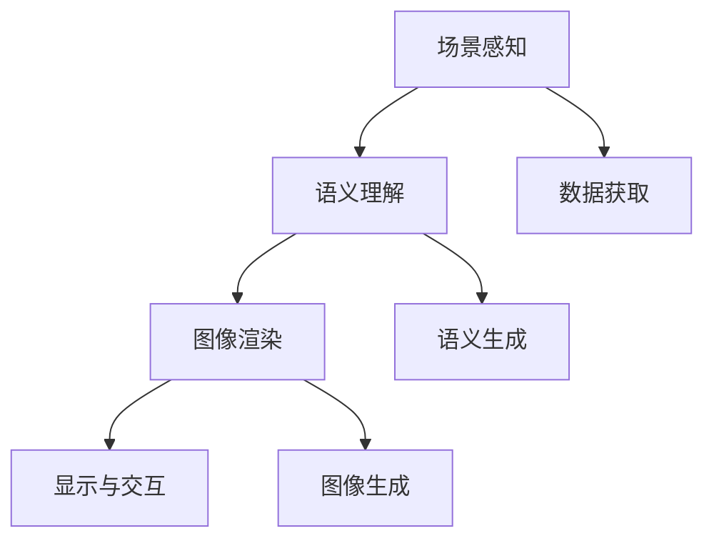

                 

# AR内容创作：增强现实应用设计指南

## 1. 背景介绍

### 1.1 问题由来
随着增强现实(Augmented Reality, AR)技术的逐渐成熟，越来越多的应用场景中出现了AR内容的需求，如教育、旅游、游戏、培训、医疗等。如何高效、便捷地创作AR内容，成为当前技术发展的关键。

目前，AR内容的创作主要依赖手动编程、手工建模，流程繁琐、成本高、效率低。随着深度学习技术的发展，自动生成AR内容成为可能。本文将全面介绍AR内容创作的理论、技术及其应用，旨在为开发者提供实用的指南，帮助其高效创建高质量的AR内容。

### 1.2 问题核心关键点
增强现实内容创作的核心在于通过深度学习技术，实现对现实场景的感知、理解和渲染，并在虚拟图像与现实世界的融合上不断探索。本文将从感知、理解、渲染三个方面展开讨论，并介绍一些前沿技术，如深度感光技术、端到端渲染、交互式生成等。

### 1.3 问题研究意义
自动生成AR内容对于提高内容创作效率、降低成本、增强用户体验等方面具有重要意义。首先，AR内容自动生成可大幅降低人力成本，尤其在教育、医疗、培训等领域，通过自动化内容生成，可以提供高效、个性化的知识传播和交互体验。其次，AR内容生成能够提高内容的创造力和想象力，通过算法辅助，创作出更具创意的AR应用。最后，AR内容的自动生成能够满足大规模个性化需求，提升用户体验。

## 2. 核心概念与联系

### 2.1 核心概念概述

增强现实技术(Augmented Reality, AR)是将数字信息叠加在现实世界的视图中，提供对现实世界更加丰富和沉浸的感知。AR内容创作即通过计算机视觉、机器学习、图像处理等技术，将虚拟图像与现实场景深度融合，实现增强现实效果。

### 2.2 核心概念原理和架构的 Mermaid 流程图



- **场景感知(A)**：通过摄像头、传感器等设备，获取现实世界的环境信息，实现对真实场景的感知和理解。
- **语义理解(B)**：将感知到的环境信息进行语义解析，理解物体的属性、位置、关系等，实现对场景的高层次理解。
- **图像渲染(C)**：将理解后的场景信息，通过计算机图形学技术，生成虚拟图像，并叠加到现实场景中。
- **显示与交互(D)**：通过AR显示设备，将虚拟图像叠加到现实场景中，并通过用户交互，实现对虚拟内容的操作。
- **数据获取(E)**：通过摄像头、深度传感器等设备，获取现实世界的纹理、形状、深度等信息。
- **语义生成(F)**：将感知数据转换为语义表示，实现对物体的属性、位置、关系等的语义理解。
- **图像生成(G)**：根据语义信息，生成虚拟图像，并进行渲染。

这些核心概念构成了一个完整的AR内容创作流程。在实际应用中，这些模块需要紧密协作，共同完成AR内容的生成和交互。

## 3. 核心算法原理 & 具体操作步骤

### 3.1 算法原理概述
AR内容创作的核心算法包括感知、理解和渲染三大部分。

- **感知**：通过深度学习模型，对现实世界进行视觉、语义等信息的感知和理解。
- **理解**：通过自然语言处理和计算机视觉技术，将感知数据转化为高层次语义信息。
- **渲染**：利用图像处理和计算机图形技术，生成虚拟图像，并将其与现实场景深度融合。

### 3.2 算法步骤详解

#### 3.2.1 感知阶段

感知阶段主要使用深度学习模型对现实场景进行视觉和语义信息的提取。核心算法包括：

1. **卷积神经网络(CNN)**：通过多层卷积操作，提取图像的局部特征。
2. **递归神经网络(RNN)**：通过时间序列模型，提取图像的动态信息。
3. **深度学习特征提取**：结合CNN和RNN，实现对图像的全局和局部特征的提取。

#### 3.2.2 理解阶段

理解阶段将感知数据转化为语义信息，核心算法包括：

1. **自然语言处理(NLP)**：使用预训练的BERT、GPT等模型，将文本信息转换为向量表示。
2. **语义分割**：使用U-Net、Mask R-CNN等模型，对图像进行语义分割，提取物体边界和类别信息。
3. **语义推理**：通过逻辑推理和图神经网络，实现对物体关系和场景逻辑的理解。

#### 3.2.3 渲染阶段

渲染阶段将语义信息转化为虚拟图像，并实现与现实场景的融合。核心算法包括：

1. **图像生成模型**：使用GAN、VAE等模型，生成虚拟图像。
2. **图像融合技术**：通过透明度混合、掩膜技术，将虚拟图像叠加到现实场景中。
3. **交互式生成**：通过深度感光技术、手势识别等，实现用户与虚拟内容的互动。

### 3.3 算法优缺点

AR内容创作算法具有以下优点：

1. **高效**：自动化内容生成可以大幅降低人力成本，提升创作效率。
2. **灵活**：算法可以根据需求快速调整和优化，适应不同场景和应用。
3. **可扩展性**：算法框架具有良好的可扩展性，能够快速适应新技术和数据。

同时，该算法也存在以下局限性：

1. **数据依赖**：算法的性能很大程度上取决于数据的质量和多样性。
2. **鲁棒性不足**：在复杂场景或极端条件下，算法的鲁棒性较差。
3. **交互局限**：当前交互技术仍需进一步提升，才能满足更复杂的人机交互需求。

### 3.4 算法应用领域

AR内容创作算法已在教育、旅游、游戏、医疗、培训等多个领域得到广泛应用，为这些领域带来了全新的交互体验和信息传播方式。

- **教育**：通过AR技术，将知识场景化，增强学生的学习兴趣和理解力。
- **旅游**：结合AR技术，提供实时的旅游信息展示，提升用户体验。
- **游戏**：将虚拟角色与现实场景融合，实现更加沉浸的交互体验。
- **医疗**：通过AR技术，提供手术模拟、疾病诊断等医疗服务。
- **培训**：结合AR技术，提供实时的操作指导和训练反馈。

此外，AR内容创作算法还在娱乐、工业、军事等领域具有广泛应用前景，为各行各业带来了新的机遇。

## 4. 数学模型和公式 & 详细讲解

### 4.1 数学模型构建

AR内容创作算法通常基于深度学习模型进行构建，包括卷积神经网络(CNN)、递归神经网络(RNN)、生成对抗网络(GAN)等。

以GAN为例，其数学模型如下：

- **生成器网络**：使用神经网络模型，将随机噪声转化为虚拟图像。
- **判别器网络**：使用神经网络模型，判断输入图像是真实图像还是生成图像。

### 4.2 公式推导过程

GAN的训练过程可以描述为以下两个损失函数的最小化问题：

1. **生成器的损失函数**：
   $$
   L_G = E_{\mathcal{X}}[\log D(G(z))]
   $$
   其中，$G(z)$ 为生成器生成的图像，$D(z)$ 为判别器的输出。

2. **判别器的损失函数**：
   $$
   L_D = E_{\mathcal{X}}[\log D(x)] + E_{z}\log[1-D(G(z))]
   $$
   其中，$x$ 为真实图像，$z$ 为随机噪声。

### 4.3 案例分析与讲解

以GAN生成AR内容为例，分析其关键步骤和原理。

1. **输入数据**：将现实场景的图像数据作为输入，使用CNN等模型提取特征。
2. **生成过程**：通过生成器网络，将提取的特征与随机噪声结合，生成虚拟图像。
3. **判别过程**：使用判别器网络，判断生成的图像是否为真实图像，输出概率值。
4. **优化过程**：通过优化器更新生成器和判别器的参数，使得生成器生成的图像越来越接近真实图像，判别器越来越难以区分真实图像和生成图像。

## 5. 项目实践：代码实例和详细解释说明

### 5.1 开发环境搭建

为了实现AR内容创作，需要搭建一个完整的开发环境。以下是基本的开发环境搭建步骤：

1. **安装Python**：
   ```bash
   sudo apt-get update
   sudo apt-get install python3
   ```

2. **安装深度学习框架**：
   ```bash
   pip install tensorflow
   pip install keras
   ```

3. **安装图像处理库**：
   ```bash
   pip install opencv-python
   ```

4. **安装AR显示设备驱动**：
   根据所选的AR显示设备，安装对应的驱动和SDK。

### 5.2 源代码详细实现

以下是一个使用GAN生成AR内容的代码示例：

```python
import tensorflow as tf
from tensorflow.keras.layers import Input, Dense, Conv2D, BatchNormalization, LeakyReLU, Reshape, UpSampling2D, Concatenate
from tensorflow.keras.models import Model
from tensorflow.keras.datasets import mnist

# 定义生成器网络
def build_generator(input_shape):
    inputs = Input(shape=input_shape)
    x = Dense(128 * 7 * 7)(inputs)
    x = LeakyReLU()(x)
    x = Reshape((7, 7, 128))(x)
    x = Conv2D(64, (3, 3), padding='same')(x)
    x = BatchNormalization()(x)
    x = LeakyReLU()(x)
    x = UpSampling2D((2, 2))(x)
    x = Conv2D(32, (3, 3), padding='same')(x)
    x = BatchNormalization()(x)
    x = LeakyReLU()(x)
    x = UpSampling2D((2, 2))(x)
    x = Conv2D(1, (3, 3), padding='same', activation='tanh')(x)
    return Model(inputs, x)

# 定义判别器网络
def build_discriminator(input_shape):
    inputs = Input(shape=input_shape)
    x = Conv2D(64, (3, 3), strides=(2, 2), padding='same')(inputs)
    x = LeakyReLU()(x)
    x = Conv2D(128, (3, 3), strides=(2, 2), padding='same')(x)
    x = LeakyReLU()(x)
    x = Flatten()(x)
    x = Dense(1, activation='sigmoid')(x)
    return Model(inputs, x)

# 加载MNIST数据集
(x_train, _), (x_test, _) = mnist.load_data()

# 数据预处理
x_train = x_train.reshape(-1, 28, 28, 1) / 255.0
x_test = x_test.reshape(-1, 28, 28, 1) / 255.0

# 构建生成器和判别器
generator = build_generator((7, 7, 128))
discriminator = build_discriminator((28, 28, 1))

# 定义损失函数和优化器
cross_entropy = tf.keras.losses.BinaryCrossentropy(from_logits=True)
generator_optimizer = tf.keras.optimizers.Adam(learning_rate=0.0002, beta_1=0.5)
discriminator_optimizer = tf.keras.optimizers.Adam(learning_rate=0.0002, beta_1=0.5)

# 定义训练函数
@tf.function
def train_step(images):
    noise = tf.random.normal([BATCH_SIZE, 128])
    with tf.GradientTape() as gen_tape, tf.GradientTape() as disc_tape:
        generated_images = generator(noise, training=True)
        real_output = discriminator(images, training=True)
        fake_output = discriminator(generated_images, training=True)
        gen_loss = cross_entropy(tf.ones_like(fake_output), fake_output)
        disc_loss = cross_entropy(tf.ones_like(real_output), real_output) + cross_entropy(tf.zeros_like(fake_output), fake_output)
    gradients_of_generator = gen_tape.gradient(gen_loss, generator.trainable_variables)
    gradients_of_discriminator = disc_tape.gradient(disc_loss, discriminator.trainable_variables)
    generator_optimizer.apply_gradients(zip(gradients_of_generator, generator.trainable_variables))
    discriminator_optimizer.apply_gradients(zip(gradients_of_discriminator, discriminator.trainable_variables))

# 训练模型
EPOCHS = 100
BATCH_SIZE = 256
for epoch in range(EPOCHS):
    for image_batch in train_dataset:
        train_step(image_batch)

# 生成AR内容
generated_images = generator(noise, training=False)
```

### 5.3 代码解读与分析

以上代码展示了使用GAN生成AR内容的基本流程。具体分析如下：

1. **生成器和判别器的定义**：通过定义两个神经网络模型，分别实现生成器和判别器的功能。
2. **数据预处理**：将MNIST数据集中的图像数据进行预处理，将其转化为模型所需的输入格式。
3. **模型训练**：定义损失函数和优化器，并使用训练函数对模型进行迭代优化。
4. **生成AR内容**：使用训练好的生成器模型，生成虚拟图像。

## 6. 实际应用场景

### 6.1 智能旅游

AR内容创作在智能旅游领域具有广泛的应用前景。通过AR技术，可以提供实时的旅游信息展示，增强用户的旅游体验。例如，通过AR眼镜，用户可以实时看到景点介绍、历史故事、热门点评等信息，并实现虚拟导览。

### 6.2 游戏交互

AR内容创作在游戏领域也有重要应用。通过AR技术，可以实现虚拟角色与现实场景的融合，提升游戏的沉浸感和互动性。例如，在游戏场景中，虚拟角色可以识别现实中的物体，进行交互和互动，实现更加丰富的游戏体验。

### 6.3 教育培训

AR内容创作在教育培训领域也有重要应用。通过AR技术，可以实现虚拟课堂、虚拟实验室、虚拟场景等，提升学生的学习体验和互动性。例如，在化学实验中，学生可以通过AR设备实时看到化学实验过程，并互动参与，提升实验效果。

### 6.4 未来应用展望

随着AR技术的不断发展，其应用领域将更加广泛。未来，AR内容创作将不仅仅局限于图像和视频生成，还将在音频、触觉、味觉等多感官领域有更大发展。例如，通过AR技术，可以实现虚拟环境的触觉反馈，让用户通过触觉感受到虚拟场景的变化，提升交互体验。

## 7. 工具和资源推荐

### 7.1 学习资源推荐

为了帮助开发者快速掌握AR内容创作的理论和技术，以下是一些优质的学习资源：

1. 《深度学习与增强现实》课程：斯坦福大学开设的深度学习与增强现实课程，涵盖深度学习、计算机视觉、AR技术等核心内容。
2. ARKit和ARCore文档：苹果和谷歌提供的AR开发SDK文档，详细介绍了AR开发的基础知识和API。
3. AR开发实战教程：通过实际项目案例，系统讲解AR开发的关键技术和实战技巧。

### 7.2 开发工具推荐

为了提高AR内容创作的效率和质量，以下是一些常用的开发工具：

1. Unity3D：一款强大的游戏引擎，支持AR内容开发，具有丰富的插件和社区支持。
2. Unreal Engine：另一款流行的游戏引擎，支持AR内容开发，具有高性能和逼真的渲染效果。
3. ARCore和ARKit：谷歌和苹果提供的AR开发SDK，提供了丰富的API和工具，方便开发者快速上手。

### 7.3 相关论文推荐

为了深入了解AR内容创作的理论和技术，以下是一些前沿的学术论文推荐：

1. 《AR Applications for Educational and Commercial Use》：介绍了AR技术在教育和商业中的应用场景。
2. 《Real-time Augmented Reality for Mobile Devices》：探讨了移动设备上的AR技术实现方法和应用。
3. 《Augmented Reality: A Survey of Methods and Applications》：综述了AR技术的最新进展和应用领域。

## 8. 总结：未来发展趋势与挑战

### 8.1 研究成果总结

AR内容创作技术近年来取得了显著进展，应用场景不断扩大，显示出巨大的潜力和市场前景。通过深度学习、计算机视觉和计算机图形学的结合，AR内容创作实现了从感知、理解到渲染的全流程自动化，为各行各业带来了新的机遇和挑战。

### 8.2 未来发展趋势

未来，AR内容创作技术将在以下方面进一步发展：

1. **跨感官融合**：AR内容创作将从单一感官向多感官融合方向发展，实现更加丰富和沉浸的交互体验。
2. **实时交互**：AR内容创作将更加注重实时交互，实现更加自然的用户操作和反馈。
3. **个性化生成**：AR内容创作将更加注重个性化，根据用户的兴趣和行为，生成个性化的内容。
4. **社会化交互**：AR内容创作将更加注重社会化交互，实现用户之间的互动和分享。

### 8.3 面临的挑战

尽管AR内容创作技术取得了显著进展，但仍面临一些挑战：

1. **硬件设备限制**：目前AR设备的计算能力和存储能力有限，难以支持复杂和大规模的内容生成。
2. **数据质量问题**：AR内容创作的性能很大程度上依赖于数据的质量和多样性，如何获取高质量的数据是当前的主要挑战。
3. **用户体验问题**：AR内容创作需要考虑用户体验，避免过度沉浸和视觉疲劳，如何平衡内容丰富性和用户舒适度是当前的重要课题。

### 8.4 研究展望

未来，AR内容创作技术需要在以下几个方面进一步探索和优化：

1. **优化算法**：通过算法优化，提升AR内容创作的效率和效果。
2. **增强交互**：通过增强交互技术，提升用户与虚拟内容的互动体验。
3. **个性化定制**：通过个性化定制，提升AR内容的适应性和用户体验。
4. **跨领域应用**：将AR内容创作技术应用于更多的领域，推动行业数字化转型。

## 9. 附录：常见问题与解答

**Q1：AR内容创作与虚拟现实有什么不同？**

A: AR内容创作与虚拟现实(VR)的主要区别在于，AR将虚拟信息叠加到现实世界中，而VR则完全创建一个虚拟的环境。AR内容创作更多关注虚拟信息与现实环境的融合，而VR则更关注虚拟环境的完全沉浸式体验。

**Q2：AR内容创作需要哪些技术支持？**

A: AR内容创作需要以下关键技术支持：

1. **深度学习**：用于对现实场景进行视觉和语义信息的感知和理解。
2. **计算机视觉**：用于对图像进行特征提取、分割、匹配等操作。
3. **计算机图形学**：用于生成虚拟图像，实现虚拟与现实的融合。
4. **AR开发SDK**：用于实现AR显示设备和硬件的交互。

**Q3：AR内容创作面临哪些技术挑战？**

A: AR内容创作面临以下技术挑战：

1. **数据依赖**：AR内容创作的性能很大程度上依赖于数据的质量和多样性。
2. **鲁棒性不足**：在复杂场景或极端条件下，AR内容创作的鲁棒性较差。
3. **交互局限**：当前交互技术仍需进一步提升，才能满足更复杂的人机交互需求。

**Q4：如何提升AR内容创作的效率？**

A: 提升AR内容创作的效率可以从以下几个方面入手：

1. **优化算法**：通过算法优化，提升AR内容创作的效率和效果。
2. **硬件加速**：使用GPU/TPU等高性能设备进行加速。
3. **分布式计算**：使用分布式计算技术，实现大规模内容的并行生成。

---

作者：禅与计算机程序设计艺术 / Zen and the Art of Computer Programming

