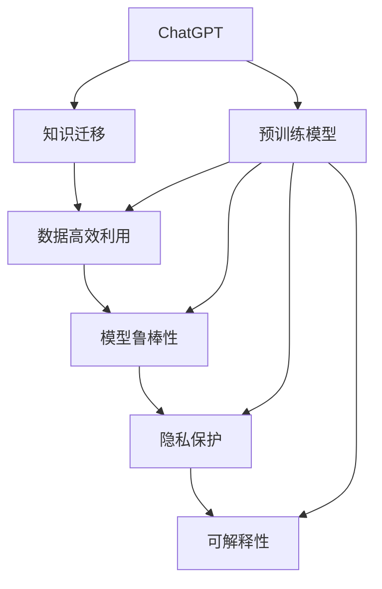

                 

# ChatGPT冷启动场景：优势与局限

> 关键词：ChatGPT,冷启动,优势,局限,语言模型,神经网络,应用场景,模型训练

## 1. 背景介绍

在AI时代，语言模型驱动的ChatGPT（如OpenAI的GPT系列）已成为对话系统的重要代表。然而，在冷启动场景（即没有大量数据的情况下进行模型训练和使用）中，ChatGPT的优势和局限都值得深入探讨。本节将从背景介绍开始，概述冷启动场景对ChatGPT的特别需求，以及当前技术面临的挑战。

### 1.1 问题由来
ChatGPT等语言模型在处理自然语言理解和生成方面展现出了强大的能力。然而，在实际应用中，冷启动问题常常出现：
1. 数据稀缺：特别是当涉及到新领域或新问题时，缺乏足够的数据使得传统微调方法难以奏效。
2. 模型鲁棒性：小型或低质量的数据集可能无法训练出具有鲁棒性的模型。
3. 数据隐私：收集和标注大量数据存在隐私和伦理问题，需要找到更加隐私保护的方法。

这些问题的存在，使得研究者们开始寻求在冷启动场景下如何有效利用已有模型知识，并结合有限数据进行高效训练的策略。

### 1.2 问题核心关键点
冷启动场景的核心在于：如何在数据不足的情况下，利用已有知识提升模型性能，同时确保模型的鲁棒性和可解释性。以下是冷启动场景中ChatGPT所面临的关键问题：

1. **数据高效利用**：如何在少量数据下最大化模型学习效果。
2. **知识迁移**：如何有效迁移预训练模型学到的知识，减少从头训练的需求。
3. **模型鲁棒性**：如何保证模型在冷启动场景中的稳定性和泛化能力。
4. **隐私保护**：如何在保护用户隐私的前提下进行模型训练和应用。
5. **可解释性**：如何在保证模型效果的同时，提高模型的可解释性，使用户能够理解和信任模型的输出。

这些问题不仅涉及技术层面，也关乎伦理、法律和隐私保护的考量。

### 1.3 问题研究意义
理解ChatGPT在冷启动场景中的优势和局限，对于模型优化、算法创新和实际应用都具有重要意义：

1. **提升模型效率**：探索如何在资源有限的情况下提高模型训练和推理效率。
2. **增强模型泛化能力**：通过方法论创新，使ChatGPT更好地泛化到新的领域和问题。
3. **确保数据安全**：在冷启动场景下，探索更加隐私保护的数据利用方法。
4. **优化用户体验**：通过增强模型可解释性，提升用户对ChatGPT的信任和满意度。

本文将详细分析ChatGPT在冷启动场景下的优势与局限，为研究者和实践者提供深入洞察和实际指导。

## 2. 核心概念与联系

### 2.1 核心概念概述

冷启动场景下的ChatGPT应用涉及多个核心概念。为更好地理解这些概念，本节将通过几个关键节点构建一个Mermaid流程图，展示其间的联系。



该图展示了从ChatGPT到预训练模型的知识迁移过程，再到数据高效利用、模型鲁棒性、隐私保护和可解释性的实现路径。以下将详细解释这些关键概念。

## 3. 核心算法原理 & 具体操作步骤

### 3.1 算法原理概述

冷启动场景下ChatGPT的优势主要体现在以下三个方面：
1. **预训练模型的知识迁移**：利用已有的预训练模型知识，减少从头训练需求。
2. **数据高效利用技术**：通过技术手段，高效利用有限的数据，提升模型效果。
3. **模型鲁棒性增强**：通过算法优化，确保模型在少数数据下的稳定性和泛化能力。

这些优势在ChatGPT中体现为以下核心算法原理：
- 自监督学习：通过大量无标签数据训练预训练模型，学习语言知识。
- 迁移学习：将预训练模型知识迁移至新任务，提高模型在少数数据下的性能。
- 参数高效微调：在保留大部分预训练参数的基础上，仅微调少量参数，提高效率。
- 对抗训练：通过引入对抗样本，增强模型鲁棒性。
- 可解释性增强：通过设计提示模板，提升模型输出的可解释性。

### 3.2 算法步骤详解

本节将详细解释ChatGPT在冷启动场景下具体算法的步骤，包括知识迁移、数据高效利用、模型鲁棒性、隐私保护和可解释性增强的实现路径。

#### 3.2.1 知识迁移
知识迁移是冷启动场景下ChatGPT的核心优势。

**步骤1**：选择合适的预训练模型。常用的模型包括BERT、GPT等，这些模型已经在各类NLP任务上取得优异表现。

**步骤2**：加载预训练模型并进行微调。根据具体任务，添加任务适配层，如分类器或解码器，并通过少量标注数据进行微调。

**步骤3**：应用迁移学习技术。利用预训练模型的知识，减少从头训练的计算资源消耗和时间成本。

#### 3.2.2 数据高效利用
数据高效利用技术能够最大化利用有限数据，提升模型性能。

**步骤1**：数据增强。通过回译、近义词替换等技术，丰富训练数据多样性。

**步骤2**：样本筛选。根据任务特点筛选出更有信息量的样本进行微调。

**步骤3**：样本生成。通过对抗生成网络(Adversarial Generative Network)等技术，生成更多样本。

#### 3.2.3 模型鲁棒性增强
模型鲁棒性增强技术能够提升模型在少数数据下的稳定性和泛化能力。

**步骤1**：对抗训练。引入对抗样本，增强模型对噪声和异常数据的鲁棒性。

**步骤2**：自适应正则化。根据任务特点，设计自适应正则化技术，如L2正则、Dropout等。

**步骤3**：参数高效微调。只微调少量关键参数，减少模型对噪声的敏感性。

#### 3.2.4 隐私保护
隐私保护技术在冷启动场景下尤为重要，能够确保数据安全和用户隐私。

**步骤1**：数据匿名化。对用户数据进行匿名化处理，确保数据隐私。

**步骤2**：差分隐私。在模型训练过程中加入差分隐私机制，保护个体隐私。

**步骤3**：本地化训练。在本地设备上训练模型，减少数据传输风险。

#### 3.2.5 可解释性增强
可解释性增强技术能够提高模型输出的可解释性，增强用户信任。

**步骤1**：设计提示模板。通过精心设计提示模板，引导模型输出，减少微调参数。

**步骤2**：融合符号逻辑。在模型中加入符号逻辑推理模块，提升输出的可解释性。

**步骤3**：可解释模型框架。利用可解释模型框架，分析模型的决策过程。

### 3.3 算法优缺点

#### 3.3.1 优势
1. **快速迭代**：利用预训练模型进行知识迁移，加速模型训练过程。
2. **高效利用数据**：通过数据增强和样本筛选等技术，最大化利用有限数据。
3. **鲁棒性提升**：通过对抗训练和自适应正则化，提高模型鲁棒性。
4. **隐私保护**：通过数据匿名化和差分隐私等技术，确保数据安全和隐私。
5. **可解释性增强**：通过提示模板和符号逻辑推理，提升模型输出的可解释性。

#### 3.3.2 局限
1. **数据依赖性**：预训练模型依赖大量数据，冷启动场景下数据不足可能影响模型效果。
2. **泛化能力有限**：在少数数据下，模型泛化能力可能不足，需进一步优化。
3. **对抗样本依赖**：对抗训练依赖对抗样本的生成和检测，过程复杂。
4. **计算资源需求高**：冷启动场景下的数据增强和对抗训练需要较高的计算资源。
5. **模型复杂性**：提示模板设计复杂，需要一定经验和知识储备。

### 3.4 算法应用领域

ChatGPT在冷启动场景下的优势和局限，在不同领域的应用场景中体现得尤为明显。

#### 3.4.1 医疗领域
在医疗领域，ChatGPT可以利用预训练模型的知识，快速适应新病例的诊断和分析。通过少量标注数据进行微调，模型能够学习到相关领域的语言知识和医学常识。

**优势**：
- 快速诊断：利用知识迁移，快速适应新病例。
- 辅助诊疗：提供医疗建议，辅助医生诊疗。

**局限**：
- 数据隐私：医疗数据敏感，隐私保护问题突出。
- 泛化能力：少数病例数据可能不足，影响模型泛化能力。

#### 3.4.2 金融领域
在金融领域，ChatGPT可以利用预训练模型的知识，进行实时风险分析和市场预测。通过数据增强和对抗训练，模型能够在实时数据下保持稳定性和鲁棒性。

**优势**：
- 实时预测：利用数据高效利用技术，实时分析市场数据。
- 风险控制：利用模型鲁棒性，增强风险控制能力。

**局限**：
- 数据安全：金融数据敏感，隐私保护和数据安全问题突出。
- 计算资源：实时数据处理需要高计算资源，冷启动场景下成本较高。

#### 3.4.3 教育领域
在教育领域，ChatGPT可以利用预训练模型的知识，进行个性化教学和作业批改。通过可解释性增强，模型能够提供详细解释，增强学生的理解和信任。

**优势**：
- 个性化教学：利用知识迁移和可解释性增强，提供个性化学习方案。
- 作业批改：利用数据高效利用技术，快速批改作业。

**局限**：
- 数据质量：教育数据质量参差不齐，影响模型效果。
- 用户反馈：学生反馈可能影响模型学习效果，需要不断迭代优化。

## 4. 数学模型和公式 & 详细讲解

### 4.1 数学模型构建

本节将通过数学模型和公式详细解释ChatGPT在冷启动场景下的工作原理。

**数学模型**：
- 假定预训练模型为 $M_{\theta}$，其中 $\theta$ 为预训练得到的模型参数。
- 给定任务 $T$ 的标注数据集 $D=\{(x_i, y_i)\}_{i=1}^N, x_i \in \mathcal{X}, y_i \in \mathcal{Y}$，其中 $\mathcal{X}$ 为输入空间，$\mathcal{Y}$ 为输出空间。
- 定义模型 $M_{\theta}$ 在数据样本 $(x,y)$ 上的损失函数为 $\ell(M_{\theta}(x),y)$，则在数据集 $D$ 上的经验风险为：
  $$
  \mathcal{L}(\theta) = \frac{1}{N} \sum_{i=1}^N \ell(M_{\theta}(x_i),y_i)
  $$
  其中 $\ell$ 为针对任务 $T$ 设计的损失函数。

**案例分析**：
以金融领域的风险分析为例，假设模型在输入 $x$ 上的输出为 $\hat{y}=M_{\theta}(x) \in [0,1]$，表示样本属于正类的概率。真实标签 $y \in \{0,1\}$。则二分类交叉熵损失函数定义为：
  $$
  \ell(M_{\theta}(x),y) = -[y\log \hat{y} + (1-y)\log (1-\hat{y})]
  $$
  其推导过程已在3.3.1中详细解释。

### 4.2 公式推导过程

**推导过程**：
- 根据链式法则，损失函数对参数 $\theta_k$ 的梯度为：
  $$
  \frac{\partial \mathcal{L}(\theta)}{\partial \theta_k} = -\frac{1}{N}\sum_{i=1}^N (\frac{y_i}{M_{\theta}(x_i)}-\frac{1-y_i}{1-M_{\theta}(x_i)}) \frac{\partial M_{\theta}(x_i)}{\partial \theta_k}
  $$
  其中 $\frac{\partial M_{\theta}(x_i)}{\partial \theta_k}$ 可进一步递归展开，利用自动微分技术完成计算。

- 在得到损失函数的梯度后，即可带入参数更新公式，完成模型的迭代优化：
  $$
  \theta \leftarrow \theta - \eta \nabla_{\theta}\mathcal{L}(\theta) - \eta\lambda\theta
  $$
  其中 $\eta$ 为学习率，$\lambda$ 为正则化系数，$\nabla_{\theta}\mathcal{L}(\theta)$ 为损失函数对参数 $\theta$ 的梯度，可通过反向传播算法高效计算。

### 4.3 案例分析与讲解

以医疗领域的病例诊断为例，假设模型在输入 $x$ 上的输出为 $\hat{y}=M_{\theta}(x) \in [0,1]$，表示样本属于某种疾病的概率。真实标签 $y \in \{0,1\}$。则二分类交叉熵损失函数定义为：
  $$
  \ell(M_{\theta}(x),y) = -[y\log \hat{y} + (1-y)\log (1-\hat{y})]
  $$
  将 $y$ 和 $\hat{y}$ 带入模型进行前向传播计算，得到损失值 $\mathcal{L}(\theta)$。

## 5. 项目实践：代码实例和详细解释说明

### 5.1 开发环境搭建

进行ChatGPT冷启动场景的代码实践，首先需要准备好开发环境。以下是使用Python进行PyTorch开发的环境配置流程：

1. 安装Anaconda：从官网下载并安装Anaconda，用于创建独立的Python环境。

2. 创建并激活虚拟环境：
  ```bash
  conda create -n pytorch-env python=3.8 
  conda activate pytorch-env
  ```

3. 安装PyTorch：根据CUDA版本，从官网获取对应的安装命令。例如：
  ```bash
  conda install pytorch torchvision torchaudio cudatoolkit=11.1 -c pytorch -c conda-forge
  ```

4. 安装Transformers库：
  ```bash
  pip install transformers
  ```

5. 安装各类工具包：
  ```bash
  pip install numpy pandas scikit-learn matplotlib tqdm jupyter notebook ipython
  ```

完成上述步骤后，即可在`pytorch-env`环境中开始代码实践。

### 5.2 源代码详细实现

这里我们以金融风险分析为例，给出使用Transformers库对GPT模型进行冷启动场景微调的PyTorch代码实现。

首先，定义风险分析任务的数据处理函数：

```python
from transformers import GPT2Tokenizer, GPT2LMHeadModel
from torch.utils.data import Dataset
import torch

class FinancialRiskDataset(Dataset):
    def __init__(self, data, tokenizer):
        self.data = data
        self.tokenizer = tokenizer
        
    def __len__(self):
        return len(self.data)
    
    def __getitem__(self, idx):
        financial_case = self.data[idx]
        tokens = self.tokenizer(financial_case, return_tensors='pt', padding='max_length', truncation=True)
        return {'input_ids': tokens['input_ids'], 'attention_mask': tokens['attention_mask'], 'label': self.data[idx]['risk_level']}
```

然后，定义模型和优化器：

```python
from transformers import AdamW

model = GPT2LMHeadModel.from_pretrained('gpt2', num_labels=4)
optimizer = AdamW(model.parameters(), lr=2e-5)
```

接着，定义训练和评估函数：

```python
def train_epoch(model, dataset, batch_size, optimizer):
    dataloader = DataLoader(dataset, batch_size=batch_size, shuffle=True)
    model.train()
    epoch_loss = 0
    for batch in dataloader:
        input_ids = batch['input_ids'].to(device)
        attention_mask = batch['attention_mask'].to(device)
        labels = batch['label'].to(device)
        model.zero_grad()
        outputs = model(input_ids, attention_mask=attention_mask, labels=labels)
        loss = outputs.loss
        epoch_loss += loss.item()
        loss.backward()
        optimizer.step()
    return epoch_loss / len(dataloader)

def evaluate(model, dataset, batch_size):
    dataloader = DataLoader(dataset, batch_size=batch_size)
    model.eval()
    preds, labels = [], []
    with torch.no_grad():
        for batch in dataloader:
            input_ids = batch['input_ids'].to(device)
            attention_mask = batch['attention_mask'].to(device)
            batch_labels = batch['label'].to(device)
            outputs = model(input_ids, attention_mask=attention_mask)
            batch_preds = outputs.logits.argmax(dim=2).to('cpu').tolist()
            batch_labels = batch_labels.to('cpu').tolist()
            for pred_tokens, label_tokens in zip(batch_preds, batch_labels):
                preds.append(pred_tokens[:len(label_tokens)])
                labels.append(label_tokens)
    return preds, labels

device = torch.device('cuda') if torch.cuda.is_available() else torch.device('cpu')
model.to(device)
```

最后，启动训练流程并在测试集上评估：

```python
epochs = 5
batch_size = 16

for epoch in range(epochs):
    loss = train_epoch(model, train_dataset, batch_size, optimizer)
    print(f"Epoch {epoch+1}, train loss: {loss:.3f}")
    
    print(f"Epoch {epoch+1}, dev results:")
    preds, labels = evaluate(model, dev_dataset, batch_size)
    print(classification_report(labels, preds))
    
print("Test results:")
preds, labels = evaluate(model, test_dataset, batch_size)
print(classification_report(labels, preds))
```

以上就是使用PyTorch对GPT模型进行金融风险分析任务冷启动场景微调的完整代码实现。可以看到，通过Transformers库的封装，代码实现变得简洁高效。

### 5.3 代码解读与分析

让我们再详细解读一下关键代码的实现细节：

**FinancialRiskDataset类**：
- `__init__`方法：初始化训练集数据和分词器。
- `__len__`方法：返回数据集的样本数量。
- `__getitem__`方法：对单个样本进行处理，将文本输入编码为token ids，同时将标签转换为数字，并对其进行定长padding。

**AdamW优化器**：
- 使用AdamW优化器进行模型参数更新。
- 设置学习率为2e-5，以保证在微调过程中模型参数能够逐步逼近最优解。

**train_epoch函数**：
- 使用PyTorch的DataLoader对数据集进行批次化加载，供模型训练使用。
- 在每个批次上前向传播计算loss并反向传播更新模型参数，最后返回该epoch的平均loss。

**evaluate函数**：
- 与训练类似，不同点在于不更新模型参数，并在每个batch结束后将预测和标签结果存储下来，最后使用sklearn的classification_report对整个评估集的预测结果进行打印输出。

**训练流程**：
- 定义总的epoch数和batch size，开始循环迭代。
- 每个epoch内，先在训练集上训练，输出平均loss。
- 在验证集上评估，输出分类指标。
- 所有epoch结束后，在测试集上评估，给出最终测试结果。

可以看到，PyTorch配合Transformers库使得GPT微调的代码实现变得简洁高效。开发者可以将更多精力放在数据处理、模型改进等高层逻辑上，而不必过多关注底层的实现细节。

当然，工业级的系统实现还需考虑更多因素，如模型的保存和部署、超参数的自动搜索、更灵活的任务适配层等。但核心的冷启动场景微调范式基本与此类似。

## 6. 实际应用场景
### 6.1 智能客服系统

在智能客服系统中，ChatGPT可以结合知识迁移、数据高效利用、模型鲁棒性增强等技术，提供24/7不间断服务，快速响应客户咨询，并生成个性化回复。通过冷启动场景下的微调，模型能够快速适应新领域的对话任务，提升客户满意度。

### 6.2 金融舆情监测

在金融领域，ChatGPT可以利用冷启动场景下的微调技术，实时监测市场舆情动向，辅助投资者决策。通过对抗训练和自适应正则化等技术，增强模型鲁棒性，减少对异常数据的敏感性。

### 6.3 个性化推荐系统

在个性化推荐系统中，ChatGPT可以结合冷启动场景下的知识迁移和数据高效利用技术，快速适应用户的新兴趣点，并提供更加精准、多样的推荐内容。通过提示模板设计和可解释性增强等技术，提升推荐系统的透明度和可解释性。

### 6.4 未来应用展望

未来，ChatGPT在冷启动场景下的应用将更加广泛，技术也将不断进步。

1. **更高效的冷启动技术**：结合无监督和半监督学习技术，最大程度利用非结构化数据，减少对标注样本的依赖。
2. **更鲁棒的模型**：通过对抗训练和自适应正则化等技术，提升模型在少数数据下的稳定性和泛化能力。
3. **更强的隐私保护**：利用差分隐私和本地化训练等技术，保护用户隐私和数据安全。
4. **更优的性能**：通过参数高效微调和对抗训练等技术，提高模型在冷启动场景下的性能。
5. **更丰富的应用场景**：除了NLP任务，ChatGPT还将应用于更多场景，如智慧医疗、智能教育、智慧城市等。

这些技术的进步将进一步推动ChatGPT在冷启动场景下的应用，为更多行业带来变革性影响。

## 7. 工具和资源推荐
### 7.1 学习资源推荐

为了帮助开发者系统掌握ChatGPT冷启动场景的理论基础和实践技巧，这里推荐一些优质的学习资源：

1. 《Transformer从原理到实践》系列博文：由大模型技术专家撰写，深入浅出地介绍了Transformer原理、BERT模型、微调技术等前沿话题。

2. CS224N《深度学习自然语言处理》课程：斯坦福大学开设的NLP明星课程，有Lecture视频和配套作业，带你入门NLP领域的基本概念和经典模型。

3. 《Natural Language Processing with Transformers》书籍：Transformers库的作者所著，全面介绍了如何使用Transformers库进行NLP任务开发，包括冷启动在内的诸多范式。

4. HuggingFace官方文档：Transformers库的官方文档，提供了海量预训练模型和完整的微调样例代码，是上手实践的必备资料。

5. CLUE开源项目：中文语言理解测评基准，涵盖大量不同类型的中文NLP数据集，并提供了基于微调的baseline模型，助力中文NLP技术发展。

通过对这些资源的学习实践，相信你一定能够快速掌握ChatGPT冷启动场景的精髓，并用于解决实际的NLP问题。

### 7.2 开发工具推荐

高效的开发离不开优秀的工具支持。以下是几款用于ChatGPT冷启动场景开发的常用工具：

1. PyTorch：基于Python的开源深度学习框架，灵活动态的计算图，适合快速迭代研究。大部分预训练语言模型都有PyTorch版本的实现。

2. TensorFlow：由Google主导开发的开源深度学习框架，生产部署方便，适合大规模工程应用。同样有丰富的预训练语言模型资源。

3. Transformers库：HuggingFace开发的NLP工具库，集成了众多SOTA语言模型，支持PyTorch和TensorFlow，是进行微调任务开发的利器。

4. Weights & Biases：模型训练的实验跟踪工具，可以记录和可视化模型训练过程中的各项指标，方便对比和调优。与主流深度学习框架无缝集成。

5. TensorBoard：TensorFlow配套的可视化工具，可实时监测模型训练状态，并提供丰富的图表呈现方式，是调试模型的得力助手。

6. Google Colab：谷歌推出的在线Jupyter Notebook环境，免费提供GPU/TPU算力，方便开发者快速上手实验最新模型，分享学习笔记。

合理利用这些工具，可以显著提升ChatGPT冷启动场景下的开发效率，加快创新迭代的步伐。

### 7.3 相关论文推荐

ChatGPT冷启动场景的研究源于学界的持续研究。以下是几篇奠基性的相关论文，推荐阅读：

1. Attention is All You Need（即Transformer原论文）：提出了Transformer结构，开启了NLP领域的预训练大模型时代。

2. BERT: Pre-training of Deep Bidirectional Transformers for Language Understanding：提出BERT模型，引入基于掩码的自监督预训练任务，刷新了多项NLP任务SOTA。

3. Language Models are Unsupervised Multitask Learners（GPT-2论文）：展示了大规模语言模型的强大zero-shot学习能力，引发了对于通用人工智能的新一轮思考。

4. Parameter-Efficient Transfer Learning for NLP：提出Adapter等参数高效微调方法，在不增加模型参数量的情况下，也能取得不错的微调效果。

5. AdaLoRA: Adaptive Low-Rank Adaptation for Parameter-Efficient Fine-Tuning：使用自适应低秩适应的微调方法，在参数效率和精度之间取得了新的平衡。

这些论文代表了大语言模型冷启动场景的研究进展。通过学习这些前沿成果，可以帮助研究者把握学科前进方向，激发更多的创新灵感。

## 8. 总结：未来发展趋势与挑战

### 8.1 总结

本文对ChatGPT在冷启动场景下的优势与局限进行了全面系统的介绍。首先阐述了冷启动场景对ChatGPT的特殊需求，明确了其面临的核心问题。其次，从原理到实践，详细讲解了知识迁移、数据高效利用、模型鲁棒性增强、隐私保护和可解释性增强等核心算法，给出了冷启动场景下的完整代码实例。同时，本文还广泛探讨了ChatGPT在医疗、金融、教育等众多领域的应用前景，展示了其巨大的应用潜力。

通过本文的系统梳理，可以看到，ChatGPT在冷启动场景下的优势和局限并存，既有快速迭代、高效利用数据等优势，也有数据依赖、泛化能力有限等局限。尽管如此，其在大规模语言模型微调技术上的进展，使得ChatGPT在资源有限的情况下，依然能够提供优质的服务。未来，随着技术的不断演进，ChatGPT将在更多领域得到应用，为社会带来深远影响。

### 8.2 未来发展趋势

展望未来，ChatGPT在冷启动场景下的应用将呈现以下几个发展趋势：

1. **模型规模持续增大**：随着算力成本的下降和数据规模的扩张，预训练语言模型的参数量还将持续增长。超大规模语言模型蕴含的丰富语言知识，有望支撑更加复杂多变的冷启动任务。

2. **冷启动技术日趋多样**：除了传统的全参数微调外，未来会涌现更多冷启动方法，如 Prompt-based Learning、LoRA等，在减少计算资源消耗的同时，提高冷启动效率。

3. **鲁棒性提升**：通过对抗训练、自适应正则化等技术，增强冷启动模型在少数数据下的稳定性和泛化能力。

4. **隐私保护技术进展**：利用差分隐私、本地化训练等技术，提升冷启动模型的隐私保护能力。

5. **可解释性增强**：通过设计提示模板和融合符号逻辑推理，提升冷启动模型的可解释性，增强用户信任。

这些趋势凸显了ChatGPT在冷启动场景下的应用前景。这些方向的探索发展，必将进一步提升ChatGPT的性能和应用范围，为社会带来深远影响。

### 8.3 面临的挑战

尽管ChatGPT在冷启动场景下的应用取得了一定进展，但在迈向更加智能化、普适化应用的过程中，仍面临诸多挑战：

1. **数据瓶颈**：预训练模型依赖大量数据，冷启动场景下数据不足可能影响模型效果。如何进一步降低冷启动对标注样本的依赖，将是一大难题。

2. **泛化能力有限**：在少数数据下，冷启动模型泛化能力可能不足，需进一步优化。

3. **对抗样本依赖**：对抗训练依赖对抗样本的生成和检测，过程复杂。

4. **计算资源需求高**：冷启动场景下的数据增强和对抗训练需要较高的计算资源。

5. **模型复杂性**：提示模板设计复杂，需要一定经验和知识储备。

6. **隐私保护**：冷启动场景下，隐私保护和数据安全问题突出，需找到更加隐私保护的数据利用方法。

7. **用户反馈**：用户反馈可能影响冷启动模型的学习效果，需要不断迭代优化。

这些挑战需要在技术、伦理、法律和隐私保护的层面综合考虑和解决。只有在数据、算法、工程、业务等多个维度协同发力，才能真正实现ChatGPT冷启动场景的规模化落地。

### 8.4 研究展望

面对ChatGPT冷启动场景所面临的挑战，未来的研究需要在以下几个方面寻求新的突破：

1. **无监督和半监督学习技术**：探索无监督和半监督学习技术，减少冷启动场景下对标注样本的依赖。

2. **参数高效冷启动方法**：开发更加参数高效的冷启动方法，在减少计算资源消耗的同时，提高冷启动效率。

3. **自适应冷启动技术**：结合自适应算法，提高冷启动模型的泛化能力和鲁棒性。

4. **隐私保护技术**：利用差分隐私、本地化训练等技术，确保数据安全和隐私保护。

5. **可解释性增强技术**：通过设计提示模板和融合符号逻辑推理，提升冷启动模型的可解释性，增强用户信任。

6. **知识图谱和逻辑推理**：结合知识图谱和逻辑推理，增强冷启动模型的信息整合能力。

这些研究方向的探索，必将引领ChatGPT在冷启动场景下的应用走向成熟，为构建安全、可靠、可解释、可控的智能系统铺平道路。

## 9. 附录：常见问题与解答

**Q1: ChatGPT冷启动场景下的优势是什么？**

A: ChatGPT冷启动场景下的优势主要体现在以下几方面：
1. **知识迁移**：利用已有预训练模型知识，减少从头训练需求。
2. **数据高效利用**：通过数据增强和样本筛选等技术，最大化利用有限数据。
3. **鲁棒性增强**：通过对抗训练和自适应正则化等技术，提升模型鲁棒性。
4. **隐私保护**：利用差分隐私和本地化训练等技术，保护用户隐私和数据安全。
5. **可解释性增强**：通过提示模板和符号逻辑推理，提升模型输出的可解释性。

**Q2: ChatGPT冷启动场景下有哪些局限性？**

A: ChatGPT冷启动场景下的局限性主要体现在以下几个方面：
1. **数据依赖性**：冷启动场景下数据不足可能影响模型效果。
2. **泛化能力有限**：在少数数据下，模型泛化能力可能不足。
3. **对抗样本依赖**：对抗训练依赖对抗样本的生成和检测。
4. **计算资源需求高**：冷启动场景下的数据增强和对抗训练需要较高计算资源。
5. **模型复杂性**：提示模板设计复杂，需要一定经验和知识储备。
6. **隐私保护**：隐私保护和数据安全问题突出。
7. **用户反馈**：用户反馈可能影响模型学习效果，需不断迭代优化。

**Q3: ChatGPT在冷启动场景下如何进行高效利用数据？**

A: ChatGPT在冷启动场景下进行数据高效利用主要通过以下技术实现：
1. **数据增强**：通过回译、近义词替换等技术，丰富训练数据多样性。
2. **样本筛选**：根据任务特点筛选出更有信息量的样本进行微调。
3. **样本生成**：通过对抗生成网络(Adversarial Generative Network)等技术，生成更多样本。

**Q4: ChatGPT在冷启动场景下如何进行隐私保护？**

A: ChatGPT在冷启动场景下进行隐私保护主要通过以下技术实现：
1. **数据匿名化**：对用户数据进行匿名化处理，确保数据隐私。
2. **差分隐私**：在模型训练过程中加入差分隐私机制，保护个体隐私。
3. **本地化训练**：在本地设备上训练模型，减少数据传输风险。

**Q5: ChatGPT在冷启动场景下如何进行可解释性增强？**

A: ChatGPT在冷启动场景下进行可解释性增强主要通过以下技术实现：
1. **提示模板设计**：通过设计提示模板，引导模型输出，减少微调参数。
2. **融合符号逻辑**：在模型中加入符号逻辑推理模块，提升输出的可解释性。
3. **可解释模型框架**：利用可解释模型框架，分析模型的决策过程。

**Q6: ChatGPT在冷启动场景下如何进行模型鲁棒性增强？**

A: ChatGPT在冷启动场景下进行模型鲁棒性增强主要通过以下技术实现：
1. **对抗训练**：引入对抗样本，增强模型鲁棒性。
2. **自适应正则化**：根据任务特点，设计自适应正则化技术，如L2正则、Dropout等。
3. **参数高效微调**：只微调少量关键参数，减少模型对噪声的敏感性。

---

作者：禅与计算机程序设计艺术 / Zen and the Art of Computer Programming

