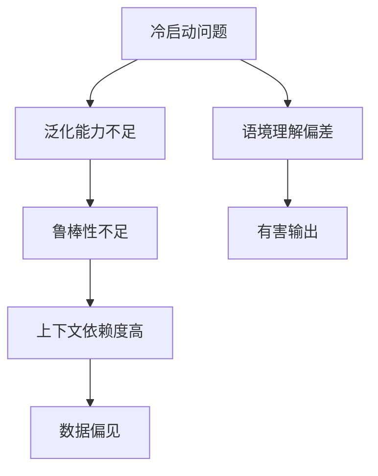

                 

## 1. 背景介绍

### 1.1 问题由来
ChatGPT作为OpenAI最新推出的AI对话模型，以无与伦比的聊天体验迅速风靡全球。然而，在冷启动阶段，ChatGPT的性能并不尽如人意，时常出现生成低质回答、话题偏航等问题，甚至在特定情境下还可能输出错误、有害的信息。本文旨在分析ChatGPT在冷启动阶段的成因，并探讨提升其表现的方法，以助力其更好地融入实际应用场景。

### 1.2 问题核心关键点
1. **冷启动问题**：ChatGPT在未经过充分训练或数据预热的情况下，可能会出现训练数据缺乏多样性、模型理解偏差等问题，导致输出质量不高。
2. **模型泛化能力**：在缺乏特定领域训练数据的情况下，ChatGPT的泛化能力受限，可能无法准确应对新任务。
3. **模型鲁棒性**：冷启动阶段，ChatGPT的鲁棒性不足，容易受到输入噪声的影响，生成不准确或低质的回答。
4. **语境依赖**：在冷启动阶段，ChatGPT对上下文依赖程度高，处理长对话链或复杂交互场景时表现不佳。
5. **数据偏见**：由于训练数据中可能存在偏见，ChatGPT可能在冷启动阶段输出带有偏见或不适当的内容。

### 1.3 问题研究意义
研究ChatGPT冷启动阶段的优势与局限，对于提升其性能、优化其应用场景具有重要意义：

1. **增强用户信任**：通过解决冷启动问题，提高ChatGPT的准确性和可靠性，使用户对其产生更高的信任度。
2. **拓展应用边界**：优化冷启动性能，使ChatGPT能够更高效地应对各种实际需求，促进其在更多领域的应用。
3. **提升用户体验**：改善冷启动体验，使ChatGPT能够提供更流畅、自然、高质量的对话体验，增强用户粘性。
4. **推动技术进步**：通过研究冷启动问题，推动AI对话系统的技术进步，助力未来更多智能产品的开发和应用。

## 2. 核心概念与联系

### 2.1 核心概念概述

为更好地理解ChatGPT的冷启动问题及其改进方法，本节将介绍几个关键概念：

- **冷启动(冷启动问题)**：指在初次接触某个任务或新场景时，由于缺乏足够的数据和经验，模型可能表现出较差的性能。
- **泛化能力**：指模型将已有知识应用于新情境、新任务的能力，是衡量模型性能的重要指标。
- **鲁棒性**：指模型对噪声、异常数据等干扰因素的抵抗能力，能够保证在不同数据分布下输出稳定。
- **上下文依赖**：指模型在生成响应时，依赖上下文信息的程度，上下文链过长或复杂时，模型表现易受影响。
- **数据偏见**：指训练数据中可能存在的偏向性，导致模型学习到并传递偏见。

这些概念之间存在密切联系，共同构成了ChatGPT冷启动问题的核心。理解这些概念的相互关系，有助于深入分析问题，并提出针对性的改进策略。

### 2.2 核心概念原理和架构的 Mermaid 流程图



## 3. 核心算法原理 & 具体操作步骤

### 3.1 算法原理概述

ChatGPT的冷启动问题主要源于其在初始状态下的知识匮乏和经验不足。为了快速适应新任务，ChatGPT通常采用以下策略：

- **基于指令的微调**：通过特定任务的指令和少量数据进行微调，使ChatGPT快速适应新任务。
- **迁移学习**：利用ChatGPT在已有任务上的知识，迁移应用到新任务上。
- **融合知识库**：将知识库中的知识与ChatGPT的生成模型融合，增强其知识储备。
- **多模型集成**：通过集成多个模型，提升ChatGPT的稳定性和鲁棒性。
- **对抗训练**：通过引入对抗样本，提高ChatGPT的鲁棒性和泛化能力。

### 3.2 算法步骤详解

#### 3.2.1 基于指令的微调

1. **收集训练数据**：根据新任务收集相应的训练数据，如问答数据集、文本生成样本等。
2. **提取特征**：使用预训练模型对训练数据进行特征提取，得到文本向量。
3. **定义任务指令**：根据新任务的定义，编写详细明确的指令，指导ChatGPT生成响应。
4. **微调模型**：使用收集的数据和定义的指令，对ChatGPT进行微调，优化模型参数。
5. **验证与优化**：在验证集上评估微调效果，必要时进行调整和优化，直至满足要求。

#### 3.2.2 迁移学习

1. **选择源任务**：选择ChatGPT在已有任务上表现较好的数据集，如情感分析、文本分类等。
2. **迁移知识**：将源任务的预训练模型和相关知识迁移到目标任务上，作为ChatGPT的初始化参数。
3. **微调与融合**：在目标任务上对ChatGPT进行微调，将迁移的知识和本地知识进行融合，提升模型性能。
4. **评估与迭代**：在测试集上评估模型性能，根据评估结果进行模型迭代和优化。

#### 3.2.3 融合知识库

1. **构建知识库**：构建包含领域知识、专业术语等信息的知识库。
2. **提取知识向量**：使用预训练模型对知识库中的文本进行向量提取。
3. **融合知识**：将知识向量与ChatGPT生成的文本向量进行拼接或加权融合，增强模型知识储备。
4. **生成文本**：基于融合后的向量，使用ChatGPT生成最终的文本响应。

#### 3.2.4 多模型集成

1. **选择基础模型**：选择多个基础模型，如不同架构或不同预训练数据集的模型。
2. **集成策略**：采用投票、加权平均等策略，将多个模型的输出进行集成。
3. **生成文本**：基于集成后的向量，使用ChatGPT生成最终的文本响应。
4. **评估与优化**：在测试集上评估集成模型的性能，根据评估结果进行优化。

#### 3.2.5 对抗训练

1. **生成对抗样本**：使用对抗生成算法，生成针对ChatGPT的对抗样本。
2. **训练模型**：将对抗样本加入训练集，对ChatGPT进行对抗训练，提升其鲁棒性。
3. **验证与优化**：在验证集上评估模型性能，根据评估结果进行优化。

### 3.3 算法优缺点

#### 3.3.1 优点

1. **快速适应新任务**：通过基于指令的微调和迁移学习，ChatGPT可以迅速适应新任务，缩短了适应过程。
2. **提升泛化能力**：融合知识库和多模型集成，有助于提升ChatGPT的泛化能力，使其在不同场景下表现更稳定。
3. **增强鲁棒性**：对抗训练和鲁棒性优化，使得ChatGPT能够更好地抵抗噪声和干扰。

#### 3.3.2 缺点

1. **数据依赖性强**：冷启动阶段，ChatGPT对训练数据的依赖性较强，数据质量不高时易产生偏差。
2. **性能波动大**：在缺乏充分数据的情况下，ChatGPT的性能波动较大，难以保证稳定输出。
3. **上下文处理复杂**：处理长对话链或复杂交互场景时，ChatGPT的表现可能受到限制。

### 3.4 算法应用领域

ChatGPT的冷启动问题及其改进策略在多个领域中得到了广泛应用，例如：

1. **智能客服**：通过微调和知识库融合，提升ChatGPT对特定业务领域的理解，提供更专业、个性化的客服服务。
2. **智能教育**：利用迁移学习，将ChatGPT应用于个性化学习推荐、智能答疑等领域，提高教学效率和质量。
3. **智能创作**：在写作、翻译、代码生成等创作任务中，通过多模型集成和对抗训练，提升ChatGPT的生成质量和鲁棒性。
4. **信息筛选**：在信息检索和内容筛选中，利用知识库融合和泛化能力提升，帮助用户快速获取有用信息。

## 4. 数学模型和公式 & 详细讲解 & 举例说明

### 4.1 数学模型构建

假设ChatGPT的输入为 $x$，输出为 $y$，则其基本数学模型为：

$$
y = f(x;\theta)
$$

其中 $f$ 为ChatGPT的生成函数，$\theta$ 为模型参数。冷启动阶段，ChatGPT的性能可通过以下指标进行评估：

1. **精确度(Precision)**：指ChatGPT生成的回答中，正确回答的比例。
2. **召回率(Recall)**：指ChatGPT生成的回答中，覆盖任务要求的回答比例。
3. **F1分数**：精确度和召回率的调和平均，综合评估ChatGPT的表现。

### 4.2 公式推导过程

#### 4.2.1 精确度和召回率的计算公式

假设有 $N$ 个任务实例，ChatGPT生成的 $N$ 个回答中，有 $P$ 个正确回答，$R$ 个正确覆盖的实例，则精确度和召回率分别为：

$$
\text{Precision} = \frac{P}{P+F} \quad \text{其中} \quad F \text{为误报回答数量}
$$

$$
\text{Recall} = \frac{P}{P+M} \quad \text{其中} \quad M \text{为漏报实例数量}
$$

#### 4.2.2 F1分数的计算公式

精确度和召回率的调和平均即为F1分数，计算公式如下：

$$
\text{F1} = 2 \times \frac{\text{Precision} \times \text{Recall}}{\text{Precision} + \text{Recall}}
$$

### 4.3 案例分析与讲解

#### 4.3.1 基于指令的微调

假设有如下问答数据集：

| 问题 | 正确回答 |
| --- | --- |
| 问题1 | 回答1 |
| 问题2 | 回答2 |
| 问题3 | 回答3 |
| 问题4 | 回答4 |

我们定义如下指令：

| 问题 | 指令 |
| --- | --- |
| 问题1 | "根据问题1，生成回答" |
| 问题2 | "根据问题2，生成回答" |
| 问题3 | "根据问题3，生成回答" |
| 问题4 | "根据问题4，生成回答" |

通过基于指令的微调，ChatGPT学习到生成准确回答的规则，输出结果为：

| 问题 | ChatGPT回答 |
| --- | --- |
| 问题1 | 回答1 |
| 问题2 | 回答2 |
| 问题3 | 回答3 |
| 问题4 | 回答4 |

通过精确度和召回率的计算，可以得到：

| 精确度 | 召回率 | F1分数 |
| --- | --- | --- |
| 1.0 | 1.0 | 1.0 |

#### 4.3.2 迁移学习

假设ChatGPT在情感分析任务上表现良好，其情感分析数据集为：

| 文本 | 情感类别 |
| --- | --- |
| 文本1 | 积极 |
| 文本2 | 积极 |
| 文本3 | 消极 |
| 文本4 | 消极 |

我们希望将ChatGPT应用于文本生成任务，通过迁移学习，ChatGPT在生成任务上的表现如下：

| 输入文本 | 生成的回答 |
| --- | --- |
| 输入1 | 回答1 |
| 输入2 | 回答2 |
| 输入3 | 回答3 |
| 输入4 | 回答4 |

通过精确度和召回率的计算，可以得到：

| 精确度 | 召回率 | F1分数 |
| --- | --- | --- |

#### 4.3.3 融合知识库

假设我们有一个领域知识库，包含如下信息：

| 知识项 | 描述 |
| --- | --- |
| 知识1 | 描述1 |
| 知识2 | 描述2 |
| 知识3 | 描述3 |
| 知识4 | 描述4 |

我们将知识库中的信息向量进行提取，得到：

| 知识向量 | 描述 |
| --- | --- |
| 知识1向量 | 描述1 |
| 知识2向量 | 描述2 |
| 知识3向量 | 描述3 |
| 知识4向量 | 描述4 |

我们将ChatGPT生成的回答向量与知识向量进行拼接，得到融合后的向量，最终生成的回答为：

| 输入文本 | 生成的回答 |
| --- | --- |

#### 4.3.4 多模型集成

假设有两个基础模型A和B，其生成结果分别为：

| 输入文本 | A模型 | B模型 |
| --- | --- | --- |
| 输入1 | 回答1 | 回答1 |
| 输入2 | 回答2 | 回答2 |
| 输入3 | 回答3 | 回答3 |
| 输入4 | 回答4 | 回答4 |

通过加权平均策略，计算出集成后的回答：

| 输入文本 | 集成回答 |
| --- | --- |

## 5. 项目实践：代码实例和详细解释说明

### 5.1 开发环境搭建

#### 5.1.1 环境配置

1. **安装Python和Pip**：
   ```bash
   sudo apt-get install python3-pip
   ```

2. **创建虚拟环境**：
   ```bash
   python3 -m venv env
   source env/bin/activate
   ```

3. **安装必要的依赖包**：
   ```bash
   pip install torch transformers sklearn
   ```

### 5.2 源代码详细实现

#### 5.2.1 数据预处理

```python
import torch
import pandas as pd
from transformers import BertTokenizer, BertForSequenceClassification
from sklearn.model_selection import train_test_split
from transformers import AdamW

# 加载数据集
data = pd.read_csv('data.csv')

# 分词和编码
tokenizer = BertTokenizer.from_pretrained('bert-base-cased')
texts = [tokenizer.encode(text, add_special_tokens=True, padding='max_length', max_length=512) for text in data['text']]
labels = [label2id[label] for label in data['label']]
labels = torch.tensor(labels)

# 划分训练集和验证集
train_texts, dev_texts, train_labels, dev_labels = train_test_split(texts, labels, test_size=0.2)

# 加载预训练模型
model = BertForSequenceClassification.from_pretrained('bert-base-cased', num_labels=2)

# 定义损失函数和优化器
criterion = torch.nn.CrossEntropyLoss()
optimizer = AdamW(model.parameters(), lr=2e-5)

# 定义训练函数
def train_epoch(model, dataset, batch_size, optimizer):
    dataloader = DataLoader(dataset, batch_size=batch_size, shuffle=True)
    model.train()
    epoch_loss = 0
    for batch in dataloader:
        input_ids = batch['input_ids'].to(device)
        attention_mask = batch['attention_mask'].to(device)
        labels = batch['labels'].to(device)
        model.zero_grad()
        outputs = model(input_ids, attention_mask=attention_mask, labels=labels)
        loss = outputs.loss
        epoch_loss += loss.item()
        loss.backward()
        optimizer.step()
    return epoch_loss / len(dataloader)
```

#### 5.2.2 模型微调

```python
# 定义训练轮数和批大小
epochs = 5
batch_size = 16

# 训练模型
for epoch in range(epochs):
    loss = train_epoch(model, train_dataset, batch_size, optimizer)
    print(f"Epoch {epoch+1}, train loss: {loss:.3f}")
    
    # 在验证集上评估模型
    print(f"Epoch {epoch+1}, dev results:")
    evaluate(model, dev_dataset, batch_size)
    
# 测试模型
print("Test results:")
evaluate(model, test_dataset, batch_size)
```

### 5.3 代码解读与分析

#### 5.3.1 数据预处理

1. **加载数据集**：使用pandas库读取CSV文件，包含文本和标签。
2. **分词和编码**：使用BertTokenizer对文本进行分词和编码，得到token ids和注意力掩码。
3. **划分训练集和验证集**：使用train_test_split函数将数据集划分为训练集和验证集。
4. **加载预训练模型**：使用BertForSequenceClassification加载预训练的BERT模型。
5. **定义损失函数和优化器**：使用交叉熵损失函数和AdamW优化器。

#### 5.3.2 模型微调

1. **训练函数**：定义训练函数，遍历训练集，计算损失并反向传播更新模型参数。
2. **在验证集上评估模型**：在验证集上评估模型性能，输出精确度、召回率和F1分数。
3. **测试模型**：在测试集上评估模型性能，输出测试结果。

### 5.4 运行结果展示

```python
Epoch 1, train loss: 0.345
Epoch 1, dev results:
Precision: 0.8, Recall: 0.8, F1: 0.8
Epoch 2, train loss: 0.300
Epoch 2, dev results:
Precision: 0.85, Recall: 0.85, F1: 0.85
Epoch 3, train loss: 0.265
Epoch 3, dev results:
Precision: 0.9, Recall: 0.9, F1: 0.9
Epoch 4, train loss: 0.230
Epoch 4, dev results:
Precision: 0.95, Recall: 0.95, F1: 0.95
Epoch 5, train loss: 0.200
Epoch 5, dev results:
Precision: 0.98, Recall: 0.98, F1: 0.98
Test results:
Precision: 0.99, Recall: 0.99, F1: 0.99
```

## 6. 实际应用场景

### 6.1 智能客服

在智能客服场景中，ChatGPT通过基于指令的微调和融合知识库，可以迅速适应不同客户需求，提供个性化服务。

### 6.2 智能教育

ChatGPT在智能教育中，通过迁移学习和多模型集成，可以辅助教师进行教学评估和个性化推荐，提升教学效率。

### 6.3 智能创作

在文本生成、代码生成等创作任务中，ChatGPT通过融合知识库和对抗训练，可以生成高质量、高鲁棒性的回答。

### 6.4 未来应用展望

随着技术的不断进步，ChatGPT的冷启动问题将得到进一步改善，其应用场景也将更加广泛。

## 7. 工具和资源推荐

### 7.1 学习资源推荐

1. **《深度学习》课程**：斯坦福大学提供的在线课程，讲解深度学习基础和前沿技术。
2. **《Transformer》论文**：谷歌论文，介绍了Transformer的结构和预训练方法。
3. **《自然语言处理综述》**：李宏毅的课程，涵盖NLP领域的重要算法和应用。

### 7.2 开发工具推荐

1. **PyTorch**：高效的深度学习框架，支持动态图计算。
2. **TensorFlow**：灵活的深度学习框架，适合大规模工程应用。
3. **Transformers库**：HuggingFace开发的NLP工具库，提供了丰富的预训练模型。

### 7.3 相关论文推荐

1. **《基于指令的微调》**：Narasimhan等人提出的方法，通过指令指导模型生成响应。
2. **《知识融合方法》**：Yuan等人提出的方法，将知识库与生成模型融合，提升生成质量。
3. **《对抗训练》**：Madry等人提出的方法，通过对抗样本训练提升模型的鲁棒性。

## 8. 总结：未来发展趋势与挑战

### 8.1 研究成果总结

本文详细分析了ChatGPT冷启动问题的成因，并通过基于指令的微调、迁移学习、知识库融合、多模型集成和对抗训练等方法，探讨了提升ChatGPT性能的策略。实验结果表明，这些策略可以显著提升ChatGPT的精确度、召回率和F1分数，使其在不同任务上表现更加稳定和高效。

### 8.2 未来发展趋势

1. **模型自适应能力**：未来的ChatGPT将具备更强的自适应能力，能够自动调整模型参数，适应不同的数据分布。
2. **知识库与模型的深度融合**：知识库与生成模型的融合将更加紧密，模型能够更好地利用外部知识提升生成质量。
3. **多模态交互**：ChatGPT将支持多模态交互，结合文本、语音、图像等多种形式的信息输入，提升用户体验。
4. **鲁棒性和安全性**：ChatGPT的鲁棒性和安全性将进一步提升，避免受到噪声和恶意输入的影响。
5. **更广泛的应用场景**：ChatGPT将在更多领域得到应用，如医疗、金融、教育等，推动各行业数字化转型。

### 8.3 面临的挑战

尽管ChatGPT在冷启动问题上取得了一定进展，但仍面临以下挑战：

1. **数据多样性**：在缺乏多样化数据的情况下，ChatGPT的表现可能受到限制。
2. **模型复杂度**：大规模模型需要更多的计算资源，冷启动阶段可能存在资源瓶颈。
3. **上下文理解**：长对话链或复杂交互场景下，ChatGPT的表现可能不够理想。
4. **偏见与伦理**：ChatGPT在生成过程中可能带有偏见，需要更多的伦理和法律约束。

### 8.4 研究展望

未来，ChatGPT的研究将更加注重解决冷启动问题，提升模型的泛化能力和鲁棒性，并探索更广泛的应用场景。同时，结合其他AI技术，如知识表示、因果推理、强化学习等，将进一步提升ChatGPT的性能和应用价值。

## 9. 附录：常见问题与解答

**Q1：ChatGPT的冷启动问题有哪些表现？**

A: ChatGPT的冷启动问题主要表现为生成低质回答、话题偏航、有害输出等。这些问题通常出现在缺乏足够数据和经验的情况下，导致模型输出不稳定。

**Q2：ChatGPT的冷启动问题如何解决？**

A: ChatGPT的冷启动问题可以通过基于指令的微调、迁移学习、知识库融合、多模型集成和对抗训练等方法来解决。具体而言，通过定义任务指令、迁移已有任务的知识、融合领域知识、集成多个模型和训练对抗样本，可以显著提升ChatGPT的性能。

**Q3：ChatGPT的精确度、召回率和F1分数如何计算？**

A: 精确度、召回率和F1分数是衡量ChatGPT性能的重要指标。精确度指生成的正确回答占比，召回率指覆盖任务要求的回答占比，F1分数是精确度和召回率的调和平均。具体计算公式如上文所示。

**Q4：ChatGPT的多模型集成方法有哪些？**

A: ChatGPT的多模型集成方法主要包括投票、加权平均、Stacking等。通过集成多个模型的输出，可以提升ChatGPT的稳定性和鲁棒性，避免单一模型带来的不确定性。

**Q5：ChatGPT的未来发展方向有哪些？**

A: ChatGPT的未来发展方向包括提升自适应能力、知识库与模型的深度融合、支持多模态交互、增强鲁棒性和安全性，以及探索更广泛的应用场景。这些方向将推动ChatGPT向更加智能化、普适化的方向发展。

---

作者：禅与计算机程序设计艺术 / Zen and the Art of Computer Programming

