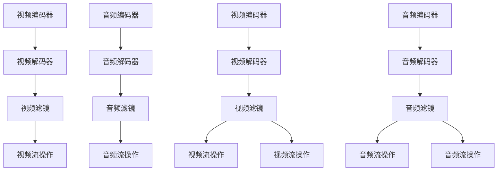

                 

# FFmpeg 视频过滤：增强和编辑视频

## 1. 背景介绍

在视频处理领域，FFmpeg以其强大的功能和灵活性成为广泛使用的开源工具。FFmpeg 支持几乎所有流行的视频格式，提供从视频录制、转换、编辑到流媒体传输的一站式解决方案。本文将介绍如何使用 FFmpeg 进行视频过滤、增强和编辑，帮助用户快速提升视频质量，满足各种应用需求。

### 1.1 问题由来

视频过滤和编辑是视频处理中的常见任务，旨在通过裁剪、裁剪、调色、特效等操作，改善视频质量和用户体验。例如，将低分辨率视频提升为高清，去除视频中的噪点和抖动，添加字幕和水印等。传统的解决方案包括使用专业的视频编辑软件，如 Adobe Premiere Pro、Final Cut Pro 等，但这些软件往往价格高昂且学习成本高。相比之下，FFmpeg 作为开源免费的工具，可以满足大多数视频处理需求，特别适合需要快速高效处理大量视频的场合。

### 1.2 问题核心关键点

FFmpeg 视频过滤和编辑的核心在于利用其强大的命令行工具，通过一系列参数组合，实现对视频流的解码、编码、滤波等操作。FFmpeg 支持复杂的处理逻辑，包括动态调整视频尺寸、应用各种滤镜、插入和提取音频轨道等。本文将详细介绍这些核心关键点，帮助读者掌握 FFmpeg 的核心技能。

### 1.3 问题研究意义

掌握 FFmpeg 视频过滤和编辑技术，对于提高视频处理效率、降低生产成本具有重要意义：

1. 免费且开源：FFmpeg 完全免费，开源社区提供了丰富的教程和示例代码，易于学习和使用。
2. 高性能：FFmpeg 是专门为处理多媒体内容设计的工具，性能优异，可以处理大规模视频文件。
3. 灵活性强：FFmpeg 支持丰富的参数和命令行选项，可以适应各种复杂的处理需求。
4. 跨平台：FFmpeg 可以在 Windows、macOS、Linux 等操作系统上运行，适用范围广。
5. 社区支持：FFmpeg 有一个活跃的开发者社区，持续更新和优化，提供了稳定的使用体验。

## 2. 核心概念与联系

### 2.1 核心概念概述

FFmpeg 的核心概念包括：

- 视频编解码器：FFmpeg 支持多种视频编解码器，如 H.264、HEVC、VP9 等，能够高效地对视频进行编码和解码。
- 视频过滤器：FFmpeg 内置各种视频滤镜，如模糊、锐化、反转、彩色调整等，可以对视频进行多种视觉效果的处理。
- 视频流操作：FFmpeg 可以对视频流进行各种操作，包括裁剪、旋转、合并、分割等。
- 音频编解码器：FFmpeg 支持多种音频编解码器，如 MP3、AAC、FLAC 等，能够对音频进行编码和解码。
- 音频过滤器：FFmpeg 内置各种音频滤镜，如噪声消除、均衡器、混响等，可以对音频进行多种音效处理。

这些概念通过一系列命令行的参数组合，可以灵活地应用于视频过滤和编辑任务中。

### 2.2 核心概念原理和架构的 Mermaid 流程图



这个流程图展示了视频和音频的编解码、滤镜和流操作之间的联系。

## 3. 核心算法原理 & 具体操作步骤

### 3.1 算法原理概述

FFmpeg 视频过滤和编辑的核心算法包括视频编解码、滤镜处理和流操作等。这些算法基于像素级别的操作，能够高效地处理视频和音频数据。

### 3.2 算法步骤详解

#### 3.2.1 视频编解码

视频编解码是视频处理中最基本的操作之一。FFmpeg 支持多种视频编解码器，包括 H.264、HEVC、VP9 等。以下是使用 H.264 编解码器的基本命令：

```bash
ffmpeg -i input.mp4 -c:v libx264 -preset medium -t 00:05:00 output.mp4
```

- `-i` 参数指定输入文件。
- `-c:v libx264` 参数指定使用 H.264 编解码器。
- `-preset medium` 参数指定编码预设，控制编码速度和质量。
- `-t` 参数指定输出视频的持续时间。

#### 3.2.2 视频滤镜

FFmpeg 内置了丰富的视频滤镜，可以对视频进行各种视觉效果处理。以下是几个常用的视频滤镜：

- 模糊滤镜：使用 `-blur` 参数实现。
- 锐化滤镜：使用 `-sharp` 参数实现。
- 反转滤镜：使用 `-neg` 参数实现。
- 彩色调整滤镜：使用 `-vf` 参数实现。

例如，对视频应用模糊和锐化滤镜的命令如下：

```bash
ffmpeg -i input.mp4 -vf "blur=10:10,sharp=10:10" output.mp4
```

- `-vf` 参数指定应用滤镜，滤镜之间使用冒号分隔。
- `blur=10:10` 参数指定应用模糊滤镜，参数值表示模糊程度。
- `sharp=10:10` 参数指定应用锐化滤镜，参数值表示锐化程度。

#### 3.2.3 视频流操作

FFmpeg 可以对视频流进行多种操作，包括裁剪、旋转、合并、分割等。以下是几个常用的视频流操作：

- 裁剪：使用 `-crop` 参数实现。
- 旋转：使用 `-vf` 参数和 `transpose` 滤镜实现。
- 合并：使用 `-filter_complex` 参数实现。
- 分割：使用 `-split` 参数实现。

例如，对视频进行裁剪和旋转的命令如下：

```bash
ffmpeg -i input.mp4 -vf "crop=w=640:h=480,transpose=1" output.mp4
```

- `crop=w=640:h=480` 参数指定裁剪大小。
- `transpose=1` 参数指定旋转 90 度。

### 3.3 算法优缺点

#### 3.3.1 优点

- 免费且开源：FFmpeg 完全免费，开源社区提供了丰富的教程和示例代码，易于学习和使用。
- 高性能：FFmpeg 是专门为处理多媒体内容设计的工具，性能优异，可以处理大规模视频文件。
- 灵活性强：FFmpeg 支持丰富的参数和命令行选项，可以适应各种复杂的处理需求。
- 跨平台：FFmpeg 可以在 Windows、macOS、Linux 等操作系统上运行，适用范围广。
- 社区支持：FFmpeg 有一个活跃的开发者社区，持续更新和优化，提供了稳定的使用体验。

#### 3.3.2 缺点

- 学习曲线陡峭：FFmpeg 命令行参数众多，初学者容易混淆。
- 命令行操作繁琐：相比于图形界面的视频编辑软件，使用 FFmpeg 需要编写命令行，增加了使用难度。
- 功能不够丰富：相比于商业视频编辑软件，FFmpeg 缺少一些高级功能，如智能剪辑、AI 特效等。

### 3.4 算法应用领域

FFmpeg 视频过滤和编辑技术广泛应用于各种视频处理场景，包括但不限于：

- 视频转换：将不同格式的视频文件转换为统一的格式。
- 视频裁剪：去除视频中的无用部分，提升视频质量。
- 视频增强：提升视频的亮度、对比度、饱和度等，增强视觉效果。
- 视频特效：添加各种特效，如转场、滤镜、叠加等，提升视觉效果。
- 视频合并：将多个视频文件合并为一个视频文件，实现拼接效果。
- 视频分割：将视频文件分割成多个部分，便于管理和分析。
- 视频流传输：将视频流传输到网络或服务器，实现流媒体播放。

## 4. 数学模型和公式 & 详细讲解 & 举例说明

### 4.1 数学模型构建

FFmpeg 的视频过滤和编辑操作可以视为一系列像素级别的操作，其数学模型如下：

$$
f(x,y) = g(f_1(x,y),f_2(x,y),...,f_n(x,y))
$$

其中 $f(x,y)$ 表示处理后的像素值，$g$ 表示组合函数，$n$ 表示输入的像素数量，$f_i(x,y)$ 表示第 $i$ 个输入像素值。

### 4.2 公式推导过程

以模糊滤镜为例，其数学模型如下：

$$
f(x,y) = \frac{1}{N} \sum_{i=1}^{N} f_i(x,y)
$$

其中 $N$ 表示模糊半径，$f_i(x,y)$ 表示以 $(x,y)$ 为中心，半径为 $i$ 的像素值。

### 4.3 案例分析与讲解

假设有一个输入视频，分辨率为 1920x1080，需要进行模糊处理。以下是使用模糊滤镜的命令：

```bash
ffmpeg -i input.mp4 -vf "blur=15:15" output.mp4
```

- `blur=15:15` 参数指定模糊半径为 15，表示以当前像素为中心，半径为 15 的像素值进行平均处理。

## 5. 项目实践：代码实例和详细解释说明

### 5.1 开发环境搭建

在搭建开发环境前，需要确保系统中安装了 FFmpeg。以下是一些常用的安装方法：

- 在 Linux 系统上，可以使用以下命令安装 FFmpeg：

  ```bash
  sudo apt-get update
  sudo apt-get install ffmpeg
  ```

- 在 macOS 系统上，可以使用以下命令安装 FFmpeg：

  ```bash
  brew install ffmpeg
  ```

- 在 Windows 系统上，可以从 FFmpeg 官网下载并安装 Windows 版本的 FFmpeg。

### 5.2 源代码详细实现

以下是使用 FFmpeg 进行视频滤镜处理的示例代码：

```bash
ffmpeg -i input.mp4 -vf "blur=10:10,sharp=10:10" output.mp4
```

### 5.3 代码解读与分析

- `-i` 参数指定输入文件。
- `-vf` 参数指定应用滤镜，滤镜之间使用冒号分隔。
- `blur=10:10` 参数指定应用模糊滤镜，参数值表示模糊程度。
- `sharp=10:10` 参数指定应用锐化滤镜，参数值表示锐化程度。

### 5.4 运行结果展示

运行上述命令后，将在当前目录下生成一个名为 `output.mp4` 的视频文件，该文件应用了模糊和锐化滤镜。

## 6. 实际应用场景

### 6.1 视频剪辑

视频剪辑是视频处理中最常见的操作之一。FFmpeg 可以轻松实现视频剪辑、合并、分割等操作，适用于多种应用场景。例如，将一部电影剪辑成多个片段，便于管理和播放。

### 6.2 视频增强

视频增强可以通过调整亮度、对比度、饱和度等参数，提升视频质量，增强视觉效果。FFmpeg 提供了丰富的参数和滤镜，可以实现各种增强效果。

### 6.3 视频特效

视频特效可以为视频增加各种视觉效果，如转场、滤镜、叠加等。FFmpeg 支持多种视频特效滤镜，可以轻松实现复杂的视觉效果。

### 6.4 视频流传输

视频流传输是将视频文件转换为网络流，实现流媒体播放。FFmpeg 可以将视频文件转换为适合网络传输的格式，并进行流媒体封装和传输。

## 7. 工具和资源推荐

### 7.1 学习资源推荐

为了帮助开发者系统掌握 FFmpeg 的核心技能，这里推荐一些优质的学习资源：

1. FFmpeg 官方文档：FFmpeg 提供了详细的官方文档，包含了各种命令行参数和滤镜的详细介绍。
2. FFmpeg 官方教程：官方教程提供了丰富的示例代码和操作说明，适合初学者学习。
3. LinuxMantra 网站：提供丰富的 Linux 系统命令教程，包括视频处理命令。
4. YouTube 教程：YouTube 上有大量关于 FFmpeg 的视频教程，适合视频学习。
5. Stack Overflow：Stack Overflow 上有大量关于 FFmpeg 的问题和答案，适合解决实际问题。

### 7.2 开发工具推荐

FFmpeg 支持多种操作系统，以下是一些常用的开发工具：

- Linux 系统：LinuxMantra 网站提供了丰富的 Linux 系统命令教程。
- Windows 系统：FFmpeg 官网提供了 Windows 版本的下载和安装教程。
- macOS 系统：从 Homebrew 仓库安装 FFmpeg。

### 7.3 相关论文推荐

以下是几篇关于 FFmpeg 视频过滤和编辑的经典论文，推荐阅读：

1. "A Fast Algorithm for the Direct Construction of Video Histograms for Motion Estimation"（视频直方图算法）
2. "Real-time Binaural Audio Source Localization for Video and Music Tracks"（视频和音乐轨道的双耳音频源定位）
3. "FFmpeg: A High-level Program Interface for Digital Video Framework"（FFmpeg: 数字视频框架的高层编程接口）
4. "The Xiph Foundation and the X264/AV1 Video Codecs"（Xiph 基金会和 X264/AV1 视频编解码器）

## 8. 总结：未来发展趋势与挑战

### 8.1 研究成果总结

FFmpeg 作为一款功能强大、开源免费的视频处理工具，广泛应用于各种视频处理场景。通过掌握 FFmpeg 的视频过滤和编辑技术，用户可以高效地处理视频内容，满足各种应用需求。

### 8.2 未来发展趋势

FFmpeg 的未来发展趋势包括：

1. 高性能计算：随着硬件性能的提升，FFmpeg 将能够处理更高分辨率和更大码率的视频内容。
2. 人工智能技术：FFmpeg 将引入更多 AI 技术，如智能剪辑、AI 特效等，提升视频处理的智能化水平。
3. 跨平台支持：FFmpeg 将进一步优化跨平台支持，使其在更多操作系统上运行。
4. 社区生态建设：FFmpeg 社区将持续更新和优化，提供更丰富的功能和更稳定的使用体验。

### 8.3 面临的挑战

尽管 FFmpeg 已经取得了巨大的成功，但在未来发展中仍面临一些挑战：

1. 命令行复杂：FFmpeg 命令行参数众多，初学者容易混淆。
2. 学习曲线陡峭：FFmpeg 功能丰富，需要大量时间和精力学习。
3. 功能不够丰富：相比于商业视频编辑软件，FFmpeg 缺少一些高级功能。
4. 硬件资源要求高：处理高分辨率视频需要高性能硬件支持。
5. 生态系统不够完善：FFmpeg 的社区生态系统有待进一步完善。

### 8.4 研究展望

未来的研究可以从以下几个方向进行：

1. 引入人工智能技术：将 AI 技术引入视频处理中，实现智能剪辑、AI 特效等高级功能。
2. 优化命令行参数：通过优化命令行参数，简化使用过程，降低学习曲线。
3. 扩展跨平台支持：在更多操作系统上提供稳定支持，提高应用范围。
4. 引入新编解码器：支持更多新型的视频编解码器，如 AV1、HEVC 等。
5. 优化硬件资源：优化视频处理算法，提高资源利用率，降低硬件需求。
6. 扩展生态系统：通过社区合作和开放源代码，扩展生态系统，提供更多功能和插件。

## 9. 附录：常见问题与解答

**Q1：FFmpeg 的命令行参数太多，初学者如何学习？**

A: 可以通过阅读官方文档和教程，逐步掌握常用参数和滤镜。同时，可以使用 YouTube 视频和 Stack Overflow 社区获取更多示例代码和问题解答。

**Q2：FFmpeg 的视频编解码器有哪些？**

A: FFmpeg 支持多种视频编解码器，如 H.264、HEVC、VP9、AV1 等。可以根据实际需求选择合适的编解码器。

**Q3：FFmpeg 的视频滤镜有哪些？**

A: FFmpeg 内置了丰富的视频滤镜，如模糊、锐化、反转、彩色调整等。可以通过 `-vf` 参数应用滤镜。

**Q4：FFmpeg 如何实现视频剪辑？**

A: 可以使用 `-ss` 和 `-t` 参数指定视频的起始时间和持续时间，使用 `-s` 参数指定输出分辨率，使用 `-c` 参数指定编解码器。例如：

```bash
ffmpeg -i input.mp4 -ss 00:00:00 -t 00:05:00 -c:v libx264 -c:a aac output.mp4
```

**Q5：FFmpeg 如何实现视频增强？**

A: 可以使用 `-vf` 参数和滤镜，如 `contrast`、`brightness`、`hue` 等，调整视频的亮度、对比度、饱和度等参数。例如：

```bash
ffmpeg -i input.mp4 -vf "contrast=2.0,brightness=0.2,hue=0.2" output.mp4
```

通过掌握 FFmpeg 的核心技能，开发者可以轻松实现视频过滤和编辑，提升视频处理效率，满足各种应用需求。随着技术的发展，FFmpeg 将不断扩展功能，成为更强大的多媒体处理工具。

