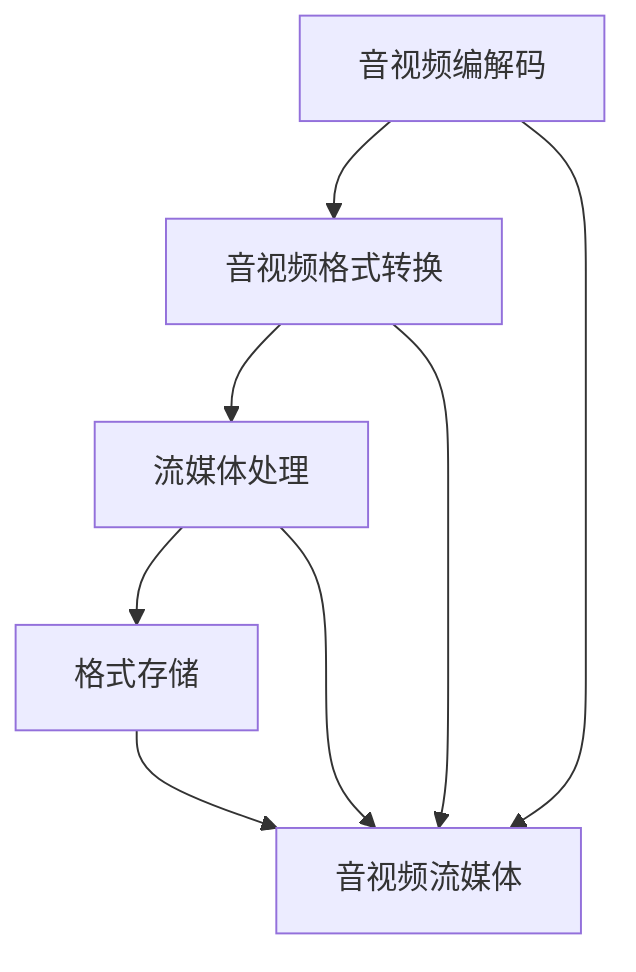

                 

# FFmpeg音视频处理：编解码与流媒体

## 1. 背景介绍

### 1.1 问题由来

在现代社会，音视频内容已经成为了信息传播的主导形式。无论是电影、电视剧，还是音乐、视频播客，都承载着人们获取知识和娱乐的重要功能。随着互联网的普及和智能设备的快速发展，音视频数据的传输和处理也成为了新的技术挑战。如何高效、稳定地传输大量音视频数据，同时保证高质量的编解码和流媒体体验，成为了业界普遍关注的焦点。

FFmpeg作为一款开源的音视频处理工具，以其强大的编解码能力、灵活的流媒体处理和丰富的插件支持，成为了音视频处理领域的“瑞士军刀”。本文将深入探讨FFmpeg的核心算法和具体操作步骤，旨在为读者提供全面、系统的音视频处理知识，帮助其高效利用FFmpeg进行音视频编解码和流媒体应用开发。

## 2. 核心概念与联系

### 2.1 核心概念概述

FFmpeg是一个集音视频编解码、流媒体处理、格式转换等多种功能于一体的开源软件。其主要功能包括：

- 音视频编解码：支持多种音视频格式之间的编解码，包括但不限于MP3、WAV、AVI、MP4等。
- 流媒体处理：支持实时音视频流的传输和分发，包括直播、点播、播客等多种形式。
- 格式转换：支持多种音视频格式的转换，如将MP4转换为WebM、将AVI转换为MOV等。

### 2.2 核心概念原理和架构的 Mermaid 流程图



这个流程图展示了FFmpeg的核心功能架构：

1. 音视频编解码模块负责将原始音视频数据转换为特定格式的音频流和视频流。
2. 音视频格式转换模块支持多种格式之间的转换，方便用户在不同场景下使用不同的格式。
3. 流媒体处理模块用于将音视频流封装成流媒体格式，并进行实时传输。
4. 格式存储模块支持将音视频流转换为可存储的文件格式，方便后续的查看和分享。
5. 音视频流媒体是FFmpeg的核心应用场景，通过实时流媒体传输，实现视频点播、直播等功能的支持。

## 3. 核心算法原理 & 具体操作步骤

### 3.1 算法原理概述

FFmpeg的核心算法涉及音视频编解码、流媒体传输和格式转换等多个方面。其中，音视频编解码和流媒体传输是FFmpeg的核心功能，也是本文重点探讨的内容。

音视频编解码采用H.264、AAC等标准的编码格式，通过复杂的熵编码、变换编码等技术，将原始的音视频数据压缩成特定的格式，从而减少数据传输和存储所需的带宽和存储空间。流媒体传输则通过RTSP、RTP等协议，将音视频数据流化，并进行实时传输，实现视频点播、直播等功能。

### 3.2 算法步骤详解

#### 3.2.1 音视频编解码算法步骤

1. **帧分割与熵编码**：将原始音视频数据分割成多个帧，并对每一帧进行熵编码，减少数据量。
2. **变换编码**：对每一帧进行离散余弦变换（DCT）、离散小波变换（DWT）等变换编码，进一步压缩数据。
3. **量化与反量化**：将变换后的数据进行量化，减少数据的精度，同时将量化后的数据进行反量化，还原为原始数据。
4. **熵编码与解编码**：对量化后的数据进行熵编码，如霍夫曼编码、算术编码等，进一步压缩数据，并使用相同的编码方法进行解编码，还原数据。

#### 3.2.2 流媒体传输算法步骤

1. **分包与封装**：将音视频数据流化，分割成多个数据包，并封装成RTSP、RTP等协议格式。
2. **实时传输与接收**：使用RTSP、RTP等协议，进行实时音视频流的传输和接收，确保数据实时到达客户端。
3. **网络优化**：通过网络优化技术，如UDP包丢失重传、TCP拥塞控制等，确保音视频流在网络中传输的稳定性和可靠性。

### 3.3 算法优缺点

#### 3.3.1 音视频编解码算法优点

1. **压缩比高**：H.264、AAC等标准编码格式压缩比高，能够显著减少音视频数据传输和存储所需的带宽和存储空间。
2. **编码速度快**：经过多年优化，H.264、AAC等标准编码格式的编解码速度已经非常快，能够满足实时音视频传输的需求。
3. **支持多种格式**：FFmpeg支持多种音视频格式，方便用户在不同场景下使用不同的格式。

#### 3.3.2 音视频编解码算法缺点

1. **复杂度高**：H.264、AAC等标准编码格式需要复杂的熵编码、变换编码等技术，实现难度较大。
2. **依赖标准**：标准编码格式的解码依赖于硬件解码器，需要相应的硬件支持。

#### 3.3.3 流媒体传输算法优点

1. **实时性高**：RTSP、RTP等协议能够实现实时音视频流的传输，满足视频点播、直播等功能的需求。
2. **网络优化**：通过网络优化技术，确保音视频流在网络中的稳定性和可靠性。

#### 3.3.4 流媒体传输算法缺点

1. **协议复杂**：RTSP、RTP等协议的使用需要较强的网络知识，有一定的学习成本。
2. **延迟较高**：在网络拥堵的情况下，音视频流可能会出现延迟，影响用户体验。

### 3.4 算法应用领域

FFmpeg的音视频编解码和流媒体传输技术被广泛应用于各种领域：

1. **视频点播**：如优酷、爱奇艺等视频平台，通过FFmpeg进行视频编码和流媒体传输，实现视频点播功能。
2. **视频直播**：如YouTube、虎牙等视频直播平台，通过FFmpeg进行实时音视频流的编码和传输，实现视频直播功能。
3. **多媒体应用**：如Skype、Zoom等多媒体应用，通过FFmpeg进行音视频编解码和流媒体处理，实现实时通信功能。
4. **安防监控**：如海康威视、大华股份等安防监控系统，通过FFmpeg进行视频编码和流媒体传输，实现实时监控功能。
5. **数字电视**：如机顶盒、智能电视等数字电视设备，通过FFmpeg进行音视频编解码和流媒体处理，实现视频播放和互动功能。

## 4. 数学模型和公式 & 详细讲解 & 举例说明

### 4.1 数学模型构建

FFmpeg的音视频编解码和流媒体传输算法涉及多个数学模型，其中最核心的模型是H.264和AAC编码模型。下面以H.264编码模型为例，介绍其数学模型构建。

H.264编码模型的核心模型包括：

1. **分块离散余弦变换（DCT）**：对图像进行分块，并对每个块进行DCT变换，减少数据量。
2. **量化和反量化**：对变换后的数据进行量化，减少数据的精度，同时进行反量化，还原为原始数据。
3. **熵编码**：对量化后的数据进行霍夫曼编码或算术编码，进一步压缩数据。

### 4.2 公式推导过程

#### 4.2.1 分块离散余弦变换（DCT）

H.264编码模型的分块离散余弦变换（DCT）公式如下：

$$
\mathbf{Y} = \mathbf{X} \cdot \mathbf{C}
$$

其中，$\mathbf{Y}$ 为变换后的数据矩阵，$\mathbf{X}$ 为原始数据矩阵，$\mathbf{C}$ 为DCT变换矩阵。

#### 4.2.2 量化和反量化

H.264编码模型的量化和反量化公式如下：

$$
\mathbf{Q} = \mathbf{Y} \cdot \mathbf{Q}_M
$$

其中，$\mathbf{Q}$ 为量化后的数据矩阵，$\mathbf{Y}$ 为DCT变换后的数据矩阵，$\mathbf{Q}_M$ 为量化矩阵。

反量化公式如下：

$$
\mathbf{Y} = \mathbf{Q} \cdot \mathbf{Q}_M^{-1}
$$

其中，$\mathbf{Y}$ 为反量化后的数据矩阵，$\mathbf{Q}$ 为量化后的数据矩阵，$\mathbf{Q}_M^{-1}$ 为量化矩阵的逆矩阵。

#### 4.2.3 熵编码

H.264编码模型的熵编码公式如下：

$$
\mathbf{E} = \mathbf{Y} \cdot \mathbf{H}
$$

其中，$\mathbf{E}$ 为熵编码后的数据矩阵，$\mathbf{Y}$ 为量化后的数据矩阵，$\mathbf{H}$ 为霍夫曼编码或算术编码矩阵。

### 4.3 案例分析与讲解

#### 4.3.1 视频点播

视频点播是FFmpeg在音视频处理领域的一个重要应用场景。以优酷为例，其视频点播系统采用了H.264编码和RTSP流媒体传输技术。

1. **视频编码**：在视频点播系统启动时，服务器将原始视频文件编码为H.264格式，并将数据流化。
2. **流媒体传输**：服务器通过RTSP协议，将数据流传输到客户端，客户端使用RTSP协议接收数据流，并进行解码和播放。

#### 4.3.2 视频直播

视频直播是FFmpeg在音视频处理领域的另一个重要应用场景。以虎牙直播为例，其视频直播系统采用了H.264编码和RTSP流媒体传输技术。

1. **视频编码**：主播将原始视频流编码为H.264格式，并将数据流化。
2. **流媒体传输**：服务器通过RTSP协议，将数据流传输到客户端，客户端使用RTSP协议接收数据流，并进行解码和播放。

#### 4.3.3 多媒体应用

多媒体应用如Skype、Zoom等，通过FFmpeg进行音视频编解码和流媒体处理，实现实时通信功能。

1. **音视频编码**：用户通过麦克风和摄像头采集音频和视频数据，并使用FFmpeg进行H.264编码和AAC编码。
2. **流媒体传输**：服务器通过RTSP协议，将数据流传输到接收方，接收方使用RTSP协议接收数据流，并进行解码和播放。

## 5. 项目实践：代码实例和详细解释说明

### 5.1 开发环境搭建

要使用FFmpeg进行音视频处理，首先需要搭建开发环境。以下是使用Linux搭建FFmpeg开发环境的步骤：

1. 安装编译工具链：
```bash
sudo apt-get update
sudo apt-get install build-essential libtool autoconf
```

2. 从FFmpeg官网下载安装包：
```bash
wget https://ffmpeg.org/download.html
```

3. 解压安装包：
```bash
tar xvf ffmpeg.tar.gz
```

4. 编译安装FFmpeg：
```bash
cd ffmpeg
./configure --prefix=/usr/local
make -j8
sudo make install
```

完成上述步骤后，即可在本地使用FFmpeg进行音视频处理。

### 5.2 源代码详细实现

以下是一个使用FFmpeg进行音视频转换的Python代码示例：

```python
import subprocess

# 原始视频文件路径
input_path = "/path/to/input.mp4"

# 输出视频文件路径
output_path = "/path/to/output.mov"

# 执行FFmpeg命令进行转换
ffmpeg_command = f"ffmpeg -i {input_path} -c:v h264 -c:a aac -c:v h264 -c:a aac -vcodec mov -acodec pcm_s16be {output_path}"
subprocess.run(ffmpeg_command, shell=True)
```

该代码使用FFmpeg将MP4格式的音视频文件转换为MOV格式的音视频文件，同时保留视频和音频的H.264和AAC编码格式。

### 5.3 代码解读与分析

#### 5.3.1 ffmpeg命令解析

上述代码中，FFmpeg命令的各个参数含义如下：

- `-i`：指定输入文件路径。
- `-c:v h264`：指定视频编解码器为H.264。
- `-c:a aac`：指定音频编解码器为AAC。
- `-c:v h264`：再次指定视频编解码器为H.264。
- `-c:a aac`：再次指定音频编解码器为AAC。
- `-vcodec mov`：指定视频格式为MOV。
- `-acodec pcm_s16be`：指定音频格式为PCM16BE。
- `{output_path}`：指定输出文件路径。

#### 5.3.2 代码执行结果

执行上述代码后，可以在指定的输出路径下找到转换后的MOV文件。转换后的MOV文件包含与原始MP4文件相同的音视频编码格式，支持在各种设备上播放。

## 6. 实际应用场景

### 6.1 视频点播

视频点播是FFmpeg在音视频处理领域的重要应用场景之一。视频点播系统通过FFmpeg进行音视频编码和流媒体传输，实现了视频播放的便捷性和流畅性。

#### 6.1.1 实现原理

视频点播系统的实现原理如下：

1. **视频编码**：在用户请求视频播放时，服务器将原始视频文件编码为H.264格式，并将数据流化。
2. **流媒体传输**：服务器通过RTSP协议，将数据流传输到客户端，客户端使用RTSP协议接收数据流，并进行解码和播放。
3. **音视频渲染**：客户端将接收到的音视频数据流进行解码和渲染，最终输出到屏幕上。

#### 6.1.2 应用场景

视频点播系统广泛应用于各种视频平台，如优酷、爱奇艺等。通过FFmpeg进行音视频编码和流媒体传输，视频点播系统能够快速、稳定地播放视频，满足用户对视频播放的便捷性和流畅性的需求。

### 6.2 视频直播

视频直播是FFmpeg在音视频处理领域的另一个重要应用场景。视频直播系统通过FFmpeg进行实时音视频流的编码和传输，实现了实时视频互动。

#### 6.2.1 实现原理

视频直播系统的实现原理如下：

1. **视频编码**：主播将原始视频流编码为H.264格式，并将数据流化。
2. **流媒体传输**：服务器通过RTSP协议，将数据流传输到客户端，客户端使用RTSP协议接收数据流，并进行解码和播放。
3. **音视频渲染**：客户端将接收到的音视频数据流进行解码和渲染，最终输出到屏幕上。

#### 6.2.2 应用场景

视频直播系统广泛应用于各种直播平台，如虎牙、斗鱼等。通过FFmpeg进行实时音视频流的编码和传输，视频直播系统能够实时、稳定地传输视频数据，满足用户对视频互动的需求。

### 6.3 多媒体应用

多媒体应用如Skype、Zoom等，通过FFmpeg进行音视频编解码和流媒体处理，实现实时通信功能。

#### 6.3.1 实现原理

多媒体应用的实现原理如下：

1. **音视频编码**：用户通过麦克风和摄像头采集音频和视频数据，并使用FFmpeg进行H.264编码和AAC编码。
2. **流媒体传输**：服务器通过RTSP协议，将数据流传输到接收方，接收方使用RTSP协议接收数据流，并进行解码和播放。
3. **音视频渲染**：接收方将接收到的音视频数据流进行解码和渲染，最终输出到屏幕上。

#### 6.3.2 应用场景

多媒体应用广泛应用于各种即时通信平台，如Skype、Zoom等。通过FFmpeg进行音视频编解码和流媒体处理，多媒体应用能够实时、稳定地传输音视频数据，满足用户对即时通信的需求。

## 7. 工具和资源推荐

### 7.1 学习资源推荐

为了帮助开发者系统掌握FFmpeg的核心算法和具体操作步骤，这里推荐一些优质的学习资源：

1. FFmpeg官方文档：FFmpeg的官方文档提供了全面的API参考和示例代码，是学习和使用FFmpeg的最佳资源。
2. FFmpeg教程：各大在线平台提供的FFmpeg教程，涵盖从基础到高级的各类内容，适合不同层次的开发者学习。
3. FFmpeg源码分析：通过分析FFmpeg的源码，深入了解其核心算法和实现细节，有助于开发者更好地掌握FFmpeg的使用。
4. FFmpeg插件开发：学习开发和使用FFmpeg插件，扩展其功能，满足不同应用场景的需求。

### 7.2 开发工具推荐

FFmpeg的使用离不开开发工具的支持。以下是几款用于FFmpeg开发常用的工具：

1. Visual Studio Code：功能强大的开发编辑器，支持FFmpeg的脚本文件编写和调试。
2. JetBrains IntelliJ IDEA：专业的开发工具，支持FFmpeg的插件开发和调试。
3. Eclipse：开源的开发工具，支持FFmpeg的脚本文件编写和调试。
4. Xcode：苹果公司提供的开发工具，支持FFmpeg的iOS应用开发和调试。

### 7.3 相关论文推荐

FFmpeg的音视频编解码和流媒体传输技术涉及诸多前沿研究方向。以下是几篇奠基性的相关论文，推荐阅读：

1. "A Fast Software Implementation of the New H.264/AVC Video Coding Standard"（即H.264编码标准论文）。
2. "A Comparative Study on H.264 Video Encoding"（即H.264编码算法比较论文）。
3. "An Overview of RTSP Protocol and Its Implementation"（即RTSP协议实现论文）。
4. "The Application of FFmpeg in Audio-Video Streaming"（即FFmpeg在音视频流媒体应用中的论文）。

这些论文代表了大语言模型微调技术的发展脉络，通过学习这些前沿成果，可以帮助研究者把握学科前进方向，激发更多的创新灵感。

## 8. 总结：未来发展趋势与挑战

### 8.1 总结

本文对FFmpeg的核心算法和操作步骤进行了全面系统的介绍。首先阐述了FFmpeg在音视频处理领域的核心功能，包括音视频编解码、流媒体传输和格式转换等。其次，从原理到实践，详细讲解了FFmpeg的音视频编解码和流媒体传输过程，给出了FFmpeg的代码实例和详细解释说明。同时，本文还探讨了FFmpeg在视频点播、视频直播、多媒体应用等多个领域的应用场景，展示了FFmpeg的强大功能和广泛应用。

通过本文的系统梳理，可以看到，FFmpeg在音视频处理领域的应用非常广泛，其强大的编解码和流媒体处理能力，为各种音视频应用提供了坚实的技术基础。未来，随着音视频技术的不断发展，FFmpeg也将继续发挥重要作用，推动音视频领域的创新和进步。

### 8.2 未来发展趋势

展望未来，FFmpeg在音视频处理领域将呈现以下几个发展趋势：

1. **低延迟传输**：随着5G技术的普及，音视频流传输的延迟将进一步降低，实时性将大幅提升。FFmpeg将在低延迟传输领域发挥更大的作用。
2. **高分辨率处理**：随着超高清视频的发展，FFmpeg将处理更高分辨率的音视频数据，提供更加清晰流畅的观看体验。
3. **多平台支持**：FFmpeg将支持更多的平台和设备，实现跨平台音视频处理。
4. **深度学习集成**：将深度学习技术与FFmpeg结合，实现更加智能化的音视频处理和分析。
5. **云计算支持**：FFmpeg将进一步支持云计算平台，实现音视频数据的高效处理和存储。

### 8.3 面临的挑战

尽管FFmpeg在音视频处理领域已经取得了诸多成果，但在迈向更加智能化、普适化应用的过程中，它仍面临诸多挑战：

1. **低延迟处理**：在实时音视频传输中，如何降低延迟是FFmpeg需要解决的重要问题。
2. **高分辨率处理**：超高清视频的处理对计算资源和存储资源提出了更高要求，FFmpeg需要进一步优化处理算法和资源使用效率。
3. **多平台支持**：FFmpeg需要进一步优化跨平台性能，确保在不同平台上的兼容性和稳定性。
4. **深度学习集成**：如何将深度学习技术与FFmpeg结合，实现更智能化的音视频处理和分析，是未来的一个重要研究方向。
5. **云计算支持**：如何支持云计算平台，实现音视频数据的分布式处理和存储，也是FFmpeg未来需要解决的重要问题。

### 8.4 研究展望

面对FFmpeg所面临的诸多挑战，未来的研究需要在以下几个方面寻求新的突破：

1. **低延迟处理**：研究低延迟传输算法，降低音视频流传输的延迟，提升实时性。
2. **高分辨率处理**：研究高分辨率处理算法，提高FFmpeg处理超高清视频的能力。
3. **多平台支持**：研究跨平台优化技术，确保FFmpeg在不同平台上的兼容性和稳定性。
4. **深度学习集成**：研究如何将深度学习技术与FFmpeg结合，实现更智能化的音视频处理和分析。
5. **云计算支持**：研究FFmpeg在云计算平台上的支持方式，实现音视频数据的分布式处理和存储。

这些研究方向的探索，必将引领FFmpeg技术迈向更高的台阶，为音视频处理领域带来新的突破。相信随着技术的不断演进，FFmpeg将能够在更多领域发挥更大作用，推动音视频技术的创新和进步。

## 9. 附录：常见问题与解答

**Q1：FFmpeg的音视频编解码算法有哪些优点？**

A: FFmpeg的音视频编解码算法具有以下优点：

1. **压缩比高**：H.264、AAC等标准编码格式压缩比高，能够显著减少音视频数据传输和存储所需的带宽和存储空间。
2. **编码速度快**：H.264、AAC等标准编码格式的编解码速度已经非常快，能够满足实时音视频传输的需求。
3. **支持多种格式**：FFmpeg支持多种音视频格式，方便用户在不同场景下使用不同的格式。

**Q2：FFmpeg的流媒体传输算法有哪些优点？**

A: FFmpeg的流媒体传输算法具有以下优点：

1. **实时性高**：RTSP、RTP等协议能够实现实时音视频流的传输，满足视频点播、直播等功能的需求。
2. **网络优化**：通过网络优化技术，确保音视频流在网络中的稳定性和可靠性。

**Q3：FFmpeg在视频点播中的应用场景有哪些？**

A: FFmpeg在视频点播中的应用场景包括：

1. **视频平台**：如优酷、爱奇艺等视频平台，通过FFmpeg进行视频编码和流媒体传输，实现视频点播功能。
2. **视频直播**：如YouTube、虎牙等视频直播平台，通过FFmpeg进行实时音视频流的编码和传输，实现视频直播功能。

**Q4：FFmpeg在多媒体应用中的应用场景有哪些？**

A: FFmpeg在多媒体应用中的应用场景包括：

1. **即时通信**：如Skype、Zoom等即时通信平台，通过FFmpeg进行音视频编解码和流媒体处理，实现实时通信功能。
2. **安防监控**：如海康威视、大华股份等安防监控系统，通过FFmpeg进行视频编码和流媒体传输，实现实时监控功能。

**Q5：FFmpeg在音视频处理中的核心算法是什么？**

A: FFmpeg的核心算法包括音视频编解码、流媒体传输和格式转换等多个方面。其中，音视频编解码和流媒体传输是FFmpeg的核心功能，也是本文重点探讨的内容。音视频编解码采用H.264、AAC等标准的编码格式，通过复杂的熵编码、变换编码等技术，将原始的音视频数据压缩成特定的格式，从而减少数据传输和存储所需的带宽和存储空间。流媒体传输则通过RTSP、RTP等协议，将音视频数据流化，并进行实时传输，实现视频点播、直播等功能。

