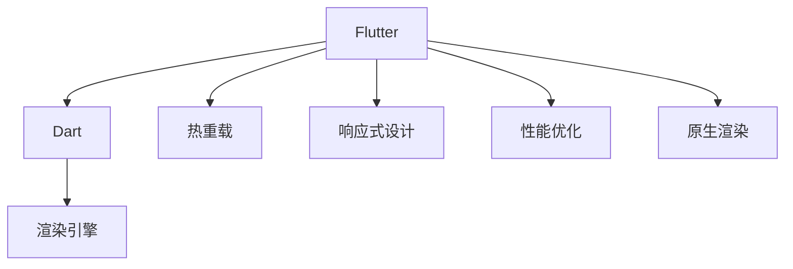

                 

# Flutter跨平台移动应用开发

> 关键词：Flutter, 移动应用, 跨平台, 前端开发, 用户界面(UI), 响应式设计, 热重载, 性能优化, 原生渲染

## 1. 背景介绍

### 1.1 问题由来
移动应用开发长期以来面临着跨平台和性能的挑战。传统的跨平台开发框架如React Native和Ionic，虽然极大地提升了开发效率，但由于其依赖于Web技术，仍无法完全满足高性能和原生体验的要求。iOS和Android之间天然存在差异，使用原生开发方式虽然可以获得最佳性能，但开发和维护成本极高，且代码复用率低。因此，如何在跨平台和原生性能之间取得平衡，成为开发者面临的难题。

Flutter的诞生，使得这一问题得到了有效解决。作为Google推出的移动开发框架，Flutter以 Dart 语言为核心，通过自有渲染引擎和丰富的UI组件库，实现了高效、统一的跨平台开发体验，大幅降低了原生开发的成本，同时确保了接近原生的性能表现。本文将全面系统地介绍Flutter框架，分析其工作原理和关键技术，探讨如何利用Flutter构建高质量的跨平台移动应用。

## 2. 核心概念与联系

### 2.1 核心概念概述

为更好地理解Flutter框架，本节将介绍几个密切相关的核心概念：

- **Flutter**：由Google开发的一款移动端跨平台开发框架，采用Dart语言，通过自定义渲染引擎实现高性能的UI渲染。

- **Dart**：一种由Google开发的面向对象的编程语言，语法简洁清晰，非常适合构建复杂的移动应用。

- **渲染引擎**：Flutter独有的渲染引擎，负责将UI组件转换成目标平台的原生绘制代码，实现跨平台的统一渲染。

- **热重载**：Flutter独有的特性，允许在不重新编译应用的情况下，实时查看和修改UI，极大提高了开发效率。

- **响应式设计**：Flutter通过Material和Cupertino设计语言，提供了一套响应式的UI组件库，支持自动化适应不同屏幕和设备。

- **性能优化**：Flutter采用了高效的渲染引擎和代码生成技术，实现了接近原生的性能表现。

- **原生渲染**：Flutter的渲染引擎能够将UI组件渲染成目标平台的原生代码，从而确保了原生级别的性能。

这些核心概念之间的逻辑关系可以通过以下Mermaid流程图来展示：



这个流程图展示Flutter的核心概念及其之间的关系：

1. Flutter通过Dart语言定义UI组件和逻辑。
2. 渲染引擎将Dart代码转换成目标平台的原生代码。
3. 热重载功能允许开发者实时修改UI，提升开发效率。
4. 响应式设计保证了UI组件对不同设备和屏幕的适应性。
5. 性能优化和原生渲染确保了接近原生的应用性能。

## 3. 核心算法原理 & 具体操作步骤

### 3.1 算法原理概述

Flutter框架的核心算法原理主要包括UI组件渲染和热重载技术。Flutter通过自有的渲染引擎，将UI组件转换成目标平台的原生代码，实现了跨平台的统一渲染。同时，Flutter的热重载技术允许开发者实时修改UI，极大提升了开发效率。

Flutter的渲染引擎通过“前置编译”和“组件树”的方式进行UI渲染：

1. **前置编译**：在应用启动前，Flutter将Dart代码编译成平台特定的代码，生成UI组件树。

2. **组件树**：Flutter使用组件树来组织和管理UI，每个组件都可以定义其布局、样式和交互逻辑。

3. **渲染引擎**：Flutter的渲染引擎负责将组件树转换成原生绘制代码，最终渲染到屏幕上。

Flutter的热重载技术则允许开发者在不重新编译应用的情况下，实时查看和修改UI。具体实现方式包括：

1. **热重载通道**：Flutter通过WebSocket与DevTools建立连接，实现热重载通道。

2. **组件更新**：开发者可以通过DevTools实时查看和修改UI，Flutter会自动重绘相应组件。

3. **异步更新**：Flutter采用异步更新机制，避免了对UI的阻塞操作，保持了应用的流畅性。

### 3.2 算法步骤详解

Flutter框架的具体实现步骤包括：

**Step 1: 搭建开发环境**
- 安装Flutter SDK和 Dart SDK。
- 配置IDE（如Android Studio、Xcode）并安装Flutter插件。

**Step 2: 创建项目和应用**
- 使用Flutter CLI创建新的Flutter项目。
- 编写Dart代码，定义UI组件和业务逻辑。

**Step 3: 编写UI组件**
- 使用Flutter提供的丰富组件库，创建UI界面。
- 利用布局、样式、动画等属性自定义组件。

**Step 4: 集成平台特定代码**
- 将平台特定的代码集成到Flutter项目中，如原生组件、插件等。

**Step 5: 构建和发布应用**
- 使用Flutter构建工具编译应用，生成目标平台的原生代码。
- 在App Store或Google Play发布应用。

**Step 6: 热重载和调试**
- 使用Flutter DevTools进行实时调试和热重载，快速迭代开发。

**Step 7: 性能优化**
- 使用Flutter提供的性能分析工具，查找和解决性能瓶颈。

### 3.3 算法优缺点

Flutter框架的主要优点包括：

1. **跨平台开发**：通过一套代码，可以在iOS和Android上快速构建应用，降低了开发成本。
2. **高性能渲染**：利用自有渲染引擎，实现接近原生的性能表现。
3. **热重载和调试**：实时查看和修改UI，极大地提升了开发效率。
4. **丰富的组件库**：提供了一套响应式的UI组件库，方便开发者构建复杂UI。
5. **可扩展性**：支持自定义渲染器和插件，方便开发者扩展和定制应用。

同时，Flutter框架也存在一些局限性：

1. **学习曲线**：相对于传统的iOS和Android开发，Flutter的学习曲线较陡峭，需要一定的Dart语言基础。
2. **框架复杂性**：Flutter的框架设计较为复杂，对于新手来说可能需要一段时间的适应。
3. **社区生态**：尽管Flutter社区较为活跃，但某些组件和插件可能存在依赖问题。
4. **第三方库支持**：相比于原生开发，Flutter对第三方库的支持有限，需要开发者自行适配。

尽管存在这些局限性，但Flutter框架以其高效、统一的开发体验和接近原生的性能表现，已经广泛应用于各种类型的移动应用开发。

### 3.4 算法应用领域

Flutter框架在以下领域得到了广泛应用：

1. **社交媒体**：如微博、微信等，通过Flutter可以快速开发和维护跨平台应用。
2. **电子商务**：如淘宝、京东等，利用Flutter构建高性能、一致性的购物体验。
3. **金融科技**：如支付宝、平安银行等，实现跨平台的应用和数据同步。
4. **教育应用**：如Coursera、Khan Academy等，提供高质量的在线教育体验。
5. **游戏开发**：如Supercell的Supercell Games等，利用Flutter开发高性能、跨平台的游戏。

随着Flutter框架的持续发展和完善，其应用领域将不断扩展，涵盖更多的垂直行业和场景。

## 4. 数学模型和公式 & 详细讲解 & 举例说明

### 4.1 数学模型构建

Flutter框架的数学模型主要涉及UI组件的渲染和热重载技术。以下将通过数学语言对这些技术进行更加严格的刻画。

假设开发者定义了一个UI组件 `MyWidget`，其布局为 `Center` 中心对齐，高度为 `100dp`，颜色为 `red`。Flutter渲染引擎将组件转换成目标平台的原生代码，具体步骤如下：

1. **布局计算**：将组件的布局信息转换成目标平台的原生布局信息。
   - 中心对齐 `Center`：将组件置于父容器的中心。
   - 高度 `100dp`：将组件高度转换为目标平台的像素值。
   - 颜色 `red`：将颜色信息转换成目标平台的原生颜色值。

2. **绘制渲染**：将布局信息渲染成原生绘制代码，实现UI组件的可视化。

### 4.2 公式推导过程

以下我们以中心对齐的UI组件为例，推导Flutter渲染引擎的布局计算公式。

设组件的高度为 $h$，宽度为 $w$，目标平台的原生像素单位为 $p$。中心对齐的布局计算公式为：

$$
x = \frac{p - w}{2}, \quad y = \frac{p - h}{2}
$$

其中 $x$ 和 $y$ 分别为组件在父容器中的水平和垂直坐标。

在绘制渲染阶段，Flutter将布局信息转换成目标平台的原生代码，例如在Android上，布局计算公式为：

$$
x = \frac{p - w}{2}, \quad y = \frac{p - h}{2}
$$

具体实现方式为：

- 将 $w$ 和 $h$ 转换为像素单位。
- 计算组件在父容器中的坐标。
- 将坐标信息转换成原生绘制代码。

### 4.3 案例分析与讲解

以一个简单的计数器应用为例，展示Flutter框架的实现过程。

**Step 1: 创建项目和应用**
使用Flutter CLI创建新的Flutter项目：

```
flutter create counter
```

**Step 2: 编写UI组件**
定义计数器UI组件，包括一个按钮和两个文本组件，展示计数器的当前值：

```dart
import 'package:flutter/material.dart';

class CounterWidget extends StatelessWidget {
  int _count = 0;

  @override
  Widget build(BuildContext context) {
    return Scaffold(
      appBar: AppBar(title: Text('Counter App')),
      body: Center(
        child: Column(
          children: [
            Text('Count: $_count'),
            ElevatedButton(
              onPressed: () {
                setState(() {
                  _count++;
                });
              },
              child: Text('Increment'),
            ),
          ],
        ),
      ),
    );
  }
}
```

**Step 3: 集成平台特定代码**
在Android和iOS平台实现原生计数器的功能，并将功能代码集成到Flutter项目中。

**Step 4: 构建和发布应用**
使用Flutter构建工具编译应用，生成目标平台的原生代码，并在App Store或Google Play发布应用。

**Step 5: 热重载和调试**
使用Flutter DevTools进行实时调试和热重载，快速迭代开发。

## 5. 项目实践：代码实例和详细解释说明

### 5.1 开发环境搭建

在进行Flutter开发前，我们需要准备好开发环境。以下是使用Android Studio进行Flutter开发的环境配置流程：

1. 安装Flutter SDK和 Dart SDK。
2. 在Android Studio中配置Flutter插件。

完成上述步骤后，即可在Android Studio中开始Flutter开发。

### 5.2 源代码详细实现

我们以一个简单的登录应用为例，展示Flutter框架的实现过程。

**Step 1: 创建项目和应用**
使用Flutter CLI创建新的Flutter项目：

```
flutter create login_app
```

**Step 2: 编写UI组件**
定义登录UI组件，包括用户名、密码输入框和登录按钮：

```dart
import 'package:flutter/material.dart';

class LoginWidget extends StatelessWidget {
  @override
  Widget build(BuildContext context) {
    return Scaffold(
      appBar: AppBar(title: Text('Login App')),
      body: Padding(
        padding: const EdgeInsets.all(16.0),
        child: Column(
          children: [
            TextField(
              decoration: InputDecoration(hintText: 'Username'),
              onChanged: (text) {
                setState(() {
                  _username = text;
                });
              },
            ),
            TextField(
              decoration: InputDecoration(hintText: 'Password'),
              onChanged: (text) {
                setState(() {
                  _password = text;
                });
              },
              obscureText: true,
            ),
            ElevatedButton(
              onPressed: () {
                setState(() {
                  _isLoggedin = true;
                });
              },
              child: Text('Login'),
            ),
          ],
        ),
      ),
    );
  }
}
```

**Step 3: 集成平台特定代码**
在Android和iOS平台实现原生登录功能，并将功能代码集成到Flutter项目中。

**Step 4: 构建和发布应用**
使用Flutter构建工具编译应用，生成目标平台的原生代码，并在App Store或Google Play发布应用。

**Step 5: 热重载和调试**
使用Flutter DevTools进行实时调试和热重载，快速迭代开发。

### 5.3 代码解读与分析

让我们再详细解读一下关键代码的实现细节：

**LoginWidget类**：
- 定义了登录UI组件，包括用户名、密码输入框和登录按钮。
- 通过Flutter提供的TextField和ElevatedButton组件，创建输入和按钮。
- 通过setState方法更新组件状态，实现UI的实时响应。

**热重载和调试**：
- 使用Flutter DevTools进行实时调试和热重载，可以快速查看和修改UI，提升开发效率。
- 开发者可以通过DevTools实时查看应用状态，并进行调试，帮助快速定位和修复问题。

**性能优化**：
- Flutter提供了性能分析工具，帮助开发者查找和解决性能瓶颈。
- 开发者可以使用Flutter的性能分析器，查看应用的热点代码和渲染问题，并进行优化。

## 6. 实际应用场景

### 6.1 社交媒体应用

Flutter框架在社交媒体应用的开发中表现出色。例如，Instagram和Snapchat等应用，通过Flutter可以快速开发和维护跨平台应用，同时保持一致的用户体验。

在技术实现上，Flutter通过丰富的UI组件库和布局工具，实现了复杂的应用界面。开发者可以利用Flutter的热重载功能，实时查看和修改UI，快速迭代开发。同时，Flutter的性能优化机制，保证了应用的流畅性和响应性。

### 6.2 电子商务应用

Flutter在电子商务应用的开发中同样表现出色。例如，Amazon和阿里巴巴等电商平台，利用Flutter构建高性能、一致性的购物体验。

在技术实现上，Flutter通过丰富的组件库和布局工具，实现了复杂的购物界面。开发者可以利用Flutter的热重载功能，实时查看和修改UI，快速迭代开发。同时，Flutter的性能优化机制，保证了应用的流畅性和响应性。

### 6.3 金融科技应用

Flutter在金融科技应用的开发中表现出色。例如，支付宝和PayPal等支付应用，利用Flutter实现跨平台的应用和数据同步。

在技术实现上，Flutter通过丰富的组件库和布局工具，实现了复杂的支付界面。开发者可以利用Flutter的热重载功能，实时查看和修改UI，快速迭代开发。同时，Flutter的性能优化机制，保证了应用的流畅性和响应性。

### 6.4 未来应用展望

随着Flutter框架的持续发展和完善，其应用领域将不断扩展，涵盖更多的垂直行业和场景。

在智慧医疗领域，Flutter框架可以用于开发医疗应用，实现远程诊断、健康管理等功能，帮助医生和患者更好地进行沟通。

在智能教育领域，Flutter框架可以用于开发在线教育应用，实现互动式教学、作业批改等功能，提升教育质量和效率。

在智慧城市治理中，Flutter框架可以用于开发城市管理应用，实现智慧交通、城市监测等功能，提高城市管理的自动化和智能化水平。

此外，在企业生产、社会治理、文娱传媒等众多领域，Flutter框架也将不断涌现，为各行各业带来新的技术进步和创新突破。

## 7. 工具和资源推荐

### 7.1 学习资源推荐

为了帮助开发者系统掌握Flutter框架的理论基础和实践技巧，这里推荐一些优质的学习资源：

1. Flutter官方文档：Flutter官方提供的详细文档，覆盖了Flutter框架的各个方面，是Flutter学习的必备资料。

2. Flutter中文网：中文版的Flutter官方文档，提供了丰富的实例和教程，帮助开发者快速上手。

3. Flutter Programming by Example：一本系统介绍Flutter开发技术的书籍，内容全面，适合初学者和进阶开发者阅读。

4. Flutter Together：一个Flutter社区，提供了大量的示例代码和文章，帮助开发者解决实际问题。

5. Flutter in Action：一本Flutter实战开发的书籍，提供了丰富的项目案例和实战经验，帮助开发者提升开发能力。

通过对这些资源的学习实践，相信你一定能够快速掌握Flutter框架，并用于解决实际的移动应用问题。

### 7.2 开发工具推荐

高效的开发离不开优秀的工具支持。以下是几款用于Flutter开发的工具：

1. Android Studio：Android官方提供的IDE，支持Flutter开发，提供了丰富的开发工具和插件。

2. Xcode：苹果官方提供的IDE，支持Flutter开发，提供了丰富的开发工具和插件。

3. Flutter CLI：Flutter官方提供的命令行工具，支持创建、构建和发布Flutter应用。

4. Flutter DevTools：Flutter官方提供的调试工具，支持热重载、性能分析等功能。

5. VSCode：微软提供的IDE，支持Flutter开发，提供了丰富的开发工具和插件。

合理利用这些工具，可以显著提升Flutter应用的开发效率，加快创新迭代的步伐。

### 7.3 相关论文推荐

Flutter框架的开发源于学界的持续研究。以下是几篇奠基性的相关论文，推荐阅读：

1. Flutter: Building Cross-Platform Applications with Performance and Speed: 介绍Flutter框架的实现原理和性能优化机制。

2. Stream-based Architecture: A Paradigm Shift in Mobile UI Development: 探讨Flutter框架的架构设计和组件生命周期管理。

3. Flutter in the Wild: A Field Study of Real-world Adoption: 研究Flutter框架在实际应用中的使用情况和效果。

4. Flutter: The First Ten Years: 回顾Flutter框架的发展历程和技术演进。

5. Cross-Platform Mobile App Development with Flutter: 全面介绍Flutter框架的开发技术和应用场景。

这些论文代表Flutter框架的发展脉络。通过学习这些前沿成果，可以帮助研究者把握Flutter框架的前进方向，激发更多的创新灵感。

## 8. 总结：未来发展趋势与挑战

### 8.1 研究成果总结

本文对Flutter框架进行了全面系统的介绍，包括Flutter的核心概念、工作原理和关键技术，探讨了如何利用Flutter构建高质量的跨平台移动应用。通过系统梳理，可以看到Flutter框架在跨平台开发、高性能渲染、热重载和调试等方面的独特优势，以及其在移动应用开发中的应用前景。

### 8.2 未来发展趋势

展望未来，Flutter框架的发展趋势包括：

1. **组件库和工具库的完善**：随着Flutter社区的不断发展，组件库和工具库将更加丰富和完善，支持更多复杂和定制化的应用开发。

2. **跨平台开发的普及**：Flutter框架的易用性和高效性将进一步推动跨平台开发的普及，降低原生开发成本，提升开发效率。

3. **性能优化和测试工具的改进**：Flutter框架将继续优化渲染引擎和代码生成技术，提升应用的性能表现。同时，提供更加全面的性能分析和测试工具，帮助开发者快速定位和解决性能问题。

4. **生态系统的扩展**：Flutter框架将进一步扩展其生态系统，支持更多平台和设备，提升应用的兼容性和用户体验。

5. **社区和协作的加强**：Flutter社区将加强协作和交流，提供更多资源和支持，帮助开发者提升开发能力。

### 8.3 面临的挑战

尽管Flutter框架已经取得了显著的进展，但在迈向更加智能化、普适化应用的过程中，仍面临以下挑战：

1. **学习曲线**：相比于传统的iOS和Android开发，Flutter的学习曲线较陡峭，需要一定的Dart语言基础。

2. **框架复杂性**：Flutter的框架设计较为复杂，对于新手来说可能需要一段时间的适应。

3. **社区生态**：尽管Flutter社区较为活跃，但某些组件和插件可能存在依赖问题。

4. **第三方库支持**：相比于原生开发，Flutter对第三方库的支持有限，需要开发者自行适配。

5. **热重载和调试**：尽管热重载和调试功能极大提升了开发效率，但在复杂应用中仍可能存在性能问题。

### 8.4 研究展望

面对Flutter框架所面临的挑战，未来的研究需要在以下几个方面寻求新的突破：

1. **简化学习曲线**：通过提供更易用的开发工具和教程，降低Flutter的学习门槛，吸引更多开发者加入。

2. **提升框架性能**：优化渲染引擎和代码生成技术，提升应用的性能表现，满足高性能、高流畅性的需求。

3. **扩展社区生态**：加强社区协作和交流，提供更多的资源和支持，帮助开发者解决实际问题。

4. **增强热重载和调试功能**：改进热重载和调试机制，提升复杂应用中的开发效率和稳定性。

5. **支持更多平台和设备**：扩展Flutter框架的生态系统，支持更多平台和设备，提升应用的兼容性和用户体验。

6. **开发更加灵活的UI组件**：提供更加灵活和定制化的UI组件库，满足更多复杂和特定场景的需求。

这些研究方向的探索，必将引领Flutter框架迈向更高的台阶，为构建高性能、一致性的跨平台移动应用提供更多可能性。

## 9. 附录：常见问题与解答

**Q1：Flutter框架和React Native相比有何优势？**

A: Flutter框架相对于React Native的优势在于其性能更高，开发体验更好。Flutter通过自有渲染引擎和丰富的UI组件库，实现了接近原生的性能表现。同时，Flutter的热重载功能极大提升了开发效率，开发者可以实时查看和修改UI，快速迭代开发。此外，Flutter的代码生成技术，减少了手动编写原生代码的繁琐工作，提高了开发效率。

**Q2：如何在Flutter中实现复杂的UI布局？**

A: Flutter提供了丰富的UI组件库和布局工具，可以实现复杂的UI布局。开发者可以通过布局管理器，如Column、Row、Stack等，实现灵活的UI布局。同时，Flutter还支持自定义渲染器和插件，方便开发者扩展和定制应用。

**Q3：Flutter框架的学习曲线较陡峭，如何克服这一问题？**

A: 可以通过以下方式克服Flutter框架的学习曲线：

1. 学习Dart语言：Dart语言是Flutter的核心编程语言，掌握Dart语言的语法和特性是学习Flutter的基础。

2. 参考官方文档：Flutter官方文档提供了详细的开发指南和示例代码，适合初学者和进阶开发者阅读。

3. 参加培训课程：参加Flutter官方或社区提供的培训课程，系统学习Flutter的开发技术和实战经验。

4. 加入社区交流：加入Flutter社区，与其他开发者交流和讨论，分享学习经验和开发技巧。

通过以上方法，可以有效降低Flutter框架的学习门槛，快速上手开发。

**Q4：如何提升Flutter应用的性能？**

A: 可以通过以下方式提升Flutter应用的性能：

1. 优化渲染引擎：利用Flutter的性能优化工具，查找和解决渲染引擎中的性能瓶颈。

2. 减少UI组件层级：简化UI组件结构，减少不必要的嵌套，提升应用的渲染效率。

3. 使用高效的布局管理器：利用Flutter提供的布局管理器，如ConstrainedBox、Positioned等，实现高效的UI布局。

4. 减少全局状态更新：尽量使用本地状态管理，减少全局状态更新，提升应用的性能表现。

5. 使用异步更新机制：利用Flutter提供的异步更新机制，避免阻塞UI操作，保持应用的流畅性。

通过以上方法，可以有效提升Flutter应用的性能，提升用户体验。

**Q5：如何利用Flutter框架开发原生应用？**

A: Flutter框架可以通过插件的方式集成原生代码，实现原生应用的开发。开发者可以利用Flutter的插件机制，编写原生插件，将原生代码集成到Flutter应用中。

Flutter原生插件可以分为两类：

1. 热重载插件：允许在热重载过程中加载和卸载插件，适用于动态加载原生功能。

2. 静态加载插件：在应用编译过程中加载插件，适用于静态加载原生功能。

开发者可以利用Flutter的插件机制，实现原生应用的开发，提升应用的性能和用户体验。

---

作者：禅与计算机程序设计艺术 / Zen and the Art of Computer Programming

