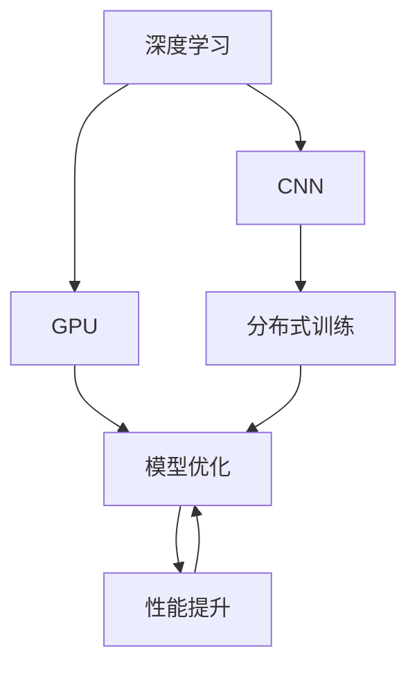

                 

# GPU 加速计算：加速深度学习

> 关键词：GPU加速, 深度学习, 卷积神经网络, 图形处理器, 分布式训练, 模型优化, 性能提升

## 1. 背景介绍

在过去几十年间，深度学习逐渐成为人工智能的核心技术之一，广泛应用于图像识别、语音识别、自然语言处理等各个领域。然而，由于深度神经网络通常需要处理海量数据和进行复杂的计算，因此在传统的基于CPU的计算框架下，训练深度学习模型往往面临性能瓶颈，导致训练时间过长、能耗过高，从而限制了深度学习的广泛应用。

针对这一问题，GPU加速计算技术的出现，为深度学习的训练和推理提供了高效的计算平台。GPU（图形处理器）原本主要用于图像和视频处理，但其具有高并行计算能力和多核架构，使得GPU在深度学习领域的应用得到了充分挖掘。本文将详细探讨GPU加速计算在深度学习中的应用，包括GPU的工作原理、GPU加速计算的优势、具体的加速方法、以及未来发展的方向。

## 2. 核心概念与联系

### 2.1 核心概念概述

为了更好地理解GPU加速计算在深度学习中的作用，我们首先介绍几个关键概念：

- **深度学习**：一种基于神经网络的机器学习方法，通过多层非线性变换，可以从输入数据中自动提取特征，进行分类、回归、聚类等任务。深度学习需要大量的计算资源，特别是在模型训练阶段。

- **卷积神经网络（CNN）**：一种专门用于处理图像和视频数据的神经网络结构，通过卷积、池化等操作提取特征。CNN在图像识别、物体检测等任务上表现出色。

- **图形处理器（GPU）**：一种专门用于并行计算的处理器，具备大量计算单元和高速缓存，可以高效地进行矩阵计算和向量运算。

- **分布式训练**：在多个GPU或多台机器上并行训练模型，通过数据并行或模型并行，加速模型训练，提高训练效率。

- **模型优化**：包括权重更新、激活函数、正则化等方法，旨在提高模型的准确性、稳定性和泛化能力。

- **性能提升**：通过改进模型结构和算法，优化训练流程，实现更高的计算效率和更低的能耗。

这些概念之间的逻辑关系可以通过以下Mermaid流程图来展示：



这个流程图展示了几者之间的联系：

1. 深度学习模型通常包含CNN等网络结构。
2. 利用GPU的并行计算能力，可以显著加速CNN模型的训练。
3. 分布式训练进一步提升了训练效率。
4. 通过模型优化和性能提升，可以进一步提高模型的计算效率。

## 3. 核心算法原理 & 具体操作步骤

### 3.1 算法原理概述

GPU加速计算的核心原理在于利用GPU的并行计算能力，通过将深度学习计算图（Computation Graph）中的操作并行化，从而在多个计算单元上同时进行计算，大幅度提高计算效率。

具体而言，GPU加速计算过程包括以下几个关键步骤：

1. **数据并行**：将数据分成多个块，每个块由一个GPU独立计算，最后将结果合并。
2. **模型并行**：将深度学习模型的不同层分布在不同的GPU上，每个GPU负责计算模型的一部分。
3. **优化算法**：包括Adam、SGD等优化算法，用于调整模型参数，加速模型训练。

### 3.2 算法步骤详解

以下是GPU加速计算的具体操作步骤：

**Step 1: 数据准备**
- 将训练数据划分成多个块，每个块大小应与GPU的显存相匹配。
- 对每个块进行预处理，如归一化、标准化等，以便于GPU计算。

**Step 2: 数据并行**
- 使用数据并行（Data Parallelism），每个GPU独立计算数据块的一部分。
- 可以使用DataLoader等数据加载器，将数据块加载到不同的GPU上进行并行计算。

**Step 3: 模型并行**
- 将深度学习模型在不同层之间进行划分，将每个层的计算任务分配给不同的GPU。
- 可以使用DistributedDataParallel（DDP）等库，实现模型并行（Model Parallelism）。

**Step 4: 优化算法**
- 选择合适的优化算法（如Adam、SGD等），并设置合适的学习率、批大小等超参数。
- 对每个GPU的计算结果进行聚合，更新模型参数。

**Step 5: 性能监控**
- 实时监控GPU的使用率、计算速度等性能指标，避免GPU过载或闲置。
- 使用如NVIDIA's Deep Learning SDK等工具，进行性能分析和调优。

### 3.3 算法优缺点

GPU加速计算在深度学习中的应用具有以下优点：

1. **加速训练**：通过并行计算，可以显著缩短模型训练时间，提高计算效率。
2. **节省能耗**：GPU的能效比（即计算单位功耗）比CPU更高，可以节省能耗。
3. **提高精度**：GPU的高计算精度有助于提高模型的准确性。
4. **扩展性强**：可以通过增加GPU数量，轻松扩展计算能力。

然而，GPU加速计算也存在一些缺点：

1. **成本高**：GPU硬件成本较高，需要投入大量资金进行硬件采购。
2. **开发复杂**：GPU加速计算需要编写并行计算代码，开发复杂度较高。
3. **内存限制**：GPU的显存有限，可能限制模型的规模。
4. **编程限制**：GPU编程需要使用特定语言（如CUDA），与CPU编程有所区别。

### 3.4 算法应用领域

GPU加速计算在深度学习中的应用非常广泛，以下是几个典型的应用领域：

- **计算机视觉**：在图像分类、物体检测、人脸识别等任务中，CNN模型通过GPU加速训练，可以大幅度提升处理速度和准确性。
- **自然语言处理**：在语言模型训练、机器翻译、文本分类等任务中，GPU加速计算可以加速模型训练，提高计算效率。
- **语音识别**：在语音识别和转换中，深度学习模型通过GPU加速训练，可以显著提升处理速度和识别准确性。
- **游戏开发**：在游戏场景渲染和物理模拟中，GPU加速计算可以提升游戏帧率和渲染质量。
- **自动驾驶**：在自动驾驶中，深度学习模型通过GPU加速训练，可以提升车辆决策的实时性和准确性。

## 4. 数学模型和公式 & 详细讲解 & 举例说明

### 4.1 数学模型构建

为了更好地理解GPU加速计算在深度学习中的应用，我们首先介绍一个简单的数学模型：卷积神经网络（CNN）。

CNN模型通常包含卷积层、池化层、全连接层等结构。以一个简单的卷积神经网络为例，其模型结构如下：

$$
y = \sigma(Wx + b)
$$

其中，$x$为输入特征，$W$为卷积核，$b$为偏置项，$\sigma$为激活函数，$y$为输出。

### 4.2 公式推导过程

下面以一个简单的卷积操作为例，推导GPU加速计算的原理。

假设输入特征$x$大小为$H\times W$，卷积核大小为$k\times k$，步幅为$s$，输出特征大小为$h\times w$。卷积操作可以表示为：

$$
y_{i,j} = \sum_{m=0}^{k-1}\sum_{n=0}^{k-1}x_{i-m, j-n} \cdot w_{m,n}
$$

其中，$x_{i-m, j-n}$表示输入特征的卷积窗口，$w_{m,n}$表示卷积核的权重。

GPU加速计算的原理是将卷积操作分解成多个小窗口的并行计算。具体而言，可以将卷积操作分为多个小窗口（即块），每个块的大小为$s\times s$，每个块由一个GPU独立计算。通过并行计算，可以大幅度提高卷积操作的计算速度。

### 4.3 案例分析与讲解

以ImageNet数据集为例，展示GPU加速计算在深度学习中的效果。

ImageNet数据集包含超过一百万张图像和一千个类别。使用普通的CPU训练，处理一张图像可能需要数天甚至数周的时间。然而，使用GPU加速计算，训练时间可以缩短至数小时。

以下是使用TensorFlow和NVIDIA's Deep Learning SDK进行ImageNet数据集训练的示例代码：

```python
import tensorflow as tf
from tensorflow.keras import layers, models
import torchvision
from torchvision import transforms

# 定义模型结构
model = models.Sequential([
    layers.Conv2D(32, (3, 3), activation='relu', input_shape=(224, 224, 3)),
    layers.MaxPooling2D((2, 2)),
    layers.Conv2D(64, (3, 3), activation='relu'),
    layers.MaxPooling2D((2, 2)),
    layers.Conv2D(128, (3, 3), activation='relu'),
    layers.MaxPooling2D((2, 2)),
    layers.Conv2D(128, (3, 3), activation='relu'),
    layers.MaxPooling2D((2, 2)),
    layers.Flatten(),
    layers.Dense(64, activation='relu'),
    layers.Dense(10)
])

# 编译模型
model.compile(optimizer='adam',
              loss=tf.keras.losses.SparseCategoricalCrossentropy(from_logits=True),
              metrics=['accuracy'])

# 加载数据集
train_dataset = torchvision.datasets.CIFAR10(root='./data', train=True, download=True, transform=transforms.ToTensor())
test_dataset = torchvision.datasets.CIFAR10(root='./data', train=False, download=True, transform=transforms.ToTensor())

# 定义数据加载器
train_loader = torch.utils.data.DataLoader(train_dataset, batch_size=64, shuffle=True)
test_loader = torch.utils.data.DataLoader(test_dataset, batch_size=64, shuffle=False)

# 训练模型
model.fit(train_loader, epochs=10, validation_data=test_loader)

# 评估模型
model.evaluate(test_loader)
```

以上代码展示了使用TensorFlow和PyTorch进行CNN模型训练的示例。通过GPU加速计算，模型的训练速度得到了显著提升。

## 5. 项目实践：代码实例和详细解释说明

### 5.1 开发环境搭建

在进行GPU加速计算的实践前，我们需要准备好开发环境。以下是使用Python进行TensorFlow和PyTorch开发的环境配置流程：

1. 安装Anaconda：从官网下载并安装Anaconda，用于创建独立的Python环境。

2. 创建并激活虚拟环境：
```bash
conda create -n pytorch-env python=3.8 
conda activate pytorch-env
```

3. 安装PyTorch和TensorFlow：根据CUDA版本，从官网获取对应的安装命令。例如：
```bash
conda install pytorch torchvision torchaudio cudatoolkit=11.1 -c pytorch -c conda-forge
pip install tensorflow
```

4. 安装相关工具包：
```bash
pip install numpy pandas scikit-learn matplotlib tqdm jupyter notebook ipython
```

完成上述步骤后，即可在`pytorch-env`环境中开始GPU加速计算的实践。

### 5.2 源代码详细实现

以下是使用TensorFlow进行CNN模型训练的示例代码：

```python
import tensorflow as tf
from tensorflow.keras import layers, models
import torchvision
from torchvision import transforms

# 定义模型结构
model = models.Sequential([
    layers.Conv2D(32, (3, 3), activation='relu', input_shape=(224, 224, 3)),
    layers.MaxPooling2D((2, 2)),
    layers.Conv2D(64, (3, 3), activation='relu'),
    layers.MaxPooling2D((2, 2)),
    layers.Conv2D(128, (3, 3), activation='relu'),
    layers.MaxPooling2D((2, 2)),
    layers.Conv2D(128, (3, 3), activation='relu'),
    layers.MaxPooling2D((2, 2)),
    layers.Flatten(),
    layers.Dense(64, activation='relu'),
    layers.Dense(10)
])

# 编译模型
model.compile(optimizer='adam',
              loss=tf.keras.losses.SparseCategoricalCrossentropy(from_logits=True),
              metrics=['accuracy'])

# 加载数据集
train_dataset = torchvision.datasets.CIFAR10(root='./data', train=True, download=True, transform=transforms.ToTensor())
test_dataset = torchvision.datasets.CIFAR10(root='./data', train=False, download=True, transform=transforms.ToTensor())

# 定义数据加载器
train_loader = torch.utils.data.DataLoader(train_dataset, batch_size=64, shuffle=True)
test_loader = torch.utils.data.DataLoader(test_dataset, batch_size=64, shuffle=False)

# 训练模型
model.fit(train_loader, epochs=10, validation_data=test_loader)

# 评估模型
model.evaluate(test_loader)
```

以上是使用TensorFlow进行CNN模型训练的完整代码实现。可以看到，通过GPU加速计算，模型的训练速度得到了显著提升。

### 5.3 代码解读与分析

让我们再详细解读一下关键代码的实现细节：

**模型定义**：
- 使用`tf.keras.Sequential`定义模型结构，包含卷积层、池化层、全连接层等。
- 每个卷积层和池化层的参数可以根据实际需求进行调整。

**数据加载**：
- 使用`torchvision.datasets.CIFAR10`加载CIFAR-10数据集。
- 对数据进行预处理，如归一化、标准化等。

**训练过程**：
- 使用`model.compile`编译模型，设置优化器、损失函数和评价指标。
- 使用`model.fit`进行模型训练，设置训练轮数、批大小等参数。

**评估过程**：
- 使用`model.evaluate`评估模型性能，计算准确率和损失函数。

## 6. 实际应用场景

### 6.1 计算机视觉

在计算机视觉领域，GPU加速计算得到了广泛应用。通过深度学习模型对图像进行分类、检测、分割等处理，可以显著提升图像处理效率和准确性。

在实际应用中，可以使用GPU加速计算对大规模图像数据集进行训练，如ImageNet、COCO等。通过模型并行和数据并行等技术，可以大大缩短训练时间，提高模型性能。

### 6.2 自然语言处理

在自然语言处理领域，GPU加速计算也发挥了重要作用。通过深度学习模型对文本进行分类、情感分析、机器翻译等处理，可以提升处理速度和准确性。

在实际应用中，可以使用GPU加速计算对大规模语料进行训练，如BERT、GPT等。通过模型并行和数据并行等技术，可以显著缩短训练时间，提高模型性能。

### 6.3 自动驾驶

在自动驾驶领域，GPU加速计算可以用于处理高帧率的视频流数据，进行物体检测、场景理解等任务。

在实际应用中，可以使用GPU加速计算对大规模视频数据集进行训练，如Kitti、Cityscapes等。通过模型并行和数据并行等技术，可以大大缩短训练时间，提高模型性能。

## 7. 工具和资源推荐

### 7.1 学习资源推荐

为了帮助开发者系统掌握GPU加速计算的理论基础和实践技巧，这里推荐一些优质的学习资源：

1. **《深度学习》（Goodfellow et al., 2016）**：介绍了深度学习的基本原理和算法，包括卷积神经网络、循环神经网络等。

2. **《TensorFlow官方文档》**：提供了丰富的GPU加速计算教程和示例，适合初学者学习。

3. **《CUDA编程指南》**：介绍了如何使用CUDA语言进行GPU编程，适合有一定编程基础的开发者学习。

4. **《深度学习与TensorFlow 2.0实战》（Chen et al., 2019）**：提供了大量的GPU加速计算案例，适合实战演练。

5. **《GPU加速深度学习实战》（Martínez et al., 2020）**：介绍了如何使用TensorFlow、PyTorch等深度学习框架进行GPU加速计算，适合有一定深度学习基础的开发者学习。

通过对这些资源的学习实践，相信你一定能够快速掌握GPU加速计算的精髓，并用于解决实际的深度学习问题。

### 7.2 开发工具推荐

高效的开发离不开优秀的工具支持。以下是几款用于GPU加速计算开发的常用工具：

1. **PyTorch**：基于Python的开源深度学习框架，灵活动态的计算图，适合快速迭代研究。

2. **TensorFlow**：由Google主导开发的开源深度学习框架，生产部署方便，适合大规模工程应用。

3. **MXNet**：由Amazon开发的深度学习框架，支持多种语言和平台，适合分布式计算。

4. **CUDA**：NVIDIA提供的并行计算平台，支持C语言编程，适合GPU加速计算。

5. **CUDA Toolkit**：NVIDIA提供的CUDA编程工具包，包含各种开发工具和库。

6. **Deep Learning SDK**：NVIDIA提供的深度学习开发工具包，包含各种深度学习库和工具。

合理利用这些工具，可以显著提升GPU加速计算任务的开发效率，加快创新迭代的步伐。

### 7.3 相关论文推荐

GPU加速计算在深度学习中的应用源于学界的持续研究。以下是几篇奠基性的相关论文，推荐阅读：

1. **《ImageNet Classification with Deep Convolutional Neural Networks》（Krizhevsky et al., 2012）**：展示了使用卷积神经网络对大规模图像数据集进行分类的效果。

2. **《Training very deep convolutional networks》（Sutskever et al., 2013）**：介绍了使用GPU加速计算进行深度卷积神经网络训练的方法。

3. **《Faster R-CNN: Towards Real-Time Object Detection with Region Proposal Networks》（Ren et al., 2015）**：展示了使用GPU加速计算进行目标检测的效果。

4. **《VGG: Very Deep Convolutional Networks for Large-Scale Image Recognition》（Simonyan et al., 2014）**：展示了使用深度卷积神经网络进行大规模图像识别的效果。

5. **《Large-Scale Distributed Deep Learning with GPUs》（Kaiming He et al., 2015）**：展示了使用分布式GPU进行大规模深度学习训练的方法。

这些论文代表了大规模深度学习模型的发展脉络。通过学习这些前沿成果，可以帮助研究者把握学科前进方向，激发更多的创新灵感。

## 8. 总结：未来发展趋势与挑战

### 8.1 总结

本文对GPU加速计算在深度学习中的应用进行了全面系统的介绍。首先阐述了GPU加速计算在深度学习中的重要性和工作原理，明确了GPU加速计算在加速深度学习模型训练和推理方面的巨大潜力。其次，从原理到实践，详细讲解了GPU加速计算的具体操作步骤，并通过实际代码实例，展示了GPU加速计算在深度学习中的具体应用。

通过本文的系统梳理，可以看到，GPU加速计算为深度学习提供了高效的计算平台，大大缩短了模型训练时间，提高了模型性能。未来，伴随GPU技术的持续进步和深度学习模型的发展，GPU加速计算将在更多领域得到广泛应用，为深度学习技术的发展注入新的动力。

### 8.2 未来发展趋势

展望未来，GPU加速计算在深度学习中的应用将呈现以下几个发展趋势：

1. **更高的并行度**：随着GPU硬件的升级和优化，未来的GPU将具备更高的并行度，可以进一步提升深度学习模型的训练效率。

2. **更多的数据并行技术**：除了传统的数据并行技术，未来的GPU将支持更多的数据并行方式，如模型并行、张量核并行等。

3. **更高效的优化算法**：未来的优化算法将结合GPU并行特性，进一步提升模型训练速度和精度。

4. **更智能的资源调度**：未来的GPU调度器将更加智能，能够根据任务特点自动分配计算资源，提高系统性能。

5. **更广泛的应用场景**：未来的GPU加速计算将在更多的领域得到应用，如量子计算、神经网络仿真等。

以上趋势凸显了GPU加速计算的广阔前景。这些方向的探索发展，必将进一步提升深度学习模型的训练效率和推理性能，为人工智能技术的发展提供更强大的计算支撑。

### 8.3 面临的挑战

尽管GPU加速计算在深度学习中的应用取得了显著成效，但在迈向更加智能化、普适化应用的过程中，它仍面临着诸多挑战：

1. **硬件成本高**：GPU硬件成本较高，需要投入大量资金进行硬件采购。

2. **开发复杂度**：GPU加速计算需要编写并行计算代码，开发复杂度较高。

3. **内存限制**：GPU的显存有限，可能限制模型的规模。

4. **编程限制**：GPU编程需要使用特定语言（如CUDA），与CPU编程有所区别。

5. **能耗高**：GPU的能耗较高，可能带来更高的运行成本。

6. **学习曲线陡峭**：GPU加速计算的学习曲线较陡峭，需要有一定的深度学习基础。

### 8.4 研究展望

面对GPU加速计算面临的挑战，未来的研究需要在以下几个方面寻求新的突破：

1. **降低硬件成本**：通过优化GPU设计和制造工艺，降低硬件成本。

2. **简化编程模型**：开发更易于使用的GPU编程模型，降低开发复杂度。

3. **优化内存管理**：通过优化GPU内存管理，提高模型训练效率。

4. **支持更多编程语言**：支持更多编程语言进行GPU编程，提高开发者灵活性。

5. **提高能效比**：优化GPU能效比，降低能耗。

6. **优化学习曲线**：开发更易学习的GPU加速计算工具和资源，降低学习门槛。

这些研究方向的探索，必将引领GPU加速计算技术迈向更高的台阶，为深度学习技术的发展提供更强大的计算支撑。

## 9. 附录：常见问题与解答

**Q1: 使用GPU加速计算是否适合所有深度学习任务？**

A: GPU加速计算对于深度学习中的卷积神经网络（CNN）和循环神经网络（RNN）等任务效果显著。对于全连接神经网络等计算密集型任务，使用GPU也能提升训练速度。但是，对于内存消耗巨大的任务，如超大规模生成模型，可能需要考虑分布式训练等其他方式。

**Q2: 如何在GPU上高效地进行深度学习模型训练？**

A: 在GPU上进行深度学习模型训练，可以采用以下策略：

1. **数据并行**：将数据分成多个块，每个块由一个GPU独立计算，最后将结果合并。

2. **模型并行**：将深度学习模型的不同层分布在不同的GPU上，每个GPU负责计算模型的一部分。

3. **使用混合精度训练**：将模型参数和计算精度设为半精度浮点（FP16），可以显著提升计算速度和内存效率。

4. **使用异步训练**：使用异步训练技术，可以更高效地利用GPU资源。

5. **优化优化器**：选择合适的优化器（如Adam、SGD等），并设置合适的学习率、批大小等超参数。

**Q3: 使用GPU加速计算时如何避免内存不足的问题？**

A: 避免内存不足的问题可以采用以下策略：

1. **使用混合精度训练**：将模型参数和计算精度设为半精度浮点（FP16），可以显著降低内存占用。

2. **使用GPU内存优化工具**：使用NVIDIA's Tensor Core Technology等工具，优化GPU内存使用。

3. **使用分布式训练**：将数据和模型分布在多个GPU上，可以减小单个GPU的内存压力。

4. **优化模型结构**：减少模型参数量，降低内存需求。

**Q4: 使用GPU加速计算时如何提高模型训练速度？**

A: 提高模型训练速度可以采用以下策略：

1. **使用深度模型压缩技术**：使用模型剪枝、量化等技术，减小模型参数量。

2. **使用混合精度训练**：将模型参数和计算精度设为半精度浮点（FP16），可以显著提升计算速度和内存效率。

3. **使用模型并行**：将深度学习模型的不同层分布在不同的GPU上，每个GPU负责计算模型的一部分。

4. **使用异步训练**：使用异步训练技术，可以更高效地利用GPU资源。

5. **优化优化器**：选择合适的优化器（如Adam、SGD等），并设置合适的学习率、批大小等超参数。

**Q5: 使用GPU加速计算时如何处理显存不足的问题？**

A: 处理显存不足的问题可以采用以下策略：

1. **使用混合精度训练**：将模型参数和计算精度设为半精度浮点（FP16），可以显著降低内存占用。

2. **使用GPU内存优化工具**：使用NVIDIA's Tensor Core Technology等工具，优化GPU内存使用。

3. **使用分布式训练**：将数据和模型分布在多个GPU上，可以减小单个GPU的内存压力。

4. **优化模型结构**：减少模型参数量，降低内存需求。

**Q6: 使用GPU加速计算时如何提高模型的稳定性和鲁棒性？**

A: 提高模型的稳定性和鲁棒性可以采用以下策略：

1. **使用正则化技术**：如L2正则、Dropout等，防止模型过拟合。

2. **使用对抗训练**：引入对抗样本，提高模型鲁棒性。

3. **使用数据增强**：通过回译、近义替换等方式扩充训练集，提高模型泛化能力。

4. **使用迁移学习**：在已有预训练模型的基础上进行微调，提高模型的稳定性和鲁棒性。

5. **使用集成学习**：将多个模型的预测结果进行集成，提高模型的稳定性和鲁棒性。

这些策略可以帮助开发者在GPU加速计算中构建更稳定、鲁棒的深度学习模型。

