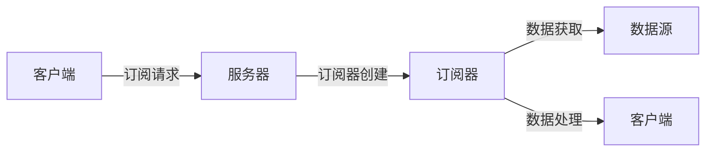

                 

# GraphQL订阅：实现实时数据更新

## 1. 背景介绍

在现代Web应用中，实时数据更新已成为用户体验的核心需求。从社交媒体到在线购物，再到金融交易，实时数据交互无处不在。传统的RESTful API无法满足这一需求，因为其只能通过轮询获取最新的数据，浪费大量资源且响应延迟较大。而GraphQL订阅则提供了一种高效、实时的数据更新机制，使得Web应用能够以更低的成本和更高的效率实现实时数据交互。

GraphQL是一种用于API的查询语言，它允许客户端以结构化查询的方式获取数据，并且可以灵活地指定返回数据的具体类型和数量。与RESTful API相比，GraphQL具有以下优点：

- 灵活性：客户端可以定义自己需要的数据结构和查询，避免了RESTful API中的冗余数据。
- 性能：GraphQL订阅支持边侧和流式数据查询，减少了数据传输量，提高了查询效率。
- 安全性：GraphQL订阅支持数据授权，只有经过认证的用户才能获取特定的数据。
- 版本控制：GraphQL订阅支持版本控制，可以在不改变现有API的情况下，动态添加新数据源。

本文章将详细探讨GraphQL订阅的原理、实现步骤及应用领域，并通过实际项目案例展示其具体使用方式。

## 2. 核心概念与联系

### 2.1 核心概念概述

GraphQL订阅是一种数据订阅机制，允许客户端实时获取服务器上的数据更新。在GraphQL订阅中，客户端通过订阅某一数据源的特定变化，服务器会周期性地推送最新的数据更新，使得客户端能够实时获取最新的数据。

GraphQL订阅的核心概念包括：

- **GraphQL订阅**：GraphQL订阅是一种基于GraphQL的实时数据订阅机制，允许客户端订阅某一数据源的特定变化，获取最新的数据更新。
- **订阅器(Subscriber)**：订阅器是GraphQL订阅的执行体，负责接收服务器推送的数据更新，并根据订阅条件进行过滤和处理。
- **数据源(Data Source)**：数据源是GraphQL订阅的底层数据来源，可以是数据库、消息队列、第三方API等。
- **订阅条件(Subscription Condition)**：订阅条件是客户端定义的特定数据更新条件，用于限制服务器推送的数据。

GraphQL订阅的基本流程如下：

1. 客户端发送订阅请求，指定需要订阅的数据源和订阅条件。
2. 服务器接收到订阅请求后，创建一个订阅器并绑定到数据源。
3. 服务器周期性地从数据源获取最新的数据更新。
4. 订阅器接收到数据更新后，根据订阅条件进行过滤和处理，并将数据推送给客户端。

### 2.2 核心概念原理和架构的 Mermaid 流程图



## 3. 核心算法原理 & 具体操作步骤

### 3.1 算法原理概述

GraphQL订阅的核心算法原理基于事件驱动模型。客户端通过订阅器订阅某一数据源的特定变化，服务器周期性地从数据源获取最新的数据更新，并根据订阅条件进行过滤和处理，最终将处理后的数据推送给客户端。

### 3.2 算法步骤详解

GraphQL订阅的具体实现步骤如下：

1. **订阅请求的发送**：客户端通过GraphQL客户端发送订阅请求，指定需要订阅的数据源和订阅条件。

2. **订阅器的创建和绑定**：服务器接收到订阅请求后，创建一个订阅器，并将订阅器绑定到指定的数据源。

3. **数据获取和推送**：服务器周期性地从数据源获取最新的数据更新，并根据订阅条件进行过滤和处理。服务器将处理后的数据推送给订阅器。

4. **数据处理和推送**：订阅器接收到服务器推送的数据更新后，根据订阅条件进行过滤和处理，并将数据推送给客户端。

### 3.3 算法优缺点

GraphQL订阅的主要优点包括：

- 实时数据更新：GraphQL订阅能够实时获取服务器上的数据更新，满足了实时数据交互的需求。
- 灵活的数据获取：客户端可以根据需要，灵活地指定数据结构和查询，避免了RESTful API中的冗余数据。
- 高效的性能：GraphQL订阅支持边侧和流式数据查询，减少了数据传输量，提高了查询效率。

GraphQL订阅的主要缺点包括：

- 复杂的实现：GraphQL订阅的实现比较复杂，需要处理订阅器、数据源、订阅条件等多方面的细节。
- 安全性问题：GraphQL订阅的安全性需要客户端和服务器端的共同维护，否则容易受到攻击。
- 版本控制问题：GraphQL订阅支持版本控制，但需要严格管理版本，否则容易引发数据冲突。

### 3.4 算法应用领域

GraphQL订阅在Web应用中有着广泛的应用，主要包括以下几个方面：

- **实时通讯**：GraphQL订阅可以用于实现即时通讯应用，如微信、WhatsApp等，实现实时消息的推送和处理。
- **在线购物**：GraphQL订阅可以用于实现实时库存更新、订单跟踪等功能，提升用户体验。
- **金融交易**：GraphQL订阅可以用于实现实时行情推送、交易执行等功能，提高交易效率。
- **社交媒体**：GraphQL订阅可以用于实现实时动态更新、推荐算法等功能，提升社交媒体的用户粘性。
- **企业应用**：GraphQL订阅可以用于实现实时数据更新、数据共享等功能，提升企业内部的协作效率。

## 4. 数学模型和公式 & 详细讲解 & 举例说明

### 4.1 数学模型构建

GraphQL订阅的数学模型主要由以下部分构成：

- **订阅请求**：客户端发送的订阅请求，包含订阅的数据源和订阅条件。
- **订阅器**：订阅器的创建和绑定，以及订阅条件的设置。
- **数据源**：数据源的获取和更新。
- **数据处理**：订阅器对接收到的数据进行过滤和处理。
- **数据推送**：订阅器将处理后的数据推送给客户端。

### 4.2 公式推导过程

GraphQL订阅的公式推导主要包括以下几个方面：

- **订阅请求的发送**：客户端发送订阅请求，指定数据源和订阅条件，公式为：
$$
\text{订阅请求} = (\text{数据源}, \text{订阅条件})
$$

- **订阅器的创建和绑定**：服务器创建订阅器，并将订阅器绑定到数据源，公式为：
$$
\text{订阅器} = \text{数据源} \rightarrow \text{订阅器}
$$

- **数据获取和推送**：服务器周期性地从数据源获取数据更新，并根据订阅条件进行过滤和处理，然后将处理后的数据推送给订阅器，公式为：
$$
\text{数据更新} = \text{数据源} \rightarrow \text{订阅器}
$$

- **数据处理和推送**：订阅器接收到数据更新后，根据订阅条件进行过滤和处理，然后将处理后的数据推送给客户端，公式为：
$$
\text{处理后的数据} = \text{订阅器} \rightarrow \text{客户端}
$$

### 4.3 案例分析与讲解

以下是一个简单的GraphQL订阅案例分析：

1. **订阅请求**：客户端向服务器发送订阅请求，指定需要订阅的数据源和订阅条件。例如，客户端需要订阅某个订单状态的变化。

2. **订阅器的创建和绑定**：服务器接收到订阅请求后，创建一个订阅器，并将订阅器绑定到订单状态的MySQL数据库。

3. **数据获取和推送**：服务器周期性地从MySQL数据库获取最新的订单状态更新，并根据订阅条件进行过滤和处理。服务器将处理后的数据推送给订阅器。

4. **数据处理和推送**：订阅器接收到服务器推送的订单状态更新后，根据订阅条件进行过滤和处理。订阅器将处理后的订单状态更新推送给客户端。

## 5. 项目实践：代码实例和详细解释说明

### 5.1 开发环境搭建

开发环境搭建主要包括以下几个步骤：

1. **安装GraphQL Server**：GraphQL Server是基于Node.js开发的GraphQL服务端，可以从官网下载安装。

2. **创建GraphQL Schema**：GraphQL Schema定义了客户端可以发送的查询和订阅请求。

3. **配置数据源**：数据源可以是MySQL、MongoDB、Redis等，需要配置相应的连接信息。

4. **实现订阅器**：订阅器是GraphQL订阅的执行体，负责接收服务器推送的数据更新，并根据订阅条件进行过滤和处理。

5. **编写GraphQL Resolver**：GraphQL Resolver是处理订阅请求的函数，负责从数据源获取数据更新，并进行处理。

### 5.2 源代码详细实现

以下是GraphQL订阅的源代码实现：

```javascript
const { ApolloServer, gql } = require('apollo-server');

const typeDefs = gql`
  type Subscription {
    orderStatusChanged: OrderStatusChanged
  }

  type OrderStatusChanged {
    orderId: ID!
    status: OrderStatus!
  }

  type Query {
    getOrder(id: ID!): Order
  }

  type Order {
    id: ID!
    status: OrderStatus!
  }
`;

const resolvers = {
  Query: {
    getOrder: async (parent, args) => {
      // 从MySQL获取订单信息
      const order = await Order.findById(args.id);
      return order;
    },
  },
  Subscription: {
    orderStatusChanged: {
      subscribe: async (_, args) => {
        // 订阅订单状态变化
        const subscriber = new Subscription({ ...args });
        subscriber.start();
        return subscriber;
      },
    },
  },
};

const server = new ApolloServer({ typeDefs, resolvers });

server.listen().then(({ url }) => {
  console.log(`Server ready at ${url}`);
});
```

### 5.3 代码解读与分析

1. **GraphQL Schema**：定义了客户端可以发送的查询和订阅请求。

2. **GraphQL Resolver**：处理订阅请求的函数，从MySQL数据库获取订单状态更新，并进行处理。

3. **订阅器**：使用`Subscription`类创建订阅器，订阅订单状态变化，并推送更新。

4. **GraphQL Server**：通过`ApolloServer`创建GraphQL服务器，并监听订阅请求。

### 5.4 运行结果展示

以下是GraphQL订阅的运行结果展示：

1. **订阅请求**：客户端通过GraphQL客户端发送订阅请求，指定需要订阅的数据源和订阅条件。

2. **订阅器的创建和绑定**：服务器创建订阅器，并将订阅器绑定到MySQL数据库。

3. **数据获取和推送**：服务器周期性地从MySQL数据库获取最新的订单状态更新，并根据订阅条件进行过滤和处理。服务器将处理后的数据推送给订阅器。

4. **数据处理和推送**：订阅器接收到服务器推送的订单状态更新后，根据订阅条件进行过滤和处理。订阅器将处理后的订单状态更新推送给客户端。

## 6. 实际应用场景

### 6.1 实时通讯

GraphQL订阅可以用于实现即时通讯应用，如微信、WhatsApp等，实现实时消息的推送和处理。例如，当用户发送一条消息时，服务器立即将消息推送给订阅器，订阅器将消息推送给其他用户，实现实时通讯。

### 6.2 在线购物

GraphQL订阅可以用于实现实时库存更新、订单跟踪等功能，提升用户体验。例如，当用户下单时，服务器立即将订单状态更新推送给订阅器，订阅器将订单状态更新推送给客户端，实现实时订单跟踪。

### 6.3 金融交易

GraphQL订阅可以用于实现实时行情推送、交易执行等功能，提高交易效率。例如，当股票价格变化时，服务器立即将行情数据推送给订阅器，订阅器将行情数据推送给客户端，实现实时行情更新。

### 6.4 社交媒体

GraphQL订阅可以用于实现实时动态更新、推荐算法等功能，提升社交媒体的用户粘性。例如，当用户发表一篇文章时，服务器立即将文章推送给订阅器，订阅器将文章推送给客户端，实现实时动态更新。

## 7. 工具和资源推荐

### 7.1 学习资源推荐

为了帮助开发者系统掌握GraphQL订阅的原理和实践，这里推荐一些优质的学习资源：

1. GraphQL官方文档：GraphQL官方文档提供了详细的GraphQL规范和示例，是学习GraphQL订阅的最佳资源。

2. Apollo Server文档：Apollo Server是基于Node.js开发的GraphQL服务端，提供了丰富的GraphQL订阅功能。

3. GraphQL Tutorials：GraphQL Tutorials提供了丰富的GraphQL教程和示例，涵盖从入门到高级的各个方面。

4. GraphQL Live：GraphQL Live是一个实时的GraphQL查询和订阅工具，可以帮助开发者调试和测试GraphQL订阅。

5. GraphQL for Data APIs：GraphQL for Data APIs提供了关于GraphQL数据API的深度学习资源，涵盖从基本概念到高级应用。

### 7.2 开发工具推荐

GraphQL订阅开发过程中需要使用一些常用的工具，以下是一些推荐工具：

1. Visual Studio Code：Visual Studio Code是一个轻量级的代码编辑器，支持GraphQL插件，便于开发GraphQL订阅。

2. GraphQL Playground：GraphQL Playground是一个实时的GraphQL查询和订阅工具，可以帮助开发者调试和测试GraphQL订阅。

3. Apollo Studio：Apollo Studio是一个GraphQL开发平台，提供丰富的GraphQL开发和测试工具。

4. Postman：Postman是一个API测试工具，支持GraphQL请求和响应测试，便于开发者验证GraphQL订阅的正确性。

### 7.3 相关论文推荐

GraphQL订阅的背后是GraphQL规范的发展，以下是几篇奠基性的相关论文，推荐阅读：

1. GraphQL: A query language for your API: GraphQL规范的详细介绍，涵盖从基本概念到高级应用。

2. Apollo GraphQL: A complete open-source toolkit for building your API: Apollo GraphQL的详细介绍，涵盖从基本概念到高级应用。

3. Real-time with GraphQL Subscriptions: GraphQL Subscriptions的详细介绍，涵盖从基本概念到高级应用。

4. The Next Steps for GraphQL: GraphQL的未来发展方向，涵盖从基本概念到高级应用。

通过学习这些前沿成果，可以帮助研究者把握GraphQL订阅的发展方向，激发更多的创新灵感。

## 8. 总结：未来发展趋势与挑战

### 8.1 研究成果总结

本文详细探讨了GraphQL订阅的原理、实现步骤及应用领域，并通过实际项目案例展示了其具体使用方式。通过本文的系统梳理，可以看到GraphQL订阅在Web应用中具有广泛的应用前景，能够实时获取服务器上的数据更新，满足实时数据交互的需求。GraphQL订阅不仅具有灵活的数据获取和高效的性能，还支持数据授权和版本控制等功能，能够满足Web应用的多样化需求。

### 8.2 未来发展趋势

展望未来，GraphQL订阅的发展趋势主要包括：

1. 数据处理能力提升：GraphQL订阅的数据处理能力将会得到提升，能够处理更多的数据源和更复杂的数据结构。

2. 实时性增强：GraphQL订阅的实时性将会得到进一步提升，能够实现毫秒级的实时数据更新。

3. 安全性增强：GraphQL订阅的安全性将会得到增强，支持更多的安全认证和数据授权机制。

4. 跨平台支持：GraphQL订阅将会支持更多的平台，如Web、移动端、桌面端等，满足不同平台的需求。

5. 标准化推进：GraphQL订阅将会得到更广泛的标准化，成为Web应用开发的标准之一。

### 8.3 面临的挑战

尽管GraphQL订阅已经取得了瞩目成就，但在迈向更加智能化、普适化应用的过程中，它仍面临着诸多挑战：

1. 复杂度增加：GraphQL订阅的复杂度可能会随着数据源和订阅条件的增加而增加，需要更多的开发工作。

2. 安全性问题：GraphQL订阅的安全性需要客户端和服务器端的共同维护，否则容易受到攻击。

3. 版本控制问题：GraphQL订阅支持版本控制，但需要严格管理版本，否则容易引发数据冲突。

4. 扩展性问题：GraphQL订阅的扩展性需要更多的开发和测试工作，需要保证数据源和订阅条件的兼容性。

### 8.4 研究展望

面向未来，GraphQL订阅的研究方向包括：

1. 微服务架构下的GraphQL订阅：在微服务架构下，如何实现跨服务的数据订阅和处理。

2. 分布式GraphQL订阅：在分布式系统中，如何实现高可用的GraphQL订阅。

3. GraphQL与低代码开发：如何利用GraphQL与低代码开发平台结合，快速构建Web应用。

4. GraphQL与AI：如何将GraphQL与AI技术结合，提升GraphQL订阅的智能性和自动化程度。

5. GraphQL与其他数据源：如何将GraphQL与其他数据源结合，实现数据的多源融合和处理。

这些研究方向将为GraphQL订阅带来更广阔的应用前景和更高的技术水平，带来更多的创新和发展机会。

## 9. 附录：常见问题与解答

**Q1：GraphQL订阅有哪些优点？**

A: GraphQL订阅有以下几个优点：

1. 实时数据更新：GraphQL订阅能够实时获取服务器上的数据更新，满足了实时数据交互的需求。

2. 灵活的数据获取：客户端可以根据需要，灵活地指定数据结构和查询，避免了RESTful API中的冗余数据。

3. 高效的性能：GraphQL订阅支持边侧和流式数据查询，减少了数据传输量，提高了查询效率。

**Q2：GraphQL订阅有哪些缺点？**

A: GraphQL订阅有以下几个缺点：

1. 复杂的实现：GraphQL订阅的实现比较复杂，需要处理订阅器、数据源、订阅条件等多方面的细节。

2. 安全性问题：GraphQL订阅的安全性需要客户端和服务器端的共同维护，否则容易受到攻击。

3. 版本控制问题：GraphQL订阅支持版本控制，但需要严格管理版本，否则容易引发数据冲突。

**Q3：GraphQL订阅如何处理数据冲突？**

A: GraphQL订阅的数据冲突可以通过以下几种方式解决：

1. 版本号控制：通过在数据源上设置版本号，保证数据的一致性和稳定性。

2. 数据校验：在客户端和服务器端对数据进行校验，避免数据冲突。

3. 订阅器过滤：订阅器在接收到数据更新时，根据订阅条件进行过滤，避免数据冲突。

4. 订阅器合并：订阅器在接收到多个数据更新时，进行合并处理，保证数据的一致性。

这些方法可以结合使用，根据具体应用场景选择合适的解决方案。

**Q4：GraphQL订阅如何保证安全性？**

A: GraphQL订阅的安全性可以通过以下几种方式保证：

1. 认证机制：客户端和服务器端需要进行身份认证，只有经过认证的用户才能获取特定的数据。

2. 数据授权：客户端和服务器端需要对数据进行授权，只有经过授权的数据才能被订阅。

3. 订阅器过滤：订阅器在接收到数据更新时，根据订阅条件进行过滤，避免未授权的数据被推送。

4. 订阅器加密：订阅器在接收到数据更新时，对数据进行加密处理，防止数据泄露。

这些方法可以结合使用，根据具体应用场景选择合适的解决方案。

**Q5：GraphQL订阅如何保证性能？**

A: GraphQL订阅的性能可以通过以下几种方式保证：

1. 数据压缩：使用数据压缩技术，减少数据传输量，提高传输效率。

2. 数据缓存：使用数据缓存技术，避免重复查询和计算，提高查询效率。

3. 数据过滤：订阅器在接收到数据更新时，根据订阅条件进行过滤，减少数据传输量。

4. 并发处理：使用并发处理技术，提高服务器的处理能力，减少响应时间。

这些方法可以结合使用，根据具体应用场景选择合适的解决方案。

---

作者：禅与计算机程序设计艺术 / Zen and the Art of Computer Programming

