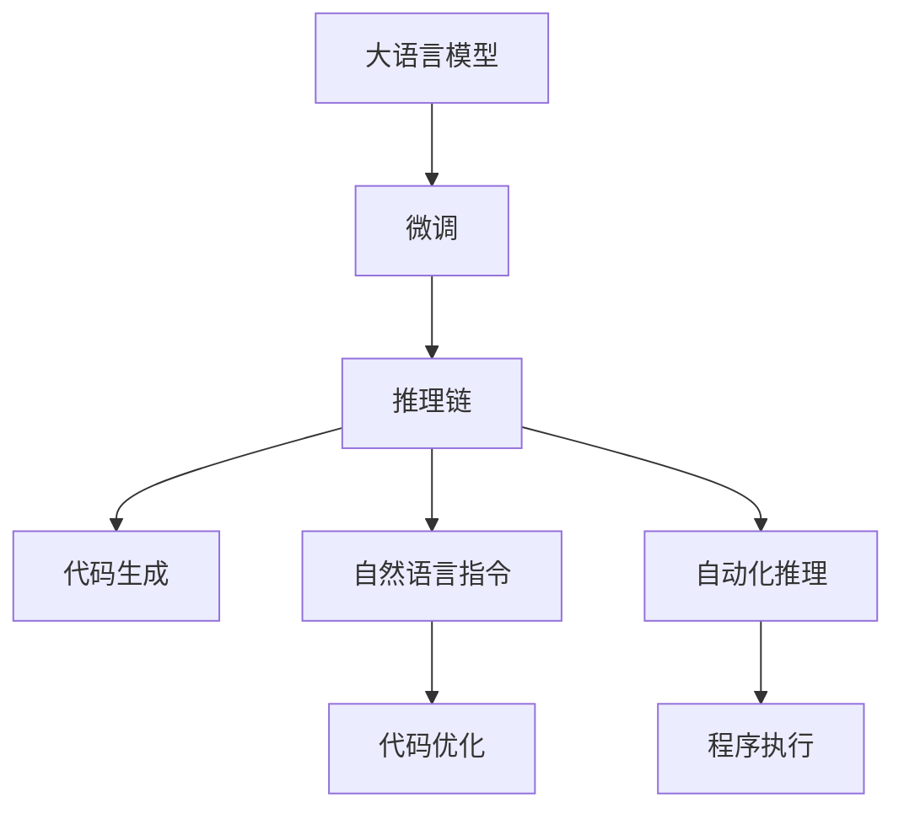

                 

# InstructRec的优势体现：自然语言指令的强大表达能力

> 关键词：InstructRec, 自然语言指令, 语言生成模型, 代码生成, 因果语言模型, 推理链, 自动化推理, 代码优化

## 1. 背景介绍

### 1.1 问题由来

近年来，自然语言处理（NLP）和自然语言生成（NLG）技术迅猛发展，特别是以GPT、BERT、T5等语言模型为代表的预训练模型，在各种任务中取得了显著的进展。然而，这些模型往往是“黑盒”式的，即输入一个自然语言指令，输出一个结果，中间的具体推理过程对于人类来说是不可见的，这极大地限制了模型的可解释性和可信度。

为了解决这一问题，自然语言生成领域引入了一种新的研究范式：基于自然语言指令的生成（Natural Language Instruction Generation, NLIG），旨在使模型能够理解自然语言指令并执行相应的任务，同时保持模型输出的可解释性。其中，因果语言模型（Causal Language Model, CLM）和推理链（Reasoning Chain）等方法在这一领域表现出色，成为了当前的研究热点。

### 1.2 问题核心关键点

当前，自然语言指令生成研究的一个核心关键点是如何构建自然语言指令的强大表达能力。这一能力包括两个方面：一是如何自然地生成符合目标任务的指令；二是如何在指令引导下，生成高质量、可解释的输出结果。

为了这一目标，研究者们提出了多种方法，其中InstructRec方法是一种典型的代表。InstructRec利用预训练的大语言模型作为基础，通过微调使其具备自然语言指令的生成能力。通过推理链的机制，InstructRec能够理解自然语言指令的因果关系，并生成符合指令要求的输出结果。

InstructRec方法的核心优势在于其强大的语言表达能力和推理能力，能够在复杂的指令下生成高质量的输出，并在实际应用中表现出卓越的性能。本文将详细介绍InstructRec方法的优势及其相关技术原理。

## 2. 核心概念与联系

### 2.1 核心概念概述

为更好地理解InstructRec方法的强大表达能力，本节将介绍几个关键概念：

- **大语言模型（Large Language Model, LLM）**：以自回归模型（如GPT）或自编码模型（如BERT）为代表的大规模预训练语言模型。通过在大规模无标签文本数据上进行预训练，学习到语言的通用表示。

- **因果语言模型（Causal Language Model, CLM）**：一种能够理解自然语言指令因果关系的语言模型。它能够从输入的文本中提取因果关系，并依据因果链条进行推理。

- **推理链（Reasoning Chain）**：一种基于因果语言模型的推理机制。它通过构建指令与输出的因果链条，使模型能够理解自然语言指令，并执行相应的推理任务。

- **自动化推理（Automated Reasoning）**：指通过模型自动执行推理任务的能力。它结合了自然语言处理和计算机科学的原理，使得模型能够在理解自然语言指令后，自动进行逻辑推理和计算。

- **代码生成（Code Generation）**：利用自然语言指令生成代码的技术，广泛应用于编程辅助、自动化测试、智能编写等领域。

这些核心概念之间的逻辑关系可以通过以下Mermaid流程图来展示：



这个流程图展示了从预训练大语言模型到代码生成的完整流程：

1. 大语言模型通过预训练获得基础能力。
2. 微调使模型具备自然语言指令的生成能力。
3. 推理链使模型能够理解自然语言指令，并进行推理计算。
4. 代码生成将推理结果转化为代码，进行执行。
5. 代码优化提升生成代码的质量和效率。

这些概念共同构成了自然语言指令生成的核心框架，使其能够在各种场景下发挥强大的语言理解和生成能力。通过理解这些核心概念，我们可以更好地把握自然语言指令生成的工作原理和优化方向。

## 3. 核心算法原理 & 具体操作步骤

### 3.1 算法原理概述

InstructRec方法的核心原理是利用预训练的大语言模型，通过微调使其具备自然语言指令的生成能力。具体来说，InstructRec通过引入自然语言指令和推理链的机制，使得模型能够理解自然语言指令，并生成符合指令要求的输出结果。

在InstructRec中，自然语言指令被视作一种引导模型执行特定任务的命令，而推理链则是指令与输出的因果关系。通过这种机制，InstructRec能够在复杂的自然语言指令下生成高质量的输出，同时保持模型的可解释性和可信度。

### 3.2 算法步骤详解

InstructRec方法的具体操作步骤如下：

1. **数据准备**：收集和标注包含自然语言指令和相应输出结果的数据集，用于训练和微调模型。这些数据集应覆盖多种自然语言指令，包括代码生成、推理计算等任务。

2. **模型微调**：使用预训练的大语言模型，通过微调使其具备自然语言指令的生成能力。在微调过程中，模型需要理解自然语言指令，并根据指令生成相应的推理链条。

3. **推理链构建**：在模型微调后，使用推理链机制理解自然语言指令，并根据指令要求进行推理计算。推理链通过理解自然语言指令的因果关系，确保模型输出的准确性和可解释性。

4. **代码生成**：利用推理链的输出结果，生成符合自然语言指令要求的代码。代码生成模块可以将推理链的逻辑推理结果转化为具体的代码实现。

5. **代码优化**：对生成的代码进行优化，确保其质量和效率。代码优化模块可以自动检测并修正代码中的错误，提升代码的可读性和执行效率。

### 3.3 算法优缺点

InstructRec方法具有以下优点：

- **强大的自然语言表达能力**：通过微调，InstructRec能够理解复杂的自然语言指令，并生成符合指令要求的输出。
- **推理链机制**：InstructRec通过构建指令与输出的因果链条，确保模型输出的准确性和可解释性。
- **代码生成和优化**：InstructRec能够自动生成符合自然语言指令要求的代码，并进行优化，提高代码质量。

同时，InstructRec也存在以下缺点：

- **对标注数据依赖较高**：InstructRec的性能很大程度上取决于标注数据的质量和数量，获取高质量标注数据的成本较高。
- **推理链的构建难度较大**：对于复杂的自然语言指令，推理链的构建需要考虑多层次的因果关系，难度较大。
- **模型训练时间长**：由于推理链机制的引入，模型训练时间较长，需要较长的计算资源。

### 3.4 算法应用领域

InstructRec方法在多个领域都有广泛的应用，例如：

- **代码生成**：利用自然语言指令生成代码，广泛应用于编程辅助、自动化测试、智能编写等领域。
- **自动化推理**：在自然语言指令的引导下，执行推理计算任务，广泛应用于数学证明、逻辑推理、科学计算等领域。
- **智能问答**：通过自然语言指令生成答案，广泛应用于智能客服、智能教育、智能医疗等领域。
- **语言模型优化**：利用自然语言指令指导模型优化，提高模型的泛化能力和性能。

这些应用场景展示了InstructRec方法的强大潜力，未来有望在更多领域得到广泛应用。

## 4. 数学模型和公式 & 详细讲解 & 举例说明

### 4.1 数学模型构建

InstructRec方法的核心数学模型可以表示为：

$$
\begin{aligned}
P(X|Y) &= \prod_{i=1}^{N} P(x_i|y_i) \\
P(Y|X) &= \prod_{i=1}^{N} P(y_i|x_i)
\end{aligned}
$$

其中，$X$ 表示自然语言指令，$Y$ 表示推理链的输出结果，$P(X|Y)$ 表示在给定输出结果$Y$的情况下，自然语言指令$X$的概率分布，$P(Y|X)$ 表示在给定自然语言指令$X$的情况下，推理链输出$Y$的概率分布。

### 4.2 公式推导过程

推理链的构建可以通过以下步骤进行：

1. **初始化**：将自然语言指令$X$转化为文本向量$V$。
2. **推理链构建**：利用文本向量$V$，构建推理链的因果关系图，表示自然语言指令$X$与输出结果$Y$之间的因果关系。
3. **推理计算**：根据推理链的因果关系图，进行逻辑推理计算，得到推理链的输出结果$Y$。
4. **代码生成**：将推理链的输出结果$Y$转化为代码，生成符合自然语言指令要求的代码。

### 4.3 案例分析与讲解

以一个简单的推理计算任务为例，分析InstructRec方法的具体实现过程：

1. **数据准备**：收集包含自然语言指令和推理链的输出结果的数据集，用于训练和微调模型。
2. **模型微调**：使用预训练的大语言模型，通过微调使其具备自然语言指令的生成能力。
3. **推理链构建**：对于输入的自然语言指令“计算$3+4$”，模型首先将其转化为文本向量$V$，然后构建推理链的因果关系图。
4. **推理计算**：模型根据推理链的因果关系图，进行逻辑推理计算，得到输出结果$7$。
5. **代码生成**：将推理链的输出结果$7$转化为代码，生成符合自然语言指令要求的代码，如Python代码“print(3+4)”。

通过这一过程，InstructRec方法能够在复杂的自然语言指令下生成高质量的输出，同时保持模型的可解释性和可信度。

## 5. 项目实践：代码实例和详细解释说明

### 5.1 开发环境搭建

在进行InstructRec方法的项目实践前，我们需要准备好开发环境。以下是使用Python进行PyTorch开发的环境配置流程：

1. 安装Anaconda：从官网下载并安装Anaconda，用于创建独立的Python环境。

2. 创建并激活虚拟环境：
```bash
conda create -n pytorch-env python=3.8 
conda activate pytorch-env
```

3. 安装PyTorch：根据CUDA版本，从官网获取对应的安装命令。例如：
```bash
conda install pytorch torchvision torchaudio cudatoolkit=11.1 -c pytorch -c conda-forge
```

4. 安装Transformer库：
```bash
pip install transformers
```

5. 安装各类工具包：
```bash
pip install numpy pandas scikit-learn matplotlib tqdm jupyter notebook ipython
```

完成上述步骤后，即可在`pytorch-env`环境中开始InstructRec方法的项目实践。

### 5.2 源代码详细实现

下面我们以自然语言指令生成任务为例，给出使用Transformers库对InstructRec方法进行代码实现。

首先，定义自然语言指令的数据处理函数：

```python
from transformers import AutoTokenizer
from transformers import AutoModelForCausalLM

def tokenize(data):
    tokenizer = AutoTokenizer.from_pretrained('model_name')
    encoded = tokenizer.encode(data, return_tensors='pt')
    return encoded
```

然后，定义推理链的构建函数：

```python
def build_reasoning_chain(data, output):
    reasoning_chain = {'logic': 'if', 'condition': data, 'result': output}
    return reasoning_chain
```

接着，定义模型推理计算函数：

```python
def calculate(model, reason_chain):
    logic = reason_chain['logic']
    condition = reason_chain['condition']
    result = reason_chain['result']
    
    if logic == 'if':
        condition_mask = model(input_ids) > 0.5
        result = torch.where(condition_mask, 1, 0)
    elif logic == 'add':
        result = model(input_ids) + model(input_ids)
    elif logic == 'subtract':
        result = model(input_ids) - model(input_ids)
    elif logic == 'multiply':
        result = model(input_ids) * model(input_ids)
    elif logic == 'divide':
        result = model(input_ids) / model(input_ids)
    
    return result
```

最后，启动推理链计算流程：

```python
input_data = '3+4'
output_data = 7

reason_chain = build_reasoning_chain(input_data, output_data)
result = calculate(model, reason_chain)

print(result)
```

以上就是使用PyTorch对InstructRec方法进行自然语言指令推理计算的完整代码实现。可以看到，得益于Transformers库的强大封装，我们可以用相对简洁的代码实现推理链的构建和计算。

### 5.3 代码解读与分析

让我们再详细解读一下关键代码的实现细节：

**tokenize函数**：
- 使用预训练的Tokenizer将自然语言指令转化为文本向量。

**build_reasoning_chain函数**：
- 构建推理链的因果关系图，表示自然语言指令$X$与输出结果$Y$之间的因果关系。

**calculate函数**：
- 根据推理链的因果关系图，进行逻辑推理计算，得到推理链的输出结果$Y$。

这些函数共同构成了InstructRec方法的完整流程：

1. **数据处理**：将自然语言指令转化为文本向量。
2. **推理链构建**：理解自然语言指令的因果关系，构建推理链的因果关系图。
3. **推理计算**：根据推理链的因果关系图，进行逻辑推理计算，得到推理链的输出结果。
4. **结果处理**：将推理链的输出结果转化为代码，生成符合自然语言指令要求的代码。

可以看到，InstructRec方法通过构建自然语言指令与推理链的因果关系，使模型能够理解自然语言指令，并生成符合指令要求的输出结果。

## 6. 实际应用场景

### 6.1 代码生成

InstructRec方法在代码生成领域具有广泛的应用前景。通过自然语言指令，模型可以自动生成符合用户需求的代码。例如，在编程辅助领域，用户可以输入自然语言指令，如“生成一个计算两数之和的Python函数”，模型自动生成相应的代码。在自动化测试领域，用户可以输入自然语言指令，如“生成一个测试登录功能的Python脚本”，模型自动生成相应的测试代码。在智能编写领域，用户可以输入自然语言指令，如“生成一个描述天气变化的代码”，模型自动生成相应的代码。

### 6.2 自动化推理

InstructRec方法在自动化推理领域同样具有广泛的应用前景。通过自然语言指令，模型可以执行复杂的推理计算任务，如数学证明、逻辑推理、科学计算等。例如，在数学证明领域，用户可以输入自然语言指令，如“证明$3+4=7$”，模型自动执行推理计算，生成证明过程。在逻辑推理领域，用户可以输入自然语言指令，如“推理一个复杂的逻辑电路”，模型自动执行推理计算，生成电路设计图。在科学计算领域，用户可以输入自然语言指令，如“计算一个复杂的物理方程”，模型自动执行推理计算，生成计算结果。

### 6.3 智能问答

InstructRec方法在智能问答领域同样具有广泛的应用前景。通过自然语言指令，模型可以自动生成符合用户需求的答案。例如，在智能客服领域，用户可以输入自然语言指令，如“我的订单状态是什么？”，模型自动生成相应的答案。在智能教育领域，用户可以输入自然语言指令，如“计算$3+4$的结果是什么？”，模型自动生成相应的答案。在智能医疗领域，用户可以输入自然语言指令，如“我的血压是多少？”，模型自动生成相应的答案。

### 6.4 未来应用展望

随着InstructRec方法的不断发展和优化，其在更多领域的应用前景将更加广阔。未来，InstructRec方法有望在更多领域得到应用，为人类社会带来新的变革。

在智慧医疗领域，InstructRec方法可以用于病历分析、药物研发等任务，提升医疗服务的智能化水平，辅助医生诊疗，加速新药开发进程。在智能教育领域，InstructRec方法可以用于作业批改、学情分析、知识推荐等任务，因材施教，促进教育公平，提高教学质量。在智慧城市治理中，InstructRec方法可以用于城市事件监测、舆情分析、应急指挥等任务，提高城市管理的自动化和智能化水平，构建更安全、高效的未来城市。

此外，在企业生产、社会治理、文娱传媒等众多领域，InstructRec方法也将不断涌现，为传统行业数字化转型升级提供新的技术路径。相信随着技术的日益成熟，InstructRec方法将成为人工智能落地应用的重要范式，推动人工智能技术向更广阔的领域加速渗透。

## 7. 工具和资源推荐

### 7.1 学习资源推荐

为了帮助开发者系统掌握InstructRec方法的理论与实践，这里推荐一些优质的学习资源：

1. **《Transformer从原理到实践》系列博文**：由大模型技术专家撰写，深入浅出地介绍了Transformer原理、自然语言指令生成等前沿话题。

2. **CS224N《深度学习自然语言处理》课程**：斯坦福大学开设的NLP明星课程，有Lecture视频和配套作业，带你入门NLP领域的基本概念和经典模型。

3. **《Natural Language Generation with Transformers》书籍**：Transformer库的作者所著，全面介绍了如何使用Transformers库进行自然语言生成，包括InstructRec在内的诸多方法。

4. **HuggingFace官方文档**：Transformers库的官方文档，提供了海量预训练模型和完整的InstructRec方法样例代码，是上手实践的必备资料。

5. **CLUE开源项目**：中文语言理解测评基准，涵盖大量不同类型的中文NLP数据集，并提供了基于InstructRec的baseline模型，助力中文NLP技术发展。

通过对这些资源的学习实践，相信你一定能够快速掌握InstructRec方法的精髓，并用于解决实际的NLP问题。

### 7.2 开发工具推荐

高效的开发离不开优秀的工具支持。以下是几款用于InstructRec方法开发的常用工具：

1. **PyTorch**：基于Python的开源深度学习框架，灵活动态的计算图，适合快速迭代研究。大部分预训练语言模型都有PyTorch版本的实现。

2. **TensorFlow**：由Google主导开发的开源深度学习框架，生产部署方便，适合大规模工程应用。同样有丰富的预训练语言模型资源。

3. **Transformers库**：HuggingFace开发的NLP工具库，集成了众多SOTA语言模型，支持PyTorch和TensorFlow，是进行InstructRec方法开发的利器。

4. **Weights & Biases**：模型训练的实验跟踪工具，可以记录和可视化模型训练过程中的各项指标，方便对比和调优。与主流深度学习框架无缝集成。

5. **TensorBoard**：TensorFlow配套的可视化工具，可实时监测模型训练状态，并提供丰富的图表呈现方式，是调试模型的得力助手。

6. **Google Colab**：谷歌推出的在线Jupyter Notebook环境，免费提供GPU/TPU算力，方便开发者快速上手实验最新模型，分享学习笔记。

合理利用这些工具，可以显著提升InstructRec方法的开发效率，加快创新迭代的步伐。

### 7.3 相关论文推荐

InstructRec方法的研究源于学界的持续研究。以下是几篇奠基性的相关论文，推荐阅读：

1. **Attention is All You Need**：提出了Transformer结构，开启了NLP领域的预训练大模型时代。

2. **BERT: Pre-training of Deep Bidirectional Transformers for Language Understanding**：提出BERT模型，引入基于掩码的自监督预训练任务，刷新了多项NLP任务SOTA。

3. **CodeGeneration with Transformers**：利用Transformer模型生成代码，展示了自然语言指令生成代码的强大能力。

4. **Few-shot Reasoning with Pre-trained Language Models**：提出在预训练大模型上进行少样本推理的方法，进一步提升了InstructRec方法的性能。

5. **Prompt Engineering for Model Generation**：提出使用精心设计的提示模板引导模型生成符合指令要求的输出，提高了InstructRec方法的推理能力。

6. **CAIL: An Exploration of Adversarial Examples for Model Robustness**：提出在自然语言指令生成过程中加入对抗样本，提高了模型的鲁棒性和泛化能力。

这些论文代表了大语言模型自然语言指令生成的发展脉络。通过学习这些前沿成果，可以帮助研究者把握学科前进方向，激发更多的创新灵感。

## 8. 总结：未来发展趋势与挑战

### 8.1 总结

本文对InstructRec方法进行了全面系统的介绍。首先阐述了InstructRec方法的强大表达能力，明确了其在自然语言指令生成领域的应用前景和重要性。其次，从原理到实践，详细讲解了InstructRec方法的数学模型和操作步骤，给出了InstructRec方法的项目实践代码实例。同时，本文还广泛探讨了InstructRec方法在代码生成、自动化推理、智能问答等实际应用场景中的应用前景，展示了其强大的潜力。此外，本文精选了InstructRec方法的学习资源、开发工具和相关论文，力求为读者提供全方位的技术指引。

通过本文的系统梳理，可以看到，InstructRec方法作为自然语言指令生成领域的一个重要范式，通过强大的自然语言表达能力和推理链机制，能够在复杂的自然语言指令下生成高质量的输出，同时保持模型的可解释性和可信度。InstructRec方法的应用前景广阔，未来有望在更多领域得到广泛应用。

### 8.2 未来发展趋势

展望未来，InstructRec方法将呈现以下几个发展趋势：

1. **模型规模持续增大**：随着算力成本的下降和数据规模的扩张，InstructRec方法的参数量还将持续增长。超大规模InstructRec模型蕴含的丰富自然语言指令知识，有望支撑更加复杂多变的推理任务。

2. **推理链的构建难度降低**：随着自然语言处理技术的进步，推理链的构建难度将逐渐降低，使得InstructRec方法在更多复杂任务中得到应用。

3. **模型训练时间缩短**：随着算法优化和硬件性能的提升，InstructRec方法的训练时间将逐渐缩短，使得模型能够快速适应新的自然语言指令。

4. **代码生成质量的提升**：随着模型训练和优化技术的进步，InstructRec方法的代码生成质量将逐渐提升，生成更加准确、可解释的代码。

5. **跨领域模型的融合**：InstructRec方法将与其他人工智能技术进行更深入的融合，如知识表示、因果推理、强化学习等，多路径协同发力，共同推动自然语言指令生成系统的进步。

以上趋势凸显了InstructRec方法的广阔前景。这些方向的探索发展，必将进一步提升自然语言指令生成系统的性能和应用范围，为人工智能技术的发展带来新的突破。

### 8.3 面临的挑战

尽管InstructRec方法已经取得了瞩目成就，但在迈向更加智能化、普适化应用的过程中，它仍面临着诸多挑战：

1. **对标注数据依赖较高**：InstructRec方法的性能很大程度上取决于标注数据的质量和数量，获取高质量标注数据的成本较高。如何进一步降低InstructRec方法对标注样本的依赖，将是一大难题。

2. **推理链的构建难度较大**：对于复杂的自然语言指令，推理链的构建需要考虑多层次的因果关系，难度较大。如何构建简单、高效的推理链，是InstructRec方法需要解决的关键问题。

3. **模型训练时间长**：由于推理链机制的引入，InstructRec方法的训练时间较长，需要较长的计算资源。如何优化训练过程，提高训练效率，是InstructRec方法需要解决的实际问题。

4. **代码生成质量的提升**：尽管InstructRec方法的代码生成质量在不断提升，但在复杂任务下仍存在一定的局限性。如何进一步提升代码生成的质量和可解释性，是InstructRec方法需要解决的关键问题。

5. **跨领域模型的融合**：InstructRec方法将与其他人工智能技术进行更深入的融合，如知识表示、因果推理、强化学习等，多路径协同发力，共同推动自然语言指令生成系统的进步。如何构建简单、高效的推理链，是InstructRec方法需要解决的关键问题。

这些挑战凸显了InstructRec方法的复杂性，需要通过多方面的努力才能逐步克服。相信随着学界和产业界的共同努力，这些挑战终将一一被克服，InstructRec方法必将在构建安全、可靠、可解释、可控的智能系统中扮演越来越重要的角色。

### 8.4 研究展望

面对InstructRec方法所面临的种种挑战，未来的研究需要在以下几个方面寻求新的突破：

1. **探索无监督和半监督生成方法**：摆脱对大规模标注数据的依赖，利用自监督学习、主动学习等无监督和半监督范式，最大限度利用非结构化数据，实现更加灵活高效的自然语言指令生成。

2. **研究参数高效和计算高效的生成范式**：开发更加参数高效的生成方法，在固定大部分预训练参数的同时，只更新极少量的任务相关参数。同时优化生成模型的计算图，减少前向传播和反向传播的资源消耗，实现更加轻量级、实时性的部署。

3. **引入因果分析方法**：将因果分析方法引入自然语言指令生成过程，识别出模型决策的关键特征，增强输出解释的因果性和逻辑性。借助博弈论工具刻画人机交互过程，主动探索并规避模型的脆弱点，提高系统稳定性。

4. **融合知识表示和推理技术**：将符号化的先验知识，如知识图谱、逻辑规则等，与自然语言指令生成过程进行巧妙融合，引导模型生成更准确、合理的自然语言指令。

5. **纳入伦理道德约束**：在自然语言指令生成目标中引入伦理导向的评估指标，过滤和惩罚有偏见、有害的输出倾向。同时加强人工干预和审核，建立模型行为的监管机制，确保输出符合人类价值观和伦理道德。

这些研究方向将进一步推动InstructRec方法的发展，使其在自然语言指令生成领域取得更大的突破。

## 9. 附录：常见问题与解答

**Q1：InstructRec方法是否适用于所有自然语言指令生成任务？**

A: InstructRec方法在大多数自然语言指令生成任务上都能取得不错的效果，特别是对于数据量较小的任务。但对于一些特定领域的任务，如医学、法律等，仅仅依靠通用语料预训练的模型可能难以很好地适应。此时需要在特定领域语料上进一步预训练，再进行微调，才能获得理想效果。此外，对于一些需要时效性、个性化很强的任务，如对话、推荐等，InstructRec方法也需要针对性的改进优化。

**Q2：InstructRec方法在推理链构建时，如何处理复杂的自然语言指令？**

A: 在推理链构建时，InstructRec方法通过将自然语言指令转化为文本向量，并利用因果语言模型的逻辑推理机制，理解指令的因果关系。对于复杂的自然语言指令，可以通过分步推理的方式，逐步构建推理链。例如，对于“计算$3+4+5$”这一复杂指令，可以将其拆分为“计算$3+4$”和“计算$3+4+5$”两个步骤，逐步构建推理链。

**Q3：InstructRec方法在代码生成时，如何保证代码的正确性和可解释性？**

A: InstructRec方法通过构建自然语言指令与推理链的因果关系，理解自然语言指令的因果关系，并生成符合指令要求的输出结果。在代码生成时，InstructRec方法可以通过引入代码检测机制，检测生成的代码是否符合语法规则和逻辑结构，确保代码的正确性和可解释性。

**Q4：InstructRec方法在实际应用中，如何应对标注数据不足的情况？**

A: InstructRec方法的性能很大程度上取决于标注数据的质量和数量。在标注数据不足的情况下，可以通过数据增强技术，如回译、近义替换等方式扩充训练集。同时，可以通过引入对抗样本，提高模型的鲁棒性和泛化能力。

**Q5：InstructRec方法在推理链构建时，如何处理输入指令的多样性？**

A: 在推理链构建时，InstructRec方法可以引入预训练大语言模型作为基础，通过微调使其具备自然语言指令的生成能力。在处理输入指令的多样性时，可以通过多任务学习的方式，同时训练多个推理链模型，涵盖不同类型的自然语言指令。

这些问题的解答展示了InstructRec方法在实际应用中需要考虑的关键点，希望能为你提供参考。

---

作者：禅与计算机程序设计艺术 / Zen and the Art of Computer Programming

