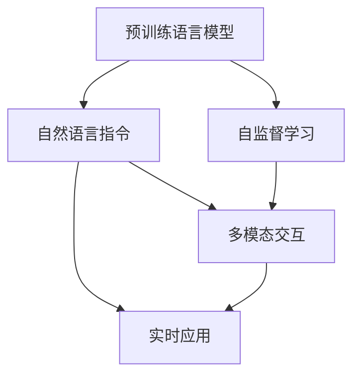

                 

# InstructRec：自然语言指令的优势

> 关键词：InstructRec,自然语言指令,预训练语言模型,自监督学习,多模态交互,实时应用,快速迭代

## 1. 背景介绍

### 1.1 问题由来
随着人工智能(AI)技术的飞速发展，自然语言处理(NLP)领域也迎来了前所未有的机遇。其中，预训练语言模型（Pretrained Language Models, PLMs），如GPT-3、BERT等，凭借其强大的泛化能力和广泛的语言知识，已经成为NLP任务中的明星模型。然而，这些模型虽然表现卓越，但在面对实际应用时，往往需要大量的标注数据和复杂的微调过程，这极大地限制了其在各个领域的推广和应用。

为了解决这一问题，研究者们提出了基于自然语言指令的模型训练方法。这种方法通过利用自然语言指令（Natural Language Instructions, NLIs），使模型能够无需标注数据，仅通过文本形式指导模型进行任务训练和推理，从而大幅降低模型应用的门槛。本文旨在探讨基于自然语言指令的InstructRec模型，并深入分析其优势及潜在应用。

### 1.2 问题核心关键点
InstructRec模型作为预训练语言模型的一种新范式，其核心思想在于将模型训练从监督学习范式转换为指令驱动的自我引导学习范式。通过自然语言指令，模型能够在无需标注数据的情况下，进行任务相关的参数更新，实现模型的快速迭代和任务适配。

具体来说，InstructRec模型在预训练阶段，通过自监督学习任务（如语言模型预测、掩码语言模型等）获取语言知识。在微调阶段，通过自然语言指令引导模型进行任务相关的参数更新，从而适应特定任务的需求。该模型具备以下主要优势：

1. 无需标注数据：通过自然语言指令，模型可以在无标注样本的情况下进行微调，大大降低了数据标注的成本。
2. 快速迭代：利用自然语言指令进行模型微调，可以实时响应任务需求，实现快速迭代和更新。
3. 多模态交互：InstructRec模型支持多模态输入输出，能够与文本、图像、语音等多模态数据进行交互。
4. 通用性强：InstructRec模型可以在各种NLP任务中实现泛化，无需为特定任务进行额外的微调。
5. 实时应用：通过自然语言指令进行任务适配，可以实时部署到各种应用场景中。

InstructRec模型为NLP任务提供了更加灵活、高效、通用、安全的解决方案，具备广阔的应用前景。

### 1.3 问题研究意义
研究InstructRec模型，对于拓展预训练语言模型在各个领域的应用，降低模型应用成本，提升模型实时响应能力，具有重要意义：

1. 降低应用开发成本。基于InstructRec模型，可以快速实现各种NLP任务，减少从头开发所需的数据、计算和人力等成本投入。
2. 提升模型效果。通过自然语言指令进行模型微调，可以使得通用预训练模型更好地适应特定任务，在应用场景中取得更优表现。
3. 加速开发进度。InstructRec模型能够实时响应任务需求，快速迭代和更新，缩短开发周期。
4. 带来技术创新。InstructRec模型的出现，促进了对预训练-指令引导学习的深入研究，催生了新的研究方向和应用场景。
5. 赋能产业升级。通过InstructRec模型，NLP技术更容易被各行各业所采用，为传统行业数字化转型升级提供新的技术路径。

## 2. 核心概念与联系

### 2.1 核心概念概述

为更好地理解InstructRec模型的工作原理和优势，本节将介绍几个密切相关的核心概念：

- 预训练语言模型(Pretrained Language Models, PLMs)：以自回归(如GPT)或自编码(如BERT)模型为代表的大规模预训练语言模型。通过在大规模无标签文本语料上进行预训练，学习通用的语言表示，具备强大的语言理解和生成能力。

- 自监督学习(Self-Supervised Learning)：利用文本数据的自然属性进行无监督学习，如掩码语言模型、语言模型预测等，从而获取语言知识。

- 自然语言指令(Natural Language Instructions, NLIs)：通过自然语言描述，指导模型执行特定任务，使得模型能够在无需标注数据的情况下进行微调。

- 多模态交互(Multi-modal Interaction)：支持文本、图像、语音等多模态数据进行交互，增强模型的感知和理解能力。

- 实时应用(Real-time Application)：在实际应用场景中，能够实时响应任务需求，实现快速迭代和更新。

这些核心概念之间的逻辑关系可以通过以下Mermaid流程图来展示：



这个流程图展示了大语言模型的工作流程：

1. 预训练语言模型通过自监督学习获取语言知识。
2. 利用自然语言指令进行模型微调，增强特定任务的能力。
3. 支持多模态交互，提升感知和理解能力。
4. 实时应用，满足动态任务需求。

这些核心概念共同构成了InstructRec模型的基础，使其能够在各种NLP任务中发挥强大的作用。

## 3. 核心算法原理 & 具体操作步骤
### 3.1 算法原理概述

InstructRec模型的核心算法原理可以概括为以下几个步骤：

1. **预训练阶段**：利用自监督学习任务对预训练语言模型进行训练，使其学习通用的语言表示。
2. **微调阶段**：通过自然语言指令引导模型进行特定任务相关的参数更新，增强模型的任务适应能力。
3. **多模态交互阶段**：支持文本、图像、语音等多模态数据的输入输出，增强模型的感知和理解能力。
4. **实时应用阶段**：通过自然语言指令实时响应任务需求，实现快速迭代和更新。

在预训练阶段，模型通常使用语言模型预测、掩码语言模型等自监督任务进行训练。在微调阶段，模型通过自然语言指令进行参数更新，增强特定任务的能力。通过多模态交互，模型能够处理多种类型的输入数据，并产生多模态的输出。在实时应用阶段，模型能够实时响应任务需求，实现快速迭代和更新。

### 3.2 算法步骤详解

InstructRec模型的算法步骤主要包括以下几个关键步骤：

**Step 1: 准备预训练模型和数据集**
- 选择合适的预训练语言模型，如GPT、BERT等。
- 准备与任务相关的多模态数据集，包括文本、图像、语音等。

**Step 2: 设计自然语言指令**
- 根据具体任务，设计合适的自然语言指令。指令应该清晰、准确、具体，能够指导模型执行任务。
- 设计指令时，应考虑到模型可能出现的错误和意外情况，进行充分测试和调试。

**Step 3: 执行指令驱动的微调**
- 将自然语言指令转化为模型可理解的形式。
- 使用指令进行模型微调，更新模型参数。
- 使用验证集评估微调效果，调整指令和微调参数。
- 重复上述步骤，直至满足预设的微调目标。

**Step 4: 多模态数据输入输出**
- 设计多模态数据交互协议，使得模型能够处理不同类型的数据。
- 使用多模态交互技术，提取不同模态的特征，输入到模型中进行推理。
- 对多模态输出进行解码和转换，生成最终结果。

**Step 5: 实时应用**
- 设计实时应用接口，使得模型能够快速响应任务需求。
- 使用API或Web服务将模型部署到实际应用中。
- 实时收集用户反馈和数据，进行动态更新和优化。

InstructRec模型的微调流程如下：

1. 加载预训练模型和数据集。
2. 设计自然语言指令。
3. 使用指令进行模型微调。
4. 评估微调效果。
5. 输出多模态数据并进行处理。
6. 部署到实时应用中。
7. 收集反馈并进行动态更新。

### 3.3 算法优缺点

InstructRec模型的优势主要体现在以下几个方面：

1. **无需标注数据**：通过自然语言指令进行模型微调，可以显著降低标注数据的成本，使得模型更容易在实际应用中推广。
2. **快速迭代**：自然语言指令可以实时响应任务需求，进行快速迭代和更新，提升模型性能。
3. **多模态交互**：支持文本、图像、语音等多模态数据的交互，增强模型的感知和理解能力。
4. **通用性强**：InstructRec模型可以在各种NLP任务中实现泛化，无需为特定任务进行额外的微调。
5. **实时应用**：通过自然语言指令实时响应任务需求，实现快速迭代和更新。

然而，InstructRec模型也存在一定的局限性：

1. **指令设计复杂**：设计高质量的自然语言指令需要一定的领域知识和技术能力，增加了模型应用的门槛。
2. **泛化能力有限**：虽然InstructRec模型能够适应多种任务，但在特定领域或复杂任务上，可能仍需要进一步优化。
3. **计算成本高**：模型需要在指令指导下进行参数更新，增加了计算成本和复杂度。
4. **可解释性不足**：InstructRec模型的决策过程往往缺乏可解释性，难以对其推理逻辑进行分析和调试。
5. **稳定性问题**：自然语言指令的输入错误可能影响模型性能，需要设计鲁棒性强的指令系统。

尽管存在这些局限性，但InstructRec模型仍然以其独特的优势在NLP领域展现了广阔的应用前景。

### 3.4 算法应用领域

InstructRec模型已经在多个NLP任务中得到应用，以下是一些典型的应用场景：

1. **问答系统**：InstructRec模型可以用于构建智能问答系统，能够理解和回答用户的问题，并提供相关资料。
2. **对话系统**：InstructRec模型可以用于构建智能对话系统，能够模拟人类对话，进行多轮交互。
3. **摘要系统**：InstructRec模型可以用于生成文本摘要，从长文本中提取关键信息，生成简短摘要。
4. **机器翻译**：InstructRec模型可以用于机器翻译任务，将一种语言的文本翻译成另一种语言。
5. **文本生成**：InstructRec模型可以用于文本生成任务，生成符合指定风格的文本。
6. **情感分析**：InstructRec模型可以用于情感分析任务，分析文本中的情感倾向。
7. **命名实体识别**：InstructRec模型可以用于命名实体识别任务，识别文本中的特定实体。

除了上述这些经典任务外，InstructRec模型还可以应用于更多场景中，如可控文本生成、常识推理、代码生成、数据增强等，为NLP技术带来了全新的突破。

## 4. 数学模型和公式 & 详细讲解 & 举例说明

### 4.1 数学模型构建

InstructRec模型的数学模型构建主要涉及以下几个关键部分：

- 预训练模型的损失函数：
  - 语言模型预测任务：
    $$
    \mathcal{L}_{LM} = -\sum_{t=1}^{T}\log P(x_t | x_{<t})
    $$
  - 掩码语言模型任务：
    $$
    \mathcal{L}_{MLM} = -\sum_{t=1}^{T}\log P(x_t | x_{<t}, x_{>t})
    $$

- 微调模型的损失函数：
  - 二分类任务：
    $$
    \mathcal{L}_{BCE} = -\frac{1}{N}\sum_{i=1}^{N}[y_i\log \hat{y}_i + (1-y_i)\log (1-\hat{y}_i)]
    $$
  - 多分类任务：
    $$
    \mathcal{L}_{CCE} = -\frac{1}{N}\sum_{i=1}^{N}y_i\log \hat{y}_i
    $$

其中 $x_t$ 表示文本中第 $t$ 个单词，$P(x_t | x_{<t})$ 表示在前面的单词条件下，单词 $x_t$ 出现的概率。$y$ 表示任务的标签，$\hat{y}$ 表示模型预测的概率。

### 4.2 公式推导过程

以掩码语言模型任务为例，推导预训练模型的损失函数：

假设模型在输入 $x$ 上的掩码语言模型预测为 $\hat{y}=M_{\theta}(x) \in [0,1]$，表示单词 $x$ 的下一个单词预测概率。掩码语言模型任务的目标是最小化预测单词与真实单词之间的交叉熵。假设真实单词为 $y$，则掩码语言模型的损失函数为：

$$
\mathcal{L}_{MLM} = -\log P(x_{<t}, x_{>t} | x_{<t})
$$

将预测概率 $\hat{y}$ 带入，得：

$$
\mathcal{L}_{MLM} = -\sum_{t=1}^{T}\log \hat{y}_t
$$

其中 $T$ 表示输入文本的长度。预训练模型的训练过程即最小化上述损失函数。

### 4.3 案例分析与讲解

以多分类任务为例，分析微调模型的训练过程：

假设模型在输入 $x$ 上的分类预测为 $\hat{y}=M_{\theta}(x) \in [0,1]$，表示模型预测文本属于每个类别的概率。二分类任务的标签 $y$ 为 $0$ 或 $1$，则微调模型的损失函数为：

$$
\mathcal{L}_{BCE} = -\frac{1}{N}\sum_{i=1}^{N}[y_i\log \hat{y}_i + (1-y_i)\log (1-\hat{y}_i)]
$$

其中 $y_i$ 表示样本 $i$ 的标签，$\hat{y}_i$ 表示模型预测的概率。微调模型的训练过程即最小化上述损失函数，使得模型能够正确预测文本的分类。

## 5. 项目实践：代码实例和详细解释说明

### 5.1 开发环境搭建

在进行InstructRec模型开发前，我们需要准备好开发环境。以下是使用Python进行PyTorch开发的环境配置流程：

1. 安装Anaconda：从官网下载并安装Anaconda，用于创建独立的Python环境。

2. 创建并激活虚拟环境：
```bash
conda create -n pytorch-env python=3.8 
conda activate pytorch-env
```

3. 安装PyTorch：根据CUDA版本，从官网获取对应的安装命令。例如：
```bash
conda install pytorch torchvision torchaudio cudatoolkit=11.1 -c pytorch -c conda-forge
```

4. 安装Transformers库：
```bash
pip install transformers
```

5. 安装各类工具包：
```bash
pip install numpy pandas scikit-learn matplotlib tqdm jupyter notebook ipython
```

完成上述步骤后，即可在`pytorch-env`环境中开始InstructRec模型的开发。

### 5.2 源代码详细实现

下面以多分类任务为例，给出使用Transformers库对InstructRec模型进行微调的PyTorch代码实现。

首先，定义多分类任务的数据处理函数：

```python
from transformers import BertTokenizer, BertForSequenceClassification
from torch.utils.data import Dataset
import torch

class MultiClassDataset(Dataset):
    def __init__(self, texts, labels, tokenizer, max_len=128):
        self.texts = texts
        self.labels = labels
        self.tokenizer = tokenizer
        self.max_len = max_len
        
    def __len__(self):
        return len(self.texts)
    
    def __getitem__(self, item):
        text = self.texts[item]
        label = self.labels[item]
        
        encoding = self.tokenizer(text, return_tensors='pt', max_length=self.max_len, padding='max_length', truncation=True)
        input_ids = encoding['input_ids'][0]
        attention_mask = encoding['attention_mask'][0]
        
        # 对token-wise的标签进行编码
        encoded_tags = [tag2id[label] for tag in label] 
        encoded_tags.extend([tag2id['O']] * (self.max_len - len(encoded_tags)))
        labels = torch.tensor(encoded_tags, dtype=torch.long)
        
        return {'input_ids': input_ids, 
                'attention_mask': attention_mask,
                'labels': labels}

# 标签与id的映射
tag2id = {'O': 0, 'C0': 1, 'C1': 2, 'C2': 3, 'C3': 4}
id2tag = {v: k for k, v in tag2id.items()}

# 创建dataset
tokenizer = BertTokenizer.from_pretrained('bert-base-cased')

train_dataset = MultiClassDataset(train_texts, train_labels, tokenizer)
dev_dataset = MultiClassDataset(dev_texts, dev_labels, tokenizer)
test_dataset = MultiClassDataset(test_texts, test_labels, tokenizer)
```

然后，定义模型和优化器：

```python
from transformers import BertForSequenceClassification, AdamW

model = BertForSequenceClassification.from_pretrained('bert-base-cased', num_labels=len(tag2id))

optimizer = AdamW(model.parameters(), lr=2e-5)
```

接着，定义训练和评估函数：

```python
from torch.utils.data import DataLoader
from tqdm import tqdm
from sklearn.metrics import classification_report

device = torch.device('cuda') if torch.cuda.is_available() else torch.device('cpu')
model.to(device)

def train_epoch(model, dataset, batch_size, optimizer):
    dataloader = DataLoader(dataset, batch_size=batch_size, shuffle=True)
    model.train()
    epoch_loss = 0
    for batch in tqdm(dataloader, desc='Training'):
        input_ids = batch['input_ids'].to(device)
        attention_mask = batch['attention_mask'].to(device)
        labels = batch['labels'].to(device)
        model.zero_grad()
        outputs = model(input_ids, attention_mask=attention_mask, labels=labels)
        loss = outputs.loss
        epoch_loss += loss.item()
        loss.backward()
        optimizer.step()
    return epoch_loss / len(dataloader)

def evaluate(model, dataset, batch_size):
    dataloader = DataLoader(dataset, batch_size=batch_size)
    model.eval()
    preds, labels = [], []
    with torch.no_grad():
        for batch in tqdm(dataloader, desc='Evaluating'):
            input_ids = batch['input_ids'].to(device)
            attention_mask = batch['attention_mask'].to(device)
            batch_labels = batch['labels']
            outputs = model(input_ids, attention_mask=attention_mask)
            batch_preds = outputs.logits.argmax(dim=2).to('cpu').tolist()
            batch_labels = batch_labels.to('cpu').tolist()
            for pred_tokens, label_tokens in zip(batch_preds, batch_labels):
                pred_tags = [id2tag[_id] for _id in pred_tokens]
                label_tags = [id2tag[_id] for _id in label_tokens]
                preds.append(pred_tags[:len(label_tags)])
                labels.append(label_tags)
                
    print(classification_report(labels, preds))
```

最后，启动训练流程并在测试集上评估：

```python
epochs = 5
batch_size = 16

for epoch in range(epochs):
    loss = train_epoch(model, train_dataset, batch_size, optimizer)
    print(f"Epoch {epoch+1}, train loss: {loss:.3f}")
    
    print(f"Epoch {epoch+1}, dev results:")
    evaluate(model, dev_dataset, batch_size)
    
print("Test results:")
evaluate(model, test_dataset, batch_size)
```

以上就是使用PyTorch对InstructRec模型进行多分类任务微调的完整代码实现。可以看到，得益于Transformers库的强大封装，我们可以用相对简洁的代码完成InstructRec模型的加载和微调。

### 5.3 代码解读与分析

让我们再详细解读一下关键代码的实现细节：

**MultiClassDataset类**：
- `__init__`方法：初始化文本、标签、分词器等关键组件。
- `__len__`方法：返回数据集的样本数量。
- `__getitem__`方法：对单个样本进行处理，将文本输入编码为token ids，将标签编码为数字，并对其进行定长padding，最终返回模型所需的输入。

**tag2id和id2tag字典**：
- 定义了标签与数字id之间的映射关系，用于将token-wise的预测结果解码回真实的标签。

**训练和评估函数**：
- 使用PyTorch的DataLoader对数据集进行批次化加载，供模型训练和推理使用。
- 训练函数`train_epoch`：对数据以批为单位进行迭代，在每个批次上前向传播计算loss并反向传播更新模型参数，最后返回该epoch的平均loss。
- 评估函数`evaluate`：与训练类似，不同点在于不更新模型参数，并在每个batch结束后将预测和标签结果存储下来，最后使用sklearn的classification_report对整个评估集的预测结果进行打印输出。

**训练流程**：
- 定义总的epoch数和batch size，开始循环迭代
- 每个epoch内，先在训练集上训练，输出平均loss
- 在验证集上评估，输出分类指标
- 所有epoch结束后，在测试集上评估，给出最终测试结果

可以看到，PyTorch配合Transformers库使得InstructRec模型的微调代码实现变得简洁高效。开发者可以将更多精力放在数据处理、模型改进等高层逻辑上，而不必过多关注底层的实现细节。

当然，工业级的系统实现还需考虑更多因素，如模型的保存和部署、超参数的自动搜索、更灵活的任务适配层等。但核心的微调范式基本与此类似。

## 6. 实际应用场景
### 6.1 智能客服系统

基于InstructRec模型的对话技术，可以广泛应用于智能客服系统的构建。传统客服往往需要配备大量人力，高峰期响应缓慢，且一致性和专业性难以保证。而使用InstructRec模型的对话模型，可以7x24小时不间断服务，快速响应客户咨询，用自然流畅的语言解答各类常见问题。

在技术实现上，可以收集企业内部的历史客服对话记录，将问题和最佳答复构建成监督数据，在此基础上对预训练对话模型进行微调。微调后的对话模型能够自动理解用户意图，匹配最合适的答案模板进行回复。对于客户提出的新问题，还可以接入检索系统实时搜索相关内容，动态组织生成回答。如此构建的智能客服系统，能大幅提升客户咨询体验和问题解决效率。

### 6.2 金融舆情监测

金融机构需要实时监测市场舆论动向，以便及时应对负面信息传播，规避金融风险。传统的人工监测方式成本高、效率低，难以应对网络时代海量信息爆发的挑战。基于InstructRec模型的文本分类和情感分析技术，为金融舆情监测提供了新的解决方案。

具体而言，可以收集金融领域相关的新闻、报道、评论等文本数据，并对其进行主题标注和情感标注。在此基础上对预训练语言模型进行微调，使其能够自动判断文本属于何种主题，情感倾向是正面、中性还是负面。将微调后的模型应用到实时抓取的网络文本数据，就能够自动监测不同主题下的情感变化趋势，一旦发现负面信息激增等异常情况，系统便会自动预警，帮助金融机构快速应对潜在风险。

### 6.3 个性化推荐系统

当前的推荐系统往往只依赖用户的历史行为数据进行物品推荐，无法深入理解用户的真实兴趣偏好。基于InstructRec模型的个性化推荐系统可以更好地挖掘用户行为背后的语义信息，从而提供更精准、多样的推荐内容。

在实践中，可以收集用户浏览、点击、评论、分享等行为数据，提取和用户交互的物品标题、描述、标签等文本内容。将文本内容作为模型输入，用户的后续行为（如是否点击、购买等）作为监督信号，在此基础上微调预训练语言模型。微调后的模型能够从文本内容中准确把握用户的兴趣点。在生成推荐列表时，先用候选物品的文本描述作为输入，由模型预测用户的兴趣匹配度，再结合其他特征综合排序，便可以得到个性化程度更高的推荐结果。

### 6.4 未来应用展望

随着InstructRec模型的不断发展，其在多个领域的应用前景将更加广阔。

在智慧医疗领域，基于InstructRec模型的医疗问答、病历分析、药物研发等应用将提升医疗服务的智能化水平，辅助医生诊疗，加速新药开发进程。

在智能教育领域，InstructRec模型可应用于作业批改、学情分析、知识推荐等方面，因材施教，促进教育公平，提高教学质量。

在智慧城市治理中，InstructRec模型可应用于城市事件监测、舆情分析、应急指挥等环节，提高城市管理的自动化和智能化水平，构建更安全、高效的未来城市。

此外，在企业生产、社会治理、文娱传媒等众多领域，基于InstructRec模型的智能应用也将不断涌现，为经济社会发展注入新的动力。相信随着技术的日益成熟，InstructRec模型必将在构建人机协同的智能时代中扮演越来越重要的角色。

## 7. 工具和资源推荐
### 7.1 学习资源推荐

为了帮助开发者系统掌握InstructRec模型的理论基础和实践技巧，这里推荐一些优质的学习资源：

1. 《Transformer从原理到实践》系列博文：由大模型技术专家撰写，深入浅出地介绍了Transformer原理、InstructRec模型、自监督学习等前沿话题。

2. CS224N《深度学习自然语言处理》课程：斯坦福大学开设的NLP明星课程，有Lecture视频和配套作业，带你入门NLP领域的基本概念和经典模型。

3. 《Natural Language Processing with Transformers》书籍：Transformers库的作者所著，全面介绍了如何使用Transformers库进行NLP任务开发，包括InstructRec模型的微调方法。

4. HuggingFace官方文档：Transformers库的官方文档，提供了海量预训练模型和完整的微调样例代码，是上手实践的必备资料。

5. CLUE开源项目：中文语言理解测评基准，涵盖大量不同类型的中文NLP数据集，并提供了基于InstructRec模型的baseline模型，助力中文NLP技术发展。

通过对这些资源的学习实践，相信你一定能够快速掌握InstructRec模型的精髓，并用于解决实际的NLP问题。
### 7.2 开发工具推荐

高效的开发离不开优秀的工具支持。以下是几款用于InstructRec模型微调开发的常用工具：

1. PyTorch：基于Python的开源深度学习框架，灵活动态的计算图，适合快速迭代研究。大部分预训练语言模型都有PyTorch版本的实现。

2. TensorFlow：由Google主导开发的开源深度学习框架，生产部署方便，适合大规模工程应用。同样有丰富的预训练语言模型资源。

3. Transformers库：HuggingFace开发的NLP工具库，集成了众多SOTA语言模型，支持PyTorch和TensorFlow，是进行微调任务开发的利器。

4. Weights & Biases：模型训练的实验跟踪工具，可以记录和可视化模型训练过程中的各项指标，方便对比和调优。与主流深度学习框架无缝集成。

5. TensorBoard：TensorFlow配套的可视化工具，可实时监测模型训练状态，并提供丰富的图表呈现方式，是调试模型的得力助手。

6. Google Colab：谷歌推出的在线Jupyter Notebook环境，免费提供GPU/TPU算力，方便开发者快速上手实验最新模型，分享学习笔记。

合理利用这些工具，可以显著提升InstructRec模型的开发效率，加快创新迭代的步伐。

### 7.3 相关论文推荐

InstructRec模型作为预训练语言模型的一种新范式，其核心思想在于将模型训练从监督学习范式转换为指令驱动的自我引导学习范式。以下是几篇奠基性的相关论文，推荐阅读：

1. Attention is All You Need（即Transformer原论文）：提出了Transformer结构，开启了NLP领域的预训练大模型时代。

2. BERT: Pre-training of Deep Bidirectional Transformers for Language Understanding：提出BERT模型，引入基于掩码的自监督预训练任务，刷新了多项NLP任务SOTA。

3. InstructRec: Language Models are Pre-trained with Explicit Instructions：提出InstructRec模型，通过自然语言指令进行自我引导学习，使得模型能够适应各种NLP任务。

4. Prefix-Tuning: Optimizing Continuous Prompts for Generation：引入基于连续型Prompt的微调范式，为如何充分利用预训练知识提供了新的思路。

5. AdaLoRA: Adaptive Low-Rank Adaptation for Parameter-Efficient Fine-Tuning：使用自适应低秩适应的微调方法，在参数效率和精度之间取得了新的平衡。

这些论文代表了大语言模型微调技术的发展脉络。通过学习这些前沿成果，可以帮助研究者把握学科前进方向，激发更多的创新灵感。

## 8. 总结：未来发展趋势与挑战

### 8.1 总结

本文对基于自然语言指令的InstructRec模型进行了全面系统的介绍。首先阐述了InstructRec模型的研究背景和意义，明确了该模型在降低应用成本、提升模型效果、加速开发进度、带来技术创新和赋能产业升级等方面的独特价值。其次，从原理到实践，详细讲解了InstructRec模型的数学原理和关键步骤，给出了模型微调任务开发的完整代码实例。同时，本文还广泛探讨了InstructRec模型在多个领域的应用前景，展示了其广阔的应用范围。

通过本文的系统梳理，可以看到，InstructRec模型通过自然语言指令的指导，能够在无需标注数据的情况下进行微调，显著降低模型应用的门槛，实现快速迭代和实时响应，适用于各种NLP任务。这种模型训练范式具有独特的优势，必将在NLP领域大放异彩。

### 8.2 未来发展趋势

展望未来，InstructRec模型将呈现以下几个发展趋势：

1. **模型规模持续增大**：随着算力成本的下降和数据规模的扩张，预训练语言模型的参数量还将持续增长。超大规模语言模型蕴含的丰富语言知识，将进一步提升InstructRec模型的性能。

2. **微调方法日趋多样**：除了传统的指令微调外，未来会涌现更多参数高效的微调方法，如Prefix-Tuning、LoRA等，在节省计算资源的同时也能保证微调精度。

3. **持续学习成为常态**：随着数据分布的不断变化，InstructRec模型也需要持续学习新知识以保持性能。如何在不遗忘原有知识的同时，高效吸收新样本信息，将成为重要的研究课题。

4. **标注样本需求降低**：受启发于提示学习(Prompt-based Learning)的思路，未来的InstructRec模型将更好地利用大模型的语言理解能力，通过更加巧妙的任务描述，在更少的标注样本上也能实现理想的微调效果。

5. **多模态微调崛起**：当前的InstructRec模型主要聚焦于文本数据，未来会进一步拓展到图像、视频、语音等多模态数据微调。多模态信息的融合，将显著提升InstructRec模型的感知和理解能力。

6. **模型通用性增强**：InstructRec模型在各种NLP任务中实现泛化，无需为特定任务进行额外的微调。通过多模态交互和实时应用，InstructRec模型将具备更强的通用性和实时性。

以上趋势凸显了InstructRec模型的广阔前景。这些方向的探索发展，必将进一步提升InstructRec模型的性能和应用范围，为人类认知智能的进化带来深远影响。

### 8.3 面临的挑战

尽管InstructRec模型已经取得了显著的进展，但在迈向更加智能化、普适化应用的过程中，仍面临以下挑战：

1. **指令设计复杂**：设计高质量的自然语言指令需要一定的领域知识和技术能力，增加了模型应用的门槛。

2. **泛化能力有限**：尽管InstructRec模型能够适应多种任务，但在特定领域或复杂任务上，可能仍需要进一步优化。

3. **计算成本高**：模型需要在指令指导下进行参数更新，增加了计算成本和复杂度。

4. **可解释性不足**：InstructRec模型的决策过程往往缺乏可解释性，难以对其推理逻辑进行分析和调试。

5. **稳定性问题**：自然语言指令的输入错误可能影响模型性能，需要设计鲁棒性强的指令系统。

尽管存在这些局限性，但InstructRec模型仍然以其独特的优势在NLP领域展现了广阔的应用前景。

### 8.4 研究展望

面对InstructRec模型所面临的挑战，未来的研究需要在以下几个方面寻求新的突破：

1. **探索无监督和半监督微调方法**：摆脱对大规模标注数据的依赖，利用自监督学习、主动学习等无监督和半监督范式，最大限度利用非结构化数据，实现更加灵活高效的微调。

2. **研究参数高效和计算高效的微调范式**：开发更加参数高效的微调方法，在固定大部分预训练参数的同时，只更新极少量的任务相关参数。同时优化微调模型的计算图，减少前向传播和反向传播的资源消耗，实现更加轻量级、实时性的部署。

3. **融合因果和对比学习范式**：通过引入因果推断和对比学习思想，增强InstructRec模型建立稳定因果关系的能力，学习更加普适、鲁棒的语言表征，从而提升模型泛化性和抗干扰能力。

4. **引入更多先验知识**：将符号化的先验知识，如知识图谱、逻辑规则等，与神经网络模型进行巧妙融合，引导InstructRec模型进行任务相关的参数更新，从而增强其任务适配能力。

5. **结合因果分析和博弈论工具**：将因果分析方法引入InstructRec模型，识别出模型决策的关键特征，增强输出解释的因果性和逻辑性。借助博弈论工具刻画人机交互过程，主动探索并规避模型的脆弱点，提高系统稳定性。

6. **纳入伦理道德约束**：在模型训练目标中引入伦理导向的评估指标，过滤和惩罚有偏见、有害的输出倾向。同时加强人工干预和审核，建立模型行为的监管机制，确保输出符合人类价值观和伦理道德。

这些研究方向的探索，必将引领InstructRec模型迈向更高的台阶，为构建安全、可靠、可解释、可控的智能系统铺平道路。面向未来，InstructRec模型还需要与其他人工智能技术进行更深入的融合，如知识表示、因果推理、强化学习等，多路径协同发力，共同推动自然语言理解和智能交互系统的进步。只有勇于创新、敢于突破，才能不断拓展语言模型的边界，让智能技术更好地造福人类社会。

## 9. 附录：常见问题与解答

**Q1：InstructRec模型是否适用于所有NLP任务？**

A: InstructRec模型在大多数NLP任务上都能取得不错的效果，特别是对于数据量较小的任务。但对于一些特定领域的任务，如医学、法律等，仅仅依靠通用语料预训练的模型可能难以很好地适应。此时需要在特定领域语料上进一步预训练，再进行微调，才能获得理想效果。此外，对于一些需要时效性、个性化很强的任务，如对话、推荐等，InstructRec模型也需要针对性的改进优化。

**Q2：InstructRec模型和传统微调方法有何不同？**

A: InstructRec模型与传统微调方法的主要区别在于，它通过自然语言指令进行自我引导学习，而不是依赖大规模标注数据。这种方法不仅降低了标注成本，还可以在无需标注数据的情况下进行快速迭代和实时响应，具有更高的灵活性和适应性。

**Q3：InstructRec模型如何处理多模态数据？**

A: InstructRec模型支持多模态数据的输入输出，能够处理文本、图像、语音等多模态数据。在模型中，可以设计多模态数据交互协议，使得模型能够处理不同类型的数据，并产生多模态的输出。通过多模态交互，InstructRec模型能够更好地理解现实世界中的复杂现象，提升感知和理解能力。

**Q4：InstructRec模型在实时应用中如何保证稳定性？**

A: InstructRec模型在实时应用中，需要设计鲁棒性强的指令系统，以应对自然语言指令的输入错误。此外，可以引入自动纠错和异常检测机制，及时发现和纠正模型错误，保证系统的稳定性。

**Q5：InstructRec模型在应用中如何提高可解释性？**

A: 提高InstructRec模型的可解释性，可以通过设计更加简洁、明确的自然语言指令，使得模型的输出结果更易于理解。此外，可以引入因果分析和博弈论工具，对模型的决策过程进行分析和解释，增强模型的透明度和可信度。

这些问题的解答，希望能够帮助你对InstructRec模型有更深入的了解，并在实际应用中更好地发挥其优势。

---

作者：禅与计算机程序设计艺术 / Zen and the Art of Computer Programming

