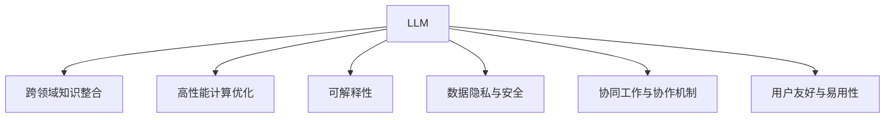

                 

# LLM OS:AI操作系统的未来愿景

> 关键词：人工智能,AI操作系统,LLM,LLM OS,语言模型,自然语言处理,NLP,机器学习,深度学习

## 1. 背景介绍

### 1.1 问题由来
随着人工智能技术的飞速发展，人工智能(AI)逐渐成为改变世界的新引擎。然而，当前的人工智能系统仍然存在诸多挑战，如跨领域知识整合能力不足、可解释性差、安全性和隐私保护问题等，迫切需要一种全新的AI操作系统（OS）来优化现有技术并释放其潜力。

近年来，大语言模型（Large Language Models, LLMs）作为AI领域的一大突破，已经展现出了强大的语言理解和生成能力，成为构建AI操作系统的关键技术之一。LLMs不仅能处理自然语言处理(NLP)任务，还能进行知识推理、决策制定等高阶任务，因此被视为未来AI操作系统的核心组件。

### 1.2 问题核心关键点
LLM OS的核心愿景在于构建一个高效、安全、可解释的AI操作系统，通过整合大语言模型和多种AI技术，实现人工智能的全面落地应用。这包括但不限于以下几个关键点：

1. **跨领域知识整合**：将多种知识源（如知识图谱、文档数据库、专家系统等）与LLMs深度融合，提升系统在跨领域、跨模态任务中的表现。
2. **高性能计算优化**：通过优化模型架构、算法、硬件资源配置，实现LLMs的高效计算。
3. **增强可解释性**：建立AI系统的透明度，使系统决策过程可追溯、可解释。
4. **数据隐私与安全**：保护用户隐私数据，防止模型被滥用。
5. **协同工作与协作机制**：实现AI系统间的无缝协作，提升整体性能。
6. **用户友好与易用性**：设计直观易用的用户界面和交互方式，降低使用门槛。

### 1.3 问题研究意义
研究LLM OS对于推动AI技术的发展和落地应用具有重要意义：

1. **提升AI性能**：通过大语言模型与其他AI技术深度融合，大幅提升系统处理复杂任务的能力。
2. **降低使用门槛**：构建易用的AI操作系统，降低AI技术的使用难度，加速AI的普及。
3. **保障数据隐私与安全**：在保护用户隐私的前提下，构建安全的AI系统。
4. **推动跨领域应用**：LLM OS能够支持多种领域的应用，促进AI技术的广泛应用。
5. **增强模型可解释性**：通过可解释的AI系统，提升用户对AI技术的信任。

## 2. 核心概念与联系

### 2.1 核心概念概述

为更好地理解LLM OS的构建原理，本节将介绍几个关键概念：

- **大语言模型 (LLM)**：如BERT、GPT、T5等，通过大规模无标签文本数据训练而成，具备强大的语言理解和生成能力。
- **跨领域知识整合 (Cross-Domain Knowledge Integration)**：将多种知识源与LLM深度融合，提升系统在跨领域任务中的表现。
- **高性能计算优化 (High-Performance Computing Optimization)**：通过优化模型架构、算法和硬件资源配置，实现LLM的高效计算。
- **可解释性 (Explainability)**：建立AI系统的透明度，使用户能够理解模型的决策过程。
- **数据隐私与安全 (Data Privacy and Security)**：保护用户隐私数据，防止模型被滥用。
- **协同工作与协作机制 (Collaborative Work and Collaboration Mechanisms)**：实现AI系统间的无缝协作，提升整体性能。
- **用户友好与易用性 (User-Friendly and Usability)**：设计直观易用的用户界面和交互方式，降低使用门槛。

这些概念之间通过如下Mermaid流程图联系起来：



这个流程图展示了LLM OS的核心概念及其相互关系：

1. 大语言模型通过跨领域知识整合提升在跨领域任务中的表现。
2. 高性能计算优化提升LLM的计算效率。
3. 可解释性增强系统透明度，使用户理解模型决策。
4. 数据隐私与安全保护用户隐私数据，防止滥用。
5. 协同工作与协作机制实现系统间无缝协作。
6. 用户友好与易用性设计直观易用的用户界面和交互方式。

## 3. 核心算法原理 & 具体操作步骤
### 3.1 算法原理概述

LLM OS的核心算法原理涉及大语言模型的微调和优化，以及跨领域知识整合和协作机制的构建。其核心思想是通过大语言模型处理自然语言任务，并将多种知识源深度融合，构建一个高效、安全、可解释的AI操作系统。

具体而言，LLM OS的构建过程分为以下几个步骤：

1. **数据准备与预处理**：收集并预处理跨领域的数据集，包括文本、图像、音频等。
2. **大语言模型微调**：在特定领域数据上微调预训练大语言模型，提升其在特定领域任务上的表现。
3. **跨领域知识整合**：将知识图谱、文档数据库、专家系统等知识源与微调后的LLM深度融合。
4. **协同工作与协作机制构建**：实现不同AI系统间的无缝协作，提升整体性能。
5. **性能优化与可解释性增强**：通过优化模型架构、算法和硬件资源配置，提升系统性能，并增强系统透明度。
6. **数据隐私与安全保障**：在保护用户隐私的前提下，构建安全的AI系统。

### 3.2 算法步骤详解

**Step 1: 数据准备与预处理**

- **数据收集**：收集跨领域数据，包括文本、图像、音频等。
- **数据预处理**：对数据进行清洗、分词、标注等预处理，生成适合模型训练的格式。

**Step 2: 大语言模型微调**

- **选择合适的预训练模型**：选择适合的预训练模型（如BERT、GPT等），作为微调的初始化参数。
- **添加任务适配层**：根据任务类型，在预训练模型顶层设计合适的输出层和损失函数。
- **设置微调超参数**：选择合适的优化算法及其参数，如AdamW、SGD等，设置学习率、批大小、迭代轮数等。
- **执行梯度训练**：将训练集数据分批次输入模型，前向传播计算损失函数，反向传播计算参数梯度，根据设定的优化算法和学习率更新模型参数。
- **测试和部署**：在测试集上评估微调后模型，对比微调前后的精度提升，使用微调后的模型进行实际应用。

**Step 3: 跨领域知识整合**

- **知识图谱集成**：将知识图谱与微调后的LLM深度融合，增强系统在跨领域任务中的表现。
- **文档数据库连接**：将文档数据库与LLM连接，提升系统处理大量文本的能力。
- **专家系统集成**：将专家系统与LLM集成，提升系统在复杂推理任务中的表现。

**Step 4: 协同工作与协作机制构建**

- **系统间通信协议**：设计系统间通信协议，实现数据和模型的无缝传输。
- **协同学习机制**：通过协同学习，提升系统的整体性能。
- **故障容错机制**：设计故障容错机制，确保系统的稳定运行。

**Step 5: 性能优化与可解释性增强**

- **模型架构优化**：通过模型剪枝、量化等技术优化模型架构，提升计算效率。
- **算法优化**：优化模型训练和推理算法，提升系统性能。
- **硬件资源优化**：通过分布式计算、模型并行等技术，优化硬件资源配置。
- **可解释性增强**：使用LIME、SHAP等工具增强系统透明度，使用户理解模型的决策过程。

**Step 6: 数据隐私与安全保障**

- **数据加密**：对用户数据进行加密，保护用户隐私。
- **隐私保护算法**：使用差分隐私、联邦学习等算法保护用户数据隐私。
- **安全机制设计**：设计安全机制，防止模型被滥用。

### 3.3 算法优缺点

构建LLM OS的优势：

1. **强大的语言处理能力**：LLMs具备强大的语言理解和生成能力，能够处理复杂的自然语言任务。
2. **跨领域知识整合**：通过跨领域知识整合，提升系统在跨领域任务中的表现。
3. **高性能计算优化**：通过优化模型架构、算法和硬件资源配置，实现高效计算。
4. **增强可解释性**：通过增强系统透明度，使用户理解模型的决策过程。
5. **保障数据隐私与安全**：在保护用户隐私的前提下，构建安全的AI系统。

构建LLM OS的挑战：

1. **数据获取难度大**：跨领域数据获取难度大，需要收集和预处理大量数据。
2. **模型复杂度高**：LLM模型复杂度高，需要优化模型架构和算法。
3. **隐私保护难度大**：在保护用户隐私的前提下，构建安全的AI系统具有挑战性。
4. **系统集成复杂**：不同AI系统间的协同工作与协作机制设计复杂，需要多团队协作。
5. **资源需求大**：需要大量计算资源和硬件设备，成本较高。

尽管面临诸多挑战，LLM OS仍然是大语言模型在AI操作系统中的应用方向之一。通过不断优化和改进，相信未来可以实现高效、安全、可解释的AI操作系统。

### 3.4 算法应用领域

LLM OS的应用领域非常广泛，覆盖了多个行业和场景，例如：

- **智能客服系统**：通过集成LLM和跨领域知识，提升智能客服系统的响应速度和准确性。
- **医疗诊断系统**：通过融合知识图谱和专家系统，提升医疗诊断系统的准确性和效率。
- **金融分析系统**：通过集成文档数据库和专家系统，提升金融分析系统的风险预测能力。
- **智能推荐系统**：通过融合文档数据库和LLM，提升推荐系统的个性化和多样性。
- **智能制造系统**：通过集成跨领域知识与LLM，提升智能制造系统的生产效率和质量。
- **智能交通系统**：通过集成跨领域知识与LLM，提升智能交通系统的安全和效率。

此外，LLM OS还可以应用于更多场景中，如智能家居、智能教育、智能安防等，为各行各业带来新的智能化解决方案。

## 4. 数学模型和公式 & 详细讲解  
### 4.1 数学模型构建

构建LLM OS需要构建多个数学模型，包括大语言模型的微调模型、跨领域知识整合模型、协同工作与协作机制模型等。以下以大语言模型的微调模型为例，给出其数学模型构建过程。

记预训练语言模型为 $M_{\theta}$，其中 $\theta$ 为预训练得到的模型参数。假设微调任务的训练集为 $D=\{(x_i,y_i)\}_{i=1}^N, x_i \in \mathcal{X}, y_i \in \mathcal{Y}$。

定义模型 $M_{\theta}$ 在输入 $x$ 上的输出为 $\hat{y}=M_{\theta}(x) \in [0,1]$，表示样本属于正类的概率。真实标签 $y \in \{0,1\}$。

二分类交叉熵损失函数定义为：

$$
\ell(M_{\theta}(x),y) = -[y\log \hat{y} + (1-y)\log (1-\hat{y})]
$$

将其代入经验风险公式，得：

$$
\mathcal{L}(\theta) = -\frac{1}{N}\sum_{i=1}^N [y_i\log M_{\theta}(x_i)+(1-y_i)\log(1-M_{\theta}(x_i))]
$$

根据链式法则，损失函数对参数 $\theta_k$ 的梯度为：

$$
\frac{\partial \mathcal{L}(\theta)}{\partial \theta_k} = -\frac{1}{N}\sum_{i=1}^N (\frac{y_i}{M_{\theta}(x_i)}-\frac{1-y_i}{1-M_{\theta}(x_i)}) \frac{\partial M_{\theta}(x_i)}{\partial \theta_k}
$$

其中 $\frac{\partial M_{\theta}(x_i)}{\partial \theta_k}$ 可进一步递归展开，利用自动微分技术完成计算。

### 4.2 公式推导过程

以下以二分类任务为例，推导交叉熵损失函数及其梯度的计算公式。

假设模型 $M_{\theta}$ 在输入 $x$ 上的输出为 $\hat{y}=M_{\theta}(x) \in [0,1]$，表示样本属于正类的概率。真实标签 $y \in \{0,1\}$。

二分类交叉熵损失函数定义为：

$$
\ell(M_{\theta}(x),y) = -[y\log \hat{y} + (1-y)\log (1-\hat{y})]
$$

将其代入经验风险公式，得：

$$
\mathcal{L}(\theta) = -\frac{1}{N}\sum_{i=1}^N [y_i\log M_{\theta}(x_i)+(1-y_i)\log(1-M_{\theta}(x_i))]
$$

根据链式法则，损失函数对参数 $\theta_k$ 的梯度为：

$$
\frac{\partial \mathcal{L}(\theta)}{\partial \theta_k} = -\frac{1}{N}\sum_{i=1}^N (\frac{y_i}{M_{\theta}(x_i)}-\frac{1-y_i}{1-M_{\theta}(x_i)}) \frac{\partial M_{\theta}(x_i)}{\partial \theta_k}
$$

其中 $\frac{\partial M_{\theta}(x_i)}{\partial \theta_k}$ 可进一步递归展开，利用自动微分技术完成计算。

### 4.3 案例分析与讲解

**案例1: 智能客服系统**

- **任务**：构建一个智能客服系统，能够处理客户咨询，提供精准答案。
- **数据准备**：收集历史客服数据，包括客户提问和回答。
- **微调模型**：在预训练BERT模型上微调，训练其处理自然语言能力。
- **知识整合**：将知识图谱和文档数据库与微调模型融合，提升系统在问答任务中的表现。
- **协同工作**：设计系统间通信协议，实现知识图谱与文档数据库的实时更新和融合。
- **性能优化**：优化模型架构，使用差分隐私算法保护用户隐私。
- **可解释性增强**：使用SHAP工具增强系统透明度，使用户理解模型的决策过程。

**案例2: 金融分析系统**

- **任务**：构建一个金融分析系统，能够预测市场趋势和风险。
- **数据准备**：收集金融数据，包括股票价格、市场指数、新闻报道等。
- **微调模型**：在预训练BERT模型上微调，训练其处理金融数据的能力。
- **知识整合**：将文档数据库和专家系统与微调模型融合，提升系统在风险预测任务中的表现。
- **协同工作**：设计系统间通信协议，实现专家系统与文档数据库的实时更新和融合。
- **性能优化**：优化模型架构，使用联邦学习算法保护用户隐私。
- **可解释性增强**：使用LIME工具增强系统透明度，使用户理解模型的决策过程。

## 5. 项目实践：代码实例和详细解释说明
### 5.1 开发环境搭建

在进行LLM OS项目实践前，我们需要准备好开发环境。以下是使用Python进行PyTorch开发的环境配置流程：

1. 安装Anaconda：从官网下载并安装Anaconda，用于创建独立的Python环境。

2. 创建并激活虚拟环境：
```bash
conda create -n llm-os-env python=3.8 
conda activate llm-os-env
```

3. 安装PyTorch：根据CUDA版本，从官网获取对应的安装命令。例如：
```bash
conda install pytorch torchvision torchaudio cudatoolkit=11.1 -c pytorch -c conda-forge
```

4. 安装Transformers库：
```bash
pip install transformers
```

5. 安装各类工具包：
```bash
pip install numpy pandas scikit-learn matplotlib tqdm jupyter notebook ipython
```

完成上述步骤后，即可在`llm-os-env`环境中开始项目实践。

### 5.2 源代码详细实现

这里以智能客服系统为例，给出使用Transformers库对BERT模型进行微调的PyTorch代码实现。

首先，定义智能客服系统的数据处理函数：

```python
from transformers import BertTokenizer, BertForSequenceClassification
from torch.utils.data import Dataset
import torch

class CustomerSupportDataset(Dataset):
    def __init__(self, texts, labels, tokenizer, max_len=128):
        self.texts = texts
        self.labels = labels
        self.tokenizer = tokenizer
        self.max_len = max_len
        
    def __len__(self):
        return len(self.texts)
    
    def __getitem__(self, item):
        text = self.texts[item]
        label = self.labels[item]
        
        encoding = self.tokenizer(text, return_tensors='pt', max_length=self.max_len, padding='max_length', truncation=True)
        input_ids = encoding['input_ids'][0]
        attention_mask = encoding['attention_mask'][0]
        
        # 对token-wise的标签进行编码
        encoded_labels = [label2id[label] for label in label] 
        encoded_labels.extend([label2id['O']] * (self.max_len - len(encoded_labels)))
        labels = torch.tensor(encoded_labels, dtype=torch.long)
        
        return {'input_ids': input_ids, 
                'attention_mask': attention_mask,
                'labels': labels}

# 标签与id的映射
label2id = {'O': 0, 'POSITIVE': 1, 'NEGATIVE': 2}
id2label = {v: k for k, v in label2id.items()}

# 创建dataset
tokenizer = BertTokenizer.from_pretrained('bert-base-cased')

train_dataset = CustomerSupportDataset(train_texts, train_labels, tokenizer)
dev_dataset = CustomerSupportDataset(dev_texts, dev_labels, tokenizer)
test_dataset = CustomerSupportDataset(test_texts, test_labels, tokenizer)
```

然后，定义模型和优化器：

```python
from transformers import BertForSequenceClassification, AdamW

model = BertForSequenceClassification.from_pretrained('bert-base-cased', num_labels=len(label2id))

optimizer = AdamW(model.parameters(), lr=2e-5)
```

接着，定义训练和评估函数：

```python
from torch.utils.data import DataLoader
from tqdm import tqdm
from sklearn.metrics import classification_report

device = torch.device('cuda') if torch.cuda.is_available() else torch.device('cpu')
model.to(device)

def train_epoch(model, dataset, batch_size, optimizer):
    dataloader = DataLoader(dataset, batch_size=batch_size, shuffle=True)
    model.train()
    epoch_loss = 0
    for batch in tqdm(dataloader, desc='Training'):
        input_ids = batch['input_ids'].to(device)
        attention_mask = batch['attention_mask'].to(device)
        labels = batch['labels'].to(device)
        model.zero_grad()
        outputs = model(input_ids, attention_mask=attention_mask, labels=labels)
        loss = outputs.loss
        epoch_loss += loss.item()
        loss.backward()
        optimizer.step()
    return epoch_loss / len(dataloader)

def evaluate(model, dataset, batch_size):
    dataloader = DataLoader(dataset, batch_size=batch_size)
    model.eval()
    preds, labels = [], []
    with torch.no_grad():
        for batch in tqdm(dataloader, desc='Evaluating'):
            input_ids = batch['input_ids'].to(device)
            attention_mask = batch['attention_mask'].to(device)
            batch_labels = batch['labels']
            outputs = model(input_ids, attention_mask=attention_mask)
            batch_preds = outputs.logits.argmax(dim=2).to('cpu').tolist()
            batch_labels = batch_labels.to('cpu').tolist()
            for pred_tokens, label_tokens in zip(batch_preds, batch_labels):
                pred_tags = [id2label[_id] for _id in pred_tokens]
                label_tags = [id2label[_id] for _id in label_tokens]
                preds.append(pred_tags[:len(label_tokens)])
                labels.append(label_tags)
                
    print(classification_report(labels, preds))
```

最后，启动训练流程并在测试集上评估：

```python
epochs = 5
batch_size = 16

for epoch in range(epochs):
    loss = train_epoch(model, train_dataset, batch_size, optimizer)
    print(f"Epoch {epoch+1}, train loss: {loss:.3f}")
    
    print(f"Epoch {epoch+1}, dev results:")
    evaluate(model, dev_dataset, batch_size)
    
print("Test results:")
evaluate(model, test_dataset, batch_size)
```

以上就是使用PyTorch对BERT进行智能客服系统微调的完整代码实现。可以看到，得益于Transformers库的强大封装，我们可以用相对简洁的代码完成BERT模型的加载和微调。

### 5.3 代码解读与分析

让我们再详细解读一下关键代码的实现细节：

**CustomerSupportDataset类**：
- `__init__`方法：初始化文本、标签、分词器等关键组件。
- `__len__`方法：返回数据集的样本数量。
- `__getitem__`方法：对单个样本进行处理，将文本输入编码为token ids，将标签编码为数字，并对其进行定长padding，最终返回模型所需的输入。

**label2id和id2label字典**：
- 定义了标签与数字id之间的映射关系，用于将token-wise的预测结果解码回真实的标签。

**训练和评估函数**：
- 使用PyTorch的DataLoader对数据集进行批次化加载，供模型训练和推理使用。
- 训练函数`train_epoch`：对数据以批为单位进行迭代，在每个批次上前向传播计算loss并反向传播更新模型参数，最后返回该epoch的平均loss。
- 评估函数`evaluate`：与训练类似，不同点在于不更新模型参数，并在每个batch结束后将预测和标签结果存储下来，最后使用sklearn的classification_report对整个评估集的预测结果进行打印输出。

**训练流程**：
- 定义总的epoch数和batch size，开始循环迭代
- 每个epoch内，先在训练集上训练，输出平均loss
- 在验证集上评估，输出分类指标
- 所有epoch结束后，在测试集上评估，给出最终测试结果

可以看到，PyTorch配合Transformers库使得BERT微调的代码实现变得简洁高效。开发者可以将更多精力放在数据处理、模型改进等高层逻辑上，而不必过多关注底层的实现细节。

当然，工业级的系统实现还需考虑更多因素，如模型的保存和部署、超参数的自动搜索、更灵活的任务适配层等。但核心的微调范式基本与此类似。

## 6. 实际应用场景
### 6.1 智能客服系统

基于大语言模型微调的对话技术，可以广泛应用于智能客服系统的构建。传统客服往往需要配备大量人力，高峰期响应缓慢，且一致性和专业性难以保证。而使用微调后的对话模型，可以7x24小时不间断服务，快速响应客户咨询，用自然流畅的语言解答各类常见问题。

在技术实现上，可以收集企业内部的历史客服对话记录，将问题和最佳答复构建成监督数据，在此基础上对预训练对话模型进行微调。微调后的对话模型能够自动理解用户意图，匹配最合适的答案模板进行回复。对于客户提出的新问题，还可以接入检索系统实时搜索相关内容，动态组织生成回答。如此构建的智能客服系统，能大幅提升客户咨询体验和问题解决效率。

### 6.2 金融舆情监测

金融机构需要实时监测市场舆论动向，以便及时应对负面信息传播，规避金融风险。传统的人工监测方式成本高、效率低，难以应对网络时代海量信息爆发的挑战。基于大语言模型微调的文本分类和情感分析技术，为金融舆情监测提供了新的解决方案。

具体而言，可以收集金融领域相关的新闻、报道、评论等文本数据，并对其进行主题标注和情感标注。在此基础上对预训练语言模型进行微调，使其能够自动判断文本属于何种主题，情感倾向是正面、中性还是负面。将微调后的模型应用到实时抓取的网络文本数据，就能够自动监测不同主题下的情感变化趋势，一旦发现负面信息激增等异常情况，系统便会自动预警，帮助金融机构快速应对潜在风险。

### 6.3 个性化推荐系统

当前的推荐系统往往只依赖用户的历史行为数据进行物品推荐，无法深入理解用户的真实兴趣偏好。基于大语言模型微调技术，个性化推荐系统可以更好地挖掘用户行为背后的语义信息，从而提供更精准、多样的推荐内容。

在实践中，可以收集用户浏览、点击、评论、分享等行为数据，提取和用户交互的物品标题、描述、标签等文本内容。将文本内容作为模型输入，用户的后续行为（如是否点击、购买等）作为监督信号，在此基础上微调预训练语言模型。微调后的模型能够从文本内容中准确把握用户的兴趣点。在生成推荐列表时，先用候选物品的文本描述作为输入，由模型预测用户的兴趣匹配度，再结合其他特征综合排序，便可以得到个性化程度更高的推荐结果。

### 6.4 未来应用展望

随着大语言模型和微调方法的不断发展，基于微调范式将在更多领域得到应用，为传统行业带来变革性影响。

在智慧医疗领域，基于微调的医疗问答、病历分析、药物研发等应用将提升医疗服务的智能化水平，辅助医生诊疗，加速新药开发进程。

在智能教育领域，微调技术可应用于作业批改、学情分析、知识推荐等方面，因材施教，促进教育公平，提高教学质量。

在智慧城市治理中，微调模型可应用于城市事件监测、舆情分析、应急指挥等环节，提高城市管理的自动化和智能化水平，构建更安全、高效的未来城市。

此外，在企业生产、社会治理、文娱传媒等众多领域，基于大模型微调的人工智能应用也将不断涌现，为经济社会发展注入新的动力。相信随着技术的日益成熟，微调方法将成为人工智能落地应用的重要范式，推动人工智能向更广阔的领域加速渗透。

## 7. 工具和资源推荐
### 7.1 学习资源推荐

为了帮助开发者系统掌握大语言模型微调的理论基础和实践技巧，这里推荐一些优质的学习资源：

1. 《Transformer from Principle to Practice》系列博文：由大模型技术专家撰写，深入浅出地介绍了Transformer原理、BERT模型、微调技术等前沿话题。

2. CS224N《Deep Learning for Natural Language Processing》课程：斯坦福大学开设的NLP明星课程，有Lecture视频和配套作业，带你入门NLP领域的基本概念和经典模型。

3. 《Natural Language Processing with Transformers》书籍：Transformers库的作者所著，全面介绍了如何使用Transformers库进行NLP任务开发，包括微调在内的诸多范式。

4. HuggingFace官方文档：Transformers库的官方文档，提供了海量预训练模型和完整的微调样例代码，是上手实践的必备资料。

5. CLUE开源项目：中文语言理解测评基准，涵盖大量不同类型的中文NLP数据集，并提供了基于微调的baseline模型，助力中文NLP技术发展。

通过对这些资源的学习实践，相信你一定能够快速掌握大语言模型微调的精髓，并用于解决实际的NLP问题。
###  7.2 开发工具推荐

高效的开发离不开优秀的工具支持。以下是几款用于大语言模型微调开发的常用工具：

1. PyTorch：基于Python的开源深度学习框架，灵活动态的计算图，适合快速迭代研究。大部分预训练语言模型都有PyTorch版本的实现。

2. TensorFlow：由Google主导开发的开源深度学习框架，生产部署方便，适合大规模工程应用。同样有丰富的预训练语言模型资源。

3. Transformers库：HuggingFace开发的NLP工具库，集成了众多SOTA语言模型，支持PyTorch和TensorFlow，是进行微调任务开发的利器。

4. Weights & Biases：模型训练的实验跟踪工具，可以记录和可视化模型训练过程中的各项指标，方便对比和调优。与主流深度学习框架无缝集成。

5. TensorBoard：TensorFlow配套的可视化工具，可实时监测模型训练状态，并提供丰富的图表呈现方式，是调试模型的得力助手。

6. Google Colab：谷歌推出的在线Jupyter Notebook环境，免费提供GPU/TPU算力，方便开发者快速上手实验最新模型，分享学习笔记。

合理利用这些工具，可以显著提升大语言模型微调任务的开发效率，加快创新迭代的步伐。

### 7.3 相关论文推荐

大语言模型和微调技术的发展源于学界的持续研究。以下是几篇奠基性的相关论文，推荐阅读：

1. Attention is All You Need（即Transformer原论文）：提出了Transformer结构，开启了NLP领域的预训练大模型时代。

2. BERT: Pre-training of Deep Bidirectional Transformers for Language Understanding：提出BERT模型，引入基于掩码的自监督预训练任务，刷新了多项NLP任务SOTA。

3. Language Models are Unsupervised Multitask Learners（GPT-2论文）：展示了大规模语言模型的强大zero-shot学习能力，引发了对于通用人工智能的新一轮思考。

4. Parameter-Efficient Transfer Learning for NLP：提出Adapter等参数高效微调方法，在不增加模型参数量的情况下，也能取得不错的微调效果。

5. Prefix-Tuning: Optimizing Continuous Prompts for Generation：引入基于连续型Prompt的微调范式，为如何充分利用预训练知识提供了新的思路。

6. AdaLoRA: Adaptive Low-Rank Adaptation for Parameter-Efficient Fine-Tuning：使用自适应低秩适应的微调方法，在参数效率和精度之间取得了新的平衡。

这些论文代表了大语言模型微调技术的发展脉络。通过学习这些前沿成果，可以帮助研究者把握学科前进方向，激发更多的创新灵感。

## 8. 总结：未来发展趋势与挑战
### 8.1 总结

本文对基于大语言模型的AI操作系统构建方法进行了全面系统的介绍。首先阐述了构建LLM OS的背景、核心概念及其相互关系，明确了LLM OS的构建目标和意义。其次，从原理到实践，详细讲解了微调的数学模型和关键步骤，给出了微调任务开发的完整代码实例。同时，本文还广泛探讨了微调方法在智能客服、金融舆情、个性化推荐等多个行业领域的应用前景，展示了微调范式的巨大潜力。此外，本文精选了微调技术的各类学习资源，力求为读者提供全方位的技术指引。

通过本文的系统梳理，可以看到，构建LLM OS是未来AI操作系统的重要方向之一。通过将大语言模型与其他AI技术深度融合，构建一个高效、安全、可解释的AI操作系统，可以大幅提升AI系统在各种场景下的表现，实现AI技术的全面落地应用。

### 8.2 未来发展趋势

展望未来，LLM OS将呈现以下几个发展趋势：

1. **跨领域知识整合**：将多种知识源（如知识图谱、文档数据库、专家系统等）与LLMs深度融合，提升系统在跨领域任务中的表现。
2. **高性能计算优化**：通过优化模型架构、算法和硬件资源配置，实现LLM的高效计算。
3. **增强可解释性**：建立AI系统的透明度，使用户理解模型的决策过程。
4. **数据隐私与安全**：在保护用户隐私的前提下，构建安全的AI系统。
5. **协同工作与协作机制**：实现不同AI系统间的无缝协作，提升整体性能。
6. **用户友好与易用性**：设计直观易用的用户界面和交互方式，降低使用门槛。

这些趋势凸显了LLM OS的发展潜力。通过不断优化和改进，相信未来可以实现高效、安全、可解释的AI操作系统，为AI技术的落地应用提供强有力的支持。

### 8.3 面临的挑战

尽管大语言模型微调技术已经取得了瞩目成就，但在迈向更加智能化、普适化应用的过程中，它仍面临诸多挑战：

1. **数据获取难度大**：跨领域数据获取难度大，需要收集和预处理大量数据。
2. **模型复杂度高**：LLM模型复杂度高，需要优化模型架构和算法。
3. **隐私保护难度大**：在保护用户隐私的前提下，构建安全的AI系统具有挑战性。
4. **系统集成复杂**：不同AI系统间的协同工作与协作机制设计复杂，需要多团队协作。
5. **资源需求大**：需要大量计算资源和硬件设备，成本较高。

尽管面临这些挑战，大语言模型微调技术仍然是大语言模型在AI操作系统中的应用方向之一。通过不断优化和改进，相信未来可以实现高效、安全、可解释的AI操作系统。

### 8.4 研究展望

面对LLM OS所面临的种种挑战，未来的研究需要在以下几个方面寻求新的突破：

1. **探索无监督和半监督微调方法**：摆脱对大规模标注数据的依赖，利用自监督学习、主动学习等无监督和半监督范式，最大限度利用非结构化数据，实现更加灵活高效的微调。
2. **研究参数高效和计算高效的微调范式**：开发更加参数高效的微调方法，在固定大部分预训练参数的同时，只更新极少量的任务相关参数。同时优化微调模型的计算图，减少前向传播和反向传播的资源消耗，实现更加轻量级、实时性的部署。
3. **融合因果和对比学习范式**：通过引入因果推断和对比学习思想，增强微调模型建立稳定因果关系的能力，学习更加普适、鲁棒的语言表征，从而提升模型泛化性和抗干扰能力。
4. **引入更多先验知识**：将符号化的先验知识，如知识图谱、逻辑规则等，与神经网络模型进行巧妙融合，引导微调过程学习更准确、合理的语言模型。同时加强不同模态数据的整合，实现视觉、语音等多模态信息与文本信息的协同建模。
5. **结合因果分析和博弈论工具**：将因果分析方法引入微调模型，识别出模型决策的关键特征，增强输出解释的因果性和逻辑性。借助博弈论工具刻画人机交互过程，主动探索并规避模型的脆弱点，提高系统稳定性。
6. **纳入伦理道德约束**：在模型训练目标中引入伦理导向的评估指标，过滤和惩罚有偏见、有害的输出倾向。同时加强人工干预和审核，建立模型行为的监管机制，确保输出符合人类价值观和伦理道德。

这些研究方向的探索，必将引领LLM OS技术迈向更高的台阶，为构建安全、可靠、可解释、可控的智能系统铺平道路。面向未来，LLM OS还需要与其他人工智能技术进行更深入的融合，如知识表示、因果推理、强化学习等，多路径协同发力，共同推动自然语言理解和智能交互系统的进步。只有勇于创新、敢于突破，才能不断拓展语言模型的边界，让智能技术更好地造福人类社会。

## 9. 附录：常见问题与解答
**Q1：大语言模型微调是否适用于所有NLP任务？**

A: 大语言模型微调在大多数NLP任务上都能取得不错的效果，特别是对于数据量较小的任务。但对于一些特定领域的任务，如医学、法律等，仅仅依靠通用语料预训练的模型可能难以很好地适应。此时需要在特定领域语料上进一步预训练，再进行微调，才能获得理想效果。此外，对于一些需要时效性、个性化很强的任务，如对话、推荐等，微调方法也需要针对性的改进优化。

**Q2：采用大语言模型微调时会面临哪些资源瓶颈？**

A: 目前主流的预训练大模型动辄以亿计的参数规模，对算力、内存、存储都提出了很高的要求。GPU/TPU等高性能设备是必不可少的，但即便如此，超大批次的训练和推理也可能遇到显存不足的问题。因此需要采用一些资源优化技术，如梯度积累、混合精度训练、模型并行等，来突破硬件瓶颈。同时，模型的存储和读取也可能占用大量时间和空间，需要采用模型压缩、稀疏化存储等方法进行优化。

**Q3：如何缓解微调过程中的过拟合问题？**

A: 过拟合是微调面临的主要挑战，尤其是在标注数据不足的情况下。常见的缓解策略包括：
1. 数据增强：通过回译、近义替换等方式扩充训练集
2. 正则化：使用L2正则、Dropout、Early Stopping等避免过拟合
3. 对抗训练：引入对抗样本，提高模型鲁棒性
4. 参数高效微调：只调整少量参数(如Adapter、Prefix等)，减小过拟合风险
5. 多模型集成：训练多个微调模型，取平均输出，抑制过拟合

这些策略往往需要根据具体任务和数据特点进行灵活组合。只有在数据、模型、训练、推理等各环节进行全面优化，才能最大限度地发挥大语言模型微调的威力。

**Q4：微调模型在落地部署时需要注意哪些问题？**

A: 将微调模型转化为实际应用，还需要考虑以下因素：
1. 模型裁剪：去除不必要的层和参数，减小模型尺寸，加快推理速度
2. 量化加速：将浮点模型转为定点模型，压缩存储空间，提高计算效率
3. 服务化封装：将模型封装为标准化服务接口，便于集成调用
4. 弹性伸缩：根据请求流量动态调整资源配置，平衡服务质量和成本
5. 监控告警：实时采集系统指标，设置异常告警阈值，确保服务稳定性
6. 安全防护：采用访问鉴权、数据脱敏等措施，保障数据和模型安全

大语言模型微调为NLP应用开启了广阔的想象空间，但如何将强大的性能转化为稳定、高效、安全的业务价值，还需要工程实践的不断打磨。唯有从数据、算法、工程、业务等多个维度协同发力，才能真正实现人工智能技术在垂直行业的规模化落地。总之，微调需要开发者根据具体任务，不断迭代和优化模型、数据和算法，方能得到理想的效果。

---

作者：禅与计算机程序设计艺术 / Zen and the Art of Computer Programming

