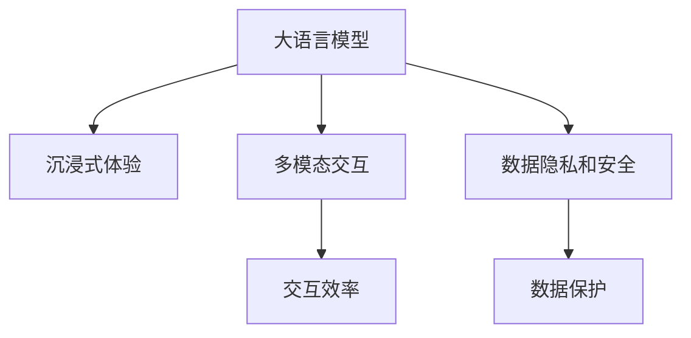

                 

# LLM 和元宇宙：打造沉浸式虚拟世界

> 关键词：大语言模型,元宇宙,沉浸式体验,虚拟世界,人工智能,交互设计,3D图形技术,用户定制

## 1. 背景介绍

### 1.1 问题由来

随着技术的不断进步，虚拟现实(VR)和增强现实(AR)技术逐渐成熟，为元宇宙(Utopia)的实现提供了坚实的技术基础。元宇宙是虚拟世界和现实世界无缝融合的数字化、智能化空间，用户可以在其中自由探索、互动和创造，实现沉浸式体验。

在这个过程中，大语言模型(LLM)以其强大的语言理解和生成能力，扮演了至关重要的角色。LLM通过学习海量的文本数据，能够自动理解自然语言，生成自然流畅的语言回复，并在各种虚拟场景中进行交互。这些特性使得LLM成为打造沉浸式虚拟世界的理想选择。

### 1.2 问题核心关键点

元宇宙中，用户需要与虚拟世界和机器人进行自然语言交互，以便完成各种任务，如探索、购物、社交等。而LLM能够处理自然语言，提供丰富的交互和自然回答，从而提升用户体验。但目前，LLM在虚拟世界中的使用仍存在一些问题，包括：

1. 自然语言理解能力有待提升：当前的LLM对特定领域的知识和概念可能存在理解不足，无法很好地适应复杂的虚拟场景。
2. 多模态交互能力不足：元宇宙中需要融合视觉、听觉、触觉等多种感官，但现有的LLM主要依赖文本信息，缺乏多模态交互能力。
3. 数据隐私和安全问题：元宇宙中的虚拟活动可能涉及用户隐私信息，如何确保数据安全成为一大挑战。
4. 交互效率和响应速度：在虚拟环境中，高效的交互和实时响应是用户体验的关键。现有的LLM在处理大规模数据时，速度和效率仍有待提升。

## 2. 核心概念与联系

### 2.1 核心概念概述

为更好地理解大语言模型在元宇宙中的应用，本节将介绍几个关键概念：

- 大语言模型(Large Language Model, LLM)：以自回归(如GPT)或自编码(如BERT)模型为代表的大规模预训练语言模型。通过在大规模无标签文本语料上进行预训练，学习通用的语言表示，具备强大的语言理解和生成能力。

- 元宇宙(Utopia)：虚拟世界和现实世界无缝融合的数字化、智能化空间。用户可以在其中自由探索、互动和创造，实现沉浸式体验。

- 沉浸式体验(Immersive Experience)：通过VR、AR等技术，提供感官上高度逼真的虚拟环境，使用户仿佛身临其境。

- 多模态交互(Multi-Modal Interaction)：融合视觉、听觉、触觉等多种感官的信息交互方式。

- 数据隐私和安全(Participants Privacy and Security)：在虚拟环境中，如何保护用户隐私信息，防止数据泄露和滥用。

这些核心概念之间的逻辑关系可以通过以下Mermaid流程图来展示：



这个流程图展示了大语言模型与元宇宙中沉浸式体验、多模态交互、数据隐私和安全等核心概念之间的紧密联系。

## 3. 核心算法原理 & 具体操作步骤

### 3.1 算法原理概述

大语言模型在元宇宙中的应用，主要围绕语言理解和生成能力展开。通过训练大语言模型，使其能够理解虚拟环境中的自然语言输入，并提供符合用户期望的自然语言输出，从而实现高效的交互。

核心思想是将大语言模型嵌入到虚拟世界的每个角落，使用户可以通过自然语言与虚拟世界和机器人进行交流。例如，在虚拟商店中，用户可以通过对话与虚拟助手沟通，查询商品信息，进行购买；在虚拟图书馆中，用户可以通过自然语言查询书籍，获取所需知识；在虚拟会议室中，用户可以通过语音交互，参与会议讨论。

### 3.2 算法步骤详解

以下是基于大语言模型在元宇宙中实现沉浸式体验和交互的基本步骤：

**Step 1: 数据收集与预处理**
- 收集虚拟世界中的各种文本数据，如虚拟商店的商品描述、虚拟图书馆的书籍摘要、虚拟会议的对话记录等。
- 对数据进行清洗和标注，确保数据质量。

**Step 2: 模型训练与优化**
- 选择合适的预训练语言模型，如BERT、GPT等，作为初始化参数。
- 使用虚拟世界中的文本数据进行预训练，提升模型的语言理解和生成能力。
- 根据虚拟世界中的实际任务，设计任务适配层，优化模型输出。

**Step 3: 多模态交互设计**
- 设计多模态交互界面，将视觉、听觉、触觉等感官信息融合到自然语言交互中。
- 使用3D图形技术，构建逼真的虚拟场景，提供沉浸式体验。

**Step 4: 用户定制与个性化**
- 提供用户定制功能，允许用户根据个人喜好和需求，自定义虚拟世界中的内容和交互方式。
- 通过用户行为分析，动态调整虚拟世界的设置，提升用户体验。

**Step 5: 数据保护与隐私**
- 实施数据加密和访问控制，确保用户隐私信息的安全。
- 定期对虚拟世界进行安全审计，防止潜在的安全漏洞。

**Step 6: 部署与优化**
- 将训练好的模型部署到虚拟世界中，通过API或SDK等方式提供服务。
- 实时监控模型性能，根据用户反馈和系统状态，优化模型参数和交互方式。

### 3.3 算法优缺点

大语言模型在元宇宙中的应用具有以下优点：

1. 强大的自然语言理解能力：能够自动理解虚拟环境中的自然语言输入，提供高质量的交互体验。
2. 高效的交互和响应：通过优化算法和模型架构，实现实时、高效的交互和响应。
3. 丰富的交互形式：支持多种交互方式，如语音、文本、手势等，提升用户体验。
4. 用户定制和个性化：提供用户定制功能，允许用户自由探索和创造虚拟世界。

同时，也存在一些缺点：

1. 数据需求量大：需要大量高质量的虚拟世界文本数据进行训练。
2. 隐私和安全风险：在虚拟环境中，数据泄露和滥用风险较高。
3. 多模态交互复杂：融合视觉、听觉、触觉等多感官信息，技术实现难度大。
4. 交互效率和响应速度：处理大规模数据时，交互效率和响应速度仍需提升。

## 4. 数学模型和公式 & 详细讲解 & 举例说明

### 4.1 数学模型构建

以下是构建大语言模型在元宇宙中应用的基本数学模型：

1. 语言模型概率分布：$P(x)$，表示给定输入$x$，生成特定输出序列的概率分布。
2. 条件概率分布：$P(x|y)$，表示给定输出序列$y$，生成特定输入$x$的概率分布。
3. 最大似然估计：通过最大化输入-输出对数似然，优化模型参数$\theta$。

**公式推导过程**

假设大语言模型采用自回归模型，输入为文本序列$x_1,\cdots,x_T$，输出为文本序列$y_1,\cdots,y_T$。模型参数为$\theta$，则目标函数为：

$$
\mathcal{L}(\theta) = -\frac{1}{N}\sum_{i=1}^N \log P(x_i,y_i)
$$

其中$P(x_i,y_i)$表示输入-输出序列的概率，可以表示为条件概率的乘积：

$$
P(x_i,y_i) = \prod_{t=1}^{T} P(x_i|y_{<t})
$$

目标函数可进一步表示为：

$$
\mathcal{L}(\theta) = -\frac{1}{N}\sum_{i=1}^N \sum_{t=1}^{T} \log P(x_i,y_i)
$$

为计算方便，通常采用对数似然函数：

$$
\mathcal{L}(\theta) = -\frac{1}{N}\sum_{i=1}^N \sum_{t=1}^{T} \log \frac{P(x_i|y_{<t})}{\sum_{x' \in V} P(x_i|y_{<t},x')}
$$

其中$V$表示词汇表。通过最大化目标函数，可以优化模型参数$\theta$，提升语言理解和生成能力。

**案例分析与讲解**

以虚拟商店为例，用户可以通过自然语言输入查询商品信息。模型将输入序列$x_1,\cdots,x_T$映射到输出序列$y_1,\cdots,y_T$，即商品描述。目标函数为：

$$
\mathcal{L}(\theta) = -\frac{1}{N}\sum_{i=1}^N \sum_{t=1}^{T} \log \frac{P(x_i,y_i)}{P(x_i)}
$$

其中$P(x_i)$表示文本序列$x_i$的概率分布。通过最大化目标函数，模型可以学习到商品描述的规律，生成自然流畅的语言回复，提升虚拟商店的交互体验。

## 5. 项目实践：代码实例和详细解释说明

### 5.1 开发环境搭建

在进行元宇宙应用开发前，需要先搭建好开发环境。以下是使用Python和PyTorch搭建开发环境的步骤：

1. 安装Anaconda：从官网下载并安装Anaconda，用于创建独立的Python环境。

2. 创建并激活虚拟环境：
```bash
conda create -n pytorch-env python=3.8 
conda activate pytorch-env
```

3. 安装PyTorch：根据CUDA版本，从官网获取对应的安装命令。例如：
```bash
conda install pytorch torchvision torchaudio cudatoolkit=11.1 -c pytorch -c conda-forge
```

4. 安装Transformers库：
```bash
pip install transformers
```

5. 安装各类工具包：
```bash
pip install numpy pandas scikit-learn matplotlib tqdm jupyter notebook ipython
```

完成上述步骤后，即可在`pytorch-env`环境中开始元宇宙应用开发。

### 5.2 源代码详细实现

这里我们以虚拟商店应用为例，展示如何使用Transformers库对BERT模型进行元宇宙应用的微调。

**虚拟商店数据处理函数**

```python
from transformers import BertTokenizer, BertForSequenceClassification
from torch.utils.data import Dataset
import torch

class VirtualStoreDataset(Dataset):
    def __init__(self, texts, labels, tokenizer, max_len=128):
        self.texts = texts
        self.labels = labels
        self.tokenizer = tokenizer
        self.max_len = max_len
        
    def __len__(self):
        return len(self.texts)
    
    def __getitem__(self, item):
        text = self.texts[item]
        label = self.labels[item]
        
        encoding = self.tokenizer(text, return_tensors='pt', max_length=self.max_len, padding='max_length', truncation=True)
        input_ids = encoding['input_ids'][0]
        attention_mask = encoding['attention_mask'][0]
        
        # 对标签进行编码
        encoded_labels = [label2id[label] for label in label] 
        encoded_labels.extend([label2id['O']] * (self.max_len - len(encoded_labels)))
        labels = torch.tensor(encoded_labels, dtype=torch.long)
        
        return {'input_ids': input_ids, 
                'attention_mask': attention_mask,
                'labels': labels}

# 标签与id的映射
label2id = {'O': 0, '商品': 1, '商品详情': 2}
id2label = {v: k for k, v in label2id.items()}

# 创建dataset
tokenizer = BertTokenizer.from_pretrained('bert-base-cased')

train_dataset = VirtualStoreDataset(train_texts, train_labels, tokenizer)
dev_dataset = VirtualStoreDataset(dev_texts, dev_labels, tokenizer)
test_dataset = VirtualStoreDataset(test_texts, test_labels, tokenizer)
```

**模型定义和优化器**

```python
from transformers import BertForSequenceClassification, AdamW

model = BertForSequenceClassification.from_pretrained('bert-base-cased', num_labels=len(label2id))

optimizer = AdamW(model.parameters(), lr=2e-5)
```

**训练和评估函数**

```python
from torch.utils.data import DataLoader
from tqdm import tqdm
from sklearn.metrics import classification_report

device = torch.device('cuda') if torch.cuda.is_available() else torch.device('cpu')
model.to(device)

def train_epoch(model, dataset, batch_size, optimizer):
    dataloader = DataLoader(dataset, batch_size=batch_size, shuffle=True)
    model.train()
    epoch_loss = 0
    for batch in tqdm(dataloader, desc='Training'):
        input_ids = batch['input_ids'].to(device)
        attention_mask = batch['attention_mask'].to(device)
        labels = batch['labels'].to(device)
        model.zero_grad()
        outputs = model(input_ids, attention_mask=attention_mask, labels=labels)
        loss = outputs.loss
        epoch_loss += loss.item()
        loss.backward()
        optimizer.step()
    return epoch_loss / len(dataloader)

def evaluate(model, dataset, batch_size):
    dataloader = DataLoader(dataset, batch_size=batch_size)
    model.eval()
    preds, labels = [], []
    with torch.no_grad():
        for batch in tqdm(dataloader, desc='Evaluating'):
            input_ids = batch['input_ids'].to(device)
            attention_mask = batch['attention_mask'].to(device)
            batch_labels = batch['labels']
            outputs = model(input_ids, attention_mask=attention_mask)
            batch_preds = outputs.logits.argmax(dim=2).to('cpu').tolist()
            batch_labels = batch_labels.to('cpu').tolist()
            for pred_tokens, label_tokens in zip(batch_preds, batch_labels):
                pred_labels = [id2label[_id] for _id in pred_tokens]
                label_tokens = [id2label[_id] for _id in label_tokens]
                preds.append(pred_labels[:len(label_tokens)])
                labels.append(label_tokens)
                
    print(classification_report(labels, preds))
```

**虚拟商店应用启动流程**

```python
epochs = 5
batch_size = 16

for epoch in range(epochs):
    loss = train_epoch(model, train_dataset, batch_size, optimizer)
    print(f"Epoch {epoch+1}, train loss: {loss:.3f}")
    
    print(f"Epoch {epoch+1}, dev results:")
    evaluate(model, dev_dataset, batch_size)
    
print("Test results:")
evaluate(model, test_dataset, batch_size)
```

以上就是使用PyTorch对BERT进行虚拟商店应用微调的完整代码实现。可以看到，得益于Transformers库的强大封装，我们可以用相对简洁的代码完成BERT模型的加载和微调。

### 5.3 代码解读与分析

让我们再详细解读一下关键代码的实现细节：

**VirtualStoreDataset类**

- `__init__`方法：初始化文本、标签、分词器等关键组件。
- `__len__`方法：返回数据集的样本数量。
- `__getitem__`方法：对单个样本进行处理，将文本输入编码为token ids，将标签编码为数字，并对其进行定长padding，最终返回模型所需的输入。

**label2id和id2label字典**

- 定义了标签与数字id之间的映射关系，用于将token-wise的预测结果解码回真实的标签。

**训练和评估函数**

- 使用PyTorch的DataLoader对数据集进行批次化加载，供模型训练和推理使用。
- 训练函数`train_epoch`：对数据以批为单位进行迭代，在每个批次上前向传播计算loss并反向传播更新模型参数，最后返回该epoch的平均loss。
- 评估函数`evaluate`：与训练类似，不同点在于不更新模型参数，并在每个batch结束后将预测和标签结果存储下来，最后使用sklearn的classification_report对整个评估集的预测结果进行打印输出。

**训练流程**

- 定义总的epoch数和batch size，开始循环迭代
- 每个epoch内，先在训练集上训练，输出平均loss
- 在验证集上评估，输出分类指标
- 所有epoch结束后，在测试集上评估，给出最终测试结果

可以看到，PyTorch配合Transformers库使得BERT微调的代码实现变得简洁高效。开发者可以将更多精力放在数据处理、模型改进等高层逻辑上，而不必过多关注底层的实现细节。

当然，工业级的系统实现还需考虑更多因素，如模型的保存和部署、超参数的自动搜索、更灵活的任务适配层等。但核心的微调范式基本与此类似。

## 6. 实际应用场景

### 6.1 智能客服系统

基于大语言模型在虚拟商店应用的微调，智能客服系统可以通过类似的原理进行构建。在智能客服系统中，大语言模型可以与用户进行自然语言对话，解答各种问题，如商品查询、订单状态查询、售后服务等。通过微调，模型可以学习虚拟客服的历史对话记录和标准答案，提供准确、自然的回答，提升用户体验。

在技术实现上，可以收集企业内部的客服对话记录，将问题和最佳答复构建成监督数据，在此基础上对预训练模型进行微调。微调后的模型能够自动理解用户意图，匹配最合适的答案模板进行回复。对于客户提出的新问题，还可以接入检索系统实时搜索相关内容，动态组织生成回答。如此构建的智能客服系统，能大幅提升客户咨询体验和问题解决效率。

### 6.2 智慧金融系统

智慧金融系统可以通过虚拟银行的虚拟场景进行构建，使用大语言模型进行金融咨询和交易操作。在虚拟银行中，用户可以虚拟存储资金、虚拟购物、虚拟转账等。通过微调，模型可以学习金融领域的知识和术语，提供精准的金融咨询和交易建议。用户可以通过自然语言输入进行金融操作，如查询账户余额、申请贷款、转账汇款等，提升用户体验。

在技术实现上，可以收集金融领域的咨询记录和操作日志，设计金融任务适配层，对预训练模型进行微调。微调后的模型能够自动理解用户的金融需求，提供高质量的金融咨询和操作建议。通过虚拟银行，用户可以在虚拟环境中进行金融操作，提升金融服务的便捷性和安全性。

### 6.3 虚拟教育系统

虚拟教育系统可以通过虚拟教室、虚拟实验室等场景进行构建，使用大语言模型进行课程讲解和实验指导。在虚拟教育系统中，教师和学生可以通过自然语言进行互动，提升教学效果。学生可以通过虚拟实验环境进行实验操作，提升实验技能。通过微调，模型可以学习虚拟教育的任务和知识点，提供精准的课程讲解和实验指导。

在技术实现上，可以收集教育领域的教学视频、实验记录、课程讲解等数据，设计教育任务适配层，对预训练模型进行微调。微调后的模型能够自动理解教育任务，提供高质量的课程讲解和实验指导。通过虚拟教育系统，学生可以在虚拟环境中进行课程学习、实验操作，提升学习效果。

### 6.4 未来应用展望

随着大语言模型和虚拟技术的不断发展，基于微调的元宇宙应用将更加多样和丰富，为各行各业带来新的机遇和挑战。

在智慧医疗领域，虚拟医院可以通过虚拟医生、虚拟护士等场景进行构建，使用大语言模型进行疾病诊断和治疗建议。在虚拟医院中，用户可以虚拟就医、虚拟诊疗、虚拟购药等。通过微调，模型可以学习医疗领域的知识和术语，提供精准的诊断和治疗建议。

在智能家居领域，虚拟家居可以通过虚拟家庭场景进行构建，使用大语言模型进行智能控制和交互。在虚拟家居中，用户可以虚拟控制家电、虚拟导航、虚拟娱乐等。通过微调，模型可以学习家居环境的任务和知识点，提供高质量的智能控制和交互体验。

在旅游景区，虚拟景区可以通过虚拟旅游场景进行构建，使用大语言模型进行景点介绍和导航。在虚拟景区中，用户可以虚拟旅游、虚拟观光、虚拟购物等。通过微调，模型可以学习旅游景区的知识和术语，提供精准的景点介绍和导航建议。

在虚拟游戏，虚拟游戏可以通过虚拟游戏场景进行构建，使用大语言模型进行游戏交互和任务引导。在虚拟游戏中，用户可以虚拟游戏、虚拟互动、虚拟任务等。通过微调，模型可以学习游戏场景的任务和知识点，提供高质量的游戏交互和任务引导。

未来，随着预训练语言模型和虚拟技术的不断演进，基于微调的元宇宙应用将更加多样和丰富，为各行各业带来新的机遇和挑战。相信通过技术的不断创新和应用，元宇宙将为我们带来更加美好的数字化生活。

## 7. 工具和资源推荐

### 7.1 学习资源推荐

为了帮助开发者系统掌握大语言模型在元宇宙中的应用，这里推荐一些优质的学习资源：

1. 《Transformer from the Basics to the Advanced》系列博文：由大模型技术专家撰写，深入浅出地介绍了Transformer原理、BERT模型、微调技术等前沿话题。

2. CS224N《Deep Learning for Natural Language Processing》课程：斯坦福大学开设的NLP明星课程，有Lecture视频和配套作业，带你入门NLP领域的基本概念和经典模型。

3. 《Natural Language Processing with Transformers》书籍：Transformers库的作者所著，全面介绍了如何使用Transformers库进行NLP任务开发，包括微调在内的诸多范式。

4. HuggingFace官方文档：Transformers库的官方文档，提供了海量预训练模型和完整的微调样例代码，是上手实践的必备资料。

5. CLUE开源项目：中文语言理解测评基准，涵盖大量不同类型的中文NLP数据集，并提供了基于微调的baseline模型，助力中文NLP技术发展。

通过对这些资源的学习实践，相信你一定能够快速掌握大语言模型在元宇宙中的应用精髓，并用于解决实际的NLP问题。

### 7.2 开发工具推荐

高效的开发离不开优秀的工具支持。以下是几款用于大语言模型在元宇宙应用开发的常用工具：

1. PyTorch：基于Python的开源深度学习框架，灵活动态的计算图，适合快速迭代研究。大部分预训练语言模型都有PyTorch版本的实现。

2. TensorFlow：由Google主导开发的开源深度学习框架，生产部署方便，适合大规模工程应用。同样有丰富的预训练语言模型资源。

3. Transformers库：HuggingFace开发的NLP工具库，集成了众多SOTA语言模型，支持PyTorch和TensorFlow，是进行元宇宙应用开发的利器。

4. Weights & Biases：模型训练的实验跟踪工具，可以记录和可视化模型训练过程中的各项指标，方便对比和调优。与主流深度学习框架无缝集成。

5. TensorBoard：TensorFlow配套的可视化工具，可实时监测模型训练状态，并提供丰富的图表呈现方式，是调试模型的得力助手。

6. Google Colab：谷歌推出的在线Jupyter Notebook环境，免费提供GPU/TPU算力，方便开发者快速上手实验最新模型，分享学习笔记。

合理利用这些工具，可以显著提升大语言模型在元宇宙应用开发中的效率，加快创新迭代的步伐。

### 7.3 相关论文推荐

大语言模型和元宇宙的应用源于学界的持续研究。以下是几篇奠基性的相关论文，推荐阅读：

1. Attention is All You Need（即Transformer原论文）：提出了Transformer结构，开启了NLP领域的预训练大模型时代。

2. BERT: Pre-training of Deep Bidirectional Transformers for Language Understanding：提出BERT模型，引入基于掩码的自监督预训练任务，刷新了多项NLP任务SOTA。

3. Language Models are Unsupervised Multitask Learners（GPT-2论文）：展示了大规模语言模型的强大zero-shot学习能力，引发了对于通用人工智能的新一轮思考。

4. Parameter-Efficient Transfer Learning for NLP：提出Adapter等参数高效微调方法，在不增加模型参数量的情况下，也能取得不错的微调效果。

5. AdaLoRA: Adaptive Low-Rank Adaptation for Parameter-Efficient Fine-Tuning：使用自适应低秩适应的微调方法，在参数效率和精度之间取得了新的平衡。

6. Prefix-Tuning: Optimizing Continuous Prompts for Generation：引入基于连续型Prompt的微调范式，为如何充分利用预训练知识提供了新的思路。

这些论文代表了大语言模型在元宇宙应用中的发展脉络。通过学习这些前沿成果，可以帮助研究者把握学科前进方向，激发更多的创新灵感。

## 8. 总结：未来发展趋势与挑战

### 8.1 总结

本文对大语言模型在元宇宙中的应用进行了全面系统的介绍。首先阐述了元宇宙的概念和虚拟现实、增强现实等技术对大语言模型的需求。其次，从原理到实践，详细讲解了大语言模型在虚拟商店、智能客服、智慧金融等多个场景中的应用流程。最后，探讨了基于大语言模型的元宇宙应用在未来可能的发展趋势和面临的挑战。

通过本文的系统梳理，可以看到，大语言模型在元宇宙中的应用不仅拓展了其应用边界，还为构建沉浸式虚拟世界提供了新的可能性。随着技术的不断演进和完善，大语言模型必将在元宇宙中扮演越来越重要的角色。

### 8.2 未来发展趋势

展望未来，大语言模型在元宇宙中的应用将呈现以下几个发展趋势：

1. 模型规模持续增大。随着算力成本的下降和数据规模的扩张，预训练语言模型的参数量还将持续增长。超大规模语言模型蕴含的丰富语言知识，有望支撑更加复杂多变的虚拟场景微调。

2. 多模态交互能力增强。元宇宙中需要融合视觉、听觉、触觉等多种感官的信息交互方式。未来的大语言模型将具备更加多样化的多模态交互能力，提升用户体验。

3. 持续学习成为常态。随着数据分布的不断变化，微调模型也需要持续学习新知识以保持性能。如何在不遗忘原有知识的同时，高效吸收新样本信息，将成为重要的研究课题。

4. 用户定制和个性化功能完善。元宇宙中需要根据用户喜好和需求，提供多样化的交互和创造功能。未来的大语言模型将具备更加完善的定制和个性化功能，提升用户粘性。

5. 数据隐私和安全保障。在虚拟环境中，用户隐私信息的安全保护尤为重要。未来的大语言模型将采用更加严格的数据隐私和安全保护措施，确保用户数据安全。

6. 虚拟环境中的高效推理和响应。处理大规模数据时，交互效率和响应速度仍需提升。未来的大语言模型将采用更加高效的推理和响应机制，提升用户体验。

以上趋势凸显了大语言模型在元宇宙应用中的广阔前景。这些方向的探索发展，必将进一步提升元宇宙的沉浸式体验和交互效果，为构建虚拟世界带来新的突破。

### 8.3 面临的挑战

尽管大语言模型在元宇宙中的应用前景广阔，但在迈向更加智能化、普适化应用的过程中，它仍面临着诸多挑战：

1. 多模态交互复杂性。融合视觉、听觉、触觉等多种感官信息，技术实现难度大，需要更多的跨学科合作。

2. 用户隐私和安全问题。在虚拟环境中，数据泄露和滥用风险较高。如何确保用户隐私信息的安全，防止数据泄露和滥用，仍需进一步研究。

3. 多场景下的泛化能力。不同虚拟场景的任务和需求各不相同，如何使大语言模型在不同场景下都能取得理想的效果，仍需进一步优化。

4. 交互效率和响应速度。处理大规模数据时，交互效率和响应速度仍需提升。如何设计高效的推理和响应机制，提高用户体验，仍需进一步研究。

5. 多语言和多文化支持。元宇宙中需要支持多语言和多文化的应用场景。如何使大语言模型具备多语言和多文化的理解能力，仍需进一步优化。

6. 模型泛化性和鲁棒性。在虚拟环境中，模型的泛化性和鲁棒性至关重要。如何提升模型的泛化能力和鲁棒性，避免灾难性遗忘，仍需进一步研究。

正视元宇宙应用中的这些挑战，积极应对并寻求突破，将是大语言模型在元宇宙中应用的重要保障。相信随着学界和产业界的共同努力，这些挑战终将一一被克服，大语言模型必将在元宇宙中发挥更加重要的作用。

### 8.4 研究展望

面对元宇宙应用中的种种挑战，未来的研究需要在以下几个方面寻求新的突破：

1. 探索无监督和半监督微调方法。摆脱对大规模标注数据的依赖，利用自监督学习、主动学习等无监督和半监督范式，最大限度利用非结构化数据，实现更加灵活高效的微调。

2. 研究参数高效和多模态交互的微调范式。开发更加参数高效和多模态交互的微调方法，在固定大部分预训练参数的同时，只更新极少量的任务相关参数，减小微调风险。同时融合多模态交互，提升用户体验。

3. 引入因果推断和对比学习范式。通过引入因果推断和对比学习思想，增强大语言模型建立稳定因果关系的能力，学习更加普适、鲁棒的语言表征，从而提升模型泛化性和抗干扰能力。

4. 结合因果分析和博弈论工具。将因果分析方法引入微调模型，识别出模型决策的关键特征，增强输出解释的因果性和逻辑性。借助博弈论工具刻画人机交互过程，主动探索并规避模型的脆弱点，提高系统稳定性。

5. 纳入伦理道德约束。在模型训练目标中引入伦理导向的评估指标，过滤和惩罚有偏见、有害的输出倾向。同时加强人工干预和审核，建立模型行为的监管机制，确保输出符合人类价值观和伦理道德。

6. 研究多语言和多文化支持。使大语言模型具备多语言和多文化的理解能力，支持全球用户的多样化需求，提升用户体验。

这些研究方向的探索，必将引领大语言模型在元宇宙中的应用迈向更高的台阶，为构建安全、可靠、可解释、可控的智能系统铺平道路。面向未来，大语言模型在元宇宙中的应用还需要与其他人工智能技术进行更深入的融合，如知识表示、因果推理、强化学习等，多路径协同发力，共同推动自然语言理解和智能交互系统的进步。只有勇于创新、敢于突破，才能不断拓展语言模型的边界，让智能技术更好地造福人类社会。

## 9. 附录：常见问题与解答

**Q1：大语言模型在元宇宙中的应用是否存在数据需求量大、隐私和安全风险高的问题？**

A: 大语言模型在元宇宙中的应用确实存在数据需求量大、隐私和安全风险高的问题。为了解决这些问题，可以采用以下措施：

1. 数据需求量大：利用自监督学习和半监督学习方法，尽量减少对标注数据的需求。例如，可以使用噪音数据进行微调，或者通过主动学习从少量的标注数据中获取更多信息。

2. 隐私和安全风险高：采用数据加密和访问控制技术，确保用户隐私信息的安全。例如，可以使用差分隐私技术对数据进行加密，或者采用联邦学习技术，在本地设备上进行微调，不向云端发送数据。

通过这些措施，可以最大限度地降低大语言模型在元宇宙应用中的数据需求量和隐私和安全风险，提升用户信任度。

**Q2：如何在虚拟环境中实现高效的交互和响应？**

A: 在虚拟环境中实现高效的交互和响应，需要采用以下措施：

1. 优化模型架构：采用轻量级模型架构，减少前向传播和反向传播的资源消耗，实现实时推理。

2. 引入对抗训练：使用对抗样本，提高模型的鲁棒性和泛化能力，减少对输入的依赖。

3. 引入缓存机制：使用缓存技术，减少重复计算，提高推理速度。

4. 引入并行计算：使用并行计算技术，提高计算效率。

5. 引入多模态交互：融合视觉、听觉、触觉等多种感官信息，提高交互效果。

6. 引入动态调整机制：根据用户行为和系统状态，动态调整模型参数和推理机制，提升响应速度。

通过这些措施，可以最大限度地提升虚拟环境中大语言模型的交互效率和响应速度，提升用户体验。

**Q3：如何设计多模态交互界面？**

A: 设计多模态交互界面，需要融合视觉、听觉、触觉等多种感官的信息交互方式。以下是一个简单的设计思路：

1. 界面设计：将界面分为视觉、听觉、触觉等多个部分，每个部分负责不同感官的交互。

2. 感官融合：在每个感官部分设计相应的交互组件，如摄像头、麦克风、传感器等，将用户输入转化为数字信号。

3. 数据处理：将不同感官的数字信号进行融合，转化为统一的格式，如文本、语音等，供大语言模型处理。

4. 模型适配：根据不同感官的交互数据，设计相应的任务适配层，优化大语言模型的输出。

5. 反馈设计：设计自然流畅的反馈机制，将大语言模型的输出转化为视觉、听觉、触觉等感官的输出，提升用户体验。

通过这些设计思路，可以实现多模态交互界面的设计，提升虚拟环境中的交互效果。

**Q4：如何确保大语言模型在元宇宙中的数据隐私和安全？**

A: 确保大语言模型在元宇宙中的数据隐私和安全，需要采用以下措施：

1. 数据加密：对用户输入的数据进行加密，防止数据泄露和滥用。

2. 数据匿名化：对用户输入的数据进行匿名化处理，保护用户隐私。

3. 访问控制：对用户输入的数据进行严格的访问控制，只有授权用户才能访问数据。

4. 差分隐私：采用差分隐私技术，对数据进行扰动，防止数据泄露。

5. 联邦学习：采用联邦学习技术，在本地设备上进行微调，不向云端发送数据。

6. 安全审计：定期对虚拟环境进行安全审计，发现并修复潜在的安全漏洞。

通过这些措施，可以最大限度地保护大语言模型在元宇宙中的应用中的数据隐私和安全，提升用户信任度。

---

作者：禅与计算机程序设计艺术 / Zen and the Art of Computer Programming

