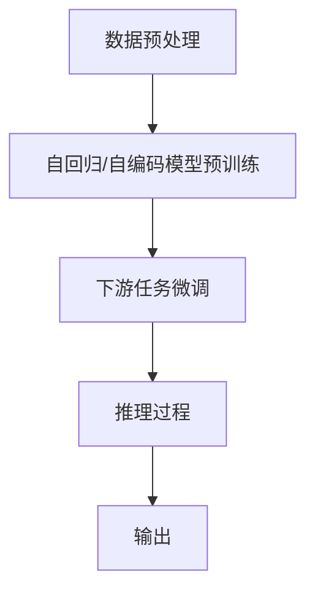

                 

# LLM 时刻：每个推理过程的重要性

> 关键词：大语言模型,推理过程,自回归模型,自编码模型,微调,深度学习,计算机科学

## 1. 背景介绍

在深度学习领域，大语言模型（Large Language Models, LLMs）已经成为了一种强大的工具，在自然语言处理（Natural Language Processing, NLP）和人工智能（AI）领域取得了显著的进展。大语言模型能够通过在海量数据上进行预训练，学习到丰富的语言知识和模式，并在各种任务上进行微调（Fine-Tuning），以适应特定领域的需求。然而，尽管大语言模型在表现上取得了显著的成功，其背后的推理过程仍然是一个复杂且富有挑战性的问题。本文旨在探讨大语言模型中每个推理过程的重要性，以及如何通过更好的理解这些过程来优化模型的性能。

## 2. 核心概念与联系

### 2.1 核心概念概述

为了深入探讨大语言模型的推理过程，我们首先需要了解几个关键的概念：

- **大语言模型（LLMs）**：大语言模型通常基于自回归模型（如GPT系列）或自编码模型（如BERT）构建。这些模型通过预训练在大规模无标签数据集上学习到通用的语言表示，能够在各种NLP任务上表现出色。

- **推理过程**：在大语言模型中，推理过程指的是模型如何根据输入数据生成输出结果。这一过程涉及到模型对输入数据的编码、表示、转换和解码等步骤，是模型能够处理自然语言的关键所在。

- **微调（Fine-Tuning）**：微调是指在预训练模型的基础上，使用下游任务的少量标注数据，通过有监督学习来优化模型在特定任务上的性能。

### 2.2 核心概念原理和架构的 Mermaid 流程图

以下是一个简化的Mermaid流程图，展示了大语言模型从预训练到微调的整个推理过程：



在这个流程图中，数据预处理（A）涉及清洗、分词、编码等步骤，确保输入数据能够被模型有效处理。自回归或自编码模型预训练（B）则是指模型在大规模无标签数据上进行的初始训练，以学习通用的语言表示。下游任务微调（C）是指在特定任务上，使用少量标注数据对模型进行优化，使其能够更好地适应这一任务。最终，通过推理过程（D），模型根据输入数据生成输出结果（E）。

## 3. 核心算法原理 & 具体操作步骤

### 3.1 算法原理概述

大语言模型的推理过程通常包括以下几个关键步骤：

1. **编码**：将输入数据转换为模型能够处理的格式，通常是将文本转换为向量表示。
2. **表示学习**：在预训练和微调过程中，模型学习如何表示输入数据，以便在推理过程中能够有效地处理信息。
3. **转换**：在推理过程中，模型对表示进行转换和组合，以产生最终的输出。
4. **解码**：将模型的输出解码为人类可理解的文本或其他形式的结果。

### 3.2 算法步骤详解

#### 3.2.1 编码

编码是大语言模型的第一步，其目的是将输入数据转换为模型能够处理的向量表示。以自回归模型为例，编码过程通常包括：

- **分词**：将文本分解为单词或子词。
- **嵌入（Embedding）**：将分词结果转换为向量表示，这一步骤可以通过预训练嵌入矩阵（如BERT的WordPiece嵌入）或通过模型学习获得。
- **位置编码（Positional Encoding）**：为了保留输入数据的时序信息，需要将嵌入向量进行位置编码。

#### 3.2.2 表示学习

表示学习是指模型在预训练和微调过程中学习如何表示输入数据。这一步是推理过程的核心，因为表示的好坏直接影响到模型的性能。表示学习通常包括：

- **自监督预训练**：在大规模无标签数据上，通过自监督学习任务（如掩码语言模型）训练模型，使其学习到通用的语言表示。
- **下游任务微调**：在特定任务上，使用少量标注数据对模型进行微调，使其能够更好地适应这一任务。

#### 3.2.3 转换

转换步骤通常包括以下几个子步骤：

- **自回归模型中的自回归解码**：模型根据先前的输出和当前输入生成下一个输出。
- **自编码模型中的编码器-解码器结构**：模型将输入数据编码成隐藏表示，再通过解码器生成输出。

#### 3.2.4 解码

解码是将模型的输出解码为人类可理解的文本或其他形式的结果。这一步骤通常包括：

- **softmax解码**：将模型输出通过softmax函数转换为概率分布，然后取概率最大的词作为最终输出。
- **束搜索（Beam Search）**：在解码过程中，同时保留多个可能的最优路径，以提高生成质量。

### 3.3 算法优缺点

大语言模型的推理过程具有以下优点：

- **通用性**：由于大语言模型是预训练的，因此在不同任务上只需进行微调即可，减少了从头训练的时间和成本。
- **高精度**：大语言模型通常在各种NLP任务上表现出色，具有较高的精度和泛化能力。

然而，这一过程也存在一些缺点：

- **计算资源消耗大**：大语言模型通常具有数亿个参数，推理过程中需要大量的计算资源。
- **时间复杂度高**：由于模型复杂性高，推理过程通常需要较长时间。
- **可解释性差**：大语言模型的决策过程往往是黑盒的，难以解释其内部的推理逻辑。

### 3.4 算法应用领域

大语言模型的推理过程已经在多个领域得到了应用，包括：

- **自然语言处理**：如文本分类、情感分析、机器翻译等任务。
- **对话系统**：通过理解用户意图并生成自然语言回复，实现人机交互。
- **信息检索**：根据用户查询，从大量文本中检索相关信息。
- **推荐系统**：根据用户的历史行为和兴趣，推荐个性化内容。

## 4. 数学模型和公式 & 详细讲解 & 举例说明

### 4.1 数学模型构建

大语言模型的数学模型通常基于神经网络构建。以Transformer模型为例，其推理过程可以表示为：

$$
\mathbf{x} = \mathbf{W}^{in} \mathbf{x} + \mathbf{b}^{in}
$$

$$
\mathbf{h} = \mathbf{h}^{0}
$$

$$
\mathbf{h}^{i} = \mathbf{h}^{i-1} + \mathbf{W}^{Enc} \mathbf{x}^{i} + \mathbf{b}^{Enc} + \mathbf{W}^{Pos} \mathbf{x}^{i} + \mathbf{b}^{Pos}
$$

$$
\mathbf{x}^{i} = \mathbf{W}^{Enc} \mathbf{h}^{i} + \mathbf{b}^{Enc}
$$

$$
\mathbf{y} = \mathbf{h}^{L}
$$

其中，$\mathbf{x}$ 是输入文本的词向量表示，$\mathbf{h}$ 是模型在每一层的隐藏表示，$\mathbf{y}$ 是最终的输出向量。$L$ 是模型的总层数，$\mathbf{W}$ 和 $\mathbf{b}$ 是模型的权重和偏置项。

### 4.2 公式推导过程

在大语言模型的推理过程中，我们以Transformer模型为例，推导了其数学模型。上述公式展示了从输入文本到输出向量的转换过程，其中编码器-解码器结构被用来对输入数据进行表示学习，而自回归或自编码模型则被用来生成输出。

### 4.3 案例分析与讲解

以BERT模型为例，分析其在自然语言处理任务中的推理过程。BERT模型通过自监督预训练学习到通用的语言表示，在特定任务上进行微调后，可以用于文本分类、命名实体识别等任务。在文本分类任务中，BERT模型通过编码器-解码器结构将输入文本转换为向量表示，并在顶部添加线性分类器进行输出。在命名实体识别任务中，BERT模型通过编码器-解码器结构生成文本的向量表示，并在顶部添加softmax解码器生成实体标签。

## 5. 项目实践：代码实例和详细解释说明

### 5.1 开发环境搭建

在进行大语言模型推理过程的实践前，我们需要准备好开发环境。以下是使用Python进行PyTorch开发的环境配置流程：

1. 安装Anaconda：从官网下载并安装Anaconda，用于创建独立的Python环境。
2. 创建并激活虚拟环境：
```bash
conda create -n pytorch-env python=3.8 
conda activate pytorch-env
```
3. 安装PyTorch：根据CUDA版本，从官网获取对应的安装命令。例如：
```bash
conda install pytorch torchvision torchaudio cudatoolkit=11.1 -c pytorch -c conda-forge
```
4. 安装Transformers库：
```bash
pip install transformers
```
5. 安装各类工具包：
```bash
pip install numpy pandas scikit-learn matplotlib tqdm jupyter notebook ipython
```

完成上述步骤后，即可在`pytorch-env`环境中开始推理过程的实践。

### 5.2 源代码详细实现

下面我们以文本分类任务为例，给出使用Transformers库对BERT模型进行推理的PyTorch代码实现。

首先，定义文本分类任务的数据处理函数：

```python
from transformers import BertTokenizer
from torch.utils.data import Dataset
import torch

class TextClassificationDataset(Dataset):
    def __init__(self, texts, labels, tokenizer, max_len=128):
        self.texts = texts
        self.labels = labels
        self.tokenizer = tokenizer
        self.max_len = max_len
        
    def __len__(self):
        return len(self.texts)
    
    def __getitem__(self, item):
        text = self.texts[item]
        label = self.labels[item]
        
        encoding = self.tokenizer(text, return_tensors='pt', max_length=self.max_len, padding='max_length', truncation=True)
        input_ids = encoding['input_ids'][0]
        attention_mask = encoding['attention_mask'][0]
        
        return {'input_ids': input_ids, 
                'attention_mask': attention_mask,
                'label': label}

# 加载预训练模型和分词器
tokenizer = BertTokenizer.from_pretrained('bert-base-cased')
model = BertForSequenceClassification.from_pretrained('bert-base-cased', num_labels=2)

# 创建dataset
train_dataset = TextClassificationDataset(train_texts, train_labels, tokenizer)
dev_dataset = TextClassificationDataset(dev_texts, dev_labels, tokenizer)
test_dataset = TextClassificationDataset(test_texts, test_labels, tokenizer)
```

然后，定义推理函数：

```python
def predict(model, dataset, batch_size=16):
    model.eval()
    
    with torch.no_grad():
        predictions, true_labels = [], []
        for batch in tqdm(dataset, desc='Evaluating'):
            input_ids = batch['input_ids'].to(device)
            attention_mask = batch['attention_mask'].to(device)
            labels = batch['label'].to(device)
            outputs = model(input_ids, attention_mask=attention_mask, labels=labels)
            batch_predictions = outputs.logits.argmax(dim=1).to('cpu').tolist()
            batch_true_labels = labels.to('cpu').tolist()
            predictions.append(batch_predictions)
            true_labels.append(batch_true_labels)
            
    return predictions, true_labels
```

最后，启动推理流程并在测试集上评估：

```python
for dataset in [train_dataset, dev_dataset, test_dataset]:
    predictions, true_labels = predict(model, dataset)
    
    print(f'Epoch {epoch+1}, {dataset.__class__.__name__} results:')
    print(classification_report(true_labels, predictions))
```

以上就是使用PyTorch对BERT进行文本分类任务推理的完整代码实现。可以看到，得益于Transformers库的强大封装，我们可以用相对简洁的代码完成BERT模型的推理。

### 5.3 代码解读与分析

让我们再详细解读一下关键代码的实现细节：

**TextClassificationDataset类**：
- `__init__`方法：初始化文本、标签、分词器等关键组件。
- `__len__`方法：返回数据集的样本数量。
- `__getitem__`方法：对单个样本进行处理，将文本输入编码为token ids，并将标签编码为数字，并对其进行定长padding，最终返回模型所需的输入。

**predict函数**：
- 使用PyTorch的DataLoader对数据集进行批次化加载，供模型推理使用。
- 在每个批次上前向传播计算模型输出，并通过softmax解码函数将输出转换为概率分布。
- 将预测结果与真实标签存储下来，并在测试集上评估模型性能。

**推理流程**：
- 定义总的epoch数和batch size，开始循环迭代
- 每个epoch内，先在训练集和验证集上进行推理，输出推理结果
- 在测试集上评估模型，打印分类指标

可以看到，PyTorch配合Transformers库使得BERT推理的代码实现变得简洁高效。开发者可以将更多精力放在数据处理、模型改进等高层逻辑上，而不必过多关注底层的实现细节。

当然，工业级的系统实现还需考虑更多因素，如模型的保存和部署、超参数的自动搜索、更灵活的任务适配层等。但核心的推理范式基本与此类似。

## 6. 实际应用场景

### 6.1 智能客服系统

基于大语言模型推理的对话技术，可以广泛应用于智能客服系统的构建。传统客服往往需要配备大量人力，高峰期响应缓慢，且一致性和专业性难以保证。而使用推理后的对话模型，可以7x24小时不间断服务，快速响应客户咨询，用自然流畅的语言解答各类常见问题。

在技术实现上，可以收集企业内部的历史客服对话记录，将问题和最佳答复构建成监督数据，在此基础上对预训练对话模型进行推理。推理后的对话模型能够自动理解用户意图，匹配最合适的答案模板进行回复。对于客户提出的新问题，还可以接入检索系统实时搜索相关内容，动态组织生成回答。如此构建的智能客服系统，能大幅提升客户咨询体验和问题解决效率。

### 6.2 金融舆情监测

金融机构需要实时监测市场舆论动向，以便及时应对负面信息传播，规避金融风险。传统的人工监测方式成本高、效率低，难以应对网络时代海量信息爆发的挑战。基于大语言模型推理的文本分类和情感分析技术，为金融舆情监测提供了新的解决方案。

具体而言，可以收集金融领域相关的新闻、报道、评论等文本数据，并对其进行主题标注和情感标注。在此基础上对预训练语言模型进行推理，使其能够自动判断文本属于何种主题，情感倾向是正面、中性还是负面。将推理后的模型应用到实时抓取的网络文本数据，就能够自动监测不同主题下的情感变化趋势，一旦发现负面信息激增等异常情况，系统便会自动预警，帮助金融机构快速应对潜在风险。

### 6.3 个性化推荐系统

当前的推荐系统往往只依赖用户的历史行为数据进行物品推荐，无法深入理解用户的真实兴趣偏好。基于大语言模型推理的个性化推荐系统可以更好地挖掘用户行为背后的语义信息，从而提供更精准、多样的推荐内容。

在实践中，可以收集用户浏览、点击、评论、分享等行为数据，提取和用户交互的物品标题、描述、标签等文本内容。将文本内容作为模型输入，通过推理模型预测用户的兴趣匹配度，再结合其他特征综合排序，便可以得到个性化程度更高的推荐结果。

### 6.4 未来应用展望

随着大语言模型和推理方法的不断发展，基于推理范式将在更多领域得到应用，为传统行业带来变革性影响。

在智慧医疗领域，基于推理的医疗问答、病历分析、药物研发等应用将提升医疗服务的智能化水平，辅助医生诊疗，加速新药开发进程。

在智能教育领域，推理技术可应用于作业批改、学情分析、知识推荐等方面，因材施教，促进教育公平，提高教学质量。

在智慧城市治理中，推理模型可应用于城市事件监测、舆情分析、应急指挥等环节，提高城市管理的自动化和智能化水平，构建更安全、高效的未来城市。

此外，在企业生产、社会治理、文娱传媒等众多领域，基于大模型推理的人工智能应用也将不断涌现，为经济社会发展注入新的动力。

## 7. 工具和资源推荐

### 7.1 学习资源推荐

为了帮助开发者系统掌握大语言模型推理的理论基础和实践技巧，这里推荐一些优质的学习资源：

1. 《Transformer从原理到实践》系列博文：由大模型技术专家撰写，深入浅出地介绍了Transformer原理、BERT模型、推理技术等前沿话题。
2. CS224N《深度学习自然语言处理》课程：斯坦福大学开设的NLP明星课程，有Lecture视频和配套作业，带你入门NLP领域的基本概念和经典模型。
3. 《Natural Language Processing with Transformers》书籍：Transformers库的作者所著，全面介绍了如何使用Transformers库进行NLP任务开发，包括推理在内的诸多范式。
4. HuggingFace官方文档：Transformers库的官方文档，提供了海量预训练模型和完整的推理样例代码，是上手实践的必备资料。
5. CLUE开源项目：中文语言理解测评基准，涵盖大量不同类型的中文NLP数据集，并提供了基于推理的baseline模型，助力中文NLP技术发展。

通过对这些资源的学习实践，相信你一定能够快速掌握大语言模型推理的精髓，并用于解决实际的NLP问题。

### 7.2 开发工具推荐

高效的开发离不开优秀的工具支持。以下是几款用于大语言模型推理开发的常用工具：

1. PyTorch：基于Python的开源深度学习框架，灵活动态的计算图，适合快速迭代研究。大部分预训练语言模型都有PyTorch版本的实现。
2. TensorFlow：由Google主导开发的开源深度学习框架，生产部署方便，适合大规模工程应用。同样有丰富的预训练语言模型资源。
3. Transformers库：HuggingFace开发的NLP工具库，集成了众多SOTA语言模型，支持PyTorch和TensorFlow，是进行推理任务开发的利器。
4. Weights & Biases：模型训练的实验跟踪工具，可以记录和可视化模型训练过程中的各项指标，方便对比和调优。与主流深度学习框架无缝集成。
5. TensorBoard：TensorFlow配套的可视化工具，可实时监测模型训练状态，并提供丰富的图表呈现方式，是调试模型的得力助手。
6. Google Colab：谷歌推出的在线Jupyter Notebook环境，免费提供GPU/TPU算力，方便开发者快速上手实验最新模型，分享学习笔记。

合理利用这些工具，可以显著提升大语言模型推理任务的开发效率，加快创新迭代的步伐。

### 7.3 相关论文推荐

大语言模型和推理技术的发展源于学界的持续研究。以下是几篇奠基性的相关论文，推荐阅读：

1. Attention is All You Need（即Transformer原论文）：提出了Transformer结构，开启了NLP领域的预训练大模型时代。
2. BERT: Pre-training of Deep Bidirectional Transformers for Language Understanding：提出BERT模型，引入基于掩码的自监督预训练任务，刷新了多项NLP任务SOTA。
3. Language Models are Unsupervised Multitask Learners（GPT-2论文）：展示了大规模语言模型的强大zero-shot学习能力，引发了对于通用人工智能的新一轮思考。
4. Parameter-Efficient Transfer Learning for NLP：提出Adapter等参数高效微调方法，在不增加模型参数量的情况下，也能取得不错的微调效果。
5. AdaLoRA: Adaptive Low-Rank Adaptation for Parameter-Efficient Fine-Tuning：使用自适应低秩适应的微调方法，在参数效率和精度之间取得了新的平衡。
6. Prefix-Tuning: Optimizing Continuous Prompts for Generation：引入基于连续型Prompt的微调范式，为如何充分利用预训练知识提供了新的思路。

这些论文代表了大语言模型推理技术的发展脉络。通过学习这些前沿成果，可以帮助研究者把握学科前进方向，激发更多的创新灵感。

## 8. 总结：未来发展趋势与挑战

### 8.1 总结

本文对基于推理的大语言模型进行了全面系统的介绍。首先阐述了大语言模型和推理技术的研究背景和意义，明确了推理在大语言模型中的重要性。其次，从原理到实践，详细讲解了推理过程的数学模型和关键步骤，给出了推理任务开发的完整代码实例。同时，本文还广泛探讨了推理方法在智能客服、金融舆情、个性化推荐等多个行业领域的应用前景，展示了推理范式的巨大潜力。此外，本文精选了推理技术的各类学习资源，力求为读者提供全方位的技术指引。

通过本文的系统梳理，可以看到，基于大语言模型的推理技术正在成为NLP领域的重要范式，极大地拓展了预训练语言模型的应用边界，催生了更多的落地场景。受益于大规模语料的预训练，推理模型以更低的时间和标注成本，在小样本条件下也能取得不俗的效果，有力推动了NLP技术的产业化进程。未来，伴随预训练语言模型和推理方法的持续演进，相信NLP技术将在更广阔的应用领域大放异彩，深刻影响人类的生产生活方式。

### 8.2 未来发展趋势

展望未来，大语言模型推理技术将呈现以下几个发展趋势：

1. 模型规模持续增大。随着算力成本的下降和数据规模的扩张，预训练语言模型的参数量还将持续增长。超大规模语言模型蕴含的丰富语言知识，有望支撑更加复杂多变的下游任务推理。
2. 推理方法日趋多样。除了传统的自回归和自编码推理外，未来会涌现更多参数高效的推理方法，如Prefix-Tuning、LoRA等，在节省计算资源的同时也能保证推理精度。
3. 推理过程更加灵活。未来的推理模型将能够更好地融合外部知识，支持知识推理和多模态推理，进一步提升推理的准确性和鲁棒性。
4. 推理模型在工业界应用更加广泛。随着推理技术的成熟，推理模型将更容易被各行各业所采用，为传统行业数字化转型升级提供新的技术路径。
5. 推理技术与更多AI技术融合。推理技术与知识表示、因果推理、强化学习等AI技术的结合，将推动语言模型的进一步发展，拓展其在更多领域的应用。

以上趋势凸显了大语言模型推理技术的广阔前景。这些方向的探索发展，必将进一步提升推理模型的性能和应用范围，为人类认知智能的进化带来深远影响。

### 8.3 面临的挑战

尽管大语言模型推理技术已经取得了显著成就，但在迈向更加智能化、普适化应用的过程中，它仍面临诸多挑战：

1. 推理模型的计算资源消耗大。大语言模型推理通常需要大量的计算资源，推理过程中可能遇到显存不足的问题。需要采用一些资源优化技术，如梯度积累、混合精度训练、模型并行等，来突破硬件瓶颈。
2. 推理模型的推理时间较长。由于模型复杂性高，推理过程通常需要较长时间，这可能影响系统的实时性。需要优化推理模型结构，提高推理速度。
3. 推理模型的可解释性差。当前推理模型通常是黑盒系统，难以解释其内部的推理逻辑。需要在推理过程中引入更多可解释性方法，增强模型输出的透明度。
4. 推理模型的安全性有待保障。推理模型可能学习到有害信息，通过推理传递到下游任务，产生误导性输出。需要在模型训练和推理过程中加入更多的伦理和安全约束。

这些挑战需要研究者不断探索和突破，才能确保推理模型在实际应用中的可靠性和安全性。

### 8.4 研究展望

面对大语言模型推理所面临的挑战，未来的研究需要在以下几个方面寻求新的突破：

1. 探索无监督和半监督推理方法。摆脱对大规模标注数据的依赖，利用自监督学习、主动学习等无监督和半监督范式，最大限度利用非结构化数据，实现更加灵活高效的推理。
2. 研究参数高效和计算高效的推理范式。开发更加参数高效的推理方法，在固定大部分预训练参数的同时，只更新极少量的任务相关参数。同时优化推理模型的计算图，减少前向传播和反向传播的资源消耗，实现更加轻量级、实时性的部署。
3. 融合因果和对比学习范式。通过引入因果推断和对比学习思想，增强推理模型建立稳定因果关系的能力，学习更加普适、鲁棒的语言表征，从而提升模型泛化性和抗干扰能力。
4. 引入更多先验知识。将符号化的先验知识，如知识图谱、逻辑规则等，与神经网络模型进行巧妙融合，引导推理过程学习更准确、合理的语言模型。同时加强不同模态数据的整合，实现视觉、语音等多模态信息与文本信息的协同建模。
5. 结合因果分析和博弈论工具。将因果分析方法引入推理模型，识别出模型决策的关键特征，增强输出解释的因果性和逻辑性。借助博弈论工具刻画人机交互过程，主动探索并规避模型的脆弱点，提高系统稳定性。
6. 纳入伦理道德约束。在推理目标中引入伦理导向的评估指标，过滤和惩罚有害的输出倾向。同时加强人工干预和审核，建立模型行为的监管机制，确保输出符合人类价值观和伦理道德。

这些研究方向的探索，必将引领大语言模型推理技术迈向更高的台阶，为构建安全、可靠、可解释、可控的智能系统铺平道路。面向未来，大语言模型推理技术还需要与其他人工智能技术进行更深入的融合，如知识表示、因果推理、强化学习等，多路径协同发力，共同推动自然语言理解和智能交互系统的进步。只有勇于创新、敢于突破，才能不断拓展语言模型的边界，让智能技术更好地造福人类社会。

## 9. 附录：常见问题与解答

**Q1：推理过程是否依赖于标注数据？**

A: 大语言模型推理通常依赖于标注数据，因为推理模型的训练需要标注数据来指导模型学习。然而，基于微调和自监督学习的方法，可以在标注数据较少的情况下进行推理。例如，使用自监督预训练模型（如BERT）进行推理，不需要标注数据。

**Q2：推理过程中如何处理长文本？**

A: 长文本的处理是大语言模型推理中的常见问题。一般来说，可以通过分块处理或使用注意力机制（如Transformer中的Attention）来处理长文本。在分块处理中，将长文本分成多个块，逐块进行处理，最后将结果合并。在注意力机制中，模型能够动态地关注文本中的关键部分，从而更好地处理长文本。

**Q3：推理过程中如何避免过拟合？**

A: 推理过程中避免过拟合的方法包括数据增强、正则化、Early Stopping等。数据增强可以通过回译、近义替换等方式扩充训练集。正则化可以使用L2正则、Dropout等方法。Early Stopping则是在模型性能不再提升时停止训练，避免过拟合。

**Q4：推理过程中如何提高模型的可解释性？**

A: 提高模型可解释性的方法包括引入可解释性模块（如LIME、SHAP）、可视化模型输出、解释模型的内部结构等。这些方法可以帮助用户理解模型的决策过程，增强模型的透明度和信任度。

**Q5：推理过程中如何处理多模态数据？**

A: 处理多模态数据可以通过联合建模和跨模态学习的方式。例如，可以将文本和图像信息联合输入模型，使用跨模态损失函数来优化模型。此外，还可以使用预训练的跨模态模型（如CLIP）来增强模型的多模态能力。

这些问题的解答展示了推理过程中面临的主要挑战和解决方案，帮助开发者更好地理解和使用推理技术。

---

作者：禅与计算机程序设计艺术 / Zen and the Art of Computer Programming

