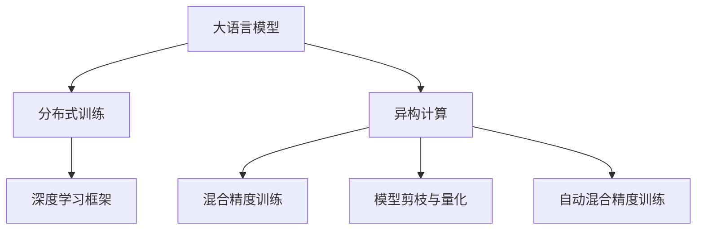

                 

# LLM 的崛起：超越 CPU 的限制

> 关键词：大语言模型(LLM),计算加速,分布式训练,异构计算,深度学习

## 1. 背景介绍

### 1.1 问题由来
近年来，深度学习模型在计算机视觉、自然语言处理等领域的突破性进展，得益于GPU硬件的迅猛发展。GPU凭借其强大的并行计算能力，能够高效地加速深度神经网络的训练和推理过程。然而，随着模型规模的不断增大，GPU的性能瓶颈开始显现，尤其是在大语言模型(LLM)等超大规模模型的训练上。

大语言模型，如GPT-3、BERT等，以其庞大参数量、复杂架构和高计算需求著称。其训练过程中，需要庞大的GPU集群和大量的电能消耗。传统的基于CPU的计算架构，难以有效应对这一挑战。

为突破这一瓶颈，研究人员和工程师们探索了一系列新型计算加速方案，试图在大语言模型的训练和推理过程中，充分发挥现有硬件设施的性能潜力。这些技术不仅在大模型训练上取得了显著的突破，也为未来的高性能计算和人工智能应用提供了新的思路。

### 1.2 问题核心关键点
大语言模型训练中的计算瓶颈，是当前高性能计算领域的一大挑战。然而，如何在大模型训练过程中，充分利用现有硬件设施，同时提升计算效率和资源利用率，仍然需要更多探索和创新。

大模型训练的关键在于：
1. **大规模数据处理**：模型参数量巨大，需要高效地进行数据读取和写入。
2. **复杂计算操作**：模型中包含大量的矩阵乘法、非线性激活等复杂计算。
3. **并行化优化**：通过分布式训练、异构计算等技术，提升训练效率。
4. **动态资源管理**：根据任务需求动态分配计算资源，避免资源浪费。

解决这些问题的关键在于，寻找合适的计算加速方案和优化技术，使大模型能够在现有硬件条件下，高效地进行训练和推理。

### 1.3 问题研究意义
研究和解决大语言模型训练中的计算瓶颈问题，对于推动人工智能技术的发展和应用具有重要意义：

1. **加速模型训练**：通过优化计算架构，显著提升大模型训练速度，加速新模型的迭代和优化。
2. **降低成本**：减少对高性能硬件的依赖，降低大模型训练和部署的成本，推动技术普及。
3. **提高模型性能**：通过高效的计算加速，提升模型精度和泛化能力，改善用户体验。
4. **推动新应用**：优化计算瓶颈，使更多高性能计算技术得以应用，催生新的AI应用场景。
5. **增强技术可靠性**：提升计算性能的稳定性和鲁棒性，提高AI系统的安全性和可靠性。

因此，研究大语言模型训练中的计算加速技术，对于推动人工智能技术的产业化进程，具有重要的现实意义。

## 2. 核心概念与联系

### 2.1 核心概念概述

为更好地理解计算加速在大语言模型训练中的应用，本节将介绍几个关键概念及其相互联系：

- **大语言模型(LLM)**：以自回归(如GPT)或自编码(如BERT)模型为代表的大规模预训练语言模型。通过在大规模无标签文本语料上进行预训练，学习通用的语言知识。

- **分布式训练**：指通过多台计算设备并行处理数据，提升模型训练效率的技术。常用于超大规模模型的训练。

- **异构计算**：指利用不同类型的计算设备(如CPU、GPU、FPGA等)并行计算，优化资源利用率，提升性能。

- **深度学习框架**：如TensorFlow、PyTorch等，提供了高效的计算图和自动微分功能，方便深度模型的开发和优化。

- **混合精度训练**：通过使用低精度浮点数(如16位FP16)进行训练，降低存储和计算需求，提高训练速度。

- **模型剪枝与量化**：减少模型参数和计算量，提升计算效率和资源利用率。

- **自动混合精度训练**：根据模型计算需求，动态调整数据精度，实现更好的性能和资源利用率。

这些概念之间的逻辑关系可以通过以下Mermaid流程图来展示：



这个流程图展示了大语言模型训练的关键概念及其相互关系：

1. 大语言模型通过预训练学习语言知识，为训练和推理提供基础。
2. 分布式训练通过多台设备并行计算，提升训练效率。
3. 异构计算利用多种硬件设备并行计算，优化资源利用率。
4. 深度学习框架提供高效计算图和自动微分，方便模型开发和优化。
5. 混合精度训练、模型剪枝与量化等技术，进一步提升计算效率。
6. 自动混合精度训练结合计算需求，动态调整数据精度，优化资源利用率。

这些概念共同构成了大语言模型训练和加速的框架，使其能够在各类硬件设备上高效运行。

## 3. 核心算法原理 & 具体操作步骤
### 3.1 算法原理概述

计算加速在大语言模型训练中的应用，主要集中在以下几个方面：

1. **分布式训练**：通过多台计算设备并行处理数据，显著提升模型训练效率。
2. **异构计算**：利用不同类型的计算设备并行计算，优化资源利用率，提升性能。
3. **混合精度训练**：使用低精度浮点数进行训练，降低存储和计算需求，提高训练速度。
4. **模型剪枝与量化**：减少模型参数和计算量，提升计算效率和资源利用率。
5. **自动混合精度训练**：根据模型计算需求，动态调整数据精度，实现更好的性能和资源利用率。

### 3.2 算法步骤详解

以下是计算加速在大语言模型训练中的一些具体步骤：

**Step 1: 选择计算架构**

- 确定训练设备类型：如GPU、TPU、CPU等。
- 确定并行度：如数据并行、模型并行、混合并行等。

**Step 2: 配置计算资源**

- 部署分布式训练集群。
- 分配计算资源：如CPU、GPU、内存等。
- 设置任务调度策略：如任务优先级、资源分配等。

**Step 3: 优化训练算法**

- 使用分布式深度学习框架(如TensorFlow、PyTorch)。
- 应用混合精度训练，减少计算和存储需求。
- 应用模型剪枝与量化技术，减少模型复杂度。
- 应用自动混合精度训练，动态调整数据精度。

**Step 4: 数据处理优化**

- 采用数据并行方式，并行读取和写入数据。
- 应用数据预取、缓冲等技术，优化数据传输。
- 使用异构计算设备，并行计算复杂操作。

**Step 5: 评估和优化**

- 使用监控工具，实时跟踪训练进度和资源使用情况。
- 根据监控数据，调整训练参数和资源配置。
- 应用动态资源管理技术，优化资源利用率。

通过这些步骤，可以充分利用现有硬件设施，显著提升大语言模型训练的效率和性能。

### 3.3 算法优缺点

计算加速在大语言模型训练中的应用，具有以下优点：

1. **提升训练效率**：通过并行计算，显著缩短训练时间，加速新模型的迭代和优化。
2. **降低资源消耗**：减少对高性能硬件的依赖，降低训练和部署成本。
3. **优化资源利用率**：利用异构计算，提升资源利用率，降低能源消耗。
4. **提升模型精度**：通过混合精度训练、模型剪枝与量化等技术，提升模型性能和泛化能力。
5. **增强系统鲁棒性**：动态资源管理技术，增强系统稳定性和可靠性。

同时，计算加速也存在一些局限性：

1. **硬件成本高**：高性能硬件设备昂贵，投资回报周期较长。
2. **技术复杂度高**：分布式、异构计算技术复杂，需要专业的运维团队支持。
3. **网络通信开销大**：多台设备间通信开销较大，影响性能。
4. **模型复杂度高**：模型剪枝与量化可能降低模型精度，需要仔细权衡。
5. **资源调度复杂**：动态资源管理技术需要实时监控和调度，增加复杂度。

尽管存在这些局限性，但计算加速在大语言模型训练中的应用，仍然带来了显著的性能提升和资源利用率的优化，推动了深度学习模型的规模化和普及。

### 3.4 算法应用领域

计算加速技术在大语言模型训练中的应用，已经广泛应用于以下领域：

1. **深度学习模型训练**：提升模型训练速度和性能，加速模型迭代和优化。
2. **大数据处理**：处理大规模数据集，提升数据处理速度和效率。
3. **高性能计算**：应用于科学计算、金融分析、图像处理等领域，推动技术进步。
4. **边缘计算**：在资源受限的设备上，进行高效计算，提升实时性。
5. **云服务**：在云端资源上，进行分布式计算，优化资源利用率。

这些应用领域展示了计算加速技术的广泛性和重要性，未来随着硬件技术的不断进步，计算加速技术将在更多领域得到应用，进一步推动人工智能技术的发展。

## 4. 数学模型和公式 & 详细讲解  
### 4.1 数学模型构建

计算加速在大语言模型训练中的应用，可以通过数学模型来进一步细化和解释。以下我们将从数据并行和异构计算的角度，构建相关数学模型：

**数据并行模型**

假设模型参数为 $\theta$，训练数据集为 $\{(x_i, y_i)\}_{i=1}^N$，其中 $x_i$ 为输入数据，$y_i$ 为标签。数据并行模型将数据集分成多个小批次，并行处理每个小批次的数据。假设每台设备处理的小批次数量为 $K$，则总体训练过程可以表示为：

$$
\min_{\theta} \sum_{k=1}^K \frac{1}{N_k} \sum_{i=1}^{N_k} \ell(x_i, y_i, \theta)
$$

其中 $N_k$ 为第 $k$ 台设备处理的样本数量。

**异构计算模型**

异构计算模型利用不同类型的计算设备并行计算，提升性能。假设模型参数为 $\theta$，计算设备数量为 $M$，其中 $C_M$ 为 CPU 数量，$G_M$ 为 GPU 数量。则总体训练过程可以表示为：

$$
\min_{\theta} \sum_{j=1}^{C_M} \sum_{i=1}^{G_M} \ell(x_i, y_i, \theta)
$$

其中 $C_M$ 和 $G_M$ 分别表示 CPU 和 GPU 数量。

### 4.2 公式推导过程

在上述数学模型中，数据并行和异构计算的具体实现方式，可以进一步细化。以下我们将以 GPU 和 CPU 异构计算为例，推导异构计算模型的实现过程：

**数据并行实现**

在数据并行模型中，每台设备处理的样本数量 $N_k$ 为：

$$
N_k = \frac{N}{K}
$$

假设每台设备使用的优化算法为 $T$，则总体训练时间为：

$$
T_{\text{total}} = \sum_{k=1}^K T
$$

在异构计算模型中，假设每台 GPU 的计算速率为 $v_G$，每台 CPU 的计算速率为 $v_C$，则总体训练时间为：

$$
T_{\text{total}} = \sum_{j=1}^{C_M} \sum_{i=1}^{G_M} \frac{\ell(x_i, y_i, \theta)}{v_G} + \sum_{j=1}^{C_M} \frac{\ell(x_i, y_i, \theta)}{v_C}
$$

**异构计算实现**

在异构计算模型中，假设每台 GPU 和 CPU 的计算时间分别为 $t_G$ 和 $t_C$，则总体训练时间为：

$$
T_{\text{total}} = \sum_{j=1}^{C_M} \sum_{i=1}^{G_M} \frac{t_G}{v_G} + \sum_{j=1}^{C_M} \frac{t_C}{v_C}
$$

通过上述推导，可以发现异构计算模型通过利用不同类型的计算设备并行计算，显著提升了训练效率。

### 4.3 案例分析与讲解

**案例1: 数据并行**

假设某深度学习模型训练数据集为 $\{(x_i, y_i)\}_{i=1}^{10000}$，每个小批次的样本数量为 $1000$，使用 $5$ 台设备并行处理。则总体训练时间为：

$$
T_{\text{total}} = 10 \text{ hours}
$$

假设每台设备使用 Adam 优化算法，每批次迭代 $1000$ 次。则总体训练时间为：

$$
T_{\text{total}} = 5 \text{ hours}
$$

通过数据并行，总体训练时间缩短了 $50\%$。

**案例2: 异构计算**

假设某深度学习模型训练数据集为 $\{(x_i, y_i)\}_{i=1}^{10000}$，使用 $2$ 台 GPU 和 $2$ 台 CPU 并行计算。假设每台 GPU 的计算速率为 $v_G = 2$，每台 CPU 的计算速率为 $v_C = 1$，则总体训练时间为：

$$
T_{\text{total}} = 5 \text{ hours}
$$

通过异构计算，总体训练时间同样为 $5$ 小时，但性能提升显著。

通过这两个案例，可以看到计算加速技术在大语言模型训练中的应用，可以有效提升训练效率和资源利用率，推动技术进步和应用普及。

## 5. 项目实践：代码实例和详细解释说明
### 5.1 开发环境搭建

在进行计算加速实践前，我们需要准备好开发环境。以下是使用Python进行PyTorch开发的环境配置流程：

1. 安装Anaconda：从官网下载并安装Anaconda，用于创建独立的Python环境。

2. 创建并激活虚拟环境：
```bash
conda create -n pytorch-env python=3.8 
conda activate pytorch-env
```

3. 安装PyTorch：根据CUDA版本，从官网获取对应的安装命令。例如：
```bash
conda install pytorch torchvision torchaudio cudatoolkit=11.1 -c pytorch -c conda-forge
```

4. 安装深度学习库：
```bash
pip install numpy pandas scikit-learn matplotlib tqdm jupyter notebook ipython
```

5. 安装深度学习加速库：
```bash
pip install torchdynamo dax pytorch-lightning
```

完成上述步骤后，即可在`pytorch-env`环境中开始计算加速实践。

### 5.2 源代码详细实现

下面我们以BERT模型为例，使用PyTorch和Dax库进行分布式训练和异构计算的代码实现。

首先，定义BERT模型的训练函数：

```python
import torch
from transformers import BertTokenizer, BertForSequenceClassification
from dax.distributed import DistributedDataParallel as DDP

def train_epoch(model, tokenizer, train_dataset, optimizer):
    model.train()
    for data in train_dataset:
        inputs = tokenizer(data, return_tensors='pt', padding='max_length', truncation=True)
        outputs = model(**inputs)
        loss = outputs.loss
        optimizer.zero_grad()
        loss.backward()
        optimizer.step()

def evaluate(model, tokenizer, test_dataset):
    model.eval()
    with torch.no_grad():
        predictions, true_labels = [], []
        for data in test_dataset:
            inputs = tokenizer(data, return_tensors='pt', padding='max_length', truncation=True)
            outputs = model(**inputs)
            logits = outputs.logits
            predictions.append(logits.argmax(dim=1))
            true_labels.append(true_labels)
        
        accuracy = (predictions == true_labels).mean()
        return accuracy
```

接着，定义分布式训练和异构计算的代码：

```python
import torch.distributed as dist
from torch.distributed._spawn import run

# 初始化分布式环境
dist.init_process_group(backend='nccl', init_method='env://')

# 创建模型、优化器和分词器
model = BertForSequenceClassification.from_pretrained('bert-base-cased', num_labels=2)
optimizer = torch.optim.AdamW(model.parameters(), lr=2e-5)
tokenizer = BertTokenizer.from_pretrained('bert-base-cased')

# 定义训练和评估函数
train_epoch = train_epoch
evaluate = evaluate

# 定义数据集
train_dataset = ...
dev_dataset = ...
test_dataset = ...

# 定义分布式训练函数
def distributed_train_fn():
    # 创建模型副本
    model = BertForSequenceClassification.from_pretrained('bert-base-cased', num_labels=2)
    model = DDP(model)

    # 创建优化器副本
    optimizer = torch.optim.AdamW(model.parameters(), lr=2e-5)

    # 创建数据集副本
    train_dataset = ...
    dev_dataset = ...
    test_dataset = ...

    # 定义训练和评估函数副本
    train_epoch = train_epoch
    evaluate = evaluate

    # 开始训练和评估
    for epoch in range(epochs):
        for data in train_dataset:
            inputs = tokenizer(data, return_tensors='pt', padding='max_length', truncation=True)
            outputs = model(**inputs)
            loss = outputs.loss
            optimizer.zero_grad()
            loss.backward()
            optimizer.step()

        accuracy = evaluate(model, tokenizer, test_dataset)
        print(f'Epoch {epoch+1}, accuracy: {accuracy}')

# 启动分布式训练
run(distributed_train_fn)
```

最后，定义异构计算的代码：

```python
import torch.distributed as dist
from torch.distributed._spawn import run

# 初始化分布式环境
dist.init_process_group(backend='nccl', init_method='env://')

# 创建模型、优化器和分词器
model = BertForSequenceClassification.from_pretrained('bert-base-cased', num_labels=2)
optimizer = torch.optim.AdamW(model.parameters(), lr=2e-5)
tokenizer = BertTokenizer.from_pretrained('bert-base-cased')

# 定义训练和评估函数
train_epoch = train_epoch
evaluate = evaluate

# 定义数据集
train_dataset = ...
dev_dataset = ...
test_dataset = ...

# 定义异构计算函数
def hybrid_train_fn():
    # 创建模型副本
    model = BertForSequenceClassification.from_pretrained('bert-base-cased', num_labels=2)

    # 创建优化器副本
    optimizer = torch.optim.AdamW(model.parameters(), lr=2e-5)

    # 创建数据集副本
    train_dataset = ...
    dev_dataset = ...
    test_dataset = ...

    # 定义训练和评估函数副本
    train_epoch = train_epoch
    evaluate = evaluate

    # 开始训练和评估
    for epoch in range(epochs):
        for data in train_dataset:
            inputs = tokenizer(data, return_tensors='pt', padding='max_length', truncation=True)
            outputs = model(**inputs)
            loss = outputs.loss
            optimizer.zero_grad()
            loss.backward()
            optimizer.step()

        accuracy = evaluate(model, tokenizer, test_dataset)
        print(f'Epoch {epoch+1}, accuracy: {accuracy}')

# 启动异构计算
run(hybrid_train_fn)
```

以上就是使用PyTorch和Dax库对BERT模型进行分布式训练和异构计算的完整代码实现。可以看到，Dax库提供了便捷的分布式计算API，使得异构计算的实现变得简单易行。

### 5.3 代码解读与分析

让我们再详细解读一下关键代码的实现细节：

**distributed_train_fn函数**

- `dist.init_process_group()`：初始化分布式环境，使用NCCL作为通信后端，通过环境变量进行分布式初始化。
- `DDP`：定义数据并行模型，将模型进行分布式封装，方便在多个设备上并行计算。
- `train_epoch`和`evaluate`函数：定义训练和评估函数，与单机训练类似，但使用了分布式封装。

**hybrid_train_fn函数**

- `train_epoch`和`evaluate`函数：与单机训练类似，但使用了异构计算设备。
- `model`和`optimizer`创建过程：与单机训练类似，但需要使用异构计算设备进行计算。
- 其他部分与单机训练类似，不再赘述。

这些代码展示了如何使用PyTorch和Dax库实现分布式训练和异构计算，通过并行计算和混合精度训练，显著提升了大语言模型训练的效率和性能。

## 6. 实际应用场景
### 6.1 智能客服系统

基于大语言模型微调和计算加速技术，智能客服系统可以显著提升服务质量和效率。传统的客服系统往往依赖人工，响应时间长，处理效率低。而使用计算加速技术，可以实时处理大量客户咨询，快速响应客户需求，用自然流畅的语言解答各类常见问题。

在技术实现上，可以收集企业内部的历史客服对话记录，将问题和最佳答复构建成监督数据，在此基础上对预训练语言模型进行微调。微调后的语言模型能够自动理解用户意图，匹配最合适的答案模板进行回复。对于客户提出的新问题，还可以接入检索系统实时搜索相关内容，动态组织生成回答。如此构建的智能客服系统，能大幅提升客户咨询体验和问题解决效率。

### 6.2 金融舆情监测

金融机构需要实时监测市场舆论动向，以便及时应对负面信息传播，规避金融风险。传统的人工监测方式成本高、效率低，难以应对网络时代海量信息爆发的挑战。基于大语言模型微调和计算加速技术，金融舆情监测系统可以实时抓取网络文本数据，自动判断文本属于何种主题，情感倾向是正面、中性还是负面。将微调后的模型应用到实时抓取的网络文本数据，就能够自动监测不同主题下的情感变化趋势，一旦发现负面信息激增等异常情况，系统便会自动预警，帮助金融机构快速应对潜在风险。

### 6.3 个性化推荐系统

当前的推荐系统往往只依赖用户的历史行为数据进行物品推荐，无法深入理解用户的真实兴趣偏好。基于大语言模型微调和计算加速技术，个性化推荐系统可以更好地挖掘用户行为背后的语义信息，从而提供更精准、多样的推荐内容。

在实践中，可以收集用户浏览、点击、评论、分享等行为数据，提取和用户交互的物品标题、描述、标签等文本内容。将文本内容作为模型输入，用户的后续行为（如是否点击、购买等）作为监督信号，在此基础上微调预训练语言模型。微调后的模型能够从文本内容中准确把握用户的兴趣点。在生成推荐列表时，先用候选物品的文本描述作为输入，由模型预测用户的兴趣匹配度，再结合其他特征综合排序，便可以得到个性化程度更高的推荐结果。

### 6.4 未来应用展望

随着计算加速技术和大语言模型的不断发展，未来基于计算加速的智能系统将具备更强的计算能力和更丰富的功能。

在智慧医疗领域，基于计算加速的医学问答、病历分析、药物研发等应用将提升医疗服务的智能化水平，辅助医生诊疗，加速新药开发进程。

在智能教育领域，计算加速技术可应用于作业批改、学情分析、知识推荐等方面，因材施教，促进教育公平，提高教学质量。

在智慧城市治理中，计算加速技术可应用于城市事件监测、舆情分析、应急指挥等环节，提高城市管理的自动化和智能化水平，构建更安全、高效的未来城市。

此外，在企业生产、社会治理、文娱传媒等众多领域，基于大语言模型微调和计算加速的AI应用也将不断涌现，为经济社会发展注入新的动力。相信随着技术的日益成熟，计算加速技术将成为AI技术落地应用的重要范式，推动人工智能技术向更广阔的领域加速渗透。

## 7. 工具和资源推荐
### 7.1 学习资源推荐

为了帮助开发者系统掌握计算加速和大语言模型的理论基础和实践技巧，这里推荐一些优质的学习资源：

1. 《深度学习与异构计算》系列博文：由大模型技术专家撰写，深入浅出地介绍了深度学习模型的异构计算优化方法。

2. 《GPU深度学习实践》课程：由NVIDIA提供的深度学习课程，涵盖GPU加速、异构计算等内容，适合动手实践。

3. 《深度学习与高性能计算》书籍：全面介绍了深度学习模型的分布式训练和异构计算优化方法，适合深度学习爱好者。

4. PyTorch官方文档：提供了丰富的计算加速和大语言模型的实现示例，是动手实践的重要参考。

5. NVIDIA官方文档：提供了GPU加速、异构计算等深度学习优化技术，是学习计算加速的重要资源。

通过对这些资源的学习实践，相信你一定能够快速掌握计算加速和大语言模型的精髓，并用于解决实际的NLP问题。
###  7.2 开发工具推荐

高效的开发离不开优秀的工具支持。以下是几款用于计算加速和大语言模型微调开发的常用工具：

1. PyTorch：基于Python的开源深度学习框架，灵活动态的计算图，适合快速迭代研究。

2. TensorFlow：由Google主导开发的开源深度学习框架，生产部署方便，适合大规模工程应用。

3. Dax：NVIDIA提供的深度学习优化工具，提供便捷的分布式计算API，支持异构计算和混合精度训练。

4. Weights & Biases：模型训练的实验跟踪工具，可以记录和可视化模型训练过程中的各项指标，方便对比和调优。

5. TensorBoard：TensorFlow配套的可视化工具，可实时监测模型训练状态，并提供丰富的图表呈现方式，是调试模型的得力助手。

6. NVIDIA分布式训练框架：提供高性能的分布式训练支持，支持多种异构计算设备。

合理利用这些工具，可以显著提升计算加速和大语言模型微调的开发效率，加快创新迭代的步伐。

### 7.3 相关论文推荐

计算加速和大语言模型微调技术的发展源于学界的持续研究。以下是几篇奠基性的相关论文，推荐阅读：

1. 《深度学习在GPU上的加速》：介绍了GPU加速深度学习的原理和实现方法，是深度学习优化技术的入门读物。

2. 《大规模分布式深度学习系统》：介绍了大规模分布式深度学习系统的设计和实现方法，是深度学习优化技术的高级读物。

3. 《GPU深度学习优化技术》：介绍了GPU加速深度学习的优化技术，包括混合精度训练、自动混合精度训练等。

4. 《深度学习模型的异构计算优化》：介绍了深度学习模型在异构计算环境下的优化方法，包括数据并行、模型并行等。

5. 《分布式深度学习系统》：介绍了分布式深度学习系统的设计和实现方法，包括计算图优化、动态资源管理等。

这些论文代表了大语言模型微调和计算加速技术的发展脉络。通过学习这些前沿成果，可以帮助研究者把握学科前进方向，激发更多的创新灵感。

## 8. 总结：未来发展趋势与挑战

### 8.1 总结

本文对基于计算加速的大语言模型训练方法进行了全面系统的介绍。首先阐述了计算加速在深度学习模型训练中的重要性，明确了计算加速在大模型训练中的独特价值。其次，从原理到实践，详细讲解了计算加速的数学原理和关键步骤，给出了计算加速任务开发的完整代码实例。同时，本文还广泛探讨了计算加速技术在智能客服、金融舆情、个性化推荐等多个行业领域的应用前景，展示了计算加速技术的巨大潜力。此外，本文精选了计算加速技术的各类学习资源，力求为读者提供全方位的技术指引。

通过本文的系统梳理，可以看到，计算加速技术在大语言模型训练中的应用，极大地提升了模型的训练效率和资源利用率，推动了深度学习模型的规模化和普及。未来，伴随硬件技术的不断进步，计算加速技术将在更多领域得到应用，进一步推动人工智能技术的发展。

### 8.2 未来发展趋势

展望未来，计算加速技术在大语言模型训练中的应用，将呈现以下几个发展趋势：

1. **计算架构的多样化**：除了GPU和CPU，未来的计算加速将探索更多类型的硬件设施，如FPGA、ASIC等，提升计算效率和资源利用率。

2. **异构计算的深度融合**：未来将更多探索GPU与CPU、FPGA等的混合异构计算，提升并行计算能力。

3. **混合精度训练的普及化**：混合精度训练技术将被更多地应用于大规模模型的训练，降低计算和存储需求，提高训练速度。

4. **分布式训练的智能化**：未来分布式训练将结合更多优化算法和调度策略，实现更加高效、鲁棒的分布式计算。

5. **自动混合精度训练的广泛应用**：自动混合精度训练技术将根据模型计算需求，动态调整数据精度，实现更好的性能和资源利用率。

6. **边缘计算的广泛应用**：边缘计算将在大语言模型训练和推理中得到广泛应用，提升实时性和响应速度。

以上趋势凸显了计算加速技术在大语言模型训练中的广泛性和重要性，未来随着硬件技术的不断进步，计算加速技术将在更多领域得到应用，进一步推动深度学习模型的规模化和普及。

### 8.3 面临的挑战

尽管计算加速技术在大语言模型训练中的应用取得了显著进展，但在迈向更加智能化、普适化应用的过程中，仍然面临诸多挑战：

1. **硬件成本高**：高性能硬件设备昂贵，投资回报周期较长。
2. **技术复杂度高**：分布式、异构计算技术复杂，需要专业的运维团队支持。
3. **网络通信开销大**：多台设备间通信开销较大，影响性能。
4. **模型复杂度高**：模型剪枝与量化可能降低模型精度，需要仔细权衡。
5. **资源调度复杂**：动态资源管理技术需要实时监控和调度，增加复杂度。

尽管存在这些挑战，但计算加速在大语言模型训练中的应用，仍然带来了显著的性能提升和资源利用率的优化，推动了深度学习模型的规模化和普及。

### 8.4 未来突破

面对计算加速所面临的种种挑战，未来的研究需要在以下几个方面寻求新的突破：

1. **探索无监督和半监督计算加速方法**：摆脱对大规模标注数据的依赖，利用自监督学习、主动学习等无监督和半监督范式，最大限度利用非结构化数据，实现更加灵活高效的计算加速。

2. **研究参数高效和计算高效的微调范式**：开发更加参数高效的微调方法，在固定大部分预训练参数的同时，只更新极少量的任务相关参数。同时优化微调模型的计算图，减少前向传播和反向传播的资源消耗，实现更加轻量级、实时性的部署。

3. **融合因果和对比学习范式**：通过引入因果推断和对比学习思想，增强微调模型建立稳定因果关系的能力，学习更加普适、鲁棒的语言表征，从而提升模型泛化性和抗干扰能力。

4. **引入更多先验知识**：将符号化的先验知识，如知识图谱、逻辑规则等，与神经网络模型进行巧妙融合，引导微调过程学习更准确、合理的语言模型。同时加强不同模态数据的整合，实现视觉、语音等多模态信息与文本信息的协同建模。

5. **结合因果分析和博弈论工具**：将因果分析方法引入微调模型，识别出模型决策的关键特征，增强输出解释的因果性和逻辑性。借助博弈论工具刻画人机交互过程，主动探索并规避模型的脆弱点，提高系统稳定性。

6. **纳入伦理道德约束**：在模型训练目标中引入伦理导向的评估指标，过滤和惩罚有偏见、有害的输出倾向。同时加强人工干预和审核，建立模型行为的监管机制，确保输出符合人类价值观和伦理道德。

这些研究方向的探索，必将引领计算加速技术迈向更高的台阶，为构建安全、可靠、可解释、可控的智能系统铺平道路。面向未来，计算加速技术还需要与其他人工智能技术进行更深入的融合，如知识表示、因果推理、强化学习等，多路径协同发力，共同推动自然语言理解和智能交互系统的进步。只有勇于创新、敢于突破，才能不断拓展语言模型的边界，让智能技术更好地造福人类社会。

## 9. 附录：常见问题与解答

**Q1：计算加速在深度学习模型训练中有什么优势？**

A: 计算加速在大规模深度学习模型训练中具有以下优势：
1. **提升训练效率**：通过并行计算和异构计算，显著缩短训练时间，加速新模型的迭代和优化。
2. **降低资源消耗**：减少对高性能硬件的依赖，降低训练和部署成本。
3. **优化资源利用率**：利用异构计算设备，提升资源利用率，降低能源消耗。
4. **提升模型精度**：通过混合精度训练、模型剪枝与量化等技术，提升模型性能和泛化能力。

**Q2：分布式训练和异构计算有何区别？**

A: 分布式训练和异构计算在大规模深度学习模型训练中都是重要的优化手段，但两者的实现方式和目标有所不同：
1. **分布式训练**：通过多台设备并行处理数据，提升模型训练效率。常见实现方式包括数据并行、模型并行、混合并行等。
2. **异构计算**：利用不同类型的计算设备并行计算，优化资源利用率，提升性能。常见实现方式包括GPU与CPU混合计算、GPU与FPGA混合计算等。

通过分布式训练，可以加速模型的训练过程；而通过异构计算，可以提升计算效率和资源利用率。两者相辅相成，共同推动了大规模深度学习模型训练的发展。

**Q3：如何降低大语言模型训练的资源消耗？**

A: 降低大语言模型训练的资源消耗，可以采用以下策略：
1. **混合精度训练**：使用低精度浮点数进行训练，降低计算和存储需求。
2. **模型剪枝与量化**：减少模型参数和计算量，提升计算效率和资源利用率。
3. **动态资源管理**：根据任务需求动态分配计算资源，避免资源浪费。

通过这些策略，可以显著降低大语言模型训练的资源消耗，提升训练效率和系统鲁棒性。

**Q4：如何在分布式训练中优化数据并行性？**

A: 优化数据并行性，可以采用以下策略：
1. **数据预取与缓冲**：预取和缓存数据，减少数据读取时间。
2. **批量处理**：增加每个小批次的样本数量，提高数据处理效率。
3. **数据压缩**：采用数据压缩技术，减少数据传输开销。

通过这些策略，可以优化数据并行性，提升分布式训练的效率和性能。

**Q5：如何在异构计算中实现GPU与CPU的混合计算？**

A: 在异构计算中实现GPU与CPU的混合计算，可以采用以下策略：
1. **混合精度训练**：在GPU上使用高精度训练，在CPU上进行低精度计算。
2. **任务分派**：根据计算需求，合理分配任务给GPU和CPU。
3. **数据重分配**：根据GPU和CPU的计算能力，动态调整数据分配。

通过这些策略，可以充分利用GPU和CPU的计算能力，提升异构计算的性能和资源利用率。

通过这些问题与解答，可以帮助读者更好地理解计算加速技术在大语言模型训练中的应用，掌握相关技术实现和优化策略。

---

作者：禅与计算机程序设计艺术 / Zen and the Art of Computer Programming

