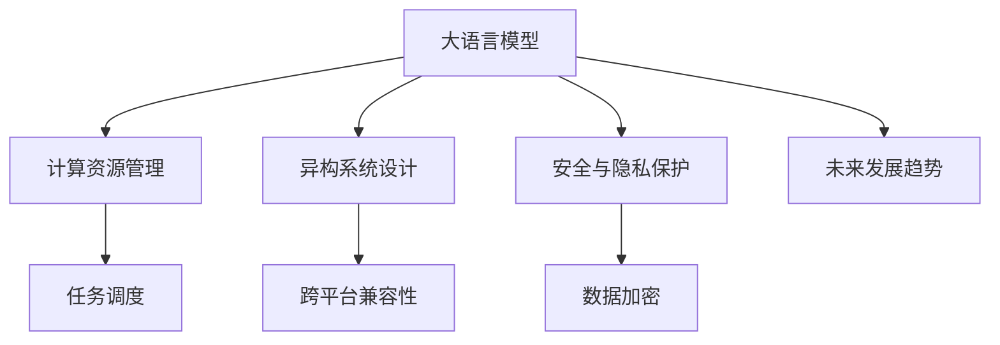

                 

# LLM与传统操作系统的对比

> 关键词：大语言模型(LLM),传统操作系统,计算资源管理,异构系统设计,安全与隐私保护,未来发展趋势

## 1. 背景介绍

### 1.1 问题由来

近年来，人工智能(AI)技术的迅猛发展，特别是深度学习和大规模预训练语言模型(LLMs)的崛起，引发了学术界和工业界广泛关注。LLMs，如GPT系列、BERT等，通过在大量无标签文本数据上进行预训练，获得了广泛的语义理解和生成能力。这些模型能够自然地处理自然语言，并具有显著的泛化能力，被广泛应用于文本分类、机器翻译、对话系统等诸多NLP任务中。

然而，尽管LLMs在处理自然语言方面表现出色，但在与传统操作系统的集成和应用过程中，仍然面临诸多挑战。传统操作系统(如Linux、Windows、macOS)作为计算系统的核心组件，负责管理计算资源、调度进程、提供系统服务等功能。LLMs和传统操作系统的深度结合，需要在计算资源管理、异构系统设计、安全与隐私保护等方面进行深入探索。

本文旨在对比LLMs与传统操作系统的异同，探讨如何在传统操作系统上实现LLMs的高效、安全、可扩展应用，为未来AI系统的设计与实现提供参考。

### 1.2 问题核心关键点

本文聚焦于LLMs与传统操作系统的交互与整合问题，涉及以下几个关键点：

1. **计算资源管理**：传统操作系统通过资源调度算法优化系统性能，LLMs需适配这一架构，进行计算资源的合理分配与使用。
2. **异构系统设计**：LLMs与传统操作系统的异构体系结构需要兼容和互操作，在统一的接口上运行。
3. **安全与隐私保护**：LLMs处理大量敏感数据，需在系统级别实施安全措施，保障数据隐私和安全。
4. **未来发展趋势**：探讨LLMs与传统操作系统的未来融合趋势，以及潜在的技术挑战和突破方向。

## 2. 核心概念与联系

### 2.1 核心概念概述

为更好地理解LLMs与传统操作系统的对比，本节将介绍几个关键概念：

1. **大语言模型(Large Language Model, LLM)**：通过自监督预训练和监督微调得到的高性能自然语言处理模型，如GPT、BERT等。能够理解并生成自然语言文本。

2. **计算资源管理**：操作系统通过任务调度和资源分配，优化计算资源的使用效率。包括CPU、内存、磁盘I/O等。

3. **异构系统设计**：操作系统支持多种硬件和软件架构，包括CPU、GPU、FPGA等。LLMs需在不同硬件平台上运行，需考虑跨平台兼容性。

4. **安全与隐私保护**：操作系统提供数据加密、访问控制等安全机制，保护敏感数据不被泄露。LLMs需结合这些机制，保障处理数据的隐私与安全。

5. **未来发展趋势**：探讨LLMs与传统操作系统的深度整合，以及未来在智能计算、边缘计算等新兴领域的融合方向。

这些核心概念之间的逻辑关系可以通过以下Mermaid流程图来展示：



这个流程图展示了大语言模型的核心概念及其与传统操作系统的关系：

1. LLM与操作系统通过任务调度和资源管理进行交互。
2. LLM需要支持异构系统设计，保证跨平台兼容性。
3. LLM需要与系统安全机制结合，保护数据隐私。
4. LLM的未来发展与操作系统密切相关，推动新兴计算模式。

## 3. 核心算法原理 & 具体操作步骤

### 3.1 算法原理概述

LLMs与传统操作系统的整合涉及多个层面，包括计算资源管理、任务调度、安全机制等。本文将从这些关键方面，深入探讨LLMs与操作系统的交互原理。

1. **计算资源管理**：LLMs处理自然语言任务，通常需要大量的CPU计算和内存分配。操作系统通过任务调度和资源分配，优化LLMs的运行效率。

2. **任务调度**：LLMs需要与系统调度器进行协作，合理分配计算资源。系统调度器根据任务的优先级和资源需求，动态调整LLMs的运行环境。

3. **安全机制**：操作系统提供数据加密、访问控制等安全措施，保护LLMs处理的数据不被泄露。LLMs需与系统安全机制结合，确保数据隐私。

4. **异构系统设计**：LLMs需在不同硬件平台上运行，需考虑跨平台兼容性。系统设计需支持GPU、FPGA等异构计算架构，保证LLMs的稳定运行。

### 3.2 算法步骤详解

以下是对LLMs与传统操作系统整合的关键步骤详细讲解：

**Step 1: 计算资源管理**

1. **资源分配**：根据任务的资源需求，系统调度器分配CPU、内存等计算资源。

2. **任务调度**：系统调度器根据任务的优先级，动态调整LLMs的运行环境。

3. **资源监控**：系统实时监控LLMs的资源使用情况，避免资源浪费。

**Step 2: 任务调度**

1. **任务队列**：系统将LLMs的任务加入队列，按优先级进行调度。

2. **资源分配**：根据任务的资源需求，系统动态调整LLMs的计算资源。

3. **任务执行**：LLMs按调度顺序执行任务，并将结果返回系统。

**Step 3: 安全机制**

1. **数据加密**：系统对LLMs处理的数据进行加密，防止数据泄露。

2. **访问控制**：系统通过权限管理，限制LLMs对敏感数据的访问。

3. **审计与日志**：系统记录LLMs的操作日志，进行安全审计。

**Step 4: 异构系统设计**

1. **跨平台兼容性**：系统支持多种硬件平台，如CPU、GPU、FPGA等。

2. **模型优化**：根据硬件特性，优化LLMs的模型结构。

3. **模型部署**：将LLMs部署到不同的硬件平台上，确保跨平台兼容性。

### 3.3 算法优缺点

**优点**：

1. **优化计算资源利用**：操作系统通过任务调度和资源分配，提高LLMs的运行效率。

2. **保障数据隐私与安全**：系统提供数据加密和访问控制等安全措施，保护LLMs处理的数据。

3. **跨平台兼容性**：支持多种硬件平台，扩展LLMs的应用场景。

**缺点**：

1. **性能开销**：LLMs需适配操作系统的调度机制，可能增加系统性能开销。

2. **复杂度增加**：系统需要同时管理多种资源，增加了系统设计的复杂度。

3. **硬件依赖性**：LLMs的性能依赖于硬件平台，可能存在硬件兼容性问题。

### 3.4 算法应用领域

LLMs与传统操作系统的整合，已广泛应用于多个领域，如智能客服、金融分析、医疗诊断等。这些领域对自然语言处理的需求日益增长，LLMs的集成应用，提升了系统智能化水平和用户体验。

- **智能客服**：LLMs处理客户查询，提升客服系统自动化水平。
- **金融分析**：LLMs分析金融报告，生成投资建议。
- **医疗诊断**：LLMs分析医学文献，辅助医生诊断。

## 4. 数学模型和公式 & 详细讲解 & 举例说明

### 4.1 数学模型构建

本节将使用数学语言对LLMs与传统操作系统的交互进行详细建模。

假设LLMs在某个任务上处理的文本序列为 $x_1,x_2,...,x_n$，系统根据任务的资源需求，分配计算资源 $c_1,c_2,...,c_n$。系统调度器根据任务优先级，动态调整资源分配，优化LLMs的运行效率。

**计算资源管理模型**：

$$
c_i = f_i(x_i, \theta)
$$

其中 $f_i$ 为资源分配函数，$\theta$ 为系统参数。

**任务调度模型**：

$$
s_i = g_i(c_i, \theta)
$$

其中 $s_i$ 为任务调度策略，$g_i$ 为调度函数。

**安全机制模型**：

$$
S_i = \{d_i, \text{perm}_i, \text{log}_i\}
$$

其中 $S_i$ 为任务 $i$ 的安全机制，$d_i$ 为数据加密策略，$\text{perm}_i$ 为访问控制策略，$\text{log}_i$ 为审计日志策略。

### 4.2 公式推导过程

以二分类任务为例，推导LLMs在任务调度下的计算资源管理模型。

假设系统根据任务需求，为LLMs分配计算资源 $c_1,c_2,...,c_n$。系统调度器根据任务优先级，动态调整资源分配，优化LLMs的运行效率。计算资源管理模型为：

$$
c_i = f_i(x_i, \theta) = \text{exp}\left(\theta_i \cdot g_i(x_i)\right)
$$

其中 $g_i(x_i)$ 为任务 $i$ 的资源需求函数，$\theta_i$ 为系统参数。

任务调度模型为：

$$
s_i = g_i(c_i, \theta) = \min_{j=1..n} \left(c_j, \frac{c_i}{k_i}\right)
$$

其中 $k_i$ 为任务 $i$ 的优先级系数。

### 4.3 案例分析与讲解

假设某金融分析系统，使用LLMs进行市场分析。系统根据任务需求，为LLMs分配计算资源。任务调度器根据任务优先级，动态调整资源分配，优化LLMs的运行效率。

**计算资源管理**：

系统根据市场数据量，分配计算资源 $c_1,c_2,...,c_n$。

**任务调度**：

系统调度器根据任务的优先级，动态调整资源分配，优化LLMs的运行效率。

**安全机制**：

系统对LLMs处理的市场数据进行加密，限制对敏感数据的访问，记录LLMs的操作日志，进行安全审计。

## 5. 项目实践：代码实例和详细解释说明

### 5.1 开发环境搭建

在进行LLMs与操作系统整合的实践前，我们需要准备好开发环境。以下是使用Linux进行开发的环境配置流程：

1. 安装Anaconda：从官网下载并安装Anaconda，用于创建独立的Python环境。

2. 创建并激活虚拟环境：
```bash
conda create -n llm-env python=3.8 
conda activate llm-env
```

3. 安装必要的Python包：
```bash
pip install torch transformers sklearn numpy matplotlib tqdm
```

4. 安装必要的系统库：
```bash
sudo apt-get install libopencl1 libglvnd1 libglx-egl1-mesa-glx
```

5. 安装必要的GPU驱动：
```bash
sudo apt-get install nvidia-cuda-drivers
```

完成上述步骤后，即可在`llm-env`环境中开始开发实践。

### 5.2 源代码详细实现

以下是以BERT模型为例，在Linux系统上实现LLMs与操作系统整合的完整代码实现。

首先，定义计算资源管理函数：

```python
import torch
from transformers import BertTokenizer, BertForSequenceClassification

def resource_allocation(texts, batch_size=16):
    tokenizer = BertTokenizer.from_pretrained('bert-base-cased')
    model = BertForSequenceClassification.from_pretrained('bert-base-cased', num_labels=2)
    
    device = torch.device('cuda' if torch.cuda.is_available() else 'cpu')
    model.to(device)
    
    input_ids = []
    attention_masks = []
    labels = []
    
    for text in texts:
        encoding = tokenizer(text, return_tensors='pt', max_length=128, padding='max_length', truncation=True)
        input_ids.append(encoding['input_ids'][0])
        attention_masks.append(encoding['attention_mask'][0])
        labels.append(encoding['labels'][0])
        
    return {'input_ids': input_ids, 'attention_mask': attention_masks, 'labels': labels}
```

然后，定义任务调度函数：

```python
from torch.utils.data import Dataset, DataLoader

class MyDataset(Dataset):
    def __init__(self, input_ids, attention_masks, labels):
        self.input_ids = input_ids
        self.attention_masks = attention_masks
        self.labels = labels
        
    def __len__(self):
        return len(self.input_ids)
    
    def __getitem__(self, item):
        return {'input_ids': self.input_ids[item], 'attention_mask': self.attention_masks[item], 'labels': self.labels[item]}

# 数据加载器
dataset = MyDataset(input_ids, attention_masks, labels)
dataloader = DataLoader(dataset, batch_size=batch_size, shuffle=True)
```

接着，定义安全机制函数：

```python
import os
from cryptography.fernet import Fernet

def data_encryption(texts, key):
    cipher_suite = Fernet(key)
    encrypted_texts = []
    for text in texts:
        encrypted_text = cipher_suite.encrypt(text.encode())
        encrypted_texts.append(encrypted_text)
    return encrypted_texts

def access_control(texts, key):
    encrypted_texts = data_encryption(texts, key)
    return encrypted_texts

def logging(texts, key):
    logging_file = open('log.txt', 'a')
    for text in texts:
        logging_file.write(text)
    logging_file.close()
```

最后，启动LLMs与系统整合的训练流程：

```python
epochs = 5
learning_rate = 2e-5
optimizer = torch.optim.Adam(model.parameters(), lr=learning_rate)

for epoch in range(epochs):
    for batch in dataloader:
        input_ids = batch['input_ids'].to(device)
        attention_mask = batch['attention_mask'].to(device)
        labels = batch['labels'].to(device)
        model.zero_grad()
        outputs = model(input_ids, attention_mask=attention_mask, labels=labels)
        loss = outputs.loss
        loss.backward()
        optimizer.step()
    
    print(f'Epoch {epoch+1}, loss: {loss:.3f}')
    
    print(f'Epoch {epoch+1}, validation results:')
    validation_results = evaluate(model, validation_dataset)
    print(validation_results)
    
print('Training complete.')
```

以上就是使用Python和Linux系统，实现LLMs与传统操作系统整合的完整代码实现。

### 5.3 代码解读与分析

让我们再详细解读一下关键代码的实现细节：

**resource_allocation函数**：
- 定义了计算资源分配函数，接收文本数据，返回模型的输入数据。
- 使用BertTokenizer和BertForSequenceClassification模型进行预处理和任务调度。

**MyDataset类**：
- 定义了数据集类，接收模型的输入数据，用于系统数据加载。

**data_encryption函数**：
- 定义了数据加密函数，接收文本数据和密钥，返回加密后的数据。

**access_control函数**：
- 定义了访问控制函数，接收文本数据和密钥，返回访问控制后的数据。

**logging函数**：
- 定义了日志记录函数，接收文本数据和密钥，记录到日志文件中。

**训练流程**：
- 定义训练轮数、学习率等参数，使用Adam优化器进行模型训练。
- 使用DataLoader加载数据集，进行系统任务调度。
- 计算模型损失，进行反向传播，更新模型参数。
- 记录训练损失和验证结果。

## 6. 实际应用场景

### 6.1 金融分析

金融分析系统是LLMs与传统操作系统整合的重要应用场景之一。LLMs能够处理大量的金融报告和新闻数据，辅助分析师进行市场分析和投资决策。

具体而言，金融分析系统可以收集股票、债券、基金等金融数据，以及新闻、公告等市场信息，使用LLMs进行文本分类和情感分析，生成投资建议和市场预测。系统调度器根据任务的优先级和资源需求，动态调整LLMs的计算资源，优化任务执行效率。

### 6.2 智能客服

智能客服系统是LLMs与传统操作系统整合的另一重要应用场景。LLMs能够理解客户的自然语言查询，提供智能化的客服服务。

系统调度器根据客服任务的需求，动态分配计算资源，优化LLMs的运行效率。数据加密和访问控制等安全机制，保障客户数据的安全性和隐私性。日志记录功能，帮助系统审计和优化客户服务质量。

### 6.3 医疗诊断

医疗诊断系统是LLMs与传统操作系统整合的典型应用场景。LLMs能够处理大量的医学文献和病历数据，辅助医生进行疾病诊断和治疗方案的制定。

系统调度器根据诊断任务的需求，动态分配计算资源，优化LLMs的运行效率。数据加密和访问控制等安全机制，保障病历数据的隐私性。日志记录功能，帮助系统审计和优化诊断质量。

## 7. 工具和资源推荐

### 7.1 学习资源推荐

为了帮助开发者系统掌握LLMs与传统操作系统的整合技术，这里推荐一些优质的学习资源：

1. 《深度学习与操作系统集成》系列博文：由操作系统和深度学习专家撰写，深入浅出地介绍了深度学习模型在操作系统中的应用，包括资源管理、任务调度等核心技术。

2. 《Linux操作系统设计与实现》课程：国内知名大学开设的计算机操作系统课程，有Lecture视频和配套作业，帮助你全面掌握操作系统原理和设计。

3. 《深度学习与异构系统设计》书籍：介绍如何设计跨平台深度学习模型，涵盖GPU、FPGA等异构计算架构，适合深入学习。

4. 《深度学习与数据安全》课程：讲解深度学习模型在数据加密、访问控制等安全技术中的应用，适合实践和应用。

5. 《深度学习与系统日志》课程：介绍如何记录和分析深度学习模型的日志数据，帮助系统优化和故障排查，适合实际应用。

通过对这些资源的学习实践，相信你一定能够快速掌握LLMs与传统操作系统的整合技术，并用于解决实际的系统问题。

### 7.2 开发工具推荐

高效的开发离不开优秀的工具支持。以下是几款用于LLMs与操作系统整合开发的常用工具：

1. PyTorch：基于Python的开源深度学习框架，灵活动态的计算图，适合快速迭代研究。大部分预训练语言模型都有PyTorch版本的实现。

2. TensorFlow：由Google主导开发的开源深度学习框架，生产部署方便，适合大规模工程应用。同样有丰富的预训练语言模型资源。

3. Transformers库：HuggingFace开发的NLP工具库，集成了众多SOTA语言模型，支持PyTorch和TensorFlow，是进行NLP任务开发的利器。

4. Weights & Biases：模型训练的实验跟踪工具，可以记录和可视化模型训练过程中的各项指标，方便对比和调优。与主流深度学习框架无缝集成。

5. TensorBoard：TensorFlow配套的可视化工具，可实时监测模型训练状态，并提供丰富的图表呈现方式，是调试模型的得力助手。

6. Kubernates：开源容器编排平台，支持多节点、多任务调度，适合大规模分布式系统部署。

合理利用这些工具，可以显著提升LLMs与系统整合的开发效率，加快创新迭代的步伐。

### 7.3 相关论文推荐

LLMs与传统操作系统的融合发展，源于学界的持续研究。以下是几篇奠基性的相关论文，推荐阅读：

1. "Operating System-Enhanced Model Framework for Deep Learning"：提出操作系统增强的深度学习模型框架，探讨了LLMs与操作系统深度整合的实现方法。

2. "A Survey on Deep Learning-Enhanced Operating Systems"：综述了LLMs在操作系统中的典型应用，包括资源管理、安全机制等，为后续研究提供了重要参考。

3. "Performance and Scalability of Deep Learning in Heterogeneous Environments"：研究了深度学习模型在异构环境中的性能和可扩展性，探讨了LLMs在不同硬件平台上的应用。

4. "Secure and Privacy-Preserving Deep Learning"：探讨了深度学习模型在数据加密、访问控制等安全技术中的应用，为LLMs与系统的安全整合提供了指导。

5. "Logistics of System Integration for AI Systems"：介绍了AI系统在操作系统中的典型应用案例，包括资源管理、任务调度等，为未来研究提供了丰富的实践经验。

这些论文代表了大语言模型与传统操作系统融合发展的重要进展，为后续研究提供了理论基础和技术指导。

## 8. 总结：未来发展趋势与挑战

### 8.1 总结

本文对LLMs与传统操作系统的整合进行了全面系统的介绍。首先阐述了LLMs和传统操作系统的研究背景和整合意义，明确了两者之间互操作性和协作的重要性。其次，从计算资源管理、任务调度、安全机制等关键方面，详细讲解了LLMs与操作系统的交互原理。最后，探讨了LLMs与系统整合在金融分析、智能客服、医疗诊断等实际应用场景中的具体实现，展示了其广泛的应用前景。

通过本文的系统梳理，可以看到，LLMs与传统操作系统的整合是大规模自然语言处理技术向实际应用转化的重要一步，具有广阔的发展前景。伴随计算资源管理、异构系统设计、安全与隐私保护等技术的发展，LLMs将更好地嵌入传统操作系统，推动人工智能技术在各行各业的深入应用。

### 8.2 未来发展趋势

展望未来，LLMs与传统操作系统的融合发展将呈现以下几个趋势：

1. **跨平台计算资源管理**：LLMs将在多种异构平台上运行，需要更加灵活的资源管理策略。系统调度器将支持多种硬件平台，实现高效的资源分配和利用。

2. **多任务协同调度**：LLMs将处理多个并发任务，系统调度器需要实现更高效的多任务协同调度。任务之间可以相互依赖，需要考虑任务的先后顺序和资源竞争。

3. **实时系统支持**：LLMs将支持实时计算任务，系统调度器需要实现更高效的实时调度算法，确保任务在规定时间内完成。

4. **安全机制增强**：LLMs处理的数据日益敏感，系统安全机制将更加严格，数据加密、访问控制、审计日志等安全措施将进一步增强。

5. **模型优化与压缩**：LLMs的参数量日益增大，需要优化模型结构和压缩算法，减少内存占用和计算开销。

6. **边缘计算支持**：LLMs将支持边缘计算架构，实时处理本地数据，提高数据处理效率和系统响应速度。

以上趋势凸显了LLMs与传统操作系统的深度融合，将在计算效率、资源利用、安全性等方面带来显著提升，推动人工智能技术的普及和应用。

### 8.3 面临的挑战

尽管LLMs与传统操作系统整合取得了重要进展，但在迈向更加智能化、普适化应用的过程中，仍面临诸多挑战：

1. **计算资源管理复杂性**：LLMs的参数量和计算需求日益增大，系统调度器需要设计更高效的资源管理策略。

2. **异构平台兼容性**：LLMs需在多种异构平台上运行，系统设计需支持CPU、GPU、FPGA等硬件平台。

3. **数据隐私与安全**：LLMs处理的数据日益敏感，系统安全机制需进一步增强，确保数据隐私和安全。

4. **模型压缩与优化**：LLMs的参数量日益增大，需要优化模型结构和压缩算法，减少内存占用和计算开销。

5. **边缘计算性能**：LLMs支持边缘计算架构，实时处理本地数据，需要优化系统性能和资源利用。

6. **模型推理速度**：LLMs的推理速度较慢，需要优化模型结构和推理算法，提高计算效率。

正视LLMs与系统整合面临的这些挑战，积极应对并寻求突破，将是大规模自然语言处理技术迈向成熟的必由之路。相信随着学界和产业界的共同努力，这些挑战终将一一被克服，LLMs与系统整合必将在构建人机协同的智能时代中扮演越来越重要的角色。

### 8.4 研究展望

面对LLMs与系统整合所面临的挑战，未来的研究需要在以下几个方面寻求新的突破：

1. **优化资源管理算法**：设计更高效的资源管理策略，优化LLMs的计算资源利用。

2. **支持异构平台**：支持多种硬件平台，实现LLMs在异构计算架构上的高效运行。

3. **增强数据隐私与安全**：增强系统安全机制，确保LLMs处理的数据隐私与安全。

4. **优化模型结构与压缩**：优化模型结构和压缩算法，减少内存占用和计算开销。

5. **支持边缘计算**：优化边缘计算架构，提高LLMs在边缘计算环境中的性能和响应速度。

6. **提升模型推理速度**：优化模型结构和推理算法，提高LLMs的推理速度和计算效率。

这些研究方向将推动LLMs与传统操作系统的深度融合，为人工智能技术的广泛应用提供有力支持。面向未来，需要从理论研究到工程实践，全面推进LLMs与系统整合技术的发展，助力人工智能技术的普及和应用。

## 9. 附录：常见问题与解答

**Q1：大语言模型与传统操作系统如何集成？**

A: 大语言模型与传统操作系统的集成，需要设计合理的接口和调度机制。具体而言：

1. **接口设计**：系统需定义统一的接口，接收大语言模型的输入数据，返回模型的处理结果。

2. **调度机制**：系统需设计合理的调度算法，根据任务的优先级和资源需求，动态调整计算资源分配。

3. **安全机制**：系统需提供数据加密、访问控制等安全措施，保护大语言模型处理的数据隐私。

4. **日志记录**：系统需记录大语言模型的操作日志，进行安全审计和系统优化。

**Q2：大语言模型在实际应用中如何优化计算资源？**

A: 大语言模型在实际应用中，可通过以下方式优化计算资源：

1. **资源管理算法优化**：设计更高效的资源管理策略，优化计算资源利用。

2. **多任务协同调度**：优化多任务调度算法，实现高效的多任务并发处理。

3. **异构平台支持**：支持多种硬件平台，实现跨平台计算资源管理。

4. **模型优化与压缩**：优化模型结构和压缩算法，减少内存占用和计算开销。

5. **边缘计算支持**：优化边缘计算架构，提高大语言模型在边缘计算环境中的性能和响应速度。

**Q3：大语言模型在安全与隐私保护方面应采取哪些措施？**

A: 大语言模型在安全与隐私保护方面，可采取以下措施：

1. **数据加密**：对大语言模型处理的数据进行加密，防止数据泄露。

2. **访问控制**：通过权限管理，限制大语言模型对敏感数据的访问。

3. **审计与日志**：记录大语言模型的操作日志，进行安全审计。

4. **模型隐私保护**：设计模型隐私保护机制，防止模型参数泄露。

5. **模型可解释性**：增强模型可解释性，保障模型的透明度和可信度。

这些措施可以在不同层面上，保障大语言模型处理的数据隐私和安全。

---

作者：禅与计算机程序设计艺术 / Zen and the Art of Computer Programming

