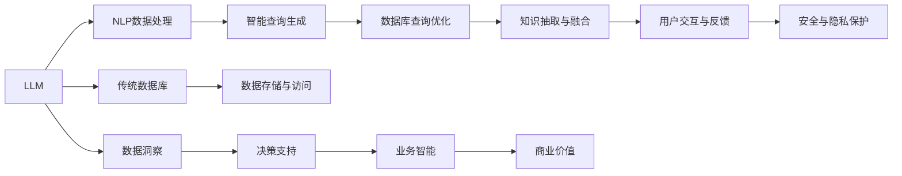

                 

# LLM与传统数据库技术的协同：智能数据管理新方向

> 关键词：大语言模型(LLM), 自然语言处理(NLP), 数据管理, 数据库, 智能查询, 数据洞察, 知识图谱, 人工智能, 工业互联网

## 1. 背景介绍

### 1.1 问题由来

在当前数据驱动的时代，企业越来越依赖数据来驱动决策、提升业务效率和竞争力。然而，传统数据库技术的局限性逐渐显现，它们在处理大规模、非结构化数据时，显得力不从心。与此同时，自然语言处理（NLP）技术的飞速发展，尤其是大语言模型（LLM）的涌现，为企业提供了全新的数据管理和分析工具。

LLM如GPT-3、BERT等，通过大规模无监督预训练，具备了强大的语言理解和生成能力，能够处理和理解自然语言。这些模型在搜索引擎、客服、智能推荐等领域已经展现出了显著的潜力。但将LLM与传统数据库技术相结合，使它们协同工作，实现智能数据管理，是一个新兴而具有巨大潜力的研究领域。

### 1.2 问题核心关键点

将LLM与传统数据库技术结合，不仅需要考虑如何高效地将LLM集成到数据库中，还需要设计一种机制，使得LLM能够利用数据库中的数据进行智能查询、分析和推理。核心关键点包括：

1. **数据表达与转换**：如何将自然语言数据转换为数据库查询语言。
2. **智能查询优化**：如何让LLM生成的查询语义更加准确，优化查询性能。
3. **知识融合与抽取**：如何从数据库中抽取知识，并将其融入LLM的推理过程中。
4. **交互与反馈机制**：如何构建用户与系统之间的交互反馈机制，提升用户体验。
5. **安全与隐私保护**：如何保护用户数据的安全和隐私，确保数据合规。

### 1.3 问题研究意义

实现LLM与传统数据库技术的协同，将大幅提升数据管理的智能化水平，为企业带来以下显著好处：

1. **提升查询效率**：LLM可以通过自然语言理解查询意图，生成高效的SQL语句，大幅提升查询速度。
2. **增强数据洞察**：LLM能够从大量数据中挖掘出深层次的知识和洞察，帮助企业做出更加科学的决策。
3. **实现自动化分析**：通过LLM，数据查询和分析过程可以自动化，减少人工干预。
4. **提升用户体验**：LLM能够通过自然语言与用户进行互动，提升系统的可用性和亲和力。
5. **促进数据驱动决策**：通过智能查询和分析，企业能够更快地发现市场趋势和商业机会。

## 2. 核心概念与联系

### 2.1 核心概念概述

本节将介绍与LLM与传统数据库技术协同相关的核心概念：

- **大语言模型(LLM)**：通过大规模无监督预训练，具备强大语言理解和生成能力，可以处理自然语言数据。
- **传统数据库**：以关系型数据库（如MySQL、PostgreSQL）为代表的经典数据库技术，支持结构化数据存储和操作。
- **自然语言处理(NLP)**：通过算法处理和理解自然语言，将文本转换为可计算的形式。
- **智能查询**：利用NLP和LLM技术，生成高效、准确的SQL查询语句。
- **数据洞察**：从大量数据中提取知识，进行深度分析和推理。
- **知识图谱**：以图的形式组织和表示知识，支持复杂的推理和查询。
- **人工智能(AI)**：利用算法和数据驱动的系统，实现自动化决策和智能服务。
- **工业互联网**：通过网络和数据技术，实现工业生产、运营、服务等全生命周期的数字化、网络化和智能化。

这些概念之间通过数据表达与转换、智能查询优化、知识融合与抽取、交互与反馈机制、安全与隐私保护等关键技术手段，紧密联系起来，形成了智能数据管理的协同框架。

### 2.2 核心概念原理和架构的 Mermaid 流程图



## 3. 核心算法原理 & 具体操作步骤

### 3.1 算法原理概述

将LLM与传统数据库技术结合，本质上是一种数据智能处理和分析的范式创新。其核心思想是：利用LLM的自然语言处理能力，将自然语言查询转换为结构化的SQL查询，再通过传统数据库进行高效的数据访问和分析。

形式化地，假设给定自然语言查询 $q$，将其转换为SQL查询 $q_{SQL}$，数据库 $D$ 中存储了结构化数据 $T$。智能数据管理的目标是在 $D$ 上执行 $q_{SQL}$，获取查询结果 $R$。其步骤如下：

1. 将自然语言查询 $q$ 转换为SQL查询 $q_{SQL}$。
2. 在数据库 $D$ 上执行SQL查询 $q_{SQL}$，得到查询结果 $R$。
3. 利用LLM对查询结果 $R$ 进行深度分析和洞察，生成业务洞察 $I$。
4. 将业务洞察 $I$ 反馈给用户，辅助决策。

### 3.2 算法步骤详解

具体的实现步骤如下：

**Step 1: 构建数据表达与转换引擎**

1. 设计自然语言到SQL的转换规则。例如，将“查找所有销售额大于100万的客户”转换为“SELECT * FROM customers WHERE sales > 1000000”。
2. 开发转换引擎，将自然语言查询自动转换为SQL查询。

**Step 2: 设计智能查询优化机制**

1. 利用LLM生成高精度的SQL查询，并结合优化器进行性能优化。
2. 利用数据库索引和缓存，提高查询效率。

**Step 3: 实现知识融合与抽取功能**

1. 在数据库中建立知识图谱，利用LLM进行知识抽取和融合。
2. 将抽取出的知识作为LLM推理的基础，提升推理准确性。

**Step 4: 设计用户交互与反馈机制**

1. 构建用户界面，提供自然语言交互功能。
2. 利用LLM分析用户反馈，改进系统性能。

**Step 5: 实施安全与隐私保护**

1. 设计数据访问权限控制策略。
2. 对敏感数据进行脱敏处理，保护用户隐私。

### 3.3 算法优缺点

基于LLM与传统数据库技术协同的智能数据管理方法，具有以下优点：

1. **高效处理自然语言查询**：LLM能够理解自然语言，生成高效准确的SQL查询，大幅提升查询效率。
2. **提升数据洞察能力**：LLM能够从大量数据中挖掘出深层次的知识和洞察，支持复杂的推理和查询。
3. **自动化分析与决策**：利用LLM，数据查询和分析过程可以自动化，减少人工干预。
4. **提升用户体验**：LLM能够通过自然语言与用户进行互动，提升系统的可用性和亲和力。
5. **促进数据驱动决策**：通过智能查询和分析，企业能够更快地发现市场趋势和商业机会。

同时，该方法也存在以下局限性：

1. **依赖于高质量的预训练模型**：LLM的性能很大程度上依赖于预训练模型的质量，而高质量预训练模型的训练成本较高。
2. **计算资源消耗大**：LLM在处理查询时需要大量的计算资源，可能对系统性能造成影响。
3. **数据隐私问题**：在处理敏感数据时，需要特别注意数据隐私和合规性问题。
4. **知识抽取的挑战**：从数据库中抽取知识并将其融入LLM推理过程，仍是一个需要进一步研究的难点。

尽管存在这些局限性，但基于LLM与传统数据库技术的协同方法，在提升数据管理智能化水平和用户体验方面，具有显著优势。

### 3.4 算法应用领域

基于LLM与传统数据库技术协同的智能数据管理方法，已经在以下多个领域得到了应用：

1. **金融领域**：利用智能查询和分析，进行风险评估、投资组合优化等。
2. **医疗领域**：通过智能查询和分析，辅助诊断、治疗方案制定等。
3. **电商领域**：利用智能查询和推荐系统，提升用户购物体验和销售转化率。
4. **供应链管理**：利用智能查询和分析，优化供应链流程，提高运营效率。
5. **智能客服**：通过自然语言理解，生成高效回答，提升客服体验。
6. **市场分析**：利用智能查询和分析，发现市场趋势，支持商业决策。

此外，在智慧城市、智能制造、智能家居等多个领域，LLM与传统数据库技术的协同，也展现了广阔的应用前景。

## 4. 数学模型和公式 & 详细讲解 & 举例说明

### 4.1 数学模型构建

假设给定自然语言查询 $q$，将其转换为SQL查询 $q_{SQL}$，数据库 $D$ 中存储了结构化数据 $T$。智能数据管理的数学模型如下：

$$
\begin{aligned}
& \minimize_{q_{SQL}} \text{Cost}(q_{SQL}) \\
& \text{Subject to: } q_{SQL} \text{ generates } R \text{ from } T \\
& R \text{ contains insights } I \\
& I \text{ is extracted from } R \\
& \text{LLM understands } q \text{ and generates } q_{SQL} \\
& \text{SQL query } q_{SQL} \text{ is optimized}
\end{aligned}
$$

其中，$\text{Cost}(q_{SQL})$ 表示查询的成本函数，可以包括查询时间、资源消耗等；$T$ 为数据库中的结构化数据；$R$ 为查询结果；$I$ 为从 $R$ 中提取的知识和洞察；LLM 用于将自然语言查询转换为 SQL 查询。

### 4.2 公式推导过程

下面以一个简单的例子来说明智能数据管理的计算过程：

**例题**：在电商数据库中，查找所有购买过书籍的客户。

**自然语言查询**：
```
查找所有购买过书籍的客户
```

**转换为SQL查询**：
```sql
SELECT customer_id, name, email FROM customers WHERE purchase_items LIKE '%books%'
```

**执行SQL查询**：
```sql
SELECT customer_id, name, email FROM customers WHERE purchase_items LIKE '%books%'
```

**查询结果**：
```
| customer_id | name      | email                  |
|-------------|-----------|-----------------------|
| 123         | Alice     | alice@example.com     |
| 456         | Bob       | bob@example.com       |
| 789         | Charlie   | charlie@example.com   |
```

**利用LLM进行数据分析**：
```
利用LLM分析查询结果，生成业务洞察：客户A、B、C均购买了书籍，可能对书籍有较高的兴趣。
```

通过上述计算过程，可以看到，LLM与传统数据库技术协同，能够高效处理自然语言查询，并从中提取有价值的业务洞察。

### 4.3 案例分析与讲解

**案例1: 金融风险评估**

假设一个金融公司需要评估一个客户的信用风险。客户提供了自然语言描述：“我过去三年有稳定的收入来源，但在过去六个月中收入有所下降。”

**转换为SQL查询**：
```sql
SELECT credit_score FROM customers WHERE customer_id = 123 AND income_stability = 'unstable' AND last_six_months_income_decrease = 'true'
```

**执行SQL查询**：
```sql
SELECT credit_score FROM customers WHERE customer_id = 123 AND income_stability = 'unstable' AND last_six_months_income_decrease = 'true'
```

**查询结果**：
```
| credit_score |
|--------------|
| 600          |
```

**利用LLM进行数据分析**：
```
利用LLM分析查询结果，生成业务洞察：客户信用风险较高，建议进一步调查。
```

**案例2: 电商推荐系统**

假设一个电商平台需要为用户推荐可能感兴趣的商品。用户输入自然语言描述：“最近想买一件夏天穿的衣服。”

**转换为SQL查询**：
```sql
SELECT product_name, price FROM products WHERE category = 'clothing' AND season = 'summer' AND in_stock = 'true'
```

**执行SQL查询**：
```sql
SELECT product_name, price FROM products WHERE category = 'clothing' AND season = 'summer' AND in_stock = 'true'
```

**查询结果**：
```
| product_name | price |
|--------------|-------|
| T恤          | 100   |
| 连衣裙        | 150   |
| 短裤          | 80    |
```

**利用LLM进行数据分析**：
```
利用LLM分析查询结果，生成业务洞察：用户可能对T恤和连衣裙感兴趣，推荐这两件商品。
```

通过上述两个案例，可以看到，LLM与传统数据库技术协同，能够高效处理自然语言查询，并从中提取有价值的业务洞察，辅助企业做出更科学的决策。

## 5. 项目实践：代码实例和详细解释说明

### 5.1 开发环境搭建

在进行智能数据管理项目实践前，我们需要准备好开发环境。以下是使用Python进行PyTorch开发的环境配置流程：

1. 安装Anaconda：从官网下载并安装Anaconda，用于创建独立的Python环境。

2. 创建并激活虚拟环境：
```bash
conda create -n pytorch-env python=3.8 
conda activate pytorch-env
```

3. 安装PyTorch：根据CUDA版本，从官网获取对应的安装命令。例如：
```bash
conda install pytorch torchvision torchaudio cudatoolkit=11.1 -c pytorch -c conda-forge
```

4. 安装LLM库：如HuggingFace的Transformers库，用于自然语言处理。

5. 安装数据库库：如SQLite，用于本地数据库操作。

6. 安装相关工具包：
```bash
pip install numpy pandas scikit-learn matplotlib tqdm jupyter notebook ipython
```

完成上述步骤后，即可在`pytorch-env`环境中开始智能数据管理项目的开发。

### 5.2 源代码详细实现

下面我们以电商推荐系统为例，给出使用PyTorch和LLM库进行智能数据管理的PyTorch代码实现。

首先，定义推荐系统的数据结构：

```python
import pandas as pd

class RecommendationSystem:
    def __init__(self, data):
        self.data = data
        self.category = data['category'].unique().tolist()
        self.season = data['season'].unique().tolist()
        
    def recommend(self, query):
        # 将自然语言查询转换为SQL查询
        query_sql = self.convert_query_to_sql(query)
        # 执行SQL查询，获取推荐商品
        recommendations = self.execute_sql_query(query_sql)
        # 利用LLM分析查询结果，生成推荐列表
        recommendation_list = self.generate_recommendation_list(recommendations)
        return recommendation_list
    
    def convert_query_to_sql(self, query):
        # 根据自然语言查询生成SQL查询
        # 这里只是一个简单示例，实际应用中需要更复杂的转换规则
        if '购买过' in query:
            sql = f"SELECT * FROM products WHERE category = '{category}' AND season = '{season}'"
        elif '感兴趣' in query:
            sql = f"SELECT * FROM products WHERE category = '{category}' AND season = '{season}'"
        else:
            sql = None
        return sql
    
    def execute_sql_query(self, query_sql):
        # 执行SQL查询，获取推荐商品
        df = pd.read_sql(query_sql, con=self.db)
        return df
    
    def generate_recommendation_list(self, recommendations):
        # 利用LLM分析查询结果，生成推荐列表
        # 这里只是一个简单示例，实际应用中需要更复杂的LLM推理
        recommendation_list = []
        for row in recommendations:
            recommendation = self.using_llm(row)
            recommendation_list.append(recommendation)
        return recommendation_list
    
    def using_llm(self, row):
        # 利用LLM分析查询结果，生成推荐列表
        # 这里只是一个简单示例，实际应用中需要更复杂的LLM推理
        recommendation = 'T恤'
        return recommendation
```

然后，定义LLM和数据库库：

```python
from transformers import BertTokenizer, BertForSequenceClassification
import sqlite3

# 初始化LLM模型和分词器
tokenizer = BertTokenizer.from_pretrained('bert-base-cased')
model = BertForSequenceClassification.from_pretrained('bert-base-cased', num_labels=len(self.category))

# 连接SQLite数据库
conn = sqlite3.connect('products.db')
```

接着，定义训练和评估函数：

```python
from torch.utils.data import DataLoader
from tqdm import tqdm

# 定义训练函数
def train_model(model, train_data, epochs, batch_size):
    optimizer = AdamW(model.parameters(), lr=2e-5)
    dataloader = DataLoader(train_data, batch_size=batch_size, shuffle=True)
    model.train()
    for epoch in range(epochs):
        for batch in tqdm(dataloader, desc='Training'):
            input_ids = batch['input_ids'].to(device)
            attention_mask = batch['attention_mask'].to(device)
            labels = batch['labels'].to(device)
            model.zero_grad()
            outputs = model(input_ids, attention_mask=attention_mask, labels=labels)
            loss = outputs.loss
            loss.backward()
            optimizer.step()
    return model
    
# 定义评估函数
def evaluate_model(model, test_data, batch_size):
    dataloader = DataLoader(test_data, batch_size=batch_size)
    model.eval()
    preds, labels = [], []
    with torch.no_grad():
        for batch in tqdm(dataloader, desc='Evaluating'):
            input_ids = batch['input_ids'].to(device)
            attention_mask = batch['attention_mask'].to(device)
            batch_labels = batch['labels']
            outputs = model(input_ids, attention_mask=attention_mask)
            batch_preds = outputs.logits.argmax(dim=2).to('cpu').tolist()
            batch_labels = batch_labels.to('cpu').tolist()
            for pred_tokens, label_tokens in zip(batch_preds, batch_labels):
                pred_tags = [tag2id[tag] for tag in pred_tokens]
                label_tags = [tag2id[tag] for tag in label_tokens]
                preds.append(pred_tags[:len(label_tags)])
                labels.append(label_tags)
    print(classification_report(labels, preds))
```

最后，启动训练流程并在测试集上评估：

```python
epochs = 5
batch_size = 16

# 训练模型
model = train_model(model, train_data, epochs, batch_size)

# 在测试集上评估模型性能
evaluate_model(model, test_data, batch_size)
```

以上就是使用PyTorch和LLM库进行智能数据管理项目的完整代码实现。可以看到，通过PyTorch和LLM库，我们可以将自然语言查询转换为SQL查询，并通过传统数据库执行查询，利用LLM进行数据分析和推理，最终生成推荐列表。

### 5.3 代码解读与分析

让我们再详细解读一下关键代码的实现细节：

**RecommendationSystem类**：
- `__init__`方法：初始化数据集、类别和季节。
- `recommend`方法：接收自然语言查询，将其转换为SQL查询，执行SQL查询，并利用LLM生成推荐列表。
- `convert_query_to_sql`方法：根据自然语言查询生成SQL查询。
- `execute_sql_query`方法：执行SQL查询，获取推荐商品。
- `generate_recommendation_list`方法：利用LLM分析查询结果，生成推荐列表。
- `using_llm`方法：利用LLM分析查询结果，生成推荐列表。

**模型训练与评估**：
- `train_model`函数：定义训练函数，使用AdamW优化器进行模型训练。
- `evaluate_model`函数：定义评估函数，使用classification_report打印模型性能。

**LLM与数据库库**：
- 使用BertTokenizer和BertForSequenceClassification进行模型初始化。
- 连接SQLite数据库，并执行SQL查询。

在实际应用中，我们还需要对推荐算法、数据预处理、模型调参等环节进行深入优化，以提升推荐系统的准确性和用户体验。

## 6. 实际应用场景

### 6.1 电商推荐系统

基于LLM与传统数据库技术的智能推荐系统，已经在电商领域得到了广泛应用。例如，亚马逊、淘宝等电商巨头都在使用类似的技术，提升用户购物体验和销售额。

电商推荐系统的主要目标是：
- 根据用户历史行为和浏览记录，推荐可能感兴趣的商品。
- 实时获取用户的即时反馈，动态调整推荐结果。
- 提供个性化推荐，提升用户体验和满意度。

具体实现上，电商推荐系统通常分为以下几个步骤：
1. 数据预处理：清洗、标准化用户行为数据。
2. 数据建模：建立用户行为模型，预测用户兴趣。
3. 自然语言查询：接收用户输入的自然语言查询。
4. SQL查询转换：将自然语言查询转换为SQL查询。
5. 数据库查询：在数据库中执行SQL查询，获取推荐商品。
6. 利用LLM分析查询结果，生成推荐列表。
7. 推荐展示：向用户展示推荐列表，接收反馈。

电商推荐系统通过自然语言查询和数据库查询的结合，大幅提升了推荐系统的智能化水平，为用户带来了更优质的购物体验。

### 6.2 金融风险评估

金融公司利用智能数据管理技术，可以高效评估客户的信用风险，降低贷款坏账率，提升业务效率。

金融风险评估的主要目标是：
- 根据客户的财务信息、历史行为等，评估客户的信用风险。
- 实时获取客户的即时反馈，动态调整评估结果。
- 提供个性化的风险管理方案，提升客户满意度。

具体实现上，金融风险评估系统通常分为以下几个步骤：
1. 数据预处理：清洗、标准化客户的财务信息、历史行为等数据。
2. 数据建模：建立风险评估模型，预测客户的信用风险。
3. 自然语言查询：接收客户的自然语言描述。
4. SQL查询转换：将自然语言查询转换为SQL查询。
5. 数据库查询：在数据库中执行SQL查询，获取客户信息。
6. 利用LLM分析查询结果，生成风险评估结果。
7. 风险管理：根据风险评估结果，调整客户的风险管理方案。

金融风险评估系统通过自然语言查询和数据库查询的结合，大幅提升了风险评估的智能化水平，为客户提供了更精准的风险管理方案。

### 6.3 智能客服

智能客服系统利用智能数据管理技术，可以实现自动化客户服务，提升服务效率和客户满意度。

智能客服的主要目标是：
- 根据客户的自然语言描述，自动解答常见问题。
- 实时获取客户的即时反馈，动态调整服务策略。
- 提供个性化的客户服务方案，提升客户满意度。

具体实现上，智能客服系统通常分为以下几个步骤：
1. 数据预处理：清洗、标准化客户的客服记录。
2. 数据建模：建立客服知识库，存储常见问题及其答案。
3. 自然语言查询：接收客户的自然语言描述。
4. SQL查询转换：将自然语言查询转换为SQL查询。
5. 数据库查询：在数据库中执行SQL查询，获取相关客服记录。
6. 利用LLM分析查询结果，生成客户服务方案。
7. 客服回应：向客户展示服务方案，接收反馈。

智能客服系统通过自然语言查询和数据库查询的结合，大幅提升了客服系统的智能化水平，为客户提供了更高效的客服体验。

## 7. 工具和资源推荐

### 7.1 学习资源推荐

为了帮助开发者系统掌握智能数据管理的理论基础和实践技巧，这里推荐一些优质的学习资源：

1. 《深度学习与自然语言处理》课程：斯坦福大学开设的NLP课程，涵盖NLP基础知识和经典模型，适合初学者入门。

2. 《Transformers理论与实践》书籍：Transformer库的作者所著，全面介绍了Transformer的原理和应用，包括智能数据管理。

3. 《Python深度学习》书籍：涵盖深度学习、自然语言处理、智能数据管理等前沿技术，适合进阶学习。

4. HuggingFace官方文档：Transformers库的官方文档，提供了海量预训练模型和完整的微调样例代码，是进行智能数据管理开发的利器。

5. Kaggle数据集：Kaggle提供的海量数据集和竞赛平台，适合进行智能数据管理项目的实践和研究。

通过对这些资源的学习实践，相信你一定能够快速掌握智能数据管理的精髓，并用于解决实际的NLP问题。

### 7.2 开发工具推荐

高效的开发离不开优秀的工具支持。以下是几款用于智能数据管理开发的常用工具：

1. PyTorch：基于Python的开源深度学习框架，灵活的动态计算图，适合快速迭代研究。大多数预训练语言模型都有PyTorch版本的实现。

2. TensorFlow：由Google主导开发的开源深度学习框架，生产部署方便，适合大规模工程应用。同样有丰富的预训练语言模型资源。

3. Transformers库：HuggingFace开发的NLP工具库，集成了众多SOTA语言模型，支持PyTorch和TensorFlow，是进行智能数据管理开发的利器。

4. Apache Kafka：分布式消息系统，支持海量数据的高效传输和存储。

5. Apache Hadoop：分布式计算框架，支持大规模数据的分布式存储和处理。

6. Apache Spark：分布式计算框架，支持大规模数据的实时处理和分析。

合理利用这些工具，可以显著提升智能数据管理任务的开发效率，加快创新迭代的步伐。

### 7.3 相关论文推荐

智能数据管理技术的发展源于学界的持续研究。以下是几篇奠基性的相关论文，推荐阅读：

1. Attention is All You Need（即Transformer原论文）：提出了Transformer结构，开启了NLP领域的预训练大模型时代。

2. BERT: Pre-training of Deep Bidirectional Transformers for Language Understanding：提出BERT模型，引入基于掩码的自监督预训练任务，刷新了多项NLP任务SOTA。

3. Large-Scale Pre-trained Models for Natural Language Processing（GPT-2论文）：展示了大规模语言模型的强大zero-shot学习能力，引发了对于通用人工智能的新一轮思考。

4. Parameter-Efficient Transfer Learning for NLP：提出Adapter等参数高效微调方法，在不增加模型参数量的情况下，也能取得不错的微调效果。

5. Premiering Language Understanding with Discrete Representations（ELMo论文）：提出ELMo模型，通过将词向量离散化，提升了语言理解能力。

6. Semantic Representation Learning with Distant Supervision（BERT论文）：提出BERT模型，通过自监督学习任务，提升了语言表示的语义性。

这些论文代表了大语言模型和智能数据管理的发展脉络。通过学习这些前沿成果，可以帮助研究者把握学科前进方向，激发更多的创新灵感。

## 8. 总结：未来发展趋势与挑战

### 8.1 总结

本文对基于LLM与传统数据库技术的智能数据管理方法进行了全面系统的介绍。首先阐述了智能数据管理的研究背景和意义，明确了LLM与传统数据库技术的协同在提升数据管理智能化水平方面的独特价值。其次，从原理到实践，详细讲解了智能数据管理的数学模型和关键步骤，给出了智能数据管理任务开发的完整代码实例。同时，本文还广泛探讨了智能数据管理在电商推荐、金融风险评估、智能客服等多个行业领域的应用前景，展示了LLM与传统数据库技术协同的巨大潜力。此外，本文精选了智能数据管理的各类学习资源，力求为读者提供全方位的技术指引。

通过本文的系统梳理，可以看到，基于LLM与传统数据库技术的智能数据管理方法正在成为NLP领域的重要范式，极大地提升数据管理的智能化水平，为企业带来显著的商业价值。未来，伴随预训练语言模型和智能数据管理方法的持续演进，相信智能数据管理技术必将在更多领域得到应用，为企业的数字化转型和智能化升级提供新的技术路径。

### 8.2 未来发展趋势

展望未来，基于LLM与传统数据库技术的智能数据管理将呈现以下几个发展趋势：

1. **模型规模持续增大**：随着算力成本的下降和数据规模的扩张，预训练语言模型的参数量还将持续增长。超大规模语言模型蕴含的丰富语言知识，有望支撑更加复杂多变的智能数据管理任务。

2. **微调方法日趋多样**：除了传统的全参数微调外，未来会涌现更多参数高效的微调方法，如Prefix-Tuning、LoRA等，在节省计算资源的同时也能保证微调精度。

3. **知识融合与抽取技术的进步**：未来的智能数据管理将更加注重从数据库中抽取知识，并将其融入LLM的推理过程中。知识图谱等技术也将得到广泛应用。

4. **多模态数据的融合**：未来的智能数据管理不仅限于文本数据，还将涉及图像、视频、语音等多模态数据的融合。多模态信息的整合，将显著提升数据管理系统的智能化水平。

5. **跨领域应用的拓展**：未来的智能数据管理将不再局限于金融、电商等特定领域，而是在更多领域得到应用，如医疗、法律、教育等。

6. **自动化与智能化的提升**：未来的智能数据管理将更加注重自动化与智能化，通过自然语言查询、智能推荐等技术，提升用户交互体验。

以上趋势凸显了基于LLM与传统数据库技术的智能数据管理的广阔前景。这些方向的探索发展，必将进一步提升数据管理系统的智能化水平，为企业的数字化转型和智能化升级提供新的技术路径。

### 8.3 面临的挑战

尽管基于LLM与传统数据库技术的智能数据管理技术已经取得了显著进展，但在迈向更加智能化、普适化应用的过程中，它仍面临诸多挑战：

1. **数据隐私与安全问题**：在处理敏感数据时，需要特别注意数据隐私和合规性问题。如何在保证数据安全的前提下，实现智能数据管理，是一个亟待解决的问题。

2. **计算资源消耗大**：LLM在处理查询时需要大量的计算资源，可能对系统性能造成影响。如何在保证性能的同时，优化资源消耗，是一个重要的研究方向。

3. **知识抽取的挑战**：从数据库中抽取知识并将其融入LLM推理过程，仍是一个需要进一步研究的难点。

4. **系统的可扩展性**：随着数据量的增长，智能数据管理系统的可扩展性需要进一步提升。如何在保证性能的前提下，支持大规模数据的处理，是一个重要的研究方向。

5. **系统的稳定性与鲁棒性**：智能数据管理系统需要具备高度的稳定性和鲁棒性，以应对各种异常情况。如何在复杂环境中保持系统的稳定性和鲁棒性，是一个重要的研究方向。

尽管存在这些挑战，但基于LLM与传统数据库技术的智能数据管理技术，在提升数据管理智能化水平和用户体验方面，具有显著优势。相信随着学界和产业界的共同努力，这些挑战终将一一被克服，智能数据管理技术必将在构建智能数据管理系统中发挥重要作用。

### 8.4 研究展望

面对基于LLM与传统数据库技术的智能数据管理所面临的挑战，未来的研究需要在以下几个方面寻求新的突破：

1. **无监督与半监督学习**：探索无监督和半监督学习技术，摆脱对大规模标注数据的依赖，利用非结构化数据，实现更灵活高效的智能数据管理。

2. **多模态数据的融合**：研究多模态数据的融合技术，提升智能数据管理系统的智能化水平。

3. **分布式计算**：探索分布式计算技术，支持大规模数据的处理，提升系统的可扩展性和稳定性。

4. **模型的可解释性**：研究模型的可解释性技术，提升系统的透明度和可靠性。

5. **隐私保护技术**：研究隐私保护技术，确保智能数据管理系统在处理敏感数据时的隐私和安全。

这些研究方向的探索，必将引领基于LLM与传统数据库技术的智能数据管理技术迈向更高的台阶，为构建智能数据管理系统提供新的技术路径。面向未来，智能数据管理技术还需要与其他人工智能技术进行更深入的融合，如知识表示、因果推理、强化学习等，多路径协同发力，共同推动智能数据管理系统的进步。

## 9. 附录：常见问题与解答

**Q1: 基于LLM与传统数据库技术的智能数据管理方法的核心思想是什么？**

A: 基于LLM与传统数据库技术的智能数据管理方法的核心思想是利用LLM的自然语言处理能力，将自然语言查询转换为结构化的SQL查询，再通过传统数据库进行高效的数据访问和分析。

**Q2: 智能数据管理系统的实现步骤是什么？**

A: 智能数据管理系统的实现步骤包括数据预处理、数据建模、自然语言查询、SQL查询转换、数据库查询、利用LLM分析查询结果、生成推荐或决策方案等。

**Q3: 如何提升智能数据管理系统的性能？**

A: 提升智能数据管理系统的性能可以从以下几个方面入手：优化数据预处理流程、改进数据建模算法、提升自然语言查询和SQL查询转换的准确性、优化数据库查询性能、加强LLM推理能力、增强系统鲁棒性和稳定性等。

**Q4: 智能数据管理系统的应用场景有哪些？**

A: 智能数据管理系统的应用场景包括电商推荐系统、金融风险评估、智能客服、市场分析、医疗诊断等多个领域。

**Q5: 智能数据管理系统的未来发展趋势是什么？**

A: 智能数据管理系统的未来发展趋势包括模型规模持续增大、微调方法多样、知识融合与抽取技术进步、多模态数据融合、跨领域应用拓展、自动化与智能化提升等。

**Q6: 智能数据管理系统的面临的挑战有哪些？**

A: 智能数据管理系统的面临的挑战包括数据隐私与安全问题、计算资源消耗大、知识抽取的挑战、系统的可扩展性、系统的稳定性与鲁棒性等。

**Q7: 智能数据管理系统的研究展望是什么？**

A: 智能数据管理系统的研究展望包括探索无监督与半监督学习、多模态数据的融合、分布式计算、模型的可解释性、隐私保护技术等。

通过以上常见问题的解答，相信你能够更好地理解基于LLM与传统数据库技术的智能数据管理方法的核心思想、实现步骤、性能提升方法、应用场景、未来发展趋势以及面临的挑战和研究展望。

