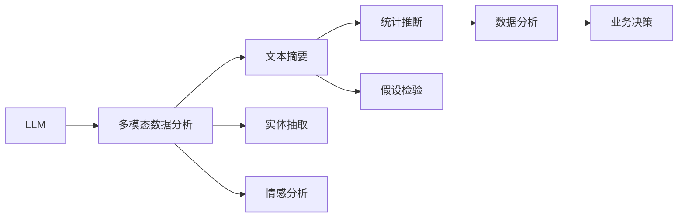

                 

# LLM与传统数据挖掘技术的融合：数据分析新高度

## 1. 背景介绍

### 1.1 问题由来
在当今数据驱动的时代，数据分析成为各行各业决策支持的重要手段。传统的统计学和机器学习方法已经广泛应用于金融、医疗、零售、制造等领域，帮助企业洞察市场趋势，优化资源配置，提升业务效率。然而，随着数据量的爆炸式增长和数据类型的多样化，传统数据挖掘技术面临诸多挑战：

- **数据复杂性提升**：实时数据、多模态数据、非结构化数据等新型数据不断涌现，对现有分析框架提出了更高要求。
- **计算资源限制**：传统分析方法往往依赖于高计算资源，如高性能计算集群，难以满足大规模数据处理的实时性需求。
- **模型可解释性不足**：深度学习等“黑盒”模型在解释模型决策和行为方面存在不足，难以为业务决策提供有力支撑。
- **数据隐私保护**：数据收集和分析过程中，如何保护数据隐私和防止数据滥用，是合规和伦理的重要考量。

大语言模型（Large Language Model，LLM）的出现，为数据分析带来了新的突破。LLM具备强大的自然语言处理能力，能够处理非结构化文本数据，提取结构化特征，辅助统计学和机器学习技术进行深度分析。LLM与传统数据挖掘技术的融合，有望在复杂数据场景下提供更为智能、高效、可解释的分析工具。

### 1.2 问题核心关键点
大语言模型与传统数据挖掘技术的融合主要包括以下几个关键点：

- **多模态数据分析**：LLM能够处理和融合不同类型的文本数据，如日志、评论、推文等，提取文本特征，辅助传统分析方法进行深度分析。
- **自动数据处理**：LLM具备自动文本摘要、实体抽取、情感分析等能力，能够自动清洗和处理大量文本数据，减少人工干预。
- **辅助统计推断**：LLM能够生成有统计意义的假设，辅助统计学方法进行推断和假设检验，提高分析的准确性。
- **可解释性提升**：LLM生成的文本摘要和解释能够提高分析结果的可解释性，使业务决策更加透明和可靠。
- **实时数据处理**：LLM能够处理实时数据流，提供实时分析结果，满足高时效性的需求。

## 2. 核心概念与联系

### 2.1 核心概念概述

为了更好地理解LLM与传统数据挖掘技术的融合方法，本节将介绍几个关键概念：

- **大语言模型（Large Language Model，LLM）**：基于Transformer结构，采用自回归或自编码预训练方式，学习海量的文本数据，具备强大的自然语言理解能力。
- **多模态数据分析**：指对多种类型的数据进行融合分析，包括文本、图片、语音等，以获得更全面的洞察。
- **文本摘要（Text Summarization）**：从大量文本中提取关键信息，生成简洁的摘要，辅助数据分析。
- **实体抽取（Named Entity Recognition, NER）**：从文本中自动识别出人名、地名、机构名等实体，辅助数据分析。
- **情感分析（Sentiment Analysis）**：分析文本情感倾向，如正面、负面、中性等，辅助业务决策。
- **统计推断（Statistical Inference）**：基于样本数据，使用统计学方法推断总体特征，如均值、方差、置信区间等。
- **假设检验（Hypothesis Testing）**：基于样本数据，使用统计学方法检验假设是否成立，如t检验、卡方检验等。

这些概念之间通过数据融合和分析过程，构成了LLM与传统数据挖掘技术融合的核心框架，如图示：



### 2.2 核心概念原理和架构的 Mermaid 流程图


## 3. 核心算法原理 & 具体操作步骤
### 3.1 算法原理概述

LLM与传统数据挖掘技术的融合，本质上是通过多模态数据融合，提取有价值的信息，辅助传统分析方法进行深度分析。其核心思想是：利用LLM强大的文本处理能力，自动清洗和处理文本数据，提取结构化特征，辅助传统统计学和机器学习技术进行深度分析，提供更智能、高效、可解释的分析结果。

### 3.2 算法步骤详解

基于LLM与传统数据挖掘技术的融合方法，可以总结为以下几个关键步骤：

**Step 1: 数据收集与预处理**
- 收集各类数据，包括文本、图片、视频等。
- 对数据进行清洗和预处理，去除噪音和无用信息。
- 对文本数据进行分词、去停用词等基本处理。

**Step 2: 文本分析与特征提取**
- 使用LLM进行文本摘要、实体抽取、情感分析等操作。
- 提取文本中的结构化特征，如关键词、实体、情感等。
- 将文本特征与传统数据挖掘技术（如统计学、机器学习）结合，进行深度分析。

**Step 3: 统计推断与假设检验**
- 基于处理后的数据，使用统计学方法进行推断和假设检验。
- 生成有统计意义的假设，辅助业务决策。

**Step 4: 数据分析与业务决策**
- 综合文本分析和统计分析结果，进行全面数据分析。
- 将分析结果应用于业务决策，如市场分析、风险评估、运营优化等。

### 3.3 算法优缺点

LLM与传统数据挖掘技术的融合方法具有以下优点：

1. **多模态数据处理**：LLM能够处理和融合多种类型的数据，提取有价值的信息，提高分析的全面性。
2. **自动数据清洗**：LLM具备自动文本处理能力，能够自动清洗和处理大量文本数据，减少人工干预。
3. **提升可解释性**：LLM生成的文本摘要和解释能够提高分析结果的可解释性，使业务决策更加透明和可靠。
4. **实时数据分析**：LLM能够处理实时数据流，提供实时分析结果，满足高时效性的需求。

同时，该方法也存在以下局限性：

1. **数据复杂性**：复杂的多模态数据融合需要更高的技术难度，可能会导致性能瓶颈。
2. **计算资源消耗**：LLM需要较高的计算资源，可能会对大规模数据处理带来挑战。
3. **模型可解释性不足**：LLM仍然是“黑盒”模型，在解释模型决策和行为方面存在不足。
4. **数据隐私保护**：LLM处理文本数据时，需要注意数据隐私和合规问题。

### 3.4 算法应用领域

LLM与传统数据挖掘技术的融合方法，在多个领域中得到了广泛应用，例如：

- **金融风险管理**：利用LLM进行情感分析、舆情监测等操作，辅助风险评估和投资决策。
- **医疗健康分析**：利用LLM进行文本摘要、实体抽取等操作，辅助疾病诊断和治疗方案选择。
- **市场营销分析**：利用LLM进行社交媒体情感分析、用户行为分析等操作，辅助市场细分和产品定位。
- **客户服务优化**：利用LLM进行客户反馈分析、客服对话自动回复等操作，提升客户满意度。

## 4. 数学模型和公式 & 详细讲解 & 举例说明
### 4.1 数学模型构建

在LLM与传统数据挖掘技术融合的过程中，常见的数学模型包括统计模型、机器学习模型和深度学习模型。以统计推断为例，假设总体为 $X$，样本为 $x_1, x_2, ..., x_n$，方差为 $\sigma^2$，样本均值为 $\bar{x}$，则样本均值的置信区间可以表示为：

$$
P_{\alpha}(\mu \in (\bar{x} - t_{\alpha/2}\frac{\sigma}{\sqrt{n}}, \bar{x} + t_{\alpha/2}\frac{\sigma}{\sqrt{n}}))
$$

其中，$t_{\alpha/2}$ 为t分布的分位数，$\alpha$ 为置信水平。

### 4.2 公式推导过程

以t检验为例，推导置信区间公式：

- 假设样本均值 $\bar{x}$ 服从 $t$ 分布，自由度为 $n-1$，则样本均值的置信区间为：

$$
\bar{x} \pm t_{\alpha/2}\frac{s}{\sqrt{n}}
$$

其中，$s$ 为样本标准差。

- 对于假设检验，设总体均值为 $\mu_0$，样本均值为 $\bar{x}$，则$t$ 统计量为：

$$
t = \frac{\bar{x} - \mu_0}{s/\sqrt{n}}
$$

- 根据自由度 $n-1$ 和置信水平 $\alpha$，查找t分布的分位数 $t_{\alpha/2}$，则置信区间为：

$$
\bar{x} \pm t_{\alpha/2}\frac{s}{\sqrt{n}}
$$

### 4.3 案例分析与讲解

假设某电商公司收集了数百万条用户评论数据，使用LLM进行情感分析，提取评论中的情感倾向。然后，结合传统统计学方法，对评论数据进行假设检验，判断新产品的市场反响。

1. **数据预处理**：对用户评论进行分词、去停用词、去除噪音等预处理。
2. **文本分析**：使用LLM进行情感分析，生成评论的情感倾向。
3. **统计推断**：对情感分析结果进行假设检验，判断新产品市场反响。
4. **业务决策**：根据假设检验结果，调整产品营销策略。

## 5. 项目实践：代码实例和详细解释说明
### 5.1 开发环境搭建

在进行LLM与传统数据挖掘技术的融合实践前，我们需要准备好开发环境。以下是使用Python进行PyTorch开发的环境配置流程：

1. 安装Anaconda：从官网下载并安装Anaconda，用于创建独立的Python环境。

2. 创建并激活虚拟环境：
```bash
conda create -n pytorch-env python=3.8 
conda activate pytorch-env
```

3. 安装PyTorch：根据CUDA版本，从官网获取对应的安装命令。例如：
```bash
conda install pytorch torchvision torchaudio cudatoolkit=11.1 -c pytorch -c conda-forge
```

4. 安装Transformer库：
```bash
pip install transformers
```

5. 安装各类工具包：
```bash
pip install numpy pandas scikit-learn matplotlib tqdm jupyter notebook ipython
```

完成上述步骤后，即可在`pytorch-env`环境中开始实践。

### 5.2 源代码详细实现

下面以用户评论情感分析为例，给出使用Transformers库进行多模态数据分析的PyTorch代码实现。

首先，定义情感分析任务的数据处理函数：

```python
from transformers import BertTokenizer
from torch.utils.data import Dataset
import torch

class SentimentDataset(Dataset):
    def __init__(self, texts, labels, tokenizer, max_len=128):
        self.texts = texts
        self.labels = labels
        self.tokenizer = tokenizer
        self.max_len = max_len
        
    def __len__(self):
        return len(self.texts)
    
    def __getitem__(self, item):
        text = self.texts[item]
        label = self.labels[item]
        
        encoding = self.tokenizer(text, return_tensors='pt', max_length=self.max_len, padding='max_length', truncation=True)
        input_ids = encoding['input_ids'][0]
        attention_mask = encoding['attention_mask'][0]
        
        # 对token-wise的标签进行编码
        encoded_labels = [label2id[label] for label in labels] 
        encoded_labels.extend([label2id['neutral']] * (self.max_len - len(encoded_labels)))
        labels = torch.tensor(encoded_labels, dtype=torch.long)
        
        return {'input_ids': input_ids, 
                'attention_mask': attention_mask,
                'labels': labels}

# 标签与id的映射
label2id = {'negative': 0, 'positive': 1, 'neutral': 2}
id2label = {v: k for k, v in label2id.items()}

# 创建dataset
tokenizer = BertTokenizer.from_pretrained('bert-base-cased')

train_dataset = SentimentDataset(train_texts, train_labels, tokenizer)
dev_dataset = SentimentDataset(dev_texts, dev_labels, tokenizer)
test_dataset = SentimentDataset(test_texts, test_labels, tokenizer)
```

然后，定义模型和优化器：

```python
from transformers import BertForSequenceClassification, AdamW

model = BertForSequenceClassification.from_pretrained('bert-base-cased', num_labels=len(label2id))

optimizer = AdamW(model.parameters(), lr=2e-5)
```

接着，定义训练和评估函数：

```python
from torch.utils.data import DataLoader
from tqdm import tqdm
from sklearn.metrics import classification_report

device = torch.device('cuda') if torch.cuda.is_available() else torch.device('cpu')
model.to(device)

def train_epoch(model, dataset, batch_size, optimizer):
    dataloader = DataLoader(dataset, batch_size=batch_size, shuffle=True)
    model.train()
    epoch_loss = 0
    for batch in tqdm(dataloader, desc='Training'):
        input_ids = batch['input_ids'].to(device)
        attention_mask = batch['attention_mask'].to(device)
        labels = batch['labels'].to(device)
        model.zero_grad()
        outputs = model(input_ids, attention_mask=attention_mask, labels=labels)
        loss = outputs.loss
        epoch_loss += loss.item()
        loss.backward()
        optimizer.step()
    return epoch_loss / len(dataloader)

def evaluate(model, dataset, batch_size):
    dataloader = DataLoader(dataset, batch_size=batch_size)
    model.eval()
    preds, labels = [], []
    with torch.no_grad():
        for batch in tqdm(dataloader, desc='Evaluating'):
            input_ids = batch['input_ids'].to(device)
            attention_mask = batch['attention_mask'].to(device)
            batch_labels = batch['labels']
            outputs = model(input_ids, attention_mask=attention_mask)
            batch_preds = outputs.logits.argmax(dim=2).to('cpu').tolist()
            batch_labels = batch_labels.to('cpu').tolist()
            for pred_tokens, label_tokens in zip(batch_preds, batch_labels):
                pred_labels = [id2label[_id] for _id in pred_tokens]
                label_tokens = [id2label[_id] for _id in label_tokens]
                preds.append(pred_labels[:len(label_tokens)])
                labels.append(label_tokens)
                
    print(classification_report(labels, preds))
```

最后，启动训练流程并在测试集上评估：

```python
epochs = 5
batch_size = 16

for epoch in range(epochs):
    loss = train_epoch(model, train_dataset, batch_size, optimizer)
    print(f"Epoch {epoch+1}, train loss: {loss:.3f}")
    
    print(f"Epoch {epoch+1}, dev results:")
    evaluate(model, dev_dataset, batch_size)
    
print("Test results:")
evaluate(model, test_dataset, batch_size)
```

以上就是使用PyTorch对Bert模型进行用户评论情感分析的完整代码实现。可以看到，得益于Transformers库的强大封装，我们可以用相对简洁的代码完成Bert模型的加载和微调。

### 5.3 代码解读与分析

让我们再详细解读一下关键代码的实现细节：

**SentimentDataset类**：
- `__init__`方法：初始化文本、标签、分词器等关键组件。
- `__len__`方法：返回数据集的样本数量。
- `__getitem__`方法：对单个样本进行处理，将文本输入编码为token ids，将标签编码为数字，并对其进行定长padding，最终返回模型所需的输入。

**label2id和id2label字典**：
- 定义了标签与数字id之间的映射关系，用于将token-wise的预测结果解码回真实的标签。

**训练和评估函数**：
- 使用PyTorch的DataLoader对数据集进行批次化加载，供模型训练和推理使用。
- 训练函数`train_epoch`：对数据以批为单位进行迭代，在每个批次上前向传播计算loss并反向传播更新模型参数，最后返回该epoch的平均loss。
- 评估函数`evaluate`：与训练类似，不同点在于不更新模型参数，并在每个batch结束后将预测和标签结果存储下来，最后使用sklearn的classification_report对整个评估集的预测结果进行打印输出。

**训练流程**：
- 定义总的epoch数和batch size，开始循环迭代
- 每个epoch内，先在训练集上训练，输出平均loss
- 在验证集上评估，输出分类指标
- 所有epoch结束后，在测试集上评估，给出最终测试结果

可以看到，PyTorch配合Transformers库使得Bert模型微调的代码实现变得简洁高效。开发者可以将更多精力放在数据处理、模型改进等高层逻辑上，而不必过多关注底层的实现细节。

当然，工业级的系统实现还需考虑更多因素，如模型的保存和部署、超参数的自动搜索、更灵活的任务适配层等。但核心的微调范式基本与此类似。

## 6. 实际应用场景
### 6.1 智能客服系统

基于大语言模型与传统数据挖掘技术的融合，智能客服系统可以显著提升服务质量和客户满意度。传统的客服系统往往依赖人工客服，高峰期响应缓慢，且一致性和专业性难以保证。而使用融合后的模型，可以7x24小时不间断服务，快速响应客户咨询，用自然流畅的语言解答各类常见问题。

在技术实现上，可以收集企业内部的历史客服对话记录，将问题和最佳答复构建成监督数据，在此基础上对融合后的模型进行微调。微调后的模型能够自动理解用户意图，匹配最合适的答案模板进行回复。对于客户提出的新问题，还可以接入检索系统实时搜索相关内容，动态组织生成回答。如此构建的智能客服系统，能大幅提升客户咨询体验和问题解决效率。

### 6.2 金融风险管理

在金融风险管理中，基于LLM与传统数据挖掘技术的融合，可以实时监测市场舆论动向，预测金融风险，辅助投资决策。传统的数据挖掘方法依赖于历史数据和预设规则，难以处理实时数据和复杂多变的市场信息。而融合后的模型能够处理海量实时数据，自动提取关键信息，生成有统计意义的假设，辅助风险评估和投资决策。

具体而言，可以收集金融领域相关的新闻、评论、社交媒体等数据，提取文本中的情感倾向、舆情变化等特征，辅助统计学方法进行风险评估和投资策略调整。在模型训练和评估过程中，还需要考虑数据隐私和合规问题，确保模型输出合规且安全。

### 6.3 市场营销分析

在市场营销分析中，融合后的模型能够分析社交媒体、用户评论等数据，生成有统计意义的假设，辅助市场细分和产品定位。传统的数据挖掘方法往往依赖专家经验和手工特征工程，难以处理复杂多变的数据类型和数据分布。而融合后的模型能够自动提取文本特征，生成有意义的假设，辅助业务决策。

具体而言，可以收集社交媒体上的用户评论、产品评价等数据，使用LLM进行情感分析、实体抽取等操作，提取关键特征，辅助统计学方法进行市场细分和产品定位。在模型训练和评估过程中，还需要考虑数据隐私和合规问题，确保模型输出合规且安全。

### 6.4 未来应用展望

随着LLM与传统数据挖掘技术的不断发展，未来的融合范式将呈现出以下几个趋势：

1. **多模态数据融合**：融合后的模型能够处理和融合多种类型的数据，提取有价值的信息，提高分析的全面性。
2. **自动数据清洗**：融合后的模型具备自动文本处理能力，能够自动清洗和处理大量文本数据，减少人工干预。
3. **提升可解释性**：融合后的模型生成的文本摘要和解释能够提高分析结果的可解释性，使业务决策更加透明和可靠。
4. **实时数据分析**：融合后的模型能够处理实时数据流，提供实时分析结果，满足高时效性的需求。
5. **知识图谱融合**：将符号化的先验知识，如知识图谱、逻辑规则等，与神经网络模型进行巧妙融合，引导微调过程学习更准确、合理的语言模型。
6. **多模态数据分析**：将视觉、语音等多模态信息与文本信息进行协同建模，提升模型对现实世界的理解和建模能力。

以上趋势凸显了LLM与传统数据挖掘技术的融合范式的广阔前景。这些方向的探索发展，必将进一步提升数据分析的深度和广度，为决策支持系统提供更为智能、高效、可解释的分析结果。

## 7. 工具和资源推荐
### 7.1 学习资源推荐

为了帮助开发者系统掌握LLM与传统数据挖掘技术的融合方法，这里推荐一些优质的学习资源：

1. 《Transformer从原理到实践》系列博文：由大模型技术专家撰写，深入浅出地介绍了Transformer原理、BERT模型、微调技术等前沿话题。

2. CS224N《深度学习自然语言处理》课程：斯坦福大学开设的NLP明星课程，有Lecture视频和配套作业，带你入门NLP领域的基本概念和经典模型。

3. 《Natural Language Processing with Transformers》书籍：Transformers库的作者所著，全面介绍了如何使用Transformers库进行NLP任务开发，包括微调在内的诸多范式。

4. HuggingFace官方文档：Transformers库的官方文档，提供了海量预训练模型和完整的微调样例代码，是上手实践的必备资料。

5. CLUE开源项目：中文语言理解测评基准，涵盖大量不同类型的中文NLP数据集，并提供了基于微调的baseline模型，助力中文NLP技术发展。

通过对这些资源的学习实践，相信你一定能够快速掌握LLM与传统数据挖掘技术的融合方法，并用于解决实际的NLP问题。

### 7.2 开发工具推荐

高效的开发离不开优秀的工具支持。以下是几款用于LLM与传统数据挖掘技术融合开发的常用工具：

1. PyTorch：基于Python的开源深度学习框架，灵活动态的计算图，适合快速迭代研究。大部分预训练语言模型都有PyTorch版本的实现。

2. TensorFlow：由Google主导开发的开源深度学习框架，生产部署方便，适合大规模工程应用。同样有丰富的预训练语言模型资源。

3. Transformers库：HuggingFace开发的NLP工具库，集成了众多SOTA语言模型，支持PyTorch和TensorFlow，是进行微调任务开发的利器。

4. Weights & Biases：模型训练的实验跟踪工具，可以记录和可视化模型训练过程中的各项指标，方便对比和调优。与主流深度学习框架无缝集成。

5. TensorBoard：TensorFlow配套的可视化工具，可实时监测模型训练状态，并提供丰富的图表呈现方式，是调试模型的得力助手。

6. Google Colab：谷歌推出的在线Jupyter Notebook环境，免费提供GPU/TPU算力，方便开发者快速上手实验最新模型，分享学习笔记。

合理利用这些工具，可以显著提升LLM与传统数据挖掘技术的融合任务的开发效率，加快创新迭代的步伐。

### 7.3 相关论文推荐

LLM与传统数据挖掘技术的融合研究源于学界的持续研究。以下是几篇奠基性的相关论文，推荐阅读：

1. Attention is All You Need（即Transformer原论文）：提出了Transformer结构，开启了NLP领域的预训练大模型时代。

2. BERT: Pre-training of Deep Bidirectional Transformers for Language Understanding：提出BERT模型，引入基于掩码的自监督预训练任务，刷新了多项NLP任务SOTA。

3. Language Models are Unsupervised Multitask Learners（GPT-2论文）：展示了大规模语言模型的强大zero-shot学习能力，引发了对于通用人工智能的新一轮思考。

4. Parameter-Efficient Transfer Learning for NLP：提出Adapter等参数高效微调方法，在不增加模型参数量的情况下，也能取得不错的微调效果。

5. Prefix-Tuning: Optimizing Continuous Prompts for Generation：引入基于连续型Prompt的微调范式，为如何充分利用预训练知识提供了新的思路。

6. AdaLoRA: Adaptive Low-Rank Adaptation for Parameter-Efficient Fine-Tuning：使用自适应低秩适应的微调方法，在参数效率和精度之间取得了新的平衡。

这些论文代表了大语言模型微调技术的发展脉络。通过学习这些前沿成果，可以帮助研究者把握学科前进方向，激发更多的创新灵感。

## 8. 总结：未来发展趋势与挑战
### 8.1 总结

本文对基于LLM与传统数据挖掘技术的融合方法进行了全面系统的介绍。首先阐述了LLM与传统数据挖掘技术的融合背景和意义，明确了融合范式在复杂数据场景下提供更智能、高效、可解释的分析结果的能力。其次，从原理到实践，详细讲解了融合过程的数学原理和关键步骤，给出了融合任务开发的完整代码实例。同时，本文还广泛探讨了融合方法在智能客服、金融风险管理、市场营销分析等多个行业领域的应用前景，展示了融合范式的巨大潜力。此外，本文精选了融合技术的各类学习资源，力求为读者提供全方位的技术指引。

通过本文的系统梳理，可以看到，基于LLM与传统数据挖掘技术的融合方法，正在成为数据分析的重要范式，极大地拓展了数据挖掘技术的应用边界，催生了更多的落地场景。受益于大语言模型的强大文本处理能力，融合范式能够更好地处理复杂多变的数据，提供更智能、高效、可解释的分析结果，为决策支持系统提供有力支撑。未来，伴随LLM与传统数据挖掘技术的持续演进，相信融合范式必将在大数据时代大放异彩，深刻影响人类的生产生活方式。

### 8.2 未来发展趋势

展望未来，LLM与传统数据挖掘技术的融合方法将呈现以下几个发展趋势：

1. **多模态数据融合**：融合后的模型能够处理和融合多种类型的数据，提取有价值的信息，提高分析的全面性。
2. **自动数据清洗**：融合后的模型具备自动文本处理能力，能够自动清洗和处理大量文本数据，减少人工干预。
3. **提升可解释性**：融合后的模型生成的文本摘要和解释能够提高分析结果的可解释性，使业务决策更加透明和可靠。
4. **实时数据分析**：融合后的模型能够处理实时数据流，提供实时分析结果，满足高时效性的需求。
5. **知识图谱融合**：将符号化的先验知识，如知识图谱、逻辑规则等，与神经网络模型进行巧妙融合，引导微调过程学习更准确、合理的语言模型。
6. **多模态数据分析**：将视觉、语音等多模态信息与文本信息进行协同建模，提升模型对现实世界的理解和建模能力。

以上趋势凸显了LLM与传统数据挖掘技术的融合范式的广阔前景。这些方向的探索发展，必将进一步提升数据分析的深度和广度，为决策支持系统提供更为智能、高效、可解释的分析结果。

### 8.3 面临的挑战

尽管LLM与传统数据挖掘技术的融合技术已经取得了瞩目成就，但在迈向更加智能化、普适化应用的过程中，它仍面临着诸多挑战：

1. **数据复杂性**：复杂的多模态数据融合需要更高的技术难度，可能会导致性能瓶颈。
2. **计算资源消耗**：LLM需要较高的计算资源，可能会对大规模数据处理带来挑战。
3. **模型可解释性不足**：LLM仍然是“黑盒”模型，在解释模型决策和行为方面存在不足。
4. **数据隐私保护**：LLM处理文本数据时，需要注意数据隐私和合规问题。
5. **模型鲁棒性不足**：融合后的模型面对域外数据时，泛化性能往往大打折扣。

### 8.4 研究展望

面对LLM与传统数据挖掘技术融合所面临的挑战，未来的研究需要在以下几个方面寻求新的突破：

1. **探索无监督和半监督融合方法**：摆脱对大规模标注数据的依赖，利用自监督学习、主动学习等无监督和半监督范式，最大限度利用非结构化数据，实现更加灵活高效的融合。
2. **研究参数高效和计算高效的融合方法**：开发更加参数高效的融合方法，在固定大部分预训练参数的同时，只更新极少量的任务相关参数。同时优化融合模型的计算图，减少前向传播和反向传播的资源消耗，实现更加轻量级、实时性的部署。
3. **引入因果分析和博弈论工具**：将因果分析方法引入融合模型，识别出模型决策的关键特征，增强输出解释的因果性和逻辑性。借助博弈论工具刻画人机交互过程，主动探索并规避模型的脆弱点，提高系统稳定性。
4. **纳入伦理道德约束**：在模型训练目标中引入伦理导向的评估指标，过滤和惩罚有偏见、有害的输出倾向。同时加强人工干预和审核，建立模型行为的监管机制，确保输出符合人类价值观和伦理道德。

这些研究方向的探索，必将引领LLM与传统数据挖掘技术融合技术迈向更高的台阶，为构建安全、可靠、可解释、可控的智能系统铺平道路。面向未来，LLM与传统数据挖掘技术的融合技术还需要与其他人工智能技术进行更深入的融合，如知识表示、因果推理、强化学习等，多路径协同发力，共同推动自然语言理解和智能交互系统的进步。只有勇于创新、敢于突破，才能不断拓展语言模型的边界，让智能技术更好地造福人类社会。

## 9. 附录：常见问题与解答

**Q1：如何平衡融合后的模型的效率和效果？**

A: 融合后的模型在提升分析效果的同时，计算资源消耗较大。可以采取以下策略进行优化：
1. 选择合适的模型架构和训练策略，减少模型复杂度。
2. 使用分布式训练和并行计算，提高训练效率。
3. 利用预训练模型，减少微调所需数据量和训练时间。
4. 使用参数高效微调方法，在保证效果的同时减少计算资源消耗。

**Q2：融合后的模型如何应对数据隐私问题？**

A: 数据隐私保护是融合技术面临的重要挑战。可以采取以下策略进行优化：
1. 数据匿名化处理，去除敏感信息。
2. 数据加密存储和传输，防止数据泄露。
3. 数据访问控制，限制数据访问权限。
4. 使用差分隐私技术，防止数据泄露。

**Q3：如何提高融合后的模型的鲁棒性？**

A: 融合后的模型鲁棒性不足是常见问题。可以采取以下策略进行优化：
1. 增加训练数据量，提高模型的泛化能力。
2. 引入对抗样本训练，提高模型的鲁棒性。
3. 使用集成学习方法，提高模型的鲁棒性。
4. 引入因果分析和博弈论工具，提高模型的鲁棒性。

**Q4：如何提高融合后的模型的可解释性？**

A: 融合后的模型“黑盒”特性是常见问题。可以采取以下策略进行优化：
1. 使用可解释性方法，如特征重要性分析、注意力机制等，提高模型的可解释性。
2. 引入文本摘要和解释，提高模型的可解释性。
3. 使用因果分析方法，提高模型的可解释性。

这些策略需要根据具体任务和数据特点进行灵活组合。只有在数据、模型、训练、推理等各环节进行全面优化，才能最大限度地发挥融合后的模型的潜力。

---

作者：禅与计算机程序设计艺术 / Zen and the Art of Computer Programming

