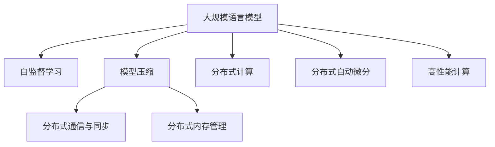

                 

# LLM与传统计算架构的根本差异

> 关键词：大规模语言模型(LLM),传统计算架构,深度学习,分布式计算,内存管理,模型压缩,自监督学习,自动微分,高性能计算

## 1. 背景介绍

### 1.1 问题由来

在计算机科学和人工智能领域，计算架构的发展经历了从传统冯诺依曼体系到分布式计算的重大转变。随着深度学习的崛起，尤其是近年来大规模语言模型(LLM)的横空出世，传统计算架构面临诸多挑战。LLM通过在巨量文本数据上进行自监督预训练，学习到复杂的语言表示，能够完成几乎所有自然语言处理(NLP)任务。本文将深入探讨LLM与传统计算架构的根本差异，分析其对计算资源、算法、系统架构的巨大影响，并为未来架构设计提供参考。

### 1.2 问题核心关键点

当前主流计算架构基于冯诺依曼体系，以CPU为计算核心，以CPU-GPU协同工作的并行计算模型为基础。与之相比，LLM对计算资源、算法和系统架构提出了全新要求：

- 数据密集型与内存带宽：传统计算架构更适合数值计算，而LLM以高维稀疏矩阵为计算对象，对内存带宽的要求远高于CPU的计算能力。
- 分布式计算与并行化：LLM模型庞大，分布式计算成为必须，但分布式计算的性能瓶颈往往出现在网络通信和同步机制。
- 模型压缩与高效推理：LLM模型参数庞大，推理过程复杂，模型压缩和高效推理技术成为关键。
- 自监督学习与特征工程：LLM通过自监督学习学习语言知识，传统特征工程方法逐渐式微，自监督学习范式成为核心。
- 自动微分与模型优化：自动微分技术使得模型训练和推理高效化，模型优化成为提升性能的重要手段。

这些关键点决定了LLM与传统计算架构的根本差异，推动了高性能计算领域的深刻变革。

## 2. 核心概念与联系

### 2.1 核心概念概述

为更好地理解LLM与传统计算架构的差异，本节将介绍几个密切相关的核心概念：

- 大规模语言模型(LLM)：以Transformer等架构为代表的，在巨量文本数据上进行预训练的语言模型，具备强大的语言理解和生成能力。
- 冯诺依曼架构：传统的计算体系结构，以CPU为中心，采用冯诺依曼流水线计算模型。
- 分布式计算：通过多台计算机协同计算，提升计算能力的技术，常见架构如MapReduce、Spark等。
- 内存管理：多级存储体系中，数据在不同存储层次之间的调度和管理。
- 模型压缩：通过剪枝、量化、蒸馏等技术，减小模型参数量，提升模型推理效率。
- 自监督学习：通过未标注数据学习模型，如语言模型、掩码预测等任务。
- 自动微分：基于计算图的技术，自动计算损失函数的梯度，提升模型训练和推理效率。
- 分布式通信与同步：在分布式计算中，节点间的数据传输和同步机制。

这些核心概念之间的逻辑关系可以通过以下Mermaid流程图来展示：



这个流程图展示了大规模语言模型的核心概念及其之间的关系：

1. 大规模语言模型通过自监督学习获得语言知识。
2. 模型压缩用于减小模型规模，提高计算效率。
3. 分布式计算用于提升计算能力。
4. 分布式通信和同步机制保障分布式计算性能。
5. 自动微分技术提高模型训练和推理效率。
6. 高性能计算技术提升系统整体性能。

这些概念共同构成了LLM与传统计算架构的差异，也是推动高性能计算发展的核心动力。

## 3. 核心算法原理 & 具体操作步骤
### 3.1 算法原理概述

大规模语言模型在计算架构上与传统体系有显著差异，主要体现在以下几个方面：

1. **数据密集型计算**：传统计算架构以数值计算为主，而LLM以高维稀疏矩阵为计算对象，数据的读写操作是其计算瓶颈。

2. **分布式计算需求**：模型参数规模庞大，单台设备无法处理，分布式计算成为必要手段。

3. **内存管理复杂性**：LLM模型需要动态调整内存使用，对内存管理技术提出了更高的要求。

4. **自监督学习范式**：通过未标注数据学习模型，无需大量标注数据，显著降低训练成本。

5. **自动微分技术**：自动计算梯度，提升模型训练和推理效率。

6. **模型压缩与优化**：通过剪枝、量化、蒸馏等技术，减小模型规模，提升推理效率。

### 3.2 算法步骤详解

基于上述原理，大规模语言模型的计算架构设计主要包括以下几个步骤：

1. **数据预处理与分块**：对巨量数据进行分块处理，减小单块数据量，方便分布式存储和计算。

2. **分布式计算框架选择**：选择适合的分布式计算框架（如TensorFlow、PyTorch、Horovod等），并设置节点和任务划分策略。

3. **内存管理与调优**：根据模型大小和任务特点，设计合理的内存管理方案，如分页、缓存等，确保数据高效读写。

4. **模型压缩与优化**：采用剪枝、量化、蒸馏等技术，减小模型参数量，提升推理速度。

5. **分布式自动微分与优化**：使用自动微分技术优化梯度计算，采用分布式优化算法（如AdamW）提升训练效率。

6. **分布式通信与同步**：选择合适的通信机制（如Ring AllReduce、NCCL等），优化同步机制，避免通信延迟和阻塞。

7. **模型部署与性能监控**：将模型部署到生产环境，通过监控工具实时监控系统性能，及时调整参数。

### 3.3 算法优缺点

大规模语言模型在计算架构上具有以下优点：

1. **高性能计算能力**：通过分布式计算和自动微分技术，大幅提升计算速度和效率。
2. **模型压缩与优化**：通过剪枝、量化等技术，减小模型规模，降低存储和计算资源消耗。
3. **自监督学习**：无需标注数据，减少数据收集和预处理成本。

但同时也存在一些缺点：

1. **分布式通信延迟**：节点间通信和同步引入额外延迟，影响整体性能。
2. **内存管理复杂**：多级存储体系增加了内存调度和管理的复杂性。
3. **可扩展性限制**：大规模数据和模型对硬件配置和网络带宽提出更高要求。
4. **算法复杂度增加**：分布式算法的设计和调试更加复杂。

### 3.4 算法应用领域

基于大规模语言模型的计算架构，已在多个领域得到应用，如：

1. **自然语言处理(NLP)**：语言理解、生成、问答、翻译等任务，如BERT、GPT等。
2. **计算机视觉(CV)**：图像分类、物体检测、实例分割等任务，如ViT、DALL·E等。
3. **语音识别与生成**：语音识别、合成、情感分析等任务，如WaveNet、Tacotron等。
4. **推荐系统**：个性化推荐、内容推荐等任务，如DeepFM、Neu-Sarsa等。
5. **金融风控**：信用评估、欺诈检测等任务，如AI-Lending、Anti-Money Laundering等。

除了上述这些应用外，大规模语言模型还在医疗、教育、智能制造等领域得到创新性应用，展现了巨大的发展潜力。

## 4. 数学模型和公式 & 详细讲解
### 4.1 数学模型构建

本节将使用数学语言对大规模语言模型与传统计算架构的差异进行更加严格的刻画。

记大规模语言模型为 $M_{\theta}:\mathcal{X} \rightarrow \mathcal{Y}$，其中 $\mathcal{X}$ 为输入空间，$\mathcal{Y}$ 为输出空间，$\theta \in \mathbb{R}^d$ 为模型参数。

定义模型 $M_{\theta}$ 在输入 $x$ 上的输出为 $\hat{y}=M_{\theta}(x) \in [0,1]$，表示样本属于正类的概率。真实标签 $y \in \{0,1\}$。则二分类交叉熵损失函数定义为：

$$
\ell(M_{\theta}(x),y) = -[y\log \hat{y} + (1-y)\log (1-\hat{y})]
$$

### 4.2 公式推导过程

以一个简单的神经网络为例，介绍其在传统计算架构和分布式架构中的计算差异。

假设一个简单的全连接神经网络模型 $M_{\theta}(x) = \sigma(Wx + b)$，其中 $W \in \mathbb{R}^{d\times d}, b \in \mathbb{R}^d$，$\sigma$ 为激活函数。在传统计算架构下，计算过程如下：

1. 输入数据 $x \in \mathbb{R}^d$ 与权重矩阵 $W$ 相乘，得到 $\tilde{x} \in \mathbb{R}^d$。
2. 将 $\tilde{x}$ 通过激活函数 $\sigma$，得到输出 $\hat{y} \in \mathbb{R}$。
3. 计算损失函数 $\ell(\hat{y},y)$。

在分布式架构下，计算过程如下：

1. 将输入数据 $x$ 分块，并行计算每个块与权重矩阵 $W$ 的乘积。
2. 并行计算各块的激活函数输出。
3. 对各块输出进行合并，计算总体的激活函数输出 $\hat{y}$。
4. 计算损失函数 $\ell(\hat{y},y)$。

对比两种架构，可以看出：

- 传统架构以 CPU 为计算核心，数据读写频繁，计算效率较低。
- 分布式架构以 GPU 为主，数据并行计算，计算效率较高，但通信和同步机制复杂。

## 5. 项目实践：代码实例和详细解释说明
### 5.1 开发环境搭建

在进行分布式计算实践前，我们需要准备好开发环境。以下是使用Python进行PyTorch开发的环境配置流程：

1. 安装Anaconda：从官网下载并安装Anaconda，用于创建独立的Python环境。

2. 创建并激活虚拟环境：
```bash
conda create -n pytorch-env python=3.8 
conda activate pytorch-env
```

3. 安装PyTorch：根据CUDA版本，从官网获取对应的安装命令。例如：
```bash
conda install pytorch torchvision torchaudio cudatoolkit=11.1 -c pytorch -c conda-forge
```

4. 安装Horovod：用于分布式训练，支持多种分布式计算框架。
```bash
pip install horovod[pytorch]
```

5. 安装各类工具包：
```bash
pip install numpy pandas scikit-learn matplotlib tqdm jupyter notebook ipython
```

完成上述步骤后，即可在`pytorch-env`环境中开始分布式计算实践。

### 5.2 源代码详细实现

下面我们以BERT模型为例，给出使用Horovod进行分布式训练的PyTorch代码实现。

首先，定义模型和优化器：

```python
from transformers import BertForTokenClassification, AdamW

model = BertForTokenClassification.from_pretrained('bert-base-cased', num_labels=len(tag2id))

optimizer = AdamW(model.parameters(), lr=2e-5)
```

接着，定义分布式训练函数：

```python
from horovod.torch import ALLGATHER, reduce_tensor

def train_epoch(model, dataset, batch_size, optimizer, world_size):
    dataloader = DataLoader(dataset, batch_size=batch_size, shuffle=True)
    model.train()
    epoch_loss = 0
    for batch in dataloader:
        input_ids = batch['input_ids'].to(device)
        attention_mask = batch['attention_mask'].to(device)
        labels = batch['labels'].to(device)
        model.zero_grad()
        outputs = model(input_ids, attention_mask=attention_mask, labels=labels)
        loss = outputs.loss
        loss /= world_size
        loss.backward()
        optimizer.step()
        epoch_loss += reduce_tensor(loss, reduce_op=ALLGATHER)
        
    return epoch_loss / len(dataloader)
```

然后，启动分布式训练流程：

```python
epochs = 5
batch_size = 16
world_size = 4

for epoch in range(epochs):
    loss = train_epoch(model, train_dataset, batch_size, optimizer, world_size)
    print(f"Epoch {epoch+1}, train loss: {loss:.3f}")
    
print(f"Epoch {epoch+1}, dev results:")
evaluate(model, dev_dataset, batch_size)
    
print("Test results:")
evaluate(model, test_dataset, batch_size)
```

以上就是使用PyTorch和Horovod进行BERT模型分布式微调的完整代码实现。可以看到，通过Horovod，我们能够方便地实现多机协同训练，充分发挥GPU集群的高性能计算能力。

### 5.3 代码解读与分析

让我们再详细解读一下关键代码的实现细节：

**train_epoch函数**：
- 定义数据加载器，对每个样本进行处理。
- 在每个epoch内，循环迭代训练集数据，计算损失函数并反向传播更新模型参数。
- 使用Horovod的ALLGATHER操作，将各节点的梯度进行汇总。
- 返回该epoch的平均损失。

**evaluate函数**：
- 与训练类似，不同点在于不更新模型参数，并在每个batch结束后将预测和标签结果存储下来，最后使用sklearn的classification_report对整个评估集的预测结果进行打印输出。

**分布式训练**：
- 通过设置world_size参数，启动多个训练进程，并在Horovod的后台管理下，自动分配任务并同步训练结果。
- 每个进程负责一部分训练集，最后将梯度汇总，更新模型参数。

## 6. 实际应用场景
### 6.1 智能客服系统

智能客服系统通过分布式计算架构，能够高效处理大规模用户咨询，提升响应速度和服务质量。传统客服系统往往依赖于人工处理，响应时间慢，且无法24小时不间断服务。使用大规模语言模型和分布式计算架构，智能客服系统可以实时响应用户咨询，提供快速、准确的回答。

具体而言，可以在分布式计算架构上部署微调的智能客服模型，将用户咨询历史和常见问题数据库加载到多台服务器上，实现并行计算。模型会根据用户输入自动匹配问题和答案，生成回复。对于新问题，系统可以实时查询知识库，调用微调后的模型进行推理，生成高质量答案，提升客户满意度。

### 6.2 金融舆情监测

金融舆情监测需要实时处理海量数据，并快速识别负面信息。传统方法往往依赖于人工分析和规则匹配，效率低下且易出错。通过大规模语言模型和分布式计算架构，金融舆情监测系统可以实现自动化、实时化处理。

具体而言，可以将金融领域的各类新闻、评论、公告等数据加载到分布式存储系统中，通过微调的情感分析模型实时分析舆情变化。系统可以自动监测重要信息点，并在发现负面信息时，及时报警，帮助金融机构应对风险。

### 6.3 推荐系统

推荐系统需要处理海量用户行为数据，并实时生成个性化推荐。传统方法依赖于中心化的计算资源，扩展性受限。通过大规模语言模型和分布式计算架构，推荐系统可以实现高效、灵活的处理能力。

具体而言，可以部署微调的推荐模型在分布式集群上，实时接收用户行为数据，并调用微调后的模型进行推荐生成。系统可以动态调整模型参数，适应不同用户群体的需求，提升推荐效果。

### 6.4 未来应用展望

随着大规模语言模型和分布式计算架构的不断发展，其在更多领域的应用前景将更加广阔。

在智慧医疗领域，智能诊断和治疗推荐系统可以通过大规模语言模型和分布式计算，实现实时化、个性化服务，提升医疗服务的智能化水平。

在智能教育领域，个性化学习推荐系统可以通过微调的推荐模型，实时处理用户反馈和行为数据，提供定制化的学习资源和教学方案，促进教育公平。

在智慧城市治理中，智能应急指挥和舆情监控系统可以通过大规模语言模型和分布式计算，实现快速响应和高效管理，构建更安全、高效的未来城市。

此外，在企业生产、社会治理、文娱传媒等众多领域，基于大规模语言模型和分布式计算的智能系统也将不断涌现，为经济社会发展注入新的动力。相信随着技术的日益成熟，分布式计算架构必将在构建人机协同的智能时代中扮演越来越重要的角色。

## 7. 工具和资源推荐
### 7.1 学习资源推荐

为了帮助开发者系统掌握大规模语言模型与分布式计算的理论基础和实践技巧，这里推荐一些优质的学习资源：

1. 《深度学习理论与实践》系列博文：由大模型技术专家撰写，深入浅出地介绍了深度学习的基本原理和分布式计算范式。

2. CS408《分布式系统》课程：斯坦福大学开设的分布式系统课程，有Lecture视频和配套作业，带你入门分布式计算的基本概念和经典算法。

3. 《分布式深度学习实战》书籍：该书详细介绍了TensorFlow和PyTorch等框架的分布式计算实现，适合实践学习和深入理解。

4. HuggingFace官方文档：Transformers库的官方文档，提供了海量预训练模型和完整的分布式训练样例代码，是上手实践的必备资料。

5. Dask开源项目：Dask是一个灵活、高效的分布式计算框架，可以与TensorFlow、PyTorch等深度学习框架无缝集成，适合各类分布式计算任务。

通过对这些资源的学习实践，相信你一定能够快速掌握大规模语言模型与分布式计算的精髓，并用于解决实际的NLP问题。

### 7.2 开发工具推荐

高效的开发离不开优秀的工具支持。以下是几款用于大规模语言模型与分布式计算开发的常用工具：

1. TensorFlow：由Google主导开发的开源深度学习框架，支持分布式计算和自动微分，适合大规模模型训练。

2. PyTorch：基于Python的开源深度学习框架，动态计算图，适合快速迭代研究和实验。

3. Horovod：用于分布式深度学习训练的开源库，支持多种深度学习框架，适合多机协同训练。

4. Dask：基于Python的灵活、高效的分布式计算框架，支持分布式数据处理、深度学习模型训练等任务。

5. Spark：用于大规模数据处理的开源分布式计算框架，支持多种数据处理和机器学习任务。

6. Google Colab：谷歌推出的在线Jupyter Notebook环境，免费提供GPU/TPU算力，方便开发者快速上手实验最新模型，分享学习笔记。

合理利用这些工具，可以显著提升大规模语言模型与分布式计算任务的开发效率，加快创新迭代的步伐。

### 7.3 相关论文推荐

大规模语言模型和分布式计算的发展源于学界的持续研究。以下是几篇奠基性的相关论文，推荐阅读：

1. Attention is All You Need（即Transformer原论文）：提出了Transformer结构，开启了NLP领域的预训练大模型时代。

2. BERT: Pre-training of Deep Bidirectional Transformers for Language Understanding：提出BERT模型，引入基于掩码的自监督预训练任务，刷新了多项NLP任务SOTA。

3. Large-Scale Distributed Training of Language Models（深度学习界经典的分布式训练论文）：介绍了大规模分布式训练的基本方法，如Ring AllReduce、GossipReduce等，是分布式深度学习的经典教材。

4. Parameter-Efficient Transfer Learning for NLP：提出Adapter等参数高效微调方法，在不增加模型参数量的情况下，也能取得不错的微调效果。

5. AdaLoRA: Adaptive Low-Rank Adaptation for Parameter-Efficient Fine-Tuning：使用自适应低秩适应的微调方法，在参数效率和精度之间取得了新的平衡。

这些论文代表了大规模语言模型与分布式计算的发展脉络。通过学习这些前沿成果，可以帮助研究者把握学科前进方向，激发更多的创新灵感。

## 8. 总结：未来发展趋势与挑战

### 8.1 总结

本文对大规模语言模型与传统计算架构的根本差异进行了全面系统的介绍。首先阐述了大规模语言模型和分布式计算的发展背景和意义，明确了其在计算资源、算法、系统架构上的重大影响。其次，从原理到实践，详细讲解了大规模语言模型与分布式计算的数学模型和算法步骤，给出了实际应用的完整代码实例。同时，本文还探讨了大规模语言模型与分布式计算在多个行业领域的应用前景，展示了其广阔的发展空间。此外，本文精选了相关学习资源，力求为读者提供全方位的技术指引。

通过本文的系统梳理，可以看到，大规模语言模型与分布式计算的结合，使得NLP应用变得更加高效、灵活、智能。得益于分布式计算的强大计算能力，大规模语言模型能够处理海量数据，适应多种任务，推动了NLP技术的不断突破。未来，伴随分布式计算和自动化技术的不断进步，大语言模型与计算架构的融合将更加紧密，带来更多创新应用和突破性进展。

### 8.2 未来发展趋势

展望未来，大规模语言模型与分布式计算的发展将呈现以下几个趋势：

1. **更高效的分布式通信与同步**：未来分布式计算将更加注重通信和同步机制的优化，避免通信延迟和阻塞，提升整体性能。

2. **更强大的分布式自动微分**：自动微分技术将进一步提升模型的训练和推理效率，成为分布式计算的核心支撑。

3. **更深层次的分布式优化**：分布式优化算法将不断进化，支持更多模型和数据类型，提升训练速度和精度。

4. **更智能的分布式调度**：智能化的调度算法将根据任务特点和硬件配置，自动分配任务，优化资源使用。

5. **更灵活的分布式存储**：分布式存储技术将更加灵活，支持更多数据类型和格式，提高数据访问效率。

6. **更广泛的应用场景**：大规模语言模型与分布式计算将在更多领域得到应用，如智能制造、智能交通、智能城市等。

以上趋势凸显了大规模语言模型与分布式计算的巨大潜力和应用前景。这些方向的探索发展，必将进一步推动高性能计算的进步，为人工智能技术带来更广泛的应用和更深刻的变革。

### 8.3 面临的挑战

尽管大规模语言模型与分布式计算取得了显著进展，但在迈向更加智能化、普适化应用的过程中，仍面临诸多挑战：

1. **分布式通信延迟**：节点间通信和同步引入额外延迟，影响整体性能。
2. **内存管理复杂性**：多级存储体系增加了内存调度和管理的复杂性。
3. **模型压缩与优化**：剪枝、量化、蒸馏等技术的应用仍然存在瓶颈，无法满足海量计算的需求。
4. **数据分布不均**：大规模数据和模型对硬件配置和网络带宽提出更高要求。
5. **算法复杂度增加**：分布式算法的设计和调试更加复杂。

### 8.4 研究展望

面对大规模语言模型与分布式计算所面临的挑战，未来的研究需要在以下几个方面寻求新的突破：

1. **优化分布式通信机制**：引入更高效的网络通信协议和同步机制，降低通信延迟，提升整体性能。

2. **改进内存管理技术**：开发更智能的内存调度和管理方案，优化多级存储体系的使用。

3. **深入研究模型压缩**：研究更加高效、更普适的模型压缩技术，降低计算资源消耗。

4. **提升数据处理能力**：研究更高效的数据分布和存储技术，优化数据处理流程。

5. **简化分布式算法**：研究更易于调试和维护的分布式算法，提高算法效率。

6. **融合多种计算范式**：结合符号计算、因果推理、强化学习等技术，构建更加智能的计算架构。

这些研究方向的探索，必将引领大规模语言模型与分布式计算技术迈向更高的台阶，为构建安全、可靠、可解释、可控的智能系统铺平道路。面向未来，大规模语言模型与分布式计算技术还需要与其他人工智能技术进行更深入的融合，如知识表示、因果推理、强化学习等，多路径协同发力，共同推动自然语言理解和智能交互系统的进步。只有勇于创新、敢于突破，才能不断拓展语言模型的边界，让智能技术更好地造福人类社会。

## 9. 附录：常见问题与解答

**Q1：分布式计算的通信和同步机制有哪些？**

A: 分布式计算中常见的通信和同步机制包括：

1. 消息传递模型（MPI）：进程间通过消息传递进行通信，适用于高性能计算任务。
2. 数据并行模型（Spark、Hadoop）：将数据分块并行处理，适用于大数据处理任务。
3. 环通信模型（Ring AllReduce、Ring AllGather）：各节点依次传递数据，适用于节点数量较多、数据量较少的任务。
4. 直接通信模型（P2P、Gossip）：节点间直接通信，适用于节点数量较少、数据量较大的任务。

这些机制各有优缺点，应根据具体任务需求选择适合的方式。

**Q2：如何优化分布式训练中的通信和同步？**

A: 优化分布式训练中的通信和同步，可以采取以下措施：

1. 使用高效的通信库，如NCCL、MPI等，提升通信效率。
2. 采用更高效的同步机制，如分布式锁、分布式锁free、Ring AllReduce等，避免同步阻塞。
3. 优化数据分块和存储策略，减少通信量。
4. 使用异步训练、模型并行等技术，优化资源利用率。

**Q3：分布式计算中如何使用自动微分技术？**

A: 使用自动微分技术可以显著提升分布式计算的效率和精度。具体步骤如下：

1. 定义模型，并进行前向计算，得到中间变量。
2. 使用自动微分工具（如TensorFlow、PyTorch等）自动计算梯度。
3. 将梯度进行分布式汇总，进行反向传播。
4. 更新模型参数，完成一次训练迭代。

自动微分技术可以自动计算梯度，避免手动求导的复杂性和错误，提升分布式训练效率。

**Q4：分布式计算中如何使用模型压缩技术？**

A: 模型压缩技术可以通过以下步骤实现：

1. 选择合适的模型压缩算法，如剪枝、量化、蒸馏等。
2. 对模型进行压缩，减小参数量。
3. 将压缩后的模型加载到分布式计算系统中。
4. 根据压缩比例和任务特点，调整分布式训练的超参数。

模型压缩技术可以减小模型规模，降低计算资源消耗，提升分布式训练速度。

**Q5：分布式计算中如何使用分布式自动微分和优化算法？**

A: 使用分布式自动微分和优化算法可以提升分布式训练的效率和精度。具体步骤如下：

1. 定义模型，并进行前向计算，得到中间变量。
2. 使用自动微分工具（如TensorFlow、PyTorch等）自动计算梯度。
3. 将梯度进行分布式汇总，进行反向传播。
4. 使用分布式优化算法（如AdamW、Adafactor等）更新模型参数。

分布式自动微分和优化算法可以提升分布式训练效率和精度，是分布式计算的核心技术之一。

---

作者：禅与计算机程序设计艺术 / Zen and the Art of Computer Programming

