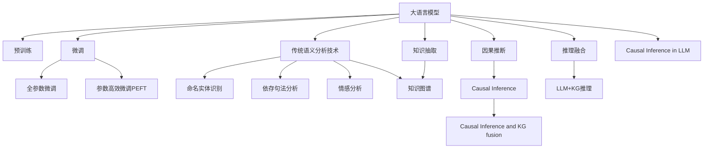

                 

# LLM与传统语义分析技术的融合：语言理解新高度

## 1. 背景介绍

### 1.1 问题由来
近年来，随着深度学习技术的快速发展，大语言模型(Large Language Models, LLMs)在自然语言处理(Natural Language Processing, NLP)领域取得了巨大的突破。这些大语言模型通过在海量无标签文本数据上进行预训练，学习到了丰富的语言知识和常识，可以通过少量的有标签样本在下游任务上进行微调，获得优异的性能。其中最具代表性的大语言模型包括OpenAI的GPT系列模型、Google的BERT、T5等。

然而，尽管大语言模型在自然语言处理方面取得了卓越的成就，其在处理特定领域的语义分析任务时仍存在一些限制。传统语义分析技术在特定领域的应用历史悠久，已形成一套完备的方法论和工具链。因此，如何将大语言模型与传统语义分析技术进行有效融合，发挥两者的优势，成为当前NLP研究的一个重要方向。

### 1.2 问题核心关键点
本节将探讨大语言模型与传统语义分析技术的融合问题，旨在回答以下几个关键问题：
1. 大语言模型在特定领域的应用现状和局限性是什么？
2. 传统语义分析技术在特定领域的应用方法和优势有哪些？
3. 如何将大语言模型与传统语义分析技术进行有效融合？
4. 融合后的语言理解系统有哪些新特点和优势？

## 2. 核心概念与联系

### 2.1 核心概念概述

为更好地理解大语言模型与传统语义分析技术的融合，本节将介绍几个密切相关的核心概念：

- 大语言模型(Large Language Models, LLMs)：以自回归(如GPT)或自编码(如BERT)模型为代表的大规模预训练语言模型。通过在海量无标签文本数据上进行预训练，学习到通用的语言表示，具备强大的语言理解和生成能力。

- 预训练(Pre-training)：指在大规模无标签文本语料上，通过自监督学习任务训练通用语言模型的过程。常见的预训练任务包括言语建模、掩码语言模型等。预训练使得模型学习到语言的通用表示。

- 微调(Fine-tuning)：指在预训练模型的基础上，使用下游任务的少量标注数据，通过有监督学习优化模型在该任务上的性能。通常只需要调整顶层分类器或解码器，并以较小的学习率更新全部或部分的模型参数。

- 传统语义分析技术：指在特定领域内，通过规则、特征工程、统计模型等方法对自然语言文本进行结构化分析和理解的技术，如命名实体识别(NER)、依存句法分析、情感分析等。

- 知识图谱(Knowledge Graph)：以实体、关系和属性为核心，构建而成的语义网络，用于描述实体之间的复杂关系和背景知识。

- 因果推断(Causal Inference)：研究变量之间的因果关系及其概率的统计学方法，旨在从数据中发现原因和结果之间的内在联系。

这些核心概念之间的逻辑关系可以通过以下Mermaid流程图来展示：



这个流程图展示了大语言模型、传统语义分析技术、知识图谱和因果推断之间的联系和融合方向：

1. 大语言模型通过预训练获得基础能力。
2. 微调是在预训练模型基础上对特定任务进行优化，可以分为全参数微调和参数高效微调。
3. 传统语义分析技术提供了基于规则和统计模型的特定领域分析方法。
4. 知识图谱为自然语言理解和推理提供了结构化的背景知识。
5. 因果推断方法用于揭示变量之间的因果关系，提升推理的可靠性和合理性。
6. 通过知识抽取将传统语义分析技术的结果整合进知识图谱。
7. 将因果推断与知识图谱进行融合，增强推理的准确性和可信度。
8. 推理融合将大语言模型与知识图谱和因果推断结合，实现更复杂的语言理解任务。

这些概念共同构成了语言理解的综合框架，使得大语言模型能够更好地适应特定领域的应用需求。

## 3. 核心算法原理 & 具体操作步骤
### 3.1 算法原理概述

大语言模型与传统语义分析技术的融合，本质上是一个跨模态的语义分析过程。其核心思想是：将大语言模型的语言表示能力与传统语义分析技术的结构化分析能力进行有机结合，构建起更为全面、准确的自然语言理解系统。

具体而言，假设预训练大语言模型为 $M_{\theta}$，其中 $\theta$ 为预训练得到的模型参数。给定一个特定领域的标注数据集 $D=\{(x_i, y_i)\}_{i=1}^N$，其中 $x_i$ 为文本数据，$y_i$ 为结构化标签，融合过程的目标是找到新的模型参数 $\hat{\theta}$，使得 $M_{\hat{\theta}}$ 在特定领域上的表现最佳：

$$
\hat{\theta}=\mathop{\arg\min}_{\theta} \mathcal{L}(M_{\theta},D)
$$

其中 $\mathcal{L}$ 为针对特定领域设计的损失函数，用于衡量模型输出与真实标签之间的差异。常见的损失函数包括交叉熵损失、均方误差损失等。

通过梯度下降等优化算法，融合过程不断更新模型参数 $\theta$，最小化损失函数 $\mathcal{L}$，使得模型输出逼近真实标签。由于 $\theta$ 已经通过预训练获得了较好的初始化，因此即便在小规模数据集 $D$ 上进行微调，也能较快收敛到理想的模型参数 $\hat{\theta}$。

### 3.2 算法步骤详解

基于大语言模型与传统语义分析技术的融合，一般包括以下几个关键步骤：

**Step 1: 准备预训练模型和数据集**
- 选择合适的预训练语言模型 $M_{\theta}$ 作为初始化参数，如 BERT、GPT 等。
- 准备特定领域的标注数据集 $D$，划分为训练集、验证集和测试集。一般要求标注数据与预训练数据的分布不要差异过大。

**Step 2: 添加任务适配层**
- 根据任务类型，在预训练模型顶层设计合适的输出层和损失函数。
- 对于结构化任务，通常在顶层添加结构化输出层和结构化损失函数，如对于NER任务，可添加条件随机场(CRF)或隐马尔可夫模型(HMM)等。

**Step 3: 设置融合超参数**
- 选择合适的优化算法及其参数，如 AdamW、SGD 等，设置学习率、批大小、迭代轮数等。
- 设置正则化技术及强度，包括权重衰减、Dropout、Early Stopping 等。
- 确定冻结预训练参数的策略，如仅微调顶层，或全部参数都参与微调。

**Step 4: 执行融合训练**
- 将训练集数据分批次输入模型，前向传播计算损失函数。
- 反向传播计算参数梯度，根据设定的优化算法和学习率更新模型参数。
- 周期性在验证集上评估模型性能，根据性能指标决定是否触发 Early Stopping。
- 重复上述步骤直到满足预设的迭代轮数或 Early Stopping 条件。

**Step 5: 测试和部署**
- 在测试集上评估融合后模型 $M_{\hat{\theta}}$ 的性能，对比融合前后的精度提升。
- 使用融合后的模型对新样本进行推理预测，集成到实际的应用系统中。
- 持续收集新的数据，定期重新融合模型，以适应数据分布的变化。

以上是基于大语言模型与传统语义分析技术融合的一般流程。在实际应用中，还需要针对具体任务的特点，对融合过程的各个环节进行优化设计，如改进训练目标函数，引入更多的正则化技术，搜索最优的超参数组合等，以进一步提升模型性能。

### 3.3 算法优缺点

大语言模型与传统语义分析技术的融合方法具有以下优点：
1. 融合互补优势。大语言模型擅长处理海量无标签文本数据，获得通用的语言表示；传统语义分析技术擅长结构化分析和特定领域的知识提取。
2. 提高泛化能力。通过融合，模型能更好地理解特定领域的语言特征和背景知识，从而在特定领域取得更优的表现。
3. 知识复用。已有结构化知识可以通过知识图谱等方式引入到语言理解系统中，提高系统的整体知识水平。
4. 可解释性强。传统语义分析技术通常以规则或统计模型为基础，其推理过程具有较强的可解释性。

同时，该方法也存在一些局限性：
1. 模型复杂度高。融合后的模型通常需要更多的参数和计算资源，增加了部署难度。
2. 知识更新慢。结构化知识库的维护和更新往往较为缓慢，难以实时适应数据分布的变化。
3. 规则依赖。传统语义分析技术需要依赖特定的领域规则，可能存在规则设计上的局限性。
4. 数据标注难度。融合过程中仍需要大量标注数据，标注成本较高。
5. 效果差异。不同类型的任务和数据可能对融合效果的提升存在差异，部分任务效果可能不如预期。

尽管存在这些局限性，但就目前而言，融合方法是大语言模型应用领域的重要方向之一。未来相关研究的重点在于如何进一步降低融合过程中的标注成本，提高知识图谱和因果推理的自动化构建和更新能力，同时兼顾模型性能和可解释性。

### 3.4 算法应用领域

大语言模型与传统语义分析技术的融合方法，在NLP领域已经得到了广泛的应用，覆盖了几乎所有常见任务，例如：

- 命名实体识别(NER)：识别文本中的人名、地名、机构名等特定实体。通过融合，将大语言模型的语言理解能力与传统NER的规则分析结合起来，提升识别精度。
- 依存句法分析：分析句子中词语之间的关系。通过融合，利用大语言模型的语言表示和传统句法分析的统计模型，进行更为全面的句法分析。
- 情感分析：对文本进行情感倾向判断。通过融合，结合大语言模型的语言理解和传统情感分析的规则提取，提升情感分析的准确性。
- 问答系统：对自然语言问题给出答案。将问题-答案对作为监督数据，利用大语言模型和传统知识抽取方法，构建高效的问答系统。
- 机器翻译：将源语言文本翻译成目标语言。通过融合，结合大语言模型的语言理解和传统机器翻译的统计模型，提升翻译质量。
- 文本摘要：将长文本压缩成简短摘要。通过融合，将大语言模型的语言生成能力与传统摘要的统计方法结合，生成更合理的摘要。

除了上述这些经典任务外，大语言模型与传统语义分析技术的融合方法也被创新性地应用到更多场景中，如可控文本生成、多模态信息融合、跨语言理解等，为NLP技术带来了全新的突破。

## 4. 数学模型和公式 & 详细讲解  
### 4.1 数学模型构建

本节将使用数学语言对大语言模型与传统语义分析技术的融合过程进行更加严格的刻画。

记预训练语言模型为 $M_{\theta}$，其中 $\theta$ 为预训练得到的模型参数。假设特定领域的标注数据集为 $D=\{(x_i,y_i)\}_{i=1}^N$，其中 $x_i$ 为文本数据，$y_i$ 为结构化标签。

定义模型 $M_{\theta}$ 在输入 $x$ 上的结构化输出为 $\hat{y}=M_{\theta}(x)$，表示模型对输入文本 $x$ 的结构化分析结果。

融合过程的目标是最小化损失函数 $\mathcal{L}$，即找到最优参数：

$$
\hat{\theta}=\mathop{\arg\min}_{\theta} \mathcal{L}(M_{\theta},D)
$$

在实践中，我们通常使用基于梯度的优化算法（如SGD、Adam等）来近似求解上述最优化问题。设 $\eta$ 为学习率，$\lambda$ 为正则化系数，则参数的更新公式为：

$$
\theta \leftarrow \theta - \eta \nabla_{\theta}\mathcal{L}(\theta) - \eta\lambda\theta
$$

其中 $\nabla_{\theta}\mathcal{L}(\theta)$ 为损失函数对参数 $\theta$ 的梯度，可通过反向传播算法高效计算。

### 4.2 公式推导过程

以下我们以命名实体识别(NER)任务为例，推导融合后的损失函数及其梯度的计算公式。

假设模型 $M_{\theta}$ 在输入 $x$ 上的结构化输出为 $\hat{y}=M_{\theta}(x) \in \mathcal{Y}$，其中 $\mathcal{Y}$ 为结构化标签空间。定义损失函数 $\ell(\hat{y},y)$ 为 $\hat{y}$ 与 $y$ 之间的距离，常见的损失函数包括交叉熵损失、hinge损失等。

在NER任务中，$\hat{y}$ 表示识别结果的序列，每个位置上的标签表示是否包含实体以及实体的类型。假设标签序列长度为 $L$，则损失函数定义为：

$$
\ell(\hat{y},y) = \sum_{i=1}^L \ell_i(\hat{y}_i,y_i)
$$

其中 $\ell_i(\hat{y}_i,y_i)$ 表示位置 $i$ 上的损失，可以采用交叉熵损失：

$$
\ell_i(\hat{y}_i,y_i) = -y_i \log \hat{y}_i - (1-y_i) \log (1-\hat{y}_i)
$$

融合后的损失函数定义为：

$$
\mathcal{L}(\theta) = \frac{1}{N} \sum_{i=1}^N \ell(\hat{y},y)
$$

将结构化输出序列 $\hat{y}$ 代入损失函数，得到融合后的损失函数：

$$
\mathcal{L}(\theta) = \frac{1}{N} \sum_{i=1}^N \sum_{j=1}^L \ell_i(\hat{y}_i,y_i)
$$

根据链式法则，损失函数对参数 $\theta$ 的梯度为：

$$
\frac{\partial \mathcal{L}(\theta)}{\partial \theta_k} = \frac{1}{N} \sum_{i=1}^N \sum_{j=1}^L \frac{\partial \ell_i(\hat{y}_i,y_i)}{\partial \hat{y}_i} \frac{\partial \hat{y}_i}{\partial \theta_k}
$$

其中 $\frac{\partial \ell_i(\hat{y}_i,y_i)}{\partial \hat{y}_i}$ 为交叉熵损失对结构化输出的导数，$\frac{\partial \hat{y}_i}{\partial \theta_k}$ 为预训练模型对结构化输出的导数，可通过反向传播算法高效计算。

在得到损失函数的梯度后，即可带入参数更新公式，完成模型的迭代优化。重复上述过程直至收敛，最终得到适应特定领域的最优模型参数 $\theta^*$。

## 5. 项目实践：代码实例和详细解释说明
### 5.1 开发环境搭建

在进行融合实践前，我们需要准备好开发环境。以下是使用Python进行PyTorch开发的环境配置流程：

1. 安装Anaconda：从官网下载并安装Anaconda，用于创建独立的Python环境。

2. 创建并激活虚拟环境：
```bash
conda create -n pytorch-env python=3.8 
conda activate pytorch-env
```

3. 安装PyTorch：根据CUDA版本，从官网获取对应的安装命令。例如：
```bash
conda install pytorch torchvision torchaudio cudatoolkit=11.1 -c pytorch -c conda-forge
```

4. 安装Transformers库：
```bash
pip install transformers
```

5. 安装各类工具包：
```bash
pip install numpy pandas scikit-learn matplotlib tqdm jupyter notebook ipython
```

完成上述步骤后，即可在`pytorch-env`环境中开始融合实践。

### 5.2 源代码详细实现

下面我们以命名实体识别(NER)任务为例，给出使用Transformers库对BERT模型进行融合的PyTorch代码实现。

首先，定义NER任务的数据处理函数：

```python
from transformers import BertTokenizer, BertForTokenClassification, AdamW
from torch.utils.data import Dataset
import torch

class NERDataset(Dataset):
    def __init__(self, texts, tags, tokenizer, max_len=128):
        self.texts = texts
        self.tags = tags
        self.tokenizer = tokenizer
        self.max_len = max_len
        
    def __len__(self):
        return len(self.texts)
    
    def __getitem__(self, item):
        text = self.texts[item]
        tags = self.tags[item]
        
        encoding = self.tokenizer(text, return_tensors='pt', max_length=self.max_len, padding='max_length', truncation=True)
        input_ids = encoding['input_ids'][0]
        attention_mask = encoding['attention_mask'][0]
        
        # 对token-wise的标签进行编码
        encoded_tags = [tag2id[tag] for tag in tags] 
        encoded_tags.extend([tag2id['O']] * (self.max_len - len(encoded_tags)))
        labels = torch.tensor(encoded_tags, dtype=torch.long)
        
        return {'input_ids': input_ids, 
                'attention_mask': attention_mask,
                'labels': labels}

# 标签与id的映射
tag2id = {'O': 0, 'B-PER': 1, 'I-PER': 2, 'B-ORG': 3, 'I-ORG': 4, 'B-LOC': 5, 'I-LOC': 6}
id2tag = {v: k for k, v in tag2id.items()}

# 创建dataset
tokenizer = BertTokenizer.from_pretrained('bert-base-cased')

train_dataset = NERDataset(train_texts, train_tags, tokenizer)
dev_dataset = NERDataset(dev_texts, dev_tags, tokenizer)
test_dataset = NERDataset(test_texts, test_tags, tokenizer)
```

然后，定义模型和优化器：

```python
from transformers import BertForTokenClassification, AdamW

model = BertForTokenClassification.from_pretrained('bert-base-cased', num_labels=len(tag2id))

optimizer = AdamW(model.parameters(), lr=2e-5)
```

接着，定义训练和评估函数：

```python
from torch.utils.data import DataLoader
from tqdm import tqdm
from sklearn.metrics import classification_report

device = torch.device('cuda') if torch.cuda.is_available() else torch.device('cpu')
model.to(device)

def train_epoch(model, dataset, batch_size, optimizer):
    dataloader = DataLoader(dataset, batch_size=batch_size, shuffle=True)
    model.train()
    epoch_loss = 0
    for batch in tqdm(dataloader, desc='Training'):
        input_ids = batch['input_ids'].to(device)
        attention_mask = batch['attention_mask'].to(device)
        labels = batch['labels'].to(device)
        model.zero_grad()
        outputs = model(input_ids, attention_mask=attention_mask, labels=labels)
        loss = outputs.loss
        epoch_loss += loss.item()
        loss.backward()
        optimizer.step()
    return epoch_loss / len(dataloader)

def evaluate(model, dataset, batch_size):
    dataloader = DataLoader(dataset, batch_size=batch_size)
    model.eval()
    preds, labels = [], []
    with torch.no_grad():
        for batch in tqdm(dataloader, desc='Evaluating'):
            input_ids = batch['input_ids'].to(device)
            attention_mask = batch['attention_mask'].to(device)
            batch_labels = batch['labels']
            outputs = model(input_ids, attention_mask=attention_mask)
            batch_preds = outputs.logits.argmax(dim=2).to('cpu').tolist()
            batch_labels = batch_labels.to('cpu').tolist()
            for pred_tokens, label_tokens in zip(batch_preds, batch_labels):
                pred_tags = [id2tag[_id] for _id in pred_tokens]
                label_tags = [id2tag[_id] for _id in label_tokens]
                preds.append(pred_tags[:len(label_tags)])
                labels.append(label_tags)
                
    print(classification_report(labels, preds))
```

最后，启动训练流程并在测试集上评估：

```python
epochs = 5
batch_size = 16

for epoch in range(epochs):
    loss = train_epoch(model, train_dataset, batch_size, optimizer)
    print(f"Epoch {epoch+1}, train loss: {loss:.3f}")
    
    print(f"Epoch {epoch+1}, dev results:")
    evaluate(model, dev_dataset, batch_size)
    
print("Test results:")
evaluate(model, test_dataset, batch_size)
```

以上就是使用PyTorch对BERT进行命名实体识别任务融合的完整代码实现。可以看到，得益于Transformers库的强大封装，我们可以用相对简洁的代码完成BERT模型的加载和融合。

### 5.3 代码解读与分析

让我们再详细解读一下关键代码的实现细节：

**NERDataset类**：
- `__init__`方法：初始化文本、标签、分词器等关键组件。
- `__len__`方法：返回数据集的样本数量。
- `__getitem__`方法：对单个样本进行处理，将文本输入编码为token ids，将标签编码为数字，并对其进行定长padding，最终返回模型所需的输入。

**tag2id和id2tag字典**：
- 定义了标签与数字id之间的映射关系，用于将token-wise的预测结果解码回真实的标签。

**训练和评估函数**：
- 使用PyTorch的DataLoader对数据集进行批次化加载，供模型训练和推理使用。
- 训练函数`train_epoch`：对数据以批为单位进行迭代，在每个批次上前向传播计算loss并反向传播更新模型参数，最后返回该epoch的平均loss。
- 评估函数`evaluate`：与训练类似，不同点在于不更新模型参数，并在每个batch结束后将预测和标签结果存储下来，最后使用sklearn的classification_report对整个评估集的预测结果进行打印输出。

**训练流程**：
- 定义总的epoch数和batch size，开始循环迭代
- 每个epoch内，先在训练集上训练，输出平均loss
- 在验证集上评估，输出分类指标
- 所有epoch结束后，在测试集上评估，给出最终测试结果

可以看到，PyTorch配合Transformers库使得BERT融合的代码实现变得简洁高效。开发者可以将更多精力放在数据处理、模型改进等高层逻辑上，而不必过多关注底层的实现细节。

当然，工业级的系统实现还需考虑更多因素，如模型的保存和部署、超参数的自动搜索、更灵活的任务适配层等。但核心的融合范式基本与此类似。

## 6. 实际应用场景
### 6.1 智能客服系统

基于大语言模型与传统语义分析技术的融合，智能客服系统的构建得以实现。传统客服往往需要配备大量人力，高峰期响应缓慢，且一致性和专业性难以保证。而使用融合后的对话模型，可以7x24小时不间断服务，快速响应客户咨询，用自然流畅的语言解答各类常见问题。

在技术实现上，可以收集企业内部的历史客服对话记录，将问题和最佳答复构建成监督数据，在此基础上对融合后的对话模型进行训练。融合后的对话模型能够自动理解用户意图，匹配最合适的答案模板进行回复。对于客户提出的新问题，还可以接入检索系统实时搜索相关内容，动态组织生成回答。如此构建的智能客服系统，能大幅提升客户咨询体验和问题解决效率。

### 6.2 金融舆情监测

金融机构需要实时监测市场舆论动向，以便及时应对负面信息传播，规避金融风险。传统的人工监测方式成本高、效率低，难以应对网络时代海量信息爆发的挑战。基于大语言模型与传统语义分析技术的融合文本分类和情感分析技术，为金融舆情监测提供了新的解决方案。

具体而言，可以收集金融领域相关的新闻、报道、评论等文本数据，并对其进行主题标注和情感标注。在此基础上对融合后的语言模型进行训练，使其能够自动判断文本属于何种主题，情感倾向是正面、中性还是负面。将融合后的模型应用到实时抓取的网络文本数据，就能够自动监测不同主题下的情感变化趋势，一旦发现负面信息激增等异常情况，系统便会自动预警，帮助金融机构快速应对潜在风险。

### 6.3 个性化推荐系统

当前的推荐系统往往只依赖用户的历史行为数据进行物品推荐，无法深入理解用户的真实兴趣偏好。基于大语言模型与传统语义分析技术的融合个性化推荐系统可以更好地挖掘用户行为背后的语义信息，从而提供更精准、多样的推荐内容。

在实践中，可以收集用户浏览、点击、评论、分享等行为数据，提取和用户交互的物品标题、描述、标签等文本内容。将文本内容作为模型输入，用户的后续行为（如是否点击、购买等）作为监督信号，在此基础上训练融合后的语言模型。融合后的模型能够从文本内容中准确把握用户的兴趣点。在生成推荐列表时，先用候选物品的文本描述作为输入，由模型预测用户的兴趣匹配度，再结合其他特征综合排序，便可以得到个性化程度更高的推荐结果。

### 6.4 未来应用展望

随着大语言模型与传统语义分析技术的不断发展，基于融合范式将在更多领域得到应用，为传统行业带来变革性影响。

在智慧医疗领域，基于融合的医疗问答、病历分析、药物研发等应用将提升医疗服务的智能化水平，辅助医生诊疗，加速新药开发进程。

在智能教育领域，融合技术可应用于作业批改、学情分析、知识推荐等方面，因材施教，促进教育公平，提高教学质量。

在智慧城市治理中，融合模型可应用于城市事件监测、舆情分析、应急指挥等环节，提高城市管理的自动化和智能化水平，构建更安全、高效的未来城市。

此外，在企业生产、社会治理、文娱传媒等众多领域，基于大语言模型与传统语义分析技术的融合技术也将不断涌现，为经济社会发展注入新的动力。相信随着技术的日益成熟，融合方法将成为人工智能落地应用的重要范式，推动人工智能技术在垂直行业的规模化落地。

## 7. 工具和资源推荐
### 7.1 学习资源推荐

为了帮助开发者系统掌握大语言模型与传统语义分析技术的融合理论基础和实践技巧，这里推荐一些优质的学习资源：

1. 《Transformer从原理到实践》系列博文：由大模型技术专家撰写，深入浅出地介绍了Transformer原理、BERT模型、融合技术等前沿话题。

2. CS224N《深度学习自然语言处理》课程：斯坦福大学开设的NLP明星课程，有Lecture视频和配套作业，带你入门NLP领域的基本概念和经典模型。

3. 《Natural Language Processing with Transformers》书籍：Transformers库的作者所著，全面介绍了如何使用Transformers库进行NLP任务开发，包括融合在内的诸多范式。

4. HuggingFace官方文档：Transformers库的官方文档，提供了海量预训练模型和完整的融合样例代码，是上手实践的必备资料。

5. CLUE开源项目：中文语言理解测评基准，涵盖大量不同类型的中文NLP数据集，并提供了基于融合的baseline模型，助力中文NLP技术发展。

通过对这些资源的学习实践，相信你一定能够快速掌握大语言模型与传统语义分析技术的融合精髓，并用于解决实际的NLP问题。
###  7.2 开发工具推荐

高效的开发离不开优秀的工具支持。以下是几款用于大语言模型与传统语义分析技术融合开发的常用工具：

1. PyTorch：基于Python的开源深度学习框架，灵活动态的计算图，适合快速迭代研究。大部分预训练语言模型都有PyTorch版本的实现。

2. TensorFlow：由Google主导开发的开源深度学习框架，生产部署方便，适合大规模工程应用。同样有丰富的预训练语言模型资源。

3. Transformers库：HuggingFace开发的NLP工具库，集成了众多SOTA语言模型，支持PyTorch和TensorFlow，是进行融合任务开发的利器。

4. Weights & Biases：模型训练的实验跟踪工具，可以记录和可视化模型训练过程中的各项指标，方便对比和调优。与主流深度学习框架无缝集成。

5. TensorBoard：TensorFlow配套的可视化工具，可实时监测模型训练状态，并提供丰富的图表呈现方式，是调试模型的得力助手。

6. Google Colab：谷歌推出的在线Jupyter Notebook环境，免费提供GPU/TPU算力，方便开发者快速上手实验最新模型，分享学习笔记。

合理利用这些工具，可以显著提升大语言模型与传统语义分析技术融合的开发效率，加快创新迭代的步伐。

### 7.3 相关论文推荐

大语言模型与传统语义分析技术的融合技术的发展源于学界的持续研究。以下是几篇奠基性的相关论文，推荐阅读：

1. Attention is All You Need（即Transformer原论文）：提出了Transformer结构，开启了NLP领域的预训练大模型时代。

2. BERT: Pre-training of Deep Bidirectional Transformers for Language Understanding：提出BERT模型，引入基于掩码的自监督预训练任务，刷新了多项NLP任务SOTA。

3. Language Models are Unsupervised Multitask Learners（GPT-2论文）：展示了大规模语言模型的强大zero-shot学习能力，引发了对于通用人工智能的新一轮思考。

4. Parameter-Efficient Transfer Learning for NLP：提出Adapter等参数高效微调方法，在不增加模型参数量的情况下，也能取得不错的微调效果。

5. Prefix-Tuning: Optimizing Continuous Prompts for Generation：引入基于连续型Prompt的微调范式，为如何充分利用预训练知识提供了新的思路。

6. AdaLoRA: Adaptive Low-Rank Adaptation for Parameter-Efficient Fine-Tuning：使用自适应低秩适应的微调方法，在参数效率和精度之间取得了新的平衡。

这些论文代表了大语言模型与传统语义分析技术的融合技术的发展脉络。通过学习这些前沿成果，可以帮助研究者把握学科前进方向，激发更多的创新灵感。

## 8. 总结：未来发展趋势与挑战

### 8.1 总结

本文对大语言模型与传统语义分析技术的融合方法进行了全面系统的介绍。首先阐述了大语言模型在特定领域的应用现状和局限性，以及传统语义分析技术在特定领域的应用方法和优势。接着，从原理到实践，详细讲解了融合的数学原理和关键步骤，给出了融合任务开发的完整代码实例。同时，本文还广泛探讨了融合方法在智能客服、金融舆情、个性化推荐等多个行业领域的应用前景，展示了融合范式的巨大潜力。此外，本文精选了融合技术的各类学习资源，力求为读者提供全方位的技术指引。

通过本文的系统梳理，可以看到，大语言模型与传统语义分析技术的融合方法正在成为NLP领域的重要范式，极大地拓展了语言理解系统的应用边界，催生了更多的落地场景。得益于预训练语言模型和融合技术的不断进步，基于融合范式的人工智能技术必将在更多领域带来变革性影响。

### 8.2 未来发展趋势

展望未来，大语言模型与传统语义分析技术的融合方法将呈现以下几个发展趋势：

1. 融合模型复杂度提升。随着深度学习技术的进步，融合模型的结构将变得更加复杂，包含更多的注意力机制和结构化信息。

2. 知识抽取与融合技术提升。知识图谱和因果推断将变得更加自动化和高效，融合后的模型能更好地利用外部知识进行推理。

3. 多模态融合技术发展。融合后的模型将支持处理视觉、语音等多模态数据，增强自然语言理解的全面性。

4. 实时融合与推理技术改进。实时融合技术将变得更加高效，推理技术将支持动态更新和在线推理，提升系统的实时性和响应速度。

5. 跨领域应用推广。融合技术将应用于更多领域，如医疗、教育、智能制造等，解决更多实际问题。

6. 伦理与安全性研究加强。融合技术的应用将面临更多伦理和安全问题，相关研究将进一步加强，确保模型使用的安全性和公平性。

以上趋势凸显了大语言模型与传统语义分析技术融合方法的广阔前景。这些方向的探索发展，必将进一步提升语言理解系统的性能和应用范围，为构建安全、可靠、可解释、可控的智能系统铺平道路。

### 8.3 面临的挑战

尽管大语言模型与传统语义分析技术的融合技术已经取得了瞩目成就，但在迈向更加智能化、普适化应用的过程中，它仍面临着诸多挑战：

1. 融合模型复杂度高。融合后的模型通常需要更多的参数和计算资源，增加了部署难度。
2. 知识更新慢。结构化知识库的维护和更新往往较为缓慢，难以实时适应数据分布的变化。
3. 规则依赖。传统语义分析技术需要依赖特定的领域规则，可能存在规则设计上的局限性。
4. 数据标注难度。融合过程中仍需要大量标注数据，标注成本较高。
5. 效果差异。不同类型的任务和数据可能对融合效果的提升存在差异，部分任务效果可能不如预期。

尽管存在这些局限性，但就目前而言，融合方法是大语言模型应用领域的重要方向之一。未来相关研究的重点在于如何进一步降低融合过程中的标注成本，提高知识图谱和因果推理的自动化构建和更新能力，同时兼顾模型性能和可解释性。

### 8.4 研究展望

面对大语言模型与传统语义分析技术融合所面临的种种挑战，未来的研究需要在以下几个方面寻求新的突破：

1. 探索无监督和半监督融合方法。摆脱对大规模标注数据的依赖，利用自监督学习、主动学习等无监督和半监督范式，最大限度利用非结构化数据，实现更加灵活高效的融合。

2. 研究知识图谱与因果推断的融合方法。通过引入知识图谱和因果推断方法，增强融合模型的知识表示和推理能力，提高模型泛化性和抗干扰能力。

3. 结合符号逻辑与神经网络。通过引入符号逻辑，增强融合模型的可解释性和逻辑性，使其推理过程更加透明。

4. 引入多任务学习。在融合过程中引入多任务学习，使模型能同时学习多个相关任务，提升模型的综合能力。

5. 探索多模态融合技术。结合视觉、语音等多模态数据，增强融合模型的理解能力和适用性。

6. 研究模型压缩与加速技术。通过模型压缩与加速技术，降低融合模型的计算复杂度，提升实时推理能力。

这些研究方向的探索，必将引领大语言模型与传统语义分析技术融合方法迈向更高的台阶，为构建安全、可靠、可解释、可控的智能系统铺平道路。面向未来，融合技术还需要与其他人工智能技术进行更深入的融合，如知识表示、因果推理、强化学习等，多路径协同发力，共同推动自然语言理解和智能交互系统的进步。只有勇于创新、敢于突破，才能不断拓展语言模型的边界，让智能技术更好地造福人类社会。

## 9. 附录：常见问题与解答

**Q1：大语言模型与传统语义分析技术融合的主要优势是什么？**

A: 大语言模型与传统语义分析技术的融合主要优势包括：
1. 融合互补优势。大语言模型擅长处理海量无标签文本数据，获得通用的语言表示；传统语义分析技术擅长结构化分析和特定领域的知识提取。
2. 提高泛化能力。通过融合，模型能更好地理解特定领域的语言特征和背景知识，从而在特定领域取得更优的表现。
3. 知识复用。已有结构化知识可以通过知识图谱等方式引入到融合后的语言理解系统中，提高系统的整体知识水平。
4. 可解释性强。传统语义分析技术通常以规则或统计模型为基础，其推理过程具有较强的可解释性。

**Q2：融合过程中如何进行参数更新？**

A: 融合过程通常采用梯度下降等优化算法，最小化融合后的损失函数。具体步骤如下：
1. 将训练集数据分批次输入模型，前向传播计算损失函数。
2. 反向传播计算参数梯度，根据设定的优化算法和学习率更新模型参数。
3. 周期性在验证集上评估模型性能，根据性能指标决定是否触发Early Stopping。
4. 重复上述步骤直到满足预设的迭代轮数或Early Stopping条件。

**Q3：融合后的语言模型在实时应用中需要注意哪些问题？**

A: 融合后的语言模型在实时应用中需要注意以下问题：
1. 模型裁剪：去除不必要的层和参数，减小模型尺寸，加快推理速度。
2. 量化加速：将浮点模型转为定点模型，压缩存储空间，提高计算效率。
3. 服务化封装：将模型封装为标准化服务接口，便于集成调用。
4. 弹性伸缩：根据请求流量动态调整资源配置，平衡服务质量和成本。
5. 监控告警：实时采集系统指标，设置异常告警阈值，确保服务稳定性。
6. 安全防护：采用访问鉴权、数据脱敏等措施，保障数据和模型安全。

大语言模型与传统语义分析技术的融合为NLP应用开启了广阔的想象空间，但如何将强大的性能转化为稳定、高效、安全的业务价值，还需要工程实践的不断打磨。唯有从数据、算法、工程、业务等多个维度协同发力，才能真正实现人工智能技术在垂直行业的规模化落地。总之，融合需要开发者根据具体任务，不断迭代和优化模型、数据和算法，方能得到理想的效果。

---

作者：禅与计算机程序设计艺术 / Zen and the Art of Computer Programming

