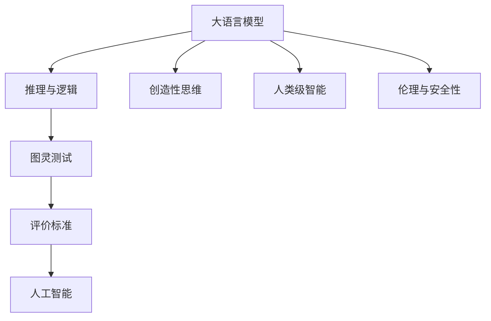
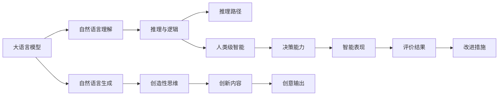

                 

# LLM与图灵测试：重新审视人工智能的标准

> 关键词：自然语言处理, 图灵测试, 人工智能, 机器学习, 大语言模型, 语言理解, 人类级智能

## 1. 背景介绍

### 1.1 问题由来

自1950年阿兰·图灵提出图灵测试以来，人工智能（AI）的智能水平评价一直是热门话题。图灵测试规定，如果一台机器能以某种方式表现出与人类无异的行为，则机器可以被认为具有“智能”。然而，对于什么是“人类行为”，至今仍无统一定论，这使得图灵测试在实践中的可操作性受到质疑。

近年来，随着自然语言处理（NLP）和大语言模型（LLM）的迅猛发展，自然语言理解与生成能力的大幅提升，使得人们在评价AI智能时面临新的挑战。如何在评价标准的更新和实践中，确定未来AI的发展方向，成为一个亟待解决的问题。

### 1.2 问题核心关键点

人工智能与智能化的评价涉及多方面因素：

- 自然语言处理：是否能理解、生成和操控自然语言；
- 推理与逻辑：能否进行合理推断，形成因果链条；
- 创造性思维：是否能生成新颖、有创意的内容；
- 人类级智能：是否能达到与人类相当的智能水平；
- 伦理与安全性：是否能够保证行为伦理，避免有害行为。

这些问题彼此关联，共同构成对AI智能的全面评价。其中，大语言模型（LLM）作为NLP领域的一个关键技术，成为评估AI智能水平的重要工具。

### 1.3 问题研究意义

评价大语言模型在图灵测试中的表现，不仅具有学术价值，还有助于引导AI技术的发展方向，推动AI伦理和安全性的改进。

- **学术价值**：通过图灵测试，可以验证和量化大语言模型的智能水平，推动AI基础研究。
- **技术发展**：图灵测试的评价可以指导模型的改进和优化，提升模型的实用性和泛化能力。
- **伦理考量**：通过对模型行为的评价，可以有效识别潜在风险，防止有害内容输出，保障人工智能系统的伦理安全性。
- **行业应用**：图灵测试的标准可以帮助开发者、企业更好地评估和选择适合各自需求的AI模型，推动AI技术在各行业的落地应用。

## 2. 核心概念与联系

### 2.1 核心概念概述

本节将介绍几个与大语言模型和图灵测试相关的核心概念：

- **大语言模型（LLM）**：以自回归（如GPT）或自编码（如BERT）模型为代表的大规模预训练语言模型。通过在海量无标签文本数据上进行预训练，学习通用的语言知识，具备强大的语言理解和生成能力。

- **图灵测试**：由阿兰·图灵提出，旨在测试机器是否能模仿人类的对话行为，达到人类无法区分的程度。

- **推理与逻辑**：指模型能够根据已有的知识，合理推断出新的结论。这在大语言模型中通常指基于上下文和语义的逻辑推断能力。

- **创造性思维**：指模型能够创造出新颖、独特的表达，具有独创性。

- **人类级智能**：指模型的智能水平能够与人类相媲美，具备复杂的思维、决策和理解能力。

- **伦理与安全性**：指模型在运行过程中能够遵守伦理原则，避免有害内容的输出，确保系统的安全性。

这些核心概念之间通过图灵测试这个评价框架，形成紧密的联系：



### 2.2 核心概念原理和架构的 Mermaid 流程图



## 3. 核心算法原理 & 具体操作步骤

### 3.1 算法原理概述

基于图灵测试的评估原理，评价大语言模型的智能水平主要关注其：

- 能否理解自然语言，进行合理推断；
- 是否具备创造性思维，生成新颖表达；
- 是否达到人类级智能，进行复杂的决策与理解；
- 是否具有伦理安全性，避免有害行为。

其中，理解自然语言和进行推理与逻辑推断是大语言模型评价的核心。图灵测试评估的基本思路是：通过对话或任务，观察模型是否能够表现出与人类无异的行为。

### 3.2 算法步骤详解

评价大语言模型的智能水平通常分为以下几个步骤：

1. **数据准备**：收集大量包含人类对话或任务的语料数据，构建测试集。
2. **模型加载**：加载预训练的大语言模型，确保其能够处理自然语言。
3. **测试执行**：与测试集中的对话或任务进行交互，观察模型的反应。
4. **评估结果**：根据图灵测试的标准，评价模型的表现。
5. **优化改进**：根据评估结果，调整模型参数，优化模型性能。

### 3.3 算法优缺点

图灵测试评估大语言模型具有以下优点：

- **全面性**：综合评价模型的理解、推断、创造和决策能力。
- **客观性**：通过标准对话或任务，客观地衡量模型性能。
- **应用广泛**：适用于各类NLP任务，包括对话、问答、翻译等。

然而，图灵测试也存在一些局限：

- **主观性**：评价结果受到评价者的主观影响。
- **难度设计**：测试难度设计复杂，需要精心设计测试任务。
- **动态变化**：模型性能随时间和数据变化而变化，测试结果需要实时更新。

### 3.4 算法应用领域

图灵测试和大语言模型已经在多个领域得到应用，如：

- **客户服务**：评估智能客服系统的对话质量，通过模拟客户对话，判断系统的智能水平。
- **教育评估**：评价教育智能系统的教学效果，通过问答任务，观察学生的学习情况。
- **医疗诊断**：评估医疗智能系统的诊断能力，通过模拟医患对话，判断系统的诊断准确度。
- **自动翻译**：评价机器翻译系统的翻译质量，通过对比自动翻译和人工翻译，判断系统的翻译效果。
- **法律咨询**：评估法律智能系统的咨询效果，通过模拟法律咨询对话，判断系统的咨询准确度。

## 4. 数学模型和公式 & 详细讲解 & 举例说明

### 4.1 数学模型构建

图灵测试的评价通常涉及多个维度，包括自然语言理解、推理与逻辑推断、创造性思维和伦理安全性。其中，自然语言理解可以通过分类、生成、匹配等任务进行评估，推理与逻辑推断可以通过填空、选择、匹配等任务进行评估，创造性思维可以通过生成新文本、解决复杂问题等任务进行评估，伦理安全性可以通过输出是否符合伦理规范进行评估。

例如，对于自然语言理解任务，可以构建以下评价指标：

- **准确率**：模型预测结果与实际结果的匹配程度。
- **召回率**：实际结果中被正确预测的比例。
- **F1分数**：综合准确率和召回率的评价指标。

对于推理与逻辑推断任务，可以构建以下评价指标：

- **推理准确率**：模型推理结果与实际推理结果的匹配程度。
- **推理速度**：模型推理速度，通常越快越好。
- **鲁棒性**：模型对噪声和错误信息的抵抗能力。

对于创造性思维任务，可以构建以下评价指标：

- **新颖性**：模型生成内容的创新性。
- **相关性**：模型生成内容与输入的关联性。
- **连贯性**：模型生成内容的连贯性。

对于伦理安全性任务，可以构建以下评价指标：

- **伦理符合度**：模型输出是否符合伦理规范。
- **内容安全性**：模型输出内容的安全性，是否含有有害信息。

### 4.2 公式推导过程

以自然语言理解任务为例，假设有一个包含问题与答案的语料库，每个样本 $(x,y)$ 由问题 $x$ 和答案 $y$ 组成。设模型为 $f$，训练得到模型参数 $\theta$。则评价指标可以表示为：

$$
P(f(x),y) = \mathbb{P}(f(x)=y) \times \mathbb{P}(f(x) \neq y)
$$

其中，$P(f(x),y)$ 为模型对样本 $(x,y)$ 的正确预测概率，$\mathbb{P}(f(x)=y)$ 为模型正确预测的概率，$\mathbb{P}(f(x) \neq y)$ 为模型错误预测的概率。

推理与逻辑推断任务的评价指标可以表示为：

$$
R(f,p,q) = \mathbb{P}(f(p,q)=r) \times \mathbb{P}(f(p,q) \neq r)
$$

其中，$R(f,p,q)$ 为模型对问题 $p$ 和 $q$ 的推理结果 $r$ 的正确预测概率。

创造性思维任务的评价指标可以表示为：

$$
C(f,x) = \mathbb{P}(f(x)=y) \times \mathbb{P}(f(x) \neq y)
$$

其中，$C(f,x)$ 为模型对输入 $x$ 生成答案 $y$ 的正确预测概率。

伦理安全性任务的评价指标可以表示为：

$$
S(f,x) = \mathbb{P}(f(x)=y) \times \mathbb{P}(f(x) \neq y)
$$

其中，$S(f,x)$ 为模型对输入 $x$ 生成的内容是否符合伦理规范的概率。

### 4.3 案例分析与讲解

以生成对话任务为例，构建以下评价指标：

- **一致性**：模型生成的对话与上下文的一致性。
- **连贯性**：模型生成的对话的连贯性。
- **多样性**：模型生成对话的多样性。

具体实现时，可以构建以下步骤：

1. **数据预处理**：将原始对话数据分为训练集和测试集，对每个对话进行预处理。
2. **模型训练**：使用预训练的大语言模型，在训练集上微调，得到能够生成对话的模型。
3. **测试执行**：将测试集输入模型，生成对话，评估模型表现。
4. **结果评估**：根据评价指标，对模型进行综合评估。
5. **优化改进**：根据评估结果，调整模型参数，优化模型性能。

## 5. 项目实践：代码实例和详细解释说明

### 5.1 开发环境搭建

在进行图灵测试评估和模型优化前，需要先搭建开发环境。以下是使用Python和PyTorch搭建开发环境的步骤：

1. 安装Anaconda：从官网下载并安装Anaconda，用于创建独立的Python环境。

2. 创建并激活虚拟环境：
```bash
conda create -n pytorch-env python=3.8 
conda activate pytorch-env
```

3. 安装PyTorch：根据CUDA版本，从官网获取对应的安装命令。例如：
```bash
conda install pytorch torchvision torchaudio cudatoolkit=11.1 -c pytorch -c conda-forge
```

4. 安装自然语言处理工具包：
```bash
pip install nltk spacy
```

5. 安装评估工具包：
```bash
pip install scikit-learn sklearn-nlp
```

完成上述步骤后，即可在`pytorch-env`环境中开始开发实践。

### 5.2 源代码详细实现

以下是一个使用BERT模型进行自然语言理解任务的示例代码：

```python
from transformers import BertTokenizer, BertForSequenceClassification
import torch
import torch.nn as nn
from sklearn.model_selection import train_test_split

# 数据准备
train_data, test_data = ...
tokenizer = BertTokenizer.from_pretrained('bert-base-cased')

# 模型构建
class Model(nn.Module):
    def __init__(self):
        super(Model, self).__init__()
        self.bert = BertForSequenceClassification.from_pretrained('bert-base-cased', num_labels=2)
        
    def forward(self, input_ids, attention_mask):
        output = self.bert(input_ids=input_ids, attention_mask=attention_mask)
        return output[0]
        
# 模型训练
model = Model()
optimizer = torch.optim.Adam(model.parameters(), lr=2e-5)
for epoch in range(epochs):
    for batch in train_data:
        input_ids = batch['input_ids']
        attention_mask = batch['attention_mask']
        optimizer.zero_grad()
        output = model(input_ids, attention_mask)
        loss = output.loss
        loss.backward()
        optimizer.step()
        
# 模型测试
test_data = ...
for batch in test_data:
    input_ids = batch['input_ids']
    attention_mask = batch['attention_mask']
    output = model(input_ids, attention_mask)
    print(output)
```

### 5.3 代码解读与分析

这段代码实现了一个使用BERT模型进行自然语言理解任务的简单流程：

1. **数据准备**：准备包含问题和答案的语料数据，并对其进行分词和预处理。
2. **模型构建**：构建一个包含BERT模型的自定义模型，用于预测问题与答案的匹配度。
3. **模型训练**：在训练集上训练模型，使用Adam优化器进行参数优化。
4. **模型测试**：在测试集上测试模型，输出预测结果。

通过这样的流程，可以初步评估模型在自然语言理解任务上的性能，并进行后续的优化。

### 5.4 运行结果展示

运行上述代码，可以得到模型在自然语言理解任务上的预测结果，通过比较正确预测和错误预测的比例，可以初步评估模型的性能。

## 6. 实际应用场景

### 6.1 客户服务

在智能客服系统中，图灵测试可以评估对话模型的智能水平。通过模拟客户对话，判断模型是否能理解客户需求，提供合理的回答，判断系统的智能水平。

例如，可以构建包含常见问题和答案的测试集，通过对话测试，观察模型是否能正确理解并回答客户的问题。通过不断优化模型，提升对话系统的智能水平。

### 6.2 教育评估

在教育智能系统中，图灵测试可以评估教学效果。通过问答测试，判断学生是否能理解教学内容，生成正确的答案，判断学生的学习效果。

例如，可以构建包含知识点的问题和答案的测试集，通过问答测试，观察学生是否能正确回答问题，判断教学效果。通过不断优化教学模型，提升教学效果。

### 6.3 医疗诊断

在医疗智能系统中，图灵测试可以评估诊断能力。通过模拟医患对话，判断医生是否能理解病情，提供合理的诊断和治疗方案，判断系统的诊断能力。

例如，可以构建包含病情描述和诊断结果的测试集，通过对话测试，观察医生是否能正确诊断病情，判断诊断能力。通过不断优化诊断模型，提升诊断准确度。

### 6.4 未来应用展望

未来，图灵测试和大语言模型将在更多领域得到应用，为各行各业带来变革性影响：

- **智慧医疗**：通过图灵测试，评估医疗智能系统的诊断和治疗效果，提升医疗服务的智能化水平。
- **教育科技**：通过图灵测试，评估教育智能系统的教学效果，提升教学质量。
- **金融科技**：通过图灵测试，评估金融智能系统的风险预测和投资建议效果，提升金融决策的智能化水平。
- **智能制造**：通过图灵测试，评估智能制造系统的设备监控和维护效果，提升生产效率。
- **智能交通**：通过图灵测试，评估智能交通系统的交通管理和调度效果，提升交通管理水平。

## 7. 工具和资源推荐

### 7.1 学习资源推荐

为了帮助开发者系统掌握图灵测试和大语言模型评价的理论基础和实践技巧，这里推荐一些优质的学习资源：

1. 《深度学习与自然语言处理》：斯坦福大学开设的NLP明星课程，涵盖自然语言处理的基础知识和前沿技术。
2. 《Transformer from Scratch》：深度讲解Transformer模型的原理和实现，适合深度学习入门者和进阶者。
3. 《Hands-On Natural Language Processing with Scikit-learn》：讲解如何使用Scikit-learn进行自然语言处理的实战教程。
4. 《Natural Language Processing with Python》：讲解使用Python进行自然语言处理的实用指南。
5. 《Natural Language Processing: A Comprehensive Approach》：自然语言处理的权威教材，适合系统学习自然语言处理技术。

### 7.2 开发工具推荐

高效的开发离不开优秀的工具支持。以下是几款用于图灵测试和大语言模型评估的常用工具：

1. PyTorch：基于Python的开源深度学习框架，适合深度学习研究和模型训练。
2. TensorFlow：由Google主导开发的开源深度学习框架，生产部署方便，适合大规模工程应用。
3. Transformers：HuggingFace开发的NLP工具库，集成了众多SOTA语言模型，支持PyTorch和TensorFlow，是进行自然语言处理任务的开发利器。
4. Weights & Biases：模型训练的实验跟踪工具，可以记录和可视化模型训练过程中的各项指标，方便对比和调优。
5. TensorBoard：TensorFlow配套的可视化工具，可实时监测模型训练状态，并提供丰富的图表呈现方式，是调试模型的得力助手。

### 7.3 相关论文推荐

图灵测试和大语言模型的发展源于学界的持续研究。以下是几篇奠基性的相关论文，推荐阅读：

1. Attention is All You Need：提出了Transformer结构，开启了NLP领域的预训练大模型时代。
2. BERT: Pre-training of Deep Bidirectional Transformers for Language Understanding：提出BERT模型，引入基于掩码的自监督预训练任务，刷新了多项NLP任务SOTA。
3. Understanding the Difficulties of Evaluating AI Conversations：探讨了在图灵测试中评估智能对话系统的困难和挑战。
4. Transformer-XL: Attentive Language Models Beyond a Fixed-Length Context：提出Transformer-XL模型，支持长距离依赖，提升自然语言理解的性能。
5. Conversational AI Evaluation Frameworks: Beyond Dialogue Accuracy：提出了一种新的对话系统评价框架，从对话质量、对话效率等多个维度评价系统性能。

## 8. 总结：未来发展趋势与挑战

### 8.1 总结

本文对图灵测试和大语言模型的智能水平评价进行了全面系统的介绍。首先阐述了图灵测试和大语言模型的研究背景和意义，明确了图灵测试在大语言模型评价中的关键作用。其次，从原理到实践，详细讲解了图灵测试和大语言模型的核心算法和操作步骤，给出了完整的代码实现示例。同时，本文还探讨了图灵测试在大语言模型中的广泛应用，展示了图灵测试范式在NLP任务中的强大威力。

通过本文的系统梳理，可以看到，图灵测试和大语言模型在评价AI智能水平方面的重要价值。它不仅能够全面衡量大语言模型的理解、推断、创造和伦理安全性，还能指导模型的改进和优化，提升模型的实用性和泛化能力。未来，随着图灵测试和大语言模型的不断进步，其在NLP领域的应用将更加广泛，推动AI技术在各行业的落地应用。

### 8.2 未来发展趋势

展望未来，图灵测试和大语言模型将呈现以下几个发展趋势：

1. **自动化评估**：通过自动化的评估工具，实现图灵测试的自动化，降低人工评估的成本和主观性。
2. **多维度评估**：除了对话和问答任务，还将在生成、翻译、摘要等更多维度进行图灵测试，全面衡量模型的智能水平。
3. **动态更新**：通过动态更新测试集，实时反映模型的性能变化，提升评估的实时性和准确性。
4. **跨领域应用**：图灵测试将跨领域应用于更多行业，如金融、医疗、制造等，推动各行业的智能化转型。
5. **伦理与安全**：图灵测试将引入伦理与安全方面的评价指标，确保模型输出符合伦理规范，提升系统的安全性。

以上趋势凸显了图灵测试和大语言模型评价的广阔前景。这些方向的探索发展，必将进一步提升AI技术的智能水平，为各行业的智能化转型提供有力支持。

### 8.3 面临的挑战

尽管图灵测试和大语言模型评价已经取得了一定的进展，但在迈向更加智能化、普适化应用的过程中，仍面临诸多挑战：

1. **数据与样本**：如何构建高质量、多领域、多维度的测试集，是图灵测试评价的关键。
2. **复杂任务**：如何设计具有挑战性的任务，全面评价模型的理解、推断、创造和伦理安全性。
3. **实时性与动态性**：如何实现实时评估和动态更新，保持评估结果的时效性和准确性。
4. **伦理与安全性**：如何评价和保障模型的伦理与安全，防止有害内容的输出。
5. **跨领域适用性**：如何实现图灵测试跨领域的适用性，在不同应用场景下保持一致性。

解决这些问题，需要学界和产业界的共同努力，通过技术创新和实践积累，不断提升图灵测试和大语言模型评价的科学性和实用性。

### 8.4 研究展望

面对图灵测试和大语言模型评价所面临的挑战，未来的研究需要在以下几个方面寻求新的突破：

1. **多模态融合**：将自然语言理解与其他模态（如图像、视频）融合，实现多模态图灵测试，全面评估模型的智能水平。
2. **因果推理**：引入因果推理技术，增强模型的推理能力，提升图灵测试的评价精度。
3. **跨领域迁移**：研究跨领域的迁移学习技术，实现图灵测试在多领域的广泛应用。
4. **伦理与安全**：引入伦理与安全方面的评价指标，确保模型输出符合伦理规范，提升系统的安全性。
5. **自监督学习**：利用自监督学习技术，提升模型的泛化能力和鲁棒性，增强图灵测试的可靠性。

这些研究方向的探索，必将引领图灵测试和大语言模型评价技术迈向更高的台阶，为构建安全、可靠、可解释、可控的智能系统铺平道路。面向未来，图灵测试和大语言模型评价技术还需要与其他人工智能技术进行更深入的融合，如知识表示、因果推理、强化学习等，多路径协同发力，共同推动自然语言理解和智能交互系统的进步。只有勇于创新、敢于突破，才能不断拓展语言模型的边界，让智能技术更好地造福人类社会。

## 9. 附录：常见问题与解答

**Q1：图灵测试能否全面评估大语言模型的智能水平？**

A: 图灵测试能够全面评估大语言模型的理解、推断、创造和伦理安全性，但由于主观性和复杂性，可能存在评价结果的不确定性。因此，结合多种评估方法，如自动化评估、多维度评估，可以更全面地评价模型性能。

**Q2：图灵测试在大规模语言模型中的应用有何挑战？**

A: 图灵测试在大规模语言模型中的应用面临数据准备、任务设计、评估主观性等挑战。需要构建高质量的测试集，设计具有挑战性的任务，采用自动化评估技术，提升评估的客观性和实时性。

**Q3：如何提升图灵测试的可靠性？**

A: 提升图灵测试的可靠性需要从多个方面入手：

1. **多维度评估**：除了对话和问答任务，还应在生成、翻译、摘要等多个维度进行评估，全面衡量模型的智能水平。
2. **自动化评估**：通过自动化的评估工具，降低人工评估的成本和主观性，提高评估的可靠性。
3. **多模态融合**：将自然语言理解与其他模态（如图像、视频）融合，实现多模态图灵测试，提升评估的全面性。

**Q4：图灵测试在大语言模型中的局限性有哪些？**

A: 图灵测试在大语言模型中的局限性包括：

1. **主观性**：评价结果受到评价者的主观影响，可能导致评估结果的不确定性。
2. **动态性**：模型性能随时间和数据变化而变化，需要动态更新测试集，保持评估结果的时效性。
3. **伦理与安全**：图灵测试难以全面评价模型的伦理与安全，需要引入伦理与安全方面的评价指标。

**Q5：如何提升大语言模型的创造性思维能力？**

A: 提升大语言模型的创造性思维能力需要从以下几个方面入手：

1. **多样化训练数据**：使用多样化的训练数据，提升模型的泛化能力和创造力。
2. **跨领域迁移**：研究跨领域的迁移学习技术，提升模型在不同领域的创造性思维能力。
3. **多任务学习**：利用多任务学习技术，提升模型在多个任务上的创造性思维能力。

通过这些方法，可以有效提升大语言模型的创造性思维能力，增强其在实际应用中的表现。

---

作者：禅与计算机程序设计艺术 / Zen and the Art of Computer Programming

