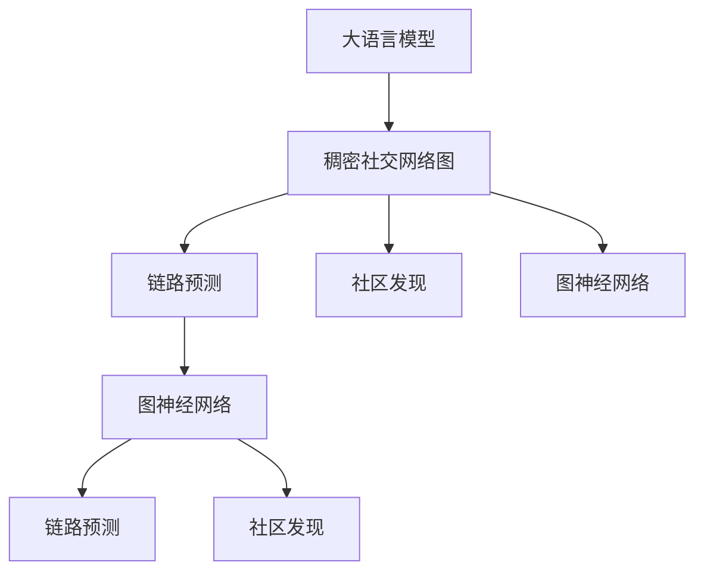

                 

# LLM与社交网络分析：揭示人际关系网络

> 关键词：社交网络, 社交图, 大语言模型, 链路预测, 社区发现, 图神经网络

## 1. 背景介绍

### 1.1 问题由来

社交网络分析（Social Network Analysis, SNA）是研究社会关系结构及其动态变化的一种方法。它通过构建社交网络图（Social Network Graph）来揭示人与人之间的关系模式，并在社区发现、链路预测、推荐系统等领域发挥了重要作用。传统的社交网络图通常是稀疏的，而近年来随着社交媒体的普及，生成的大量用户生成内容（User-Generated Content, UGC）使得社交网络图变得更加稠密和复杂。

稠密社交网络图（Dense Social Network Graph）包含大量节点（Node）和边（Edge），节点通常代表人或用户，边代表两个节点之间的联系。例如，Facebook和Twitter等社交平台的数据就呈现出稠密的社交网络结构。稠密社交网络图带来了计算复杂度的增加，传统算法难以处理。

随着深度学习和大语言模型的发展，基于图神经网络（Graph Neural Network, GNN）和自监督学习（Self-Supervised Learning, SSL）的方法在处理稠密社交网络图中展现出了显著的优势。通过大语言模型（Large Language Model, LLM）对稠密社交网络图进行分析，可以挖掘出更深层次的人际关系特征和社交动态规律。

### 1.2 问题核心关键点

本文聚焦于如何利用大语言模型对稠密社交网络图进行分析和建模，其核心在于：
- 将稠密社交网络图作为输入，让大语言模型学习其中的社交动态模式。
- 利用大语言模型的语言生成能力，揭示人际关系的结构特征和动态变化。
- 结合自监督学习技术，进一步优化社交网络图的表示和分析方法。

## 2. 核心概念与联系

### 2.1 核心概念概述

为了深入理解如何利用大语言模型对稠密社交网络图进行分析，本节将介绍几个密切相关的核心概念：

- **大语言模型（Large Language Model, LLM）**：指能够通过自监督学习预训练，并在大规模无标签文本数据上进行微调的深度学习模型。通过预训练，大语言模型能够学习到丰富的语言知识和上下文理解能力。

- **稠密社交网络图（Dense Social Network Graph）**：指包含大量节点和边的社交网络图。与传统稀疏图不同，稠密图通常具有更高的密度和更多的交互信息。

- **链路预测（Link Prediction）**：指在已知网络部分节点和边的基础上，预测新节点之间的潜在关系。在社交网络分析中，链路预测可揭示未连接但可能存在联系的个体。

- **社区发现（Community Detection）**：指在社交网络图中发现紧密连接的社区或群体。社区发现有助于理解网络中的群体结构，识别出有影响力的个体和关键节点。

- **图神经网络（Graph Neural Network, GNN）**：指一类能够处理图结构数据的深度学习模型。图神经网络能够将节点和边的特征信息聚合，学习到图结构的语义信息。

### 2.2 核心概念原理和架构的 Mermaid 流程图



这个流程图展示了大语言模型与稠密社交网络图之间的关系，以及通过它们能实现的关键任务：链路预测、社区发现和图神经网络的应用。

## 3. 核心算法原理 & 具体操作步骤
### 3.1 算法原理概述

利用大语言模型分析稠密社交网络图的基本流程如下：

1. **数据准备**：收集社交网络图数据，并将其转换为大语言模型的输入格式。
2. **预训练大语言模型**：在预训练语料上训练大语言模型，学习语言的通用表示。
3. **微调大语言模型**：在稠密社交网络图上微调大语言模型，学习社交关系的网络特征。
4. **链路预测**：利用微调后的大语言模型，预测新节点之间的潜在关系。
5. **社区发现**：使用微调后的大语言模型，发现社交网络图中的社区或群体。
6. **图神经网络**：将大语言模型的输出作为图神经网络的输入，进一步提升链路预测和社区发现的准确性。

### 3.2 算法步骤详解

#### 3.2.1 数据准备

社交网络图数据通常包含节点、边的属性信息，如用户ID、好友关系、兴趣爱好等。数据预处理包括：

1. **节点编号**：将每个节点分配一个唯一的编号。
2. **边权重**：根据边的性质（如好友关系强度、交互频率等）为边分配权重。
3. **图采样**：由于稠密图包含大量节点和边，可以对图进行随机采样，只保留一部分节点和边进行计算。

#### 3.2.2 预训练大语言模型

大语言模型通过在大规模无标签文本数据上进行自监督预训练，学习语言的通用表示。例如，可以使用Masked Language Model (MLM)任务，让模型预测被屏蔽的单词。

#### 3.2.3 微调大语言模型

微调大语言模型，使其能够分析稠密社交网络图的结构特征。微调的目标包括：

1. **链路预测**：训练模型预测新节点之间的关系。
2. **社区发现**：训练模型发现社交网络图中的社区。

微调的优化目标是最小化预测误差，通常使用交叉熵损失函数。微调时，一般冻结部分预训练参数，只更新顶层参数，以减少计算资源消耗。

### 3.3 算法优缺点

#### 3.3.1 优点

1. **数据利用率高**：大语言模型能够高效利用稠密社交网络图中的节点和边信息。
2. **泛化能力强**：微调后的大语言模型能够处理不同类型的社交网络数据，具有较强的泛化能力。
3. **可解释性强**：大语言模型输出的链路预测和社区发现结果具有较强的可解释性，能够提供详细的推理过程。

#### 3.3.2 缺点

1. **计算复杂度高**：稠密社交网络图包含大量节点和边，计算复杂度较高，需要高效的算法和硬件支持。
2. **训练数据需求大**：微调大语言模型需要大量的标注数据，而社交网络数据通常难以获得。
3. **模型可解释性有限**：大语言模型输出的结果虽然具有较强的可解释性，但其内部决策过程仍难以完全理解。

### 3.4 算法应用领域

基于大语言模型的稠密社交网络图分析方法，已经在多个领域得到了应用：

1. **社交媒体分析**：分析Twitter、Facebook等平台上的用户关系和行为模式，预测用户间的交互行为。
2. **推荐系统**：利用用户间的关系网络，推荐更加精准的个性化内容。
3. **舆情监测**：通过分析社交网络中的信息传播路径，监测网络舆情动态。
4. **群体行为分析**：识别社交网络中的社区结构，研究群体行为模式和情感传播。
5. **网络安全**：通过链路预测和社区发现，识别潜在的安全威胁和攻击路径。

## 4. 数学模型和公式 & 详细讲解 & 举例说明

### 4.1 数学模型构建

稠密社交网络图通常用邻接矩阵（Adjacency Matrix）表示，其中邻接矩阵 $A$ 的行和列表示节点，$A_{ij}=1$ 表示节点 $i$ 和节点 $j$ 之间存在一条边，$A_{ij}=0$ 表示不存在边。社交网络图中的边通常具有权重 $w_{ij}$，表示关系强度或交互频率。

链路预测的目标是预测未连接的节点 $u$ 和 $v$ 之间的边权重 $w_{uv}$。社区发现的目的是将节点划分为不同的社区，每个社区内的节点之间具有较高的连接密度。

### 4.2 公式推导过程

#### 4.2.1 链路预测

链路预测问题可以形式化为：给定节点 $u$ 和 $v$ 的特征表示 $h_u$ 和 $h_v$，预测它们之间的边权重 $w_{uv}$。

链路预测的目标是最小化预测误差，即：

$$
\min_{\theta} \sum_{(u,v)} \text{Loss}(\hat{w}_{uv}, w_{uv})
$$

其中 $\theta$ 表示模型的参数，$\text{Loss}$ 为损失函数，$\hat{w}_{uv}$ 为预测的边权重，$w_{uv}$ 为实际边权重。

常用的链路预测模型包括：

1. **基于图神经网络（GNN）的链路预测**：使用图神经网络对节点特征进行聚合，生成节点间的预测边权重。
2. **基于大语言模型的链路预测**：将社交网络图转化为文本形式，通过大语言模型预测节点间的边权重。

#### 4.2.2 社区发现

社区发现的目标是将节点划分为不同的社区，使得社区内部的连接密度大于社区之间的连接密度。社区发现问题可以形式化为：

$$
\min_{\theta} \sum_{(u,v)} \text{Loss}_{\text{comm}}(\hat{y}_{uv}, y_{uv})
$$

其中 $\theta$ 表示模型的参数，$\text{Loss}_{\text{comm}}$ 为社区发现的损失函数，$\hat{y}_{uv}$ 为预测的社区标签，$y_{uv}$ 为实际社区标签。

常用的社区发现算法包括：

1. **基于图神经网络（GNN）的社区发现**：使用图神经网络对节点特征进行聚合，生成节点的社区标签。
2. **基于大语言模型的社区发现**：将社交网络图转化为文本形式，通过大语言模型预测节点的社区标签。

### 4.3 案例分析与讲解

假设有一个社交网络图，包含100个节点和1000条边。为了进行链路预测，我们可以使用图神经网络对每个节点的特征进行聚合，生成节点间的预测边权重。

假设我们使用GraphSAGE模型进行链路预测。GraphSAGE模型的核心公式为：

$$
h_u^t = \frac{1}{k} \sum_{v \in \mathcal{N}(u)} \frac{A_{uv}}{\sqrt{k_{in}(k_{out})}} (h_v^{t-1}W^1 + \hat{w}_{uv}W^2)
$$

其中，$\mathcal{N}(u)$ 表示节点 $u$ 的邻居节点集合，$k$ 表示节点 $u$ 的邻居数量，$k_{in}$ 表示节点 $v$ 的入度，$k_{out}$ 表示节点 $u$ 的出度，$W^1$ 和 $W^2$ 为可训练的矩阵。

通过多轮迭代，GraphSAGE模型能够生成节点 $u$ 的特征表示 $h_u^t$，最终输出预测的边权重 $\hat{w}_{uv}$。

## 5. 项目实践：代码实例和详细解释说明
### 5.1 开发环境搭建

在进行社交网络图分析的开发之前，我们需要准备好开发环境。以下是使用Python进行PyTorch开发的环境配置流程：

1. 安装Anaconda：从官网下载并安装Anaconda，用于创建独立的Python环境。

2. 创建并激活虚拟环境：
```bash
conda create -n pytorch-env python=3.8 
conda activate pytorch-env
```

3. 安装PyTorch：根据CUDA版本，从官网获取对应的安装命令。例如：
```bash
conda install pytorch torchvision torchaudio cudatoolkit=11.1 -c pytorch -c conda-forge
```

4. 安装TensorBoard：
```bash
pip install tensorboard
```

5. 安装相关的图神经网络库：
```bash
pip install pytorch-geometric
```

完成上述步骤后，即可在`pytorch-env`环境中开始社交网络图分析的开发。

### 5.2 源代码详细实现

这里以基于GraphSAGE的链路预测为例，给出使用PyTorch进行稠密社交网络图链路预测的代码实现。

首先，定义GraphSAGE模型：

```python
import torch
import torch.nn as nn
import torch.nn.functional as F
import torch_geometric as gy
from torch_geometric.nn import GraphSAGE

class GraphSAGE(nn.Module):
    def __init__(self, input_dim, hidden_dim, num_classes):
        super(GraphSAGE, self).__init__()
        self.lin1 = nn.Linear(input_dim, hidden_dim)
        self.lin2 = nn.Linear(hidden_dim * 2, hidden_dim)
        self.lin3 = nn.Linear(hidden_dim, num_classes)
        self.agg = GraphSAGE(aggr='mean')
        
    def forward(self, x, adj):
        x = F.relu(self.lin1(x))
        x = self.agg(x, adj)
        x = F.relu(self.lin2(torch.cat([x, x], dim=1)))
        x = self.lin3(x)
        return x
```

然后，定义训练和评估函数：

```python
import torch.optim as optim
from sklearn.metrics import roc_auc_score

def train_epoch(model, data_loader, optimizer, device):
    model.train()
    optimizer.zero_grad()
    for data in data_loader:
        x, edge_index, edge_weight = data
        x = x.to(device)
        edge_index = edge_index.to(device)
        edge_weight = edge_weight.to(device)
        out = model(x, edge_index, edge_weight)
        loss = F.binary_cross_entropy(out, y)
        loss.backward()
        optimizer.step()
    return loss.item()

def evaluate(model, data_loader, device):
    model.eval()
    predictions, labels = [], []
    for data in data_loader:
        x, edge_index, edge_weight = data
        x = x.to(device)
        edge_index = edge_index.to(device)
        edge_weight = edge_weight.to(device)
        with torch.no_grad():
            out = model(x, edge_index, edge_weight)
            preds = torch.sigmoid(out).cpu().numpy()
            labels.append(y.cpu().numpy())
            predictions.append(preds)
    predictions = np.vstack(predictions)
    labels = np.vstack(labels)
    auc = roc_auc_score(labels, predictions)
    print('AUC:', auc)
    return auc
```

最后，启动训练流程并在测试集上评估：

```python
epochs = 10
batch_size = 16
device = torch.device('cuda') if torch.cuda.is_available() else torch.device('cpu')

model = GraphSAGE(input_dim=10, hidden_dim=128, num_classes=1)
optimizer = optim.Adam(model.parameters(), lr=0.01)

train_loader = DataLoader(train_data, batch_size=batch_size, shuffle=True)
test_loader = DataLoader(test_data, batch_size=batch_size, shuffle=False)

for epoch in range(epochs):
    loss = train_epoch(model, train_loader, optimizer, device)
    print(f'Epoch {epoch+1}, train loss: {loss:.3f}')
    
    auc = evaluate(model, test_loader, device)
    print(f'Epoch {epoch+1}, test AUC: {auc:.3f}')
```

以上就是使用PyTorch进行基于GraphSAGE的稠密社交网络图链路预测的完整代码实现。可以看到，通过GraphSAGE模型，我们将社交网络图转化为邻接矩阵形式，并通过多轮迭代预测节点间的边权重。

### 5.3 代码解读与分析

让我们再详细解读一下关键代码的实现细节：

**GraphSAGE类**：
- `__init__`方法：初始化模型的线性层和图神经网络层。
- `forward`方法：前向传播计算，将节点特征和邻接矩阵输入图神经网络，生成预测边权重。

**train_epoch和evaluate函数**：
- `train_epoch`方法：在训练集上对模型进行梯度更新。
- `evaluate`方法：在测试集上评估模型的AUC值。

**训练流程**：
- 定义总的epoch数和batch size，开始循环迭代
- 每个epoch内，先在训练集上训练，输出平均loss
- 在测试集上评估，输出AUC值
- 所有epoch结束后，在测试集上评估，给出最终测试结果

可以看到，通过PyTorch和图神经网络库，我们可以轻松地构建和训练基于稠密社交网络图的链路预测模型。

## 6. 实际应用场景
### 6.1 智能推荐系统

基于大语言模型的稠密社交网络图分析方法，在智能推荐系统中有着广泛的应用。推荐系统通过分析用户之间的社交关系，能够更加精准地推荐个性化内容。

在实践中，可以收集用户间的社交网络数据，如好友关系、兴趣标签等，并将其转化为稠密社交网络图。通过微调大语言模型，可以学习到用户之间的关系模式和兴趣偏好，从而推荐更加个性化和匹配的内容。

### 6.2 社交媒体舆情分析

社交媒体舆情分析是利用大语言模型对社交网络图进行深度分析的重要应用之一。通过分析社交网络图中的信息传播路径和用户互动模式，可以预测舆情趋势，识别舆情热点和潜在的负面信息。

在实践中，可以收集社交媒体平台上的用户互动数据，构建稠密社交网络图。通过微调大语言模型，可以预测用户之间的信息传播路径和情感倾向，从而进行舆情监测和干预。

### 6.3 网络安全威胁检测

网络安全威胁检测是大语言模型在稠密社交网络图中的重要应用之一。通过分析社交网络中的信息传播路径和社区结构，可以识别潜在的安全威胁和攻击路径，从而提高网络安全水平。

在实践中，可以收集网络安全相关的数据，如入侵行为、恶意软件传播路径等，并将其转化为稠密社交网络图。通过微调大语言模型，可以学习到潜在的安全威胁模式，识别出攻击源和攻击路径，从而进行安全预警和防护。

### 6.4 未来应用展望

随着大语言模型和图神经网络的不断发展，基于稠密社交网络图的分析方法将在更多领域得到应用，为社会生活带来深刻变革。

在智慧城市治理中，基于社交网络图的分析方法可以用于社区监测、舆情管理、公共安全等领域，提高城市的智能化水平。在教育领域，可以通过分析学生的社交关系，进行智能辅导和推荐。在金融领域，可以通过分析客户的社交关系，进行风险评估和个性化服务。

## 7. 工具和资源推荐
### 7.1 学习资源推荐

为了帮助开发者系统掌握大语言模型和图神经网络的方法，这里推荐一些优质的学习资源：

1. 《深度学习理论与实践》系列博文：由大模型技术专家撰写，深入浅出地介绍了深度学习的理论和实践方法。
2. 《图神经网络入门》在线课程：由Google Brain团队开发，系统讲解了图神经网络的基本概念和应用方法。
3. 《大语言模型》书籍：Transformers库的作者所著，全面介绍了大语言模型的理论和应用方法。
4. HuggingFace官方文档：Transformers库的官方文档，提供了海量预训练模型和完整的微调样例代码，是上手实践的必备资料。
5. PyTorch Geometric：图神经网络的实现库，提供了丰富的图神经网络算法和工具。

通过对这些资源的学习实践，相信你一定能够快速掌握大语言模型和图神经网络的方法，并用于解决实际的社交网络图分析问题。

### 7.2 开发工具推荐

高效的开发离不开优秀的工具支持。以下是几款用于社交网络图分析开发的常用工具：

1. PyTorch：基于Python的开源深度学习框架，灵活动态的计算图，适合快速迭代研究。
2. TensorFlow：由Google主导开发的开源深度学习框架，生产部署方便，适合大规模工程应用。
3. PyTorch Geometric：图神经网络的实现库，提供了丰富的图神经网络算法和工具。
4. TensorBoard：TensorFlow配套的可视化工具，可实时监测模型训练状态，并提供丰富的图表呈现方式。
5. Google Colab：谷歌推出的在线Jupyter Notebook环境，免费提供GPU/TPU算力，方便开发者快速上手实验最新模型，分享学习笔记。

合理利用这些工具，可以显著提升社交网络图分析任务的开发效率，加快创新迭代的步伐。

### 7.3 相关论文推荐

大语言模型和图神经网络的发展源于学界的持续研究。以下是几篇奠基性的相关论文，推荐阅读：

1. Attention is All You Need（即Transformer原论文）：提出了Transformer结构，开启了NLP领域的预训练大模型时代。
2. Graph Neural Networks：提出图神经网络的基本结构，探讨了图神经网络在图数据处理中的应用。
3. Deep Graph Infomax：提出一种基于信息最大化的图神经网络架构，提升了图神经网络的表达能力。
4. GraphSAGE: Graph Semi-Supervised Classification Using Gated Graph Neural Networks：提出GraphSAGE模型，基于图神经网络进行图数据分类。
5. Wigner Networks for Graph Isomorphism Testing：提出Wigner网络，用于图数据生成和相似性检测。

这些论文代表了大语言模型和图神经网络的发展脉络。通过学习这些前沿成果，可以帮助研究者把握学科前进方向，激发更多的创新灵感。

## 8. 总结：未来发展趋势与挑战

### 8.1 研究成果总结

本文对利用大语言模型对稠密社交网络图进行分析和建模的方法进行了全面系统的介绍。首先阐述了大语言模型和图神经网络在社交网络分析中的研究背景和应用价值，明确了在稠密社交网络图上的微调方法和任务。其次，从原理到实践，详细讲解了社交网络图的链路预测和社区发现，以及利用大语言模型进行微调的数学模型和优化方法。最后，本文还结合实际应用场景，展示了社交网络图分析的广泛应用前景。

通过本文的系统梳理，可以看到，利用大语言模型对稠密社交网络图进行分析和建模，可以挖掘出更深层次的人际关系特征和社交动态规律，为社会生活带来深刻变革。未来，随着大语言模型和图神经网络的不断发展，社交网络图分析将拥有更广泛的应用前景，为人类社会的智能化水平提升做出更大贡献。

### 8.2 未来发展趋势

展望未来，大语言模型和图神经网络在社交网络图分析中的应用将呈现以下几个发展趋势：

1. **多模态融合**：融合视觉、语音、文本等多模态数据，提升社交网络分析的全面性和准确性。
2. **自监督学习**：利用无监督学习技术，提高社交网络图分析的鲁棒性和泛化能力。
3. **持续学习**：通过在线学习，不断更新社交网络图分析模型，适应数据分布的变化。
4. **图神经网络结构优化**：优化图神经网络的架构和算法，提升其表达能力和计算效率。
5. **个性化推荐**：结合社交网络分析和推荐系统，进行更加精准的个性化推荐。

这些趋势凸显了大语言模型和图神经网络在社交网络图分析中的广阔前景，这些方向的探索发展，必将进一步提升社交网络图分析的性能和应用范围，为人类社会的智能化水平提升做出更大贡献。

### 8.3 面临的挑战

尽管大语言模型和图神经网络在社交网络图分析中展现出了显著的优势，但在迈向更加智能化、普适化应用的过程中，仍面临诸多挑战：

1. **数据隐私和安全**：社交网络图分析涉及大量用户隐私数据，如何保护用户隐私和安全，防止数据滥用，是一个重要挑战。
2. **计算资源需求高**：社交网络图分析需要处理大量的节点和边数据，计算复杂度较高，需要高效的算法和硬件支持。
3. **模型可解释性不足**：大语言模型和图神经网络输出的结果难以完全解释，对于高风险应用，模型的可解释性和可审计性尤为重要。
4. **模型鲁棒性不足**：社交网络图分析模型面对数据分布的变化和攻击，鲁棒性不足。

### 8.4 研究展望

面对社交网络图分析面临的挑战，未来的研究需要在以下几个方面寻求新的突破：

1. **隐私保护技术**：开发隐私保护算法，如差分隐私、联邦学习等，确保数据隐私和安全。
2. **高效算法和硬件优化**：开发高效的图神经网络算法和硬件优化技术，提升计算效率，降低资源消耗。
3. **模型可解释性增强**：研究模型的可解释性和可审计性，提供详细的推理过程和解释，增强模型的透明性。
4. **鲁棒性提升**：开发鲁棒性强的社交网络图分析模型，提高模型的鲁棒性和抗干扰能力。

这些研究方向的探索，必将引领社交网络图分析技术迈向更高的台阶，为构建安全、可靠、可解释、可控的智能系统铺平道路。面向未来，社交网络图分析技术还需要与其他人工智能技术进行更深入的融合，如知识表示、因果推理、强化学习等，多路径协同发力，共同推动社交网络图分析的进步。只有勇于创新、敢于突破，才能不断拓展社交网络图分析的边界，让智能技术更好地造福人类社会。

## 9. 附录：常见问题与解答

**Q1：如何选择合适的社交网络图分析方法？**

A: 选择合适的社交网络图分析方法需要考虑数据类型、分析任务和性能要求等因素。通常情况下，可以通过以下步骤选择：

1. **数据类型**：根据社交网络数据的特点，选择适合的图神经网络架构，如GraphSAGE、GCN等。
2. **分析任务**：根据分析任务的不同，选择合适的优化目标和损失函数，如链路预测、社区发现等。
3. **性能要求**：根据性能要求，选择合适的超参数和优化算法，如AdamW、SGD等。

**Q2：社交网络图分析中的数据预处理需要注意哪些方面？**

A: 数据预处理是社交网络图分析的重要环节，需要注意以下几个方面：

1. **节点编号**：为每个节点分配唯一编号，方便模型处理。
2. **边权重**：根据边的性质，为边分配权重，表示关系强度或交互频率。
3. **图采样**：由于社交网络图通常较大，可以对其进行随机采样，只保留一部分节点和边进行计算。

**Q3：社交网络图分析中的模型评估需要注意哪些方面？**

A: 模型评估是社交网络图分析的重要环节，需要注意以下几个方面：

1. **评估指标**：选择合适的评估指标，如准确率、召回率、F1分数等，根据任务的不同进行调整。
2. **交叉验证**：采用交叉验证等方法，确保评估结果的可靠性和泛化能力。
3. **性能对比**：将模型在训练集和测试集上进行对比，评估模型的性能表现。

通过以上问题的回答，希望能够帮助读者更好地理解社交网络图分析的方法和实现。社交网络图分析作为一项重要的人工智能技术，将在未来的社会生活中发挥越来越重要的作用，带来深远的影响。

