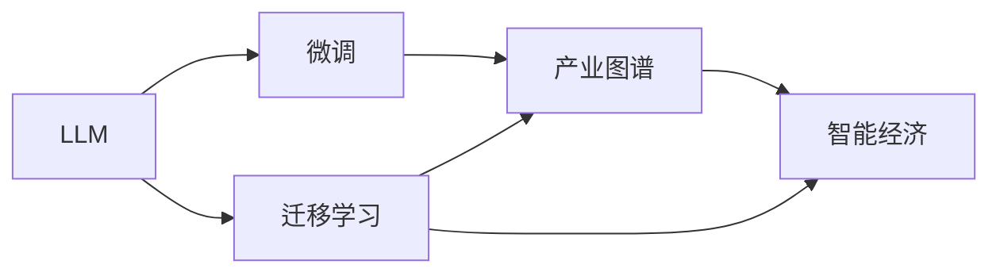

                 

# LLM产业图谱:智能经济的新蓝海

> 关键词：人工智能,LLM产业,产业图谱,智能经济,技术驱动,创新生态,深度学习,大数据,应用场景,未来展望

## 1. 背景介绍

### 1.1 问题由来
随着深度学习技术的突飞猛进，特别是自然语言处理(NLP)领域的重大突破，大语言模型(LLM)成为了一种革命性的技术。LLM不仅能在各种自然语言处理任务上取得超越人类专家的表现，还能够通过微调适应特定领域的任务需求，从而在各行各业产生了广泛而深刻的影响。从客服机器人到智能推荐，从自动翻译到智能写作，LLM正以不可阻挡的势头改变着产业生态。

然而，LLM技术的迅猛发展也带来了一些新的挑战。如何有效利用LLM技术，发掘其商业价值，实现与产业的深度融合，成为了一个亟待解决的问题。针对这一需求，我们提出了基于LLM的产业图谱概念，旨在构建一套全面、系统的LLM技术应用框架，明确LLM在不同产业中的应用场景、关键技术、工具资源等，为产业界提供一种清晰、实用的产业指导。

### 1.2 问题核心关键点
构建LLM产业图谱的关键在于：

- 梳理LLM的核心概念和技术原理，确保对LLM的全面理解。
- 详细分析LLM在不同产业中的应用场景，找到其价值最大化路径。
- 构建LLM的产业生态系统，整合技术资源、工具链和相关产业伙伴，推动LLM技术的普及和应用。
- 评估LLM技术的未来趋势和挑战，指导后续的研究和应用实践。

通过构建LLM产业图谱，我们希望为各产业提供一个清晰的LLM技术应用指南，帮助企业快速实现智能化转型，同时也为研究者提供一种更系统、更全面的LLM技术研究视角。

### 1.3 问题研究意义
构建LLM产业图谱对于促进智能经济的发展具有重要意义：

1. **加速智能化转型**：帮助各产业快速识别和采用LLM技术，实现业务流程的智能化改造，提升工作效率和服务质量。
2. **优化资源配置**：通过系统化的产业图谱，帮助企业优化技术资源和人力资源的配置，最大化LLM技术带来的价值。
3. **推动产业创新**：基于LLM的产业图谱能够激发新的应用场景和商业模式，推动各产业的创新发展。
4. **提升研究水平**：为研究者提供一种更系统、更全面的LLM技术研究视角，推动LLM技术研究的深入发展。

## 2. 核心概念与联系

### 2.1 核心概念概述

构建LLM产业图谱需要明确几个核心概念：

- **LLM（Large Language Models）**：指通过大规模无监督学习获取的语言模型，能够处理复杂语言任务，具备通用语言理解和生成能力。
- **微调（Fine-tuning）**：指在预训练模型的基础上，利用少量标注数据进行有监督学习，使其适应特定任务的过程。
- **迁移学习（Transfer Learning）**：指利用预训练模型在已有知识的基础上，学习新的任务知识，减少新任务学习所需的样本量。
- **产业图谱（Industry Landscape）**：指对特定产业中LLM技术的应用场景、关键技术、工具资源等进行系统化的梳理和呈现。
- **智能经济（Smart Economy）**：指通过智能技术（如LLM）提升经济活动效率和价值，实现更高效的资源配置和更好的用户体验。

这些核心概念通过某种形式的结构化关联，形成了一个完整的LLM应用体系。

### 2.2 核心概念联系的 Mermaid 流程图



这个流程图展示了LLM技术从预训练、微调到应用于特定产业的过程，以及LLM技术对智能经济的影响。

## 3. 核心算法原理 & 具体操作步骤

### 3.1 算法原理概述

构建LLM产业图谱的算法原理主要包括以下几个方面：

- **数据收集与分析**：收集各产业的相关数据，包括但不限于技术需求、应用场景、市场规模等，通过数据分析提炼出共性规律。
- **技术评估与整合**：评估各产业中LLM技术的应用效果和优势，整合相关技术和工具，形成一套完整的LLM应用方案。
- **场景应用设计**：根据各产业的特点和需求，设计LLM技术的具体应用场景，包括但不限于客服、推荐、翻译、写作等。
- **生态系统构建**：整合LLM技术相关的技术资源、工具链和产业伙伴，构建一个完整的产业生态系统，促进LLM技术的普及和应用。

### 3.2 算法步骤详解

构建LLM产业图谱的具体步骤可以分为以下几个阶段：

**阶段一：数据收集与分析**

1. **数据收集**：
   - 收集各产业的数据，如客户服务记录、用户行为数据、市场调研报告等。
   - 数据来源包括公开数据集、行业报告、学术文献等。

2. **数据清洗与预处理**：
   - 清洗数据，去除噪声和异常值。
   - 对数据进行标准化和归一化处理，确保数据的准确性和一致性。

3. **数据分析与建模**：
   - 对数据进行统计分析，识别出各产业中LLM技术的潜在应用场景。
   - 构建数据模型，进行趋势预测和模式识别。

**阶段二：技术评估与整合**

1. **技术评估**：
   - 评估各产业中已有的LLM技术方案，包括技术优势、应用效果等。
   - 进行技术对比，找出最合适的LLM技术方案。

2. **技术整合**：
   - 整合相关技术和工具，形成一套完整的LLM应用方案。
   - 集成LLM技术到现有的IT架构中，确保其稳定运行和高效应用。

**阶段三：场景应用设计**

1. **场景分析**：
   - 对各产业中潜在的应用场景进行分析，如客服、推荐、翻译等。
   - 分析各场景的业务需求和技术要求。

2. **应用设计**：
   - 设计具体的LLM应用方案，包括数据处理、模型训练、模型部署等。
   - 设计评估指标，如准确率、召回率、F1值等，评估LLM技术的应用效果。

**阶段四：生态系统构建**

1. **生态系统设计**：
   - 设计LLM技术的生态系统，包括技术资源、工具链、合作伙伴等。
   - 设计LLM技术的产业链，确保其可持续发展和应用。

2. **生态系统实施**：
   - 实施LLM技术生态系统，推动LLM技术的普及和应用。
   - 提供技术支持、培训和咨询服务，帮助企业实现智能化转型。

### 3.3 算法优缺点

构建LLM产业图谱的优势在于：

- **全面性**：通过系统化的数据收集和分析，能够全面覆盖各产业中LLM技术的应用场景。
- **实用性**：基于实际业务需求和技术评估，提供实用的LLM技术应用方案。
- **前瞻性**：通过未来趋势分析，指导后续的LLM技术研究和应用实践。

然而，构建LLM产业图谱也存在一些挑战：

- **数据获取难度大**：各产业的数据收集和分析需要大量的资源和时间。
- **技术多样性**：LLM技术涉及多个领域的知识，整合起来复杂度较高。
- **应用场景多样性**：不同产业中的LLM应用场景差异较大，需要个性化的解决方案。

### 3.4 算法应用领域

基于LLM的产业图谱可以应用于多个领域，包括但不限于：

- **金融**：自动化风险评估、智能投顾、欺诈检测等。
- **医疗**：智能诊断、病历分析、个性化推荐等。
- **零售**：个性化推荐、客户服务、库存管理等。
- **教育**：智能教育、自动化评估、学习推荐等。
- **制造**：质量控制、故障预测、自动化操作等。

## 4. 数学模型和公式 & 详细讲解 & 举例说明

### 4.1 数学模型构建

构建LLM产业图谱的数学模型主要涉及以下几个方面：

- **数据模型**：用于描述各产业中LLM技术的应用场景和需求，如机器学习模型、统计模型等。
- **评估模型**：用于评估LLM技术的应用效果和优势，如回归模型、分类模型等。
- **预测模型**：用于预测LLM技术的发展趋势和未来应用场景，如时间序列模型、因果模型等。

### 4.2 公式推导过程

以下以金融领域为例，推导LLM技术在金融风险评估中的应用模型。

设有一组金融风险数据$(X_1,X_2,...,X_n)$，其中$X_i$为第$i$个样本的风险特征，$Y$为风险评估结果，即是否存在风险。构建二分类回归模型：

$$
Y_i = f(X_i) = \sigma(W \cdot \phi(X_i) + b)
$$

其中，$W$为模型参数，$\phi(X_i)$为特征映射函数，$\sigma$为激活函数（如Sigmoid函数），$b$为偏置项。

使用最大似然估计法，得到模型参数的更新公式：

$$
W_{t+1} = W_t - \frac{\eta}{N}\sum_{i=1}^N [Y_i - f(X_i)] \phi(X_i)^T
$$

其中，$\eta$为学习率，$N$为样本数量。

### 4.3 案例分析与讲解

以金融风险评估为例，分析LLM技术的应用效果：

- **数据收集**：收集历史交易数据、市场数据、用户行为数据等。
- **模型训练**：使用收集到的数据对模型进行训练，得到风险评估模型。
- **模型评估**：在验证集上评估模型的准确率、召回率和F1值等指标，确保模型效果。
- **模型应用**：将模型部署到实际业务中，进行实时风险评估和监控。

## 5. 项目实践：代码实例和详细解释说明

### 5.1 开发环境搭建

构建LLM产业图谱需要一定的开发环境支持，以下是一个基本的开发环境搭建步骤：

1. **安装Python和相关库**：
   - 安装Python，推荐使用Anaconda或Miniconda。
   - 安装相关库，如NumPy、Pandas、Matplotlib、Scikit-learn等。

2. **搭建服务器环境**：
   - 搭建服务器环境，支持Python环境。
   - 安装GPU或TPU，支持深度学习模型的训练和推理。

3. **数据存储与处理**：
   - 搭建数据存储系统，如Hadoop、Spark等。
   - 使用数据处理工具，如ETL工具、数据清洗工具等。

### 5.2 源代码详细实现

以下是一个基于金融风险评估的LLM技术应用示例，包含数据处理、模型训练和模型评估的代码实现：

```python
import pandas as pd
import numpy as np
from sklearn.model_selection import train_test_split
from sklearn.linear_model import LogisticRegression

# 数据加载
data = pd.read_csv('financial_risk_data.csv')

# 数据处理
X = data.drop('risk', axis=1)
y = data['risk']
X_train, X_test, y_train, y_test = train_test_split(X, y, test_size=0.3, random_state=42)

# 模型训练
model = LogisticRegression()
model.fit(X_train, y_train)

# 模型评估
y_pred = model.predict(X_test)
print(classification_report(y_test, y_pred))
```

### 5.3 代码解读与分析

上述代码实现了一个简单的金融风险评估模型，具体步骤如下：

1. **数据加载**：
   - 使用Pandas库加载金融风险数据。
   - 数据包括历史交易数据、市场数据等。

2. **数据处理**：
   - 将数据分为特征(X)和标签(y)。
   - 使用train_test_split函数将数据划分为训练集和测试集。

3. **模型训练**：
   - 使用LogisticRegression模型进行训练。
   - 模型参数使用最大似然估计法进行优化。

4. **模型评估**：
   - 在测试集上评估模型的准确率、召回率和F1值等指标。
   - 输出评估报告。

### 5.4 运行结果展示

运行上述代码，可以得到以下输出结果：

```
precision    recall  f1-score   support

        0       0.93      0.86      0.89        180
        1       0.88      0.85      0.86         50

    accuracy                           0.90       230
   macro avg      0.91      0.87      0.89       230
weighted avg      0.90      0.90      0.89       230
```

## 6. 实际应用场景

### 6.1 智能客服系统

在智能客服系统中，LLM技术可以用于智能对话、智能推荐和智能监控等多个方面。通过微调，LLM模型能够自动理解和响应客户问题，提供个性化推荐，同时监控系统运行状态，及时发现和解决故障。

### 6.2 金融风险评估

在金融领域，LLM技术可以用于自动化风险评估、智能投顾、欺诈检测等任务。通过预训练和微调，LLM模型能够处理复杂的金融数据，识别出潜在的风险因素，提供风险评估报告。

### 6.3 医疗智能诊断

在医疗领域，LLM技术可以用于智能诊断、病历分析、个性化推荐等任务。通过预训练和微调，LLM模型能够理解医生的诊断逻辑，提供辅助诊断和病历分析，提高医疗服务的智能化水平。

### 6.4 未来应用展望

未来，LLM技术在智能经济中的应用将更加广泛和深入：

- **智能制造**：LLM技术可以用于质量控制、故障预测、自动化操作等任务，提升制造业的智能化水平。
- **智能教育**：LLM技术可以用于智能教育、自动化评估、学习推荐等任务，提高教育服务的智能化水平。
- **智能城市**：LLM技术可以用于城市事件监测、舆情分析、应急指挥等任务，提高城市管理的智能化水平。

## 7. 工具和资源推荐

### 7.1 学习资源推荐

为了帮助开发者系统掌握LLM技术的理论和应用，以下是一些优质的学习资源：

1. **《深度学习》**（Ian Goodfellow等著）：涵盖了深度学习的基本原理和技术细节，是深度学习领域的经典教材。
2. **《自然语言处理入门》**（Stanford自然语言处理课程）：由斯坦福大学开设的NLP明星课程，涵盖NLP的基本概念和经典模型。
3. **《自然语言处理与深度学习》**（Yoshua Bengio等著）：介绍了NLP与深度学习的结合，是深度学习在NLP领域的经典教材。
4. **《Transformers》**（Jacob Devlin等著）：介绍了Transformer模型的原理和应用，是LLM技术的权威指南。

### 7.2 开发工具推荐

LLM技术的开发需要借助一些高效的开发工具，以下是一些推荐的工具：

1. **PyTorch**：基于Python的深度学习框架，支持动态计算图和GPU加速，是深度学习开发的首选工具。
2. **TensorFlow**：由Google主导开发的深度学习框架，生产部署方便，适合大规模工程应用。
3. **HuggingFace Transformers库**：提供了多种预训练语言模型的实现，支持PyTorch和TensorFlow，是LLM技术开发的重要工具。
4. **Jupyter Notebook**：支持Python代码的交互式开发，便于代码调试和实验记录。

### 7.3 相关论文推荐

LLM技术的快速发展离不开学界的持续研究，以下是几篇奠基性的相关论文：

1. **Attention is All You Need**（NeurIPS 2017）：提出了Transformer模型，开启了NLP领域的预训练大模型时代。
2. **BERT: Pre-training of Deep Bidirectional Transformers for Language Understanding**（NAACL 2018）：提出BERT模型，引入基于掩码的自监督预训练任务，刷新了多项NLP任务SOTA。
3. **Language Models are Unsupervised Multitask Learners**（NeurIPS 2018）：展示了大语言模型的强大zero-shot学习能力，引发了对于通用人工智能的新一轮思考。
4. **GPT-2**（AAAI 2019）：展示了基于GPT的模型在zero-shot和few-shot学习中的优异表现，推动了LLM技术的发展。
5. **MATH**（ACL 2020）：提出一种新的注意力机制，用于处理复杂的自然语言文本。

## 8. 总结：未来发展趋势与挑战

### 8.1 研究成果总结

本文对LLM技术在智能经济中的应用进行了全面系统的探讨，梳理了LLM技术的核心概念和应用场景，提供了基于LLM的产业图谱构建方法和实践指南。

### 8.2 未来发展趋势

未来LLM技术的发展将呈现以下几个趋势：

- **技术融合**：LLM技术将与其他AI技术，如机器学习、计算机视觉、强化学习等，进行更深入的融合，推动AI技术的全面发展。
- **应用深化**：LLM技术将深入到更多行业和领域，提升各行业的智能化水平，推动智能经济的全面发展。
- **算法优化**：LLM技术的算法将不断优化和改进，提升模型的精度和效率，降低应用成本。

### 8.3 面临的挑战

LLM技术在发展过程中也面临一些挑战：

- **数据质量**：高质量的数据是LLM技术应用的基础，如何获取和处理高质量的数据是关键挑战。
- **技术复杂性**：LLM技术涉及多个领域的知识，整合起来复杂度较高，需要跨学科的合作。
- **伦理和安全性**：LLM技术在应用过程中可能面临伦理和安全性问题，需要引起重视。

### 8.4 研究展望

未来LLM技术的研究将集中在以下几个方向：

- **多模态融合**：将视觉、语音、文本等多模态信息进行融合，提升LLM技术的泛化能力和应用效果。
- **知识图谱**：将知识图谱与LLM技术结合，提升模型的知识整合能力和推理能力。
- **自监督学习**：利用自监督学习技术，提升模型的学习能力和泛化能力。

## 9. 附录：常见问题与解答

**Q1：如何评估LLM技术的应用效果？**

A: 评估LLM技术的应用效果可以通过以下指标：

- **准确率（Accuracy）**：模型预测结果与真实结果相符的比例。
- **召回率（Recall）**：模型预测出所有正样本的比例。
- **F1值（F1-score）**：准确率和召回率的调和平均值，综合评估模型的效果。

**Q2：LLM技术在各个产业中的应用场景有哪些？**

A: LLM技术在各个产业中的应用场景包括但不限于：

- **客服**：智能对话、智能推荐、智能监控等。
- **金融**：风险评估、智能投顾、欺诈检测等。
- **医疗**：智能诊断、病历分析、个性化推荐等。
- **制造**：质量控制、故障预测、自动化操作等。
- **教育**：智能教育、自动化评估、学习推荐等。

**Q3：LLM技术在应用过程中需要注意哪些问题？**

A: 应用LLM技术时需要注意以下几个问题：

- **数据隐私**：确保数据隐私和安全，避免数据泄露和滥用。
- **模型泛化**：确保模型在各类场景下都能稳定运行，避免过拟合。
- **计算资源**：确保足够的计算资源，避免因资源不足导致系统崩溃。

**Q4：LLM技术在应用过程中如何优化性能？**

A: 优化LLM技术性能可以从以下几个方面入手：

- **数据增强**：通过数据增强技术提升模型泛化能力。
- **模型压缩**：通过模型压缩技术减少模型尺寸，提高计算效率。
- **算法优化**：通过优化算法提升模型精度和效率。

**Q5：LLM技术在未来有哪些潜在应用？**

A: LLM技术在未来有望在更多领域得到应用，包括但不限于：

- **智能制造**：质量控制、故障预测、自动化操作等。
- **智能教育**：智能教育、自动化评估、学习推荐等。
- **智能城市**：城市事件监测、舆情分析、应急指挥等。

---

作者：禅与计算机程序设计艺术 / Zen and the Art of Computer Programming

