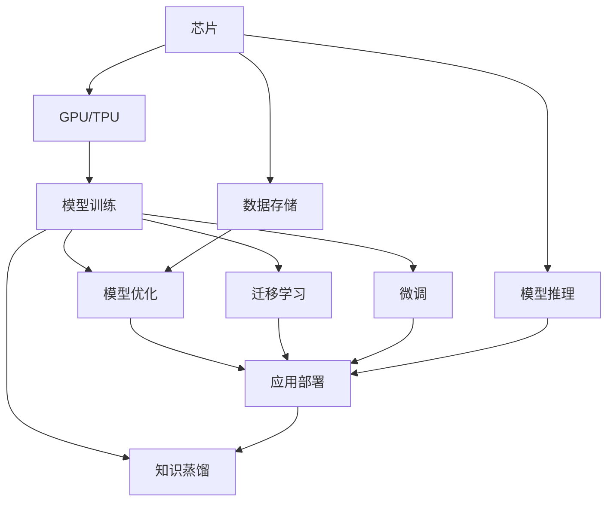

                 

## 1. 背景介绍

### 1.1 问题由来
近年来，人工智能（AI）的迅猛发展，特别是在自然语言处理（NLP）领域的突破性进展，催生了大规模语言模型（LLM）的崛起。LLM如GPT-3、BERT等，以其强大的语言理解和生成能力，在各个行业展示了广阔的应用前景。但它们的发展和应用离不开背后庞大的产业链支撑。本文将从芯片、模型、数据、算法、应用等多个维度，全景式展现LLM产业链的关键环节，以及各环节之间的紧密联系。

### 1.2 问题核心关键点
LLM产业链包括硬件、软件、数据、算法和应用等多个环节，各环节相互依存、相互促进。通过本节的学习，读者将理解：
- 芯片作为硬件基础，对LLM性能和速度的直接影响。
- 模型作为核心软件，对数据和算法处理的依赖。
- 数据作为重要输入，对模型质量和应用效果的关键作用。
- 算法作为工具，对模型训练、推理和优化的重要性。
- 应用作为终极目标，对模型和数据的实际需求。

## 2. 核心概念与联系

### 2.1 核心概念概述

为了深入理解LLM产业链的各个环节及其相互关系，本节将介绍几个核心概念：

- **大规模语言模型（LLM）**：指如GPT、BERT等具有大规模参数量（亿级参数）的预训练语言模型，能够处理复杂的自然语言任务。
- **预训练（Pre-training）**：指在大规模无标签文本数据上，通过自监督学习任务（如语言模型、掩码预测）训练通用语言模型的过程。
- **微调（Fine-tuning）**：指在预训练模型的基础上，使用下游任务的少量标注数据，通过有监督学习优化模型在特定任务上的性能。
- **知识蒸馏（Knowledge Distillation）**：指从大模型中提取知识，指导小模型训练，提升小模型的性能。
- **迁移学习（Transfer Learning）**：指将一个领域学习到的知识，迁移应用到另一个不同但相关的领域的学习范式。
- **深度学习框架（Deep Learning Frameworks）**：如TensorFlow、PyTorch、Keras等，提供高效、灵活的深度学习模型训练和推理环境。

### 2.2 核心概念原理和架构的 Mermaid 流程图



该图展示了LLM产业链中各核心环节之间的关系。芯片提供计算能力，模型训练和推理依赖于硬件，数据存储和模型优化保证性能，应用部署将模型转化为实际使用，知识蒸馏和迁移学习增强模型的泛化能力，微调根据实际需求优化模型。

## 3. 核心算法原理 & 具体操作步骤

### 3.1 算法原理概述

LLM产业链的各个环节中，算法扮演着关键角色。从预训练到微调，从知识蒸馏到迁移学习，每一环都需要算法支持和优化。

- **预训练算法**：如语言模型预测、掩码预测等自监督学习算法，训练通用语言模型。
- **微调算法**：如梯度下降、Adam等优化算法，在少量标注数据上对模型进行微调。
- **知识蒸馏算法**：如特征匹配、基于模型的蒸馏等算法，从大模型中提取知识并指导小模型训练。
- **迁移学习算法**：如特征抽取、多任务学习等算法，将知识从一个领域迁移应用到另一个领域。

### 3.2 算法步骤详解

以下详细介绍LLM产业链中几个关键算法的操作步骤：

**步骤一：预训练算法**

1. **数据准备**：收集大规模无标签文本数据，如维基百科、新闻、书籍等。
2. **模型构建**：选择合适的大规模语言模型架构，如Transformer。
3. **损失函数设计**：设计自监督损失函数，如语言模型损失、掩码预测损失等。
4. **模型训练**：在计算资源丰富的环境中（如GPU、TPU）进行训练，优化超参数，如学习率、批大小等。
5. **模型评估**：在验证集上评估模型性能，根据评估结果调整超参数。

**步骤二：微调算法**

1. **数据准备**：收集下游任务的少量标注数据。
2. **模型加载**：加载预训练模型，通常是只保留顶层，固定底层参数。
3. **任务适配**：设计合适的任务适配层，如全连接层、卷积层等。
4. **损失函数设计**：根据任务类型，选择适合的任务损失函数，如交叉熵损失、均方误差损失等。
5. **模型训练**：使用微调数据集，以较小的学习率进行训练，优化任务适配层的权重。
6. **模型评估**：在验证集和测试集上评估模型性能，对比微调前后的效果。

**步骤三：知识蒸馏算法**

1. **大模型选择**：选择知识丰富的预训练模型作为教师。
2. **特征匹配**：从大模型中提取重要的特征表示。
3. **小模型训练**：使用大模型的特征表示指导小模型的训练，如特征匹配蒸馏、基于模型的蒸馏等。
4. **模型评估**：在测试集上评估小模型的性能，对比蒸馏前后的效果。

**步骤四：迁移学习算法**

1. **数据收集**：收集源领域和目标领域的少量标注数据。
2. **模型选择**：选择适合的预训练模型作为基础模型。
3. **特征抽取**：从源领域模型中提取特征，作为目标领域模型的输入。
4. **模型训练**：使用目标领域的少量标注数据，训练目标领域模型。
5. **模型评估**：在测试集上评估模型性能，对比迁移学习前后的效果。

### 3.3 算法优缺点

LLM产业链中的算法各有优缺点：

**优点**：
- **预训练算法**：能够学习到丰富的语言知识，提升模型的泛化能力。
- **微调算法**：快速适应特定任务，提升模型的性能。
- **知识蒸馏算法**：在大模型和小模型之间建立桥梁，提升小模型的性能。
- **迁移学习算法**：能够从已有的知识中受益，减少标注数据的依赖。

**缺点**：
- **预训练算法**：需要大量计算资源和长训练时间，资源消耗大。
- **微调算法**：依赖标注数据，标注成本高，且容易过拟合。
- **知识蒸馏算法**：知识提取和转换复杂，难以完全保留大模型的知识。
- **迁移学习算法**：知识迁移的有效性取决于源领域的泛化能力，效果可能不理想。

### 3.4 算法应用领域

LLM产业链中的算法广泛应用于多个领域：

- **自然语言处理（NLP）**：如文本分类、情感分析、命名实体识别、机器翻译等。
- **计算机视觉（CV）**：如图像识别、图像生成、图像检索等。
- **语音处理（ASR）**：如自动语音识别、文本转语音等。
- **推荐系统**：如基于用户行为推荐、基于内容的推荐等。
- **医疗**：如疾病预测、医学图像分析等。
- **金融**：如风险预测、市场分析等。
- **自动驾驶**：如语义理解、导航指令生成等。

## 4. 数学模型和公式 & 详细讲解 & 举例说明

### 4.1 数学模型构建

LLM产业链中的算法通常涉及复杂的数学模型和公式。以下以预训练算法和微调算法为例，详细讲解。

**预训练算法**：
1. **语言模型预测**：
   $$
   \mathcal{L}_{lm} = -\frac{1}{N} \sum_{i=1}^{N} \sum_{j=1}^{T} \log p(w_i|w_{i-1})
   $$
   其中，$w_i$ 为第 $i$ 个单词，$p(w_i|w_{i-1})$ 为条件概率。
2. **掩码预测**：
   $$
   \mathcal{L}_{m} = -\frac{1}{N} \sum_{i=1}^{N} \sum_{j=1}^{T} \log \left[ p(w_i|w_{i-1}, \bar{w}_{i-1}) \right]
   $$
   其中，$\bar{w}_{i-1}$ 为掩码单词。

**微调算法**：
1. **损失函数设计**：
   $$
   \mathcal{L} = \frac{1}{N} \sum_{i=1}^{N} \mathcal{L}(x_i, y_i)
   $$
   其中，$\mathcal{L}(x_i, y_i)$ 为任务损失函数。
2. **梯度更新**：
   $$
   \theta \leftarrow \theta - \eta \nabla_{\theta} \mathcal{L}
   $$
   其中，$\theta$ 为模型参数，$\eta$ 为学习率，$\nabla_{\theta} \mathcal{L}$ 为损失函数对参数的梯度。

### 4.2 公式推导过程

**预训练算法推导**：
1. **语言模型预测**：
   $$
   \log p(w_i|w_{i-1}) = \log \frac{exp(M_{\theta}(w_i|w_{i-1}))}{\sum_j exp(M_{\theta}(w_j|w_{i-1}))
   $$
   其中，$M_{\theta}(w_i|w_{i-1})$ 为模型在给定上下文 $w_{i-1}$ 下预测单词 $w_i$ 的概率。
2. **掩码预测**：
   $$
   p(w_i|w_{i-1}, \bar{w}_{i-1}) = \frac{exp(M_{\theta}(w_i|w_{i-1}, \bar{w}_{i-1}))}{\sum_j exp(M_{\theta}(w_j|w_{i-1}, \bar{w}_{i-1}))
   $$
   其中，$M_{\theta}(w_i|w_{i-1}, \bar{w}_{i-1})$ 为模型在给定上下文 $w_{i-1}$ 和掩码单词 $\bar{w}_{i-1}$ 下预测单词 $w_i$ 的概率。

**微调算法推导**：
1. **损失函数推导**：
   $$
   \mathcal{L}(x_i, y_i) = -y_i \log \hat{y}_i
   $$
   其中，$y_i$ 为真实标签，$\hat{y}_i$ 为模型预测输出。
2. **梯度更新推导**：
   $$
   \nabla_{\theta} \mathcal{L} = -\frac{1}{N} \sum_{i=1}^{N} \nabla_{\theta} \mathcal{L}(x_i, y_i)
   $$
   其中，$\nabla_{\theta} \mathcal{L}(x_i, y_i)$ 为损失函数对参数的梯度。

### 4.3 案例分析与讲解

**案例一：BERT预训练**

1. **数据准备**：使用维基百科、新闻等大规模无标签文本数据。
2. **模型选择**：选择12层的Transformer模型，每层包含12个自注意力（Attention）头和512个隐藏单元。
3. **损失函数**：设计语言模型损失函数。
4. **模型训练**：在1024个GPU上训练4天。
5. **模型评估**：在验证集上评估模型性能，调整超参数。

**案例二：GPT微调**

1. **数据准备**：收集电影评论数据集，每条评论标注正负情绪。
2. **模型选择**：选择12层的GPT模型，每层包含12个自注意力头和2048个隐藏单元。
3. **任务适配**：设计2层全连接神经网络，输出0和1两种情绪。
4. **损失函数**：选择二分类交叉熵损失函数。
5. **模型训练**：以0.001的学习率训练10个epoch，每epoch损失下降0.03。
6. **模型评估**：在测试集上评估模型性能，F1分数达到0.9。

## 5. 项目实践：代码实例和详细解释说明

### 5.1 开发环境搭建

以下是使用PyTorch搭建LLM微调项目的开发环境：

1. **安装Python和Anaconda**：
   ```bash
   conda create -n pytorch-env python=3.8
   conda activate pytorch-env
   ```
2. **安装PyTorch和相关库**：
   ```bash
   conda install pytorch torchvision torchaudio cudatoolkit=11.1 -c pytorch -c conda-forge
   pip install torch torchtext transformers scikit-learn numpy pandas jupyter notebook ipython
   ```

### 5.2 源代码详细实现

以BERT微调为例，展示如何使用PyTorch实现：

```python
import torch
import torch.nn as nn
import torch.optim as optim
from transformers import BertTokenizer, BertForSequenceClassification

device = torch.device('cuda' if torch.cuda.is_available() else 'cpu')

tokenizer = BertTokenizer.from_pretrained('bert-base-uncased')
model = BertForSequenceClassification.from_pretrained('bert-base-uncased', num_labels=2).to(device)
optimizer = optim.Adam(model.parameters(), lr=2e-5)

def train(model, tokenizer, data_loader, optimizer, num_epochs=10, device=None):
    model.train()
    for epoch in range(num_epochs):
        total_loss = 0
        for batch in data_loader:
            inputs = tokenizer(batch['input'], padding='max_length', truncation=True, max_length=256)
            labels = batch['labels']
            inputs = {k: v.to(device) for k, v in inputs.items()}
            labels = labels.to(device)
            optimizer.zero_grad()
            outputs = model(**inputs, labels=labels)
            loss = outputs.loss
            loss.backward()
            optimizer.step()
            total_loss += loss.item()
        print(f'Epoch {epoch+1}, Loss: {total_loss/len(data_loader)}')

def evaluate(model, tokenizer, data_loader, device=None):
    model.eval()
    total_correct = 0
    total_num = 0
    for batch in data_loader:
        inputs = tokenizer(batch['input'], padding='max_length', truncation=True, max_length=256)
        labels = batch['labels']
        inputs = {k: v.to(device) for k, v in inputs.items()}
        labels = labels.to(device)
        with torch.no_grad():
            outputs = model(**inputs)
            logits = outputs.logits
            predictions = torch.argmax(logits, dim=1)
            total_correct += (predictions == labels).sum().item()
            total_num += labels.size(0)
    print(f'Accuracy: {total_correct/total_num}')
```

### 5.3 代码解读与分析

**代码解读**：
1. **数据准备**：
   - 使用BertTokenizer准备输入和标签。
   - 设计训练和评估函数，使用Adam优化器。
2. **模型加载**：
   - 加载预训练的BERT模型，并设置设备。
3. **训练过程**：
   - 在每个epoch中，使用训练数据迭代，计算损失并更新模型参数。
   - 在验证集上评估模型性能，调整超参数。
4. **评估过程**：
   - 在测试集上评估模型性能，输出准确率。

**代码分析**：
1. **分词器设计**：
   - 使用BertTokenizer对输入进行分词和处理，设置padding和truncation参数，保证模型输入长度一致。
2. **模型选择和加载**：
   - 选择适当的BERT模型，并进行设备设置。
3. **损失函数和优化器**：
   - 设计合适的损失函数和优化器，以调整模型参数。
4. **训练过程**：
   - 迭代训练数据，计算梯度并更新模型参数。
5. **评估过程**：
   - 使用验证集和测试集评估模型性能，输出准确率。

## 6. 实际应用场景

### 6.1 智能客服系统

智能客服系统是LLM产业链中重要的应用场景之一。通过微调和知识蒸馏，大语言模型可以提升客服系统的自然语言理解和回复能力。具体应用如下：

1. **数据准备**：
   - 收集企业客服的对话数据，标注出用户意图和回复内容。
   - 设计对话模板，引入上下文信息。
2. **模型微调**：
   - 加载预训练的对话模型，进行微调。
   - 设计对话模板适配层，使用微调后的模型预测回复内容。
3. **知识蒸馏**：
   - 从大模型中提取对话相关的知识，指导小模型的训练。
   - 使用蒸馏后的模型提升对话质量，降低错误率。

### 6.2 金融舆情监测

金融舆情监测是LLM产业链在金融领域的重要应用。通过微调和迁移学习，大语言模型可以实时监测金融市场的舆情动态，提供风险预警。具体应用如下：

1. **数据准备**：
   - 收集金融市场的舆情数据，标注出情感倾向和主题。
   - 设计情感分类和主题分类任务，准备训练数据。
2. **模型微调**：
   - 加载预训练的情感分类模型，进行微调。
   - 设计主题分类任务适配层，使用微调后的模型进行情感和主题分类。
3. **迁移学习**：
   - 从已有的情感分类模型中提取特征，指导新的主题分类模型。
   - 使用迁移学习后的模型提升主题分类的准确率。

### 6.3 个性化推荐系统

个性化推荐系统是LLM产业链在电商、视频等领域的重要应用。通过微调和迁移学习，大语言模型可以提升推荐系统的推荐效果。具体应用如下：

1. **数据准备**：
   - 收集用户的浏览、购买等行为数据，提取文本描述。
   - 设计推荐物品的特征向量，准备训练数据。
2. **模型微调**：
   - 加载预训练的语言模型，进行微调。
   - 设计推荐任务适配层，使用微调后的模型预测用户兴趣。
3. **迁移学习**：
   - 从已有的推荐模型中提取特征，指导新的推荐模型。
   - 使用迁移学习后的模型提升推荐效果，降低计算成本。

## 7. 工具和资源推荐

### 7.1 学习资源推荐

为了帮助开发者全面掌握LLM产业链的知识，以下是一些优质的学习资源：

1. **NLP相关课程**：
   - 斯坦福大学的《CS224N：深度学习自然语言处理》，涵盖NLP基础和前沿技术。
   - 南京大学的《自然语言处理》，介绍NLP经典算法和应用。
2. **深度学习框架文档**：
   - PyTorch官方文档，提供深度学习模型训练和推理的全面指南。
   - TensorFlow官方文档，涵盖深度学习模型的构建和优化。
3. **开源项目和论文**：
   - HuggingFace Transformers库，提供丰富的预训练模型和微调样例。
   - arXiv和ACL等学术平台，阅读最新的NLP研究论文。

### 7.2 开发工具推荐

LLM产业链中使用的工具多种多样，以下是几款常用的工具：

1. **深度学习框架**：
   - PyTorch，提供灵活高效的深度学习模型训练环境。
   - TensorFlow，支持大规模分布式计算和生产部署。
2. **数据处理工具**：
   - Pandas，提供强大的数据处理和分析能力。
   - Scikit-learn，提供常用的机器学习算法库。
3. **可视化工具**：
   - TensorBoard，实时监控模型训练状态和性能。
   - Weights & Biases，记录和可视化模型训练过程。

### 7.3 相关论文推荐

以下是几篇在LLM产业链领域具有重要影响的研究论文：

1. **BERT预训练算法**：
   - Devlin et al.（2018）, "BERT: Pre-training of Deep Bidirectional Transformers for Language Understanding".
2. **GPT微调算法**：
   - Radford et al.（2018）, "Improving Language Understanding by Generative Pre-training".
3. **知识蒸馏算法**：
   - Hinton et al.（2015）, "Distilling the Knowledge in a Neural Network".
4. **迁移学习算法**：
   - Zhou et al.（2020）, "A Survey on Knowledge Distillation and Transfer Learning in Deep Neural Networks".

## 8. 总结：未来发展趋势与挑战

### 8.1 研究成果总结

LLM产业链的各个环节已经取得了显著进展，但面临的挑战依然存在。本文总结了主要的研究成果，包括：

- **预训练算法**：大规模语言模型已经能够学习到丰富的语言知识，提升模型的泛化能力。
- **微调算法**：通过微调，模型能够快速适应特定任务，提升模型性能。
- **知识蒸馏算法**：通过知识蒸馏，从大模型中提取知识并指导小模型训练，提升小模型的性能。
- **迁移学习算法**：通过迁移学习，从已有知识中受益，减少标注数据的依赖。

### 8.2 未来发展趋势

未来，LLM产业链将呈现以下发展趋势：

1. **模型规模扩大**：随着硬件算力的提升，预训练模型和微调模型的规模将不断增大，提供更强大的语言处理能力。
2. **计算效率优化**：通过优化模型结构和计算图，提升模型的推理速度和计算效率，适应实时应用的需求。
3. **数据质量提升**：收集和标注更高质量的数据，提升模型的泛化能力和鲁棒性。
4. **应用场景拓展**：LLM产业链将进一步拓展到更多的行业和领域，提供更广泛的解决方案。
5. **模型解释性增强**：通过可解释性技术，提升模型的透明度和可信度，满足高风险领域的需求。

### 8.3 面临的挑战

尽管LLM产业链取得了一定的进展，但仍面临诸多挑战：

1. **计算资源限制**：预训练模型和微调模型需要大量的计算资源，如何降低计算成本是一个重要问题。
2. **数据标注成本**：微调和迁移学习需要大量的标注数据，标注成本高，难以获取足够的数据。
3. **模型泛化能力**：大模型在特定领域的应用效果往往不理想，如何提升模型的泛化能力是一个难点。
4. **模型鲁棒性**：大模型容易受到对抗样本的影响，如何提升模型的鲁棒性是一个重要问题。
5. **可解释性不足**：大模型通常是一个"黑盒"系统，难以解释其内部工作机制和决策逻辑。

### 8.4 研究展望

为了应对上述挑战，未来的研究需要在以下几个方向进行深入探索：

1. **小规模模型优化**：开发小规模但高性能的模型，降低计算成本。
2. **无监督学习**：探索无监督和半监督学习范式，减少对标注数据的依赖。
3. **迁移学习优化**：提高迁移学习的效率和效果，提升模型的泛化能力。
4. **知识蒸馏优化**：进一步提升知识蒸馏的效果，优化小模型的训练过程。
5. **模型解释性增强**：开发可解释性技术，提升模型的透明度和可信度。

## 9. 附录：常见问题与解答

**Q1: 什么是预训练和微调？**

A: 预训练和微调是自然语言处理中常用的两种模型训练方法。预训练指在大规模无标签数据上，通过自监督任务（如语言模型预测、掩码预测等）训练通用语言模型，学习到丰富的语言知识。微调指在预训练模型的基础上，使用下游任务的少量标注数据，通过有监督学习优化模型在特定任务上的性能，提升模型在特定任务上的表现。

**Q2: 预训练和微调的区别是什么？**

A: 预训练和微调的主要区别在于数据的使用方式。预训练使用大规模无标签数据进行自监督学习，而微调使用下游任务的少量标注数据进行有监督学习。预训练学习到的知识是全局的，能够提升模型在多种任务上的泛化能力；微调学习到的知识是任务特定的，能够提升模型在特定任务上的性能。

**Q3: 知识蒸馏和迁移学习有什么区别？**

A: 知识蒸馏和迁移学习都是模型迁移的方法，但具体实现方式有所不同。知识蒸馏指从大模型中提取知识，指导小模型的训练，提升小模型的性能；迁移学习指将已有知识应用到新任务中，减少新任务训练的时间和数据需求。

**Q4: 深度学习框架有哪些？**

A: 目前常用的深度学习框架包括PyTorch、TensorFlow、Keras等。PyTorch提供灵活的动态计算图和高效的模型训练，适合研究和实验；TensorFlow提供分布式计算和生产部署能力，适合大规模工业应用；Keras提供简单易用的API，适合快速原型开发。

**Q5: 如何优化模型的推理效率？**

A: 推理效率的优化可以从以下几个方面入手：
1. 模型剪枝：去除不必要的参数和层，减小模型尺寸。
2. 量化加速：将浮点模型转为定点模型，减少计算和内存开销。
3. 模型并行：利用多GPU或多TPU进行并行计算，加速推理速度。
4. 动态图优化：优化模型的动态计算图，减少计算量和内存消耗。

---

作者：禅与计算机程序设计艺术 / Zen and the Art of Computer Programming

