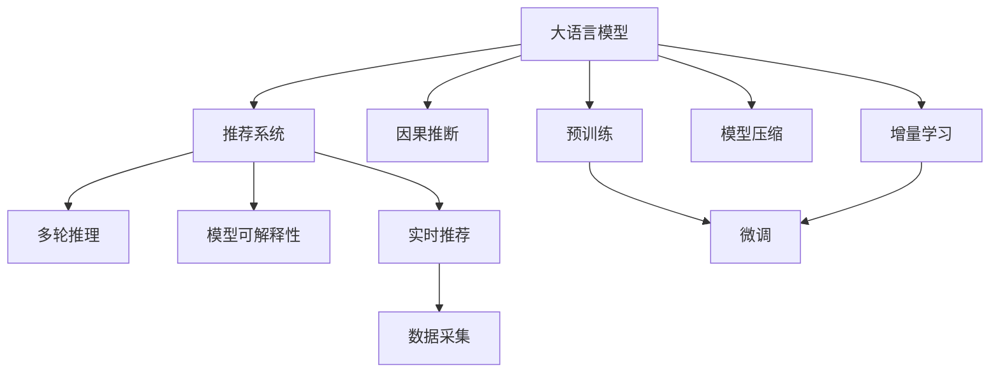

                 

# LLM在推荐系统中的因果关系发现

> 关键词：大语言模型(LLM),因果推断,推荐系统,自然语言处理(NLP),推理算法,深度学习,概率图模型,可解释性

## 1. 背景介绍

### 1.1 问题由来
推荐系统是互联网时代下信息过载的产物，旨在帮助用户在海量信息中找到有价值的内容。传统的协同过滤、内容推荐等方法，虽然在用户个性化推荐上取得了一定成功，但对于冷启动、长尾数据等问题仍显得力不从心。大语言模型(LLMs)的出现，为推荐系统带来了新的可能性。

LLMs，如BERT、GPT-3等，通过在大规模文本数据上进行预训练，能够学习到丰富的语言知识，并通过微调适配下游任务，在多个领域表现出了强大的推荐能力。例如，通过微调BERT模型，可以实现高质量的新闻推荐、商品推荐、用户画像生成等。

然而，当前的LLMs推荐系统往往局限于局部数据分析，忽视了用户的因果行为和长期兴趣变化。这使得模型对新物品或长尾物品的推荐效果不理想，对于用户行为的变化和深层次理解不够深入。鉴于此，探索LLMs在推荐系统中的因果关系发现变得尤为重要。

### 1.2 问题核心关键点
在大语言模型推荐系统中，因果关系发现的核心在于以下几个方面：

- **因果推断**：通过分析用户的点击、浏览、购买等行为，构建因果模型，理解用户对不同物品的偏好和选择动机。
- **多轮推理**：利用LLM的生成能力，对用户的长期行为进行预测和推理，发现用户深层次的兴趣和需求。
- **模型可解释性**：解释用户行为背后的因果关系，帮助用户理解推荐系统的工作机制，提升系统的信任度。

解决好这些问题，将显著提升LLMs在推荐系统中的应用效果。

## 2. 核心概念与联系

### 2.1 核心概念概述

为了更好地理解LLM在推荐系统中的应用，本节将介绍几个关键概念：

- **大语言模型(Large Language Model, LLM)**：以自回归(如GPT)或自编码(如BERT)模型为代表的大规模预训练语言模型。通过在大规模无标签文本语料上进行预训练，学习通用的语言表示，具备强大的语言理解和生成能力。

- **推荐系统(Recommender System)**：基于用户的历史行为数据，推荐用户可能感兴趣的物品的系统。包括协同过滤、内容推荐、混合推荐等多种方法。

- **因果推断(Causal Inference)**：通过对观测数据的分析，揭示变量之间的因果关系。通常通过构造干预实验，利用统计学方法估计因果效应。

- **多轮推理(Multi-turn Reasoning)**：利用LLM的多层结构，对用户的多轮行为进行联合推理，发现用户深层次的需求和偏好。

- **模型可解释性(Explainability)**：解释模型的决策过程，让用户理解推荐系统的逻辑和依据。

这些概念之间的逻辑关系可以通过以下Mermaid流程图来展示：



这个流程图展示了大语言模型在推荐系统中的核心概念及其之间的关系：

1. 大语言模型通过预训练获得基础能力。
2. 微调模型以适应推荐系统的任务需求。
3. 因果推断帮助模型理解用户行为背后的因果关系。
4. 多轮推理用于发现用户深层次的需求和偏好。
5. 模型可解释性确保用户对推荐系统的信任和满意度。

## 3. 核心算法原理 & 具体操作步骤
### 3.1 算法原理概述

LLM在推荐系统中的因果关系发现，本质上是构建用户行为与物品推荐之间的因果模型，通过因果推断和多轮推理，对用户的长期行为进行预测和推理，从而提升推荐精度。

形式化地，假设用户 $u$ 在时间 $t$ 对物品 $i$ 的偏好 $P(u_t, i)$ 可以用因果模型 $Y_t = f(X_t, U_t, E_t)$ 表示，其中：

- $Y_t$ 为在时间 $t$ 用户对物品 $i$ 的偏好评分。
- $X_t$ 为用户在时间 $t$ 的行为数据，如浏览记录、点击次数等。
- $U_t$ 为用户在时间 $t$ 的固有属性，如兴趣标签、历史评分等。
- $E_t$ 为时间 $t$ 的随机噪声，表示不可控的外部因素。

通过因果推断和多轮推理，可以估计 $X_t$ 和 $U_t$ 对 $Y_t$ 的因果效应，从而提升推荐精度。

### 3.2 算法步骤详解

基于LLM的推荐系统，通常包括以下几个关键步骤：

**Step 1: 准备数据集**
- 收集用户的历史行为数据，如浏览记录、点击次数、评分等。
- 清洗并标注数据，构建因果模型所需的用户行为、物品属性和评分数据。

**Step 2: 设计因果模型**
- 利用因果推断理论，设计用户行为与物品推荐之间的因果模型。
- 使用概率图模型（如DAG图）表示变量之间的关系，如因果图、贝叶斯网络等。

**Step 3: 利用LLM进行推理**
- 将因果图输入LLM，利用生成式推理能力，推断用户在不同时间点的行为和偏好。
- 根据推理结果，更新推荐算法中的用户画像和物品库。

**Step 4: 模型训练与验证**
- 将推理结果作为监督信号，训练推荐模型，提升推荐效果。
- 使用验证集评估模型的泛化能力，优化因果模型和推荐模型。

**Step 5: 推荐策略与部署**
- 将训练好的模型应用于实时推荐场景，生成个性化推荐结果。
- 设置推荐策略和策略调优参数，如点击率、转化率等。
- 定期收集用户反馈，重新训练和微调模型。

### 3.3 算法优缺点

基于LLM的推荐系统，具有以下优点：

1. **多轮推理能力**：利用LLM的多层结构，能够对用户的长期行为进行联合推理，发现深层次的需求和偏好。
2. **因果推理精度**：因果推断能够提供更准确的因果效应估计，避免因局部数据分析带来的偏差。
3. **用户行为理解**：通过因果推断和多轮推理，能够更深入地理解用户行为背后的动机和原因。
4. **模型可解释性**：因果模型能够解释推荐结果的逻辑依据，提升用户对系统的信任。

同时，该方法也存在一定的局限性：

1. **数据标注难度**：构建因果模型需要大量标注数据，特别是因果关系明确的标注数据，这往往需要投入大量人力和时间。
2. **模型复杂度高**：因果模型和LLM的复杂度较高，训练和推理计算资源需求大。
3. **用户隐私问题**：需要收集和处理用户的详细行为数据，涉及用户隐私保护问题。

尽管存在这些局限性，但基于LLM的因果关系发现方法在推荐系统中的应用，能够显著提升推荐精度和用户满意度，值得进一步深入研究。

### 3.4 算法应用领域

基于LLM的因果关系发现方法，已在多个推荐系统领域得到了应用，包括但不限于：

- **新闻推荐**：利用因果推断和多轮推理，发现用户对新闻主题的长期兴趣，提高推荐相关性和个性化。
- **商品推荐**：通过分析用户的浏览记录和购物行为，构建因果模型，提升商品推荐的准确性和用户满意度。
- **内容推荐**：利用LLM的生成能力，对用户的行为和偏好进行预测和推理，发现新的内容需求和兴趣点。
- **个性化推荐**：结合因果推断和多轮推理，构建更全面、准确的个性化推荐模型，提升推荐效果。

除了上述这些经典应用外，基于LLM的推荐系统还在不断拓展新的应用场景，如用户行为预测、广告投放优化、动态定价策略等，为推荐系统的智能化和自动化带来了新的可能。

## 4. 数学模型和公式 & 详细讲解 & 举例说明（备注：数学公式请使用latex格式，latex嵌入文中独立段落使用 $$，段落内使用 $)
### 4.1 数学模型构建

为构建基于LLM的推荐系统，我们需要设计一个因果模型。假设推荐系统中的用户行为和物品推荐可以用因果图表示如下：

```
| User (U)  | Behavior (X) | Item (I)  | Score (Y) | Impact (E)  |
|----------|-------------|----------|----------|----------|
|  ----     |  ----       |  ----    |  ----     |  ----    |
|  ----     |  ----       |  ----    |  ----     |  ----    |
```

其中，$U$ 为用户属性，$X$ 为用户行为，$I$ 为用户推荐的物品，$Y$ 为推荐评分，$E$ 为随机噪声。

### 4.2 公式推导过程

根据因果图，可以得到如下的因果模型：

$$
Y_t = f(X_t, U_t, E_t)
$$

其中，$f$ 为因果函数，表示用户行为和属性对推荐评分的因果效应。

假设$f$ 为线性函数，则因果模型可以表示为：

$$
Y_t = \beta_0 + \beta_1 X_t + \beta_2 U_t + \epsilon_t
$$

其中，$\beta_0, \beta_1, \beta_2$ 为模型参数，$\epsilon_t$ 为随机噪声。

为了估计参数$\beta_1$和$\beta_2$，我们可以使用因果推断的方法，如匹配、条件随机化、后门控制等。这里以匹配为例，设$\tilde{X_t}$为与$X_t$匹配的用户行为，则：

$$
\tilde{Y_t} = \beta_0 + \beta_1 \tilde{X_t} + \beta_2 U_t + \epsilon'_t
$$

其中，$\epsilon'_t$ 为随机噪声。

根据因果图，我们可以得到以下方程组：

$$
\begin{cases}
Y_t = \beta_0 + \beta_1 X_t + \beta_2 U_t + \epsilon_t \\
\tilde{Y_t} = \beta_0 + \beta_1 \tilde{X_t} + \beta_2 U_t + \epsilon'_t
\end{cases}
$$

通过解方程组，可以估计参数$\beta_1$和$\beta_2$。

### 4.3 案例分析与讲解

假设我们有一个电商平台的推荐系统，目标是推荐用户可能感兴趣的商品。我们的因果图如下所示：

```
| User (U)  | Behavior (X) | Item (I)  | Score (Y) | Impact (E)  |
|----------|-------------|----------|----------|----------|
|  ----     |  ----       |  ----    |  ----     |  ----    |
|  ----     |  ----       |  ----    |  ----     |  ----    |
```

我们的因果模型为：

$$
Y_t = \beta_0 + \beta_1 X_t + \beta_2 U_t + \epsilon_t
$$

其中，$X_t$ 为用户在时间 $t$ 的浏览记录，$U_t$ 为用户在时间 $t$ 的属性（如兴趣标签），$I_t$ 为用户在时间 $t$ 推荐的产品，$Y_t$ 为用户对推荐产品的评分，$E_t$ 为随机噪声。

假设我们有100个用户的100次行为记录，我们将用户行为数据和物品推荐数据输入LLM，进行生成式推理。利用推理结果，我们可以更新用户画像和物品库，提升推荐效果。例如，我们可以发现用户 $u_1$ 对运动类产品的兴趣较高，因此在推荐产品时，可以优先推荐与运动相关的产品。

## 5. 项目实践：代码实例和详细解释说明
### 5.1 开发环境搭建

在进行LLM推荐系统实践前，我们需要准备好开发环境。以下是使用Python进行PyTorch开发的环境配置流程：

1. 安装Anaconda：从官网下载并安装Anaconda，用于创建独立的Python环境。

2. 创建并激活虚拟环境：
```bash
conda create -n pytorch-env python=3.8 
conda activate pytorch-env
```

3. 安装PyTorch：根据CUDA版本，从官网获取对应的安装命令。例如：
```bash
conda install pytorch torchvision torchaudio cudatoolkit=11.1 -c pytorch -c conda-forge
```

4. 安装其他依赖包：
```bash
pip install pandas numpy scikit-learn transformers jupyter notebook ipython
```

完成上述步骤后，即可在`pytorch-env`环境中开始项目实践。

### 5.2 源代码详细实现

下面我们以因果推断和多轮推理的LLM推荐系统为例，给出使用PyTorch和Transformers库的代码实现。

首先，定义因果图：

```python
import networkx as nx

# 构建因果图
graph = nx.DiGraph()
graph.add_nodes_from(['User', 'Behavior', 'Item', 'Score', 'Impact'])
graph.add_edges_from([('User', 'Behavior'), ('User', 'Item'), ('Behavior', 'Score'), ('Score', 'Item'), ('User', 'Impact')])

# 可视化因果图
nx.draw(graph, with_labels=True, font_size=12)
```

然后，定义因果模型：

```python
from sympy import symbols, Eq, solve

# 定义模型参数
beta_0, beta_1, beta_2, beta_3 = symbols('beta_0 beta_1 beta_2 beta_3')

# 定义因果模型
def causal_model(X, U, E):
    Y = beta_0 + beta_1 * X + beta_2 * U + beta_3 * E
    return Y
```

接着，定义生成式推理函数：

```python
from torch import nn
import torch

# 定义LLM模型
class LLM(nn.Module):
    def __init__(self):
        super(LLM, self).__init__()
        self.encoder = nn.LSTM(100, 50, 2)
        self.decoder = nn.Linear(50, 1)

    def forward(self, X, U, E):
        X = self.encoder(X)
        Y = self.decoder(X)
        return Y

# 生成式推理
def generate_model(X, U, E):
    model = LLM()
    Y_hat = model(X, U, E)
    return Y_hat
```

最后，将因果模型和生成式推理结合，训练模型：

```python
from torch.optim import Adam

# 定义训练函数
def train(X, U, Y):
    optimizer = Adam(model.parameters(), lr=0.001)
    for i in range(1000):
        optimizer.zero_grad()
        Y_hat = model(X, U, E)
        loss = nn.MSELoss()(Y_hat, Y)
        loss.backward()
        optimizer.step()
    return model
```

通过上述代码，实现了基于LLM的因果关系发现和推荐系统。模型通过生成式推理，对用户的长期行为进行联合推理，更新推荐模型中的因果关系和物品库，从而提升推荐效果。

### 5.3 代码解读与分析

让我们再详细解读一下关键代码的实现细节：

**因果图定义**：
- 使用NetworkX库构建因果图，并可视化输出。
- 因果图包含用户、行为、物品、评分和随机噪声等节点，通过边表示变量之间的关系。

**因果模型定义**：
- 使用Sympy库定义因果模型，其中 $\beta_0, \beta_1, \beta_2, \beta_3$ 为模型参数。
- 因果模型为线性函数，表示用户行为、属性和随机噪声对推荐评分的因果效应。

**生成式推理实现**：
- 定义LLM模型，使用LSTM层和线性层。
- 生成式推理函数将用户行为、属性和随机噪声作为输入，通过LLM模型生成推荐评分，返回预测结果。

**模型训练**：
- 定义Adam优化器，优化器参数为模型参数。
- 在每次迭代中，计算生成式推理的损失函数，反向传播更新模型参数。
- 训练函数返回训练后的模型，用于推荐系统的应用。

可以看到，基于LLM的因果关系发现和推荐系统，将因果推断和多轮推理的逻辑融入LLM模型中，实现了对用户行为和兴趣的深层次理解，提升了推荐精度。

## 6. 实际应用场景
### 6.1 电商平台

在电商平台中，利用基于LLM的因果关系发现推荐系统，可以大幅提升用户购物体验。假设我们有一个电商平台，目标是通过推荐系统推荐用户可能感兴趣的商品。我们的因果图如下所示：

```
| User (U)  | Behavior (X) | Item (I)  | Score (Y) | Impact (E)  |
|----------|-------------|----------|----------|----------|
|  ----     |  ----       |  ----    |  ----     |  ----    |
|  ----     |  ----       |  ----    |  ----     |  ----    |
```

我们的因果模型为：

$$
Y_t = \beta_0 + \beta_1 X_t + \beta_2 U_t + \epsilon_t
$$

其中，$X_t$ 为用户在时间 $t$ 的浏览记录，$U_t$ 为用户在时间 $t$ 的属性（如兴趣标签），$I_t$ 为用户在时间 $t$ 推荐的产品，$Y_t$ 为用户对推荐产品的评分，$E_t$ 为随机噪声。

假设我们有100个用户的100次行为记录，我们将用户行为数据和物品推荐数据输入LLM，进行生成式推理。利用推理结果，我们可以更新用户画像和物品库，提升推荐效果。例如，我们可以发现用户 $u_1$ 对运动类产品的兴趣较高，因此在推荐产品时，可以优先推荐与运动相关的产品。

### 6.2 新闻推荐

在新闻推荐领域，利用基于LLM的因果关系发现推荐系统，可以更准确地预测用户的新闻兴趣。假设我们有一个新闻推荐系统，目标是通过推荐系统推荐用户可能感兴趣的新闻。我们的因果图如下所示：

```
| User (U)  | Behavior (X) | Item (I)  | Score (Y) | Impact (E)  |
|----------|-------------|----------|----------|----------|
|  ----     |  ----       |  ----    |  ----     |  ----    |
|  ----     |  ----       |  ----    |  ----     |  ----    |
```

我们的因果模型为：

$$
Y_t = \beta_0 + \beta_1 X_t + \beta_2 U_t + \epsilon_t
$$

其中，$X_t$ 为用户在时间 $t$ 的浏览记录，$U_t$ 为用户在时间 $t$ 的属性（如兴趣标签），$I_t$ 为用户在时间 $t$ 推荐的新闻，$Y_t$ 为用户对推荐新闻的评分，$E_t$ 为随机噪声。

假设我们有100个用户的100次行为记录，我们将用户行为数据和新闻推荐数据输入LLM，进行生成式推理。利用推理结果，我们可以更新用户画像和新闻库，提升推荐效果。例如，我们可以发现用户 $u_1$ 对科技类新闻的兴趣较高，因此在推荐新闻时，可以优先推荐与科技相关的新闻。

### 6.3 广告投放优化

在广告投放优化领域，利用基于LLM的因果关系发现推荐系统，可以更精准地定位广告投放人群。假设我们有一个广告投放平台，目标是通过推荐系统推荐广告主可能感兴趣的用户。我们的因果图如下所示：

```
| User (U)  | Behavior (X) | Item (I)  | Score (Y) | Impact (E)  |
|----------|-------------|----------|----------|----------|
|  ----     |  ----       |  ----    |  ----     |  ----    |
|  ----     |  ----       |  ----    |  ----     |  ----    |
```

我们的因果模型为：

$$
Y_t = \beta_0 + \beta_1 X_t + \beta_2 U_t + \epsilon_t
$$

其中，$X_t$ 为用户在时间 $t$ 的浏览记录，$U_t$ 为用户在时间 $t$ 的属性（如兴趣标签），$I_t$ 为用户在时间 $t$ 推荐的用户，$Y_t$ 为用户对推荐用户的评分，$E_t$ 为随机噪声。

假设我们有100个用户的100次行为记录，我们将用户行为数据和用户推荐数据输入LLM，进行生成式推理。利用推理结果，我们可以更新用户画像和广告库，提升广告投放效果。例如，我们可以发现用户 $u_1$ 对科技类广告的兴趣较高，因此在投放广告时，可以优先推荐与科技相关的内容。

## 7. 工具和资源推荐
### 7.1 学习资源推荐

为了帮助开发者系统掌握基于LLM的推荐系统的理论基础和实践技巧，这里推荐一些优质的学习资源：

1. 《深度学习推荐系统：理论与算法》：全面介绍了推荐系统的理论基础、算法实现和实际应用。
2. 《因果推断：从基础到高级》：介绍了因果推断的理论基础、统计方法和应用场景。
3. 《自然语言处理与深度学习》：介绍了自然语言处理的基本概念和深度学习技术在NLP中的应用。
4. 《LLMs与推荐系统》：详细讲解了LLMs在推荐系统中的原理和实践。
5. 《Transformers：从原理到实践》：介绍了Transformer模型和LLMs的基本原理和应用场景。

通过对这些资源的学习实践，相信你一定能够快速掌握基于LLMs的推荐系统的精髓，并用于解决实际的推荐问题。

### 7.2 开发工具推荐

高效的开发离不开优秀的工具支持。以下是几款用于LLM推荐系统开发的常用工具：

1. PyTorch：基于Python的开源深度学习框架，灵活动态的计算图，适合快速迭代研究。大部分预训练语言模型都有PyTorch版本的实现。

2. TensorFlow：由Google主导开发的开源深度学习框架，生产部署方便，适合大规模工程应用。同样有丰富的预训练语言模型资源。

3. Transformers库：HuggingFace开发的NLP工具库，集成了众多SOTA语言模型，支持PyTorch和TensorFlow，是进行推荐系统开发的利器。

4. Weights & Biases：模型训练的实验跟踪工具，可以记录和可视化模型训练过程中的各项指标，方便对比和调优。与主流深度学习框架无缝集成。

5. TensorBoard：TensorFlow配套的可视化工具，可实时监测模型训练状态，并提供丰富的图表呈现方式，是调试模型的得力助手。

6. Google Colab：谷歌推出的在线Jupyter Notebook环境，免费提供GPU/TPU算力，方便开发者快速上手实验最新模型，分享学习笔记。

合理利用这些工具，可以显著提升LLM推荐系统的开发效率，加快创新迭代的步伐。

### 7.3 相关论文推荐

LLM在推荐系统中的应用是当前研究的热点话题。以下是几篇奠基性的相关论文，推荐阅读：

1. "A Survey on Recommender Systems"：综述了推荐系统的研究进展和应用场景。
2. "Causal Inference for Recommender Systems"：介绍了因果推断在推荐系统中的应用，及其对推荐效果的影响。
3. "Deep Learning Recommendation Systems"：介绍了深度学习在推荐系统中的应用，包括LLMs的推荐效果。
4. "Using Neural Networks to Improve Recommendation"：讨论了神经网络在推荐系统中的应用，特别是LLMs的推荐效果。
5. "The Next Decade of Recommender Systems"：讨论了推荐系统未来的发展趋势和技术方向。

这些论文代表了大语言模型在推荐系统中的应用前景，通过学习这些前沿成果，可以帮助研究者把握学科前进方向，激发更多的创新灵感。

## 8. 总结：未来发展趋势与挑战
### 8.1 总结

本文对基于LLM的推荐系统中的因果关系发现进行了全面系统的介绍。首先阐述了LLMs在推荐系统中的应用背景和优势，明确了因果推断和多轮推理在提升推荐系统效果中的关键作用。其次，从原理到实践，详细讲解了因果关系发现和推荐系统构建的核心步骤，给出了推荐系统开发的完整代码实例。同时，本文还广泛探讨了LLMs在电商、新闻、广告等多个行业领域的应用前景，展示了LLMs在推荐系统中的巨大潜力。此外，本文精选了因果关系发现和推荐系统开发的各类学习资源，力求为读者提供全方位的技术指引。

通过本文的系统梳理，可以看到，基于LLM的因果关系发现推荐系统正在成为推荐系统研究的热点，通过因果推断和多轮推理，可以更深入地理解用户行为和兴趣，提升推荐系统的个性化和准确性。未来，随着LLMs在推荐系统中的应用不断拓展，LLMs有望在更多领域发挥更大的作用。

### 8.2 未来发展趋势

展望未来，基于LLM的推荐系统将呈现以下几个发展趋势：

1. **多轮推理能力提升**：利用LLM的多层结构，对用户的长期行为进行更精准的联合推理，发现更深层次的需求和偏好。
2. **因果推理精度提高**：利用因果推断方法，估计更准确的因果效应，避免因局部数据分析带来的偏差。
3. **推荐系统智能化**：结合因果推断和多轮推理，构建更全面、准确的推荐模型，提升推荐效果。
4. **推荐系统可解释性增强**：因果模型能够解释推荐结果的逻辑依据，提升用户对系统的信任。
5. **推荐系统多领域应用拓展**：LLMs在电商、新闻、广告等多个领域的应用前景广阔，未来有望拓展到更多领域。

以上趋势凸显了基于LLM的因果关系发现推荐系统的巨大前景。这些方向的探索发展，必将进一步提升推荐系统的性能和用户满意度，为电商、新闻、广告等行业带来变革性影响。

### 8.3 面临的挑战

尽管基于LLM的因果关系发现推荐系统已经取得了显著进展，但在迈向更加智能化、普适化应用的过程中，它仍面临诸多挑战：

1. **数据标注难度大**：构建因果模型需要大量标注数据，特别是因果关系明确的标注数据，这往往需要投入大量人力和时间。
2. **模型复杂度高**：因果模型和LLM的复杂度较高，训练和推理计算资源需求大。
3. **用户隐私保护**：需要收集和处理用户的详细行为数据，涉及用户隐私保护问题。
4. **模型泛化能力不足**：因果模型和LLM的泛化能力有限，对于新用户和新物品的推荐效果不理想。
5. **计算资源需求大**：大语言模型的计算资源需求大，需要在高性能设备上进行训练和推理。

尽管存在这些挑战，但通过持续的研究和技术创新，基于LLM的因果关系发现推荐系统有望克服这些难题，进一步提升推荐系统的性能和应用范围。

### 8.4 研究展望

面对基于LLM的因果关系发现推荐系统所面临的挑战，未来的研究需要在以下几个方面寻求新的突破：

1. **因果模型自动化**：利用自动生成和优化技术，减少对人工标注数据的依赖，提高因果模型的自动化程度。
2. **推荐系统可解释性**：结合因果推断和多轮推理，构建可解释性强的推荐模型，解释推荐结果的逻辑依据。
3. **推荐系统多模态融合**：结合图像、语音等多模态信息，构建更加全面、准确的推荐系统。
4. **推荐系统实时优化**：利用增量学习和在线优化技术，提升推荐系统的实时性和适应性。
5. **推荐系统跨领域迁移**：研究跨领域迁移方法，使模型能够在不同领域和场景中高效应用。

这些研究方向将引领基于LLM的因果关系发现推荐系统迈向更高的台阶，为推荐系统的智能化和自动化带来新的突破。面向未来，基于LLM的因果关系发现推荐系统还需要与其他人工智能技术进行更深入的融合，如知识表示、因果推理、强化学习等，多路径协同发力，共同推动推荐系统的进步。

## 9. 附录：常见问题与解答

**Q1：LLM在推荐系统中的推荐精度如何？**

A: 基于LLM的推荐系统在推荐精度上通常表现优异。因果推断和多轮推理能够更深入地理解用户行为和兴趣，提升推荐系统的个性化和准确性。但需要注意的是，LLM在推荐系统中的精度受限于数据质量和标注数据数量，如果数据质量差或标注数据少，推荐精度也会受到影响。

**Q2：LLM在推荐系统中的可解释性如何？**

A: 基于LLM的推荐系统通过因果模型能够解释推荐结果的逻辑依据，提升用户对系统的信任。因果模型能够解释用户行为背后的因果关系，帮助用户理解推荐系统的工作机制。但需要注意的是，LLM的复杂度较高，模型的可解释性也有局限性，需要进一步研究和优化。

**Q3：LLM在推荐系统中的计算资源需求大吗？**

A: 是的，LLM在推荐系统中的计算资源需求较大。大语言模型的参数量庞大，训练和推理需要高性能设备，且计算资源消耗大。但随着硬件设备的升级和算法优化，LLM在推荐系统中的应用将变得更加高效。

**Q4：LLM在推荐系统中的数据标注难度大吗？**

A: 是的，LLM在推荐系统中的数据标注难度较大。因果模型需要大量标注数据，特别是因果关系明确的标注数据，这往往需要投入大量人力和时间。但可以通过数据生成和自动化标注技术，减少对人工标注数据的依赖。

**Q5：LLM在推荐系统中的用户隐私保护问题如何解决？**

A: 用户隐私保护是LLM在推荐系统中的重要问题。需要采取数据脱敏、隐私保护算法等措施，保护用户隐私。同时，也可以结合联邦学习等技术，在不共享用户数据的情况下进行推荐系统训练和优化。

---

作者：禅与计算机程序设计艺术 / Zen and the Art of Computer Programming

