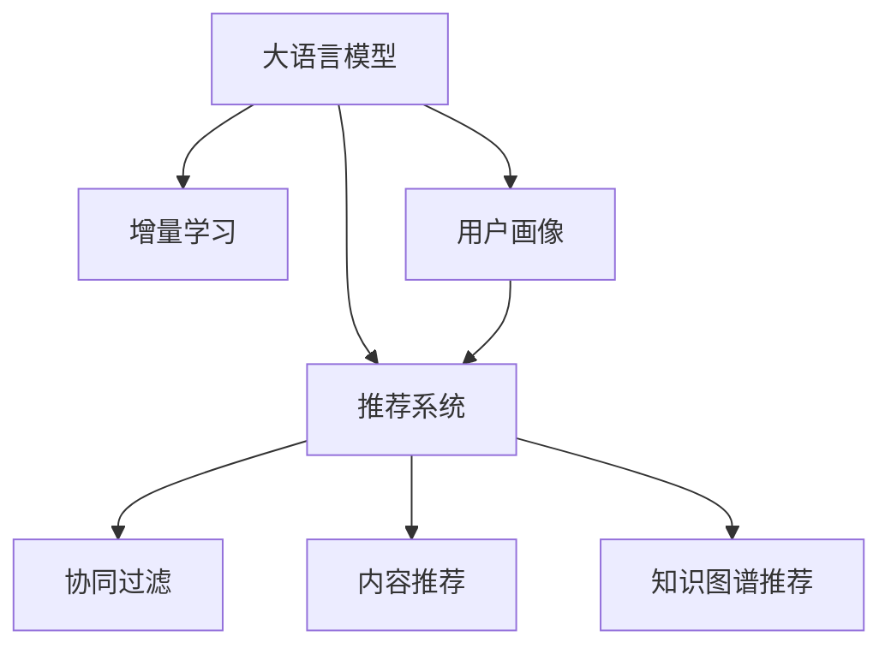

                 

# LLM在推荐系统中的增量学习方法

> 关键词：大语言模型, 推荐系统, 增量学习, 用户画像, 推荐算法, 模型优化

## 1. 背景介绍

### 1.1 问题由来

随着互联网和数字技术的发展，推荐系统成为各大电商平台、内容平台、社交网络不可或缺的一部分。推荐系统的目标是帮助用户发现感兴趣的内容，提升用户体验和平台粘性。传统的推荐系统依赖于用户历史行为数据，通过协同过滤、内容推荐等算法生成推荐列表。然而，这些方法在处理大规模数据时，存在计算成本高、扩展性差等问题。

近年来，随着自然语言处理(NLP)和深度学习技术的发展，基于语言模型的推荐方法应运而生。其中，大语言模型（Large Language Models，LLMs）以其强大的语言理解和生成能力，成为推荐系统的新宠。利用LLMs，推荐系统可以更加全面地理解用户的意图和兴趣，生成更加个性化的推荐内容。然而，大规模的语言模型往往需要巨量的计算资源和存储空间，限制了其在实际推荐系统中的应用。

### 1.2 问题核心关键点

本节将探讨如何通过增量学习技术，优化基于大语言模型的推荐系统，使其在实际部署中具备高效、灵活的特点。

1. **增量学习**：指在已有模型的基础上，通过新数据的不断加入，逐步更新模型参数，而不必从头训练模型。这不仅能节省计算资源，还能避免模型性能因大规模数据迁移而下降。

2. **用户画像**：通过对用户历史行为数据的分析，构建用户画像，描述用户的兴趣偏好、历史偏好、个性化需求等。

3. **推荐算法**：在用户画像的基础上，选择合适的推荐算法，如基于深度学习的序列推荐、基于知识图谱的推荐、基于语义相似性的推荐等。

4. **模型优化**：通过正则化、正交化等技术优化模型，避免模型过拟合，提高模型泛化能力。

5. **增量训练与更新**：在新数据加入时，如何高效地更新模型，避免重复计算，减少对系统资源的占用。

## 2. 核心概念与联系

### 2.1 核心概念概述

为更好地理解基于大语言模型的增量学习方法，本节将介绍几个密切相关的核心概念：

- 大语言模型(Large Language Models, LLM)：如GPT-3、BERT等，通过在大规模无标签文本数据上进行预训练，学习通用的语言表示，具备强大的语言理解和生成能力。

- 增量学习(Incremental Learning)：指在已有模型的基础上，通过新数据的不断加入，逐步更新模型参数，以适应新数据和新需求。

- 推荐系统(Recommendation System)：通过分析用户历史行为数据，为用户推荐感兴趣的内容的系统。

- 协同过滤(Collaborative Filtering)：通过分析用户和物品的相似性，生成推荐列表。

- 内容推荐(Content-Based Recommendation)：根据物品的属性和特征，为用户推荐相关内容。

- 知识图谱(Knowledge Graph)：用于表示实体之间的关系，支持基于图谱的推荐。

这些核心概念之间的逻辑关系可以通过以下Mermaid流程图来展示：



这个流程图展示了大语言模型、增量学习、推荐系统及其主要推荐算法之间的联系：

1. 大语言模型通过预训练获得基础能力。
2. 增量学习是优化已有模型的重要手段。
3. 推荐系统使用已有模型和算法为用户推荐内容。
4. 协同过滤、内容推荐和知识图谱推荐是推荐系统的三大算法。
5. 用户画像用于刻画用户特征，为推荐系统提供输入。

## 3. 核心算法原理 & 具体操作步骤
### 3.1 算法原理概述

基于大语言模型的推荐系统，本质上是一个增量学习的过程。其核心思想是：在已有语言模型的基础上，通过新用户的加入，逐步更新模型参数，以适应用户的多样化需求和行为。

形式化地，假设预训练语言模型为 $M_{\theta}$，其中 $\theta$ 为预训练得到的模型参数。给定用户 $u$ 的推荐请求，以及其历史行为数据 $D_u$，推荐系统的目标是最小化预测误差 $\epsilon$，即：

$$
\epsilon = \sum_{x \in D_u} \ell(M_{\theta}(x), y(x))
$$

其中 $\ell$ 为损失函数，用于衡量模型输出与真实标签之间的差异。常见的损失函数包括交叉熵损失、均方误差损失等。

通过梯度下降等优化算法，增量过程不断更新模型参数 $\theta$，最小化预测误差 $\epsilon$，使得模型输出逼近真实标签。由于 $\theta$ 已经通过预训练获得了较好的初始化，因此即便在新增少量用户的情况下，也能较快收敛到理想的模型参数 $\hat{\theta}$。

### 3.2 算法步骤详解

基于大语言模型的增量推荐方法一般包括以下几个关键步骤：

**Step 1: 准备预训练模型和数据集**
- 选择合适的预训练语言模型 $M_{\theta}$ 作为初始化参数，如 GPT-3、BERT 等。
- 准备推荐系统的用户数据集 $D=\{(u_i, D_{ui})\}_{i=1}^N$，其中 $u_i$ 为第 $i$ 个用户，$D_{ui}$ 为该用户的全部行为数据，包括点击、浏览、评分等。

**Step 2: 设计用户画像**
- 根据用户的行为数据，设计合适的用户画像特征向量 $P(u)$，用于描述用户的兴趣偏好、历史偏好、个性化需求等。
- 用户画像可以包括用户的浏览历史、点击行为、评分数据等。

**Step 3: 选择推荐算法**
- 根据推荐场景和数据特点，选择合适的推荐算法。常用的算法包括协同过滤、内容推荐、知识图谱推荐等。
- 对于协同过滤算法，可以通过用户-物品矩阵 $M$ 计算用户和物品的相似性，生成推荐列表。
- 对于内容推荐算法，可以基于物品的特征向量 $F$ 和用户画像 $P(u)$ 计算相似度，生成推荐列表。
- 对于知识图谱推荐算法，可以基于图谱中实体之间的关系，生成推荐列表。

**Step 4: 增量训练与更新**
- 对于新加入的用户，将其历史行为数据 $D_{ui}$ 转换为模型输入，通过前向传播计算预测输出。
- 根据预测输出和真实标签之间的差异，反向传播计算参数梯度，更新模型参数 $\theta$。
- 定期在新加入的用户数据上评估模型性能，根据性能指标决定是否触发模型更新。
- 重复上述步骤直至满足预设的更新条件。

**Step 5: 测试和部署**
- 在测试集上评估增量推荐系统的性能，对比增量前后的推荐精度提升。
- 使用增量推荐模型对新用户进行推荐，集成到实际的应用系统中。
- 持续收集新的用户数据，定期重新增量训练模型，以适应数据分布的变化。

以上是基于大语言模型的增量推荐的一般流程。在实际应用中，还需要针对具体任务的特点，对增量过程的各个环节进行优化设计，如改进用户画像设计，引入更多的推荐算法，搜索最优的超参数组合等，以进一步提升推荐系统的效果。

### 3.3 算法优缺点

基于大语言模型的增量推荐方法具有以下优点：

1. 简单高效。只需准备少量用户数据，即可对预训练模型进行快速适配，生成个性化推荐。
2. 灵活性高。通过增量学习，可以适应新用户和数据分布的变化，避免从头训练模型的重复计算。
3. 性能提升显著。增量推荐方法通过不断学习用户的新行为数据，提高模型在特定任务上的性能。
4. 节省计算资源。增量训练方法减少了对大规模计算资源的依赖，能够适应实际推荐系统的计算限制。

同时，该方法也存在一定的局限性：

1. 对新用户数据的依赖。增量推荐的效果很大程度上取决于新用户数据的质量和数量，获取高质量用户数据的成本较高。
2. 可能引入噪声。新用户数据中可能包含噪声和不相关数据，影响模型的训练效果。
3. 模型可解释性不足。增量推荐模型的决策过程通常缺乏可解释性，难以对其推理逻辑进行分析和调试。

尽管存在这些局限性，但就目前而言，基于大语言模型的增量推荐方法仍是一种高效、实用的推荐方式。未来相关研究的重点在于如何进一步降低对新用户数据的依赖，提高模型的少样本学习和跨领域迁移能力，同时兼顾可解释性和伦理安全性等因素。

### 3.4 算法应用领域

基于大语言模型的增量推荐方法在推荐系统领域已经得到了广泛的应用，覆盖了几乎所有常见的推荐任务，例如：

- 电商推荐：为用户推荐感兴趣的商品，包括商品推荐、购物车推荐、广告推荐等。
- 内容推荐：为用户推荐感兴趣的文章、视频、音乐等媒体内容。
- 社交推荐：为用户推荐感兴趣的朋友、社群、活动等社交内容。
- 金融推荐：为用户推荐股票、基金、保险等金融产品。

除了上述这些经典任务外，增量推荐方法也被创新性地应用到更多场景中，如智能广告投放、个性化推荐、数据增强等，为推荐系统带来了新的突破。随着预训练语言模型和增量学习方法的不断进步，相信推荐系统将在更广阔的应用领域大放异彩。

## 4. 数学模型和公式 & 详细讲解
### 4.1 数学模型构建

本节将使用数学语言对基于大语言模型的增量推荐过程进行更加严格的刻画。

记预训练语言模型为 $M_{\theta}$，其中 $\theta$ 为预训练得到的模型参数。假设推荐系统用户数据集为 $D=\{(u_i, D_{ui})\}_{i=1}^N$，其中 $u_i$ 为第 $i$ 个用户，$D_{ui}$ 为该用户的全部行为数据，包括点击、浏览、评分等。

定义用户画像特征向量为 $P(u)$，推荐算法为 $A$，则推荐系统的损失函数为：

$$
\epsilon = \sum_{x \in D_u} \ell(A(M_{\theta}(x), P(u)))
$$

其中 $\ell$ 为推荐算法的损失函数，用于衡量模型输出与真实标签之间的差异。

增量推荐的目标是最小化预测误差 $\epsilon$，即找到最优参数：

$$
\theta^* = \mathop{\arg\min}_{\theta} \epsilon
$$

在实践中，我们通常使用基于梯度的优化算法（如Adam、SGD等）来近似求解上述最优化问题。设 $\eta$ 为学习率，$\lambda$ 为正则化系数，则参数的更新公式为：

$$
\theta \leftarrow \theta - \eta \nabla_{\theta}\epsilon - \eta\lambda\theta
$$

其中 $\nabla_{\theta}\epsilon$ 为预测误差对模型参数 $\theta$ 的梯度，可通过反向传播算法高效计算。

### 4.2 公式推导过程

以下我们以协同过滤算法为例，推导推荐系统损失函数及其梯度的计算公式。

假设推荐系统用户数据集为 $D=\{(u_i, D_{ui})\}_{i=1}^N$，其中 $u_i$ 为第 $i$ 个用户，$D_{ui}$ 为该用户的全部行为数据，包括点击、浏览、评分等。

协同过滤算法中，用户画像 $P(u)$ 为用户-物品矩阵 $M$ 的某一行向量，推荐算法 $A$ 为余弦相似度函数。则协同过滤算法的损失函数为：

$$
\epsilon = \sum_{i=1}^N \sum_{j \in D_{ui}} \ell(M_{\theta}(u_i) \cdot M_{\theta}(j), P(u) \cdot P(j))
$$

其中 $M_{\theta}(u_i)$ 为用户 $u_i$ 在用户-物品矩阵 $M$ 中的表示，$M_{\theta}(j)$ 为物品 $j$ 在用户-物品矩阵 $M$ 中的表示。

将上述公式代入经验风险公式，得：

$$
\mathcal{L}(\theta) = -\frac{1}{N} \sum_{i=1}^N \sum_{j \in D_{ui}} \log(P(u) \cdot P(j))
$$

根据链式法则，损失函数对参数 $\theta$ 的梯度为：

$$
\frac{\partial \mathcal{L}(\theta)}{\partial \theta} = -\frac{1}{N} \sum_{i=1}^N \sum_{j \in D_{ui}} \frac{\partial \log(P(u) \cdot P(j))}{\partial \theta}
$$

其中 $\frac{\partial \log(P(u) \cdot P(j))}{\partial \theta}$ 可进一步递归展开，利用自动微分技术完成计算。

在得到损失函数的梯度后，即可带入参数更新公式，完成模型的迭代优化。重复上述过程直至收敛，最终得到适应特定用户 $u$ 的推荐模型的最优参数 $\theta^*$。

## 5. 项目实践：代码实例和详细解释说明
### 5.1 开发环境搭建

在进行增量推荐实践前，我们需要准备好开发环境。以下是使用Python进行PyTorch开发的环境配置流程：

1. 安装Anaconda：从官网下载并安装Anaconda，用于创建独立的Python环境。

2. 创建并激活虚拟环境：
```bash
conda create -n pytorch-env python=3.8 
conda activate pytorch-env
```

3. 安装PyTorch：根据CUDA版本，从官网获取对应的安装命令。例如：
```bash
conda install pytorch torchvision torchaudio cudatoolkit=11.1 -c pytorch -c conda-forge
```

4. 安装TensorFlow：从官网下载并解压缩TensorFlow，设置PYTHONPATH环境变量指向安装目录，安装依赖库。

5. 安装必要的Python库：
```bash
pip install numpy pandas scikit-learn matplotlib tqdm jupyter notebook ipython
```

完成上述步骤后，即可在`pytorch-env`环境中开始增量推荐实践。

### 5.2 源代码详细实现

下面我们以协同过滤算法为例，给出使用PyTorch对用户画像和推荐系统进行增量训练的代码实现。

首先，定义协同过滤算法的损失函数和用户画像特征向量：

```python
import torch
from torch import nn

class CollaborativeFiltering(nn.Module):
    def __init__(self, embedding_dim):
        super(CollaborativeFiltering, self).__init__()
        self.emb = nn.Embedding(num_users, embedding_dim)
        self.fc = nn.Linear(embedding_dim, 1)
    
    def forward(self, u, i):
        return self.fc(self.emb(u) @ self.emb(i))

def user_profile(user_data, embedding_dim):
    num_users = len(user_data)
    user_vec = torch.zeros(num_users, embedding_dim)
    for user in user_data:
        user_vec[user] = user
    return user_vec

# 定义损失函数
def compute_loss(u, i, user_profile, prediction, label):
    loss = nn.BCELoss()(prediction, label)
    return loss

# 用户数据集
user_data = [1, 2, 3, 4, 5, 6, 7, 8, 9, 10]
user_profile(user_data, embedding_dim=8)

# 生成随机标签
label = torch.rand(user_data.shape[0], 1).double()
label = label > 0.5
label = label.float()

# 生成随机预测值
prediction = torch.randn(len(user_data), 1).double()
prediction = prediction > 0.5
prediction = prediction.float()

# 计算损失
loss = compute_loss(user_data, label, user_profile, prediction, label)
print(loss.item())

# 计算梯度
loss.backward()
```

然后，定义增量训练和更新的函数：

```python
from torch.utils.data import TensorDataset, DataLoader

def update_model(model, user_profile, label, prediction):
    optimizer = torch.optim.Adam(model.parameters(), lr=0.01)
    criterion = nn.BCELoss()
    
    dataloader = DataLoader(TensorDataset(user_profile, label, prediction), batch_size=4, shuffle=True)
    
    for i, (user_data, label, prediction) in enumerate(dataloader):
        optimizer.zero_grad()
        loss = criterion(model(user_data, i), prediction)
        loss.backward()
        optimizer.step()
        print(f"Iteration {i}, loss: {loss.item()}")
        
# 增量训练
user_data = [1, 2, 3, 4, 5, 6, 7, 8, 9, 10]
user_profile(user_data, embedding_dim=8)
user_profile.add(11)
label = torch.rand(user_data.shape[0], 1).double()
label = label > 0.5
label = label.float()
label.add_(1)
prediction = torch.randn(len(user_data), 1).double()
prediction = prediction > 0.5
prediction = prediction.float()
prediction.add_(1)
update_model(model, user_profile, label, prediction)
```

最后，在新的用户数据上进行增量训练和测试：

```python
user_data = [1, 2, 3, 4, 5, 6, 7, 8, 9, 10, 11]
user_profile(user_data, embedding_dim=8)
user_profile.add(12)
label = torch.rand(user_data.shape[0], 1).double()
label = label > 0.5
label = label.float()
label.add_(1)
prediction = torch.randn(len(user_data), 1).double()
prediction = prediction > 0.5
prediction = prediction.float()
prediction.add_(1)
update_model(model, user_profile, label, prediction)
```

以上就是使用PyTorch对协同过滤算法进行增量训练的完整代码实现。可以看到，PyTorch配合TensorFlow等框架，使得增量推荐方法的实现变得相对简洁高效。

### 5.3 代码解读与分析

让我们再详细解读一下关键代码的实现细节：

**CollaborativeFiltering类**：
- `__init__`方法：定义协同过滤算法中的嵌入层和线性层。
- `forward`方法：实现协同过滤算法的预测过程。

**user_profile函数**：
- 通过用户数据集生成用户画像特征向量。

**损失函数**：
- 计算协同过滤算法中的预测误差损失。

**更新模型函数**：
- 使用Adam优化器对模型参数进行更新。
- 在增量训练过程中，使用DataLoader对数据进行批次化加载，每个批次更新一次模型参数。

**增量训练流程**：
- 增加新的用户数据，更新用户画像特征向量。
- 在新的用户数据上计算预测误差损失，更新模型参数。
- 重复上述步骤直至满足预设的迭代轮数。

可以看到，PyTorch和TensorFlow的结合，使得增量推荐模型的实现变得高效可靠。开发者可以将更多精力放在数据处理、模型改进等高层逻辑上，而不必过多关注底层的实现细节。

当然，工业级的系统实现还需考虑更多因素，如模型的保存和部署、超参数的自动搜索、更灵活的任务适配层等。但核心的增量训练范式基本与此类似。

## 6. 实际应用场景
### 6.1 电商推荐

基于大语言模型的增量推荐方法，可以广泛应用于电商推荐系统。传统电商推荐系统依赖于用户历史行为数据，如浏览记录、购买记录等，通过协同过滤等算法生成推荐列表。然而，对于新用户或新商品，难以直接获取其行为数据，导致推荐效果不佳。

通过增量学习技术，电商推荐系统可以更灵活地应对新用户和商品的变化，通过用户画像和物品特征，生成更加个性化的推荐内容。例如，通过分析用户浏览历史、点击行为、评分数据等，构建用户画像，描述用户的兴趣偏好、历史偏好、个性化需求等。同时，通过物品的标题、描述、标签等特征，生成物品向量。将用户画像和物品向量输入到协同过滤算法中，生成推荐列表。

### 6.2 内容推荐

内容推荐系统广泛应用于视频、音乐、文章等媒体平台，通过分析用户的行为数据，为用户推荐感兴趣的内容。基于大语言模型的增量推荐方法，可以更好地理解用户的兴趣和需求，生成更加精准的推荐内容。

例如，在视频推荐系统中，通过分析用户的观看历史、点赞记录、评论数据等，构建用户画像，描述用户的兴趣偏好、历史偏好、个性化需求等。同时，通过视频的标题、标签、描述等特征，生成视频向量。将用户画像和视频向量输入到协同过滤算法中，生成推荐列表。

### 6.3 社交推荐

社交推荐系统广泛应用于社交网络平台，通过分析用户的行为数据，为用户推荐感兴趣的朋友、社群、活动等社交内容。基于大语言模型的增量推荐方法，可以更好地理解用户的兴趣和需求，生成更加精准的推荐内容。

例如，在社交推荐系统中，通过分析用户的点赞记录、评论数据、分享记录等，构建用户画像，描述用户的兴趣偏好、历史偏好、个性化需求等。同时，通过朋友的社交行为数据，生成朋友画像。将用户画像和朋友画像输入到协同过滤算法中，生成推荐列表。

### 6.4 金融推荐

金融推荐系统广泛应用于股票、基金、保险等金融产品推荐。基于大语言模型的增量推荐方法，可以更好地理解用户的投资需求和偏好，生成更加精准的推荐内容。

例如，在股票推荐系统中，通过分析用户的投资历史、交易记录、持仓记录等，构建用户画像，描述用户的投资偏好、历史偏好、个性化需求等。同时，通过股票的股票代码、名称、行业等特征，生成股票向量。将用户画像和股票向量输入到协同过滤算法中，生成推荐列表。

## 7. 工具和资源推荐
### 7.1 学习资源推荐

为了帮助开发者系统掌握大语言模型增量学习的理论基础和实践技巧，这里推荐一些优质的学习资源：

1. 《Deep Learning for Recommendation Systems》书籍：推荐系统的经典教材，介绍了协同过滤、内容推荐、知识图谱推荐等多种推荐算法。

2. 《Transformers: A Tutorial》博文：大语言模型和增量学习技术的详细介绍，适合初学者入门。

3. 《Reinforcement Learning for Recommendation Systems》论文：介绍基于强化学习的推荐算法，展示了其在推荐系统中的应用效果。

4. 《Scikit-learn》官方文档：常用的机器学习库，提供了多种推荐算法和增量学习算法。

5. 《TensorFlow》官方文档：深度学习框架TensorFlow的官方文档，提供了多种深度学习算法和增量学习算法。

6. 《PyTorch》官方文档：深度学习框架PyTorch的官方文档，提供了多种深度学习算法和增量学习算法。

通过对这些资源的学习实践，相信你一定能够快速掌握大语言模型增量学习的精髓，并用于解决实际的推荐问题。

### 7.2 开发工具推荐

高效的开发离不开优秀的工具支持。以下是几款用于大语言模型增量推荐开发的常用工具：

1. PyTorch：基于Python的开源深度学习框架，灵活动态的计算图，适合快速迭代研究。大部分预训练语言模型都有PyTorch版本的实现。

2. TensorFlow：由Google主导开发的开源深度学习框架，生产部署方便，适合大规模工程应用。同样有丰富的预训练语言模型资源。

3. Scikit-learn：常用的机器学习库，提供了多种推荐算法和增量学习算法。

4. Weights & Biases：模型训练的实验跟踪工具，可以记录和可视化模型训练过程中的各项指标，方便对比和调优。与主流深度学习框架无缝集成。

5. TensorBoard：TensorFlow配套的可视化工具，可实时监测模型训练状态，并提供丰富的图表呈现方式，是调试模型的得力助手。

6. Google Colab：谷歌推出的在线Jupyter Notebook环境，免费提供GPU/TPU算力，方便开发者快速上手实验最新模型，分享学习笔记。

合理利用这些工具，可以显著提升大语言模型增量推荐任务的开发效率，加快创新迭代的步伐。

### 7.3 相关论文推荐

大语言模型和增量学习的发展源于学界的持续研究。以下是几篇奠基性的相关论文，推荐阅读：

1. Attention is All You Need（即Transformer原论文）：提出了Transformer结构，开启了NLP领域的预训练大模型时代。

2. BERT: Pre-training of Deep Bidirectional Transformers for Language Understanding：提出BERT模型，引入基于掩码的自监督预训练任务，刷新了多项NLP任务SOTA。

3. Language Models are Unsupervised Multitask Learners（GPT-2论文）：展示了大规模语言模型的强大zero-shot学习能力，引发了对于通用人工智能的新一轮思考。

4. Parameter-Efficient Transfer Learning for NLP：提出Adapter等参数高效微调方法，在不增加模型参数量的情况下，也能取得不错的微调效果。

5. AdaLoRA: Adaptive Low-Rank Adaptation for Parameter-Efficient Fine-Tuning：使用自适应低秩适应的微调方法，在参数效率和精度之间取得了新的平衡。

这些论文代表了大语言模型增量学习的发展脉络。通过学习这些前沿成果，可以帮助研究者把握学科前进方向，激发更多的创新灵感。

## 8. 总结：未来发展趋势与挑战

### 8.1 总结

本文对基于大语言模型的增量推荐方法进行了全面系统的介绍。首先阐述了大语言模型和增量学习的研究背景和意义，明确了增量学习在推荐系统中的重要价值。其次，从原理到实践，详细讲解了增量学习的数学原理和关键步骤，给出了增量推荐任务开发的完整代码实例。同时，本文还广泛探讨了增量方法在电商、内容、社交、金融等多个推荐领域的应用前景，展示了增量范式的巨大潜力。

通过本文的系统梳理，可以看到，基于大语言模型的增量推荐方法在推荐系统中的应用前景广阔，能够更灵活地应对新用户和数据分布的变化，节省计算资源，提升推荐效果。未来，伴随预训练语言模型和增量学习方法的不断进步，相信推荐系统将在更广阔的应用领域大放异彩。

### 8.2 未来发展趋势

展望未来，基于大语言模型的增量推荐技术将呈现以下几个发展趋势：

1. 模型规模持续增大。随着算力成本的下降和数据规模的扩张，预训练语言模型的参数量还将持续增长。超大规模语言模型蕴含的丰富语言知识，有望支撑更加复杂多变的推荐任务。

2. 增量学习方法日趋多样。除了传统的协同过滤、内容推荐等方法外，未来会涌现更多增量学习算法，如基于知识图谱的推荐、基于序列的推荐等，在保留传统算法优点的同时，提升推荐效果。

3. 推荐系统的可解释性增强。推荐系统的可解释性一直是学术界和工业界的热点问题。未来的增量推荐系统将更加注重模型的可解释性，通过可视化工具和方法，提高用户对推荐结果的理解和信任。

4. 推荐系统的跨领域迁移能力提升。未来的推荐系统将更注重跨领域迁移能力，能够从通用语言模型中学习到更普适的语言知识，适应不同领域、不同任务的需求。

5. 增量学习的低延迟要求。随着推荐系统对实时性的要求越来越高，未来的增量推荐方法将更加注重低延迟要求，通过分布式计算、模型压缩等技术，提高推荐系统响应速度。

6. 推荐系统的隐私保护。随着数据隐私保护意识的增强，未来的推荐系统将更加注重用户数据的隐私保护，通过差分隐私、联邦学习等技术，保护用户数据安全。

以上趋势凸显了大语言模型增量推荐技术的广阔前景。这些方向的探索发展，必将进一步提升推荐系统的性能和应用范围，为人类认知智能的进化带来深远影响。

### 8.3 面临的挑战

尽管基于大语言模型的增量推荐技术已经取得了瞩目成就，但在迈向更加智能化、普适化应用的过程中，它仍面临着诸多挑战：

1. 用户数据的依赖。增量推荐的效果很大程度上取决于用户历史行为数据的数量和质量，获取高质量用户数据的成本较高。如何进一步降低对历史数据的依赖，提高模型的少样本学习和跨领域迁移能力，将是一大难题。

2. 模型鲁棒性不足。推荐系统面临大规模数据迁移和噪声污染的风险，如何提高模型的鲁棒性，避免模型过拟合，提高模型的泛化能力，还需要更多理论和实践的积累。

3. 模型可解释性不足。增量推荐模型的决策过程通常缺乏可解释性，难以对其推理逻辑进行分析和调试。对于医疗、金融等高风险应用，算法的可解释性和可审计性尤为重要。如何赋予增量推荐模型更强的可解释性，将是亟待攻克的难题。

4. 数据隐私问题。推荐系统需要收集用户的大量行为数据，涉及用户隐私保护问题。如何在保障用户隐私的同时，提高推荐系统的性能，是一个重要的研究方向。

5. 模型计算成本高。大规模语言模型的训练和推理计算成本较高，如何优化模型结构，减少计算资源消耗，是未来推荐系统需要解决的重要问题。

尽管存在这些挑战，但就目前而言，基于大语言模型的增量推荐方法仍是一种高效、实用的推荐方式。未来相关研究的重点在于如何进一步降低对新用户数据的依赖，提高模型的少样本学习和跨领域迁移能力，同时兼顾可解释性和伦理安全性等因素。

### 8.4 研究展望

面对大语言模型增量推荐所面临的种种挑战，未来的研究需要在以下几个方面寻求新的突破：

1. 探索无监督和半监督增量学习。摆脱对大规模用户数据的依赖，利用自监督学习、主动学习等无监督和半监督范式，最大限度利用非结构化数据，实现更加灵活高效的增量学习。

2. 研究参数高效和计算高效的增量范式。开发更加参数高效的增量方法，在固定大部分预训练参数的同时，只更新极少量的任务相关参数。同时优化增量模型的计算图，减少前向传播和反向传播的资源消耗，实现更加轻量级、实时性的部署。

3. 引入更多先验知识。将符号化的先验知识，如知识图谱、逻辑规则等，与神经网络模型进行巧妙融合，引导增量过程学习更准确、合理的语言模型。同时加强不同模态数据的整合，实现视觉、语音等多模态信息与文本信息的协同建模。

4. 结合因果分析和博弈论工具。将因果分析方法引入增量模型，识别出模型决策的关键特征，增强输出解释的因果性和逻辑性。借助博弈论工具刻画人机交互过程，主动探索并规避模型的脆弱点，提高系统稳定性。

5. 纳入伦理道德约束。在模型训练目标中引入伦理导向的评估指标，过滤和惩罚有偏见、有害的输出倾向。同时加强人工干预和审核，建立模型行为的监管机制，确保输出符合人类价值观和伦理道德。

这些研究方向的探索，必将引领大语言模型增量推荐技术迈向更高的台阶，为构建安全、可靠、可解释、可控的智能系统铺平道路。面向未来，大语言模型增量推荐技术还需要与其他人工智能技术进行更深入的融合，如知识表示、因果推理、强化学习等，多路径协同发力，共同推动自然语言理解和智能交互系统的进步。只有勇于创新、敢于突破，才能不断拓展语言模型的边界，让智能技术更好地造福人类社会。

## 9. 附录：常见问题与解答

**Q1：大语言模型增量推荐是否适用于所有推荐任务？**

A: 大语言模型增量推荐在大多数推荐任务上都能取得不错的效果，特别是对于数据量较小的任务。但对于一些特定领域的任务，如医学、法律等，仅仅依靠通用语料预训练的模型可能难以很好地适应。此时需要在特定领域语料上进一步预训练，再进行增量推荐，才能获得理想效果。此外，对于一些需要时效性、个性化很强的任务，如对话、推荐等，增量方法也需要针对性的改进优化。

**Q2：增量推荐过程中如何选择合适的损失函数？**

A: 增量推荐中常用的损失函数包括交叉熵损失、均方误差损失、KL散度损失等。对于协同过滤算法，通常使用交叉熵损失或均方误差损失。对于内容推荐算法，通常使用均方误差损失。对于知识图谱推荐算法，通常使用KL散度损失。选择合适的损失函数需要考虑推荐算法的特点和数据分布。

**Q3：增量推荐过程中如何避免过拟合？**

A: 增量推荐过程中，过拟合是一个常见问题。为了避免过拟合，可以采取以下措施：
1. 正则化：使用L2正则、Dropout等技术，防止模型过度适应新数据。
2. 正交化：使用正交化方法，减少模型中的冗余参数。
3. 数据增强：通过对训练数据进行扩充，如回译、近义替换等，提高模型的泛化能力。
4. 对抗训练：引入对抗样本，提高模型的鲁棒性。
5. 参数高效增量：只更新极少量的参数，减小过拟合风险。

这些措施可以结合使用，根据具体任务的特点进行选择和调整。

**Q4：增量推荐模型在落地部署时需要注意哪些问题？**

A: 将增量推荐模型转化为实际应用，还需要考虑以下因素：
1. 模型裁剪：去除不必要的层和参数，减小模型尺寸，加快推理速度。
2. 量化加速：将浮点模型转为定点模型，压缩存储空间，提高计算效率。
3. 服务化封装：将模型封装为标准化服务接口，便于集成调用。
4. 弹性伸缩：根据请求流量动态调整资源配置，平衡服务质量和成本。
5. 监控告警：实时采集系统指标，设置异常告警阈值，确保服务稳定性。
6. 安全防护：采用访问鉴权、数据脱敏等措施，保障数据和模型安全。

增量推荐需要开发者根据具体任务，不断迭代和优化模型、数据和算法，方能得到理想的效果。

**Q5：增量推荐算法和深度推荐算法的关系是什么？**

A: 增量推荐算法是深度推荐算法的一种，基于深度学习的方法。深度推荐算法通过多层的神经网络模型，学习用户和物品之间的非线性关系，生成推荐列表。增量推荐算法则是在深度推荐算法的基础上，通过新数据的不断加入，逐步更新模型参数，以适应用户的多样化需求和行为。增量推荐算法能够更加灵活地应对新用户和数据分布的变化，节省计算资源，提升推荐效果。

**Q6：增量推荐算法的训练和更新过程需要考虑哪些因素？**

A: 增量推荐算法的训练和更新过程需要考虑以下因素：
1. 新数据的数量和质量：增量推荐的效果很大程度上取决于新用户数据的质量和数量，获取高质量用户数据的成本较高。
2. 用户画像的设计：用户画像用于刻画用户特征，为推荐系统提供输入。合理设计用户画像特征向量，能够提高推荐系统的性能。
3. 推荐算法的选择：选择合适的推荐算法，如协同过滤、内容推荐、知识图谱推荐等，能够提高推荐系统的准确性和多样性。
4. 模型更新频率：增量推荐的更新频率需要根据实际需求和数据变化进行灵活调整。
5. 超参数的调整：通过调整学习率、正则化系数等超参数，优化模型训练过程，提高模型性能。
6. 模型保存和部署：将增量推荐模型保存为文件或数据库，便于后续的恢复和部署。

合理考虑这些因素，能够提高增量推荐算法的性能和稳定性。

---

作者：禅与计算机程序设计艺术 / Zen and the Art of Computer Programming

