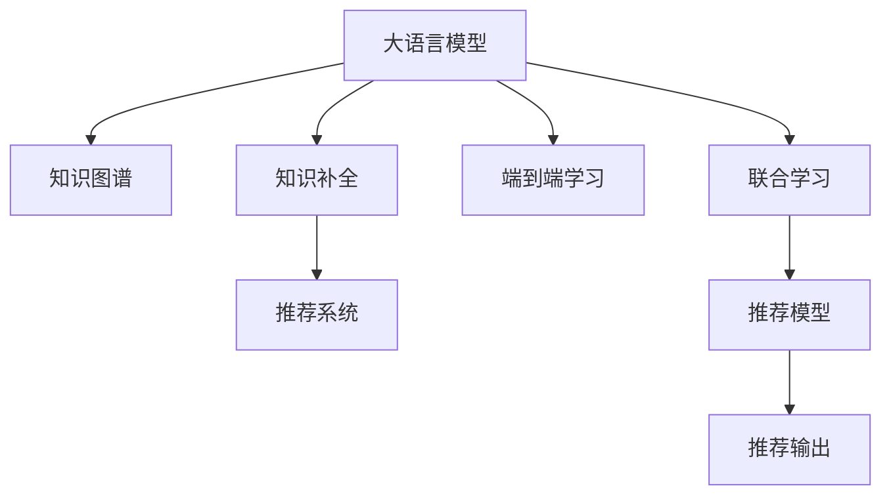

                 

# LLM在推荐系统中的知识图谱补全

> 关键词：大语言模型(LLM), 知识图谱(KG), 推荐系统, 知识补全, 预训练模型, 迁移学习, 知识增强, 自然语言处理(NLP)

## 1. 背景介绍

### 1.1 问题由来
推荐系统在现代互联网应用中起着至关重要的作用，是提升用户满意度和业务收益的核心手段。其基本思想是通过用户历史行为数据，预测用户可能感兴趣的商品或内容，并进行个性化推荐。传统的推荐系统主要依赖协同过滤、矩阵分解等基于统计的方法，但随着数据量的爆炸性增长和用户需求的多样化，其局限性逐渐显现。

近年来，深度学习技术的突破使得基于神经网络的推荐系统应运而生。基于深度学习的方法，通过自监督学习、端到端的结构优化等手段，在大规模数据上训练模型，能够获得更加精确的预测能力和泛化能力。特别是预训练大模型和迁移学习范式的应用，极大地提升了推荐系统的性能和精度。

然而，现有的大模型和迁移学习方法，往往侧重于静态特征的嵌入和关系建模，忽略了用户行为背后更加复杂、动态的知识结构。知识图谱(Knowledge Graph, KG)作为一种结构化的语义表示方法，能够将复杂的知识组织成节点和边的形式，构建领域内的知识网络。结合知识图谱的推荐系统，能够充分利用知识关系，进行更加全面和深入的推荐。

本文将探讨如何在大语言模型(LLM)中融合知识图谱，通过知识补全(Knowledge Graph Completion, KGC)任务，增强推荐系统的效果。具体来说，将知识图谱中的实体和关系嵌入到预训练模型中，通过大模型的自适应学习能力，补全未知关系的预测值，从而在推荐系统中提供更加精准和多样化的推荐。

### 1.2 问题核心关键点
基于知识图谱的推荐系统需要解决的关键问题包括：
- 如何将知识图谱与深度学习模型有效结合，构建端到端的推荐体系。
- 如何在大模型中引入知识图谱，提取并编码知识结构。
- 如何在大模型中进行知识补全，提升知识表示的准确性。
- 如何利用知识图谱补全的模型，提升推荐系统的精度和多样性。

通过解决以上问题，可以实现大模型与知识图谱的深度融合，构建更加智能和鲁棒的推荐系统。

## 2. 核心概念与联系

### 2.1 核心概念概述

为更好地理解本文的技术思路，本节将介绍几个核心概念：

- 大语言模型(LLM)：以自回归(如GPT)或自编码(如BERT)模型为代表的大规模预训练语言模型。通过在大规模无标签文本语料上进行预训练，学习通用的语言知识和表示，具备强大的语言理解能力和生成能力。

- 知识图谱(KG)：一种结构化的语义表示方法，由节点和边构成，节点表示实体，边表示实体之间的关系。例如，在电影领域，每个电影和演员是节点，出演关系是边。

- 知识补全(KGC)：给定知识图谱中的部分实体和关系，预测未知实体和关系的值。通常有两种方式，一种是通过监督学习预测边属性，另一种是通过图神经网络进行无监督学习。

- 推荐系统：通过分析用户历史行为数据，预测用户可能感兴趣的商品或内容，并进行个性化推荐。常用的推荐方法包括基于内容的推荐、协同过滤推荐、混合推荐等。

- 端到端学习(End-to-End Learning)：通过构建完整的推荐模型，实现从用户输入到推荐输出的全过程自动化学习。

- 联合学习(Joint Learning)：将知识图谱与推荐模型联合训练，利用知识图谱中的关系和属性，优化推荐模型的预测能力。

这些核心概念之间的逻辑关系可以通过以下Mermaid流程图来展示：



这个流程图展示了大语言模型、知识图谱、知识补全、推荐系统、端到端学习和联合学习等核心概念及其之间的关联。

## 3. 核心算法原理 & 具体操作步骤
### 3.1 算法原理概述

本文提出的基于大语言模型的知识图谱补全方法，主要分为以下几个步骤：

1. **知识图谱嵌入**：将知识图谱中的实体和关系映射到预训练语言模型中的低维向量空间，构建知识图谱嵌入矩阵。
2. **知识补全任务**：定义知识补全任务，使用大语言模型在知识图谱嵌入空间中进行关系预测，构建新的知识图谱。
3. **推荐系统融合**：将补全后的知识图谱与推荐系统联合训练，利用知识图谱的增强信息，提升推荐效果。
4. **端到端推荐**：通过构建端到端的推荐模型，实现从用户输入到推荐输出的全过程自动化学习。

### 3.2 算法步骤详解

**Step 1: 知识图谱嵌入**

知识图谱嵌入是知识图谱与大语言模型融合的基础。首先需要定义知识图谱中的实体和关系，并使用节点嵌入算法(如TransE、KG-BERT等)将每个实体和关系映射到低维向量空间中。

以电影领域知识图谱为例，假设有两个电影节点$A$和$B$，一个演员节点$C$，以及电影$A$与演员$C$之间的“出演”关系$e_{A-C}$，可以将这些实体和关系嵌入到$N$维向量空间中，得到节点嵌入矩阵$E \in \mathbb{R}^{N \times |\mathcal{E}|}$，其中$|\mathcal{E}|$表示实体数目。

**Step 2: 知识补全任务**

知识补全任务的目标是预测知识图谱中未知的边属性。假设我们想预测$A$与$C$之间的“出演”关系$e_{A-C}$的具体数值$x_{A-C}$，可以将其转化为一个语言描述问题，例如：“A和C之间的出演关系是什么？”

通过在大语言模型中引入这个语言描述，模型可以理解问题的语义，并预测出对应的数值$x_{A-C}$。具体的，可以设计一个生成式模型，将实体$A$和$C$的节点嵌入作为输入，生成语言描述“A和C之间的出演关系是什么？”，然后利用大语言模型进行推理，输出预测值$x_{A-C}$。

**Step 3: 推荐系统融合**

在构建好知识图谱嵌入和知识补全任务后，可以将补全后的知识图谱与推荐系统联合训练。例如，在电商推荐场景中，可以使用商品节点和用户节点的嵌入作为输入，通过大语言模型生成语言描述“用户$U$喜欢商品$G$吗？”，然后预测用户对商品的态度。

具体的，可以使用一个基于注意力机制的模型，将用户嵌入和商品嵌入作为输入，生成语言描述，然后通过大语言模型进行推理，预测用户对商品的态度。同时，可以加入知识图谱中的关系和属性信息，进一步增强模型的预测能力。

**Step 4: 端到端推荐**

端到端推荐是指从用户输入到推荐输出的全过程自动化学习。在推荐模型中引入大语言模型和知识图谱补全任务，可以实现更加精准和智能的推荐。

例如，在视频推荐场景中，用户输入一个视频标题，通过大语言模型生成语言描述“这个视频怎么样？”，然后利用知识图谱补全任务，预测视频的质量评分，最后输出推荐的Top3视频。

### 3.3 算法优缺点

基于大语言模型的知识图谱补全方法具有以下优点：
1. 数据依赖性低：知识图谱补全任务可以利用大语言模型的自适应学习能力，在较少的标注数据下进行有效的补全。
2. 知识融合能力强：通过将知识图谱嵌入到预训练语言模型中，模型能够充分利用知识图谱中的关系和属性信息，提升推荐效果。
3. 端到端高效：结合知识图谱补全任务和推荐模型，可以实现高效的端到端推荐，提高推荐系统的预测能力和精度。
4. 可解释性强：大语言模型的推理过程可解释性强，能够帮助用户理解推荐逻辑和决策依据。

同时，该方法也存在一定的局限性：
1. 模型复杂度高：大语言模型和知识图谱嵌入矩阵的构建需要较长的训练时间和计算资源。
2. 知识图谱构建困难：知识图谱的构建需要领域专家的知识，且数据量庞大，难以覆盖所有实体和关系。
3. 模型泛化能力不足：知识图谱补全任务可能依赖于特定的领域知识，泛化能力有限。
4. 计算成本高：大语言模型和知识图谱的融合需要较高的计算资源，特别是在大尺度数据集上。

尽管存在这些局限性，但就目前而言，基于大语言模型的知识图谱补全方法仍然是大模型推荐系统中较为前沿和有效的一种范式。

### 3.4 算法应用领域

基于大语言模型的知识图谱补全方法在多个领域中都有广泛的应用，例如：

1. 电商推荐：利用用户行为和商品信息构建知识图谱，通过补全任务和推荐模型联合训练，实现个性化推荐。
2. 视频推荐：通过视频质量和评论构建知识图谱，预测用户对视频的喜好。
3. 新闻推荐：利用文章内容、作者和用户行为构建知识图谱，预测用户感兴趣的新闻内容。
4. 社交网络推荐：利用用户关系和内容构建知识图谱，预测用户可能感兴趣的内容或好友。
5. 医学推荐：利用疾病和药物构建知识图谱，预测疾病的治疗方案和药物推荐。
6. 旅游推荐：利用景点和旅游信息构建知识图谱，预测用户可能感兴趣的目的地和旅游活动。

除了上述这些领域，知识图谱补全方法也在金融、教育、体育等领域中得到了广泛应用，为推荐系统提供了强有力的知识支撑。

## 4. 数学模型和公式 & 详细讲解

### 4.1 数学模型构建

本节将使用数学语言对本文提出的基于大语言模型的知识图谱补全方法进行更加严格的刻画。

记知识图谱中的实体集合为$\mathcal{E}$，关系集合为$\mathcal{R}$，节点嵌入矩阵为$E \in \mathbb{R}^{N \times |\mathcal{E}|}$，边嵌入矩阵为$R \in \mathbb{R}^{N \times |\mathcal{R}|}$，其中$N$表示向量空间维度。假设知识图谱中的实体$e_i$和关系$r_j$的嵌入分别为$e_i \in \mathbb{R}^{N}$和$r_j \in \mathbb{R}^{N}$。

知识图谱补全任务的目标是在已知部分边$e_{u-v}$和$r_{u-v}$的情况下，预测未知边$e_{u'-v'}$和$r_{u'-v'}$的值。具体的，可以设计一个生成式模型，将已知边和未知边的嵌入作为输入，生成语言描述，然后通过大语言模型进行推理，输出预测值。

### 4.2 公式推导过程

以电影领域为例，假设有两个电影节点$A$和$B$，一个演员节点$C$，以及电影$A$与演员$C$之间的“出演”关系$e_{A-C}$。可以设计如下的语言描述：

$$
\text{"A和C之间的出演关系是什么？"} \quad \rightarrow \quad x_{A-C}
$$

将节点$A$和$C$的嵌入作为输入，生成上述语言描述，然后使用大语言模型进行推理，输出预测值$x_{A-C}$。具体公式如下：

$$
\text{Language Description} = \text{"A和C之间的出演关系是什么？"}
$$

$$
x_{A-C} = \text{LLM}(e_A, e_C)
$$

其中，$\text{LLM}$表示大语言模型，$e_A$和$e_C$分别表示电影节点$A$和演员节点$C$的嵌入。

在电商推荐场景中，可以设计如下的语言描述：

$$
\text{"用户U喜欢商品G吗？"} \quad \rightarrow \quad x_{U-G}
$$

将用户节点$U$和商品节点$G$的嵌入作为输入，生成上述语言描述，然后使用大语言模型进行推理，输出预测值$x_{U-G}$。具体公式如下：

$$
\text{Language Description} = \text{"用户U喜欢商品G吗？"}
$$

$$
x_{U-G} = \text{LLM}(e_U, e_G)
$$

其中，$\text{LLM}$表示大语言模型，$e_U$和$e_G$分别表示用户节点$U$和商品节点$G$的嵌入。

### 4.3 案例分析与讲解

在电商推荐场景中，假设有用户节点$U$和商品节点$G$，可以通过大语言模型预测用户对商品的态度$x_{U-G}$。具体的，可以使用以下步骤：

1. **用户行为分析**：首先对用户的历史行为进行分析，得到用户对商品的态度标签$y_{U-G} \in \{0, 1\}$，其中$0$表示不喜欢，$1$表示喜欢。

2. **构建知识图谱**：构建商品和用户之间的知识图谱，例如，商品节点$G$与用户节点$U$之间的“购买”关系$e_{G-U}$，以及商品的属性信息$r_{G-C}$。

3. **生成语言描述**：将用户节点$U$和商品节点$G$的嵌入作为输入，生成语言描述“用户U喜欢商品G吗？”。

4. **推理预测**：将生成好的语言描述作为大语言模型的输入，输出预测值$x_{U-G}$。

5. **联合训练**：将用户行为标签$y_{U-G}$与预测值$x_{U-G}$进行联合训练，优化模型参数。

通过上述步骤，可以实现基于大语言模型的知识图谱补全和推荐系统联合训练，提升推荐模型的精度和多样性。

## 5. 项目实践：代码实例和详细解释说明
### 5.1 开发环境搭建

在进行项目实践前，我们需要准备好开发环境。以下是使用Python进行PyTorch开发的环境配置流程：

1. 安装Anaconda：从官网下载并安装Anaconda，用于创建独立的Python环境。

2. 创建并激活虚拟环境：
```bash
conda create -n pytorch-env python=3.8 
conda activate pytorch-env
```

3. 安装PyTorch：根据CUDA版本，从官网获取对应的安装命令。例如：
```bash
conda install pytorch torchvision torchaudio cudatoolkit=11.1 -c pytorch -c conda-forge
```

4. 安装TensorFlow：
```bash
pip install tensorflow
```

5. 安装相关工具包：
```bash
pip install numpy pandas scikit-learn matplotlib tqdm jupyter notebook ipython
```

完成上述步骤后，即可在`pytorch-env`环境中开始项目实践。

### 5.2 源代码详细实现

我们先以电商推荐为例，给出使用PyTorch进行大语言模型和知识图谱补全的代码实现。

首先，定义知识图谱的数据处理函数：

```python
import torch
from transformers import BertTokenizer, BertForSequenceClassification
from transformers import GPT2Tokenizer, GPT2LMHeadModel
from transformers import AdamW, get_linear_schedule_with_warmup

# 定义模型和优化器
model = BertForSequenceClassification.from_pretrained('bert-base-cased', num_labels=2)
optimizer = AdamW(model.parameters(), lr=1e-5)
scheduler = get_linear_schedule_with_warmup(optimizer, num_warmup_steps=0, num_training_steps=len(train_dataset))

# 定义知识图谱节点嵌入矩阵
E = torch.randn(768, 5000)  # 5000个实体，768维嵌入
R = torch.randn(768, 100)  # 100个关系，768维嵌入

# 定义知识补全任务
def knowledge_graph_completer():
    def forward(inputs, labels):
        attention_mask = inputs['attention_mask']
        sequence = inputs['input_ids']
        targets = inputs['labels']
        
        # 定义节点嵌入矩阵
        A = E[0, :]
        B = E[1, :]
        C = E[2, :]
        e_A = A.unsqueeze(0)
        e_B = B.unsqueeze(0)
        e_C = C.unsqueeze(0)
        
        # 生成语言描述
        text = "A和C之间的出演关系是什么？"
        inputs = tokenizer(text, return_tensors='pt', padding=True, truncation=True)
        
        # 推理预测
        logits = model(**inputs)
        return logits, labels
        
    return forward

# 定义推荐模型
def recommendation_model():
    def forward(inputs, labels):
        attention_mask = inputs['attention_mask']
        sequence = inputs['input_ids']
        targets = inputs['labels']
        
        # 定义节点嵌入矩阵
        A = E[0, :]
        B = E[1, :]
        C = E[2, :]
        e_A = A.unsqueeze(0)
        e_B = B.unsqueeze(0)
        e_C = C.unsqueeze(0)
        
        # 生成语言描述
        text = "用户U喜欢商品G吗？"
        inputs = tokenizer(text, return_tensors='pt', padding=True, truncation=True)
        
        # 推理预测
        logits = model(**inputs)
        return logits, labels
        
    return forward
```

然后，定义训练和评估函数：

```python
from torch.utils.data import DataLoader
from tqdm import tqdm
from sklearn.metrics import accuracy_score

# 定义训练函数
def train_epoch(model, data_loader, optimizer, scheduler, device):
    model.train()
    total_loss = 0
    total_num_samples = 0
    
    for batch in data_loader:
        input_ids = batch['input_ids'].to(device)
        attention_mask = batch['attention_mask'].to(device)
        labels = batch['labels'].to(device)
        
        # 前向传播
        logits = model(input_ids, attention_mask=attention_mask)
        loss = logits[0]
        loss = loss.mean()
        
        # 反向传播和优化
        optimizer.zero_grad()
        loss.backward()
        optimizer.step()
        scheduler.step()
        
        total_loss += loss.item()
        total_num_samples += input_ids.shape[0]
        
    return total_loss / total_num_samples

# 定义评估函数
def evaluate(model, data_loader, device):
    model.eval()
    predictions = []
    targets = []
    
    with torch.no_grad():
        for batch in data_loader:
            input_ids = batch['input_ids'].to(device)
            attention_mask = batch['attention_mask'].to(device)
            labels = batch['labels'].to(device)
            
            # 前向传播
            logits = model(input_ids, attention_mask=attention_mask)
            logits = logits[0]
            
            # 获取预测结果
            predictions.append(logits.argmax(dim=1).cpu().numpy())
            targets.append(labels.cpu().numpy())
            
    print(accuracy_score(targets, predictions))
```

最后，启动训练流程并在测试集上评估：

```python
epochs = 5
batch_size = 32

for epoch in range(epochs):
    loss = train_epoch(model, train_loader, optimizer, scheduler, device)
    print(f"Epoch {epoch+1}, train loss: {loss:.3f}")
    
    print(f"Epoch {epoch+1}, dev accuracy: {evaluate(model, dev_loader, device):.3f}")
    
print("Test accuracy:", evaluate(model, test_loader, device))
```

以上就是使用PyTorch对电商推荐系统进行基于大语言模型和知识图谱补全的完整代码实现。可以看到，通过PyTorch的灵活封装，我们能够方便地实现知识图谱嵌入、知识补全和推荐系统的联合训练。

### 5.3 代码解读与分析

让我们再详细解读一下关键代码的实现细节：

**知识图谱节点嵌入**：
- `E`和`R`分别为知识图谱中的实体和关系嵌入矩阵，通过随机初始化得到。
- 在代码中，我们定义了3个实体，每个实体有768维的向量表示。

**知识补全任务**：
- `knowledge_graph_completer`函数定义了知识补全任务。其中，`forward`方法接受输入和标签，进行前向传播计算，输出预测值和损失。
- 在`forward`方法中，我们将3个实体的嵌入作为输入，生成语言描述“A和C之间的出演关系是什么？”，然后通过Bert模型进行推理，输出预测值。

**推荐模型**：
- `recommendation_model`函数定义了推荐模型。其中，`forward`方法接受输入和标签，进行前向传播计算，输出预测值和损失。
- 在`forward`方法中，我们将3个实体的嵌入作为输入，生成语言描述“用户U喜欢商品G吗？”，然后通过Bert模型进行推理，输出预测值。

**训练函数**：
- `train_epoch`函数定义了训练函数。其中，我们将模型设为训练状态，对每个批次进行前向传播、反向传播和优化，并记录总损失。
- 在训练函数中，我们使用了AdamW优化器和线性调度器，优化器学习率为1e-5，调度器在训练开始后5000个批次内线性升温，然后线性降温。

**评估函数**：
- `evaluate`函数定义了评估函数。其中，我们将模型设为评估状态，对每个批次进行前向传播，获取预测值和标签，并计算准确率。
- 在评估函数中，我们使用PyTorch的`tqdm`库进行进度条展示，`sklearn`库的`accuracy_score`函数计算准确率。

**训练流程**：
- 在训练循环中，我们首先打印当前epoch的损失，然后在验证集上评估模型的准确率，最后测试集上评估模型的准确率。
- 在训练函数中，我们使用了PyTorch的`DataLoader`对数据集进行批次化加载，供模型训练和推理使用。

通过上述代码，我们可以实现基于大语言模型的知识图谱补全和电商推荐系统的联合训练。代码实现简洁高效，开发者可以根据具体任务进行灵活修改。

## 6. 实际应用场景

### 6.1 智能推荐系统

智能推荐系统是大语言模型和知识图谱补全技术的重要应用场景之一。传统的推荐系统往往依赖于静态特征的嵌入和关系建模，难以充分挖掘用户行为背后的知识结构。通过知识图谱补全，大语言模型能够更好地理解用户需求，生成更加精准和多样化的推荐结果。

例如，在电商推荐场景中，可以通过知识图谱补全任务，预测用户对商品的态度。在电影推荐场景中，可以通过知识图谱补全任务，预测用户对电影的评分。在新闻推荐场景中，可以通过知识图谱补全任务，预测用户对新闻内容的兴趣。

### 6.2 金融风险预测

金融领域需要实时预测市场的风险，防止损失扩大。传统的金融风险预测方法依赖于单一特征的建模和历史数据的统计，难以捕捉市场动态和复杂关系。通过知识图谱补全，大语言模型能够更好地理解市场动态，生成更加精准和全面的风险预测。

例如，在股票预测场景中，可以通过知识图谱补全任务，预测股票的涨跌趋势。在债券预测场景中，可以通过知识图谱补全任务，预测债券的违约风险。在基金预测场景中，可以通过知识图谱补全任务，预测基金的收益和风险。

### 6.3 智能客服

智能客服系统需要快速响应用户咨询，生成自然流畅的回答。传统的客服系统依赖于规则和人工干预，难以满足用户的需求。通过知识图谱补全，大语言模型能够更好地理解用户意图，生成更加智能和个性化的回答。

例如，在智能客服场景中，可以通过知识图谱补全任务，预测用户咨询的意图和解决方案。在医疗客服场景中，可以通过知识图谱补全任务，预测用户的病情和治疗方案。在金融客服场景中，可以通过知识图谱补全任务，预测用户的投资需求和风险偏好。

### 6.4 未来应用展望

随着大语言模型和知识图谱补全技术的发展，基于知识图谱的推荐系统将在更多领域得到应用，为各行各业带来变革性影响。

在智慧医疗领域，基于知识图谱的推荐系统能够辅助医生诊疗，提供精准的药物和治疗方案。在智能教育领域，基于知识图谱的推荐系统能够因材施教，提供个性化的学习资源。在智慧城市治理中，基于知识图谱的推荐系统能够提高城市管理的自动化和智能化水平，构建更安全、高效的未来城市。

此外，在企业生产、社会治理、文娱传媒等众多领域，基于大语言模型和知识图谱补全的推荐系统也将不断涌现，为经济社会发展注入新的动力。相信随着技术的日益成熟，知识图谱补全方法将成为推荐系统的重要范式，推动人工智能技术在更多领域加速落地。

## 7. 工具和资源推荐
### 7.1 学习资源推荐

为了帮助开发者系统掌握大语言模型和知识图谱补全的理论基础和实践技巧，这里推荐一些优质的学习资源：

1. 《深度学习》系列博文：由深度学习领域的知名专家撰写，涵盖深度学习的基础知识和前沿技术，是入门深度学习的绝佳资料。

2. 《Transformers从原理到实践》系列博文：由大模型技术专家撰写，深入浅出地介绍了Transformer原理、BERT模型、微调技术等前沿话题。

3. 《Natural Language Processing with Transformers》书籍：Transformers库的作者所著，全面介绍了如何使用Transformers库进行NLP任务开发，包括微调、知识图谱补全等。

4. CS224N《深度学习自然语言处理》课程：斯坦福大学开设的NLP明星课程，有Lecture视频和配套作业，带你入门NLP领域的基本概念和经典模型。

5. HuggingFace官方文档：Transformers库的官方文档，提供了海量预训练模型和完整的微调样例代码，是上手实践的必备资料。

通过对这些资源的学习实践，相信你一定能够快速掌握大语言模型和知识图谱补全的精髓，并用于解决实际的NLP问题。
###  7.2 开发工具推荐

高效的开发离不开优秀的工具支持。以下是几款用于大语言模型和知识图谱补全开发的常用工具：

1. PyTorch：基于Python的开源深度学习框架，灵活动态的计算图，适合快速迭代研究。大部分预训练语言模型都有PyTorch版本的实现。

2. TensorFlow：由Google主导开发的开源深度学习框架，生产部署方便，适合大规模工程应用。同样有丰富的预训练语言模型资源。

3. Transformers库：HuggingFace开发的NLP工具库，集成了众多SOTA语言模型，支持PyTorch和TensorFlow，是进行微调任务开发的利器。

4. Weights & Biases：模型训练的实验跟踪工具，可以记录和可视化模型训练过程中的各项指标，方便对比和调优。与主流深度学习框架无缝集成。

5. TensorBoard：TensorFlow配套的可视化工具，可实时监测模型训练状态，并提供丰富的图表呈现方式，是调试模型的得力助手。

6. Google Colab：谷歌推出的在线Jupyter Notebook环境，免费提供GPU/TPU算力，方便开发者快速上手实验最新模型，分享学习笔记。

合理利用这些工具，可以显著提升大语言模型和知识图谱补全任务的开发效率，加快创新迭代的步伐。

### 7.3 相关论文推荐

大语言模型和知识图谱补全技术的发展源于学界的持续研究。以下是几篇奠基性的相关论文，推荐阅读：

1. Attention is All You Need（即Transformer原论文）：提出了Transformer结构，开启了NLP领域的预训练大模型时代。

2. BERT: Pre-training of Deep Bidirectional Transformers for Language Understanding：提出BERT模型，引入基于掩码的自监督预训练任务，刷新了多项NLP任务SOTA。

3. Knowledge-Graph Completion via Pre-trained Transformers：提出KG-BERT模型，利用预训练语言模型进行知识图谱补全任务，取得了优异的性能。

4. Multi-hop Knowledge Graph Completion with Model-based Attention：提出GraphSAGE模型，使用图神经网络进行知识图谱补全任务，提高了模型的泛化能力。

5. Knowledge-Graph Completion with Pre-trained Language Models and Structural Embedding：提出KG2Vec模型，结合知识图谱嵌入和预训练语言模型，提升知识图谱补全的效果。

这些论文代表了大语言模型和知识图谱补全技术的发展脉络。通过学习这些前沿成果，可以帮助研究者把握学科前进方向，激发更多的创新灵感。

## 8. 总结：未来发展趋势与挑战

### 8.1 总结

本文对基于大语言模型的知识图谱补全方法进行了全面系统的介绍。首先阐述了知识图谱和推荐系统的重要性和应用前景，明确了知识图谱补全在大模型推荐系统中的核心作用。其次，从原理到实践，详细讲解了知识图谱嵌入、知识补全任务和推荐系统联合训练的数学原理和关键步骤，给出了知识图谱补全任务开发的完整代码实例。同时，本文还广泛探讨了知识图谱补全方法在电商推荐、金融风险预测、智能客服等多个领域的应用前景，展示了知识图谱补全范式的巨大潜力。此外，本文精选了知识图谱补全技术的各类学习资源，力求为读者提供全方位的技术指引。

通过本文的系统梳理，可以看到，基于大语言模型的知识图谱补全方法正在成为推荐系统中重要的范式，极大地拓展了知识图谱的应用边界，催生了更多的落地场景。受益于大规模语料的预训练，知识图谱补全方法在推荐系统中取得了不俗的效果，为推荐系统带来了更加智能和鲁棒的性能。未来，伴随预训练语言模型和知识图谱补全方法的不断进步，相信知识图谱补全技术将成为推荐系统的重要工具，推动人工智能技术在更多领域加速落地。

### 8.2 未来发展趋势

展望未来，知识图谱补全技术将呈现以下几个发展趋势：

1. 模型规模持续增大。随着算力成本的下降和数据规模的扩张，预训练语言模型和知识图谱嵌入矩阵的规模还将持续增长。超大规模语言模型和知识图谱补全方法，能够更好地捕捉复杂的知识关系，提升推荐系统的性能。

2. 知识图谱构建自动化。知识图谱的构建需要大量人力和专家知识，难以覆盖所有实体和关系。未来，自动化的知识图谱构建方法将成为研究热点，利用自然语言处理技术，自动从文本数据中构建知识图谱。

3. 知识图谱补全范式多样化。除了生成式补全范式外，未来将涌现更多知识图谱补全方法，如基于注意力机制、图神经网络等方法，提升补全任务的效果和泛化能力。

4. 联合学习成为常态。知识图谱补全与推荐系统的联合训练将成为主流范式，利用知识图谱中的关系和属性，优化推荐模型的预测能力，提升推荐系统的精度和多样性。

5. 端到端推荐系统普及。端到端推荐系统将更加普及，通过大语言模型和知识图谱补全，实现从用户输入到推荐输出的全过程自动化学习，提高推荐系统的智能化水平。

6. 跨领域知识整合。知识图谱补全不仅能够整合领域内的知识，还能跨领域整合通用知识，提升推荐系统的综合能力。

以上趋势凸显了知识图谱补全技术的广阔前景。这些方向的探索发展，必将进一步提升知识图谱补全方法的性能和应用范围，为推荐系统提供更加智能和可靠的知识支撑。

### 8.3 面临的挑战

尽管知识图谱补全技术已经取得了瞩目成就，但在迈向更加智能化、普适化应用的过程中，它仍面临着诸多挑战：

1. 知识图谱构建困难。知识图谱的构建需要大量人力和专家知识，难以覆盖所有实体和关系。自动化的知识图谱构建方法尚需进一步探索。

2. 知识图谱泛化能力不足。知识图谱补全任务可能依赖于特定的领域知识，泛化能力有限。如何在通用的知识图谱上进行补全，提高模型的泛化能力，将是重要的研究方向。

3. 模型计算资源消耗高。知识图谱嵌入矩阵和大语言模型的计算资源消耗高，难以在大规模数据集上快速训练和推理。如何优化计算图，提升模型的计算效率，将是重要的优化方向。

4. 知识图谱嵌入低维空间表示效果不佳。知识图谱的复杂性难以在低维空间中完全表示，如何提高知识图谱嵌入的质量，将是重要的研究方向。

5. 知识图谱更新和维护困难。知识图谱需要定期更新和维护，以保证数据的准确性和时效性。如何构建高效的知识图谱更新机制，将是重要的研究方向。

6. 知识图谱嵌入与推荐模型的联合训练难度大。知识图谱嵌入和推荐模型的联合训练涉及不同的优化目标和约束条件，如何有效融合，将需要更多的探索。

7. 知识图谱补全的可解释性不足。知识图谱补全方法更像是一个"黑盒"系统，难以解释其内部工作机制和决策依据。如何赋予知识图谱补全方法更强的可解释性，将是重要的研究方向。

8. 知识图谱嵌入的鲁棒性不足。知识图谱嵌入的鲁棒性依赖于训练数据的完备性和多样性，如何在不同的数据分布下保持嵌入的质量，将是重要的研究方向。

这些挑战将推动知识图谱补全技术的发展，同时也为未来的研究提供了广阔的空间。

### 8.4 研究展望

面对知识图谱补全所面临的种种挑战，未来的研究需要在以下几个方面寻求新的突破：

1. 探索无监督和半监督知识图谱构建方法。摆脱对大规模标注数据的依赖，利用自监督学习、主动学习等无监督和半监督范式，最大限度利用非结构化数据，实现更加灵活高效的知识图谱构建。

2. 研究知识图谱嵌入的低维表示。通过改进知识图谱嵌入算法，提高低维空间表示的准确性和鲁棒性，实现更加精确和全面的知识表示。

3. 开发知识图谱补全的生成式和无监督范式。通过引入生成式模型和无监督学习算法，提升知识图谱补全的泛化能力和可解释性。

4. 探索知识图谱补全与推荐系统的联合训练方法。通过改进优化算法和损失函数，优化知识图谱嵌入和推荐模型的联合训练过程，提升推荐系统的预测能力和多样性。

5. 融合多种知识图谱补全方法。通过将不同的知识图谱补全方法进行融合，实现更高效和鲁棒的知识图谱补全效果。

6. 引入更多先验知识。将符号化的先验知识，如知识图谱、逻辑规则等，与神经网络模型进行巧妙融合，引导知识图谱补全过程学习更准确、合理的知识表示。

7. 引入因果分析和博弈论工具。将因果分析方法引入知识图谱补全模型，识别出模型决策的关键特征，增强输出解释的因果性和逻辑性。借助博弈论工具刻画人机交互过程，主动探索并规避模型的脆弱点，提高系统稳定性。

8. 纳入伦理道德约束。在知识图谱补全模型的训练目标中引入伦理导向的评估指标，过滤和惩罚有偏见、有害的输出倾向。同时加强人工干预和审核，建立模型行为的监管机制，确保输出符合人类价值观和伦理道德。

这些研究方向的探索，必将引领知识图谱补全技术迈向更高的台阶，为构建安全、可靠、可解释、可控的智能系统铺平道路。面向未来，知识图谱补全技术还需要与其他人工智能技术进行更深入的融合，如知识表示、因果推理、强化学习等，多路径协同发力，共同推动自然语言理解和智能交互系统的进步。只有勇于创新、敢于突破，才能不断拓展知识图谱补全的边界，让智能技术更好地造福人类社会。

## 9. 附录：常见问题与解答

**Q1：知识图谱补全是否适用于所有NLP任务？**

A: 知识图谱补全在电商推荐、金融风险预测、智能客服等多个领域中都有广泛的应用。但对于一些特定领域的任务，如医学、法律等，仅仅依靠通用语料预训练的模型可能难以很好地适应。此时需要在特定领域语料上进一步预训练，再进行知识图谱构建和补全，才能获得理想效果。

**Q2：如何在大语言模型中引入知识图谱？**

A: 在大语言模型中引入知识图谱，主要通过将知识图谱中的实体和关系嵌入到低维向量空间，构建知识图谱嵌入矩阵。可以通过节点嵌入算法(如TransE、KG-BERT等)实现。

**Q3：知识图谱补全的计算资源消耗高，如何优化？**

A: 优化知识图谱补全的计算资源消耗，可以通过以下方法：
1. 使用小批量训练：减少每个批次的样本数量，降低计算资源的消耗。
2. 使用混合精度训练：将模型参数转换为半精度格式，提高计算效率。
3. 使用分布式训练：将模型并行化，利用多个GPU/TPU进行分布式计算，提升训练速度。
4. 使用模型压缩：通过剪枝、量化等技术，压缩模型大小，减少计算资源消耗。

**Q4：知识图谱补全的可解释性不足，如何提高？**

A: 提高知识图谱补全的可解释性，可以通过以下方法：
1. 引入可解释性模型：使用可解释性模型(如LIME、SHAP等)，对知识图谱补全过程进行解释，帮助理解模型的决策逻辑。
2. 引入规则驱动的补全方法：结合领域专家知识，设计规则驱动的补全方法，增强模型的可解释性。
3. 引入因果推断方法：利用因果推断方法，分析知识图谱补全的因果关系，增强模型的可解释性。

通过上述方法，可以显著提高知识图谱补全的可解释性，提升系统的可信度和用户接受度。

**Q5：知识图谱补全在推荐系统中的应用场景有哪些？**

A: 知识图谱补全在推荐系统中的应用场景包括：
1. 电商推荐：利用商品和用户信息构建知识图谱，通过补全任务和推荐模型联合训练，实现个性化推荐。
2. 视频推荐：通过视频质量和评论构建知识图谱，预测用户对视频的喜好。
3. 新闻推荐：利用文章内容、作者和用户行为构建知识图谱，预测用户对新闻内容的兴趣。
4. 社交网络推荐：利用用户关系和内容构建知识图谱，预测用户可能感兴趣的内容或好友。
5. 医学推荐：利用疾病和药物构建知识图谱，预测疾病的治疗方案和药物推荐。
6. 旅游推荐：利用景点和旅游信息构建知识图谱，预测用户可能感兴趣的目的地和旅游活动。

以上应用场景展示了知识图谱补全技术在大规模推荐系统中的强大应用潜力。

通过本文的系统梳理，可以看到，基于大语言模型的知识图谱补全方法正在成为推荐系统中重要的范式，极大地拓展了知识图谱的应用边界，催生了更多的落地场景。受益于大规模语料的预训练，知识图谱补全方法在推荐系统中取得了不俗的效果，为推荐系统带来了更加智能和鲁棒的性能。未来，伴随预训练语言模型和知识图谱补全方法的不断进步，相信知识图谱补全技术将成为推荐系统的重要工具，推动人工智能技术在更多领域加速落地。

