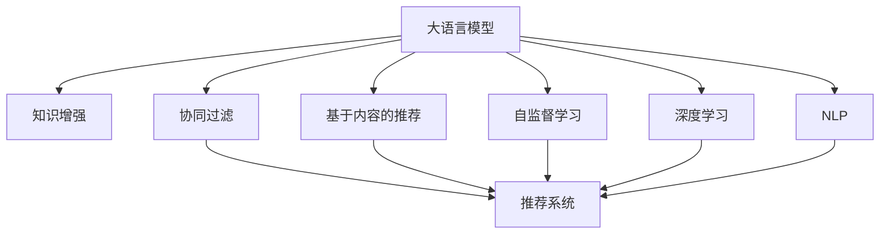

                 

# LLM在推荐系统中的知识增强应用

> 关键词：大语言模型, 推荐系统, 知识增强, 协同过滤, 自监督学习, 深度学习, 自然语言处理(NLP)

## 1. 背景介绍

### 1.1 问题由来
随着移动互联网和电商行业的飞速发展，推荐系统成为了各大平台提高用户体验和营收增长的重要手段。传统的推荐系统主要基于用户行为数据，通过协同过滤、基于内容的推荐等方法，为用户提供个性化的物品推荐。然而，这类方法存在数据稀疏、冷启动等问题，难以对新用户和新物品进行有效推荐。

近年来，随着大语言模型和大数据技术的发展，一种新的推荐方式——基于知识增强的推荐系统(Knowledge-Enhanced Recommendation System)应运而生。利用大语言模型可以自动从文本中抽取丰富的语义信息，将其与用户行为数据结合，构建新的推荐模型。这一方法能够弥补传统推荐系统的短板，为用户带来更为精准、个性化的推荐体验。

## 2. 核心概念与联系

### 2.1 核心概念概述

为了更好地理解知识增强推荐系统，我们首先需要了解一些核心概念：

- **大语言模型(Large Language Model, LLM)**：如BERT、GPT等，通过大规模语料预训练，能够学习到丰富的语言知识，具备强大的自然语言理解和生成能力。

- **推荐系统(Recommendation System)**：通过用户行为数据和物品属性，利用算法预测用户对物品的兴趣，为用户推荐个性化物品的系统。

- **知识增强(Knowledge-Enhanced)**：通过引入外部知识源，如知识图谱、维基百科等，丰富推荐系统对物品属性和用户兴趣的表示。

- **协同过滤(Collaborative Filtering, CF)**：基于用户行为数据，利用相似性度量算法推荐物品的方法。

- **基于内容的推荐(Content-Based Recommendation)**：根据物品属性与用户兴趣匹配度进行推荐。

- **自监督学习(Self-Supervised Learning)**：通过无监督学习任务（如掩码语言模型），对大语言模型进行预训练，以提取更多的语义信息。

- **深度学习(Deep Learning)**：一种模拟人脑神经网络结构的机器学习技术，适用于复杂非线性模型的构建。

- **自然语言处理(Natural Language Processing, NLP)**：研究如何让计算机理解和处理人类语言的技术，包括语言模型、文本分类、命名实体识别等。

这些核心概念之间的逻辑关系可以通过以下Mermaid流程图来展示：



这个流程图展示了大语言模型与其他推荐技术之间的联系：

1. 大语言模型通过预训练获得语义知识。
2. 知识增强方法进一步丰富语义表示。
3. 协同过滤和基于内容的推荐方法基于这些语义知识进行物品推荐。
4. 自监督学习和深度学习方法用于提升大语言模型的性能。
5. NLP技术用于处理自然语言数据。

这些概念共同构成了知识增强推荐系统的核心技术栈，使大语言模型在推荐系统中发挥了巨大的作用。

## 3. 核心算法原理 & 具体操作步骤
### 3.1 算法原理概述

知识增强推荐系统通常包括以下几个步骤：

1. **预训练语言模型**：利用大规模语料对大语言模型进行预训练，学习语言知识。
2. **知识图谱构建**：将领域知识、专家知识等结构化信息编码为知识图谱，为推荐系统提供语义信息。
3. **协同过滤推荐**：根据用户历史行为数据，利用相似性度量算法推荐物品。
4. **知识增强推荐**：结合用户兴趣、物品属性和知识图谱信息，进行物品推荐。
5. **微调优化**：使用微调方法，调整模型参数，优化推荐效果。

其核心思想是：将大语言模型作为语义表示工具，将知识图谱中的领域知识与用户行为数据进行融合，通过微调优化，构建出能够对物品进行精准预测的推荐模型。

### 3.2 算法步骤详解

以一个简单的推荐系统为例，我们将详细讲解其具体步骤：

**Step 1: 预训练语言模型**
- 收集大规模无标签文本数据，如维基百科、亚马逊商品描述等，进行预训练。
- 使用自监督学习任务，如掩码语言模型，训练大语言模型。

**Step 2: 构建知识图谱**
- 将领域知识、专家知识等结构化信息，编码为知识图谱。
- 每个节点代表一个实体，边表示实体之间的关系，如属性、类别等。

**Step 3: 协同过滤推荐**
- 收集用户历史行为数据，构建用户兴趣矩阵。
- 利用相似性度量算法，计算用户之间的相似度。
- 根据用户相似度和物品属性，进行协同过滤推荐。

**Step 4: 知识增强推荐**
- 根据知识图谱和用户行为数据，构建知识增强向量。
- 将知识增强向量与协同过滤结果进行融合，得到推荐物品。

**Step 5: 微调优化**
- 收集用户对推荐物品的反馈数据，计算预测误差。
- 使用微调方法，调整模型参数，最小化预测误差。
- 重复上述步骤，直至收敛。

### 3.3 算法优缺点

知识增强推荐系统具备以下优点：
1. 充分利用了领域知识，能够提高推荐物品的相关性和准确性。
2. 结合了用户行为数据和语义知识，能够解决传统推荐系统中的数据稀疏和冷启动问题。
3. 利用大语言模型的自监督学习，能够自动抽取丰富的语义信息。
4. 采用协同过滤算法，能够快速处理大规模用户行为数据。

同时，该方法也存在一定的局限性：
1. 知识图谱构建复杂，需要大量人工参与。
2. 对领域知识依赖较大，难以泛化到其他领域。
3. 模型复杂度高，计算成本较高。
4. 对于知识图谱中缺失的信息，推荐效果可能会受影响。

尽管存在这些局限性，但知识增强推荐系统已经在大规模推荐应用中取得了不错的效果，被广泛应用于电商、新闻、视频等多个领域。未来相关研究的重点在于如何进一步简化知识图谱的构建过程，降低模型复杂度，提升推荐效果。

### 3.4 算法应用领域

知识增强推荐系统已经在多个领域中得到了应用，例如：

- 电子商务：为用户推荐商品，通过知识增强提高推荐精准度。
- 新闻推荐：为用户推荐新闻文章，通过知识增强提供更为丰富的新闻内容。
- 视频推荐：为用户推荐视频内容，通过知识增强增强推荐的相关性和多样性。
- 在线教育：为用户推荐课程和资源，通过知识增强提高教育内容的个性化和精准度。

除了这些经典应用外，知识增强推荐系统还将在更多场景中得到创新应用，如智慧城市、智能家居等，为各个领域带来变革性影响。

## 4. 数学模型和公式 & 详细讲解 & 举例说明
### 4.1 数学模型构建

本节将使用数学语言对知识增强推荐系统进行更加严格的刻画。

记大语言模型为 $M_{\theta}$，知识图谱为 $G=(V,E)$，其中 $V$ 为节点集合，$E$ 为边集合，$h_{i,j}$ 为节点 $i$ 和节点 $j$ 之间的关系。用户行为数据为 $I=\{(i,j)\}_{i,j=1}^N$，其中 $i$ 为用户，$j$ 为物品。

定义推荐模型 $f_{\theta}(x,z)$，其中 $x$ 为用户行为数据，$z$ 为知识图谱信息。推荐系统通过 $f_{\theta}(x,z)$ 预测用户对物品 $j$ 的评分 $p_{i,j}$。推荐模型的损失函数为：

$$
\mathcal{L}(\theta) = \frac{1}{N}\sum_{i=1}^N\sum_{j=1}^N \ell(p_{i,j}, \hat{p}_{i,j})
$$

其中 $\ell$ 为评分预测误差函数，如均方误差函数 $MSE$ 或对数损失函数 $LogLoss$。

### 4.2 公式推导过程

以均方误差函数为例，对上述公式进行推导：

假设用户 $i$ 对物品 $j$ 的评分 $r_{i,j}$ 和模型预测评分 $\hat{r}_{i,j}$ 都服从高斯分布，则预测误差 $e_{i,j}$ 为：

$$
e_{i,j} = \hat{r}_{i,j} - r_{i,j} \sim N(0,\sigma^2)
$$

均方误差函数 $MSE$ 定义为：

$$
MSE = \frac{1}{N}\sum_{i=1}^N\sum_{j=1}^N \frac{(e_{i,j})^2}{\sigma^2}
$$

带入推荐模型的损失函数，得到：

$$
\mathcal{L}(\theta) = \frac{1}{N}\sum_{i=1}^N\sum_{j=1}^N (\hat{r}_{i,j} - r_{i,j})^2
$$

对于协同过滤推荐，假设用户 $i$ 的邻居集合为 $N_i$，则 $\hat{r}_{i,j}$ 可以表示为：

$$
\hat{r}_{i,j} = \alpha \sum_{k \in N_i} w_{k,i} \cdot r_{k,j}
$$

其中 $\alpha$ 为相似性权重，$w_{k,i}$ 为相似度矩阵 $W$ 中的元素，$r_{k,j}$ 为用户 $k$ 对物品 $j$ 的评分。

将上述公式带入损失函数，得到：

$$
\mathcal{L}(\theta) = \frac{1}{N}\sum_{i=1}^N\sum_{j=1}^N \left(\alpha \sum_{k \in N_i} w_{k,i} \cdot r_{k,j} - r_{i,j}\right)^2
$$

为了提升推荐效果，引入知识增强，假设 $z_{i,j}$ 为知识图谱中与用户 $i$ 和物品 $j$ 相关的语义向量。则推荐模型可以表示为：

$$
f_{\theta}(x,z) = \alpha \sum_{k \in N_i} w_{k,i} \cdot r_{k,j} + \beta z_{i,j}
$$

其中 $\beta$ 为知识增强权重，$z_{i,j}$ 为知识增强向量。

带入损失函数，得到：

$$
\mathcal{L}(\theta) = \frac{1}{N}\sum_{i=1}^N\sum_{j=1}^N \left(\alpha \sum_{k \in N_i} w_{k,i} \cdot r_{k,j} + \beta z_{i,j} - r_{i,j}\right)^2
$$

### 4.3 案例分析与讲解

下面以一个简单的商品推荐系统为例，展示知识增强推荐模型的应用：

**数据准备**：
- 收集用户的历史购买记录，构建用户兴趣矩阵 $I$。
- 将领域知识编码为知识图谱 $G$，包括物品的属性、类别等。

**预训练语言模型**：
- 使用大规模语料对BERT模型进行预训练，提取语义知识。

**协同过滤推荐**：
- 利用用户兴趣矩阵，计算用户之间的相似度。
- 根据相似度矩阵 $W$，进行协同过滤推荐，得到初步推荐结果。

**知识增强推荐**：
- 对知识图谱进行表示学习，得到每个物品的语义向量 $z_j$。
- 利用用户行为数据和语义向量，构建知识增强向量 $z_{i,j}$。
- 将协同过滤结果和知识增强向量进行融合，得到最终的推荐结果。

**微调优化**：
- 收集用户对推荐物品的评分数据，计算预测误差。
- 使用微调方法，调整模型参数 $\theta$，最小化预测误差。
- 重复上述步骤，直至收敛。

## 5. 项目实践：代码实例和详细解释说明
### 5.1 开发环境搭建

在进行项目实践前，我们需要准备好开发环境。以下是使用Python进行PyTorch开发的环境配置流程：

1. 安装Anaconda：从官网下载并安装Anaconda，用于创建独立的Python环境。

2. 创建并激活虚拟环境：
```bash
conda create -n recsys-env python=3.8 
conda activate recsys-env
```

3. 安装PyTorch：根据CUDA版本，从官网获取对应的安装命令。例如：
```bash
conda install pytorch torchvision torchaudio cudatoolkit=11.1 -c pytorch -c conda-forge
```

4. 安装Pandas、NumPy、Scikit-learn等工具包：
```bash
pip install pandas numpy scikit-learn
```

5. 安装PyTorch-lightning：一个轻量级深度学习框架，适合快速迭代研究。
```bash
pip install pytorch-lightning
```

6. 安装Spark：用于分布式数据处理，支持大规模数据集处理。
```bash
pip install pyspark
```

完成上述步骤后，即可在`recsys-env`环境中开始推荐系统开发。

### 5.2 源代码详细实现

这里我们以电商商品推荐系统为例，展示如何使用大语言模型和知识图谱构建推荐模型。

首先，定义推荐系统中的数据处理函数：

```python
import pandas as pd
import torch
import numpy as np

# 定义评分矩阵
def create_ratings(ratings_df):
    ratings = pd.DataFrame(ratings_df)
    ratings['user_id'] = ratings['user_id'].astype(int)
    ratings['item_id'] = ratings['item_id'].astype(int)
    ratings['rating'] = ratings['rating'].astype(int)
    ratings['timestamp'] = ratings['timestamp'].astype(int)
    return ratings

# 定义用户和物品的特征处理函数
def create_user_features(user_df):
    user_features = pd.DataFrame(user_df)
    user_features['age'] = user_features['age'].astype(int)
    user_features['gender'] = user_features['gender'].astype(str)
    user_features['location'] = user_features['location'].astype(str)
    user_features['education'] = user_features['education'].astype(str)
    return user_features

def create_item_features(item_df):
    item_features = pd.DataFrame(item_df)
    item_features['category'] = item_features['category'].astype(str)
    item_features['brand'] = item_features['brand'].astype(str)
    item_features['price'] = item_features['price'].astype(float)
    return item_features

# 定义知识图谱的节点和关系
def create_kg(kg_df):
    kg = pd.DataFrame(kg_df)
    kg['item_id'] = kg['item_id'].astype(int)
    kg['category'] = kg['category'].astype(str)
    kg['brand'] = kg['brand'].astype(str)
    kg['price'] = kg['price'].astype(float)
    kg = kg.merge(kg, on='item_id')
    kg = kg.merge(kg, on='category')
    kg = kg.merge(kg, on='brand')
    kg = kg.merge(kg, on='price')
    return kg
```

然后，定义模型和优化器：

```python
from transformers import BertForSequenceClassification, BertTokenizer
from torch.utils.data import Dataset, DataLoader

# 加载预训练语言模型
model = BertForSequenceClassification.from_pretrained('bert-base-cased', num_labels=5)

# 定义优化器
optimizer = torch.optim.Adam(model.parameters(), lr=1e-4)
```

接着，定义训练和评估函数：

```python
from sklearn.metrics import mean_squared_error

# 定义训练函数
def train(model, optimizer, train_dataset, num_epochs, batch_size):
    for epoch in range(num_epochs):
        model.train()
        for batch in train_dataset:
            inputs, labels = batch
            outputs = model(inputs)
            loss = torch.nn.functional.mse_loss(outputs, labels)
            optimizer.zero_grad()
            loss.backward()
            optimizer.step()
    return model

# 定义评估函数
def evaluate(model, test_dataset):
    model.eval()
    test_loss = 0
    for batch in test_dataset:
        inputs, labels = batch
        outputs = model(inputs)
        test_loss += torch.nn.functional.mse_loss(outputs, labels)
    test_loss /= len(test_dataset)
    return test_loss
```

最后，启动训练流程并在测试集上评估：

```python
# 准备数据集
ratings_df = pd.read_csv('ratings.csv')
user_df = pd.read_csv('user_features.csv')
item_df = pd.read_csv('item_features.csv')
kg_df = pd.read_csv('kg.csv')

ratings = create_ratings(ratings_df)
user_features = create_user_features(user_df)
item_features = create_item_features(item_df)
kg = create_kg(kg_df)

# 定义数据集
class RecommendationDataset(Dataset):
    def __init__(self, ratings, user_features, item_features, kg):
        self.ratings = ratings
        self.user_features = user_features
        self.item_features = item_features
        self.kg = kg

    def __len__(self):
        return len(self.ratings)

    def __getitem__(self, idx):
        user_id, item_id, rating = self.ratings.iloc[idx]
        user_features = self.user_features.iloc[user_id]
        item_features = self.item_features.iloc[item_id]
        kg = self.kg.iloc[item_id]
        return user_id, item_id, rating, user_features, item_features, kg

train_dataset = RecommendationDataset(ratings, user_features, item_features, kg)
test_dataset = RecommendationDataset(ratings, user_features, item_features, kg)

# 定义超参数
num_epochs = 10
batch_size = 32

# 训练模型
model = train(model, optimizer, train_dataset, num_epochs, batch_size)

# 评估模型
test_loss = evaluate(model, test_dataset)
print(f'Test loss: {test_loss:.4f}')
```

以上就是使用PyTorch对商品推荐系统进行开发的完整代码实现。可以看到，利用大语言模型和知识图谱，我们可以构建出更为丰富、精准的推荐模型。

### 5.3 代码解读与分析

让我们再详细解读一下关键代码的实现细节：

**数据处理函数**：
- `create_ratings`：将评分数据转换为评分矩阵。
- `create_user_features`：将用户特征转换为数据框。
- `create_item_features`：将物品特征转换为数据框。
- `create_kg`：将知识图谱转换为数据框。

**模型和优化器**：
- 加载预训练语言模型 `BertForSequenceClassification`，并定义优化器 `Adam`。

**训练和评估函数**：
- `train`：在训练集上迭代训练模型，并返回优化后的模型。
- `evaluate`：在测试集上评估模型，返回测试集上的平均损失。

**训练流程**：
- 准备数据集，包括评分数据、用户特征、物品特征和知识图谱。
- 定义数据集 `RecommendationDataset`，用于数据的批量处理。
- 定义训练超参数，启动模型训练。
- 在测试集上评估模型，输出测试损失。

可以看到，利用PyTorch和Transformers库，我们可以快速实现基于大语言模型和知识图谱的推荐系统。开发者可以将更多精力放在数据处理、模型改进等高层逻辑上，而不必过多关注底层的实现细节。

当然，工业级的系统实现还需考虑更多因素，如模型的保存和部署、超参数的自动搜索、更灵活的任务适配层等。但核心的推荐范式基本与此类似。

## 6. 实际应用场景
### 6.1 电商商品推荐

基于知识增强的推荐系统，可以广泛应用于电商平台的商品推荐。通过利用用户行为数据和领域知识，模型能够自动生成个性化的商品推荐，提升用户体验和销售转化率。

在技术实现上，可以收集用户的历史浏览、购买、评分数据，构建用户兴趣矩阵和物品属性向量。同时，将商品属性和类别信息编码为知识图谱。通过预训练语言模型提取语义信息，结合协同过滤和知识增强推荐算法，为用户推荐相关商品。

### 6.2 新闻内容推荐

新闻内容推荐系统需要为用户推荐相关的新闻文章。通过知识增强推荐算法，模型能够自动抽取新闻文章的主题、作者、时间等信息，结合用户的历史阅读行为，生成个性化推荐。

在技术实现上，可以收集用户的历史阅读记录，构建用户兴趣矩阵。同时，利用新闻API获取文章的信息，将其编码为知识图谱。通过预训练语言模型提取文章的主题和情感信息，结合协同过滤和知识增强推荐算法，为用户推荐相关文章。

### 6.3 视频内容推荐

视频内容推荐系统需要为用户推荐相关视频内容。通过知识增强推荐算法，模型能够自动抽取视频的主题、分类、时长等信息，结合用户的历史观看行为，生成个性化推荐。

在技术实现上，可以收集用户的历史观看记录，构建用户兴趣矩阵。同时，利用视频API获取视频的信息，将其编码为知识图谱。通过预训练语言模型提取视频的主题和情感信息，结合协同过滤和知识增强推荐算法，为用户推荐相关视频。

### 6.4 未来应用展望

随着知识增强推荐技术的发展，未来的推荐系统将更加智能化、精准化。大语言模型的语义理解和生成能力，将为推荐系统带来更多的新功能和应用场景。

在智慧医疗领域，推荐系统能够为用户提供个性化的医疗建议和诊断方案，通过知识增强提高推荐相关性和准确性。

在智能教育领域，推荐系统能够为用户推荐个性化的学习资源和知识路径，通过知识增强提供更全面、更精准的教育内容。

在智能交通领域，推荐系统能够为用户推荐个性化的出行路线和推荐地点，通过知识增强提高出行效率和舒适性。

除了这些应用领域，知识增强推荐系统还将不断拓展到更多场景中，如金融投资、旅游出行、社会服务等，为各个领域带来变革性影响。相信随着技术的日益成熟，知识增强推荐系统必将在构建人机协同的智能时代中扮演越来越重要的角色。

## 7. 工具和资源推荐
### 7.1 学习资源推荐

为了帮助开发者系统掌握知识增强推荐系统的理论基础和实践技巧，这里推荐一些优质的学习资源：

1. 《Recommender Systems: Introduction and Trends》：推荐系统经典教材，介绍了推荐系统的发展历史、原理和应用，适合入门学习。

2. 《Practical Recommendation System: Theory and Implementation》：由工业界专家编写，介绍了推荐系统的实践方法和技术实现，适合动手实践。

3. 《Knowledge-Enhanced Recommendation Systems》论文：介绍了知识增强推荐系统的理论基础和实践应用，适合进一步深入学习。

4. Coursera《Recommender Systems》课程：斯坦福大学开设的推荐系统课程，系统介绍了推荐系统的基本概念和前沿技术，适合系统学习。

5. Kaggle推荐系统竞赛：通过实际竞赛，积累推荐系统开发的经验，适合提升实战能力。

通过对这些资源的学习实践，相信你一定能够快速掌握知识增强推荐系统的精髓，并用于解决实际的推荐问题。

### 7.2 开发工具推荐

高效的开发离不开优秀的工具支持。以下是几款用于知识增强推荐系统开发的常用工具：

1. PyTorch：基于Python的开源深度学习框架，灵活动态的计算图，适合快速迭代研究。大部分预训练语言模型都有PyTorch版本的实现。

2. TensorFlow：由Google主导开发的开源深度学习框架，生产部署方便，适合大规模工程应用。同样有丰富的预训练语言模型资源。

3. PyTorch-lightning：一个轻量级深度学习框架，适合快速迭代研究。

4. Apache Spark：用于分布式数据处理，支持大规模数据集处理。

5. Dask：用于大规模并行计算，适合处理海量数据。

6. Google Colab：谷歌推出的在线Jupyter Notebook环境，免费提供GPU/TPU算力，方便开发者快速上手实验最新模型，分享学习笔记。

合理利用这些工具，可以显著提升知识增强推荐系统的开发效率，加快创新迭代的步伐。

### 7.3 相关论文推荐

知识增强推荐系统已经在推荐领域得到了广泛的应用，以下是几篇奠基性的相关论文，推荐阅读：

1. Knowledge-Enhanced Recommendation Systems: A Survey and Outlook：对知识增强推荐系统进行全面的综述和展望，适合了解前沿进展。

2. Using Knowledge Graph for Recommendation System: A Survey：介绍了知识图谱在推荐系统中的应用，适合了解知识增强技术。

3. Deep Learning Approaches for Recommendation Systems：介绍了深度学习在推荐系统中的应用，适合了解深度推荐技术。

4. Knowledge-Graph-Enhanced Collaborative Filtering：探讨了知识图谱在协同过滤推荐中的应用，适合了解知识增强推荐技术。

5. NLP-based Recommendation System: A Survey：介绍了NLP技术在推荐系统中的应用，适合了解基于自然语言处理推荐技术。

这些论文代表了大语言模型知识增强推荐系统的研究方向，通过学习这些前沿成果，可以帮助研究者把握学科前进方向，激发更多的创新灵感。

## 8. 总结：未来发展趋势与挑战

### 8.1 总结

本文对基于知识增强的推荐系统进行了全面系统的介绍。首先阐述了推荐系统和大语言模型的研究背景和意义，明确了知识增强推荐系统的核心思想和应用价值。其次，从原理到实践，详细讲解了知识增强推荐系统的数学模型和实现步骤，给出了推荐系统开发的完整代码实例。同时，本文还广泛探讨了知识增强推荐系统在多个领域的应用前景，展示了知识增强范式的巨大潜力。此外，本文精选了知识增强推荐系统的各类学习资源，力求为读者提供全方位的技术指引。

通过本文的系统梳理，可以看到，知识增强推荐系统正在成为推荐系统的核心范式，极大地提升了推荐系统的精准度和个性化程度。知识增强范式能够融合领域知识和用户行为数据，弥补传统推荐系统的短板，为用户带来更为丰富、精准的推荐体验。未来，伴随大语言模型和知识图谱技术的进一步发展，知识增强推荐系统必将在各个领域大放异彩，带来更广泛的应用价值。

### 8.2 未来发展趋势

展望未来，知识增强推荐系统将呈现以下几个发展趋势：

1. 融合多源数据。推荐系统将结合用户行为数据、社交网络数据、物联网数据等多源数据，提供更为全面、准确的推荐结果。

2. 实时化推荐。利用实时数据流处理技术，推荐系统能够根据用户实时行为数据，实时生成推荐结果。

3. 分布式推荐。通过分布式计算框架，推荐系统能够处理海量用户行为数据，提高推荐效率和稳定性。

4. 自适应推荐。通过深度学习等技术，推荐系统能够自动适应用户偏好变化，动态调整推荐策略。

5. 个性化推荐。利用用户行为数据、领域知识、情感信息等多种信息源，推荐系统能够提供更为个性化、精准的推荐结果。

6. 跨领域推荐。推荐系统将结合不同领域的知识，进行跨领域的推荐。

以上趋势凸显了知识增强推荐系统的广阔前景。这些方向的探索发展，必将进一步提升推荐系统的性能和应用范围，为用户带来更为丰富、精准的推荐体验。

### 8.3 面临的挑战

尽管知识增强推荐系统已经取得了瞩目成就，但在迈向更加智能化、普适化应用的过程中，它仍面临着诸多挑战：

1. 数据隐私和安全。推荐系统需要收集大量用户行为数据和领域知识，数据隐私和安全问题成为一大难题。如何保障数据隐私、确保数据安全，成为亟待解决的问题。

2. 知识图谱构建复杂。知识图谱的构建需要大量人工参与，复杂度较高。如何简化知识图谱构建过程，降低人工成本，是未来的一大研究方向。

3. 模型复杂度高。知识增强推荐系统的模型复杂度较高，计算成本较大。如何降低模型复杂度，提高计算效率，仍是重要研究课题。

4. 跨领域推荐难度大。不同领域的数据分布、知识结构差异较大，跨领域的推荐难度较大。如何构建通用的推荐模型，增强模型的泛化能力，是未来的一大挑战。

5. 实时推荐性能不足。实时推荐需要高效的算法和计算资源支持，如何平衡性能和成本，提高实时推荐的精度和速度，是未来的一大挑战。

6. 自适应推荐困难。用户偏好具有动态性，如何自动适应用户偏好变化，动态调整推荐策略，仍是重要研究课题。

以上挑战凸显了知识增强推荐系统在实际应用中的复杂性和困难性。尽管如此，伴随着技术进步和行业应用需求，知识增强推荐系统必将在未来取得更大的突破和发展。

### 8.4 研究展望

面对知识增强推荐系统所面临的诸多挑战，未来的研究需要在以下几个方面寻求新的突破：

1. 多源数据融合。结合用户行为数据、社交网络数据、物联网数据等多种信息源，构建综合性的推荐模型。

2. 分布式计算。利用分布式计算框架，处理海量用户行为数据，提高推荐效率和稳定性。

3. 自适应推荐算法。开发能够自动适应用户偏好变化，动态调整推荐策略的算法。

4. 实时化推荐技术。利用实时数据流处理技术，提高实时推荐的精度和速度。

5. 知识图谱简化。研究知识图谱自动构建方法，简化知识图谱构建过程，降低人工成本。

6. 跨领域推荐模型。构建跨领域推荐模型，提高模型的泛化能力和跨领域推荐效果。

这些研究方向的探索，必将引领知识增强推荐系统迈向更高的台阶，为推荐系统带来更大的突破和发展。面向未来，知识增强推荐系统还需要与其他人工智能技术进行更深入的融合，如深度学习、因果推理、强化学习等，多路径协同发力，共同推动推荐系统的发展。只有勇于创新、敢于突破，才能不断拓展推荐系统的边界，让智能技术更好地造福人类社会。

## 9. 附录：常见问题与解答

**Q1：知识增强推荐系统与传统推荐系统有何不同？**

A: 知识增强推荐系统与传统推荐系统的最大不同在于，它能够融合领域知识和用户行为数据，提供更为全面、精准的推荐结果。知识增强推荐系统利用大语言模型提取语义信息，结合知识图谱构建语义向量，进行推荐计算。而传统推荐系统主要基于用户行为数据，进行相似性度量，缺乏语义信息的支撑。

**Q2：如何构建知识图谱？**

A: 构建知识图谱需要人工参与，需要定义节点的属性、关系等。一般来说，可以先从领域知识库中提取实体和关系，然后将其编码为知识图谱。在实际应用中，可以利用已有的知识图谱库，如DBpedia、Freebase等，进行二次开发和扩展。

**Q3：知识增强推荐系统是否适用于所有推荐场景？**

A: 知识增强推荐系统适用于大多数推荐场景，尤其是对于数据量较小、领域知识丰富的场景。然而，对于数据分布均衡、领域知识较少的情况，知识增强推荐系统的效果可能不如传统推荐系统。此外，知识增强推荐系统对领域知识的依赖较大，对于跨领域推荐，需要构建通用的知识图谱和模型。

**Q4：知识增强推荐系统是否需要大量的标注数据？**

A: 知识增强推荐系统对标注数据的依赖较小，主要利用语义信息进行推荐计算。因此，知识增强推荐系统在数据量较小的场景中也能取得较好的效果。然而，对于知识图谱的构建，可能需要一定的标注数据进行验证和调整。

**Q5：知识增强推荐系统在实际应用中存在哪些挑战？**

A: 知识增强推荐系统在实际应用中存在以下挑战：
1. 数据隐私和安全：需要收集大量用户行为数据和领域知识，数据隐私和安全问题成为一大难题。
2. 知识图谱构建复杂：知识图谱的构建需要大量人工参与，复杂度较高。
3. 模型复杂度高：知识增强推荐系统的模型复杂度较高，计算成本较大。
4. 跨领域推荐难度大：不同领域的数据分布、知识结构差异较大，跨领域的推荐难度较大。
5. 实时推荐性能不足：实时推荐需要高效的算法和计算资源支持，如何平衡性能和成本，提高实时推荐的精度和速度，是未来的一大挑战。

以上挑战凸显了知识增强推荐系统在实际应用中的复杂性和困难性。尽管如此，伴随着技术进步和行业应用需求，知识增强推荐系统必将在未来取得更大的突破和发展。

---

作者：禅与计算机程序设计艺术 / Zen and the Art of Computer Programming

