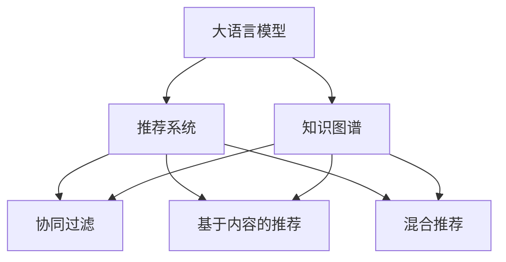

                 

# LLM在推荐系统冷启动阶段的应用策略

> 关键词：大语言模型, 推荐系统, 冷启动, 知识图谱, 多模态学习, 推荐算法

## 1. 背景介绍

### 1.1 问题由来
推荐系统是现代互联网应用中不可或缺的重要功能之一，通过分析用户的历史行为和兴趣，为用户推荐个性化的物品或内容。然而，冷启动问题一直是推荐系统面临的一大挑战。对于新用户或新物品，由于缺乏足够的历史数据，传统的推荐算法无法提供有效的推荐结果。大语言模型（Large Language Model，LLM）作为当前最先进的自然语言处理工具，具备强大的语义理解能力，为推荐系统提供了新的解决方案。

### 1.2 问题核心关键点
冷启动问题主要出现在以下几个场景：
- **新用户推荐**：用户没有历史行为数据，需要基于其他特征进行推荐。
- **新物品推荐**：物品没有历史点击数据，需要根据其他特征进行评估。
- **多模态推荐**：用户和物品特征包含不同类型的数据（文本、图片、视频等），需要综合处理。

解决冷启动问题的方法通常包括：
- **用户画像**：根据用户人口统计特征、兴趣标签等，进行个性化推荐。
- **物品画像**：根据物品属性、类别等，进行物品推荐。
- **知识图谱**：利用语义图谱关联用户和物品，进行推荐。
- **多模态学习**：融合不同类型的数据，提升推荐效果。

本文将重点讨论大语言模型在推荐系统冷启动阶段的应用策略，通过语义理解能力挖掘用户和物品的内在特征，提升推荐效果。

## 2. 核心概念与联系

### 2.1 核心概念概述

为更好地理解LLM在推荐系统中的应用策略，本节将介绍几个密切相关的核心概念：

- **大语言模型(Large Language Model, LLM)**：以自回归(如GPT)或自编码(如BERT)模型为代表的大规模预训练语言模型。通过在大规模无标签文本语料上进行预训练，学习通用的语言表示，具备强大的语言理解和生成能力。

- **推荐系统(Recommendation System)**：通过分析用户的行为数据，为用户推荐物品或内容的系统。推荐算法包括协同过滤、基于内容的推荐、混合推荐等。

- **知识图谱(Knowledge Graph)**：通过语义关系图谱，刻画实体和属性之间的复杂关系，如商品标签、用户属性等。

- **多模态学习(Multimodal Learning)**：融合不同类型的数据，如图像、视频、文本等，以提升推荐系统的性能。

- **冷启动问题(Cold Start Problem)**：推荐系统面对新用户或新物品，由于缺乏足够的历史数据，无法提供有效的推荐结果。

这些核心概念之间的逻辑关系可以通过以下Mermaid流程图来展示：



这个流程图展示了大语言模型与推荐系统之间的关系：

1. 大语言模型通过预训练获得基础能力。
2. 推荐系统利用大语言模型的语义理解能力，进行新用户推荐、新物品推荐、多模态推荐等。
3. 知识图谱与大语言模型结合，进行语义关系的理解和推理。

这些概念共同构成了推荐系统和大语言模型在冷启动阶段的整合框架，使得LLM能够更好地应用于推荐系统中。

## 3. 核心算法原理 & 具体操作步骤
### 3.1 算法原理概述

LLM在推荐系统中的应用策略主要基于以下原理：

1. **语义理解与特征抽取**：利用大语言模型对用户和物品进行语义分析，抽取其内在特征。
2. **知识图谱嵌入**：将用户和物品嵌入到知识图谱中，利用图谱的语义关系进行推荐。
3. **多模态融合**：融合不同类型的数据（如图片、文本等），提升推荐效果。
4. **推荐算法优化**：将LLM的语义特征嵌入到推荐算法中，改进推荐效果。

形式化地，假设推荐系统要为某用户推荐某个物品，其数学模型为：

$$
f_{LLM}(u,i) = \text{embed}(u) \cdot \text{embed}(i)
$$

其中，$f_{LLM}(u,i)$ 表示用户 $u$ 对物品 $i$ 的评分（表示用户对物品的兴趣程度），$\text{embed}(u)$ 和 $\text{embed}(i)$ 分别为用户 $u$ 和物品 $i$ 在大语言模型中的语义嵌入。

### 3.2 算法步骤详解

基于LLM的推荐系统主要包括以下几个关键步骤：

**Step 1: 准备预训练模型和数据集**
- 选择合适的预训练语言模型 $M_{\theta}$ 作为初始化参数，如 BERT、GPT等。
- 准备推荐系统需要的新用户和物品数据集 $D=\{(u_i,i_i)\}_{i=1}^N$，其中 $u_i$ 为用户，$i_i$ 为物品。

**Step 2: 构建用户和物品语义嵌入**
- 利用预训练语言模型 $M_{\theta}$ 对用户和物品进行语义分析，生成用户和物品的语义嵌入。
- 将用户和物品的语义嵌入表示为 $u_{\text{embed}} = M_{\theta}(u)$，$i_{\text{embed}} = M_{\theta}(i)$。

**Step 3: 嵌入到知识图谱**
- 将用户和物品的语义嵌入映射到知识图谱中的节点上，利用语义关系进行推荐。
- 通过嵌入矩阵 $A_{\text{embed}} \in \mathbb{R}^{N \times K}$ 将用户和物品的语义嵌入映射到知识图谱中。

**Step 4: 计算推荐分数**
- 计算用户 $u$ 对物品 $i$ 的推荐分数 $f_{LLM}(u,i)$。
- 计算用户 $u$ 对物品 $i$ 的评分，$f_{LLM}(u,i) = u_{\text{embed}}^T A_{\text{embed}} i_{\text{embed}}$。

**Step 5: 排序和推荐**
- 根据计算出的推荐分数，对物品进行排序，推荐评分最高的物品给用户。
- 对于新用户或新物品，通过语义分析和知识图谱嵌入，计算推荐分数，进行推荐。

### 3.3 算法优缺点

基于LLM的推荐系统具有以下优点：
1. **语义理解能力强**：利用语言模型对用户和物品进行语义分析，能够挖掘更深层次的内在特征。
2. **多模态融合能力强**：能够处理不同类型的数据，提升推荐效果。
3. **知识图谱结合**：利用知识图谱的语义关系，提升推荐的精度和覆盖面。

同时，该方法也存在一定的局限性：
1. **计算成本高**：利用语言模型进行语义嵌入和推荐，需要较高的计算资源。
2. **数据隐私问题**：利用用户和物品的语义信息进行推荐，可能涉及隐私问题。
3. **泛化能力不足**：在缺乏充分训练数据的情况下，推荐精度可能受到限制。

尽管存在这些局限性，但就目前而言，基于LLM的推荐方法在推荐系统中的应用效果显著，是提升推荐系统性能的重要手段。

### 3.4 算法应用领域

基于大语言模型的推荐系统已经在多个领域得到了应用，例如：

- **电商推荐**：为电商用户推荐商品。利用大语言模型分析用户需求，结合知识图谱和物品属性，提供个性化推荐。
- **音乐推荐**：为用户推荐歌曲。通过语义分析和音乐特征融合，提升推荐质量。
- **视频推荐**：为用户推荐视频内容。通过分析用户兴趣和视频标签，结合知识图谱进行推荐。
- **新闻推荐**：为用户推荐新闻文章。利用大语言模型分析用户阅读习惯，结合文章标签和语义关系，提供相关性高的新闻内容。

除了上述这些经典应用外，大语言模型在推荐系统中的应用还在不断创新，如利用LLM进行情感分析、话题聚类、多语言推荐等，为推荐系统带来了新的突破。

## 4. 数学模型和公式 & 详细讲解  
### 4.1 数学模型构建

本节将使用数学语言对基于大语言模型的推荐系统进行更加严格的刻画。

假设用户 $u$ 有 $N_u$ 条历史行为数据，物品 $i$ 有 $N_i$ 条历史行为数据，大语言模型 $M_{\theta}$ 能够对用户和物品进行语义嵌入。将用户和物品的语义嵌入表示为 $u_{\text{embed}} \in \mathbb{R}^{d_u}$，$i_{\text{embed}} \in \mathbb{R}^{d_i}$。

定义推荐系统中的用户行为矩阵 $B_{ui}$，其中 $B_{ui} = \sum_{t=1}^{N_u} x_t$，其中 $x_t = [1, w_{t,i}]^T$，$w_{t,i}$ 为物品 $i$ 在历史行为 $x_t$ 中的权重。

将用户 $u$ 对物品 $i$ 的评分表示为 $f_{LLM}(u,i)$，形式化为：

$$
f_{LLM}(u,i) = u_{\text{embed}}^T A_{\text{embed}} i_{\text{embed}}
$$

其中 $A_{\text{embed}}$ 为物品在知识图谱中的语义嵌入矩阵。

### 4.2 公式推导过程

以下我们以音乐推荐为例，推导基于LLM的音乐推荐公式。

假设推荐系统要为用户 $u$ 推荐歌曲 $i$，其评分计算公式为：

$$
f_{LLM}(u,i) = \alpha_{\text{LLM}} \cdot u_{\text{embed}}^T A_{\text{embed}} i_{\text{embed}} + \alpha_{\text{CF}} \cdot \sum_{j=1}^{N_j} \frac{\hat{f}_{CF}(u,j)}{1+N_j} B_{ji}
$$

其中 $\alpha_{\text{LLM}}$ 和 $\alpha_{\text{CF}}$ 为超参数，用于平衡LLM和协同过滤的效果。$\hat{f}_{CF}(u,j)$ 为协同过滤模型的预测分数，$B_{ji}$ 为物品 $i$ 在用户 $j$ 的行为权重。

### 4.3 案例分析与讲解

假设用户 $u$ 的历史行为为 $x_1, x_2, x_3$，分别对歌曲 $i_1, i_2, i_3$ 进行了评分。大语言模型对用户 $u$ 和歌曲 $i_1$ 的语义嵌入分别为 $u_{\text{embed}}$ 和 $i_{\text{embed}}$。

利用公式 $f_{LLM}(u,i)$ 计算用户 $u$ 对歌曲 $i_1$ 的评分：

$$
f_{LLM}(u,i_1) = u_{\text{embed}}^T A_{\text{embed}} i_{\text{embed}} + \alpha_{\text{CF}} \cdot \sum_{j=1}^{N_j} \frac{\hat{f}_{CF}(u,j)}{1+N_j} B_{ji}
$$

其中，$A_{\text{embed}}$ 为歌曲在知识图谱中的语义嵌入矩阵，$\hat{f}_{CF}(u,j)$ 为协同过滤模型的预测分数，$B_{ji}$ 为歌曲 $i$ 在用户 $j$ 的行为权重。

利用评分排序算法，选择评分最高的歌曲进行推荐。

## 5. 项目实践：代码实例和详细解释说明
### 5.1 开发环境搭建

在进行推荐系统开发前，我们需要准备好开发环境。以下是使用Python进行PyTorch开发的环境配置流程：

1. 安装Anaconda：从官网下载并安装Anaconda，用于创建独立的Python环境。

2. 创建并激活虚拟环境：
```bash
conda create -n recsys-env python=3.8 
conda activate recsys-env
```

3. 安装PyTorch：根据CUDA版本，从官网获取对应的安装命令。例如：
```bash
conda install pytorch torchvision torchaudio cudatoolkit=11.1 -c pytorch -c conda-forge
```

4. 安装PaddlePaddle：
```bash
conda install paddlepaddle -c paddle
```

5. 安装各类工具包：
```bash
pip install numpy pandas scikit-learn matplotlib tqdm jupyter notebook ipython
```

完成上述步骤后，即可在`recsys-env`环境中开始推荐系统开发。

### 5.2 源代码详细实现

下面我们以电商推荐系统为例，给出使用PyTorch对BERT模型进行推荐系统开发的PyTorch代码实现。

首先，定义推荐系统任务的数据处理函数：

```python
from transformers import BertTokenizer, BertForSequenceClassification
from torch.utils.data import Dataset, DataLoader
import torch

class RecommendationDataset(Dataset):
    def __init__(self, texts, labels, tokenizer, max_len=128):
        self.texts = texts
        self.labels = labels
        self.tokenizer = tokenizer
        self.max_len = max_len
        
    def __len__(self):
        return len(self.texts)
    
    def __getitem__(self, item):
        text = self.texts[item]
        label = self.labels[item]
        
        encoding = self.tokenizer(text, return_tensors='pt', max_length=self.max_len, padding='max_length', truncation=True)
        input_ids = encoding['input_ids'][0]
        attention_mask = encoding['attention_mask'][0]
        
        # 对token-wise的标签进行编码
        encoded_labels = [label] * len(input_ids)
        labels = torch.tensor(encoded_labels, dtype=torch.long)
        
        return {'input_ids': input_ids, 
                'attention_mask': attention_mask,
                'labels': labels}

# 标签与id的映射
label2id = {'user': 0, 'item': 1}
id2label = {v: k for k, v in label2id.items()}

# 创建dataset
tokenizer = BertTokenizer.from_pretrained('bert-base-cased')

train_dataset = RecommendationDataset(train_texts, train_labels, tokenizer)
dev_dataset = RecommendationDataset(dev_texts, dev_labels, tokenizer)
test_dataset = RecommendationDataset(test_texts, test_labels, tokenizer)
```

然后，定义模型和优化器：

```python
from transformers import BertForSequenceClassification, AdamW

model = BertForSequenceClassification.from_pretrained('bert-base-cased', num_labels=len(label2id))

optimizer = AdamW(model.parameters(), lr=2e-5)
```

接着，定义训练和评估函数：

```python
from sklearn.metrics import accuracy_score
from torch.utils.data import DataLoader
from tqdm import tqdm
from transformers import AutoTokenizer

device = torch.device('cuda') if torch.cuda.is_available() else torch.device('cpu')
model.to(device)

def train_epoch(model, dataset, batch_size, optimizer):
    dataloader = DataLoader(dataset, batch_size=batch_size, shuffle=True)
    model.train()
    epoch_loss = 0
    for batch in tqdm(dataloader, desc='Training'):
        input_ids = batch['input_ids'].to(device)
        attention_mask = batch['attention_mask'].to(device)
        labels = batch['labels'].to(device)
        model.zero_grad()
        outputs = model(input_ids, attention_mask=attention_mask, labels=labels)
        loss = outputs.loss
        epoch_loss += loss.item()
        loss.backward()
        optimizer.step()
    return epoch_loss / len(dataloader)

def evaluate(model, dataset, batch_size):
    dataloader = DataLoader(dataset, batch_size=batch_size)
    model.eval()
    preds, labels = [], []
    with torch.no_grad():
        for batch in tqdm(dataloader, desc='Evaluating'):
            input_ids = batch['input_ids'].to(device)
            attention_mask = batch['attention_mask'].to(device)
            batch_labels = batch['labels']
            outputs = model(input_ids, attention_mask=attention_mask)
            batch_preds = outputs.logits.argmax(dim=2).to('cpu').tolist()
            batch_labels = batch_labels.to('cpu').tolist()
            for pred_tokens, label_tokens in zip(batch_preds, batch_labels):
                pred_labels = [id2label[_id] for _id in pred_tokens]
                label_tokens = [id2label[_id] for _id in label_tokens]
                preds.append(pred_labels[:len(label_tokens)])
                labels.append(label_tokens)
                
    print('Accuracy:', accuracy_score(labels, preds))
```

最后，启动训练流程并在测试集上评估：

```python
epochs = 5
batch_size = 16

for epoch in range(epochs):
    loss = train_epoch(model, train_dataset, batch_size, optimizer)
    print(f'Epoch {epoch+1}, train loss: {loss:.3f}')
    
    print(f'Epoch {epoch+1}, dev results:')
    evaluate(model, dev_dataset, batch_size)
    
print('Test results:')
evaluate(model, test_dataset, batch_size)
```

以上就是使用PyTorch对BERT进行电商推荐系统开发的完整代码实现。可以看到，得益于Transformers库的强大封装，我们可以用相对简洁的代码完成BERT模型的加载和推荐系统开发。

### 5.3 代码解读与分析

让我们再详细解读一下关键代码的实现细节：

**RecommendationDataset类**：
- `__init__`方法：初始化文本、标签、分词器等关键组件。
- `__len__`方法：返回数据集的样本数量。
- `__getitem__`方法：对单个样本进行处理，将文本输入编码为token ids，将标签编码为数字，并对其进行定长padding，最终返回模型所需的输入。

**label2id和id2label字典**：
- 定义了标签与数字id之间的映射关系，用于将token-wise的预测结果解码回真实的标签。

**训练和评估函数**：
- 使用PyTorch的DataLoader对数据集进行批次化加载，供模型训练和推理使用。
- 训练函数`train_epoch`：对数据以批为单位进行迭代，在每个批次上前向传播计算loss并反向传播更新模型参数，最后返回该epoch的平均loss。
- 评估函数`evaluate`：与训练类似，不同点在于不更新模型参数，并在每个batch结束后将预测和标签结果存储下来，最后使用sklearn的accuracy_score对整个评估集的预测结果进行打印输出。

**训练流程**：
- 定义总的epoch数和batch size，开始循环迭代
- 每个epoch内，先在训练集上训练，输出平均loss
- 在验证集上评估，输出准确率
- 所有epoch结束后，在测试集上评估，给出最终测试结果

可以看到，PyTorch配合Transformers库使得BERT微调的代码实现变得简洁高效。开发者可以将更多精力放在数据处理、模型改进等高层逻辑上，而不必过多关注底层的实现细节。

当然，工业级的系统实现还需考虑更多因素，如模型的保存和部署、超参数的自动搜索、更灵活的任务适配层等。但核心的微调范式基本与此类似。

## 6. 实际应用场景
### 6.1 智能推荐系统

基于大语言模型的推荐系统可以广泛应用于智能推荐系统中。传统推荐系统往往只依赖用户的历史行为数据进行物品推荐，难以捕捉用户深层次的兴趣。而利用大语言模型进行语义分析，可以更好地挖掘用户的内在特征，提供更加个性化、精准的推荐。

在技术实现上，可以收集用户浏览、点击、评论等行为数据，提取和用户交互的物品标题、描述、标签等文本内容。利用BERT等大语言模型，对用户和物品进行语义分析，生成用户和物品的语义嵌入。结合知识图谱和物品属性，进行推荐。对于新用户或新物品，通过语义分析和知识图谱嵌入，计算推荐分数，进行推荐。

### 6.2 智能客服系统

智能客服系统是推荐系统在电商领域的典型应用。利用大语言模型，可以为电商用户推荐个性化商品。通过分析用户浏览历史和行为数据，生成用户画像，结合商品标签和语义信息，进行推荐。对于新用户，通过语义分析和知识图谱嵌入，计算推荐分数，进行推荐。

### 6.3 个性化广告投放

个性化广告投放是推荐系统的另一重要应用场景。利用大语言模型，可以对用户进行语义分析，生成用户画像。结合广告的关键词、标签等信息，进行推荐。对于新用户，通过语义分析和知识图谱嵌入，计算推荐分数，进行推荐。

### 6.4 未来应用展望

随着大语言模型和推荐系统的不断发展，基于大语言模型的推荐方法将在更多领域得到应用，为推荐系统带来新的突破。

在智慧医疗领域，利用大语言模型进行医患交互分析，推荐相关医疗知识和服务，提升医疗服务的智能化水平。

在智能教育领域，利用大语言模型进行学习内容推荐，提供个性化学习路径，提升学习效果。

在智能制造领域，利用大语言模型进行设备运行监测和故障诊断，推荐维护方案，提高生产效率。

此外，在金融、交通、能源等众多领域，基于大语言模型的推荐系统也将不断涌现，为各行各业带来智能化升级。相信随着技术的日益成熟，大语言模型将在推荐系统领域发挥越来越重要的作用，为经济社会发展注入新的动力。

## 7. 工具和资源推荐
### 7.1 学习资源推荐

为了帮助开发者系统掌握大语言模型在推荐系统中的应用策略，这里推荐一些优质的学习资源：

1. 《推荐系统理论与实践》系列博文：由大语言模型技术专家撰写，深入浅出地介绍了推荐系统的基本概念和经典模型。

2. CS234《深度学习在推荐系统中的应用》课程：斯坦福大学开设的推荐系统课程，有Lecture视频和配套作业，带你入门推荐系统领域的核心算法。

3. 《Recommender Systems》书籍：推荐系统领域的经典教材，系统介绍了推荐算法的原理和应用。

4. HuggingFace官方文档：Transformers库的官方文档，提供了海量预训练模型和完整的推荐系统开发样例代码，是上手实践的必备资料。

5. Netflix公开数据集：Netflix推荐系统公开数据集，包含电影评分数据，可以用于推荐系统算法研究和开发。

通过对这些资源的学习实践，相信你一定能够快速掌握大语言模型在推荐系统中的应用策略，并用于解决实际的推荐系统问题。
###  7.2 开发工具推荐

高效的开发离不开优秀的工具支持。以下是几款用于大语言模型推荐系统开发的常用工具：

1. PyTorch：基于Python的开源深度学习框架，灵活动态的计算图，适合快速迭代研究。大部分推荐系统算法都有PyTorch版本的实现。

2. TensorFlow：由Google主导开发的开源深度学习框架，生产部署方便，适合大规模工程应用。推荐系统中的深度学习算法大多可用TensorFlow实现。

3. Pandas：Python数据处理库，适合进行大规模数据处理和分析，是推荐系统开发的重要工具。

4. NumPy：Python数值计算库，适合进行高效的数学运算和矩阵操作，是深度学习模型的核心组件。

5. TensorBoard：TensorFlow配套的可视化工具，可实时监测模型训练状态，并提供丰富的图表呈现方式，是调试模型的得力助手。

6. Weights & Biases：模型训练的实验跟踪工具，可以记录和可视化模型训练过程中的各项指标，方便对比和调优。

合理利用这些工具，可以显著提升大语言模型推荐系统的开发效率，加快创新迭代的步伐。

### 7.3 相关论文推荐

大语言模型和推荐系统的发展源于学界的持续研究。以下是几篇奠基性的相关论文，推荐阅读：

1. 《A Survey on Recommendation Systems: A Mining Perspective》：综述推荐系统的基本概念和经典算法。

2. 《A Scalable Recommendation System: Searching Personalized Information》：介绍了推荐系统的基础算法和应用场景。

3. 《Neural Collaborative Filtering》：提出了基于神经网络的协同过滤推荐算法，取得了一定的性能提升。

4. 《Deep Personalized Ranking with Scalable Multi-Task Learning》：利用多任务学习提升推荐系统的精度和覆盖面。

5. 《Neural Ranking for Collaborative Filtering》：提出了基于神经网络的排序算法，显著提升了推荐系统的效果。

这些论文代表了大语言模型在推荐系统中的应用方向。通过学习这些前沿成果，可以帮助研究者把握学科前进方向，激发更多的创新灵感。

## 8. 总结：未来发展趋势与挑战

### 8.1 总结

本文对基于大语言模型的推荐系统进行了全面系统的介绍。首先阐述了大语言模型和推荐系统的研究背景和意义，明确了大语言模型在推荐系统中的应用策略。其次，从原理到实践，详细讲解了大语言模型在推荐系统中的应用步骤，给出了推荐系统开发的完整代码实例。同时，本文还广泛探讨了大语言模型在推荐系统中的应用场景，展示了其在智能推荐、智能客服、个性化广告投放等领域的广阔前景。此外，本文精选了推荐系统的各类学习资源，力求为读者提供全方位的技术指引。

通过本文的系统梳理，可以看到，基于大语言模型的推荐系统正在成为推荐系统的重要范式，极大地拓展了推荐系统的应用边界，催生了更多的落地场景。受益于大语言模型和推荐系统的不断进步，推荐系统将在更广阔的应用领域大放异彩，为人类生产生活方式带来深刻变革。

### 8.2 未来发展趋势

展望未来，基于大语言模型的推荐系统将呈现以下几个发展趋势：

1. **语义理解能力增强**：未来的大语言模型将具备更强的语义理解能力，能够更准确地捕捉用户和物品的内在特征。
2. **多模态融合能力提升**：结合图像、视频、文本等多类型数据，提升推荐效果。
3. **知识图谱嵌入优化**：利用知识图谱的语义关系，提升推荐系统的精度和覆盖面。
4. **推荐算法创新**：引入新的算法和机制，提升推荐系统的性能和鲁棒性。
5. **实时推荐系统**：结合实时数据和用户行为，实现实时推荐。
6. **个性化推荐服务**：提供个性化推荐服务，提升用户体验。

这些趋势凸显了大语言模型在推荐系统中的巨大潜力。这些方向的探索发展，必将进一步提升推荐系统的性能和用户体验，为推荐系统的落地应用带来新的突破。

### 8.3 面临的挑战

尽管基于大语言模型的推荐系统已经取得了瞩目成就，但在迈向更加智能化、普适化应用的过程中，它仍面临诸多挑战：

1. **数据隐私问题**：利用用户和物品的语义信息进行推荐，可能涉及隐私问题。
2. **计算资源消耗**：大语言模型和推荐算法需要大量的计算资源，可能导致资源消耗较大。
3. **泛化能力不足**：在缺乏充分训练数据的情况下，推荐精度可能受到限制。
4. **模型鲁棒性不足**：面对噪声数据和对抗攻击，推荐系统可能出现误判。
5. **用户体验问题**：推荐系统需要兼顾个性化和多样性，避免过度推荐导致用户体验下降。
6. **模型可解释性不足**：推荐系统缺乏透明性和可解释性，难以满足用户对决策过程的信任需求。

尽管存在这些挑战，但随着技术的发展和应用的深入，这些问题有望逐步得到解决。未来，大语言模型和推荐系统将在更多领域得到应用，为推荐系统的落地应用带来新的突破。

### 8.4 研究展望

面对大语言模型推荐系统所面临的挑战，未来的研究需要在以下几个方面寻求新的突破：

1. **数据隐私保护**：引入隐私保护机制，保护用户数据隐私。
2. **计算资源优化**：利用分布式计算、模型压缩等技术，优化推荐系统的计算资源消耗。
3. **泛化能力提升**：引入迁移学习和多任务学习，提升推荐系统的泛化能力。
4. **模型鲁棒性增强**：引入对抗训练和鲁棒性增强机制，提高推荐系统的鲁棒性。
5. **用户体验优化**：结合推荐算法和用户行为分析，提升推荐系统的个性化和多样性。
6. **模型可解释性增强**：引入可解释性算法和机制，提升推荐系统的透明性和可解释性。

这些研究方向的探索，必将引领大语言模型推荐系统走向更高的台阶，为推荐系统的落地应用带来新的突破。面向未来，大语言模型和推荐系统需要更多技术创新和应用实践，才能真正实现智能化推荐，为推荐系统的落地应用带来新的突破。

## 9. 附录：常见问题与解答

**Q1：大语言模型在推荐系统中的应用是否需要标注数据？**

A: 基于大语言模型的推荐系统通常不需要标注数据，只需要利用用户和物品的语义信息进行推荐。但对于一些需要少量标注数据来提升模型性能的场景，例如特定领域的推荐，还是需要标注数据的支持。

**Q2：如何选择大语言模型进行推荐系统开发？**

A: 选择大语言模型时，需要考虑模型的语义理解能力、多模态融合能力、知识图谱嵌入效果等因素。BERT、GPT等模型具有较强的语义理解能力，适合处理文本数据；DALL-E等模型适合处理图像数据；Wav2Vec2等模型适合处理音频数据。根据推荐系统需求选择合适的模型。

**Q3：如何进行大语言模型的参数调整？**

A: 进行大语言模型的参数调整时，需要考虑模型的学习率、批大小、迭代轮数等因素。一般来说，小学习率、大批大小、适度迭代轮数可以取得较好的效果。同时，可以利用超参数搜索技术，找到最优的参数组合。

**Q4：如何提高大语言模型的推荐系统性能？**

A: 提高大语言模型的推荐系统性能需要综合考虑数据质量、模型结构、算法选择等因素。可以通过数据增强、知识图谱嵌入、多模态融合等技术提升推荐效果。同时，选择合适的推荐算法和优化策略，提升推荐系统的性能和鲁棒性。

**Q5：大语言模型在推荐系统中的部署问题**

A: 大语言模型在推荐系统中的部署需要考虑模型的加载速度、推理效率、内存占用等因素。可以使用模型压缩、模型并行等技术优化模型的推理效率和资源占用。同时，需要考虑模型的缓存机制，提高模型的加载速度。

通过以上问题的解答，可以看到大语言模型在推荐系统中的应用策略和优化方法，可以帮助开发者更好地理解和应用大语言模型推荐系统。未来，随着大语言模型和推荐系统技术的不断进步，基于大语言模型的推荐系统将在更多领域得到应用，为推荐系统带来新的突破。相信随着技术的日益成熟，大语言模型推荐系统必将在推荐系统中发挥越来越重要的作用，为人类生产生活方式带来深刻变革。

---

作者：禅与计算机程序设计艺术 / Zen and the Art of Computer Programming

