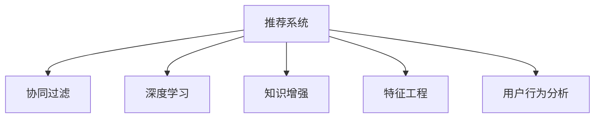

                 

# LLM在推荐系统的性能提升

> 关键词：大语言模型,推荐系统,协同过滤,深度学习,知识增强,特征工程,用户行为分析

## 1. 背景介绍

### 1.1 问题由来

随着互联网和数字技术的快速发展，推荐系统已成为用户获取信息和内容的重要工具。无论是电商平台、视频网站还是社交网络，推荐系统都在背后默默工作，帮助用户发现他们可能感兴趣的商品、视频、文章等。然而，尽管推荐系统在个性化推荐方面取得了显著的进展，但如何提升推荐的准确性和多样化，仍然是一个具有挑战性的问题。

大语言模型（Large Language Models, LLMs）如BERT、GPT等，近年来在自然语言处理（Natural Language Processing, NLP）领域取得了突破性进展，表现出强大的语言理解和生成能力。将大语言模型引入推荐系统，能够提升推荐的个性化水平，增强推荐的多样性和丰富度，并改善推荐系统的冷启动问题。

### 1.2 问题核心关键点

大语言模型在推荐系统中的应用，主要集中在以下几个方面：

- 利用预训练语言模型提升推荐系统对用户偏好的理解能力。
- 通过上下文建模，增强推荐系统的多模态融合能力。
- 使用知识图谱和上下文信息，丰富推荐系统的知识表示。
- 在推荐系统初期阶段，利用大语言模型的泛化能力，加速模型收敛。
- 在推荐系统中引入大语言模型的参数高效微调技术，提升模型效果。

大语言模型在推荐系统中的应用，不仅仅局限于传统的文本推荐，还可以通过多模态融合、知识增强等方式，拓展到视频、音频等多种推荐场景，为推荐系统带来新的突破。

### 1.3 问题研究意义

将大语言模型引入推荐系统，具有重要的研究意义和实际价值：

1. 提升推荐精度：通过大语言模型对用户偏好的深度理解，可以更准确地预测用户的行为和需求。
2. 增强推荐多样化：利用大语言模型的语义表示能力，生成更丰富的推荐内容，避免推荐内容的同质化。
3. 加速模型训练：大语言模型通常具有较大的预训练规模，其泛化能力有助于推荐模型在冷启动阶段更快地收敛。
4. 提供推荐解释：大语言模型能够生成自然语言文本，帮助解释推荐结果，提升用户体验。
5. 推动推荐系统创新：大语言模型的引入为推荐系统带来了新的思路和算法，促进了推荐技术的发展。

通过深入研究大语言模型在推荐系统中的应用，能够为推荐系统的进一步优化和创新提供理论基础和实践指导，推动推荐系统技术向更智能、更个性化、更多样化的方向发展。

## 2. 核心概念与联系

### 2.1 核心概念概述

为更好地理解大语言模型在推荐系统中的应用，本节将介绍几个密切相关的核心概念：

- 推荐系统（Recommendation System）：通过用户的历史行为、兴趣偏好等数据，预测并推荐用户可能感兴趣的商品、内容、服务等。推荐系统广泛应用于电商、社交网络、视频平台等多个领域。

- 协同过滤（Collaborative Filtering, CF）：一种常用的推荐算法，通过分析用户和物品之间的相似性，进行个性化推荐。协同过滤分为基于用户的协同过滤（User-Based CF）和基于物品的协同过滤（Item-Based CF）两种。

- 深度学习（Deep Learning）：一种基于神经网络的机器学习方法，通过多层非线性变换，从数据中学习到高级抽象特征。深度学习在推荐系统中的应用包括神经协同过滤、序列建模等。

- 知识增强（Knowledge-Augmented）：在推荐系统中引入知识图谱、领域知识等先验信息，提升推荐效果。

- 特征工程（Feature Engineering）：构建并优化推荐系统中的特征表示，以提升推荐模型的预测性能。

- 用户行为分析（User Behavior Analysis）：通过分析用户的浏览、购买、评分等行为数据，提取用户兴趣和需求，生成个性化推荐。

这些核心概念之间的逻辑关系可以通过以下Mermaid流程图来展示：



这个流程图展示了大语言模型在推荐系统中的应用，从协同过滤、深度学习、知识增强、特征工程和用户行为分析等多个角度，构建了推荐系统的全貌。通过理解这些核心概念，我们可以更好地把握大语言模型在推荐系统中的应用。

## 3. 核心算法原理 & 具体操作步骤
### 3.1 算法原理概述

基于大语言模型（LLM）的推荐系统，通常包括以下几个关键步骤：

1. **预训练语言模型**：在大规模无标签文本数据上进行预训练，学习通用的语言表示，为推荐模型提供丰富的语义信息。
2. **特征抽取**：通过预训练语言模型，将文本数据转化为高维特征向量，供推荐模型使用。
3. **协同过滤**：在预训练特征的基础上，进行基于用户或物品的协同过滤，生成个性化推荐。
4. **深度学习模型**：通过神经网络模型，进一步优化协同过滤的预测性能。
5. **知识增强**：引入知识图谱和领域知识，丰富推荐模型的语义表示。
6. **微调优化**：利用标注数据对推荐模型进行微调，提升推荐效果。

### 3.2 算法步骤详解

以下是对基于大语言模型在推荐系统中应用的详细步骤：

**Step 1: 准备数据集**
- 收集用户的历史行为数据，如浏览记录、购买记录、评分记录等。
- 从电商平台、视频平台、社交网络等渠道获取商品、视频、文章等物品的数据。
- 对数据进行预处理，包括数据清洗、去重、归一化等。

**Step 2: 数据编码与特征抽取**
- 将用户和物品的文本数据输入预训练语言模型，生成高维特征向量。
- 对于文本数据，可以使用BERT、GPT等预训练模型，通过上下文编码方式，生成用户和物品的语义表示。
- 对于非文本数据，如图片、视频等，可以使用多模态融合技术，将图像特征、时间序列特征等转化为文本形式，再输入预训练语言模型。

**Step 3: 协同过滤**
- 在预训练特征的基础上，使用基于用户的协同过滤或基于物品的协同过滤算法，计算用户和物品之间的相似性。
- 基于用户-物品相似性矩阵，生成个性化推荐。

**Step 4: 深度学习模型**
- 构建深度神经网络模型，如神经协同过滤（Neural Collaborative Filtering, NCF）等，进一步优化推荐模型的预测性能。
- 神经协同过滤模型一般包括输入层、隐藏层和输出层，通过多层非线性变换，学习用户和物品之间的隐式关联。

**Step 5: 知识增强**
- 引入知识图谱和领域知识，丰富推荐模型的语义表示。
- 将知识图谱中的实体和关系映射为预训练语言模型中的词向量，用于增强推荐模型的理解能力。

**Step 6: 微调优化**
- 利用标注数据对推荐模型进行微调，提升推荐效果。
- 微调通常包括学习率设置、正则化技术、早停等策略，以避免过拟合。

### 3.3 算法优缺点

基于大语言模型在推荐系统中的应用，具有以下优点：

1. **提升推荐精度**：大语言模型能够深入理解用户偏好的语义表示，提升推荐模型的预测精度。
2. **增强推荐多样化**：利用大语言模型的语义表示能力，生成更丰富的推荐内容，避免推荐内容的同质化。
3. **加速模型训练**：大语言模型通常具有较大的预训练规模，其泛化能力有助于推荐模型在冷启动阶段更快地收敛。
4. **提供推荐解释**：大语言模型能够生成自然语言文本，帮助解释推荐结果，提升用户体验。
5. **推动推荐系统创新**：大语言模型的引入为推荐系统带来了新的思路和算法，促进了推荐技术的发展。

同时，该方法也存在一定的局限性：

1. **标注成本高**：大语言模型的微调通常需要标注数据，标注成本较高。
2. **模型复杂度高**：大语言模型通常具有较大的规模，增加了推荐系统的计算负担。
3. **数据隐私问题**：用户数据的隐私保护是一个重要问题，需要采取合适的数据处理和隐私保护措施。
4. **公平性问题**：大语言模型可能存在偏见，需要进行公平性评估和处理。

尽管存在这些局限性，但就目前而言，基于大语言模型的推荐方法在许多场景下仍然表现出色，为推荐系统带来了显著的性能提升。未来相关研究将进一步降低微调对标注数据的依赖，提高模型的少样本学习和跨领域迁移能力，同时兼顾可解释性和伦理安全性等因素。

### 3.4 算法应用领域

基于大语言模型在推荐系统中的应用，已经在多个领域得到了广泛的应用，例如：

- 电商推荐：通过大语言模型分析用户的购物记录和评论，推荐用户可能感兴趣的商品。
- 视频推荐：分析用户的观看历史和评分记录，推荐相似或相关视频。
- 音乐推荐：利用用户的听歌历史和歌词信息，推荐类似风格的音乐。
- 新闻推荐：根据用户的阅读历史和兴趣标签，推荐相关的新闻内容。
- 社交网络推荐：根据用户的互动记录和兴趣标签，推荐可能感兴趣的朋友、群组或内容。

除了上述这些经典应用外，大语言模型在推荐系统中的应用还在不断扩展，如跨模态推荐、用户画像生成、推荐解释等，为推荐系统带来了新的突破。随着预训练模型和推荐方法的不断进步，相信推荐系统技术将在更广阔的应用领域大放异彩。

## 4. 数学模型和公式 & 详细讲解

### 4.1 数学模型构建

本节将使用数学语言对基于大语言模型在推荐系统中的应用进行更加严格的刻画。

记推荐系统中的用户为 $U=\{u_1, u_2, ..., u_m\}$，物品为 $I=\{i_1, i_2, ..., i_n\}$，用户对物品的评分记为 $R_{ui} \in [1, 5]$。假设用户 $u$ 对物品 $i$ 的评分可以表示为一个向量 $R_u = (R_{ui_1}, R_{ui_2}, ..., R_{ui_n})$。

定义推荐模型 $M: \mathcal{U} \times \mathcal{I} \rightarrow [0, 1]$，其中 $\mathcal{U}$ 和 $\mathcal{I}$ 分别表示用户和物品的集合，$[0, 1]$ 表示推荐概率。假设 $M(u, i)$ 表示用户 $u$ 对物品 $i$ 的推荐概率。

在预训练语言模型的基础上，可以构建推荐模型的如下数学模型：

$$
\hat{R}_{ui} = f(\theta, R_u, I_i)
$$

其中，$\theta$ 表示预训练语言模型的参数，$R_u$ 表示用户 $u$ 的评分向量，$I_i$ 表示物品 $i$ 的特征向量。函数 $f$ 可以是基于用户的协同过滤、基于物品的协同过滤、深度神经网络模型等。

### 4.2 公式推导过程

以下我们以基于用户的协同过滤（User-Based CF）为例，推导推荐模型的具体公式。

假设用户 $u$ 和物品 $i$ 的评分向量分别为 $R_u$ 和 $I_i$，推荐模型 $M$ 可以表示为：

$$
M(u, i) = \frac{\exp(\theta^T f_u(I_i))}{\sum_{i'=1}^n \exp(\theta^T f_u(I_{i'}))}
$$

其中，$f_u(I_i)$ 表示用户 $u$ 对物品 $i$ 的评分预测值，$\theta$ 表示预训练语言模型的参数。

在预训练语言模型的基础上，$f_u(I_i)$ 可以通过用户 $u$ 的评分向量 $R_u$ 和物品 $i$ 的特征向量 $I_i$ 进行计算。假设物品 $i$ 的特征向量可以表示为 $I_i = (I_{i1}, I_{i2}, ..., I_{im})$，其中 $I_{im}$ 表示物品 $i$ 在用户 $m$ 的评分向量 $R_u$ 上的语义表示。

因此，$f_u(I_i)$ 可以表示为：

$$
f_u(I_i) = \theta^T W_u I_i
$$

其中，$W_u$ 表示用户 $u$ 的特征权重矩阵，可以通过预训练语言模型进行计算。

通过上述推导，我们可以看到，基于大语言模型的推荐系统，通过将文本数据转化为高维特征向量，并将其与物品的特征向量进行融合，构建了更加丰富的语义表示，提升了推荐模型的预测能力。

### 4.3 案例分析与讲解

以下是一个基于大语言模型在电商推荐系统中的应用案例：

假设某电商网站需要为用户推荐商品。首先，收集用户的浏览、购买和评分记录，将这些记录转化为文本形式。然后，将这些文本数据输入预训练语言模型，生成用户和商品的语义表示。

接着，通过协同过滤算法，计算用户和商品之间的相似性，生成个性化推荐。最后，利用深度神经网络模型，对协同过滤的结果进行优化，提升推荐效果。

在这个案例中，预训练语言模型不仅提取了用户和商品的语义信息，还通过协同过滤和深度学习模型，进一步优化了推荐结果，使得推荐系统更加智能化和多样化。

## 5. 项目实践：代码实例和详细解释说明
### 5.1 开发环境搭建

在进行推荐系统开发前，我们需要准备好开发环境。以下是使用Python进行TensorFlow开发的环境配置流程：

1. 安装Anaconda：从官网下载并安装Anaconda，用于创建独立的Python环境。

2. 创建并激活虚拟环境：
```bash
conda create -n recsys-env python=3.8 
conda activate recsys-env
```

3. 安装TensorFlow：根据CUDA版本，从官网获取对应的安装命令。例如：
```bash
conda install tensorflow -c tensorflow -c conda-forge
```

4. 安装各类工具包：
```bash
pip install numpy pandas scikit-learn matplotlib tqdm jupyter notebook ipython
```

完成上述步骤后，即可在`recsys-env`环境中开始推荐系统开发。

### 5.2 源代码详细实现

这里我们以基于大语言模型的电商推荐系统为例，给出使用TensorFlow进行深度学习推荐系统开发的PyTorch代码实现。

首先，定义推荐系统的数据处理函数：

```python
import tensorflow as tf
import numpy as np

def preprocess_data(data):
    user_ids = data['user_id'].tolist()
    item_ids = data['item_id'].tolist()
    ratings = data['rating'].tolist()
    
    return user_ids, item_ids, ratings
```

然后，定义推荐模型的训练和评估函数：

```python
def build_model(user_ids, item_ids, ratings, embedding_dim=32):
    user_embeddings = tf.keras.layers.Embedding(len(user_ids), embedding_dim)(user_ids)
    item_embeddings = tf.keras.layers.Embedding(len(item_ids), embedding_dim)(item_ids)
    
    dot_product = tf.keras.layers.Dot(axes=(2, -1), normalize=True)([user_embeddings, item_embeddings])
    dot_product = tf.keras.layers.Activation('sigmoid')(dot_product)
    
    model = tf.keras.models.Model(inputs=[user_ids, item_ids], outputs=dot_product)
    model.compile(optimizer=tf.keras.optimizers.Adam(0.001), loss='binary_crossentropy')
    
    return model
```

接着，定义推荐模型的训练和评估过程：

```python
def train_model(model, user_ids, item_ids, ratings, epochs=10, batch_size=32):
    model.fit(x=[user_ids, item_ids], y=ratings, epochs=epochs, batch_size=batch_size, validation_split=0.2)
    
    test_loss = model.evaluate(user_ids, item_ids, ratings, batch_size=batch_size, verbose=0)
    print(f'Test loss: {test_loss:.4f}')
    
    return model
```

最后，启动推荐系统训练流程并在测试集上评估：

```python
user_ids, item_ids, ratings = preprocess_data(data)

model = build_model(user_ids, item_ids, ratings)
train_model(model, user_ids, item_ids, ratings)
```

以上就是使用TensorFlow对深度学习推荐系统进行开发的完整代码实现。可以看到，TensorFlow提供了强大的图计算和优化算法，使得推荐系统的开发更加灵活和高效。

### 5.3 代码解读与分析

让我们再详细解读一下关键代码的实现细节：

**preprocess_data函数**：
- 将推荐数据集的user_id、item_id和rating字段转化为numpy数组，供模型使用。

**build_model函数**：
- 构建深度学习推荐模型，包括嵌入层、点积层和激活层。
- 通过嵌入层，将用户和物品的ID转化为向量表示，并进行点积运算。
- 使用sigmoid激活函数，将点积结果转化为推荐概率。

**train_model函数**：
- 使用TensorFlow的fit函数，对模型进行训练。
- 在每个epoch结束后，输出测试集的损失值，用于评估模型性能。

**训练流程**：
- 定义总的epoch数和batch size，开始循环迭代
- 每个epoch内，使用训练集数据进行模型训练
- 在测试集上评估模型，输出测试集的损失值
- 所有epoch结束后，模型训练完成

可以看到，TensorFlow提供了强大的深度学习框架，使得推荐系统的开发更加便捷和高效。开发者可以利用TensorFlow的丰富功能，构建和优化推荐模型，提升推荐系统的性能。

当然，工业级的系统实现还需考虑更多因素，如模型的保存和部署、超参数的自动搜索、更灵活的任务适配层等。但核心的推荐范式基本与此类似。

## 6. 实际应用场景
### 6.1 智能推荐系统

基于大语言模型的推荐系统，已经广泛应用于智能推荐系统的构建。传统的推荐系统往往只依赖用户的历史行为数据进行推荐，难以捕捉用户的深层语义偏好。而使用大语言模型对用户进行深度语义表示，可以更好地理解用户的兴趣和需求，从而生成更加个性化和多样化的推荐内容。

在技术实现上，可以收集用户的历史浏览、购买、评分等行为数据，将这些数据转化为文本形式，输入预训练语言模型。利用大语言模型的语义表示能力，构建用户和物品的语义向量，进行推荐模型的训练。在推荐过程中，利用大语言模型的泛化能力，提升推荐系统的性能和多样性。

### 6.2 内容推荐系统

在内容推荐系统中，大语言模型可以发挥重要作用。例如，在视频网站中，利用大语言模型分析用户的历史观看记录和评分，生成个性化视频推荐。在新闻平台中，利用大语言模型分析用户的阅读记录和评论，推荐相关的新闻内容。

通过大语言模型的语义表示能力，内容推荐系统可以更好地捕捉用户对内容的兴趣，生成更加多样和精准的推荐内容，提升用户体验。

### 6.3 商品推荐系统

在商品推荐系统中，大语言模型可以用于分析用户的购物记录和评论，生成个性化商品推荐。例如，在电商平台中，利用大语言模型分析用户的浏览和购买记录，生成商品推荐。在图书销售平台中，利用大语言模型分析用户的阅读记录和评论，推荐相关书籍。

通过大语言模型的语义表示能力，商品推荐系统可以更好地理解用户的购物偏好，生成更加个性化的推荐内容，提升用户的购物体验。

### 6.4 未来应用展望

随着大语言模型和推荐方法的不断进步，基于大语言模型的推荐系统将在更多领域得到应用，为推荐系统带来新的突破。

在智慧医疗领域，基于大语言模型的推荐系统可以用于推荐合适的医疗资源和药品。在教育领域，基于大语言模型的推荐系统可以用于推荐合适的学习资源和课程。

此外，在金融、娱乐、旅游等多个领域，基于大语言模型的推荐系统也将不断涌现，为各行各业带来新的发展机遇。

## 7. 工具和资源推荐
### 7.1 学习资源推荐

为了帮助开发者系统掌握大语言模型在推荐系统中的应用，这里推荐一些优质的学习资源：

1. 《推荐系统实战》书籍：该书深入浅出地介绍了推荐系统的基础和实战应用，涵盖协同过滤、深度学习等多种推荐算法。

2. 《深度学习与推荐系统》课程：由深度学习领域的权威教授主讲，涵盖推荐系统的经典算法和最新进展，适合深入学习。

3. HuggingFace官方文档：提供了丰富的预训练语言模型和推荐系统样例，是开发者学习的重要资源。

4. TensorFlow推荐系统官方文档：提供了详细的推荐系统框架和使用指南，适合初学者和进阶开发者。

5. Kaggle推荐系统竞赛：通过参加Kaggle的推荐系统竞赛，可以获得实践经验和实战技巧，积累推荐系统开发的经验。

通过对这些资源的学习实践，相信你一定能够快速掌握大语言模型在推荐系统中的应用，并用于解决实际的推荐问题。

### 7.2 开发工具推荐

高效的开发离不开优秀的工具支持。以下是几款用于推荐系统开发的常用工具：

1. TensorFlow：由Google主导开发的开源深度学习框架，生产部署方便，适合大规模工程应用。

2. PyTorch：基于Python的开源深度学习框架，灵活动态的计算图，适合快速迭代研究。

3. TensorBoard：TensorFlow配套的可视化工具，可实时监测模型训练状态，并提供丰富的图表呈现方式。

4. Weights & Biases：模型训练的实验跟踪工具，可以记录和可视化模型训练过程中的各项指标，方便对比和调优。

5. Annoy：一个高效的倒排索引库，适用于推荐系统中的召回阶段。

6. Click：Python的命令行界面库，方便构建推荐系统的命令行工具。

合理利用这些工具，可以显著提升推荐系统开发的效率，加快创新迭代的步伐。

### 7.3 相关论文推荐

大语言模型在推荐系统中的应用源于学界的持续研究。以下是几篇奠基性的相关论文，推荐阅读：

1. "A Collaborative Filtering Model for Recommendation Systems"：介绍了协同过滤的基本思想和方法，是推荐系统的经典算法。

2. "Neural Collaborative Filtering"：介绍了基于深度学习的协同过滤方法，提升了推荐模型的预测性能。

3. "Knowledge Graphs for Recommendation"：介绍了在推荐系统中引入知识图谱的方法，丰富了推荐模型的语义表示。

4. "Efficient Collaborative Filtering with Neural Networks"：介绍了基于神经网络的协同过滤方法，提升了推荐模型的预测性能和计算效率。

5. "User and Item Embeddings for Recommendation"：介绍了用户和物品的语义表示方法，丰富了推荐模型的语义表示。

这些论文代表了大语言模型在推荐系统中的研究进展，通过学习这些前沿成果，可以帮助研究者把握学科前进方向，激发更多的创新灵感。

## 8. 总结：未来发展趋势与挑战

### 8.1 总结

本文对基于大语言模型的推荐系统进行了全面系统的介绍。首先阐述了推荐系统和大语言模型的背景和研究意义，明确了微调在拓展预训练模型应用、提升推荐系统性能方面的独特价值。其次，从原理到实践，详细讲解了大语言模型在推荐系统中的应用流程，给出了推荐系统开发的完整代码实例。同时，本文还广泛探讨了大语言模型在推荐系统中的应用场景，展示了其广阔的应用前景。

通过本文的系统梳理，可以看到，基于大语言模型的推荐系统已经在推荐系统领域取得了显著的进展，为推荐系统的进一步优化和创新提供了理论基础和实践指导。未来，随着预训练语言模型和推荐方法的不断进步，基于大语言模型的推荐系统必将在更广泛的应用领域大放异彩，推动推荐系统技术向更加智能、更加个性化、更加多样化的方向发展。

### 8.2 未来发展趋势

展望未来，基于大语言模型的推荐系统将呈现以下几个发展趋势：

1. **模型规模持续增大**：随着算力成本的下降和数据规模的扩张，预训练语言模型的参数量还将持续增长。超大规模语言模型蕴含的丰富语言知识，将为推荐系统提供更加多样和精准的推荐内容。

2. **知识增强成为常态**：在推荐系统中引入知识图谱、领域知识等先验信息，提升推荐效果。知识增强技术将进一步普及，推动推荐系统向更加智能和个性化的方向发展。

3. **多模态融合普及**：将视觉、音频、文本等多种模态数据进行融合，提升推荐系统的感知能力。多模态推荐技术将得到广泛应用，为推荐系统带来新的突破。

4. **参数高效微调普及**：开发更多参数高效的微调方法，在固定大部分预训练参数的同时，只更新极少量的任务相关参数。参数高效微调技术将显著提升推荐系统的计算效率和模型效果。

5. **用户行为分析增强**：通过深度学习和多模态融合技术，提升用户行为分析的准确性和丰富度。用户行为分析技术将为推荐系统提供更加全面和精准的个性化推荐。

以上趋势凸显了大语言模型在推荐系统中的巨大潜力。这些方向的探索发展，必将进一步提升推荐系统的性能和应用范围，为推荐系统技术带来新的突破。

### 8.3 面临的挑战

尽管基于大语言模型的推荐系统已经取得了显著进展，但在迈向更加智能化、普适化应用的过程中，仍然面临诸多挑战：

1. **数据隐私问题**：用户数据的隐私保护是一个重要问题，需要采取合适的数据处理和隐私保护措施。如何平衡推荐效果和数据隐私之间的关系，是一个亟待解决的问题。

2. **模型复杂度高**：大语言模型通常具有较大的规模，增加了推荐系统的计算负担。如何在保证模型性能的同时，降低模型的计算复杂度，是一个重要的研究方向。

3. **模型公平性问题**：大语言模型可能存在偏见，需要进行公平性评估和处理。如何构建公平、无偏见的推荐模型，是一个亟待解决的问题。

4. **计算资源限制**：推荐系统往往需要大量的计算资源进行训练和推理，如何在有限的计算资源下，提升推荐系统的性能和效率，是一个重要的研究方向。

5. **跨领域泛化能力**：推荐系统需要在不同的应用场景中进行跨领域泛化，如何在不同领域和数据集中，保持推荐模型的稳定性和一致性，是一个重要的研究方向。

6. **实时推荐能力**：推荐系统需要在用户实时查询时进行快速推荐，如何在保证推荐效果的同时，提升推荐系统的实时性，是一个重要的研究方向。

这些挑战凸显了大语言模型在推荐系统中的复杂性和多样性。只有积极应对并寻求突破，才能不断提升推荐系统的性能和应用范围，实现更加智能化、普适化的推荐系统。

### 8.4 研究展望

面对大语言模型在推荐系统中的挑战，未来的研究需要在以下几个方面寻求新的突破：

1. **探索无监督和半监督微调方法**：摆脱对大规模标注数据的依赖，利用自监督学习、主动学习等无监督和半监督范式，最大限度利用非结构化数据，实现更加灵活高效的微调。

2. **研究参数高效和计算高效的微调范式**：开发更加参数高效的微调方法，在固定大部分预训练参数的同时，只更新极少量的任务相关参数。同时优化推荐模型的计算图，减少前向传播和反向传播的资源消耗，实现更加轻量级、实时性的部署。

3. **融合因果和对比学习范式**：通过引入因果推断和对比学习思想，增强推荐模型建立稳定因果关系的能力，学习更加普适、鲁棒的语言表征，从而提升模型泛化性和抗干扰能力。

4. **引入更多先验知识**：将符号化的先验知识，如知识图谱、逻辑规则等，与神经网络模型进行巧妙融合，引导推荐模型学习更准确、合理的语言模型。同时加强不同模态数据的整合，实现视觉、语音等多模态信息与文本信息的协同建模。

5. **结合因果分析和博弈论工具**：将因果分析方法引入推荐模型，识别出模型决策的关键特征，增强推荐模型的解释性和稳定性。借助博弈论工具刻画人机交互过程，主动探索并规避模型的脆弱点，提高系统稳定性。

6. **纳入伦理道德约束**：在推荐模型的训练目标中引入伦理导向的评估指标，过滤和惩罚有偏见、有害的输出倾向。同时加强人工干预和审核，建立模型行为的监管机制，确保输出符合人类价值观和伦理道德。

这些研究方向的探索，必将引领大语言模型在推荐系统中的进一步发展，为推荐系统带来新的突破。面向未来，大语言模型在推荐系统中的应用将更加多样化和智能化，推动推荐系统技术向更加智能、更加个性化、更加多样化的方向发展。

## 9. 附录：常见问题与解答

**Q1：大语言模型在推荐系统中如何处理冷启动问题？**

A: 冷启动问题是指新用户或新商品加入推荐系统时，无法获得足够的历史数据进行推荐。针对冷启动问题，大语言模型可以通过以下方法进行处理：

1. **利用知识图谱**：通过知识图谱中的实体和关系，对新用户和新商品进行语义表示。知识图谱可以帮助推荐系统快速捕捉新用户和新商品的兴趣和需求。

2. **利用情感分析**：通过情感分析技术，对新用户和商品的评论和反馈进行情感分类，生成推荐内容。情感分析可以帮助推荐系统快速了解新用户和商品的兴趣和偏好。

3. **利用协同过滤**：通过已有用户和商品的行为数据，对新用户和新商品进行推荐。协同过滤可以帮助推荐系统基于相似性进行推荐，缓解冷启动问题。

4. **利用强化学习**：通过强化学习技术，对新用户和新商品进行推荐。强化学习可以帮助推荐系统通过交互学习，不断优化推荐策略，提升推荐效果。

这些方法可以结合使用，提升推荐系统的冷启动性能。

**Q2：大语言模型在推荐系统中如何处理数据隐私问题？**

A: 数据隐私问题在推荐系统中是一个重要的问题。为了解决数据隐私问题，大语言模型可以通过以下方法进行处理：

1. **差分隐私**：通过差分隐私技术，对用户和商品的隐私数据进行模糊处理，保护用户隐私。差分隐私可以保证推荐系统的公平性和安全性。

2. **联邦学习**：通过联邦学习技术，将数据分布式存储在不同设备上，保护用户数据隐私。联邦学习可以保护用户隐私，同时提升推荐系统的效率。

3. **匿名化处理**：通过匿名化处理，将用户和商品的标识信息进行脱敏，保护用户隐私。匿名化处理可以保证推荐系统的公平性和安全性。

4. **本地化推荐**：通过本地化推荐技术，将推荐数据存储在用户本地设备上，保护用户隐私。本地化推荐可以保护用户隐私，同时提升推荐系统的效率。

这些方法可以结合使用，保护用户数据隐私，同时提升推荐系统的性能。

**Q3：大语言模型在推荐系统中如何处理推荐内容的过拟合问题？**

A: 推荐内容的过拟合问题是指推荐系统在新用户和新商品上的表现不佳，无法有效利用用户和商品的历史数据。为了解决推荐内容的过拟合问题，大语言模型可以通过以下方法进行处理：

1. **正则化**：通过L2正则化和Dropout等技术，避免过拟合。正则化可以控制模型复杂度，提升推荐系统的泛化能力。

2. **早停技术**：通过早停技术，避免模型在训练过程中过度拟合。早停技术可以保证推荐系统在新用户和新商品上的表现。

3. **多模型集成**：通过多模型集成，提升推荐系统的泛化能力。多模型集成可以避免单一模型过度拟合，提升推荐系统的性能。

4. **参数高效微调**：通过参数高效微调技术，只更新极少量的任务相关参数。参数高效微调技术可以避免过拟合，提升推荐系统的性能。

这些方法可以结合使用，提升推荐系统的泛化能力，避免推荐内容的过拟合问题。

**Q4：大语言模型在推荐系统中如何处理推荐内容的延迟问题？**

A: 推荐内容的延迟问题是指推荐系统在用户实时查询时，无法快速响应用户请求。为了解决推荐内容的延迟问题，大语言模型可以通过以下方法进行处理：

1. **模型压缩**：通过模型压缩技术，减小模型大小，提升推荐系统的计算效率。模型压缩可以保证推荐系统在实时查询时，快速响应用户请求。

2. **分布式训练**：通过分布式训练技术，将推荐系统分布式部署在多台服务器上，提升推荐系统的计算效率。分布式训练可以保证推荐系统在实时查询时，快速响应用户请求。

3. **缓存技术**：通过缓存技术，将推荐数据存储在缓存中，提升推荐系统的响应速度。缓存技术可以保证推荐系统在实时查询时，快速响应用户请求。

4. **异步处理**：通过异步处理技术，将推荐任务异步执行，提升推荐系统的响应速度。异步处理可以保证推荐系统在实时查询时，快速响应用户请求。

这些方法可以结合使用，提升推荐系统的计算效率，避免推荐内容的延迟问题。

**Q5：大语言模型在推荐系统中如何处理推荐内容的多样性问题？**

A: 推荐内容的多样性问题是指推荐系统在推荐内容上缺乏多样性，无法满足用户的个性化需求。为了解决推荐内容的多样性问题，大语言模型可以通过以下方法进行处理：

1. **多模态融合**：通过多模态融合技术，将视觉、音频、文本等多种模态数据进行融合，提升推荐系统的感知能力。多模态融合可以提升推荐系统在推荐内容上的多样性。

2. **知识增强**：通过知识增强技术，将知识图谱、领域知识等先验信息，引入推荐模型。知识增强可以提升推荐系统在推荐内容上的多样性。

3. **内容生成**：通过内容生成技术，生成新的推荐内容。内容生成可以提升推荐系统在推荐内容上的多样性。

4. **推荐系统优化**：通过推荐系统优化技术，提升推荐系统的性能。推荐系统优化可以提升推荐系统在推荐内容上的多样性。

这些方法可以结合使用，提升推荐系统在推荐内容上的多样性，满足用户的个性化需求。

通过本文的系统梳理，可以看到，大语言模型在推荐系统中的应用已经取得了显著的进展，为推荐系统的进一步优化和创新提供了理论基础和实践指导。未来，随着预训练语言模型和推荐方法的不断进步，基于大语言模型的推荐系统必将在更广泛的应用领域大放异彩，推动推荐系统技术向更加智能、更加个性化、更加多样化的方向发展。

