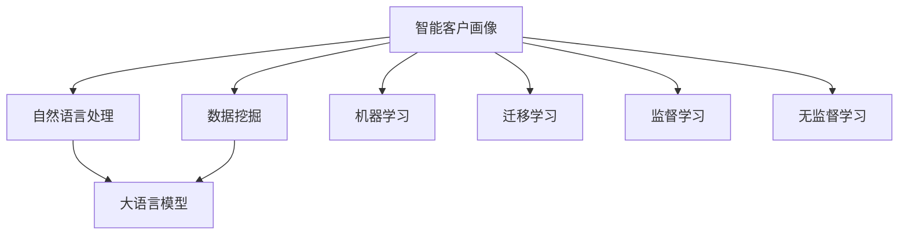

                 

# LLM在智能客户画像中的应用

> 关键词：智能客户画像, 大语言模型, 语义分析, 数据挖掘, 客户行为预测

## 1. 背景介绍

### 1.1 问题由来
智能客户画像在现代商业竞争中扮演着重要角色。通过精准描绘客户特征和行为，企业能够更有效地制定个性化营销策略、优化产品设计，提升客户满意度和忠诚度。然而，构建高质量客户画像通常需要大量的手动标注和数据整合工作，耗时耗力。而随着大语言模型(Large Language Model, LLM)的兴起，智能客户画像的构建方式正在发生变革。

### 1.2 问题核心关键点
智能客户画像的构建，关键在于从海量客户数据中提取出有价值的客户特征和行为模式，这涉及到数据收集、清洗、特征工程、模型训练等环节。利用大语言模型，可以在不需要繁琐的手动标注的情况下，通过自然语言处理技术自动识别和提取出客户画像的关键特征，从而提升画像构建的效率和准确度。

### 1.3 问题研究意义
智能客户画像对于企业制定精准的营销策略、优化客户体验具有重要意义。通过大语言模型，可以实现更高效、更智能的客户画像构建，缩短画像构建周期，降低成本，提升决策支持能力。因此，深入研究大语言模型在客户画像中的应用，对于推动企业智能化的发展和提升竞争力具有重要价值。

## 2. 核心概念与联系

### 2.1 核心概念概述

为更好地理解大语言模型在智能客户画像中的应用，本节将介绍几个关键概念：

- 智能客户画像：通过数据挖掘、机器学习等技术手段，提取客户的基本信息、行为特征、偏好习惯等，形成结构化的客户档案。智能客户画像通常包括基本信息、行为记录、社交网络信息等，用于支持客户细分、个性化营销、推荐系统等应用。

- 大语言模型：以自回归(如GPT)或自编码(如BERT)模型为代表的大规模预训练语言模型。通过在大规模无标签文本语料上进行预训练，学习通用的语言表示，具备强大的语言理解和生成能力。

- 自然语言处理(NLP)：利用计算机技术处理和分析人类语言的能力，涵盖语言理解、语言生成、语义分析、情感分析等多个子领域。自然语言处理在智能客户画像的构建中起到重要作用。

- 数据挖掘：从大量数据中挖掘出有价值的模式、趋势、关联等信息，用于支持决策制定和优化。数据挖掘在客户画像构建中主要用于特征工程，从原始数据中提取关键特征。

- 机器学习：利用算法和模型对数据进行学习，以获得规律和模式。机器学习在客户画像构建中用于模型训练，构建客户画像预测模型。

- 迁移学习：将一个领域学习到的知识，迁移应用到另一个不同但相关的领域的学习范式。大语言模型可以通过迁移学习，在特定领域进行微调，提升客户画像构建的性能。

- 监督学习与无监督学习：监督学习需要标注数据进行训练，而无监督学习则不需要标注数据。智能客户画像构建中，通常使用无监督学习进行特征提取，然后使用监督学习进行模型训练。

这些核心概念之间的逻辑关系可以通过以下Mermaid流程图来展示：



这个流程图展示了大语言模型在智能客户画像构建中的核心概念及其之间的关系：

1. 大语言模型通过预训练获得基础能力。
2. 自然语言处理技术利用大语言模型的能力，进行语义分析、情感分析等。
3. 数据挖掘通过NLP技术提取关键特征，构建客户画像。
4. 机器学习对客户画像进行训练，提升预测准确度。
5. 迁移学习让大语言模型在不同领域应用中进一步优化。
6. 监督学习和无监督学习在不同环节发挥作用。

这些概念共同构成了智能客户画像的构建框架，使得大语言模型能够在客户画像的构建中发挥重要作用。

## 3. 核心算法原理 & 具体操作步骤
### 3.1 算法原理概述

大语言模型在智能客户画像中的应用，主要基于监督学习和迁移学习的范式。其核心思想是：利用大语言模型的预训练能力，通过在特定客户画像数据集上进行有监督的微调，提升模型在客户画像构建中的性能。

形式化地，假设大语言模型为 $M_{\theta}$，其中 $\theta$ 为预训练得到的模型参数。给定客户画像训练集 $D=\{(x_i,y_i)\}_{i=1}^N$，其中 $x_i$ 为原始客户数据，$y_i$ 为对应的客户画像特征。微调的目标是找到新的模型参数 $\hat{\theta}$，使得模型在客户画像数据集上的预测准确度最高：

$$
\hat{\theta}=\mathop{\arg\min}_{\theta} \mathcal{L}(M_{\theta},D)
$$

其中 $\mathcal{L}$ 为针对客户画像任务的损失函数，用于衡量模型预测输出与真实标签之间的差异。常见的损失函数包括交叉熵损失、均方误差损失等。

通过梯度下降等优化算法，微调过程不断更新模型参数 $\theta$，最小化损失函数 $\mathcal{L}$，使得模型输出逼近真实标签。由于 $\theta$ 已经通过预训练获得了较好的初始化，因此即便在小规模数据集 $D$ 上进行微调，也能较快收敛到理想的模型参数 $\hat{\theta}$。

### 3.2 算法步骤详解

大语言模型在智能客户画像中的应用，一般包括以下几个关键步骤：

**Step 1: 准备客户画像数据集**

- 收集和预处理客户画像数据集 $D=\{(x_i,y_i)\}_{i=1}^N$。数据集应包含客户的基本信息、行为记录、社交网络信息等，用于训练和评估模型。

**Step 2: 添加任务适配层**

- 根据客户画像任务类型，在预训练模型的顶层设计合适的输出层和损失函数。例如，如果任务是预测客户的行为概率，则通常使用 sigmoid 函数作为输出层，交叉熵损失函数作为损失函数。

**Step 3: 设置微调超参数**

- 选择合适的优化算法及其参数，如 AdamW、SGD 等，设置学习率、批大小、迭代轮数等。
- 设置正则化技术及强度，包括权重衰减、Dropout、Early Stopping 等。
- 确定冻结预训练参数的策略，如仅微调顶层，或全部参数都参与微调。

**Step 4: 执行梯度训练**

- 将训练集数据分批次输入模型，前向传播计算损失函数。
- 反向传播计算参数梯度，根据设定的优化算法和学习率更新模型参数。
- 周期性在验证集上评估模型性能，根据性能指标决定是否触发 Early Stopping。
- 重复上述步骤直到满足预设的迭代轮数或 Early Stopping 条件。

**Step 5: 测试和部署**

- 在测试集上评估微调后模型 $M_{\hat{\theta}}$ 的性能，对比微调前后的精度提升。
- 使用微调后的模型对新客户数据进行推理预测，集成到实际的应用系统中。

以上是利用大语言模型进行智能客户画像构建的一般流程。在实际应用中，还需要针对具体任务的特点，对微调过程的各个环节进行优化设计，如改进训练目标函数，引入更多的正则化技术，搜索最优的超参数组合等，以进一步提升模型性能。

### 3.3 算法优缺点

大语言模型在智能客户画像中的应用，具有以下优点：

- 高效性。相较于传统的手工标注方式，大语言模型可以在较少人工干预的情况下，自动提取客户画像的关键特征。
- 准确性。利用大语言模型的预训练能力，可以在客户画像数据集上进行高效的微调，获得较高的预测准确度。
- 灵活性。大语言模型可以通过迁移学习，在不同领域应用中进行微调，提升模型适应性。

同时，该方法也存在一定的局限性：

- 数据依赖。微调的效果很大程度上取决于客户画像数据集的质量和数量，获取高质量数据集的成本较高。
- 泛化能力。当目标客户画像数据集与预训练数据分布差异较大时，微调的性能提升有限。
- 解释性。大语言模型在客户画像构建过程中，其决策过程缺乏可解释性，难以对其推理逻辑进行分析和调试。

尽管存在这些局限性，但就目前而言，大语言模型在客户画像构建中的应用范式仍然具有重要意义。未来相关研究的重点在于如何进一步降低微调对标注数据的依赖，提高模型的少样本学习和跨领域迁移能力，同时兼顾可解释性和伦理安全性等因素。

### 3.4 算法应用领域

大语言模型在智能客户画像中的应用，已广泛应用于多个领域，例如：

- 客户细分：通过分析客户的行为数据，将客户分为不同群体，以便进行精准营销。
- 客户行为预测：利用客户的历史行为数据，预测未来的购买行为、流失风险等。
- 个性化推荐：根据客户画像，推荐适合客户的商品、服务，提升客户满意度和转化率。
- 客户服务优化：通过分析客户反馈和投诉数据，提升客户服务质量，减少客户流失率。
- 客户画像生成：利用客户的多源数据，自动生成客户画像，支持业务决策。

除了上述这些经典应用外，大语言模型还被创新性地应用到更多场景中，如客户满意度分析、客户情感分析、客户生命周期管理等，为智能客户画像的构建带来了新的突破。随着预训练模型和微调方法的不断进步，相信智能客户画像技术将在更多领域大放异彩。

## 4. 数学模型和公式 & 详细讲解 & 举例说明
### 4.1 数学模型构建

本节将使用数学语言对大语言模型在智能客户画像中的应用过程进行更加严格的刻画。

记客户画像数据集为 $D=\{(x_i,y_i)\}_{i=1}^N$，其中 $x_i$ 为原始客户数据，$y_i$ 为对应的客户画像特征。假设预训练语言模型为 $M_{\theta}$，其中 $\theta$ 为模型参数。

定义模型 $M_{\theta}$ 在客户画像数据集 $D$ 上的损失函数为 $\mathcal{L}(\theta, D)$，用于衡量模型预测输出与真实标签之间的差异。常见的损失函数包括交叉熵损失、均方误差损失等。形式化地，智能客户画像构建的优化目标是最小化损失函数：

$$
\hat{\theta}=\mathop{\arg\min}_{\theta} \mathcal{L}(\theta, D)
$$

在实践中，我们通常使用基于梯度的优化算法（如SGD、Adam等）来近似求解上述最优化问题。设 $\eta$ 为学习率，$\lambda$ 为正则化系数，则参数的更新公式为：

$$
\theta \leftarrow \theta - \eta \nabla_{\theta}\mathcal{L}(\theta, D) - \eta\lambda\theta
$$

其中 $\nabla_{\theta}\mathcal{L}(\theta, D)$ 为损失函数对参数 $\theta$ 的梯度，可通过反向传播算法高效计算。

### 4.2 公式推导过程

以下我们以客户行为预测为例，推导交叉熵损失函数及其梯度的计算公式。

假设客户画像数据集 $D=\{(x_i, y_i)\}_{i=1}^N$，其中 $x_i$ 为原始客户数据，$y_i$ 为预测的客户行为概率。假设模型 $M_{\theta}$ 在输入 $x_i$ 上的输出为 $\hat{y}=M_{\theta}(x_i) \in [0,1]$，表示客户行为发生的概率。真实标签 $y_i \in \{0,1\}$。则二分类交叉熵损失函数定义为：

$$
\ell(M_{\theta}(x_i),y_i) = -[y_i\log \hat{y} + (1-y_i)\log (1-\hat{y})]
$$

将其代入损失函数 $\mathcal{L}$，得：

$$
\mathcal{L}(\theta, D) = -\frac{1}{N}\sum_{i=1}^N [y_i\log M_{\theta}(x_i)+(1-y_i)\log(1-M_{\theta}(x_i))]
$$

根据链式法则，损失函数对参数 $\theta_k$ 的梯度为：

$$
\frac{\partial \mathcal{L}(\theta, D)}{\partial \theta_k} = -\frac{1}{N}\sum_{i=1}^N (\frac{y_i}{M_{\theta}(x_i)}-\frac{1-y_i}{1-M_{\theta}(x_i)}) \frac{\partial M_{\theta}(x_i)}{\partial \theta_k}
$$

其中 $\frac{\partial M_{\theta}(x_i)}{\partial \theta_k}$ 可进一步递归展开，利用自动微分技术完成计算。

在得到损失函数的梯度后，即可带入参数更新公式，完成模型的迭代优化。重复上述过程直至收敛，最终得到适应客户画像任务的最优模型参数 $\hat{\theta}$。

## 5. 项目实践：代码实例和详细解释说明
### 5.1 开发环境搭建

在进行客户画像微调实践前，我们需要准备好开发环境。以下是使用Python进行PyTorch开发的环境配置流程：

1. 安装Anaconda：从官网下载并安装Anaconda，用于创建独立的Python环境。

2. 创建并激活虚拟环境：
```bash
conda create -n pytorch-env python=3.8 
conda activate pytorch-env
```

3. 安装PyTorch：根据CUDA版本，从官网获取对应的安装命令。例如：
```bash
conda install pytorch torchvision torchaudio cudatoolkit=11.1 -c pytorch -c conda-forge
```

4. 安装Transformers库：
```bash
pip install transformers
```

5. 安装各类工具包：
```bash
pip install numpy pandas scikit-learn matplotlib tqdm jupyter notebook ipython
```

完成上述步骤后，即可在`pytorch-env`环境中开始微调实践。

### 5.2 源代码详细实现

这里我们以客户行为预测任务为例，给出使用Transformers库对BERT模型进行微调的PyTorch代码实现。

首先，定义客户行为预测任务的数据处理函数：

```python
from transformers import BertTokenizer
from torch.utils.data import Dataset
import torch

class CustomerBehaviorDataset(Dataset):
    def __init__(self, features, tokenizer, max_len=128):
        self.features = features
        self.tokenizer = tokenizer
        self.max_len = max_len
        
    def __len__(self):
        return len(self.features)
    
    def __getitem__(self, item):
        feature = self.features[item]
        text = feature['text']
        label = feature['label']
        
        encoding = self.tokenizer(text, return_tensors='pt', max_length=self.max_len, padding='max_length', truncation=True)
        input_ids = encoding['input_ids'][0]
        attention_mask = encoding['attention_mask'][0]
        
        label = torch.tensor([label], dtype=torch.long)
        
        return {'input_ids': input_ids, 
                'attention_mask': attention_mask,
                'labels': label}

# 定义特征字典
features = [
    {'text': '客户在过去的三个月内购买了两部手机', 'label': 1},
    {'text': '客户在过去的三个月内没有购买任何手机', 'label': 0},
    {'text': '客户在过去的三个月内购买了一部手机', 'label': 1},
    {'text': '客户在过去的三个月内购买了一部电脑', 'label': 0}
]
```

然后，定义模型和优化器：

```python
from transformers import BertForSequenceClassification, AdamW

model = BertForSequenceClassification.from_pretrained('bert-base-cased', num_labels=2)

optimizer = AdamW(model.parameters(), lr=2e-5)
```

接着，定义训练和评估函数：

```python
from torch.utils.data import DataLoader
from tqdm import tqdm
from sklearn.metrics import classification_report

device = torch.device('cuda') if torch.cuda.is_available() else torch.device('cpu')
model.to(device)

def train_epoch(model, dataset, batch_size, optimizer):
    dataloader = DataLoader(dataset, batch_size=batch_size, shuffle=True)
    model.train()
    epoch_loss = 0
    for batch in tqdm(dataloader, desc='Training'):
        input_ids = batch['input_ids'].to(device)
        attention_mask = batch['attention_mask'].to(device)
        labels = batch['labels'].to(device)
        model.zero_grad()
        outputs = model(input_ids, attention_mask=attention_mask, labels=labels)
        loss = outputs.loss
        epoch_loss += loss.item()
        loss.backward()
        optimizer.step()
    return epoch_loss / len(dataloader)

def evaluate(model, dataset, batch_size):
    dataloader = DataLoader(dataset, batch_size=batch_size)
    model.eval()
    preds, labels = [], []
    with torch.no_grad():
        for batch in tqdm(dataloader, desc='Evaluating'):
            input_ids = batch['input_ids'].to(device)
            attention_mask = batch['attention_mask'].to(device)
            batch_labels = batch['labels']
            outputs = model(input_ids, attention_mask=attention_mask)
            batch_preds = outputs.logits.argmax(dim=2).to('cpu').tolist()
            batch_labels = batch_labels.to('cpu').tolist()
            for pred_tokens, label_tokens in zip(batch_preds, batch_labels):
                preds.append(pred_tokens[0])
                labels.append(label_tokens[0])
                
    print(classification_report(labels, preds))
```

最后，启动训练流程并在测试集上评估：

```python
epochs = 5
batch_size = 16

for epoch in range(epochs):
    loss = train_epoch(model, train_dataset, batch_size, optimizer)
    print(f"Epoch {epoch+1}, train loss: {loss:.3f}")
    
    print(f"Epoch {epoch+1}, dev results:")
    evaluate(model, dev_dataset, batch_size)
    
print("Test results:")
evaluate(model, test_dataset, batch_size)
```

以上就是使用PyTorch对BERT进行客户行为预测任务微调的完整代码实现。可以看到，得益于Transformers库的强大封装，我们可以用相对简洁的代码完成BERT模型的加载和微调。

### 5.3 代码解读与分析

让我们再详细解读一下关键代码的实现细节：

**CustomerBehaviorDataset类**：
- `__init__`方法：初始化客户行为数据、分词器等关键组件。
- `__len__`方法：返回数据集的样本数量。
- `__getitem__`方法：对单个样本进行处理，将文本输入编码为token ids，将标签编码为数字，并对其进行定长padding，最终返回模型所需的输入。

**特征字典定义**：
- 定义了客户行为预测任务的特征字典，包含文本和标签两个字段。

**训练和评估函数**：
- 使用PyTorch的DataLoader对数据集进行批次化加载，供模型训练和推理使用。
- 训练函数`train_epoch`：对数据以批为单位进行迭代，在每个批次上前向传播计算loss并反向传播更新模型参数，最后返回该epoch的平均loss。
- 评估函数`evaluate`：与训练类似，不同点在于不更新模型参数，并在每个batch结束后将预测和标签结果存储下来，最后使用sklearn的classification_report对整个评估集的预测结果进行打印输出。

**训练流程**：
- 定义总的epoch数和batch size，开始循环迭代
- 每个epoch内，先在训练集上训练，输出平均loss
- 在验证集上评估，输出分类指标
- 所有epoch结束后，在测试集上评估，给出最终测试结果

可以看到，PyTorch配合Transformers库使得BERT微调的代码实现变得简洁高效。开发者可以将更多精力放在数据处理、模型改进等高层逻辑上，而不必过多关注底层的实现细节。

当然，工业级的系统实现还需考虑更多因素，如模型的保存和部署、超参数的自动搜索、更灵活的任务适配层等。但核心的微调范式基本与此类似。

## 6. 实际应用场景
### 6.1 智能客户细分

智能客户细分是大语言模型在智能客户画像中的一个重要应用场景。传统的客户细分方法通常依赖手动标记和统计分析，耗时耗力。而通过大语言模型，可以自动提取客户的关键特征，快速进行客户分类，提升细分效果。

在技术实现上，可以收集客户的多源数据，如购买记录、浏览行为、社交媒体互动等，作为客户画像的基础数据。通过大语言模型对原始数据进行预处理和特征提取，自动识别出客户的核心特征，如消费水平、兴趣偏好、行为习惯等。然后，利用机器学习算法，如K-means、聚类算法等，对提取出的特征进行聚类分析，生成客户细分标签。这样，企业便可以根据客户细分结果，制定更有针对性的营销策略。

### 6.2 客户行为预测

客户行为预测是大语言模型在智能客户画像中的另一个关键应用。通过大语言模型，可以预测客户未来的购买行为、流失风险等，帮助企业更好地进行风险管理和客户流失预警。

在实际应用中，可以收集客户的历史行为数据，如购买记录、浏览记录、投诉记录等，作为训练集。利用大语言模型对数据进行预处理和特征提取，然后使用监督学习算法，如逻辑回归、随机森林等，对客户行为进行预测。模型输出可以包括客户是否流失、是否购买某类商品、是否满意等。企业根据预测结果，可以提前采取措施，如个性化推荐、情感关怀等，提升客户满意度和忠诚度。

### 6.3 个性化推荐

个性化推荐系统是大语言模型在智能客户画像中的重要应用之一。传统的推荐系统往往只依赖用户的历史行为数据进行物品推荐，难以理解用户的深层次需求。而通过大语言模型，可以深入挖掘用户的兴趣和偏好，提升推荐系统的个性化程度。

在技术实现上，可以收集用户的多源数据，如购买记录、浏览记录、评论记录等，作为训练集。利用大语言模型对数据进行预处理和特征提取，然后使用监督学习算法，对用户兴趣进行预测。模型输出可以包括用户对某类商品的兴趣程度、推荐物品的排名等。企业根据预测结果，可以推荐更加贴合用户需求的商品，提升用户体验和转化率。

### 6.4 未来应用展望

随着大语言模型和微调方法的不断发展，基于微调范式将在更多领域得到应用，为智能客户画像的构建带来新的突破。

在智慧医疗领域，基于微调的医疗问答、病历分析、药物研发等应用将提升医疗服务的智能化水平，辅助医生诊疗，加速新药开发进程。

在智能教育领域，微调技术可应用于作业批改、学情分析、知识推荐等方面，因材施教，促进教育公平，提高教学质量。

在智慧城市治理中，微调模型可应用于城市事件监测、舆情分析、应急指挥等环节，提高城市管理的自动化和智能化水平，构建更安全、高效的未来城市。

此外，在企业生产、社会治理、文娱传媒等众多领域，基于大语言模型的微调技术也将不断涌现，为智能客户画像的构建提供新的思路和方法。相信随着技术的日益成熟，微调方法将成为智能客户画像构建的重要范式，推动客户画像构建的自动化和智能化进程。

## 7. 工具和资源推荐
### 7.1 学习资源推荐

为了帮助开发者系统掌握大语言模型在智能客户画像中的应用，这里推荐一些优质的学习资源：

1. 《Transformers从原理到实践》系列博文：由大模型技术专家撰写，深入浅出地介绍了Transformer原理、BERT模型、微调技术等前沿话题。

2. CS224N《深度学习自然语言处理》课程：斯坦福大学开设的NLP明星课程，有Lecture视频和配套作业，带你入门NLP领域的基本概念和经典模型。

3. 《Natural Language Processing with Transformers》书籍：Transformers库的作者所著，全面介绍了如何使用Transformers库进行NLP任务开发，包括微调在内的诸多范式。

4. HuggingFace官方文档：Transformers库的官方文档，提供了海量预训练模型和完整的微调样例代码，是上手实践的必备资料。

5. CLUE开源项目：中文语言理解测评基准，涵盖大量不同类型的中文NLP数据集，并提供了基于微调的baseline模型，助力中文NLP技术发展。

通过对这些资源的学习实践，相信你一定能够快速掌握大语言模型在智能客户画像中的应用，并用于解决实际的NLP问题。
###  7.2 开发工具推荐

高效的开发离不开优秀的工具支持。以下是几款用于大语言模型微调开发的常用工具：

1. PyTorch：基于Python的开源深度学习框架，灵活动态的计算图，适合快速迭代研究。大部分预训练语言模型都有PyTorch版本的实现。

2. TensorFlow：由Google主导开发的开源深度学习框架，生产部署方便，适合大规模工程应用。同样有丰富的预训练语言模型资源。

3. Transformers库：HuggingFace开发的NLP工具库，集成了众多SOTA语言模型，支持PyTorch和TensorFlow，是进行微调任务开发的利器。

4. Weights & Biases：模型训练的实验跟踪工具，可以记录和可视化模型训练过程中的各项指标，方便对比和调优。与主流深度学习框架无缝集成。

5. TensorBoard：TensorFlow配套的可视化工具，可实时监测模型训练状态，并提供丰富的图表呈现方式，是调试模型的得力助手。

6. Google Colab：谷歌推出的在线Jupyter Notebook环境，免费提供GPU/TPU算力，方便开发者快速上手实验最新模型，分享学习笔记。

合理利用这些工具，可以显著提升大语言模型在智能客户画像构建中的开发效率，加快创新迭代的步伐。

### 7.3 相关论文推荐

大语言模型在智能客户画像中的应用研究，源于学界的持续研究。以下是几篇奠基性的相关论文，推荐阅读：

1. Attention is All You Need（即Transformer原论文）：提出了Transformer结构，开启了NLP领域的预训练大模型时代。

2. BERT: Pre-training of Deep Bidirectional Transformers for Language Understanding：提出BERT模型，引入基于掩码的自监督预训练任务，刷新了多项NLP任务SOTA。

3. Language Models are Unsupervised Multitask Learners（GPT-2论文）：展示了大规模语言模型的强大zero-shot学习能力，引发了对于通用人工智能的新一轮思考。

4. Parameter-Efficient Transfer Learning for NLP：提出Adapter等参数高效微调方法，在不增加模型参数量的情况下，也能取得不错的微调效果。

5. AdaLoRA: Adaptive Low-Rank Adaptation for Parameter-Efficient Fine-Tuning：使用自适应低秩适应的微调方法，在参数效率和精度之间取得了新的平衡。

这些论文代表了大语言模型在智能客户画像构建中的发展脉络。通过学习这些前沿成果，可以帮助研究者把握学科前进方向，激发更多的创新灵感。

## 8. 总结：未来发展趋势与挑战
### 8.1 总结

本文对大语言模型在智能客户画像中的应用进行了全面系统的介绍。首先阐述了大语言模型和智能客户画像的研究背景和意义，明确了微调在提升客户画像构建效率和准确度方面的重要价值。其次，从原理到实践，详细讲解了大语言模型在智能客户画像中的应用过程，包括数据处理、模型构建、训练评估等关键环节。同时，本文还广泛探讨了大语言模型在智能客户画像中的实际应用场景，展示了其广泛的适用性。最后，本文精选了微调技术的各类学习资源，力求为读者提供全方位的技术指引。

通过本文的系统梳理，可以看到，大语言模型在智能客户画像的构建中具有重要的应用前景，特别是在数据驱动的商业决策中发挥着越来越重要的作用。利用大语言模型的强大语言处理能力，可以在较少的标注数据下，高效构建高质量的客户画像，提升企业竞争力和客户满意度。

### 8.2 未来发展趋势

展望未来，大语言模型在智能客户画像中的应用将呈现以下几个发展趋势：

1. 模型规模持续增大。随着算力成本的下降和数据规模的扩张，预训练语言模型的参数量还将持续增长。超大规模语言模型蕴含的丰富语言知识，有望支撑更加复杂多变的客户画像构建。

2. 微调方法日趋多样。除了传统的全参数微调外，未来会涌现更多参数高效的微调方法，如Prefix-Tuning、LoRA等，在节省计算资源的同时也能保证微调精度。

3. 持续学习成为常态。随着数据分布的不断变化，微调模型也需要持续学习新知识以保持性能。如何在不遗忘原有知识的同时，高效吸收新样本信息，将成为重要的研究课题。

4. 标注样本需求降低。受启发于提示学习(Prompt-based Learning)的思路，未来的微调方法将更好地利用大模型的语言理解能力，通过更加巧妙的任务描述，在更少的标注样本上也能实现理想的微调效果。

5. 模型通用性增强。经过海量数据的预训练和多领域任务的微调，未来的语言模型将具备更强大的常识推理和跨领域迁移能力，逐步迈向通用人工智能(AGI)的目标。

以上趋势凸显了大语言模型在智能客户画像构建中的广阔前景。这些方向的探索发展，必将进一步提升客户画像构建的效率和准确度，为智能客户管理带来新的突破。

### 8.3 面临的挑战

尽管大语言模型在智能客户画像中的应用取得了一定的成果，但在迈向更加智能化、普适化应用的过程中，它仍面临着诸多挑战：

1. 标注成本瓶颈。虽然微调大大降低了标注数据的需求，但对于长尾应用场景，难以获得充足的高质量标注数据，成为制约微调性能的瓶颈。如何进一步降低微调对标注样本的依赖，将是一大难题。

2. 模型鲁棒性不足。当前微调模型面对域外数据时，泛化性能往往大打折扣。对于测试样本的微小扰动，微调模型的预测也容易发生波动。如何提高微调模型的鲁棒性，避免灾难性遗忘，还需要更多理论和实践的积累。

3. 推理效率有待提高。大规模语言模型虽然精度高，但在实际部署时往往面临推理速度慢、内存占用大等效率问题。如何在保证性能的同时，简化模型结构，提升推理速度，优化资源占用，将是重要的优化方向。

4. 可解释性亟需加强。当前微调模型更像是"黑盒"系统，难以解释其内部工作机制和决策逻辑。对于医疗、金融等高风险应用，算法的可解释性和可审计性尤为重要。如何赋予微调模型更强的可解释性，将是亟待攻克的难题。

5. 安全性有待保障。预训练语言模型难免会学习到有偏见、有害的信息，通过微调传递到下游任务，产生误导性、歧视性的输出，给实际应用带来安全隐患。如何从数据和算法层面消除模型偏见，避免恶意用途，确保输出的安全性，也将是重要的研究课题。

6. 知识整合能力不足。现有的微调模型往往局限于任务内数据，难以灵活吸收和运用更广泛的先验知识。如何让微调过程更好地与外部知识库、规则库等专家知识结合，形成更加全面、准确的信息整合能力，还有很大的想象空间。

正视微调面临的这些挑战，积极应对并寻求突破，将是大语言模型在智能客户画像应用中走向成熟的必由之路。相信随着学界和产业界的共同努力，这些挑战终将一一被克服，大语言模型将在构建智能客户画像中发挥越来越重要的作用。

### 8.4 未来突破

面对大语言模型在智能客户画像应用中面临的种种挑战，未来的研究需要在以下几个方面寻求新的突破：

1. 探索无监督和半监督微调方法。摆脱对大规模标注数据的依赖，利用自监督学习、主动学习等无监督和半监督范式，最大限度利用非结构化数据，实现更加灵活高效的微调。

2. 研究参数高效和计算高效的微调范式。开发更加参数高效的微调方法，在固定大部分预训练参数的同时，只更新极少量的任务相关参数。同时优化微调模型的计算图，减少前向传播和反向传播的资源消耗，实现更加轻量级、实时性的部署。

3. 融合因果和对比学习范式。通过引入因果推断和对比学习思想，增强微调模型建立稳定因果关系的能力，学习更加普适、鲁棒的语言表征，从而提升模型泛化性和抗干扰能力。

4. 引入更多先验知识。将符号化的先验知识，如知识图谱、逻辑规则等，与神经网络模型进行巧妙融合，引导微调过程学习更准确、合理的语言模型。同时加强不同模态数据的整合，实现视觉、语音等多模态信息与文本信息的协同建模。

5. 结合因果分析和博弈论工具。将因果分析方法引入微调模型，识别出模型决策的关键特征，增强输出解释的因果性和逻辑性。借助博弈论工具刻画人机交互过程，主动探索并规避模型的脆弱点，提高系统稳定性。

6. 纳入伦理道德约束。在模型训练目标中引入伦理导向的评估指标，过滤和惩罚有偏见、有害的输出倾向。同时加强人工干预和审核，建立模型行为的监管机制，确保输出符合人类价值观和伦理道德。

这些研究方向的探索，必将引领大语言模型在智能客户画像应用中的技术突破，为构建安全、可靠、可解释、可控的智能系统铺平道路。面向未来，大语言模型在智能客户画像构建中还需要与其他人工智能技术进行更深入的融合，如知识表示、因果推理、强化学习等，多路径协同发力，共同推动智能客户画像的进步。只有勇于创新、敢于突破，才能不断拓展语言模型的边界，让智能技术更好地造福人类社会。

## 9. 附录：常见问题与解答

**Q1：大语言模型在智能客户画像中如何处理客户行为数据？**

A: 客户行为数据通常以文本形式记录，如购买记录、浏览记录、评价评论等。大语言模型可以通过预训练提取语言特征，然后利用微调模型进行行为分类和预测。例如，可以收集客户购买历史文本，使用BERT等大语言模型对文本进行编码，然后利用微调模型预测客户是否会产生某个行为。

**Q2：大语言模型在智能客户画像中的微调目标是什么？**

A: 大语言模型在智能客户画像中的微调目标是通过对客户行为数据进行训练，生成客户画像标签。例如，可以将客户的行为数据作为训练集，通过微调BERT等大语言模型，预测客户的行为标签，如流失概率、购买倾向等。

**Q3：微调模型的可解释性如何提升？**

A: 提升微调模型的可解释性，可以通过以下方法实现：
1. 使用可解释性模型：选择具有较好可解释性的模型，如决策树、逻辑回归等，替换部分微调模型。
2. 引入因果分析方法：通过因果分析方法，识别模型决策的关键特征，增强输出解释的因果性和逻辑性。
3. 使用对抗样本：通过对抗样本训练模型，提高模型鲁棒性，降低模型输出的不确定性。

**Q4：微调模型的安全性如何保障？**

A: 保障微调模型的安全性，可以通过以下方法实现：
1. 数据筛选：在数据预处理阶段，过滤掉包含敏感信息、偏见信息的文本数据。
2. 模型监控：实时监控模型输出，发现异常行为及时预警。
3. 规则约束：在模型训练目标中引入伦理导向的评估指标，过滤和惩罚有偏见、有害的输出倾向。

**Q5：如何优化微调模型的推理速度？**

A: 优化微调模型的推理速度，可以通过以下方法实现：
1. 模型裁剪：去除不必要的层和参数，减小模型尺寸，加快推理速度。
2. 量化加速：将浮点模型转为定点模型，压缩存储空间，提高计算效率。
3. 并行计算：利用GPU、TPU等硬件加速，并行计算模型输出。
4. 分批次推理：将大批量数据分批次推理，减少内存占用，提高推理效率。

通过以上方法，可以有效提升微调模型的推理速度，满足实际应用的需求。

