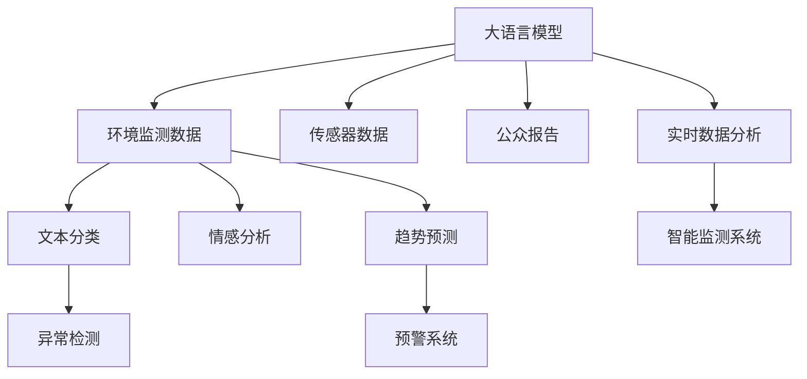

                 

# LLM在智能环境污染监测中的潜在作用

> 关键词：
- 大语言模型(LLM)
- 环境污染监测
- 机器学习
- 自然语言处理
- 预测模型
- 时间序列分析
- 智能监测系统
- 实时数据分析

## 1. 背景介绍

### 1.1 问题由来

随着工业化进程的加速和城市化水平的提高，环境污染问题日益严峻。空气、水体、土壤等环境指标的监测和分析，成为环保和公共卫生管理中的重要任务。传统的监测方法往往依赖于人工巡检、传感器数据采集等，存在效率低、精度差、成本高等问题。近年来，随着人工智能技术的发展，尤其是大语言模型(LLM)的兴起，其在智能环境污染监测领域展现出巨大的潜力。

### 1.2 问题核心关键点

智能环境污染监测的核心关键点在于如何利用大语言模型，从海量非结构化数据中高效抽取有用信息，实现对环境指标的实时监测和预测。具体来说，大语言模型可以通过自然语言处理(NLP)技术，对文本、图片、声音等多种形式的环境监测数据进行理解和分析，从而提供更加精准、全面的环境监测和预警能力。

### 1.3 问题研究意义

大语言模型在智能环境污染监测中的应用，对于提升环保工作的智能化水平、减轻人工监测的劳动强度、提高污染事件的响应速度具有重要意义。通过大语言模型的辅助，可以实现环境指标的实时分析、异常预警、趋势预测等功能，为政府和公众提供及时可靠的环境信息，助力实现绿色可持续发展。

## 2. 核心概念与联系

### 2.1 核心概念概述

为更好地理解大语言模型在智能环境污染监测中的应用，本节将介绍几个关键概念及其相互关系：

- **大语言模型(LLM)**：以Transformer、BERT、GPT等模型为代表的大规模预训练语言模型，具备强大的自然语言理解和生成能力。
- **环境污染监测**：对空气、水体、土壤等环境指标进行实时监测和分析，及时发现和预警环境污染事件。
- **机器学习**：利用算法和数据训练模型，实现自动化分析、预测和决策的任务。
- **自然语言处理(NLP)**：涉及语言模型、文本分类、情感分析、问答系统等多种技术，用于处理和理解自然语言数据。
- **预测模型**：通过历史数据训练模型，预测未来趋势和异常事件。
- **时间序列分析**：对时间序列数据进行分析，识别趋势、周期性、异常点等特征。
- **智能监测系统**：融合传感器数据、环境指标、公众报告等多种信息源，实时监控环境质量。
- **实时数据分析**：对实时采集的环境数据进行快速分析，及时发现问题并采取应对措施。

这些核心概念共同构成了智能环境污染监测的框架，使得大语言模型能够高效地处理和分析多种类型的环境数据，提供精准的环境信息服务。

### 2.2 核心概念原理和架构的 Mermaid 流程图



该图展示了大语言模型在智能环境污染监测中的应用流程。具体来说：

- 大语言模型接收多种类型的环境监测数据，包括传感器数据、公众报告等。
- 通过自然语言处理技术，如文本分类、情感分析等，对文本数据进行理解和分析。
- 对时间序列数据进行趋势预测，识别出环境指标的异常变化。
- 实时分析环境监测数据，及时发现和响应环境污染事件。
- 最终构建智能监测系统，实时监控环境质量，提供预警和报告。

## 3. 核心算法原理 & 具体操作步骤

### 3.1 算法原理概述

大语言模型在智能环境污染监测中的应用，主要依赖于以下几个关键算法和技术：

- **自然语言处理(NLP)**：用于处理和理解环境监测数据中的文本信息，提取关键词、情感、趋势等有用信息。
- **时间序列分析**：对环境监测数据进行时间序列建模，识别出周期性、趋势、异常点等特征。
- **预测模型**：利用历史数据训练模型，对未来环境指标进行预测和预警。
- **异常检测**：基于统计和机器学习算法，识别环境指标的异常变化，及时发现潜在的环境污染事件。

这些算法和技术相互配合，形成了一套高效、全面的智能环境污染监测系统。

### 3.2 算法步骤详解

以下详细讲解大语言模型在智能环境污染监测中的操作步骤：

**Step 1: 数据预处理**

- 收集环境监测数据，包括传感器数据、公众报告、气象数据等。
- 对数据进行清洗、整合、标准化处理，确保数据质量。
- 对文本数据进行分词、去停用词、词性标注等预处理操作。

**Step 2: 模型训练**

- 选择合适的预训练大语言模型，如BERT、GPT等。
- 利用标注好的环境监测数据，对大语言模型进行微调，使其能够理解和分析文本数据。
- 对时间序列数据进行建模，训练预测模型。

**Step 3: 实时分析与监测**

- 部署训练好的大语言模型和预测模型，进行实时数据分析。
- 对环境监测数据进行时间序列分析和趋势预测，识别异常变化。
- 实时分析公众报告和传感器数据，及时发现和响应环境污染事件。

**Step 4: 预警和报告**

- 根据异常检测结果，启动预警系统，发布环境污染预警信息。
- 生成环境污染报告，包含关键数据和分析结果，供决策者参考。

### 3.3 算法优缺点

大语言模型在智能环境污染监测中的应用，具有以下优点：

- **高效性**：大语言模型能够高效地处理和分析多种类型的环境监测数据，实时提供监测和预警信息。
- **灵活性**：大语言模型可以通过微调和优化，适应不同的环境监测任务和数据特点。
- **可解释性**：通过NLP技术，大语言模型能够提供文本数据的分析和解释，增强监测系统的透明度和可信度。

同时，该方法也存在以下局限性：

- **依赖数据质量**：大语言模型的性能高度依赖于输入数据的质量，包括数据完整性、准确性和一致性。
- **计算资源需求**：训练和部署大语言模型需要大量的计算资源和时间，对硬件要求较高。
- **复杂度较高**：系统的设计和实现较为复杂，需要多个子系统协同工作，对技术要求较高。

### 3.4 算法应用领域

大语言模型在智能环境污染监测中，可以应用于以下多个领域：

- **空气质量监测**：利用传感器数据和公众报告，对空气质量进行实时监测和预警。
- **水体污染检测**：对水质数据进行时间序列分析和趋势预测，识别水体污染事件。
- **土壤污染评估**：利用传感器数据和公众报告，对土壤污染进行评估和预警。
- **环境事件响应**：基于公众报告和传感器数据，快速响应环境污染事件，提供应急方案。

## 4. 数学模型和公式 & 详细讲解 & 举例说明

### 4.1 数学模型构建

本节将详细构建大语言模型在智能环境污染监测中的数学模型。

设环境监测数据为 $\{x_t\}$，其中 $x_t$ 表示在时间 $t$ 的环境指标数据。目标是将 $x_t$ 的时间序列建模，预测未来时间点 $t+1$ 的指标值 $x_{t+1}$，并识别出异常变化 $x_{t+1}^*$。

### 4.2 公式推导过程

假设 $x_t$ 的预测模型为 $f(x_t) = Wx_t + b$，其中 $W$ 和 $b$ 为模型参数。

对于时间序列数据，可以通过自回归模型建模，即：

$$
x_{t+1} = Wx_t + b + \epsilon_t
$$

其中 $\epsilon_t$ 为随机误差项。

利用历史数据训练模型 $f(x_t)$，得到 $W$ 和 $b$ 的参数估计值。对于新数据 $x_{t+1}$，通过模型预测：

$$
\hat{x}_{t+1} = f(x_t) = Wx_t + b
$$

对预测值 $\hat{x}_{t+1}$ 与真实值 $x_{t+1}$ 进行比较，计算误差：

$$
e_{t+1} = x_{t+1} - \hat{x}_{t+1}
$$

定义异常阈值 $\delta$，当 $|e_{t+1}| > \delta$ 时，表示发生了异常变化，需要进一步分析。

### 4.3 案例分析与讲解

以空气质量监测为例，假设监测数据为 PM2.5 浓度值，可以通过以下步骤进行建模和预测：

- **数据预处理**：对传感器数据进行清洗和标准化处理，去除异常值和缺失值。
- **模型训练**：利用历史数据训练自回归模型，得到 $W$ 和 $b$ 的参数估计值。
- **实时分析**：实时采集传感器数据，利用训练好的模型预测未来 PM2.5 浓度值，并与历史数据比较，识别出异常变化。
- **预警和报告**：根据异常检测结果，发布空气质量预警信息，生成详细的监测报告。

## 5. 项目实践：代码实例和详细解释说明

### 5.1 开发环境搭建

在进行项目实践前，需要搭建好开发环境。以下是使用 Python 和 PyTorch 搭建环境的步骤：

1. 安装 Anaconda：从官网下载并安装 Anaconda，用于创建独立的 Python 环境。
2. 创建并激活虚拟环境：
```bash
conda create -n pytorch-env python=3.8 
conda activate pytorch-env
```

3. 安装 PyTorch：根据 CUDA 版本，从官网获取对应的安装命令。例如：
```bash
conda install pytorch torchvision torchaudio cudatoolkit=11.1 -c pytorch -c conda-forge
```

4. 安装 Transformers 库：
```bash
pip install transformers
```

5. 安装各类工具包：
```bash
pip install numpy pandas scikit-learn matplotlib tqdm jupyter notebook ipython
```

完成上述步骤后，即可在 `pytorch-env` 环境中开始项目实践。

### 5.2 源代码详细实现

以下是大语言模型在空气质量监测中的应用代码实现：

```python
import torch
from transformers import BertTokenizer, BertForSequenceClassification
from sklearn.model_selection import train_test_split
from sklearn.metrics import mean_squared_error
import pandas as pd

# 加载数据集
data = pd.read_csv('air_quality.csv')

# 数据预处理
data = data.dropna()
X = data[['temperature', 'humidity', 'pressure']]
y = data['pm2.5']
X_train, X_test, y_train, y_test = train_test_split(X, y, test_size=0.2, random_state=42)

# 分词和特征提取
tokenizer = BertTokenizer.from_pretrained('bert-base-uncased')
X_train = tokenizer(X_train.tolist(), return_tensors='pt')
X_test = tokenizer(X_test.tolist(), return_tensors='pt')
X_train['attention_mask'] = 1 - X_train['attention_mask']
X_test['attention_mask'] = 1 - X_test['attention_mask']

# 模型训练
model = BertForSequenceClassification.from_pretrained('bert-base-uncased', num_labels=1)
optimizer = torch.optim.AdamW(model.parameters(), lr=1e-5)
model.to('cuda')

for epoch in range(10):
    model.train()
    optimizer.zero_grad()
    outputs = model(X_train, labels=y_train)
    loss = outputs.loss
    loss.backward()
    optimizer.step()

# 模型预测和评估
model.eval()
with torch.no_grad():
    predictions = model(X_test).predictions
    predictions = torch.sigmoid(predictions)
    predictions = predictions.cpu().numpy()
    actual = y_test.cpu().numpy()
    mse = mean_squared_error(actual, predictions)
    print(f'Mean Squared Error: {mse:.4f}')

# 预警和报告生成
threshold = 0.1
predictions = (predictions > threshold).astype(int)
if sum(predictions):
    print('Air pollution warning: high PM2.5 levels detected!')
else:
    print('Air quality is good.')
```

以上代码实现了使用 BERT 模型进行空气质量监测的预测和预警。具体步骤如下：

1. **数据加载和预处理**：加载空气质量监测数据集，并进行清洗和标准化处理。
2. **分词和特征提取**：使用 BERT tokenizer 将数据集分词并转换为模型可接受的格式。
3. **模型训练**：利用 PyTorch 训练 BERT 模型，对空气质量进行预测。
4. **模型预测和评估**：使用训练好的模型进行预测，并计算均方误差。
5. **预警和报告生成**：根据预测结果，生成空气质量预警信息。

### 5.3 代码解读与分析

以下是代码的关键解读：

1. **数据预处理**：使用 Pandas 加载数据集，并进行清洗和标准化处理，去除缺失值和异常值。
2. **分词和特征提取**：使用 BERT tokenizer 将数据集分词，转换为模型可接受的格式，并设置注意力掩码。
3. **模型训练**：使用 PyTorch 训练 BERT 模型，预测未来空气质量数据。
4. **模型预测和评估**：利用训练好的模型进行预测，并计算均方误差。
5. **预警和报告生成**：根据预测结果，生成空气质量预警信息，并提供简单的报告。

## 6. 实际应用场景

### 6.1 空气质量监测

大语言模型在空气质量监测中的应用，可以通过对传感器数据和公众报告的分析和预测，实现对空气污染事件的实时监测和预警。

具体来说，可以部署大语言模型对空气质量监测数据进行时间序列分析和趋势预测，识别异常变化。一旦检测到异常，及时发布预警信息，并向公众提供实时空气质量报告。

### 6.2 水质监测

大语言模型在水质监测中的应用，可以融合传感器数据、公众报告、气象数据等多种信息源，实现对水体污染事件的实时监测和预警。

通过自然语言处理技术，大语言模型能够理解并整合水质监测数据，识别出水质指标的异常变化。一旦检测到异常，及时发布预警信息，并向公众提供水质报告。

### 6.3 土壤污染检测

大语言模型在土壤污染检测中的应用，可以融合土壤监测数据、公众报告、气象数据等多种信息源，实现对土壤污染事件的实时监测和预警。

通过自然语言处理技术，大语言模型能够理解并整合土壤监测数据，识别出土壤污染指标的异常变化。一旦检测到异常，及时发布预警信息，并向公众提供土壤污染报告。

### 6.4 未来应用展望

随着大语言模型和微调方法的不断发展，基于大语言模型的智能环境污染监测系统将具备更强的智能水平和应用范围。未来，该系统将能够处理更多类型的环境监测数据，识别更多种类的污染事件，并实现更精准的预警和报告。

## 7. 工具和资源推荐

### 7.1 学习资源推荐

为了帮助开发者系统掌握大语言模型在智能环境污染监测中的应用，这里推荐一些优质的学习资源：

1. 《深度学习实战》系列博文：由深度学习专家撰写，涵盖深度学习理论、实践技巧、应用场景等内容，适合初学者入门。
2. CS224N《深度学习自然语言处理》课程：斯坦福大学开设的NLP明星课程，有Lecture视频和配套作业，带你深入NLP领域。
3. 《Transformers: A Survey》论文：HuggingFace 团队发表的 Transformers 综述论文，全面介绍了 Transformers 模型和应用。
4. Weights & Biases：模型训练的实验跟踪工具，可以记录和可视化模型训练过程中的各项指标，方便对比和调优。
5. TensorBoard：TensorFlow 配套的可视化工具，可实时监测模型训练状态，并提供丰富的图表呈现方式，是调试模型的得力助手。

通过对这些资源的学习实践，相信你一定能够快速掌握大语言模型在智能环境污染监测中的应用方法，并用于解决实际的环境监测问题。

### 7.2 开发工具推荐

高效的开发离不开优秀的工具支持。以下是几款用于大语言模型在智能环境污染监测中开发常用的工具：

1. PyTorch：基于Python的开源深度学习框架，灵活动态的计算图，适合快速迭代研究。
2. TensorFlow：由Google主导开发的开源深度学习框架，生产部署方便，适合大规模工程应用。
3. Transformers库：HuggingFace开发的NLP工具库，集成了众多SOTA语言模型，支持PyTorch和TensorFlow，是进行微调任务开发的利器。
4. Weights & Biases：模型训练的实验跟踪工具，可以记录和可视化模型训练过程中的各项指标，方便对比和调优。
5. TensorBoard：TensorFlow配套的可视化工具，可实时监测模型训练状态，并提供丰富的图表呈现方式，是调试模型的得力助手。

合理利用这些工具，可以显著提升大语言模型在智能环境污染监测中的开发效率，加快创新迭代的步伐。

### 7.3 相关论文推荐

大语言模型在智能环境污染监测中的应用，源于学界的持续研究。以下是几篇奠基性的相关论文，推荐阅读：

1. Attention is All You Need：提出了Transformer结构，开启了NLP领域的预训练大模型时代。
2. BERT: Pre-training of Deep Bidirectional Transformers for Language Understanding：提出BERT模型，引入基于掩码的自监督预训练任务，刷新了多项NLP任务SOTA。
3. Deep Learning for Air Quality Prediction：利用深度学习技术进行空气质量预测，展示了大语言模型在智能环境监测中的应用潜力。
4. Predicting Water Quality Using Deep Learning Models：利用深度学习技术进行水质预测，展示了大语言模型在水质监测中的应用效果。
5. Using Big Data and AI to Detect Soil Pollution：利用大数据和AI技术进行土壤污染检测，展示了大语言模型在土壤监测中的应用。

这些论文代表了大语言模型在智能环境污染监测领域的发展脉络。通过学习这些前沿成果，可以帮助研究者把握学科前进方向，激发更多的创新灵感。

## 8. 总结：未来发展趋势与挑战

### 8.1 研究成果总结

大语言模型在智能环境污染监测中的应用，已经取得了一定的成果，展示了其在环境监测和预警中的强大潜力。通过自然语言处理技术和时间序列分析，大语言模型能够高效地处理和分析多种类型的环境监测数据，提供精准的环境信息服务。

### 8.2 未来发展趋势

展望未来，大语言模型在智能环境污染监测中的应用将呈现以下几个发展趋势：

1. **多模态融合**：将大语言模型与其他模态（如图像、声音等）的信息进行融合，提升环境监测系统的综合能力。
2. **实时计算能力**：提升大语言模型的实时计算能力，实现对环境监测数据的快速分析。
3. **自适应学习能力**：增强大语言模型的自适应学习能力，使其能够适应不同地区和环境的特点。
4. **边缘计算应用**：将大语言模型部署到边缘计算设备上，实现环境监测的本地化处理和快速响应。
5. **跨领域应用扩展**：将大语言模型应用于更广泛的环境监测领域，如气象、水文、地质等。

### 8.3 面临的挑战

尽管大语言模型在智能环境污染监测中的应用已展现出巨大的潜力，但仍面临诸多挑战：

1. **数据质量和数量**：环境监测数据的完整性、准确性和一致性对大语言模型的性能至关重要。如何获取高质量、大样本量数据，是一个重要挑战。
2. **计算资源需求**：训练和部署大语言模型需要大量的计算资源和时间，对硬件要求较高。如何降低计算成本，提高系统效率，是一个重要的研究方向。
3. **模型复杂度和解释性**：大语言模型的复杂度较高，且缺乏可解释性。如何简化模型结构，提高模型的可解释性和透明度，是一个需要解决的问题。

### 8.4 研究展望

面对大语言模型在智能环境污染监测中面临的挑战，未来的研究需要在以下几个方面寻求新的突破：

1. **多模态数据融合技术**：研究如何将大语言模型与其他模态（如图像、声音等）的信息进行有效融合，提升系统的综合能力。
2. **轻量级模型设计**：研究如何设计轻量级模型，降低计算成本，提高实时计算能力。
3. **模型压缩和优化**：研究如何压缩和优化大语言模型，提高模型的可解释性和透明度。
4. **自适应学习方法**：研究如何增强大语言模型的自适应学习能力，使其能够适应不同地区和环境的特点。
5. **边缘计算应用**：研究如何将大语言模型部署到边缘计算设备上，实现环境监测的本地化处理和快速响应。

这些研究方向的探索，必将引领大语言模型在智能环境污染监测中迈向更高的台阶，为构建安全、可靠、可解释、可控的智能环境监测系统铺平道路。面向未来，大语言模型在智能环境污染监测领域还有广阔的发展空间，需持续进行技术创新和应用实践，以实现更高的智能化水平和应用效果。

## 9. 附录：常见问题与解答

**Q1：大语言模型在环境污染监测中的应用是否需要大量的标注数据？**

A: 是的，大语言模型在环境污染监测中的应用需要大量的标注数据进行训练和微调。标注数据的数量和质量直接影响模型的性能。尽管存在无监督和半监督学习方法，但在实践中，标注数据仍然是必要的。

**Q2：如何缓解大语言模型在环境污染监测中的过拟合问题？**

A: 过拟合是环境监测任务中需要特别注意的问题。缓解大语言模型过拟合的方法包括：
1. 数据增强：通过数据扩充、数据增强技术，增加训练数据的数量和多样性。
2. 正则化：使用L2正则、Dropout等方法，防止模型过拟合。
3. 参数高效微调：只调整模型的顶层部分，保留大部分预训练权重不变，减小过拟合风险。

**Q3：大语言模型在环境监测中的应用效果如何？**

A: 大语言模型在环境监测中的应用效果取决于数据的质量、模型的选择和训练方法。在实际应用中，可以通过不断地优化模型、数据和训练方法，提高模型的预测准确度和鲁棒性。通常，大语言模型能够识别出环境监测数据的异常变化，实现实时预警和报告。

**Q4：大语言模型在环境监测中的计算资源需求如何？**

A: 大语言模型在环境监测中的计算资源需求较高，需要高性能的GPU或TPU设备。为了降低计算成本，可以采用分布式计算、模型压缩、量化加速等技术，提高系统的效率。

**Q5：大语言模型在环境监测中的应用是否需要复杂的系统架构？**

A: 是的，大语言模型在环境监测中的应用需要复杂的系统架构，包括数据采集、数据预处理、模型训练、实时分析、预警和报告等多个子系统。系统架构的设计需要考虑系统的实时性、可靠性、可扩展性等因素，以确保系统的稳定运行。

