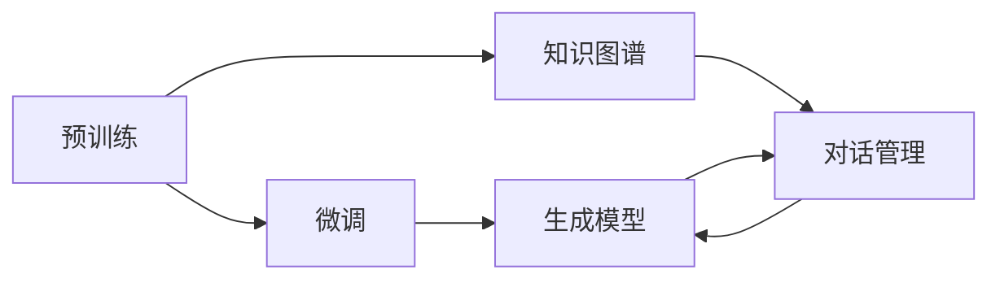

                 

# LLM在智能问答系统中的角色

## 1. 背景介绍

随着人工智能技术的不断进步，大语言模型(LLM)在智能问答系统中的应用成为了研究热点。智能问答系统通过自然语言理解(NLU)技术，识别用户查询的意图，并根据已有的知识库或数据集生成相应的回答。大语言模型通过预训练和微调，具备强大的语言理解和生成能力，为智能问答系统提供了可靠的智能推断基础。

### 1.1 问题由来
传统问答系统依赖于预定义的知识库或规则，在处理长尾问题、领域问题等方面表现有限。随着大语言模型(如GPT-3、BERT等)的出现，智能问答系统获得了新的契机。大语言模型通过大规模无监督学习获得了丰富的语言知识，可以自动推理和生成答案，并适应不同的领域和场景。

### 1.2 问题核心关键点
大语言模型在智能问答系统中的应用，主要体现在以下几个方面：
- **语言理解**：利用预训练模型进行文本表示学习，理解用户查询的意图和上下文。
- **知识推理**：结合知识库或外部信息源，进行逻辑推理，生成合理、准确的答案。
- **生成回答**：使用大语言模型的生成能力，根据推理结果生成自然流畅的回答。
- **个性化推荐**：根据用户历史行为和上下文信息，提供个性化的问答体验。
- **上下文管理**：保持对话连贯性，理解对话历史，提供一致的回答。

### 1.3 问题研究意义
大语言模型在智能问答系统中的应用，可以显著提升系统的智能化水平和用户体验。具体而言：
- **处理长尾问题**：大语言模型能够理解长尾问题，减少知识库覆盖率不足的问题。
- **跨领域适应**：大语言模型具有较强的跨领域适应能力，能够处理各种不同领域的问题。
- **实时交互**：大语言模型可以提供实时交互能力，快速响应用户查询。
- **知识融合**：结合多源数据和知识库，提供更全面、准确的答案。

## 2. 核心概念与联系

### 2.1 核心概念概述

为了更好地理解大语言模型在智能问答系统中的应用，本节将介绍几个密切相关的核心概念：

- **大语言模型(LLM)**：通过大规模无监督学习获取丰富语言知识的模型，如GPT-3、BERT等。
- **预训练**：在大规模无标签数据上进行的自动特征学习过程，使模型具备良好的语言表示能力。
- **微调**：在预训练模型的基础上，使用特定任务的数据进行有监督学习，提升模型在该任务上的性能。
- **知识图谱**：通过语义网络结构存储和组织知识，用于增强智能问答系统的推理能力。
- **对话管理**：管理问答过程中的对话上下文，确保对话连贯性和一致性。
- **生成模型**：通过语言模型生成自然流畅的回答，提高回答质量。

这些核心概念之间存在紧密的联系，共同构成了智能问答系统的技术基础。

### 2.2 核心概念原理和架构的 Mermaid 流程图



## 3. 核心算法原理 & 具体操作步骤

### 3.1 算法原理概述

智能问答系统利用大语言模型，通过以下步骤实现：

1. **理解查询**：使用预训练模型对用户查询进行语义理解，提取关键信息。
2. **知识推理**：根据查询信息，结合知识图谱或外部信息源，进行逻辑推理。
3. **生成回答**：利用大语言模型的生成能力，根据推理结果生成回答。
4. **上下文管理**：维护对话上下文，确保回答的连贯性和一致性。

### 3.2 算法步骤详解

**Step 1: 准备预训练模型和知识库**
- 选择合适的预训练语言模型（如BERT、GPT-3）。
- 构建或收集相关的知识图谱或信息源。

**Step 2: 构建问答模型**
- 设计适合问答任务的模型结构，如BART、T5等。
- 添加任务适配层，如全连接层、注意力机制等，用于处理用户查询和生成回答。

**Step 3: 设置微调超参数**
- 选择合适的优化算法及其参数，如Adam、SGD等。
- 设置学习率、批大小、迭代轮数等。

**Step 4: 执行微调**
- 将训练集数据分批次输入模型，前向传播计算损失函数。
- 反向传播计算参数梯度，根据设定的优化算法和学习率更新模型参数。
- 周期性在验证集上评估模型性能，根据性能指标决定是否触发 Early Stopping。
- 重复上述步骤直到满足预设的迭代轮数或 Early Stopping 条件。

**Step 5: 测试和部署**
- 在测试集上评估微调后模型性能，对比微调前后的精度提升。
- 使用微调后的模型对新样本进行推理预测，集成到实际应用系统中。

### 3.3 算法优缺点

基于大语言模型在智能问答系统中的应用，具有以下优点：
- **通用性强**：适用于各种问答场景，能够处理不同领域的问答。
- **性能提升显著**：微调后的模型在特定任务上表现优异，精度高。
- **灵活性高**：通过知识图谱等技术，可以灵活地结合外部信息源。

同时，也存在一些局限性：
- **数据依赖**：微调效果依赖于标注数据的质量和数量，数据获取成本较高。
- **计算资源要求高**：大语言模型通常需要强大的计算资源进行训练和推理。
- **可解释性不足**：模型决策过程难以解释，影响信任度。

尽管存在这些局限性，但大语言模型在智能问答系统中的应用仍具有巨大的潜力，值得进一步研究和探索。

### 3.4 算法应用领域

大语言模型在智能问答系统中的应用，已经在多个领域得到了广泛应用：

- **医疗问答**：结合医疗知识库，提供医疗相关问题的解答，如常见症状、用药建议等。
- **法律咨询**：结合法律知识库，解答法律咨询问题，如合同条款解释、法律案例等。
- **客户服务**：在客服系统中应用，提供客户常见问题的解答，提升客户满意度。
- **教育辅助**：在教育系统中应用，提供学习问题的解答，辅助学生学习。
- **科学研究**：结合领域知识库，提供科研问题的解答，帮助研究人员解决问题。

## 4. 数学模型和公式 & 详细讲解 & 举例说明

### 4.1 数学模型构建

本节将使用数学语言对智能问答系统的基本模型进行详细讲解。

记预训练语言模型为 $M_{\theta}$，其中 $\theta$ 为预训练得到的模型参数。假设问答任务为 $Q$，对应的答案为 $A$。我们定义模型 $M_{\theta}$ 在输入 $q$ 上的回答为 $\hat{a}=M_{\theta}(q) \in \mathcal{A}$，其中 $\mathcal{A}$ 为回答空间。

**Step 1: 预训练**
在无标签数据 $D^{\text{pretrain}}=\{(q_i,a_i)\}_{i=1}^{N^{\text{pretrain}}}$ 上进行预训练，使得模型能够理解语言结构。

**Step 2: 微调**
在问答数据集 $D^{\text{fine-tune}}=\{(q_i,a_i)\}_{i=1}^{N^{\text{fine-tune}}}$ 上进行微调，优化模型在问答任务上的性能。

定义模型在训练集上的经验风险为：

$$
\mathcal{L}(\theta) = \frac{1}{N^{\text{fine-tune}}} \sum_{i=1}^{N^{\text{fine-tune}}} \ell(M_{\theta}(q_i),a_i)
$$

其中 $\ell$ 为问答任务的损失函数，可以是交叉熵损失、BCE损失等。

### 4.2 公式推导过程

以下是问答任务的交叉熵损失函数及其梯度计算的推导过程：

假设模型 $M_{\theta}$ 在输入 $q$ 上的回答为 $\hat{a}=M_{\theta}(q)$，真实答案为 $a$。定义问答任务的交叉熵损失函数为：

$$
\ell(M_{\theta}(q),a) = -\log M_{\theta}(q)[a]
$$

其中 $M_{\theta}(q)[a]$ 表示模型在输入 $q$ 下输出回答 $a$ 的概率。

将其代入经验风险公式，得：

$$
\mathcal{L}(\theta) = -\frac{1}{N^{\text{fine-tune}}} \sum_{i=1}^{N^{\text{fine-tune}}} \log M_{\theta}(q_i)[a_i]
$$

根据链式法则，损失函数对参数 $\theta$ 的梯度为：

$$
\frac{\partial \mathcal{L}(\theta)}{\partial \theta} = -\frac{1}{N^{\text{fine-tune}}} \sum_{i=1}^{N^{\text{fine-tune}}} \frac{\partial \log M_{\theta}(q_i)[a_i]}{\partial \theta}
$$

其中 $\frac{\partial \log M_{\theta}(q_i)[a_i]}{\partial \theta}$ 为对数似然损失函数对模型参数 $\theta$ 的梯度，可通过反向传播算法高效计算。

### 4.3 案例分析与讲解

假设我们有一个简单的问答系统，用于回答关于气温的问题。该系统使用BERT作为预训练模型，在大规模气温相关数据上进行微调。

**Step 1: 数据准备**
- 收集气温相关的问答数据集 $D^{\text{fine-tune}}=\{(q_i,a_i)\}_{i=1}^{N^{\text{fine-tune}}}$，其中 $q_i$ 为用户查询，$a_i$ 为对应答案。
- 使用BART等模型作为问答模型，添加全连接层、注意力机制等适配层。

**Step 2: 模型微调**
- 将数据集分批次输入模型，计算交叉熵损失函数。
- 反向传播更新模型参数，最小化损失函数。
- 周期性在验证集上评估模型性能，确定是否 Early Stopping。

**Step 3: 测试和部署**
- 在测试集上评估微调后模型的回答准确率。
- 使用微调后的模型提供实时问答服务。

通过以上步骤，我们可以使用大语言模型构建一个功能强大的智能问答系统。

## 5. 项目实践：代码实例和详细解释说明

### 5.1 开发环境搭建

在进行智能问答系统的微调实践前，我们需要准备好开发环境。以下是使用Python进行PyTorch开发的环境配置流程：

1. 安装Anaconda：从官网下载并安装Anaconda，用于创建独立的Python环境。

2. 创建并激活虚拟环境：
```bash
conda create -n pytorch-env python=3.8 
conda activate pytorch-env
```

3. 安装PyTorch：根据CUDA版本，从官网获取对应的安装命令。例如：
```bash
conda install pytorch torchvision torchaudio cudatoolkit=11.1 -c pytorch -c conda-forge
```

4. 安装Transformers库：
```bash
pip install transformers
```

5. 安装各类工具包：
```bash
pip install numpy pandas scikit-learn matplotlib tqdm jupyter notebook ipython
```

完成上述步骤后，即可在`pytorch-env`环境中开始微调实践。

### 5.2 源代码详细实现

这里我们以气温问答为例，给出使用Transformers库对BERT模型进行微调的PyTorch代码实现。

首先，定义问答数据集：

```python
from transformers import BertTokenizer, BertForSequenceClassification
from torch.utils.data import Dataset, DataLoader
import torch

class TemperatureQADataset(Dataset):
    def __init__(self, texts, labels, tokenizer, max_len=128):
        self.texts = texts
        self.labels = labels
        self.tokenizer = tokenizer
        self.max_len = max_len
        
    def __len__(self):
        return len(self.texts)
    
    def __getitem__(self, item):
        text = self.texts[item]
        label = self.labels[item]
        
        encoding = self.tokenizer(text, return_tensors='pt', max_length=self.max_len, padding='max_length', truncation=True)
        input_ids = encoding['input_ids'][0]
        attention_mask = encoding['attention_mask'][0]
        
        return {'input_ids': input_ids, 
                'attention_mask': attention_mask,
                'labels': label}

# 创建dataset
tokenizer = BertTokenizer.from_pretrained('bert-base-cased')

train_dataset = TemperatureQADataset(train_texts, train_labels, tokenizer)
dev_dataset = TemperatureQADataset(dev_texts, dev_labels, tokenizer)
test_dataset = TemperatureQADataset(test_texts, test_labels, tokenizer)
```

然后，定义模型和优化器：

```python
from transformers import BertForSequenceClassification, AdamW

model = BertForSequenceClassification.from_pretrained('bert-base-cased', num_labels=2, output_attentions=False, output_hidden_states=False)

optimizer = AdamW(model.parameters(), lr=2e-5)
```

接着，定义训练和评估函数：

```python
from torch.utils.data import DataLoader
from tqdm import tqdm
from sklearn.metrics import accuracy_score

device = torch.device('cuda') if torch.cuda.is_available() else torch.device('cpu')
model.to(device)

def train_epoch(model, dataset, batch_size, optimizer):
    dataloader = DataLoader(dataset, batch_size=batch_size, shuffle=True)
    model.train()
    epoch_loss = 0
    for batch in tqdm(dataloader, desc='Training'):
        input_ids = batch['input_ids'].to(device)
        attention_mask = batch['attention_mask'].to(device)
        labels = batch['labels'].to(device)
        model.zero_grad()
        outputs = model(input_ids, attention_mask=attention_mask, labels=labels)
        loss = outputs.loss
        epoch_loss += loss.item()
        loss.backward()
        optimizer.step()
    return epoch_loss / len(dataloader)

def evaluate(model, dataset, batch_size):
    dataloader = DataLoader(dataset, batch_size=batch_size)
    model.eval()
    preds, labels = [], []
    with torch.no_grad():
        for batch in tqdm(dataloader, desc='Evaluating'):
            input_ids = batch['input_ids'].to(device)
            attention_mask = batch['attention_mask'].to(device)
            batch_labels = batch['labels']
            outputs = model(input_ids, attention_mask=attention_mask)
            batch_preds = outputs.logits.argmax(dim=2).to('cpu').tolist()
            batch_labels = batch_labels.to('cpu').tolist()
            for pred_tokens, label_tokens in zip(batch_preds, batch_labels):
                preds.append(pred_tokens[0])
                labels.append(label_tokens[0])
                
    print(f"Accuracy: {accuracy_score(labels, preds)}")
```

最后，启动训练流程并在测试集上评估：

```python
epochs = 5
batch_size = 16

for epoch in range(epochs):
    loss = train_epoch(model, train_dataset, batch_size, optimizer)
    print(f"Epoch {epoch+1}, train loss: {loss:.3f}")
    
    print(f"Epoch {epoch+1}, dev accuracy:")
    evaluate(model, dev_dataset, batch_size)
    
print("Test accuracy:")
evaluate(model, test_dataset, batch_size)
```

以上就是使用PyTorch对BERT进行气温问答任务微调的完整代码实现。可以看到，得益于Transformers库的强大封装，我们可以用相对简洁的代码完成BERT模型的加载和微调。

### 5.3 代码解读与分析

让我们再详细解读一下关键代码的实现细节：

**TemperatureQADataset类**：
- `__init__`方法：初始化文本、标签、分词器等关键组件。
- `__len__`方法：返回数据集的样本数量。
- `__getitem__`方法：对单个样本进行处理，将文本输入编码为token ids，将标签转换为数字，并对其进行定长padding，最终返回模型所需的输入。

**模型和优化器**：
- 使用BertForSequenceClassification作为问答模型，并指定输出标签数。
- 选择合适的优化器及其参数，设置学习率。

**训练和评估函数**：
- 使用PyTorch的DataLoader对数据集进行批次化加载，供模型训练和推理使用。
- 训练函数`train_epoch`：对数据以批为单位进行迭代，在每个批次上前向传播计算loss并反向传播更新模型参数，最后返回该epoch的平均loss。
- 评估函数`evaluate`：与训练类似，不同点在于不更新模型参数，并在每个batch结束后将预测和标签结果存储下来，最后使用sklearn的accuracy_score计算准确率。

**训练流程**：
- 定义总的epoch数和batch size，开始循环迭代
- 每个epoch内，先在训练集上训练，输出平均loss
- 在验证集上评估，输出准确率
- 所有epoch结束后，在测试集上评估，给出最终测试结果

可以看到，PyTorch配合Transformers库使得BERT微调的代码实现变得简洁高效。开发者可以将更多精力放在数据处理、模型改进等高层逻辑上，而不必过多关注底层的实现细节。

当然，工业级的系统实现还需考虑更多因素，如模型的保存和部署、超参数的自动搜索、更灵活的任务适配层等。但核心的微调范式基本与此类似。

## 6. 实际应用场景

### 6.1 智能客服系统

基于大语言模型微调的对话技术，可以广泛应用于智能客服系统的构建。传统客服往往需要配备大量人力，高峰期响应缓慢，且一致性和专业性难以保证。而使用微调后的对话模型，可以7x24小时不间断服务，快速响应客户咨询，用自然流畅的语言解答各类常见问题。

在技术实现上，可以收集企业内部的历史客服对话记录，将问题和最佳答复构建成监督数据，在此基础上对预训练对话模型进行微调。微调后的对话模型能够自动理解用户意图，匹配最合适的答案模板进行回复。对于客户提出的新问题，还可以接入检索系统实时搜索相关内容，动态组织生成回答。如此构建的智能客服系统，能大幅提升客户咨询体验和问题解决效率。

### 6.2 金融舆情监测

金融机构需要实时监测市场舆论动向，以便及时应对负面信息传播，规避金融风险。传统的人工监测方式成本高、效率低，难以应对网络时代海量信息爆发的挑战。基于大语言模型微调的文本分类和情感分析技术，为金融舆情监测提供了新的解决方案。

具体而言，可以收集金融领域相关的新闻、报道、评论等文本数据，并对其进行主题标注和情感标注。在此基础上对预训练语言模型进行微调，使其能够自动判断文本属于何种主题，情感倾向是正面、中性还是负面。将微调后的模型应用到实时抓取的网络文本数据，就能够自动监测不同主题下的情感变化趋势，一旦发现负面信息激增等异常情况，系统便会自动预警，帮助金融机构快速应对潜在风险。

### 6.3 个性化推荐系统

当前的推荐系统往往只依赖用户的历史行为数据进行物品推荐，无法深入理解用户的真实兴趣偏好。基于大语言模型微调技术，个性化推荐系统可以更好地挖掘用户行为背后的语义信息，从而提供更精准、多样的推荐内容。

在实践中，可以收集用户浏览、点击、评论、分享等行为数据，提取和用户交互的物品标题、描述、标签等文本内容。将文本内容作为模型输入，用户的后续行为（如是否点击、购买等）作为监督信号，在此基础上微调预训练语言模型。微调后的模型能够从文本内容中准确把握用户的兴趣点。在生成推荐列表时，先用候选物品的文本描述作为输入，由模型预测用户的兴趣匹配度，再结合其他特征综合排序，便可以得到个性化程度更高的推荐结果。

### 6.4 未来应用展望

随着大语言模型微调技术的发展，未来在智能问答系统中的应用将更加广泛和深入。

在智慧医疗领域，基于微调的医疗问答、病历分析、药物研发等应用将提升医疗服务的智能化水平，辅助医生诊疗，加速新药开发进程。

在智能教育领域，微调技术可应用于作业批改、学情分析、知识推荐等方面，因材施教，促进教育公平，提高教学质量。

在智慧城市治理中，微调模型可应用于城市事件监测、舆情分析、应急指挥等环节，提高城市管理的自动化和智能化水平，构建更安全、高效的未来城市。

此外，在企业生产、社会治理、文娱传媒等众多领域，基于大模型微调的人工智能应用也将不断涌现，为NLP技术带来新的突破。相信随着预训练语言模型和微调方法的不断进步，智能问答系统将在更广阔的应用领域大放异彩，深刻影响人类的生产生活方式。

## 7. 工具和资源推荐
### 7.1 学习资源推荐

为了帮助开发者系统掌握大语言模型微调的理论基础和实践技巧，这里推荐一些优质的学习资源：

1. 《Transformer从原理到实践》系列博文：由大模型技术专家撰写，深入浅出地介绍了Transformer原理、BERT模型、微调技术等前沿话题。

2. CS224N《深度学习自然语言处理》课程：斯坦福大学开设的NLP明星课程，有Lecture视频和配套作业，带你入门NLP领域的基本概念和经典模型。

3. 《Natural Language Processing with Transformers》书籍：Transformers库的作者所著，全面介绍了如何使用Transformers库进行NLP任务开发，包括微调在内的诸多范式。

4. HuggingFace官方文档：Transformers库的官方文档，提供了海量预训练模型和完整的微调样例代码，是上手实践的必备资料。

5. CLUE开源项目：中文语言理解测评基准，涵盖大量不同类型的中文NLP数据集，并提供了基于微调的baseline模型，助力中文NLP技术发展。

通过对这些资源的学习实践，相信你一定能够快速掌握大语言模型微调的精髓，并用于解决实际的NLP问题。
### 7.2 开发工具推荐

高效的开发离不开优秀的工具支持。以下是几款用于大语言模型微调开发的常用工具：

1. PyTorch：基于Python的开源深度学习框架，灵活动态的计算图，适合快速迭代研究。大部分预训练语言模型都有PyTorch版本的实现。

2. TensorFlow：由Google主导开发的开源深度学习框架，生产部署方便，适合大规模工程应用。同样有丰富的预训练语言模型资源。

3. Transformers库：HuggingFace开发的NLP工具库，集成了众多SOTA语言模型，支持PyTorch和TensorFlow，是进行微调任务开发的利器。

4. Weights & Biases：模型训练的实验跟踪工具，可以记录和可视化模型训练过程中的各项指标，方便对比和调优。与主流深度学习框架无缝集成。

5. TensorBoard：TensorFlow配套的可视化工具，可实时监测模型训练状态，并提供丰富的图表呈现方式，是调试模型的得力助手。

6. Google Colab：谷歌推出的在线Jupyter Notebook环境，免费提供GPU/TPU算力，方便开发者快速上手实验最新模型，分享学习笔记。

合理利用这些工具，可以显著提升大语言模型微调任务的开发效率，加快创新迭代的步伐。

### 7.3 相关论文推荐

大语言模型和微调技术的发展源于学界的持续研究。以下是几篇奠基性的相关论文，推荐阅读：

1. Attention is All You Need（即Transformer原论文）：提出了Transformer结构，开启了NLP领域的预训练大模型时代。

2. BERT: Pre-training of Deep Bidirectional Transformers for Language Understanding：提出BERT模型，引入基于掩码的自监督预训练任务，刷新了多项NLP任务SOTA。

3. Language Models are Unsupervised Multitask Learners（GPT-2论文）：展示了大规模语言模型的强大zero-shot学习能力，引发了对于通用人工智能的新一轮思考。

4. Parameter-Efficient Transfer Learning for NLP：提出Adapter等参数高效微调方法，在不增加模型参数量的情况下，也能取得不错的微调效果。

5. Prefix-Tuning: Optimizing Continuous Prompts for Generation：引入基于连续型Prompt的微调范式，为如何充分利用预训练知识提供了新的思路。

6. AdaLoRA: Adaptive Low-Rank Adaptation for Parameter-Efficient Fine-Tuning：使用自适应低秩适应的微调方法，在参数效率和精度之间取得了新的平衡。

这些论文代表了大语言模型微调技术的发展脉络。通过学习这些前沿成果，可以帮助研究者把握学科前进方向，激发更多的创新灵感。

## 8. 总结：未来发展趋势与挑战

### 8.1 总结

本文对基于大语言模型的智能问答系统进行了全面系统的介绍。首先阐述了智能问答系统的背景和智能问答系统中大语言模型的角色。接着详细讲解了预训练、微调等核心算法原理和具体操作步骤。最后，我们通过实际应用场景和未来展望，展示了大语言模型在智能问答系统中的广阔应用前景。

通过本文的系统梳理，可以看到，基于大语言模型的智能问答系统具有强大的语言理解和生成能力，能够处理长尾问题、跨领域问题，并结合外部信息源进行推理。大语言模型在智能问答系统中的应用，不仅提升了问答系统的智能化水平，还拓展了其应用范围，具有巨大的潜在价值。

### 8.2 未来发展趋势

展望未来，大语言模型在智能问答系统中的应用将呈现以下几个发展趋势：

1. **模型规模增大**：随着算力成本的下降和数据规模的扩张，大语言模型规模将进一步增大，具备更丰富的语言知识。

2. **多模态融合**：结合视觉、语音等多模态信息，提升问答系统的语义理解能力。

3. **跨领域适应**：通过迁移学习等技术，使模型能够更好地适应不同领域的问答任务。

4. **持续学习**：模型需要具备持续学习新知识的能力，以适应数据分布的变化。

5. **参数高效微调**：开发更高效的多模态微调方法，提高微调效果的同时减少计算资源消耗。

6. **知识整合**：结合知识图谱、逻辑规则等先验知识，增强模型的推理能力。

以上趋势凸显了大语言模型在智能问答系统中的应用前景。这些方向的探索发展，必将进一步提升问答系统的性能和应用范围，为智能问答系统带来新的突破。

### 8.3 面临的挑战

尽管大语言模型在智能问答系统中的应用已取得显著成果，但仍面临诸多挑战：

1. **数据依赖**：微调效果依赖于标注数据的质量和数量，数据获取成本较高。

2. **计算资源要求高**：大语言模型需要强大的计算资源进行训练和推理。

3. **可解释性不足**：模型决策过程难以解释，影响信任度。

4. **模型鲁棒性**：面对新领域或异常数据，模型的泛化性能可能不足。

5. **伦理和安全性**：模型可能输出有害信息，存在伦理和安全风险。

尽管存在这些挑战，但大语言模型在智能问答系统中的应用具有广阔的发展前景。未来研究需要在数据获取、模型结构、推理效率、可解释性等方面进行更多探索，以克服这些难题，推动大语言模型在智能问答系统中的深度应用。

### 8.4 研究展望

面对大语言模型在智能问答系统中的应用，未来研究需要在以下几个方面寻求新的突破：

1. **多源数据融合**：结合多种数据源，提升问答系统的语义理解能力。

2. **跨领域迁移学习**：开发更强的跨领域迁移学习技术，使模型能够更好地适应不同领域的问答任务。

3. **模型压缩与优化**：通过模型压缩、知识蒸馏等技术，提高模型的推理效率，降低计算成本。

4. **交互式问答**：结合交互式问答技术，提升问答系统的用户体验和问题解决效率。

5. **知识图谱与推理**：结合知识图谱与推理技术，提升问答系统的推理能力，提供更准确的回答。

6. **安全与隐私保护**：开发更安全的问答系统，保护用户隐私和数据安全。

这些研究方向将推动大语言模型在智能问答系统中的应用不断深入，为智能问答系统带来新的突破。相信随着预训练语言模型和微调方法的不断进步，智能问答系统将在更广阔的应用领域大放异彩，深刻影响人类的生产生活方式。

## 9. 附录：常见问题与解答

**Q1：大语言模型在问答系统中的应用是否适用于所有领域？**

A: 大语言模型在问答系统中的应用，适用于大多数领域，但对于一些专业性强、知识复杂度高的领域，如医学、法律等，可能需要结合领域特定的知识库或专家系统进行优化。

**Q2：大语言模型在问答系统中的训练数据如何准备？**

A: 训练数据通常包括问答对和相应的答案，可以通过网络爬虫、公开数据集等方式获取。数据需要进行清洗、标注、划分等预处理操作，以确保数据质量。

**Q3：大语言模型在问答系统中的推理过程如何设计？**

A: 推理过程通常包括以下步骤：1) 预处理输入，提取特征；2) 利用预训练模型进行语义理解；3) 结合知识图谱或外部信息源进行逻辑推理；4) 生成自然流畅的回答。具体实现可根据应用场景进行调整和优化。

**Q4：如何提高大语言模型在问答系统中的可解释性？**

A: 可以通过模型蒸馏、逻辑规则结合等方式，增强模型的可解释性。例如，在医疗问答系统中，结合医疗领域的专业知识，通过规则约束，生成更可信的回答。

**Q5：如何提高大语言模型在问答系统中的鲁棒性？**

A: 可以通过数据增强、对抗训练等技术，提高模型的鲁棒性。例如，在金融舆情监测系统中，结合对抗样本训练，增强模型对异常数据和恶意攻击的抵御能力。

通过以上问题的解答，可以看出，大语言模型在智能问答系统中的应用，还需要在多个维度上进行探索和优化，以充分发挥其潜力。相信随着技术的不断进步，大语言模型将在智能问答系统中扮演更加重要的角色，为人类社会带来深远的影响。

---

作者：禅与计算机程序设计艺术 / Zen and the Art of Computer Programming

