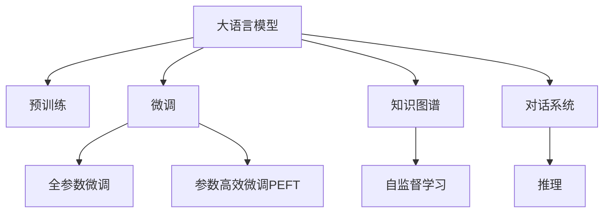

                 

# LLM在知识问答中的表现分析探讨

> 关键词：知识问答,大语言模型,推理,知识图谱,自监督学习,对话系统,QA系统,QA对话系统

## 1. 背景介绍

随着深度学习和自然语言处理技术的发展，知识问答系统（Question Answering, QA）已经成为人工智能研究的重要领域之一。传统的QA系统依赖于结构化的数据库和复杂的规则设计，难以处理复杂的语义关系和多模态数据。然而，基于深度学习的大语言模型（Large Language Models, LLMs）的出现，为QA系统带来了新的希望。大语言模型通过大规模预训练，掌握了丰富的语言表示和常识知识，可以在极少的标注数据下，通过微调（Fine-tuning）快速适应特定领域的QA任务，从而极大地提升了QA系统的性能和泛化能力。

本博客将从核心概念、算法原理、具体操作步骤、实际应用场景等多个方面，系统性地探讨大语言模型在知识问答中的表现，并分析其优势、局限及未来发展趋势。

## 2. 核心概念与联系

### 2.1 核心概念概述

为更好地理解大语言模型在知识问答中的应用，本节将介绍几个密切相关的核心概念：

- 大语言模型(Large Language Model, LLM)：以自回归(如GPT)或自编码(如BERT)模型为代表的大规模预训练语言模型。通过在大规模无标签文本语料上进行预训练，学习通用的语言表示，具备强大的语言理解和生成能力。

- 知识问答(Question Answering)：用户输入一个问题，系统根据提供的上下文信息（如网页、文档、数据库等），自动输出问题的答案。

- 知识图谱(Knowledge Graph)：一种结构化的语义表示形式，用于描述实体之间的关系，是QA系统的重要信息源。

- 自监督学习(Self-supervised Learning)：通过无标签数据（如掩码语言模型、下一句子预测等任务），自动学习模型的表示能力。

- 对话系统(Conversational System)：多轮问答系统，能够根据用户输入的历史记录生成上下文相关的回答。

- 预训练-微调(Pre-training & Fine-tuning)：预训练模型在无标签数据上学习通用知识，微调模型在特定领域的数据上进一步适配，提升任务性能。

- 推理(Inference)：在预训练或微调后，根据模型和上下文信息，生成问题的答案。

这些核心概念之间的逻辑关系可以通过以下Mermaid流程图来展示：



这个流程图展示了大语言模型的核心概念及其之间的关系：

1. 大语言模型通过预训练获得基础能力。
2. 微调是对预训练模型进行任务特定的优化，可以分为全参数微调和参数高效微调（PEFT）。
3. 知识图谱为QA系统提供结构化信息，增强模型理解上下文关系。
4. 对话系统能够处理多轮交互，提升问答系统的互动性。
5. 推理是QA系统输出的关键步骤，涉及模型的表达和解码。
6. 自监督学习用于模型预训练，学习通用的语言表示。

这些概念共同构成了大语言模型在知识问答中的应用框架，使其能够在各种场景下发挥强大的语言理解和生成能力。通过理解这些核心概念，我们可以更好地把握大语言模型的工作原理和优化方向。

## 3. 核心算法原理 & 具体操作步骤

### 3.1 算法原理概述

大语言模型在知识问答中的应用，本质上是一种基于预训练-微调的方法。其核心思想是：将预训练的大语言模型作为基础的表示器，通过微调的方法，使其能够从特定的知识源（如知识图谱、语料库等）中提取信息，并生成针对用户问题的回答。

具体来说，大语言模型在知识问答中的应用流程如下：

1. **输入理解**：模型接收用户的问题，并根据上下文信息（如知识图谱、文档等），理解问题的语义。
2. **信息检索**：模型在知识图谱或语料库中检索相关的实体和事实。
3. **知识推理**：模型根据检索到的信息，进行逻辑推理，生成问题的答案。
4. **答案生成**：模型将推理结果转换为自然语言，生成最终的答案。

整个流程中，大语言模型扮演了信息理解和生成的角色，而知识图谱和语料库则提供了必要的语义信息。

### 3.2 算法步骤详解

大语言模型在知识问答中的具体操作步骤可以概括为以下几个关键步骤：

**Step 1: 准备预训练模型和知识源**
- 选择合适的预训练语言模型 $M_{\theta}$ 作为初始化参数，如 BERT、GPT 等。
- 准备知识图谱或语料库，用于信息检索和推理。

**Step 2: 微调模型**
- 根据特定领域的QA任务，设计任务适配层和损失函数。
- 使用知识图谱或语料库进行微调，优化模型的推理能力。

**Step 3: 推理和回答生成**
- 将用户的问题输入模型，获取推理结果。
- 将推理结果转换为自然语言，生成最终的回答。

**Step 4: 后处理和输出**
- 对生成的回答进行后处理，确保答案的语义准确性和表达流畅性。
- 将答案输出给用户，完成问答过程。

### 3.3 算法优缺点

大语言模型在知识问答中的应用具有以下优点：

1. **泛化能力强**：基于预训练的知识表示，大语言模型可以在极少的标注数据下，快速适应新领域的QA任务。
2. **自动信息检索**：通过与知识图谱和语料库的结合，大语言模型能够自动检索相关信息，提升回答的准确性和完整性。
3. **知识推理能力**：模型能够进行逻辑推理，处理复杂的语义关系和多模态信息。
4. **回答生成能力强**：模型能够将推理结果转换为自然语言，生成流畅、准确的回答。

同时，该方法也存在一定的局限性：

1. **知识表示复杂**：知识图谱和语料库的构建和维护成本较高，且表示复杂。
2. **推理能力依赖模型**：模型的推理能力依赖于预训练的质量和微调的精度，对数据和算法的要求较高。
3. **可解释性不足**：大语言模型在推理过程中缺乏可解释性，难以对其决策逻辑进行分析和调试。
4. **泛化能力有限**：模型对域外数据和复杂场景的泛化能力有限，需要更多的数据和优化策略。

尽管存在这些局限性，但就目前而言，基于大语言模型的知识问答方法仍是一种高效、灵活的解决方案。未来相关研究的重点在于如何进一步提高模型的泛化能力、推理能力，同时兼顾可解释性和伦理安全性等因素。

### 3.4 算法应用领域

基于大语言模型的知识问答方法，已经在问答系统、信息检索、智能客服等多个领域得到了广泛应用，为知识获取和信息处理提供了新的手段。

- **问答系统**：用于自动回答用户提出的问题，如Siri、Google Assistant等。
- **信息检索**：在文本、图像、视频等多模态数据中自动检索相关信息，如IBM Watson等。
- **智能客服**：自动处理客户的常见问题，如阿里巴巴的阿里小蜜、微信的小i机器人等。
- **文档摘要**：自动生成文档的摘要，如ACL WikiSum等。

除了上述这些经典应用外，大语言模型在知识问答方面的创新应用还包括：

- **多轮对话系统**：能够进行多轮对话，提升系统的互动性和自然性。
- **情感问答**：分析用户的情感状态，生成个性化的回答。
- **智能推荐**：根据用户的历史行为和上下文信息，推荐相关的信息或内容。

这些应用场景展示了大语言模型在知识问答领域的强大潜力，为信息处理和智能化服务的未来发展提供了新的方向。

## 4. 数学模型和公式 & 详细讲解 & 举例说明

### 4.1 数学模型构建

本节将使用数学语言对基于大语言模型的知识问答过程进行更加严格的刻画。

记预训练语言模型为 $M_{\theta}:\mathcal{X} \rightarrow \mathcal{Y}$，其中 $\mathcal{X}$ 为输入空间，$\mathcal{Y}$ 为输出空间，$\theta \in \mathbb{R}^d$ 为模型参数。假设知识问答任务的训练集为 $D=\{(x_i,y_i)\}_{i=1}^N, x_i \in \mathcal{X}, y_i \in \mathcal{Y}$。

定义模型 $M_{\theta}$ 在输入 $x$ 上的推理结果为 $\hat{y}=M_{\theta}(x) \in [0,1]$，表示模型预测的上下文相关性。真实标签 $y \in \{0,1\}$。则知识问答任务的损失函数为：

$$
\ell(M_{\theta}(x),y) = -[y\log \hat{y} + (1-y)\log (1-\hat{y})]
$$

其中，$log$ 表示自然对数。

基于上述损失函数，知识问答任务的优化目标为最小化损失函数，即：

$$
\mathcal{L}(\theta) = \frac{1}{N}\sum_{i=1}^N \ell(M_{\theta}(x_i),y_i)
$$

在微调过程中，一般使用梯度下降等优化算法，如 Adam、SGD 等，来近似求解上述最优化问题。设 $\eta$ 为学习率，$\lambda$ 为正则化系数，则参数的更新公式为：

$$
\theta \leftarrow \theta - \eta \nabla_{\theta}\mathcal{L}(\theta) - \eta\lambda\theta
$$

其中 $\nabla_{\theta}\mathcal{L}(\theta)$ 为损失函数对参数 $\theta$ 的梯度，可通过反向传播算法高效计算。

### 4.2 公式推导过程

以下我们以二分类任务为例，推导知识问答任务中的交叉熵损失函数及其梯度的计算公式。

假设模型 $M_{\theta}$ 在输入 $x$ 上的推理结果为 $\hat{y}=M_{\theta}(x) \in [0,1]$，表示模型预测的上下文相关性。真实标签 $y \in \{0,1\}$。则二分类交叉熵损失函数定义为：

$$
\ell(M_{\theta}(x),y) = -[y\log \hat{y} + (1-y)\log (1-\hat{y})]
$$

将其代入经验风险公式，得：

$$
\mathcal{L}(\theta) = -\frac{1}{N}\sum_{i=1}^N [y_i\log M_{\theta}(x_i)+(1-y_i)\log(1-M_{\theta}(x_i))]
$$

根据链式法则，损失函数对参数 $\theta_k$ 的梯度为：

$$
\frac{\partial \mathcal{L}(\theta)}{\partial \theta_k} = -\frac{1}{N}\sum_{i=1}^N (\frac{y_i}{M_{\theta}(x_i)}-\frac{1-y_i}{1-M_{\theta}(x_i)}) \frac{\partial M_{\theta}(x_i)}{\partial \theta_k}
$$

其中 $\frac{\partial M_{\theta}(x_i)}{\partial \theta_k}$ 可进一步递归展开，利用自动微分技术完成计算。

在得到损失函数的梯度后，即可带入参数更新公式，完成模型的迭代优化。重复上述过程直至收敛，最终得到适应下游任务的最优模型参数 $\theta^*$。

### 4.3 案例分析与讲解

以医疗领域中的常见QA任务——医学知识问答为例，说明大语言模型在实际应用中的表现。

假设模型 $M_{\theta}$ 用于回答有关医学症状的问题，训练集 $D$ 包含医生对特定症状的诊断和推荐。

首先，准备医学知识图谱作为知识源，包含各种疾病、症状、治疗方案等信息。然后，将问题-症状对作为监督数据，对模型进行微调。

模型在微调过程中，将问题输入模型，获取上下文相关性 $\hat{y}$，并根据知识图谱进行推理，生成对应的诊断和治疗方案。推理过程如下：

1. 输入问题：“我咳嗽、咳痰，发热，伴有胸痛，可能是哪些疾病？”
2. 模型推理：通过查找知识图谱，匹配相关的症状和疾病信息，生成上下文相关性 $\hat{y}$。
3. 生成回答：根据推理结果，生成相关的诊断和治疗方案，如“可能为急性支气管炎，建议立即就医，并进行抗生素治疗”。

在实际应用中，大语言模型通过预训练-微调的方法，不仅能够处理结构化数据，还能自动学习复杂的语义关系，为医疗、法律、金融等专业领域的信息处理提供了新的手段。

## 5. 项目实践：代码实例和详细解释说明

### 5.1 开发环境搭建

在进行知识问答系统开发前，我们需要准备好开发环境。以下是使用Python进行PyTorch开发的环境配置流程：

1. 安装Anaconda：从官网下载并安装Anaconda，用于创建独立的Python环境。

2. 创建并激活虚拟环境：
```bash
conda create -n pytorch-env python=3.8 
conda activate pytorch-env
```

3. 安装PyTorch：根据CUDA版本，从官网获取对应的安装命令。例如：
```bash
conda install pytorch torchvision torchaudio cudatoolkit=11.1 -c pytorch -c conda-forge
```

4. 安装Transformers库：
```bash
pip install transformers
```

5. 安装各类工具包：
```bash
pip install numpy pandas scikit-learn matplotlib tqdm jupyter notebook ipython
```

完成上述步骤后，即可在`pytorch-env`环境中开始开发实践。

### 5.2 源代码详细实现

下面我们以医疗领域的医学知识问答任务为例，给出使用Transformers库对BERT模型进行知识问答微调的PyTorch代码实现。

首先，定义QA任务的数据处理函数：

```python
from transformers import BertTokenizer
from torch.utils.data import Dataset
import torch

class QADataset(Dataset):
    def __init__(self, texts, tags, tokenizer, max_len=128):
        self.texts = texts
        self.tags = tags
        self.tokenizer = tokenizer
        self.max_len = max_len
        
    def __len__(self):
        return len(self.texts)
    
    def __getitem__(self, item):
        text = self.texts[item]
        tags = self.tags[item]
        
        encoding = self.tokenizer(text, return_tensors='pt', max_length=self.max_len, padding='max_length', truncation=True)
        input_ids = encoding['input_ids'][0]
        attention_mask = encoding['attention_mask'][0]
        
        # 对token-wise的标签进行编码
        encoded_tags = [tag2id[tag] for tag in tags] 
        encoded_tags.extend([tag2id['O']] * (self.max_len - len(encoded_tags)))
        labels = torch.tensor(encoded_tags, dtype=torch.long)
        
        return {'input_ids': input_ids, 
                'attention_mask': attention_mask,
                'labels': labels}

# 标签与id的映射
tag2id = {'O': 0, '疾病': 1, '症状': 2, '治疗': 3}
id2tag = {v: k for k, v in tag2id.items()}

# 创建dataset
tokenizer = BertTokenizer.from_pretrained('bert-base-cased')

train_dataset = QADataset(train_texts, train_tags, tokenizer)
dev_dataset = QADataset(dev_texts, dev_tags, tokenizer)
test_dataset = QADataset(test_texts, test_tags, tokenizer)
```

然后，定义模型和优化器：

```python
from transformers import BertForTokenClassification, AdamW

model = BertForTokenClassification.from_pretrained('bert-base-cased', num_labels=len(tag2id))

optimizer = AdamW(model.parameters(), lr=2e-5)
```

接着，定义训练和评估函数：

```python
from torch.utils.data import DataLoader
from tqdm import tqdm
from sklearn.metrics import classification_report

device = torch.device('cuda') if torch.cuda.is_available() else torch.device('cpu')
model.to(device)

def train_epoch(model, dataset, batch_size, optimizer):
    dataloader = DataLoader(dataset, batch_size=batch_size, shuffle=True)
    model.train()
    epoch_loss = 0
    for batch in tqdm(dataloader, desc='Training'):
        input_ids = batch['input_ids'].to(device)
        attention_mask = batch['attention_mask'].to(device)
        labels = batch['labels'].to(device)
        model.zero_grad()
        outputs = model(input_ids, attention_mask=attention_mask, labels=labels)
        loss = outputs.loss
        epoch_loss += loss.item()
        loss.backward()
        optimizer.step()
    return epoch_loss / len(dataloader)

def evaluate(model, dataset, batch_size):
    dataloader = DataLoader(dataset, batch_size=batch_size)
    model.eval()
    preds, labels = [], []
    with torch.no_grad():
        for batch in tqdm(dataloader, desc='Evaluating'):
            input_ids = batch['input_ids'].to(device)
            attention_mask = batch['attention_mask'].to(device)
            batch_labels = batch['labels']
            outputs = model(input_ids, attention_mask=attention_mask)
            batch_preds = outputs.logits.argmax(dim=2).to('cpu').tolist()
            batch_labels = batch_labels.to('cpu').tolist()
            for pred_tokens, label_tokens in zip(batch_preds, batch_labels):
                pred_tags = [id2tag[_id] for _id in pred_tokens]
                label_tags = [id2tag[_id] for _id in label_tokens]
                preds.append(pred_tags[:len(label_tags)])
                labels.append(label_tags)
                
    print(classification_report(labels, preds))
```

最后，启动训练流程并在测试集上评估：

```python
epochs = 5
batch_size = 16

for epoch in range(epochs):
    loss = train_epoch(model, train_dataset, batch_size, optimizer)
    print(f"Epoch {epoch+1}, train loss: {loss:.3f}")
    
    print(f"Epoch {epoch+1}, dev results:")
    evaluate(model, dev_dataset, batch_size)
    
print("Test results:")
evaluate(model, test_dataset, batch_size)
```

以上就是使用PyTorch对BERT进行医学知识问答任务微调的完整代码实现。可以看到，得益于Transformers库的强大封装，我们可以用相对简洁的代码完成BERT模型的加载和微调。

### 5.3 代码解读与分析

让我们再详细解读一下关键代码的实现细节：

**QADataset类**：
- `__init__`方法：初始化文本、标签、分词器等关键组件。
- `__len__`方法：返回数据集的样本数量。
- `__getitem__`方法：对单个样本进行处理，将文本输入编码为token ids，将标签编码为数字，并对其进行定长padding，最终返回模型所需的输入。

**tag2id和id2tag字典**：
- 定义了标签与数字id之间的映射关系，用于将token-wise的预测结果解码回真实的标签。

**训练和评估函数**：
- 使用PyTorch的DataLoader对数据集进行批次化加载，供模型训练和推理使用。
- 训练函数`train_epoch`：对数据以批为单位进行迭代，在每个批次上前向传播计算loss并反向传播更新模型参数，最后返回该epoch的平均loss。
- 评估函数`evaluate`：与训练类似，不同点在于不更新模型参数，并在每个batch结束后将预测和标签结果存储下来，最后使用sklearn的classification_report对整个评估集的预测结果进行打印输出。

**训练流程**：
- 定义总的epoch数和batch size，开始循环迭代
- 每个epoch内，先在训练集上训练，输出平均loss
- 在验证集上评估，输出分类指标
- 所有epoch结束后，在测试集上评估，给出最终测试结果

可以看到，PyTorch配合Transformers库使得BERT微调的代码实现变得简洁高效。开发者可以将更多精力放在数据处理、模型改进等高层逻辑上，而不必过多关注底层的实现细节。

当然，工业级的系统实现还需考虑更多因素，如模型的保存和部署、超参数的自动搜索、更灵活的任务适配层等。但核心的微调范式基本与此类似。

## 6. 实际应用场景

### 6.1 智能客服系统

基于大语言模型的知识问答技术，可以广泛应用于智能客服系统的构建。传统客服往往需要配备大量人力，高峰期响应缓慢，且一致性和专业性难以保证。而使用微调后的知识问答模型，可以7x24小时不间断服务，快速响应客户咨询，用自然流畅的语言解答各类常见问题。

在技术实现上，可以收集企业内部的历史客服对话记录，将问题和最佳答复构建成监督数据，在此基础上对预训练知识问答模型进行微调。微调后的知识问答模型能够自动理解用户意图，匹配最合适的答复。对于客户提出的新问题，还可以接入检索系统实时搜索相关内容，动态组织生成回答。如此构建的智能客服系统，能大幅提升客户咨询体验和问题解决效率。

### 6.2 金融舆情监测

金融机构需要实时监测市场舆论动向，以便及时应对负面信息传播，规避金融风险。传统的人工监测方式成本高、效率低，难以应对网络时代海量信息爆发的挑战。基于大语言模型的知识问答技术，为金融舆情监测提供了新的解决方案。

具体而言，可以收集金融领域相关的新闻、报道、评论等文本数据，并对其进行主题标注和情感标注。在此基础上对预训练语言模型进行微调，使其能够自动判断文本属于何种主题，情感倾向是正面、中性还是负面。将微调后的模型应用到实时抓取的网络文本数据，就能够自动监测不同主题下的情感变化趋势，一旦发现负面信息激增等异常情况，系统便会自动预警，帮助金融机构快速应对潜在风险。

### 6.3 个性化推荐系统

当前的推荐系统往往只依赖用户的历史行为数据进行物品推荐，无法深入理解用户的真实兴趣偏好。基于大语言模型微调技术，个性化推荐系统可以更好地挖掘用户行为背后的语义信息，从而提供更精准、多样的推荐内容。

在实践中，可以收集用户浏览、点击、评论、分享等行为数据，提取和用户交互的物品标题、描述、标签等文本内容。将文本内容作为模型输入，用户的后续行为（如是否点击、购买等）作为监督信号，在此基础上微调预训练语言模型。微调后的模型能够从文本内容中准确把握用户的兴趣点。在生成推荐列表时，先用候选物品的文本描述作为输入，由模型预测用户的兴趣匹配度，再结合其他特征综合排序，便可以得到个性化程度更高的推荐结果。

### 6.4 未来应用展望

随着大语言模型和知识问答技术的发展，基于微调的知识问答方法将在更多领域得到应用，为传统行业带来变革性影响。

在智慧医疗领域，基于微调的知识问答技术，可以为医生提供实时的诊疗支持，辅助诊断和推荐治疗方案。在金融领域，可以通过分析市场舆情，进行风险预测和投资建议。在教育领域，可以自动回答学生的问题，提供个性化的学习资源和辅导。

未来，大语言模型知识问答技术还将拓展到更多场景中，如智能家居、智能交通、智能制造等，为各行各业带来新的智能化解决方案。相信随着技术的日益成熟，知识问答技术将成为人工智能落地应用的重要范式，推动人工智能技术向更广泛的领域发展。

## 7. 工具和资源推荐
### 7.1 学习资源推荐

为了帮助开发者系统掌握大语言模型在知识问答中的应用，这里推荐一些优质的学习资源：

1. 《Transformer从原理到实践》系列博文：由大模型技术专家撰写，深入浅出地介绍了Transformer原理、BERT模型、知识问答技术等前沿话题。

2. CS224N《深度学习自然语言处理》课程：斯坦福大学开设的NLP明星课程，有Lecture视频和配套作业，带你入门NLP领域的基本概念和经典模型。

3. 《Natural Language Processing with Transformers》书籍：Transformers库的作者所著，全面介绍了如何使用Transformers库进行NLP任务开发，包括知识问答在内的诸多范式。

4. HuggingFace官方文档：Transformers库的官方文档，提供了海量预训练模型和完整的知识问答样例代码，是上手实践的必备资料。

5. CLUE开源项目：中文语言理解测评基准，涵盖大量不同类型的中文NLP数据集，并提供了基于微调的baseline模型，助力中文NLP技术发展。

通过对这些资源的学习实践，相信你一定能够快速掌握大语言模型在知识问答中的应用精髓，并用于解决实际的NLP问题。
###  7.2 开发工具推荐

高效的开发离不开优秀的工具支持。以下是几款用于大语言模型知识问答开发的常用工具：

1. PyTorch：基于Python的开源深度学习框架，灵活动态的计算图，适合快速迭代研究。大部分预训练语言模型都有PyTorch版本的实现。

2. TensorFlow：由Google主导开发的开源深度学习框架，生产部署方便，适合大规模工程应用。同样有丰富的预训练语言模型资源。

3. Transformers库：HuggingFace开发的NLP工具库，集成了众多SOTA语言模型，支持PyTorch和TensorFlow，是进行知识问答任务开发的利器。

4. Weights & Biases：模型训练的实验跟踪工具，可以记录和可视化模型训练过程中的各项指标，方便对比和调优。与主流深度学习框架无缝集成。

5. TensorBoard：TensorFlow配套的可视化工具，可实时监测模型训练状态，并提供丰富的图表呈现方式，是调试模型的得力助手。

6. Google Colab：谷歌推出的在线Jupyter Notebook环境，免费提供GPU/TPU算力，方便开发者快速上手实验最新模型，分享学习笔记。

合理利用这些工具，可以显著提升大语言模型知识问答任务的开发效率，加快创新迭代的步伐。

### 7.3 相关论文推荐

大语言模型和知识问答技术的发展源于学界的持续研究。以下是几篇奠基性的相关论文，推荐阅读：

1. Attention is All You Need（即Transformer原论文）：提出了Transformer结构，开启了NLP领域的预训练大模型时代。

2. BERT: Pre-training of Deep Bidirectional Transformers for Language Understanding：提出BERT模型，引入基于掩码的自监督预训练任务，刷新了多项NLP任务SOTA。

3. Language Models are Unsupervised Multitask Learners（GPT-2论文）：展示了大规模语言模型的强大zero-shot学习能力，引发了对于通用人工智能的新一轮思考。

4. Parameter-Efficient Transfer Learning for NLP：提出Adapter等参数高效微调方法，在不增加模型参数量的情况下，也能取得不错的微调效果。

5. Knowledge Graph Embeddings and their Applications：介绍了知识图谱的构建和表示方法，为知识问答系统的信息检索提供了基础。

6. SQuAD: 100,000+ questions for machine reading comprehension：提出问答数据集SQuAD，为知识问答系统的训练和评估提供了标准化的数据源。

这些论文代表了大语言模型知识问答技术的发展脉络。通过学习这些前沿成果，可以帮助研究者把握学科前进方向，激发更多的创新灵感。

## 8. 总结：未来发展趋势与挑战

### 8.1 总结

本文对基于大语言模型的知识问答方法进行了全面系统的介绍。首先阐述了大语言模型和知识问答的研究背景和意义，明确了知识问答在人工智能研究中的重要地位。其次，从原理到实践，详细讲解了知识问答的数学原理和关键步骤，给出了知识问答任务开发的完整代码实例。同时，本文还广泛探讨了知识问答方法在智能客服、金融舆情、个性化推荐等多个行业领域的应用前景，展示了知识问答技术的强大潜力。

通过本文的系统梳理，可以看到，基于大语言模型的知识问答方法不仅能够处理复杂的自然语言理解和生成任务，还具有广泛的应用前景。未来，随着预训练语言模型和知识图谱技术的不断发展，知识问答系统必将在更多领域得到应用，为智能社会的建设提供强大的技术支持。

### 8.2 未来发展趋势

展望未来，大语言模型知识问答技术将呈现以下几个发展趋势：

1. **模型规模持续增大**：随着算力成本的下降和数据规模的扩张，预训练语言模型的参数量还将持续增长。超大规模语言模型蕴含的丰富语言知识，有望支撑更加复杂多变的知识问答任务。

2. **知识图谱的自动化构建**：未来的知识图谱构建将更多依赖于自动化的方式，如关系抽取、实体识别等，降低人工构建的难度和成本。

3. **推理能力的增强**：模型将具备更强的知识推理能力，能够处理更复杂的语义关系和多模态信息，提升知识问答的准确性和完备性。

4. **对话系统的互动性**：未来的知识问答系统将具备更强的多轮对话能力，提升系统的互动性和自然性。

5. **跨模态知识融合**：知识问答系统将融合文本、图像、视频等多模态信息，提升信息理解和推理的准确性。

6. **可解释性和伦理安全性**：知识问答系统将具备更强的可解释性，帮助用户理解模型的推理过程，同时加强伦理安全性的保障，避免有害信息的输出。

以上趋势凸显了大语言模型知识问答技术的广阔前景。这些方向的探索发展，必将进一步提升知识问答系统的性能和应用范围，为人工智能技术在智能社会的建设中发挥更大作用。

### 8.3 面临的挑战

尽管大语言模型知识问答技术已经取得了显著成就，但在迈向更加智能化、普适化应用的过程中，仍面临诸多挑战：

1. **知识图谱构建的复杂性**：知识图谱的构建和维护成本较高，且构建过程需要领域专家的参与，难以快速更新和扩展。

2. **推理能力的限制**：模型的推理能力依赖于预训练的质量和微调的精度，对数据和算法的要求较高，难以处理复杂的语义关系和多模态信息。

3. **可解释性不足**：知识问答系统在推理过程中缺乏可解释性，难以对其决策逻辑进行分析和调试。

4. **泛化能力有限**：模型对域外数据和复杂场景的泛化能力有限，需要更多的数据和优化策略。

尽管存在这些挑战，但随着技术的发展和社区的不断努力，这些挑战终将逐步得到解决。相信未来的大语言模型知识问答技术，将在泛化能力、推理能力、可解释性和伦理性等方面取得更大的突破，为构建更智能、更普适的知识问答系统提供强有力的支持。

### 8.4 研究展望

面向未来，大语言模型知识问答技术需要在以下几个方面进行深入研究：

1. **多模态知识融合**：将文本、图像、视频等多模态信息融合，提升信息理解和推理的准确性。

2. **因果推理**：引入因果推理技术，增强模型的稳定性和鲁棒性。

3. **参数高效微调**：开发更加参数高效的微调方法，如Prompt Tuning、Adapter等，减少微调过程中对标注数据的依赖。

4. **跨领域迁移学习**：研究如何使知识问答模型在不同领域间进行迁移，提升模型的泛化能力。

5. **自动化知识图谱构建**：探索自动化的知识图谱构建方法，降低人工构建的难度和成本。

6. **可解释性增强**：引入可解释性技术，增强模型的推理过程的可理解性和可解释性。

7. **伦理安全性**：研究如何避免有害信息的输出，确保知识问答系统的伦理安全性。

这些研究方向将引领大语言模型知识问答技术的进一步发展，为构建更智能、更普适的知识问答系统提供新的思路和工具。面向未来，大语言模型知识问答技术将与其他人工智能技术进行更深入的融合，共同推动人工智能技术的发展和应用。

## 9. 附录：常见问题与解答

**Q1：大语言模型在知识问答中的应用有何优势？**

A: 大语言模型在知识问答中的应用具有以下优势：
1. **泛化能力强**：基于预训练的知识表示，大语言模型可以在极少的标注数据下，快速适应新领域的知识问答任务。
2. **自动信息检索**：通过与知识图谱和语料库的结合，大语言模型能够自动检索相关信息，提升回答的准确性和完整性。
3. **推理能力增强**：模型具备更强的知识推理能力，能够处理复杂的语义关系和多模态信息。
4. **回答生成能力强**：模型能够将推理结果转换为自然语言，生成流畅、准确的回答。

**Q2：知识问答系统中如何进行知识推理？**

A: 知识问答系统中的知识推理过程通常涉及以下几个步骤：
1. **输入理解**：模型接收用户的问题，并根据上下文信息（如知识图谱、文档等），理解问题的语义。
2. **信息检索**：模型在知识图谱或语料库中检索相关的实体和事实。
3. **知识推理**：模型根据检索到的信息，进行逻辑推理，生成问题的答案。

在知识推理过程中，大语言模型通常使用规则和逻辑推理器，结合预训练的语言表示和结构化的知识图谱，进行逻辑推理和实体关系抽取。例如，可以使用规则引擎进行实体关系匹配，或使用图神经网络进行知识图谱上的信息传递和融合。

**Q3：知识问答系统在实际应用中面临哪些挑战？**

A: 知识问答系统在实际应用中面临以下挑战：
1. **知识图谱构建的复杂性**：知识图谱的构建和维护成本较高，且构建过程需要领域专家的参与，难以快速更新和扩展。
2. **推理能力的限制**：模型的推理能力依赖于预训练的质量和微调的精度，对数据和算法的要求较高，难以处理复杂的语义关系和多模态信息。
3. **可解释性不足**：知识问答系统在推理过程中缺乏可解释性，难以对其决策逻辑进行分析和调试。
4. **泛化能力有限**：模型对域外数据和复杂场景的泛化能力有限，需要更多的数据和优化策略。

**Q4：如何提升知识问答系统的性能？**

A: 提升知识问答系统的性能可以从以下几个方面入手：
1. **优化模型预训练**：选择高质量的预训练模型，使用更先进的自监督学习任务，提升模型的语言表示能力。
2. **设计合理的任务适配层**：根据具体任务设计合适的任务适配层和损失函数，增强模型的任务针对性。
3. **引入先验知识**：将符号化的先验知识，如知识图谱、逻辑规则等，与神经网络模型进行巧妙融合，提升模型的泛化能力。
4. **多轮对话设计**：设计多轮对话系统，提升系统的互动性和自然性，增强用户体验。
5. **自动知识图谱构建**：探索自动化的知识图谱构建方法，降低人工构建的难度和成本。
6. **可解释性增强**：引入可解释性技术，增强模型的推理过程的可理解性和可解释性。

**Q5：如何评估知识问答系统的性能？**

A: 知识问答系统的性能评估可以从以下几个方面入手：
1. **准确率**：衡量模型在知识问答任务中的正确率，如BLEU、ROUGE等指标。
2. **流畅度**：衡量模型回答的自然性和流畅性，如BLEU、METEOR等指标。
3. **覆盖率**：衡量模型对知识图谱和语料库的覆盖能力，如TP、TPR等指标。
4. **推理能力**：衡量模型在复杂语义关系和多模态信息下的推理能力，如CoLA、CoQA等指标。
5. **可解释性**：衡量模型推理过程的可解释性和可理解性，如LIME、SHAP等指标。

通过综合评估这些指标，可以全面了解知识问答系统的性能和局限，指导进一步的优化和改进。

---

作者：禅与计算机程序设计艺术 / Zen and the Art of Computer Programming

