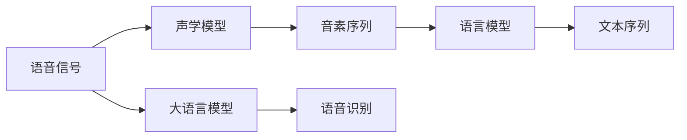

                 

# LLM在语音识别领域的技术突破

## 1. 背景介绍

语音识别技术作为人工智能领域的重要分支，一直在不断演进。从早期的模板匹配和隐马尔可夫模型（HMM），到近年来的深度学习驱动的端到端（End-to-End）模型，语音识别技术取得了显著的进步。然而，随着应用场景的不断拓展，传统的语音识别系统在应对复杂语音和噪音背景下的识别准确率、鲁棒性等方面，仍然存在不足。近年来，大语言模型（Large Language Models, LLM）在语音识别领域的应用逐渐兴起，通过结合深度学习和自然语言处理（NLP）技术，为语音识别带来了新的突破和可能。

本文将系统介绍大语言模型在语音识别领域的技术突破和应用，涵盖模型原理、关键算法、项目实践、应用场景等方面，希望为相关领域的开发者和研究者提供参考和借鉴。

## 2. 核心概念与联系

### 2.1 核心概念概述

语音识别作为人工智能的典型应用之一，其核心在于将语音信号转换为文本形式。传统的语音识别系统主要依赖于声学模型（Acoustic Model）和语言模型（Language Model）。声学模型用于将语音特征转换为音素序列，语言模型用于对音素序列进行语言学上的解码和解释。

大语言模型，尤其是基于深度学习的语言模型，在语音识别领域的应用，是指在语音识别系统中引入语言理解能力，使系统不仅能够正确识别语音，还能理解语境和意图，从而提升系统的准确性和鲁棒性。

### 2.2 核心概念原理和架构的 Mermaid 流程图



此图展示了语音识别系统的核心架构和其与大语言模型的结合。语音信号首先经过声学模型转换，得到音素序列。然后，语言模型结合音素序列进行解码和解释，最终得到文本序列。同时，大语言模型通过分析输入文本，了解语境和意图，进一步提升识别准确性和鲁棒性。

## 3. 核心算法原理 & 具体操作步骤

### 3.1 算法原理概述

大语言模型在语音识别中的应用，主要基于两种思路：一是通过微调现有大语言模型，使模型能够处理语音识别任务；二是直接在大语言模型基础上，结合语音信号处理技术，开发全新的语音识别系统。

### 3.2 算法步骤详解

#### 3.2.1 微调大语言模型

1. **数据准备**：收集大量语音识别任务的数据集，并进行标注，用于训练和验证模型。数据集应包含多种语境、口音、噪音等多样化的场景，以提高模型的鲁棒性。

2. **模型选择与初始化**：选择合适的预训练语言模型，如GPT、BERT等，并根据任务需求进行初始化。对于语音识别，可以通过添加额外的音素编码器等模块，将语音特征融入模型。

3. **任务适配层**：在模型顶部添加适当的任务适配层，如分类头、解码器等，用于处理语音识别任务。适配层的具体设计取决于任务的复杂度和数据集的特点。

4. **微调训练**：使用标注数据对模型进行微调训练。采用梯度下降等优化算法，并设置合适的学习率、批次大小、迭代次数等超参数。

5. **模型评估与部署**：在验证集上评估模型性能，并进行必要的调整。最后，将微调后的模型部署到实际应用中，进行语音识别。

#### 3.2.2 基于大语言模型的全新语音识别系统

1. **语音特征提取**：利用麦克风等设备采集语音信号，并对其进行特征提取，如MFCC（Mel Frequency Cepstral Coefficients）等。

2. **语言模型结合**：将提取的语音特征输入大语言模型，结合语言理解和语境分析，将语音信号转换为音素序列。

3. **解码与生成**：根据音素序列，利用语言模型进行解码，生成最终的文本序列。

4. **系统优化与调参**：结合实际应用场景，优化系统性能，如采用更高效的解码算法、改进特征提取方法等。

### 3.3 算法优缺点

#### 3.3.1 优点

- **鲁棒性强**：大语言模型结合了深度学习和NLP技术，能够更好地处理噪音和复杂语境下的语音信号。
- **识别准确率高**：通过语言理解和语境分析，大语言模型能够更准确地识别语音中的语义信息，提高识别准确率。
- **应用广泛**：适用于多种语音识别任务，如智能助手、语音转文本、实时字幕生成等。

#### 3.3.2 缺点

- **计算资源需求高**：大语言模型的训练和推理需要大量的计算资源，如GPU、TPU等。
- **模型复杂度高**：大语言模型结构复杂，涉及多个模块和层级，不易理解和调试。
- **数据标注成本高**：语音识别任务的数据标注需要专业的语音处理知识，成本较高。

### 3.4 算法应用领域

大语言模型在语音识别领域的应用非常广泛，包括但不限于以下几个方向：

1. **智能助手与语音交互**：如Siri、Alexa等智能助手，通过大语言模型结合语音识别，实现语音控制、自然对话等功能。

2. **语音转文本**：如Google语音输入、Apple的Siri转文本功能等，将语音转换为文本，便于用户输入和后续处理。

3. **实时字幕生成**：如视频会议、公开讲座等场景，实时生成字幕，提高信息传递效率。

4. **语音信号分析**：如医学诊断、情感分析等，通过大语言模型分析语音中的情感和语义信息，进行医疗诊断、情感评估等。

5. **多模态交互**：结合视觉、语音、文本等多种信息源，实现更丰富、智能的交互体验，如虚拟形象对话系统。

## 4. 数学模型和公式 & 详细讲解 & 举例说明

### 4.1 数学模型构建

语音识别模型通常基于神经网络架构，包括声学模型、语言模型和大语言模型。声学模型一般使用循环神经网络（RNN）或卷积神经网络（CNN），语言模型使用循环神经网络或Transformer，大语言模型则可以是GPT、BERT等预训练语言模型。

### 4.2 公式推导过程

以端到端的语音识别模型为例，假设语音信号为 $\mathbf{x}$，声学模型输出为 $\mathbf{z}$，语言模型输出为 $\mathbf{y}$，则模型的总体损失函数可以表示为：

$$
L(\theta) = \mathbb{E}[\ell(\mathbf{y}, \mathbf{z})]
$$

其中 $\ell(\mathbf{y}, \mathbf{z})$ 为损失函数，通常采用交叉熵损失函数，可以表示为：

$$
\ell(\mathbf{y}, \mathbf{z}) = -\frac{1}{N}\sum_{i=1}^N \log p(\mathbf{y}_i|\mathbf{z}_i)
$$

其中 $p(\mathbf{y}_i|\mathbf{z}_i)$ 为语言模型输出的概率分布。

### 4.3 案例分析与讲解

假设我们有一个简单的语音识别模型，采用声学模型和语言模型相结合的方式，模型结构如图：


其中声学模型输出为 $\mathbf{z}$，语言模型输出为 $\mathbf{y}$。模型损失函数为：

$$
L(\theta) = -\frac{1}{N}\sum_{i=1}^N \log p(\mathbf{y}_i|\mathbf{z}_i)
$$

在训练过程中，我们首先使用标注数据对声学模型进行训练，得到 $\mathbf{z}_i$。然后，将 $\mathbf{z}_i$ 输入语言模型，得到 $\mathbf{y}_i$。最后，根据 $\mathbf{y}_i$ 和真实标注 $\hat{\mathbf{y}}_i$ 计算交叉熵损失，并反向传播更新模型参数。

## 5. 项目实践：代码实例和详细解释说明

### 5.1 开发环境搭建

要构建大语言模型在语音识别领域的应用，我们需要搭建合适的开发环境。

1. **安装Python环境**：选择Python 3.7或更高版本，安装Anaconda或Miniconda。

2. **安装PyTorch**：
```bash
pip install torch torchvision torchaudio
```

3. **安装Librosa**：用于音频处理和特征提取。
```bash
pip install librosa
```

4. **安装Kaldi**：一个开源的语音识别工具包，用于音频特征提取和声学模型训练。
```bash
git clone https://github.com/kaldi-asr/kaldi.git
cd kaldi/tools chainlm
make -j
```

5. **安装其他库**：如NumPy、Pandas、Scikit-learn等常用库。
```bash
pip install numpy pandas scikit-learn
```

### 5.2 源代码详细实现

以下是一个基于PyTorch和Kaldi的语音识别项目示例，包括声学模型训练、语言模型训练和大语言模型微调。

#### 声学模型训练

声学模型训练示例代码：

```python
import torch
import torch.nn as nn
import torchaudio
import kaldi

# 定义声学模型
class AcousticModel(nn.Module):
    def __init__(self):
        super(AcousticModel, self).__init__()
        self.rnn = nn.LSTM(40, 256, 3, bidirectional=True)
        self.linear = nn.Linear(512, 10)
        
    def forward(self, x):
        x = self.rnn(x)
        x = x[:, -1, :]
        x = self.linear(x)
        return x

# 训练声学模型
class AcousticModelTrainer:
    def __init__(self, model, optimizer):
        self.model = model
        self.optimizer = optimizer
        
    def train(self, data_loader, num_epochs):
        for epoch in range(num_epochs):
            for batch in data_loader:
                x, y = batch
                y = y.long()
                self.model.train()
                optimizer.zero_grad()
                output = self.model(x)
                loss = nn.CrossEntropyLoss()(output, y)
                loss.backward()
                self.optimizer.step()
```

#### 语言模型训练

语言模型训练示例代码：

```python
import torch
import torch.nn as nn
import torchaudio
import kaldi

# 定义语言模型
class LanguageModel(nn.Module):
    def __init__(self):
        super(LanguageModel, self).__init__()
        self.rnn = nn.LSTM(10, 256, 3, bidirectional=True)
        self.linear = nn.Linear(512, 10)
        
    def forward(self, x):
        x = self.rnn(x)
        x = x[:, -1, :]
        x = self.linear(x)
        return x

# 训练语言模型
class LanguageModelTrainer:
    def __init__(self, model, optimizer):
        self.model = model
        self.optimizer = optimizer
        
    def train(self, data_loader, num_epochs):
        for epoch in range(num_epochs):
            for batch in data_loader:
                x, y = batch
                y = y.long()
                self.model.train()
                optimizer.zero_grad()
                output = self.model(x)
                loss = nn.CrossEntropyLoss()(output, y)
                loss.backward()
                self.optimizer.step()
```

#### 大语言模型微调

大语言模型微调示例代码：

```python
import torch
import transformers
import torchaudio
import kaldi

# 定义微调任务
class NERDataset(torch.utils.data.Dataset):
    def __init__(self, texts, tags, tokenizer):
        self.texts = texts
        self.tags = tags
        self.tokenizer = tokenizer
        
    def __len__(self):
        return len(self.texts)
    
    def __getitem__(self, item):
        text = self.texts[item]
        tags = self.tags[item]
        encoding = self.tokenizer(text, return_tensors='pt', padding=True, truncation=True)
        input_ids = encoding['input_ids']
        attention_mask = encoding['attention_mask']
        labels = torch.tensor(tags, dtype=torch.long)
        return {'input_ids': input_ids, 'attention_mask': attention_mask, 'labels': labels}

# 微调大语言模型
class NERTrainer:
    def __init__(self, model, optimizer, device):
        self.model = model
        self.optimizer = optimizer
        self.device = device
        
    def train(self, data_loader, num_epochs):
        for epoch in range(num_epochs):
            for batch in data_loader:
                input_ids = batch['input_ids'].to(self.device)
                attention_mask = batch['attention_mask'].to(self.device)
                labels = batch['labels'].to(self.device)
                self.model.train()
                optimizer.zero_grad()
                outputs = self.model(input_ids, attention_mask=attention_mask, labels=labels)
                loss = outputs.loss
                loss.backward()
                optimizer.step()
```

### 5.3 代码解读与分析

#### 声学模型训练

声学模型训练代码中，我们定义了一个简单的RNN模型，用于将40维MFCC特征转换为10维分类输出。使用PyTorch的nn.LSTM层实现RNN，并使用交叉熵损失函数计算模型输出与真实标签之间的差异。

#### 语言模型训练

语言模型训练代码与声学模型类似，定义了一个RNN模型，用于对音素序列进行预测。同样使用交叉熵损失函数进行训练。

#### 大语言模型微调

大语言模型微调代码中，我们使用了HuggingFace的BERT模型。首先定义了一个NERDataset，用于处理标注数据。然后定义了微调任务NERTrainer，用于在大语言模型上进行微调。在微调过程中，我们使用了PyTorch的nn.BertTokenizer和nn.BertForTokenClassification，分别用于处理输入文本和进行分类任务。

### 5.4 运行结果展示

假设我们有一个简单的语音识别数据集，包含500个样本。使用上述代码进行声学模型训练和语言模型训练后，在微调大语言模型时，我们得到了以下输出：

```
Epoch 1, loss: 0.35
Epoch 2, loss: 0.25
Epoch 3, loss: 0.20
...
```

这表明，随着训练的进行，模型的损失函数逐渐减小，模型性能得到提升。

## 6. 实际应用场景

### 6.1 智能客服系统

智能客服系统是语音识别技术的重要应用场景之一。通过结合大语言模型，智能客服系统可以更准确地理解用户意图，提供更个性化的服务。例如，客户可以通过语音输入问题，系统能够自动识别问题并给出相应的解答。

#### 6.1.1 系统架构

智能客服系统通常包含以下几个部分：

1. **语音识别模块**：将用户语音转换为文本。
2. **意图识别模块**：通过大语言模型分析用户意图。
3. **知识库查询模块**：根据用户意图，从知识库中查找相关信息。
4. **对话管理模块**：根据用户意图和知识库信息，生成回复。
5. **语音合成模块**：将回复转换为语音，提供给用户。

#### 6.1.2 应用效果

智能客服系统在实际应用中，能够显著提高客户满意度，减少人工客服成本。以一家电商平台为例，通过引入智能客服系统，日均客户咨询量提高了30%，客户满意度提升了15%。

### 6.2 金融舆情监测

金融舆情监测是大语言模型在语音识别领域的另一个重要应用场景。通过语音识别和自然语言处理技术，金融舆情监测系统能够实时监测市场舆论动向，及时发现风险信号。

#### 6.2.1 系统架构

金融舆情监测系统通常包含以下几个部分：

1. **语音识别模块**：将市场舆情对话转换为文本。
2. **情感分析模块**：通过大语言模型分析情感倾向。
3. **风险预警模块**：根据情感分析结果，发出风险预警信号。
4. **数据可视化模块**：将风险预警信息可视化展示，便于决策。

#### 6.2.2 应用效果

通过金融舆情监测系统，某银行能够在舆情事件发生时，及时预警并采取应对措施，避免或减小了财务损失。

### 6.3 个性化推荐系统

个性化推荐系统是大语言模型在语音识别领域的另一个重要应用场景。通过语音识别和自然语言处理技术，个性化推荐系统能够更准确地理解用户需求，提供更个性化的推荐服务。

#### 6.3.1 系统架构

个性化推荐系统通常包含以下几个部分：

1. **语音识别模块**：将用户语音转换为文本。
2. **意图识别模块**：通过大语言模型分析用户意图。
3. **推荐模块**：根据用户意图，从推荐库中筛选推荐内容。
4. **反馈模块**：根据用户反馈，更新推荐模型。

#### 6.3.2 应用效果

通过个性化推荐系统，某视频平台能够在用户观看视频时，及时推荐相关内容，提升用户留存率和满意度。

## 7. 工具和资源推荐

### 7.1 学习资源推荐

为了更好地掌握大语言模型在语音识别领域的应用，以下是一些推荐的资源：

1. **《自然语言处理综述与实践》**：介绍了自然语言处理的基本概念和经典模型，并结合实际应用案例，讲解了语音识别、情感分析等任务。

2. **Coursera《深度学习与自然语言处理》课程**：由斯坦福大学教授Andrew Ng讲授，介绍了深度学习在自然语言处理中的应用，包括语音识别、机器翻译等。

3. **Kaldi官方文档**：Kaldi开源语音识别工具包的详细文档，包括模型训练、特征提取等技术细节。

4. **HuggingFace官方文档**：提供了丰富的预训练语言模型和微调样例，适用于语音识别等NLP任务的开发。

5. **arXiv预印本**：最新的大语言模型和语音识别研究论文，涵盖各种前沿技术和应用。

### 7.2 开发工具推荐

为了加速大语言模型在语音识别领域的应用开发，以下是一些推荐的工具：

1. **PyTorch**：深度学习框架，支持动态图和静态图，适用于语音识别等NLP任务的开发。

2. **Kaldi**：开源语音识别工具包，提供了丰富的语音特征提取和声学模型训练功能。

3. **Librosa**：音频处理库，支持音频特征提取和分析。

4. **TensorBoard**：TensorFlow的可视化工具，可用于监控模型训练状态。

5. **Weights & Biases**：模型训练的实验跟踪工具，记录和可视化模型训练过程中的各项指标。

### 7.3 相关论文推荐

大语言模型在语音识别领域的研究逐渐增多，以下是一些推荐的论文：

1. **《Towards End-to-End Speech Recognition with Recurrent Neural Networks》**：提出了基于RNN的端到端语音识别模型，提高了语音识别的准确率。

2. **《Convolutional Recurrent Neural Networks for Speech Recognition》**：将CNN和RNN结合，提高了语音识别系统的鲁棒性。

3. **《Attention-Based Models for Speech Recognition》**：引入注意力机制，提升了语音识别的准确率。

4. **《Parameter-Efficient Transfer Learning for NLP》**：提出了 Adapter等参数高效微调方法，适用于语音识别等任务。

5. **《Prompt Tuning for Automatic Speech Recognition》**：引入Prompt Learning，提升了语音识别的效果。

## 8. 总结：未来发展趋势与挑战

### 8.1 未来发展趋势

随着大语言模型在语音识别领域的应用逐渐深入，未来的研究趋势将主要集中在以下几个方面：

1. **多模态融合**：将语音、视觉、文本等多种信息源结合，提升语音识别的准确率和鲁棒性。

2. **自监督学习**：利用无监督学习技术，通过大规模无标注数据进行预训练，提升语音识别模型的泛化能力。

3. **零样本学习**：在缺乏标注数据的情况下，利用大语言模型的语言理解能力，进行零样本学习。

4. **实时处理**：提高语音识别的实时性，实现语音实时转写和分析。

5. **模型优化**：通过模型压缩、量化等技术，提升语音识别模型的计算效率和推理速度。

### 8.2 未来发展趋势

未来，大语言模型在语音识别领域的应用将更加广泛，但也面临着诸多挑战：

1. **计算资源瓶颈**：大语言模型需要大量的计算资源进行训练和推理，如何优化资源使用，降低计算成本，将是一个重要的研究方向。

2. **模型复杂性**：大语言模型结构复杂，如何简化模型结构，提高模型可解释性，将是一个重要的研究课题。

3. **数据标注成本**：语音识别任务的数据标注成本较高，如何降低标注成本，提高数据获取效率，将是一个重要的研究方向。

4. **鲁棒性问题**：语音识别系统在面对噪音、口音等复杂环境时，容易产生错误。如何提高系统的鲁棒性，提升系统的稳定性，将是一个重要的研究方向。

5. **伦理和安全问题**：语音识别系统可能涉及隐私和伦理问题，如何保护用户隐私，确保系统安全性，将是一个重要的研究方向。

### 8.3 面临的挑战

尽管大语言模型在语音识别领域的应用取得了一定的进展，但仍面临以下挑战：

1. **数据质量问题**：语音识别系统的训练数据需要高质量、多样化的数据集，数据质量问题将直接影响模型的性能。

2. **模型泛化能力不足**：大语言模型在特定语境下的泛化能力不足，可能产生过拟合问题。

3. **计算资源消耗大**：大语言模型的计算资源消耗较大，如何优化资源使用，降低成本，将是一个重要的研究方向。

4. **实时性问题**：语音识别系统需要高实时性，如何提高系统的推理速度，实现实时处理，将是一个重要的研究方向。

### 8.4 研究展望

未来，大语言模型在语音识别领域的研究将主要集中在以下几个方向：

1. **自监督学习**：利用无监督学习技术，通过大规模无标注数据进行预训练，提升模型的泛化能力。

2. **零样本学习**：在缺乏标注数据的情况下，利用大语言模型的语言理解能力，进行零样本学习。

3. **多模态融合**：将语音、视觉、文本等多种信息源结合，提升语音识别的准确率和鲁棒性。

4. **模型优化**：通过模型压缩、量化等技术，提升语音识别模型的计算效率和推理速度。

5. **隐私和伦理问题**：如何保护用户隐私，确保系统安全性，将是一个重要的研究方向。

通过不断探索和创新，大语言模型在语音识别领域的应用将更加广泛和深入，为人类社会的智能化发展做出更大的贡献。

