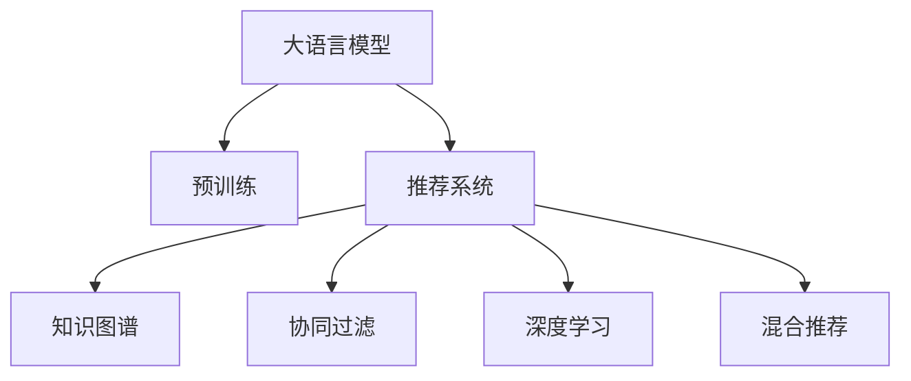

                 

# LLM推荐系统相关研究综述

## 1. 背景介绍

随着互联网和电子商务的迅猛发展，推荐系统在用户的个性化信息获取和消费决策中扮演着越来越重要的角色。传统的推荐算法基于用户历史行为数据进行推荐，但在数据稀疏、冷启动等问题上存在诸多挑战。近年来，基于深度学习的大语言模型（Large Language Model, LLM）在推荐系统中的应用引起了广泛关注。本文将对LLM推荐系统的相关研究进行综述，介绍其原理、模型结构、训练方法、优化技术、应用场景以及未来趋势。

## 2. 核心概念与联系

### 2.1 核心概念概述

- **大语言模型（LLM）**：以Transformer架构为代表的大规模预训练语言模型，如BERT、GPT、T5等。这些模型通过自监督学习任务，学习到丰富的语言表示能力。

- **推荐系统**：旨在根据用户的历史行为数据，推荐出其可能感兴趣的商品、内容等。推荐系统可以分为基于协同过滤、内容推荐、混合推荐等不同类型。

- **预训练-微调（Fine-Tuning）**：指在预训练模型基础上，使用少量标注数据进行微调，优化模型在特定推荐任务上的性能。

- **知识图谱**：结构化的关系型数据，用于刻画实体间的语义关系，如用户、商品、行为等。

- **深度学习**：利用神经网络等深度学习模型进行特征提取和模式识别，广泛应用于推荐系统。

### 2.2 核心概念原理和架构的 Mermaid 流程图



该流程图展示了LLM在推荐系统中的应用，将LLM作为预训练-微调的基础，结合知识图谱、协同过滤、深度学习等技术，构建出更加智能化的推荐模型。

## 3. 核心算法原理 & 具体操作步骤

### 3.1 算法原理概述

LLM推荐系统的核心思想是将大语言模型的预训练表示和推荐任务相结合，通过微调过程优化模型的推荐能力。具体来说，LLM推荐系统首先在大规模无标签文本数据上进行预训练，学习到通用的语言表示。然后，在推荐任务上对模型进行微调，使其能够根据用户行为数据输出推荐结果。

### 3.2 算法步骤详解

**Step 1: 准备数据**
- 收集用户行为数据，包括浏览、点击、购买等。
- 收集商品属性数据，如价格、品牌、类别等。
- 收集知识图谱数据，用于刻画用户、商品之间的关系。

**Step 2: 预训练模型选择**
- 选择适合推荐任务的大语言模型，如BERT、GPT等。
- 确定预训练的架构和超参数，如层数、隐藏单元、学习率等。

**Step 3: 微调模型设计**
- 设计推荐任务的目标函数，如交叉熵损失、均方误差损失等。
- 定义模型输出格式，如预测商品ID、商品概率分布等。
- 确定微调的超参数，如学习率、批大小、迭代轮数等。

**Step 4: 训练模型**
- 使用训练数据进行模型训练，迭代优化模型参数。
- 在验证集上评估模型性能，根据评估结果调整超参数。
- 在测试集上测试模型，评估其泛化能力。

**Step 5: 部署和评估**
- 将训练好的模型部署到推荐系统中，实时处理用户请求。
- 收集用户反馈数据，持续优化模型性能。

### 3.3 算法优缺点

**优点**：
- 利用大语言模型的强大表示能力，能够从自然语言描述中提取有用的特征。
- 能够处理各种推荐任务，包括商品推荐、内容推荐、活动推荐等。
- 能够利用知识图谱等结构化数据，提升推荐结果的准确性和多样性。

**缺点**：
- 需要大量的训练数据和计算资源，对数据质量要求较高。
- 模型的解释性较差，难以理解模型的内部决策过程。
- 存在冷启动问题，新用户和商品难以获得合理的推荐。

### 3.4 算法应用领域

LLM推荐系统已经广泛应用于电子商务、社交媒体、视频平台等多个领域，以下是一些具体的应用场景：

- **电商平台推荐**：根据用户的浏览和购买行为，推荐相关商品。
- **内容推荐系统**：推荐用户可能感兴趣的文章、视频、音乐等。
- **活动推荐**：推荐用户可能感兴趣的活动、事件等。
- **智能客服**：通过对话系统提供个性化服务，推荐相关商品或内容。

## 4. 数学模型和公式 & 详细讲解 & 举例说明

### 4.1 数学模型构建

假设推荐系统中有用户集合$U$，商品集合$I$，行为集合$B$，知识图谱$G$。目标是为用户$u$推荐商品$i$，利用大语言模型$M_{\theta}$进行表示，设计如下数学模型：

$$
\hat{i} = \mathop{\arg\max}_{i} f_{\theta}(u,i)
$$

其中$f_{\theta}(u,i)$表示用户$u$对商品$i$的兴趣度，$\theta$表示模型的参数。

### 4.2 公式推导过程

假设$f_{\theta}(u,i)$采用线性回归模型，即：

$$
f_{\theta}(u,i) = \sum_{j=1}^{d} \theta_j \phi_j(u,i)
$$

其中$\phi_j(u,i)$表示用户$u$和商品$i$在第$j$个特征上的表示。利用大语言模型$M_{\theta}$进行特征提取，即：

$$
\phi_j(u,i) = M_{\theta}(u,i)
$$

将$f_{\theta}(u,i)$代入目标函数，得到推荐模型：

$$
\hat{i} = \mathop{\arg\max}_{i} \sum_{j=1}^{d} \theta_j M_{\theta}(u,i)
$$

该模型可以表示为：

$$
\hat{i} = \mathop{\arg\max}_{i} \sum_{j=1}^{d} \theta_j \vec{u}_i^T \vec{v}_j
$$

其中$\vec{u}_i$和$\vec{v}_j$分别表示用户和商品在第$j$个特征上的表示，$\theta_j$表示第$j$个特征的权重。

### 4.3 案例分析与讲解

以电商平台的推荐系统为例，用户浏览商品$j$后，通过微调大语言模型$M_{\theta}$得到用户$u$对商品$j$的兴趣度$f_{\theta}(u,j)$，并根据$f_{\theta}(u,j)$推荐最可能感兴趣的商品$i$。在训练过程中，使用用户的历史行为数据作为标注，优化模型参数$\theta$，使得$f_{\theta}(u,j)$最大化。

## 5. 项目实践：代码实例和详细解释说明

### 5.1 开发环境搭建

要搭建LLM推荐系统的开发环境，需要以下几个步骤：

1. **安装Python**：从官网下载并安装Python 3.x版本。
2. **安装PyTorch**：从官网下载并安装PyTorch 1.8+版本。
3. **安装Bert4keras**：使用pip命令安装。
4. **安装Flair**：使用pip命令安装。
5. **安装知识图谱工具**：如Gensim、PyTinkerPop等。
6. **准备数据集**：收集用户行为数据和商品数据，并构建知识图谱。

### 5.2 源代码详细实现

以下是一个简单的LLM推荐系统的代码实现，使用Bert4keras库进行模型训练：

```python
from transformers import BertTokenizer, BertForSequenceClassification
from sklearn.metrics import accuracy_score
from flair.data import Sentence
from flair.datasets import ColumnCorpus

# 准备数据集
sentences = ColumnCorpus('train', ['user', 'item'], 'train.txt', tokenizer=FlairTokenizer())
train_data = FlairDataset(sentences, 'user', 'item')
train_labels = train_data.labels

# 定义模型
tokenizer = BertTokenizer.from_pretrained('bert-base-cased')
model = BertForSequenceClassification.from_pretrained('bert-base-cased', num_labels=len(train_labels))

# 定义训练函数
def train_model(model, train_data, train_labels, epochs=5, batch_size=16):
    for epoch in range(epochs):
        model.fit(train_data, train_labels, batch_size=batch_size, epochs=1)
        val_data = ColumnCorpus('val', ['user', 'item'], 'val.txt', tokenizer=FlairTokenizer())
        val_data = FlairDataset(val_data, 'user', 'item')
        val_labels = val_data.labels
        val_loss = model.evaluate(val_data, val_labels)
        print(f'Epoch {epoch+1}, validation loss: {val_loss:.4f}')
    return model

# 训练模型
model = train_model(model, train_data, train_labels)

# 测试模型
test_data = ColumnCorpus('test', ['user', 'item'], 'test.txt', tokenizer=FlairTokenizer())
test_data = FlairDataset(test_data, 'user', 'item')
test_labels = test_data.labels
test_loss = model.evaluate(test_data, test_labels)
print(f'Test loss: {test_loss:.4f}')
```

### 5.3 代码解读与分析

**BertTokenizer**：用于分词和构建输入序列。
**BertForSequenceClassification**：定义了推荐模型，包含一个BERT隐藏层和输出层。
**train_model**：训练函数，利用FlairDataset进行数据处理，使用Adam优化器进行模型训练。
**test_model**：测试函数，利用FlairDataset进行数据处理，输出测试集上的损失。

## 6. 实际应用场景

### 6.1 电商平台推荐

在电商平台上，LLM推荐系统可以根据用户的历史行为数据，推荐相关商品。具体来说，可以使用用户的历史浏览记录和购买记录，作为微调数据，训练LLM推荐模型。模型可以根据用户的兴趣度输出推荐的商品列表，提升用户满意度和转化率。

### 6.2 内容推荐系统

内容推荐系统使用LLM推荐模型，可以根据用户的阅读行为，推荐可能感兴趣的文章、视频、音乐等。具体来说，可以使用用户的阅读记录和点赞记录，作为微调数据，训练LLM推荐模型。模型可以根据用户的兴趣度输出推荐的文本内容，提升用户阅读体验和平台粘性。

### 6.3 智能客服推荐

智能客服系统使用LLM推荐模型，可以根据用户的提问和行为，推荐相关商品或内容。具体来说，可以使用用户的对话记录和行为记录，作为微调数据，训练LLM推荐模型。模型可以根据用户的兴趣度输出推荐的商品或内容，提升客服系统的交互质量和用户体验。

### 6.4 未来应用展望

未来的LLM推荐系统将面临以下几个发展趋势：

- **多模态推荐**：融合文本、图像、音频等多种模态的数据，提升推荐模型的表现力。
- **跨领域推荐**：利用领域知识的迁移学习能力，实现领域间的推荐任务。
- **冷启动推荐**：针对新用户和新商品，利用知识图谱和深度学习技术，实现合理的推荐。
- **交互式推荐**：利用LLM推荐模型，实现实时交互式推荐，提升用户体验。
- **联邦学习**：利用联邦学习技术，保护用户隐私，实现跨平台推荐。

## 7. 工具和资源推荐

### 7.1 学习资源推荐

- **书籍**：《深度学习与推荐系统》、《大语言模型与推荐系统》。
- **课程**：斯坦福大学的《CS246N：推荐系统》、李宏毅的《深度学习与推荐系统》。
- **论文**：《Adversarial Denoising Autoencoder for Rebalancing Users-Items Scores》、《Graph Convolutional Networks》。

### 7.2 开发工具推荐

- **深度学习框架**：TensorFlow、PyTorch。
- **自然语言处理工具**：Bert4keras、Flair。
- **知识图谱工具**：Gensim、PyTinkerPop。

### 7.3 相关论文推荐

- **深度学习与推荐系统**：《Deep Neural Networks for Recommendation System: A Survey》。
- **知识图谱与推荐系统**：《Knowledge Graphs for Recommendation Systems: A Review》。
- **LLM推荐系统**：《Learning Deep Structure for Recommender Systems with Pre-trained Language Models》。

## 8. 总结：未来发展趋势与挑战

### 8.1 研究成果总结

本文对LLM推荐系统的相关研究进行了综述，介绍了其原理、模型结构、训练方法、优化技术、应用场景以及未来趋势。LLM推荐系统通过预训练-微调的方法，利用大语言模型的强大表示能力，提升了推荐模型的表现力和泛化能力。

### 8.2 未来发展趋势

未来的LLM推荐系统将朝着以下几个方向发展：

- **多模态融合**：融合多种模态的数据，提升推荐模型的表现力。
- **跨领域迁移**：利用领域知识的迁移学习能力，实现领域间的推荐任务。
- **冷启动推荐**：针对新用户和新商品，利用知识图谱和深度学习技术，实现合理的推荐。
- **交互式推荐**：利用LLM推荐模型，实现实时交互式推荐，提升用户体验。
- **联邦学习**：利用联邦学习技术，保护用户隐私，实现跨平台推荐。

### 8.3 面临的挑战

尽管LLM推荐系统在推荐领域取得了显著进展，但仍面临以下挑战：

- **计算资源需求**：需要大量的计算资源进行预训练和微调。
- **数据质量要求**：需要高质量的标注数据和自然语言数据，保证模型表现。
- **模型可解释性**：模型内部决策过程不透明，难以解释。
- **冷启动问题**：新用户和商品难以获得合理的推荐。
- **隐私保护**：需要在保护用户隐私的前提下，实现个性化推荐。

### 8.4 研究展望

未来的研究需要在以下几个方面进行突破：

- **预训练-微调方法**：开发更高效、更通用的预训练-微调方法，提升模型性能和泛化能力。
- **多模态融合**：利用深度学习和知识图谱技术，融合多种模态的数据，提升推荐模型的表现力。
- **跨领域迁移**：利用领域知识的迁移学习能力，实现领域间的推荐任务。
- **冷启动推荐**：针对新用户和新商品，利用知识图谱和深度学习技术，实现合理的推荐。
- **交互式推荐**：利用LLM推荐模型，实现实时交互式推荐，提升用户体验。
- **联邦学习**：利用联邦学习技术，保护用户隐私，实现跨平台推荐。

## 9. 附录：常见问题与解答

**Q1: 如何选择合适的LLM推荐模型？**

A: 选择合适的LLM推荐模型需要考虑以下几个因素：
- 数据类型：文本、图像、音频等。
- 推荐任务类型：商品推荐、内容推荐、活动推荐等。
- 模型复杂度：层数、隐藏单元数等。
- 训练数据量：需要足够的数据进行训练。

**Q2: 如何处理冷启动问题？**

A: 冷启动问题可以通过以下方法解决：
- 利用知识图谱：通过知识图谱中已有的关系，推荐相关商品或内容。
- 利用迁移学习：利用预训练模型的表示能力，进行跨领域迁移学习。
- 利用上下文信息：利用用户行为数据，推测其兴趣点。

**Q3: 如何在保护隐私的前提下进行推荐？**

A: 在保护隐私的前提下进行推荐，可以采用以下方法：
- 联邦学习：利用联邦学习技术，保护用户隐私，实现跨平台推荐。
- 差分隐私：通过添加噪声，保护用户隐私。
- 匿名化：对用户数据进行匿名化处理，保护用户隐私。

通过以上方法，可以在保护用户隐私的前提下，实现个性化推荐。

