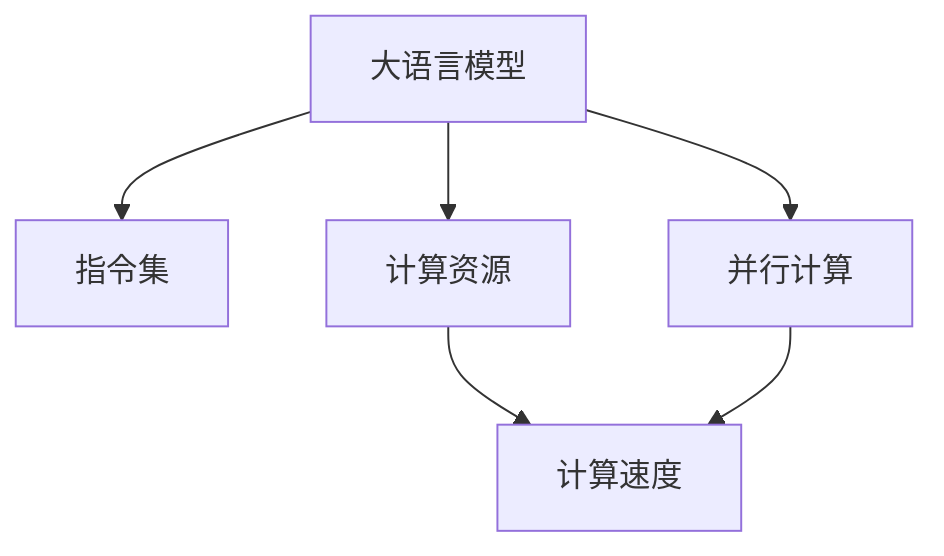

                 

# LLM的无限指令集与CPU的有限指令集

> 关键词：大语言模型, 指令集, 计算资源, 性能, 并行计算

## 1. 背景介绍

### 1.1 问题由来
现代计算机体系结构中的CPU设计理念和计算机科学的最新进展，使得人工智能尤其是深度学习模型的运行成为可能。从简单的线性模型到复杂的卷积神经网络(CNN)和卷积神经网络(Transformer)模型，算法模型和计算资源的需求在不断地增加。在深度学习领域，一种至关重要的模型就是大语言模型(LLM)，它们能够通过自监督学习和大量数据的训练来掌握复杂的语言和文本信息。然而，尽管LLM在理解和生成文本方面已经取得了显著的进步，但这些模型仍然受到计算机硬件的限制，特别是CPU的指令集和计算能力的限制。

### 1.2 问题核心关键点
本文的核心问题在于探索LLM（大语言模型）与传统CPU架构之间指令集和计算资源的差异，并分析这种差异如何影响模型的性能和应用范围。这涉及到对现代CPU架构的理解、深度学习模型的性能分析以及如何优化这些模型以适应不同计算资源和指令集的需求。

## 2. 核心概念与联系

### 2.1 核心概念概述

为了更好地理解LLM与CPU指令集之间的差异，本节将介绍几个关键概念：

- 大语言模型(LLM)：指使用深度学习技术训练的模型，能够处理和生成自然语言文本，包括但不限于问答、翻译、摘要生成等任务。
- 指令集(Instruction Set)：指CPU执行特定操作和计算任务的指令集合。现代CPU通常采用RISC或CISC指令集，每条指令执行不同的操作。
- 计算资源(Calculating Resources)：包括CPU主频、核心数、缓存大小等，直接影响计算速度和效率。
- 并行计算(Parallel Computing)：指同时执行多个计算任务，以提高计算速度和效率的技术。
- 模型性能(Model Performance)：指模型处理数据、生成输出和适应特定任务的效率和准确性。

这些概念之间的逻辑关系可以通过以下Mermaid流程图来展示：



这个流程图展示了大语言模型与CPU指令集和计算资源之间的联系：

1. 大语言模型在执行计算任务时，依赖于CPU的指令集和计算资源。
2. 指令集决定了CPU能够执行的操作类型和复杂度。
3. 计算资源直接影响计算速度和效率。
4. 并行计算技术可以进一步提高计算效率。

## 3. 核心算法原理 & 具体操作步骤

### 3.1 算法原理概述

LLM的运行基于深度学习算法，通常涉及大量矩阵计算和复杂逻辑操作。这些操作在传统的CPU指令集上可能无法直接实现，需要借助SIMD(Single Instruction, Multiple Data)指令和优化算法来实现。与此同时，CPU的有限指令集和计算资源限制了LLM的性能和应用范围。

### 3.2 算法步骤详解

LLM的运行通常包括数据加载、模型前向计算、损失函数计算和反向传播更新参数等步骤。这些步骤在CPU上的实现涉及以下关键技术：

1. **数据加载**：将数据加载到CPU内存，并进行预处理和归一化，以便于模型处理。

2. **模型前向计算**：使用模型进行预测，计算模型输出。

3. **损失函数计算**：计算模型输出与真实标签之间的差异。

4. **反向传播**：计算损失函数对模型参数的梯度，并更新模型参数。

### 3.3 算法优缺点

LLM的运行具有以下优点：

1. 强大的数据处理能力：能够处理和生成复杂文本，应用于多种NLP任务。
2. 高效的学习能力：通过大量数据训练，模型性能不断提升。

同时，LLM也存在以下缺点：

1. 高计算资源需求：由于深度学习模型的复杂性，需要大量的计算资源。
2. 依赖硬件限制：对CPU指令集和计算资源有较高要求，难以在大规模并行计算中充分发挥性能。
3. 高延迟问题：深度学习模型的计算密集型特性导致高延迟，难以实现实时处理。

### 3.4 算法应用领域

尽管存在上述问题，LLM在多个领域的应用已经取得显著成果，包括：

1. 自然语言理解(NLU)：如问答系统、文本摘要、情感分析等。
2. 自然语言生成(NLG)：如机器翻译、文本生成、对话系统等。
3. 知识图谱：构建和查询知识图谱，提供信息检索和推理服务。
4. 推荐系统：根据用户行为和历史数据，推荐相关内容。
5. 语音识别与合成：将语音转换为文本或文本转换为语音。

## 4. 数学模型和公式 & 详细讲解 & 举例说明

### 4.1 数学模型构建

为了更好地分析LLM的运行机制，本节将构建一个基于神经网络模型的数学模型，使用$x$表示输入，$y$表示输出，$\theta$表示模型参数。假设模型使用单层神经网络，输入$x$经过权重矩阵$W$和偏置向量$b$的线性变换，再经过非线性激活函数$f$，得到模型输出$y$。公式如下：

$$
y = f(Wx + b)
$$

其中$f$为激活函数，通常使用ReLU或Tanh函数。

### 4.2 公式推导过程

以单层神经网络为例，假设训练样本$(x_i, y_i)$，损失函数为均方误差损失，则模型参数$\theta$的更新公式为：

$$
\theta = \theta - \eta \frac{1}{N} \sum_{i=1}^N (y_i - f(Wx_i + b)) \nabla f(Wx_i + b)
$$

其中$\eta$为学习率。通过反向传播算法，可以高效计算损失函数对模型参数的梯度，更新模型参数。

### 4.3 案例分析与讲解

假设我们有一个简单的二分类问题，输入$x$为0或1，输出$y$为0或1。使用单层神经网络进行训练，损失函数为均方误差损失。我们希望模型能够准确预测输入$x$的分类。在这个案例中，我们使用交叉熵损失函数，通过梯度下降算法更新模型参数，优化模型的预测准确率。

## 5. 项目实践：代码实例和详细解释说明

### 5.1 开发环境搭建

要进行LLM的运行和训练，我们需要配置好Python环境和深度学习框架（如PyTorch或TensorFlow）。安装必要的库和依赖，并搭建好训练和推理的框架。

### 5.2 源代码详细实现

下面以PyTorch为例，展示一个简单的二分类问题的代码实现：

```python
import torch
import torch.nn as nn
import torch.optim as optim

# 定义模型
class Model(nn.Module):
    def __init__(self):
        super(Model, self).__init__()
        self.fc1 = nn.Linear(1, 8)
        self.fc2 = nn.Linear(8, 1)
        self.sigmoid = nn.Sigmoid()

    def forward(self, x):
        x = self.fc1(x)
        x = self.fc2(x)
        x = self.sigmoid(x)
        return x

# 定义损失函数和优化器
model = Model()
criterion = nn.BCELoss()
optimizer = optim.SGD(model.parameters(), lr=0.1)

# 训练模型
for epoch in range(100):
    optimizer.zero_grad()
    y_pred = model(x)
    loss = criterion(y_pred, y)
    loss.backward()
    optimizer.step()
```

### 5.3 代码解读与分析

在上述代码中，我们定义了一个简单的神经网络模型，包括两个全连接层和一个sigmoid激活函数。使用交叉熵损失函数和随机梯度下降算法进行训练。通过循环迭代，不断更新模型参数，以最小化损失函数，提升模型预测准确率。

## 6. 实际应用场景

### 6.1 智能客服系统

智能客服系统利用大语言模型进行对话理解、意图识别和回复生成，提升客户咨询体验和问题解决效率。在实际应用中，可以通过微调模型来适应企业内部的客服对话记录，提高模型的个性化程度和准确性。

### 6.2 金融舆情监测

金融机构需要实时监测市场舆论动向，防止负面信息传播。通过微调模型，可以对金融领域相关的新闻、报道、评论等文本数据进行情感分析和主题分类，及时发现风险并采取应对措施。

### 6.3 个性化推荐系统

个性化推荐系统根据用户历史行为和文本描述，推荐相关内容。通过微调模型，可以在文本数据中提取用户兴趣点，提高推荐系统的精准度和个性化程度。

### 6.4 未来应用展望

未来，LLM在自然语言理解、自然语言生成、知识图谱和推荐系统等领域将有更广泛的应用。随着计算资源的丰富和并行计算技术的发展，LLM的性能将得到进一步提升，实现更加复杂和高效的任务处理。

## 7. 工具和资源推荐

### 7.1 学习资源推荐

为了帮助开发者更好地掌握LLM和深度学习技术，以下是一些优秀的学习资源：

1. 《Deep Learning》书籍：Ian Goodfellow等著，全面介绍了深度学习的基础理论、算法和实践。
2. Coursera深度学习课程：由Andrew Ng等知名学者开设，提供了丰富的深度学习课程和实践项目。
3. TensorFlow官方文档：提供了TensorFlow的详细文档和示例代码，方便开发者学习使用。
4. PyTorch官方文档：提供了PyTorch的详细文档和示例代码，支持深度学习模型的开发和部署。
5. GitHub深度学习项目：可以浏览和学习深度学习领域的开源项目和代码实现。

### 7.2 开发工具推荐

为了更好地进行深度学习模型的开发和部署，以下是一些推荐的开发工具：

1. Jupyter Notebook：支持Python、R等语言，方便进行代码开发和数据处理。
2. Anaconda：提供Python环境的封装和数据管理，方便快速搭建开发环境。
3. CUDA：支持GPU计算，加速深度学习模型的训练和推理。
4. TensorBoard：支持模型训练和推理过程中的可视化，方便调试和优化模型。
5. Tesseract：支持文本识别和处理，方便处理结构化数据。

### 7.3 相关论文推荐

以下是几篇关于LLM和深度学习模型的经典论文：

1. "Attention is All You Need"论文：提出了Transformer模型，开启了NLP领域的预训练大模型时代。
2. "BERT: Pre-training of Deep Bidirectional Transformers for Language Understanding"论文：提出了BERT模型，引入掩码自监督预训练任务，刷新了多项NLP任务的SOTA。
3. "Parameter-Efficient Transfer Learning for NLP"论文：提出 Adapter等参数高效微调方法，在不增加模型参数量的情况下，取得不错的微调效果。
4. "The Illusory Unsupervised Learning of Grammar"论文：揭示了深度学习模型在自监督学习中的语法学习能力，为LLM的研究提供了新思路。
5. "Training Recurrent Neural Networks with Hessian-Free Optimization"论文：提出了Hessian-free优化算法，提高了深度学习模型的训练效率。

## 8. 总结：未来发展趋势与挑战

### 8.1 总结

本文对大语言模型与CPU指令集和计算资源之间的差异进行了分析，并探讨了LLM的运行机制和性能提升的策略。通过构建数学模型和代码实现，展示了LLM在实际应用中的潜在价值。

### 8.2 未来发展趋势

未来的LLM将依赖于更加高效的计算资源和并行计算技术，实现更加复杂的任务处理。同时，模型参数的压缩和稀疏化、硬件加速器（如TPU、GPU）的广泛应用等技术将进一步提升LLM的性能。

### 8.3 面临的挑战

尽管LLM在NLP领域取得了显著成果，但仍面临一些挑战：

1. 高计算资源需求：深度学习模型的复杂性要求大量的计算资源，难以在普通PC上实现高性能计算。
2. 高延迟问题：深度学习模型的计算密集型特性导致高延迟，难以实现实时处理。
3. 数据隐私和安全问题：大规模文本数据的处理和存储可能涉及隐私和安全问题，需要严格的数据管理和安全控制。

### 8.4 研究展望

未来的研究需要在以下几个方面进行深入探索：

1. 参数高效的深度学习模型：开发更加参数高效的模型，减少计算资源需求，提高模型性能。
2. 加速器技术：探索和发展更多高效的计算加速器，如TPU、GPU、FPGA等，提升模型计算速度。
3. 分布式计算：实现分布式计算框架，提高模型的并行计算能力和扩展性。
4. 数据管理技术：研究和开发高效的数据管理和存储技术，保障数据安全和隐私。
5. 模型压缩和优化：开发模型压缩和优化技术，减少模型参数量和计算资源需求。

通过这些技术的发展和应用，LLM将在未来的NLP领域发挥更加重要的作用，为人类社会带来更加智能和高效的服务。

## 9. 附录：常见问题与解答

**Q1: 为什么深度学习模型需要大量的计算资源？**

A: 深度学习模型通常具有大量的参数和复杂的非线性结构，需要大量的计算资源来进行训练和推理。模型的大小和复杂度决定了其计算资源需求，高复杂度的模型需要更多的计算资源支持。

**Q2: 如何提高深度学习模型的计算效率？**

A: 提高深度学习模型的计算效率可以从以下几个方面入手：

1. 硬件加速：使用GPU、TPU等加速器，提高计算速度。
2. 模型优化：进行模型压缩和剪枝，减少参数量。
3. 数据优化：使用数据增强和模型蒸馏等技术，提高模型泛化能力。
4. 分布式计算：利用分布式计算框架，实现高效计算。

**Q3: 深度学习模型在实际应用中面临哪些挑战？**

A: 深度学习模型在实际应用中面临以下挑战：

1. 计算资源需求高：深度学习模型的计算资源需求较大，需要高性能硬件支持。
2. 模型复杂度高：模型结构复杂，难以调试和优化。
3. 数据隐私和安全问题：大规模数据处理和存储可能涉及隐私和安全问题，需要严格的数据管理和安全控制。

**Q4: 如何开发高效的深度学习模型？**

A: 开发高效的深度学习模型可以从以下几个方面入手：

1. 算法优化：优化模型的算法结构，提高模型计算效率。
2. 硬件加速：使用GPU、TPU等加速器，提高计算速度。
3. 数据优化：进行数据增强和模型蒸馏等技术，提高模型泛化能力。
4. 分布式计算：利用分布式计算框架，实现高效计算。

**Q5: 如何提升深度学习模型的性能？**

A: 提升深度学习模型的性能可以从以下几个方面入手：

1. 算法优化：优化模型的算法结构，提高模型计算效率。
2. 数据优化：进行数据增强和模型蒸馏等技术，提高模型泛化能力。
3. 模型压缩：使用模型压缩和剪枝技术，减少模型参数量。
4. 硬件加速：使用GPU、TPU等加速器，提高计算速度。

通过这些技术和方法，可以提高深度学习模型的性能和应用效果，实现更加高效和精准的模型开发和部署。

---

作者：禅与计算机程序设计艺术 / Zen and the Art of Computer Programming

