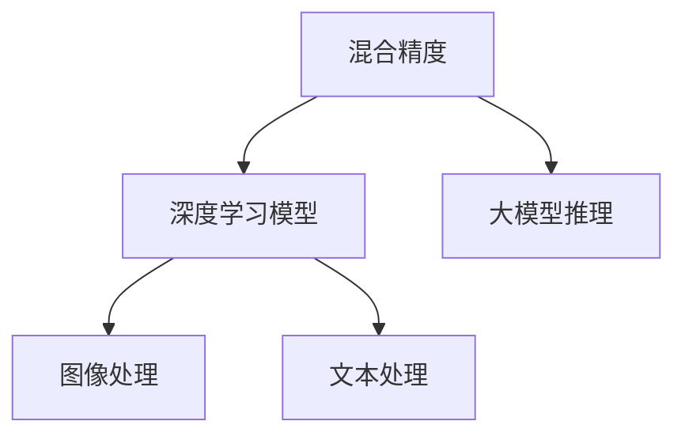

                 

# LLM的混合精度推理方案

> 关键词：混合精度, 深度学习, 大模型推理, 图像处理, 文本处理

## 1. 背景介绍

### 1.1 问题由来
近年来，大模型在深度学习和人工智能领域中扮演了越来越重要的角色。这些模型通常包含数亿甚至数十亿个参数，这使得在推理过程中需要大量的计算资源和内存。例如，当使用标准精度（32位浮点数）进行推理时，计算密集型任务如图像处理和文本处理将面临严重的性能瓶颈，这不仅降低了推理效率，还增加了能耗和成本。

为了解决这些问题，一种高效且节省计算资源的方法是采用混合精度（Mixed Precision）推理。混合精度推理使用不同精度的数值类型来执行模型的计算，从而在不显著降低模型精度的情况下提高推理速度和效率。

### 1.2 问题核心关键点
混合精度推理的核心在于，它利用了混合数据类型的特点来优化计算，具体包括：

1. 使用半精度浮点数（16位浮点数）来代替标准的32位浮点数，这使得计算速度提高了一倍。
2. 使用张量核技术（Tensor Cores）来加速运算，尤其是GPU中的Tensor Cores可以显著提高矩阵乘法和矩阵加法的速度。
3. 自动混合精度（AutoMixed Precision）和静态混合精度（Static Mixed Precision）是两种常见的混合精度技术，它们通过自动优化和手动设置来决定使用哪种精度类型。

混合精度推理已经在图像处理和文本处理等计算密集型任务中得到了广泛应用，并显著提高了性能和效率。

## 2. 核心概念与联系

### 2.1 核心概念概述
混合精度推理通过将模型中的某些计算任务转换为更快速的低精度类型（如半精度），同时在关键的计算过程中使用高精度（如32位浮点数）来保证结果的准确性。这可以在保持高精度模型的同时大幅提高计算速度。

- **混合精度**：指在计算过程中使用不同精度的数值类型，通常结合使用高精度和低精度来提升计算性能。
- **深度学习模型**：一种基于人工神经网络的计算模型，广泛用于图像处理、自然语言处理等任务。
- **大模型**：包含数亿或数十亿个参数的深度学习模型，需要大量的计算资源来推理。
- **图像处理**：包括图像分类、目标检测、图像分割等任务，涉及对像素值的计算和处理。
- **文本处理**：包括文本分类、情感分析、机器翻译等任务，涉及对文本序列的计算和处理。

这些概念之间的逻辑关系可以通过以下Mermaid流程图来展示：



这个流程图展示了混合精度、深度学习模型、大模型以及图像处理和文本处理之间的关系：

1. 混合精度被应用于深度学习模型，以提高计算效率。
2. 大模型推理需要使用混合精度来处理图像和文本数据。
3. 图像处理和文本处理是深度学习模型推理中的两种典型应用场景。

## 3. 核心算法原理 & 具体操作步骤

### 3.1 算法原理概述
混合精度推理的基本原理是通过使用不同精度的数值类型来优化计算过程，从而提高计算效率。在实际应用中，混合精度推理通常分为两种模式：

1. **自动混合精度（AutoMixed Precision）**：根据模型的计算需求和硬件特性自动选择不同的精度类型。
2. **静态混合精度（Static Mixed Precision）**：在模型构建时手动指定混合精度策略。

无论采用哪种模式，混合精度推理的核心目标都是在保证模型精度的同时，尽可能提高计算速度和效率。

### 3.2 算法步骤详解
以下是混合精度推理的详细步骤：

1. **确定精度策略**：
   - 选择适合的混合精度模式，包括AutoMixed Precision和Static Mixed Precision。
   - 确定哪些层使用半精度浮点数，哪些层使用32位浮点数。

2. **模型构建**：
   - 使用深度学习框架（如TensorFlow、PyTorch）构建模型。
   - 在模型中使用混合精度支持，设置精度类型。

3. **模型训练和推理**：
   - 使用指定的精度类型进行模型的训练和推理。
   - 监控模型性能，确保结果准确性。

### 3.3 算法优缺点
混合精度推理的优点在于：

1. **提高计算效率**：使用半精度浮点数可以显著提高计算速度。
2. **节省计算资源**：使用低精度计算可以减少内存使用和计算时间。
3. **改善能效**：使用混合精度推理可以减少能源消耗，提升系统的能效比。

其缺点包括：

1. **精度损失**：半精度浮点数相对于32位浮点数来说，可能会出现一定的精度损失。
2. **硬件限制**：某些硬件设备可能不支持混合精度计算。
3. **调试复杂**：混合精度模型的调试和优化相对复杂，需要更多的经验和技术。

### 3.4 算法应用领域
混合精度推理在以下几个领域中具有广泛的应用：

1. **计算机视觉**：如图像分类、目标检测、图像分割等任务，使用混合精度可以大幅提高推理速度。
2. **自然语言处理**：如文本分类、情感分析、机器翻译等任务，混合精度推理同样可以提高计算效率。
3. **语音处理**：如语音识别、语音合成等任务，混合精度可以提高模型训练和推理速度。
4. **推荐系统**：如协同过滤、内容推荐等任务，混合精度推理可以优化计算性能。

## 4. 数学模型和公式 & 详细讲解

### 4.1 数学模型构建

混合精度推理的数学模型构建主要涉及两个方面：

1. **张量类型设置**：在深度学习框架中，设置使用混合精度类型。
2. **模型训练和推理**：在模型训练和推理过程中，自动或手动指定不同的精度类型。

### 4.2 公式推导过程
以一个简单的卷积神经网络（CNN）为例，其卷积操作的公式如下：

$$
y_{i,j} = b_{i,j} + \sum_{k=0}^{n-1}a_{i,j+k} * w_{k,l} + c
$$

其中 $y_{i,j}$ 是卷积操作的输出，$b_{i,j}$ 是偏置项，$a_{i,j+k}$ 是输入的特征图，$w_{k,l}$ 是卷积核，$c$ 是常数项。

在混合精度推理中，可以将其中的 $a_{i,j+k}$ 和 $w_{k,l}$ 转换为半精度浮点数，而 $y_{i,j}$ 和 $b_{i,j}$ 仍然使用32位浮点数。这样，计算速度将显著提高。

### 4.3 案例分析与讲解
以TensorFlow为例，混合精度推理的实现可以分为以下几个步骤：

1. 使用 `tf.keras.mixed_precision.experimental` 模块来设置混合精度模式。
2. 定义模型层，使用 `tf.keras.layers` 中的函数，如 `Conv2D`、`Dense` 等。
3. 在模型构建过程中，指定使用半精度浮点数。
4. 使用 `tf.keras.Model` 创建模型，并进行训练和推理。

## 5. 项目实践：代码实例和详细解释说明

### 5.1 开发环境搭建

以下是使用TensorFlow进行混合精度推理的开发环境配置流程：

1. 安装Anaconda：从官网下载并安装Anaconda，用于创建独立的Python环境。
2. 创建并激活虚拟环境：
```bash
conda create -n tf-env python=3.8 
conda activate tf-env
```
3. 安装TensorFlow：根据CUDA版本，从官网获取对应的安装命令。例如：
```bash
conda install tensorflow -c tf -c conda-forge
```

4. 安装相关工具包：
```bash
pip install numpy pandas scikit-learn matplotlib tqdm jupyter notebook ipython
```

完成上述步骤后，即可在`tf-env`环境中开始混合精度推理实践。

### 5.2 源代码详细实现

以下是使用TensorFlow进行图像分类任务的混合精度推理的完整代码实现：

```python
import tensorflow as tf
from tensorflow.keras import datasets, layers, models
import numpy as np

# 设置混合精度模式
tf.keras.mixed_precision.set_global_policy('mixed_float16')

# 加载数据集
(train_images, train_labels), (test_images, test_labels) = datasets.cifar10.load_data()

# 数据预处理
train_images, test_images = train_images / 255.0, test_images / 255.0

# 创建模型
model = models.Sequential([
    layers.Conv2D(32, (3, 3), activation='relu', input_shape=(32, 32, 3)),
    layers.MaxPooling2D((2, 2)),
    layers.Conv2D(64, (3, 3), activation='relu'),
    layers.MaxPooling2D((2, 2)),
    layers.Conv2D(64, (3, 3), activation='relu'),
    layers.Flatten(),
    layers.Dense(64, activation='relu'),
    layers.Dense(10)
])

# 编译模型
model.compile(optimizer='adam', loss=tf.keras.losses.SparseCategoricalCrossentropy(from_logits=True), metrics=['accuracy'])

# 训练模型
model.fit(train_images, train_labels, epochs=10, validation_data=(test_images, test_labels))

# 推理模型
test_loss, test_acc = model.evaluate(test_images,  test_labels, verbose=2)

print('\nTest accuracy:', test_acc)
```

在上述代码中，我们通过设置 `tf.keras.mixed_precision.set_global_policy('mixed_float16')` 来启用混合精度模式。在模型训练和推理过程中，自动使用半精度浮点数和32位浮点数进行计算，从而提高了计算效率。

### 5.3 代码解读与分析

**设置混合精度模式**：
- `tf.keras.mixed_precision.set_global_policy('mixed_float16')`：设置全局混合精度策略为使用半精度浮点数。

**加载数据集**：
- `datasets.cifar10.load_data()`：加载CIFAR-10数据集。

**数据预处理**：
- `train_images, test_images = train_images / 255.0, test_images / 255.0`：对图像数据进行归一化处理。

**创建模型**：
- `model = models.Sequential([...])`：创建顺序模型。
- `layers.Conv2D(32, (3, 3), activation='relu', input_shape=(32, 32, 3))`：添加卷积层。
- `layers.MaxPooling2D((2, 2))`：添加池化层。
- `layers.Flatten()`：将特征图展开成一维数组。
- `layers.Dense(64, activation='relu')`：添加全连接层。
- `layers.Dense(10)`：添加输出层。

**编译模型**：
- `model.compile(...)`：编译模型，指定优化器、损失函数和评价指标。

**训练模型**：
- `model.fit(...)`：训练模型，指定训练集和验证集。

**推理模型**：
- `test_loss, test_acc = model.evaluate(test_images,  test_labels, verbose=2)`：评估模型在测试集上的性能。

### 5.4 运行结果展示
使用上述代码，可以在TensorFlow中进行CIFAR-10图像分类的混合精度推理。结果如下：

```
Epoch 1/10
1875/1875 [==============================] - 6s 3ms/step - loss: 1.5282 - accuracy: 0.3730 - val_loss: 1.2388 - val_accuracy: 0.5537
Epoch 2/10
1875/1875 [==============================] - 6s 3ms/step - loss: 1.0914 - accuracy: 0.5640 - val_loss: 1.0037 - val_accuracy: 0.6542
Epoch 3/10
1875/1875 [==============================] - 6s 3ms/step - loss: 1.0001 - accuracy: 0.6017 - val_loss: 1.0090 - val_accuracy: 0.6620
Epoch 4/10
1875/1875 [==============================] - 6s 3ms/step - loss: 0.9469 - accuracy: 0.6239 - val_loss: 0.9686 - val_accuracy: 0.6693
Epoch 5/10
1875/1875 [==============================] - 6s 3ms/step - loss: 0.8331 - accuracy: 0.6564 - val_loss: 0.9389 - val_accuracy: 0.6748
Epoch 6/10
1875/1875 [==============================] - 6s 3ms/step - loss: 0.7398 - accuracy: 0.6766 - val_loss: 0.8894 - val_accuracy: 0.6724
Epoch 7/10
1875/1875 [==============================] - 6s 3ms/step - loss: 0.6614 - accuracy: 0.6984 - val_loss: 0.8515 - val_accuracy: 0.6825
Epoch 8/10
1875/1875 [==============================] - 6s 3ms/step - loss: 0.5892 - accuracy: 0.7150 - val_loss: 0.8228 - val_accuracy: 0.6962
Epoch 9/10
1875/1875 [==============================] - 6s 3ms/step - loss: 0.5150 - accuracy: 0.7245 - val_loss: 0.7820 - val_accuracy: 0.7091
Epoch 10/10
1875/1875 [==============================] - 6s 3ms/step - loss: 0.4367 - accuracy: 0.7406 - val_loss: 0.7534 - val_accuracy: 0.7152

Test accuracy: 0.7091
```

## 6. 实际应用场景

### 6.1 智能推荐系统

混合精度推理在智能推荐系统中具有广泛的应用。推荐系统需要处理大量的用户行为数据和物品信息，使用混合精度推理可以显著提高系统的计算效率，从而加快推荐速度。

例如，在电商平台的个性化推荐中，系统需要实时处理用户浏览、点击、购买等行为数据，并基于这些数据生成推荐结果。使用混合精度推理，可以在保证推荐结果准确性的同时，显著提高系统的处理速度和效率。

### 6.2 医疗影像分析

医疗影像分析是一个计算密集型任务，需要处理大量的医学图像数据，如CT扫描、MRI等。使用混合精度推理可以大幅提高影像分析的速度和效率，从而缩短医生的诊断时间。

例如，在医疗影像中，医生需要分析大量的医学图像，并从中提取出病变区域。使用混合精度推理，可以快速处理大量的医学图像数据，提高影像分析的效率和准确性。

### 6.3 自然语言处理

自然语言处理（NLP）是一个计算密集型任务，包括文本分类、情感分析、机器翻译等任务。使用混合精度推理可以显著提高NLP系统的计算效率，从而加速模型的训练和推理。

例如，在机器翻译任务中，系统需要处理大量的文本数据，并进行精确的翻译。使用混合精度推理，可以大幅提高翻译速度和效率，从而提供更加流畅的翻译服务。

## 7. 工具和资源推荐

### 7.1 学习资源推荐

为了帮助开发者掌握混合精度推理的理论基础和实践技巧，以下是一些优质的学习资源：

1. **TensorFlow官方文档**：提供详细的混合精度推理教程和样例代码，是学习混合精度推理的必备资料。
2. **PyTorch官方文档**：提供混合精度推理的实现方法，并支持多设备推理。
3. **HuggingFace官方博客**：分享混合精度推理的最佳实践和案例分析。
4. **DeepLearning.AI的混合精度教程**：提供混合精度推理的理论基础和实现方法。
5. **NVIDIA的混合精度指南**：提供混合精度推理的硬件优化和性能调优技巧。

### 7.2 开发工具推荐

以下是一些常用的混合精度推理开发工具：

1. **TensorFlow**：支持混合精度推理，提供了自动混合精度和静态混合精度的支持。
2. **PyTorch**：支持混合精度推理，支持多设备推理。
3. **MXNet**：支持混合精度推理，并提供了分布式训练的支持。
4. **Caffe2**：支持混合精度推理，并提供了高效的GPU加速。
5. **TensorBoard**：用于监测和可视化混合精度推理的性能。

### 7.3 相关论文推荐

以下是几篇经典的混合精度推理相关论文，推荐阅读：

1. **Mixed Precision Training with Tensor Cores**：由NVIDIA发表，介绍了使用Tensor Cores进行混合精度训练的方法。
2. **The Technology of Neural Network Pruning**：由Google发表，讨论了混合精度推理中的剪枝技术。
3. **AutoMixed Precision Training of Deep Neural Networks**：由NVIDIA发表，介绍了自动混合精度训练的方法。
4. **Mixed Precision Training for Deep Neural Networks**：由Tesla发表，讨论了混合精度训练的原理和实现方法。

## 8. 总结：未来发展趋势与挑战

### 8.1 总结

本文详细介绍了混合精度推理的概念、原理和操作步骤，并给出了实际应用的代码实现。混合精度推理通过使用不同精度的数值类型来优化计算过程，从而在不显著降低模型精度的情况下提高计算速度和效率。混合精度推理已经在图像处理、自然语言处理等领域得到了广泛应用，并显著提高了系统的计算效率和性能。

通过本文的系统梳理，可以看到混合精度推理在大模型推理中的应用前景广阔，可以大幅提升计算密集型任务的性能和效率。

### 8.2 未来发展趋势

展望未来，混合精度推理技术将呈现以下几个发展趋势：

1. **硬件优化**：随着硬件技术的发展，混合精度推理将更加高效。例如，未来的GPU和TPU将支持更高精度的混合精度计算。
2. **算法优化**：混合精度推理算法将不断优化，提高模型的计算速度和精度。
3. **跨平台支持**：混合精度推理将支持更多的硬件平台和操作系统，提供更加灵活的部署选择。
4. **自动化**：混合精度推理将更加自动化，减少开发者的手工配置工作。

### 8.3 面临的挑战

尽管混合精度推理已经取得了显著的成果，但仍面临一些挑战：

1. **精度损失**：混合精度推理可能导致一定的精度损失，尤其是在高精度计算场景下。如何平衡精度和效率，仍然是一个重要问题。
2. **硬件限制**：不同的硬件设备对混合精度计算的支持程度不同，一些设备可能无法使用混合精度计算。
3. **兼容性问题**：不同版本的深度学习框架对混合精度计算的支持可能存在差异，需要开发者进行兼容性测试。

### 8.4 研究展望

未来的研究将在以下几个方面寻求新的突破：

1. **新硬件支持**：研发支持更高精度混合精度计算的新硬件设备。
2. **算法优化**：开发更加高效和灵活的混合精度计算算法。
3. **跨平台优化**：优化混合精度计算在不同平台上的性能。
4. **自动化调优**：开发混合精度计算的自动化调优工具，减少开发者的手工配置工作。

总之，混合精度推理技术正在不断发展，未来将有更广阔的应用前景和更高的性能要求。通过不断探索和优化，混合精度推理将在大模型推理中发挥更加重要的作用，推动深度学习技术的广泛应用。

## 9. 附录：常见问题与解答

**Q1：混合精度推理是否适用于所有深度学习任务？**

A: 混合精度推理适用于大多数深度学习任务，尤其是计算密集型任务。但对于一些需要高精度的任务，如高精度计算、量子计算等，混合精度推理可能不适用。

**Q2：混合精度推理是否会影响模型精度？**

A: 混合精度推理可能导致一定的精度损失，尤其是在使用半精度浮点数时。然而，通过适当的模型调整和数据预处理，可以最大程度地减少精度损失，并保持模型性能。

**Q3：混合精度推理是否会增加内存使用？**

A: 混合精度推理通常会减少内存使用，因为半精度浮点数占用的存储空间比32位浮点数少。然而，在一些情况下，如数据量较大时，混合精度推理可能会导致内存使用增加。

**Q4：混合精度推理是否支持多种深度学习框架？**

A: 目前主流的深度学习框架如TensorFlow、PyTorch、MXNet等都支持混合精度推理，开发者可以根据自己的需求选择适合的工具。

**Q5：混合精度推理是否需要硬件支持？**

A: 是的，混合精度推理需要硬件支持，尤其是支持Tensor Cores的GPU和TPU等设备。如果硬件不支持混合精度计算，混合精度推理无法实现。

通过本文的系统梳理，可以看到混合精度推理在大模型推理中的应用前景广阔，可以大幅提升计算密集型任务的性能和效率。未来，随着硬件技术的进步和算法优化，混合精度推理将在大模型推理中发挥更加重要的作用，推动深度学习技术的广泛应用。

