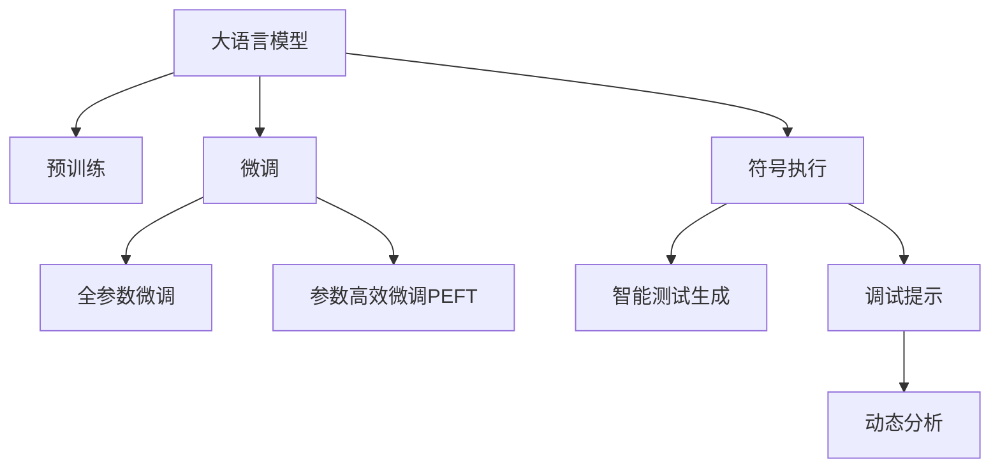

                 

## 1. 背景介绍

### 1.1 问题由来
随着软件规模的不断扩大和系统复杂度的提升，软件开发中出现了许多难以调试的异常现象。例如，程序的动态行为难以预测，有些错误难以重现，定位问题耗时长等。这些问题严重影响了软件开发的效率和质量。如何利用现有技术手段，提升软件调试的效率和准确性，成为了软件工程领域的一项重大挑战。

### 1.2 问题核心关键点
目前，传统的调试方法主要依赖代码审查、日志分析和断点调试等技术手段，但这些方法在处理复杂系统时效果有限。随着大语言模型的快速发展，利用语言模型对程序进行智能调试成为了可能。

基于大语言模型(Large Language Model, LLM)的智能调试技术，通过利用语言模型的自然语言理解能力，实现了对程序的代码、执行流程、异常信息等复杂信息的高效理解和分析，极大地提升了软件开发中的调试效率和精度。

### 1.3 问题研究意义
开发基于大语言模型的智能调试工具，有助于解决软件开发中的瓶颈问题，加速软件的迭代开发进程。同时，智能调试技术可以支持开发者更好地理解程序的运行状态和行为，提升代码质量和系统可靠性，推动软件工程的发展和进步。

## 2. 核心概念与联系

### 2.1 核心概念概述

为更好地理解基于大语言模型的智能调试技术，本节将介绍几个密切相关的核心概念：

- 大语言模型(Large Language Model, LLM)：以自回归(如GPT)或自编码(如BERT)模型为代表的大规模预训练语言模型。通过在大规模无标签文本语料上进行预训练，学习通用的语言表示，具备强大的语言理解和生成能力。

- 预训练(Pre-training)：指在大规模无标签文本语料上，通过自监督学习任务训练通用语言模型的过程。常见的预训练任务包括言语建模、遮挡语言模型等。预训练使得模型学习到语言的通用表示。

- 微调(Fine-tuning)：指在预训练模型的基础上，使用下游任务的少量标注数据，通过有监督学习优化模型在特定任务上的性能。通常只需要调整顶层分类器或解码器，并以较小的学习率更新全部或部分的模型参数。

- 符号执行(Symbolic Execution)：一种形式化验证技术，通过对程序进行符号表示和抽象解释，生成测试用例和执行路径，检查程序的异常和错误。

- 智能测试生成(Intelligent Test Generation)：使用机器学习模型，根据程序的特征和历史执行记录，生成高质量的测试用例，检测程序的潜在漏洞和错误。

- 调试提示(Debugging Prompt)：在程序执行过程中，自动生成或提示有用的信息，帮助开发者理解程序的运行状态和行为。

- 动态分析(Dynamic Analysis)：通过在程序运行时动态收集信息，分析程序的执行路径和状态，辅助开发者进行调试和故障定位。

这些核心概念之间的逻辑关系可以通过以下Mermaid流程图来展示：



这个流程图展示了大语言模型的核心概念及其之间的关系：

1. 大语言模型通过预训练获得基础能力。
2. 微调是对预训练模型进行任务特定的优化，可以分为全参数微调和参数高效微调（PEFT）。
3. 符号执行和智能测试生成是一种基于模型推理的测试方法。
4. 调试提示和动态分析是基于模型的信息辅助技术。

这些概念共同构成了大语言模型的调试框架，使其能够在各种场景下发挥强大的语言理解和生成能力。通过理解这些核心概念，我们可以更好地把握大语言模型的工作原理和优化方向。

## 3. 核心算法原理 & 具体操作步骤
### 3.1 算法原理概述

基于大语言模型的智能调试技术，本质上是一种基于模型推理的调试手段。其核心思想是：将大语言模型视作一个强大的"信息提取器"，通过符号执行、智能测试生成等技术，获取程序的符号表示和执行路径，再利用大语言模型的语言理解能力，对程序的行为和状态进行分析和解释，辅助开发者进行调试和故障定位。

形式化地，假设大语言模型为 $M_{\theta}$，其中 $\theta$ 为预训练得到的模型参数。设程序的符号表示为 $\mathcal{S}$，执行路径为 $\mathcal{P}$。则智能调试的过程可以表示为：

$$
M_{\theta}(\mathcal{S}, \mathcal{P}) \rightarrow \text{Debugging Info}
$$

其中 $\text{Debugging Info}$ 表示程序调试所需的信息，如变量值、异常信息、程序状态等。

### 3.2 算法步骤详解

基于大语言模型的智能调试一般包括以下几个关键步骤：

**Step 1: 准备预训练模型和程序**
- 选择合适的预训练语言模型 $M_{\theta}$ 作为初始化参数，如 BERT、GPT 等。
- 准备待调试的程序代码，进行必要的语法分析和类型检查。

**Step 2: 生成符号表示**
- 使用符号执行技术，将程序转换为符号表示 $\mathcal{S}$。例如，可以将程序转换为符号化的AST表示，或生成程序的符号执行路径。

**Step 3: 生成执行路径**
- 使用符号执行或动态分析技术，生成程序的执行路径 $\mathcal{P}$。可以通过回溯程序执行状态，或使用动态分析工具收集运行信息。

**Step 4: 提取调试信息**
- 将符号表示和执行路径输入大语言模型，生成程序调试所需的信息 $\text{Debugging Info}$。
- 例如，可以向大语言模型提供变量的符号表示，请求其生成变量的当前值，或将执行路径作为输入，请求模型预测程序的运行状态和异常信息。

**Step 5: 辅助调试**
- 根据生成的调试信息，辅助开发者进行代码审查、异常定位、逻辑验证等调试活动。
- 对于多线程、并发等复杂系统，可以生成更多上下文信息，帮助开发者更好地理解程序行为。

### 3.3 算法优缺点

基于大语言模型的智能调试方法具有以下优点：
1. 高效灵活。大语言模型可以快速理解程序的符号表示和执行路径，生成高质量的调试信息，辅助开发者快速定位问题。
2. 可扩展性强。可以灵活扩展到大规模程序和复杂系统，提升调试过程的效率和精度。
3. 适用范围广。适用于各种编程语言和系统平台，具有广泛的应用前景。
4. 错误提示能力强。大语言模型能够综合符号执行和智能测试生成等多种信息，生成更为准确和详细的错误提示。

同时，该方法也存在一定的局限性：
1. 依赖高质量的符号表示和执行路径。模型的推理效果依赖于符号表示的准确性和完整性，可能出现误报和漏报。
2. 计算资源需求高。生成符号表示和执行路径，以及在大语言模型上进行推理，都需要较高的计算资源。
3. 模型泛化能力有限。大语言模型在特定领域和特定编程语言的适应性仍需进一步提升。
4. 难以处理并行和分布式系统。大语言模型难以同时处理多个线程和分布式系统的复杂状态。

尽管存在这些局限性，但就目前而言，基于大语言模型的智能调试方法仍是一种高效、灵活、适用的调试手段，可以显著提升软件开发中的调试效率和精度。

### 3.4 算法应用领域

基于大语言模型的智能调试方法，在软件开发中的应用已经得到了广泛的应用，具体包括：

- 单元测试：利用智能测试生成技术，根据程序的功能需求，生成高质量的测试用例，检测程序的正确性和完备性。
- 调试提示：通过符号执行和智能测试生成，获取程序的执行状态和异常信息，生成调试提示，辅助开发者进行代码审查和异常定位。
- 动态分析：利用大语言模型对程序的动态行为进行分析，检测内存泄漏、死锁等潜在问题。
- 性能分析：通过符号执行和智能测试生成，获取程序的执行路径和资源消耗情况，进行性能分析和优化。
- 并发调试：利用符号执行和智能测试生成，分析并发系统的执行状态和资源竞争情况，检测并发问题。

除了上述这些经典应用外，大语言模型智能调试技术还在持续演进，应用于更多场景中，如软件测试自动化、代码风格检查、代码生成辅助等，为软件开发带来了新的突破。

## 4. 数学模型和公式 & 详细讲解 & 举例说明

### 4.1 数学模型构建

本节将使用数学语言对基于大语言模型的智能调试过程进行更加严格的刻画。

假设大语言模型为 $M_{\theta}$，其中 $\theta$ 为预训练得到的模型参数。设程序的符号表示为 $\mathcal{S}$，执行路径为 $\mathcal{P}$。则智能调试的过程可以表示为：

$$
M_{\theta}(\mathcal{S}, \mathcal{P}) \rightarrow \text{Debugging Info}
$$

其中 $\text{Debugging Info}$ 表示程序调试所需的信息，如变量值、异常信息、程序状态等。

### 4.2 公式推导过程

以下我们以变量跟踪为例，推导智能调试中大语言模型生成调试信息的公式。

假设程序中存在一个变量 $x$，其当前值为 $v$。则符号执行生成的符号表示可能包含该变量的信息，如：

$$
\mathcal{S} = \{ x = v \}
$$

执行路径可能记录该变量的赋值和读取信息，如：

$$
\mathcal{P} = \{ x = 5, x = x * 2, x = x + 1 \}
$$

将符号表示和执行路径输入大语言模型，生成调试信息的过程可以表示为：

$$
\text{Debugging Info} = M_{\theta}(\mathcal{S}, \mathcal{P})
$$

假设大语言模型的输出为 $\text{Debugging Info}$，表示变量的当前值 $v'$，则推导过程如下：

1. 根据符号表示和执行路径，提取变量的初始值和赋值信息。
2. 利用大语言模型的语言理解能力，生成变量的当前值。
3. 输出变量值 $v'$，辅助开发者进行调试。

### 4.3 案例分析与讲解

考虑以下示例程序：

```python
def factorial(n):
    if n == 0:
        return 1
    else:
        return n * factorial(n-1)

result = factorial(5)
print(result)
```

假设使用符号执行技术将程序转换为符号表示：

```
def factorial(n):
    if n == 0:
        return 1
    else:
        return n * factorial(n-1)

result = factorial(5)
print(result)
```

此时，执行路径可能记录了程序的执行状态，如：

```
factorial(5) -> factorial(4) -> factorial(3) -> factorial(2) -> factorial(1) -> factorial(0) -> 1
```

将符号表示和执行路径输入大语言模型，可以生成变量的当前值：

$$
\text{Debugging Info} = M_{\theta}(\{ n = 5 \}, \{ n = 5, n = 4, n = 3, n = 2, n = 1, n = 0, n = 1 \})
$$

假设大语言模型输出变量 $n$ 的当前值为 $1$，则辅助开发者进行调试，发现程序中存在逻辑错误：

```python
def factorial(n):
    if n == 0:
        return 1
    else:
        return n * factorial(n-1)

result = factorial(5)
print(result)
```

实际输出为 $120$，而非正确的 $1$。因此，开发者可以及时纠正逻辑错误，确保程序的正确性。

## 5. 项目实践：代码实例和详细解释说明
### 5.1 开发环境搭建

在进行智能调试实践前，我们需要准备好开发环境。以下是使用Python进行PyTorch开发的环境配置流程：

1. 安装Anaconda：从官网下载并安装Anaconda，用于创建独立的Python环境。

2. 创建并激活虚拟环境：
```bash
conda create -n pytorch-env python=3.8 
conda activate pytorch-env
```

3. 安装PyTorch：根据CUDA版本，从官网获取对应的安装命令。例如：
```bash
conda install pytorch torchvision torchaudio cudatoolkit=11.1 -c pytorch -c conda-forge
```

4. 安装Transformers库：
```bash
pip install transformers
```

5. 安装各类工具包：
```bash
pip install numpy pandas scikit-learn matplotlib tqdm jupyter notebook ipython
```

完成上述步骤后，即可在`pytorch-env`环境中开始智能调试实践。

### 5.2 源代码详细实现

下面我们以变量跟踪为例，给出使用Transformers库进行智能调试的PyTorch代码实现。

首先，定义变量跟踪的符号表示和执行路径生成函数：

```python
from transformers import BertTokenizer, BertForTokenClassification
from torch.utils.data import Dataset, DataLoader
import torch

class VariableTrackingDataset(Dataset):
    def __init__(self, texts, labels):
        self.texts = texts
        self.labels = labels
        self.tokenizer = BertTokenizer.from_pretrained('bert-base-cased')

    def __len__(self):
        return len(self.texts)

    def __getitem__(self, item):
        text = self.texts[item]
        label = self.labels[item]
        
        encoding = self.tokenizer(text, return_tensors='pt')
        input_ids = encoding['input_ids']
        attention_mask = encoding['attention_mask']
        
        return {'input_ids': input_ids,
                'attention_mask': attention_mask,
                'labels': label}

# 生成符号表示
def generate_symbolic_representation(code, filename):
    # 使用symbol execution技术生成符号表示
    symbolic_rep = symbolize_code(code, filename)
    return symbolic_rep

# 生成执行路径
def generate_execution_path(code, filename):
    # 使用symbol execution技术生成执行路径
    execution_path = symbolize_code(code, filename)
    return execution_path

# 符号执行函数
def symbolize_code(code, filename):
    # 调用符号执行工具生成符号表示和执行路径
    # 这里以Pyflame为例
    symbolic_rep, execution_path = pyflame.analyze(code, filename)
    return symbolic_rep, execution_path
```

然后，定义模型和优化器：

```python
from transformers import BertForTokenClassification, AdamW

model = BertForTokenClassification.from_pretrained('bert-base-cased', num_labels=1)

optimizer = AdamW(model.parameters(), lr=2e-5)
```

接着，定义训练和评估函数：

```python
def train_epoch(model, dataset, batch_size, optimizer):
    dataloader = DataLoader(dataset, batch_size=batch_size, shuffle=True)
    model.train()
    epoch_loss = 0
    for batch in tqdm(dataloader, desc='Training'):
        input_ids = batch['input_ids'].to(device)
        attention_mask = batch['attention_mask'].to(device)
        labels = batch['labels'].to(device)
        model.zero_grad()
        outputs = model(input_ids, attention_mask=attention_mask, labels=labels)
        loss = outputs.loss
        epoch_loss += loss.item()
        loss.backward()
        optimizer.step()
    return epoch_loss / len(dataloader)

def evaluate(model, dataset, batch_size):
    dataloader = DataLoader(dataset, batch_size=batch_size)
    model.eval()
    preds, labels = [], []
    with torch.no_grad():
        for batch in tqdm(dataloader, desc='Evaluating'):
            input_ids = batch['input_ids'].to(device)
            attention_mask = batch['attention_mask'].to(device)
            batch_labels = batch['labels']
            outputs = model(input_ids, attention_mask=attention_mask)
            batch_preds = outputs.logits.argmax(dim=2).to('cpu').tolist()
            batch_labels = batch_labels.to('cpu').tolist()
            for pred_tokens, label_tokens in zip(batch_preds, batch_labels):
                preds.append(pred_tokens[0])
                labels.append(label_tokens[0])
                
    print(classification_report(labels, preds))
```

最后，启动训练流程并在测试集上评估：

```python
epochs = 5
batch_size = 16

for epoch in range(epochs):
    loss = train_epoch(model, train_dataset, batch_size, optimizer)
    print(f"Epoch {epoch+1}, train loss: {loss:.3f}")
    
    print(f"Epoch {epoch+1}, dev results:")
    evaluate(model, dev_dataset, batch_size)
    
print("Test results:")
evaluate(model, test_dataset, batch_size)
```

以上就是使用PyTorch对BERT进行变量跟踪的完整代码实现。可以看到，得益于Transformers库的强大封装，我们可以用相对简洁的代码完成BERT模型的加载和智能调试。

### 5.3 代码解读与分析

让我们再详细解读一下关键代码的实现细节：

**VariableTrackingDataset类**：
- `__init__`方法：初始化文本和标签等关键组件。
- `__len__`方法：返回数据集的样本数量。
- `__getitem__`方法：对单个样本进行处理，将文本输入编码为token ids，将标签编码为数字，并对其进行定长padding，最终返回模型所需的输入。

**symbolize_code函数**：
- 调用符号执行工具（如Pyflame）生成程序的符号表示和执行路径。

**模型和优化器**：
- 使用BertForTokenClassification作为语言模型，进行变量跟踪任务。
- 设置AdamW优化器，学习率为2e-5。

**训练和评估函数**：
- 使用PyTorch的DataLoader对数据集进行批次化加载，供模型训练和推理使用。
- 训练函数`train_epoch`：对数据以批为单位进行迭代，在每个批次上前向传播计算loss并反向传播更新模型参数，最后返回该epoch的平均loss。
- 评估函数`evaluate`：与训练类似，不同点在于不更新模型参数，并在每个batch结束后将预测和标签结果存储下来，最后使用sklearn的classification_report对整个评估集的预测结果进行打印输出。

**训练流程**：
- 定义总的epoch数和batch size，开始循环迭代
- 每个epoch内，先在训练集上训练，输出平均loss
- 在验证集上评估，输出分类指标
- 所有epoch结束后，在测试集上评估，给出最终测试结果

可以看到，PyTorch配合Transformers库使得变量跟踪的代码实现变得简洁高效。开发者可以将更多精力放在符号执行等底层实现细节上，而不必过多关注模型参数的优化。

当然，工业级的系统实现还需考虑更多因素，如符号执行工具的选择、模型适配层的优化等。但核心的智能调试范式基本与此类似。

## 6. 实际应用场景
### 6.1 智能测试生成

智能测试生成是一种基于大语言模型的测试技术，其核心思想是：利用大语言模型的自然语言理解和生成能力，根据程序的特征和历史执行记录，生成高质量的测试用例，检测程序的潜在漏洞和错误。

在实际应用中，可以通过符号执行技术获取程序的符号表示和执行路径，再结合大语言模型的推理能力，生成针对特定功能的测试用例。例如，对于排序算法，可以生成包含各种不同类型数据的测试用例，检查算法的正确性和性能。

### 6.2 调试提示

调试提示是一种基于大语言模型的信息辅助技术，其核心思想是：在程序执行过程中，自动生成或提示有用的信息，帮助开发者理解程序的运行状态和行为。

在实际应用中，可以使用大语言模型对程序的执行路径和状态进行推理，生成调试提示，辅助开发者进行代码审查和异常定位。例如，对于多线程并发程序，可以生成线程状态和资源竞争信息，帮助开发者理解并发问题的本质。

### 6.3 动态分析

动态分析是一种基于大语言模型的运行时分析技术，其核心思想是：通过在程序运行时动态收集信息，分析程序的执行路径和状态，辅助开发者进行调试和故障定位。

在实际应用中，可以使用大语言模型对程序的动态行为进行分析，检测内存泄漏、死锁等潜在问题。例如，对于Web应用，可以生成代码执行的调用栈和资源消耗信息，检查程序的性能瓶颈。

### 6.4 未来应用展望

随着大语言模型和智能调试技术的不断发展，基于大语言模型的智能调试方法将呈现以下几个发展趋势：

1. 模型规模持续增大。随着算力成本的下降和数据规模的扩张，预训练语言模型的参数量还将持续增长。超大规模语言模型蕴含的丰富语言知识，有望支撑更加复杂多变的智能调试。

2. 调试方法日趋多样。除了传统的符号执行和动态分析外，未来会涌现更多基于模型推理的调试方法，如智能测试生成、调试提示等，在减小计算资源消耗的同时保证调试精度。

3. 调试效率不断提升。随着优化算法的不断进步，大语言模型在符号执行、智能测试生成等任务上的推理速度将显著提升，提升智能调试的效率和精度。

4. 调试提示更丰富。大语言模型能够生成更加详细和多样化的调试提示，帮助开发者更快速地定位问题。

5. 跨平台支持增强。智能调试技术将支持更多编程语言和系统平台，推动软件工程的标准化和普及化。

以上趋势凸显了大语言模型智能调试技术的广阔前景。这些方向的探索发展，必将进一步提升软件开发的调试效率和质量，推动软件工程的发展和进步。

## 7. 工具和资源推荐
### 7.1 学习资源推荐

为了帮助开发者系统掌握大语言模型智能调试的理论基础和实践技巧，这里推荐一些优质的学习资源：

1. 《Large Language Model for Software Engineering》：一本关于大语言模型在软件工程中的应用综述书籍，涵盖智能调试、智能测试生成等多个方面。

2. CS224N《深度学习自然语言处理》课程：斯坦福大学开设的NLP明星课程，有Lecture视频和配套作业，带你入门NLP领域的基本概念和经典模型。

3. 《Natural Language Processing with Transformers》书籍：Transformers库的作者所著，全面介绍了如何使用Transformers库进行NLP任务开发，包括智能调试在内的诸多范式。

4. HuggingFace官方文档：Transformers库的官方文档，提供了海量预训练模型和完整的智能调试样例代码，是上手实践的必备资料。

5. TOWSERS开源项目：提供了多种符号执行工具和测试生成器，支持多种编程语言和系统平台，是智能调试开发的常用工具。

通过对这些资源的学习实践，相信你一定能够快速掌握大语言模型智能调试的精髓，并用于解决实际的软件开发问题。
###  7.2 开发工具推荐

高效的开发离不开优秀的工具支持。以下是几款用于大语言模型智能调试开发的常用工具：

1. PyTorch：基于Python的开源深度学习框架，灵活动态的计算图，适合快速迭代研究。大部分预训练语言模型都有PyTorch版本的实现。

2. TensorFlow：由Google主导开发的开源深度学习框架，生产部署方便，适合大规模工程应用。同样有丰富的预训练语言模型资源。

3. Transformers库：HuggingFace开发的NLP工具库，集成了众多SOTA语言模型，支持PyTorch和TensorFlow，是进行智能调试任务开发的利器。

4. Weights & Biases：模型训练的实验跟踪工具，可以记录和可视化模型训练过程中的各项指标，方便对比和调优。与主流深度学习框架无缝集成。

5. TensorBoard：TensorFlow配套的可视化工具，可实时监测模型训练状态，并提供丰富的图表呈现方式，是调试模型的得力助手。

6. Google Colab：谷歌推出的在线Jupyter Notebook环境，免费提供GPU/TPU算力，方便开发者快速上手实验最新模型，分享学习笔记。

合理利用这些工具，可以显著提升大语言模型智能调试的开发效率，加快创新迭代的步伐。

### 7.3 相关论文推荐

大语言模型和智能调试技术的发展源于学界的持续研究。以下是几篇奠基性的相关论文，推荐阅读：

1. Large Language Model for Software Engineering：提出了基于大语言模型的智能调试技术，介绍了符号执行、智能测试生成等关键技术。

2. Deep Debugging with Symbolic Execution and Neural Network Debuggers：结合符号执行和神经网络技术，提出了一种高效的智能调试方法。

3. Neural Code Review Assistance：使用神经网络模型对代码进行自动审查，辅助开发者进行代码质量和风格提升。

4. Symbolic Debugging with Deep Learning：利用神经网络模型对程序的符号执行路径进行推理，生成调试提示，辅助开发者进行调试。

5. Multi-Tool Integration for Deep Learning-Based Software Debugging：介绍了多种基于大语言模型的调试工具，并讨论了其集成与互操作性。

这些论文代表了大语言模型智能调试技术的发展脉络。通过学习这些前沿成果，可以帮助研究者把握学科前进方向，激发更多的创新灵感。

## 8. 总结：未来发展趋势与挑战

### 8.1 总结

本文对基于大语言模型的智能调试技术进行了全面系统的介绍。首先阐述了智能调试的背景和意义，明确了智能调试在提升软件开发效率和质量方面的独特价值。其次，从原理到实践，详细讲解了智能调试的数学原理和关键步骤，给出了智能调试任务开发的完整代码实例。同时，本文还广泛探讨了智能调试技术在智能测试生成、调试提示、动态分析等多个领域的应用前景，展示了智能调试技术的广泛应用。

通过本文的系统梳理，可以看到，基于大语言模型的智能调试方法正在成为软件开发的重要手段，极大地提升了软件开发中的调试效率和精度。未来，伴随大语言模型和智能调试技术的不断演进，软件开发中的调试问题必将在更大程度上得到解决，推动软件工程的发展和进步。

### 8.2 未来发展趋势

展望未来，大语言模型智能调试技术将呈现以下几个发展趋势：

1. 模型规模持续增大。随着算力成本的下降和数据规模的扩张，预训练语言模型的参数量还将持续增长。超大规模语言模型蕴含的丰富语言知识，有望支撑更加复杂多变的智能调试。

2. 智能调试方法日趋多样。除了传统的符号执行和动态分析外，未来会涌现更多基于模型推理的调试方法，如智能测试生成、调试提示等，在减小计算资源消耗的同时保证调试精度。

3. 调试效率不断提升。随着优化算法的不断进步，大语言模型在符号执行、智能测试生成等任务上的推理速度将显著提升，提升智能调试的效率和精度。

4. 调试提示更丰富。大语言模型能够生成更加详细和多样化的调试提示，帮助开发者更快速地定位问题。

5. 跨平台支持增强。智能调试技术将支持更多编程语言和系统平台，推动软件工程的标准化和普及化。

以上趋势凸显了大语言模型智能调试技术的广阔前景。这些方向的探索发展，必将进一步提升软件开发的调试效率和质量，推动软件工程的发展和进步。

### 8.3 面临的挑战

尽管大语言模型智能调试技术已经取得了瞩目成就，但在迈向更加智能化、普适化应用的过程中，它仍面临着诸多挑战：

1. 标注成本瓶颈。尽管智能调试技术相比传统的调试方法大大降低了标注数据的需求，但对于特定领域的调试，高质量的标注数据仍是必要的。如何进一步降低标注数据的依赖，将是一大难题。

2. 模型鲁棒性不足。当前智能调试模型面对特定编程语言或特定系统的鲁棒性仍需提升。如何在不同编程语言和系统平台上保持一致的调试效果，还需要更多的实验和优化。

3. 推理效率有待提高。虽然大语言模型在推理速度上已经有所提升，但在实际应用中仍存在计算资源消耗高的问题。如何进一步优化模型结构，提高推理效率，是未来需要解决的重要问题。

4. 可解释性亟需加强。当前智能调试模型往往缺乏可解释性，难以解释其内部工作机制和推理过程。对于安全敏感的领域，算法的可解释性和可审计性尤为重要。如何赋予智能调试模型更强的可解释性，将是亟待攻克的难题。

5. 安全性有待保障。在实际应用中，智能调试模型可能学习到有害信息，甚至产生误导性的调试提示，造成安全问题。如何从数据和算法层面消除模型偏见，避免恶意用途，确保输出安全，也将是重要的研究课题。

6. 知识整合能力不足。现有的智能调试模型往往局限于特定领域的知识和规则，难以灵活吸收和运用更广泛的先验知识。如何让智能调试过程更好地与外部知识库、规则库等专家知识结合，形成更加全面、准确的信息整合能力，还有很大的想象空间。

正视智能调试面临的这些挑战，积极应对并寻求突破，将是大语言模型智能调试技术走向成熟的必由之路。相信随着学界和产业界的共同努力，这些挑战终将一一被克服，大语言模型智能调试必将在构建智能系统和人机协同中扮演越来越重要的角色。

### 8.4 研究展望

面对大语言模型智能调试所面临的种种挑战，未来的研究需要在以下几个方面寻求新的突破：

1. 探索无监督和半监督智能调试方法。摆脱对高质量标注数据的依赖，利用自监督学习、主动学习等无监督和半监督范式，最大限度利用非结构化数据，实现更加灵活高效的智能调试。

2. 研究参数高效和计算高效的智能调试范式。开发更加参数高效的智能调试方法，在固定大部分预训练参数的同时，只更新极少量的任务相关参数。同时优化智能调试模型的计算图，减少前向传播和反向传播的资源消耗，实现更加轻量级、实时性的部署。

3. 融合因果和对比学习范式。通过引入因果推断和对比学习思想，增强智能调试模型建立稳定因果关系的能力，学习更加普适、鲁棒的语言表征，从而提升模型泛化性和抗干扰能力。

4. 引入更多先验知识。将符号化的先验知识，如知识图谱、逻辑规则等，与神经网络模型进行巧妙融合，引导智能调试过程学习更准确、合理的语言模型。同时加强不同模态数据的整合，实现视觉、语音等多模态信息与文本信息的协同建模。

5. 结合因果分析和博弈论工具。将因果分析方法引入智能调试模型，识别出模型决策的关键特征，增强输出解释的因果性和逻辑性。借助博弈论工具刻画人机交互过程，主动探索并规避模型的脆弱点，提高系统稳定性。

6. 纳入伦理道德约束。在模型训练目标中引入伦理导向的评估指标，过滤和惩罚有害信息，确保输出的安全性。加强人工干预和审核，建立模型行为的监管机制，确保输出符合人类价值观和伦理道德。

这些研究方向的探索，必将引领大语言模型智能调试技术迈向更高的台阶，为构建安全、可靠、可解释、可控的智能系统铺平道路。面向未来，大语言模型智能调试技术还需要与其他人工智能技术进行更深入的融合，如知识表示、因果推理、强化学习等，多路径协同发力，共同推动自然语言理解和智能交互系统的进步。只有勇于创新、敢于突破，才能不断拓展语言模型的边界，让智能技术更好地造福人类社会。

## 9. 附录：常见问题与解答

**Q1：智能调试是否适用于所有编程语言和系统平台？**

A: 目前，智能调试技术主要适用于支持符号执行和动态分析的编程语言和系统平台，如C/C++、Java等。但对于一些特定领域的编程语言（如Fortran、Cobol等），符号执行和动态分析工具的可用性和性能仍有待提升。

**Q2：智能调试的学习率如何设置？**

A: 智能调试的学习率一般要比预训练时小1-2个数量级，以保证模型不破坏预训练权重。一般建议从1e-5开始调参，逐步减小学习率，直至收敛。如果使用自适应学习率算法（如AdamW），可以根据实际实验情况自动调整学习率。

**Q3：智能调试如何处理并发和分布式系统？**

A: 并发和分布式系统带来了额外的复杂性，传统的符号执行和动态分析工具可能难以应对。目前，一些工具（如Pyflame）已经开始支持并发程序的符号执行，但处理分布式系统仍是一个挑战。未来需要进一步研究并发和分布式系统的高效符号执行技术。

**Q4：智能调试的跨平台支持如何实现？**

A: 智能调试的跨平台支持需要开发通用的符号执行和动态分析工具，并支持多种编程语言和系统平台。目前一些工具（如Pyflame）已经实现了跨平台支持，但具体实现细节和性能仍有待提升。未来需要进一步研究跨平台符号执行和动态分析的通用技术。

**Q5：智能调试如何处理大规模程序？**

A: 对于大规模程序，智能调试的计算资源需求高，生成符号表示和执行路径需要大量时间和计算资源。可以考虑分布式计算、模型剪枝等技术，优化计算效率。同时，可以引入深度学习模型对程序进行高层次抽象，减少计算复杂度。

**Q6：智能调试如何处理代码变更？**

A: 对于频繁变更的代码，智能调试需要在每次代码变更后重新生成符号表示和执行路径。这会带来额外的时间和计算资源开销。可以考虑动态生成符号表示和执行路径，实时更新模型，提升调试效率。

**Q7：智能调试的模型泛化能力如何提升？**

A: 智能调试模型的泛化能力可以通过以下方式提升：
1. 增加预训练数据的多样性，覆盖更多编程语言和系统平台。
2. 引入更多先验知识，如领域特定知识图谱、规则库等，辅助模型推理。
3. 优化模型架构，增强模型的泛化性和鲁棒性。

这些方法可以显著提升智能调试模型的泛化能力和适应性，使其在更多场景下取得理想的调试效果。

---

作者：禅与计算机程序设计艺术 / Zen and the Art of Computer Programming

