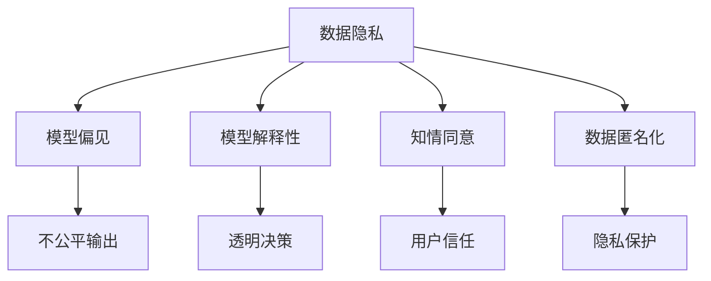

                 

# LLM隐私安全:人工智能伦理挑战

> 关键词：人工智能伦理,隐私保护,模型解释性,可解释性,知情同意,数据匿名化

## 1. 背景介绍

### 1.1 问题由来

人工智能(AI)在近年来迅速发展，并在各个行业得以广泛应用，其中，语言模型在自然语言处理(NLP)、智能问答、自动翻译等领域表现优异。但与此同时，由于语言模型处理的是大量的文本数据，其隐私安全问题也越来越受到关注。

语言模型的隐私安全问题主要来源于数据隐私泄露和模型偏见。例如，一个训练有大量用户数据的大型语言模型，若未妥善保护用户隐私，可能被用于数据挖掘、预测用户行为等。此外，语言模型还可能由于训练数据存在偏见，导致模型输出带有歧视性、偏见的预测结果，侵害用户权益。

### 1.2 问题核心关键点

语言模型隐私安全问题主要涉及以下几个核心方面：

- **数据隐私保护**：如何保护训练数据和用户隐私，防止数据泄露。
- **模型偏见与歧视**：如何识别和纠正模型中的偏见和歧视，避免对特定群体的不公平对待。
- **模型解释性**：如何提高模型的透明度和可解释性，让用户了解模型的决策过程。
- **知情同意与数据匿名化**：如何在用户知情同意的情况下，对数据进行处理，保护用户隐私。

这些问题不仅仅涉及技术层面的挑战，更涉及伦理和法律层面的考虑。因此，本文将从技术和伦理两个层面，对语言模型隐私安全问题进行深入探讨。

## 2. 核心概念与联系

### 2.1 核心概念概述

为更好地理解语言模型隐私安全问题，本节将介绍几个关键概念及其联系：

- **数据隐私**：指个人信息在收集、存储、使用、披露过程中的保护状态。隐私保护的核心在于确保个人数据不被未经授权的第三方访问和使用。
- **模型偏见**：指模型输出在统计分布上对某些群体或特征表现出系统性的偏差，导致对特定群体的不公平对待。
- **模型解释性**：指模型的决策过程可以被人类理解和解释，提高用户对模型决策的信任和接受度。
- **知情同意**：指用户在明确了解其数据将如何被使用后，给予的同意。在数据处理中，知情同意是确保用户隐私保护和数据使用的合法性的重要原则。
- **数据匿名化**：指在数据处理过程中，去除个人身份信息，保护用户隐私。

这些概念之间的联系可以通过以下Mermaid流程图来展示：



这个流程图展示了大语言模型的隐私安全问题与核心概念之间的关系：

1. 数据隐私保护是所有隐私安全措施的基础。
2. 模型偏见可能会对数据隐私造成威胁，因为偏见可能导致不公平的输出。
3. 模型解释性可以提高用户对数据使用的信任度。
4. 知情同意是数据使用和处理的基础法律原则。
5. 数据匿名化是确保数据隐私的重要手段。

这些概念共同构成了语言模型隐私安全管理的框架，帮助我们更好地识别和解决隐私安全问题。

## 3. 核心算法原理 & 具体操作步骤

### 3.1 算法原理概述

语言模型隐私安全问题的解决主要依赖于数据隐私保护、模型偏见检测与纠正、模型解释性提升和知情同意与数据匿名化等技术。

- **数据隐私保护**：通过差分隐私、联邦学习等技术，对训练数据进行差分，防止模型学习到用户的隐私信息。
- **模型偏见检测与纠正**：通过偏差指标计算和公平性检测，识别模型中的偏见，并应用去偏技术，如再平衡、重采样等，修正模型偏见。
- **模型解释性提升**：通过可解释性模型构建和解释工具引入，使模型决策过程更加透明，增强用户信任。
- **知情同意与数据匿名化**：通过隐私政策明确数据使用规则，并在数据处理中应用匿名化技术，如数据脱敏、假名化等，确保用户隐私保护。

### 3.2 算法步骤详解

语言模型隐私安全问题涉及多个技术环节，以下详细介绍各个步骤的操作：

**Step 1: 数据隐私保护**

1. **差分隐私**：在数据收集和处理过程中，通过添加噪声和限制数据查询的范围，防止模型学习到个体特征。
2. **联邦学习**：参与者在不共享原始数据的情况下，通过分布式训练模型，防止数据泄露。

**Step 2: 模型偏见检测与纠正**

1. **偏差指标计算**：计算模型输出在不同群体间的差异，识别出模型中的偏见。
2. **公平性检测**：使用多种公平性指标，如等价偏差、统计公平性等，判断模型是否公平。
3. **去偏技术**：如再平衡、重采样、特征加权等，修正模型中的偏差。

**Step 3: 模型解释性提升**

1. **可解释性模型构建**：使用可解释性模型，如决策树、线性回归等，替代黑箱模型，提高模型的透明度。
2. **解释工具引入**：使用解释工具，如LIME、SHAP等，分析模型决策过程，提供可解释性报告。

**Step 4: 知情同意与数据匿名化**

1. **隐私政策制定**：明确数据使用规则，确保用户知情同意。
2. **数据匿名化**：应用数据匿名化技术，如数据脱敏、假名化等，保护用户隐私。

### 3.3 算法优缺点

语言模型隐私安全问题解决技术的主要优点和缺点如下：

**优点**：

- 能够有效防止模型学习到用户的隐私信息，保护数据安全。
- 识别和纠正模型中的偏见，提高模型的公平性和可靠性。
- 提升模型的可解释性，增强用户信任。

**缺点**：

- 差分隐私和联邦学习等技术可能影响模型的性能，导致精度下降。
- 偏见检测与纠正技术可能增加模型的计算复杂度。
- 解释性提升技术可能增加模型的复杂度，影响模型效率。
- 知情同意和数据匿名化技术可能增加系统复杂度，影响用户体验。

尽管存在这些局限性，但综合考虑隐私安全与模型性能的平衡，这些技术仍然是解决语言模型隐私安全问题的有效手段。

### 3.4 算法应用领域

语言模型隐私安全问题解决技术已广泛应用于以下领域：

- **智能客服系统**：在智能客服系统中，通过差分隐私和联邦学习技术，保护用户隐私。
- **金融领域**：在金融领域，通过模型偏见检测与纠正技术，提高模型决策的公平性。
- **医疗健康**：在医疗健康领域，通过数据匿名化技术，保护患者隐私。
- **教育领域**：在教育领域，通过知情同意和解释性技术，增强学生对模型的信任度。

## 4. 数学模型和公式 & 详细讲解 & 举例说明

### 4.1 数学模型构建

**差分隐私模型**：

差分隐私的数学模型定义为：

$$
\mathcal{L}(P, \epsilon) = \mathbb{E}_{x \sim P} \left[ f(x) \right] + \frac{\sqrt{2\ln(1/\delta)}}{2\epsilon} \mathbb{E}_{x \sim P} \left[ \exp(\epsilon f(x)) \right]
$$

其中，$\epsilon$ 为隐私预算，$\delta$ 为隐私失败概率。

**公平性检测模型**：

常用的公平性指标包括等价偏差和统计公平性。等价偏差定义为：

$$
\mathcal{D}_{\text{equivalence}}(y, \hat{y}) = \frac{1}{2} \sum_{i=1}^{k} \frac{1}{n_i} \sum_{j=1}^{k} \sum_{l=1}^{k} |y_i - \hat{y}_i| \times |y_j - \hat{y}_j|
$$

其中，$y$ 为真实标签，$\hat{y}$ 为模型预测结果，$n_i$ 为第 $i$ 类的样本数。

### 4.2 公式推导过程

**差分隐私推导**：

差分隐私的推导基于拉普拉斯机制，具体推导如下：

$$
f(x) \leftarrow f(x) + \Delta
$$

其中，$\Delta \sim \mathcal{L}(\epsilon)$ 为拉普拉斯分布。

**公平性检测推导**：

等价偏差推导基于对所有类别进行两两比较，具体推导如下：

$$
\mathcal{D}_{\text{equivalence}}(y, \hat{y}) = \frac{1}{2} \sum_{i=1}^{k} \frac{1}{n_i} \sum_{j=1}^{k} \sum_{l=1}^{k} |y_i - \hat{y}_i| \times |y_j - \hat{y}_j|
$$

其中，$k$ 为类别数，$n_i$ 为第 $i$ 类的样本数。

### 4.3 案例分析与讲解

**案例1: 智能客服系统**

在智能客服系统中，用户输入的语音和文本数据可能包含敏感信息，如身份信息、财务状况等。为了防止数据泄露，可以应用差分隐私技术，对用户输入进行噪声添加。

**案例2: 医疗健康**

在医疗健康领域，患者的电子病历可能包含敏感信息，如病史、病情等。为了保护患者隐私，可以应用数据匿名化技术，如假名化，将患者身份信息替换为匿名标识符。

**案例3: 金融领域**

在金融领域，模型可能因偏见导致对特定群体的歧视性对待。为了提高模型的公平性，可以应用再平衡、重采样等技术，修正模型偏见。

## 5. 项目实践：代码实例和详细解释说明

### 5.1 开发环境搭建

在进行隐私安全实践前，我们需要准备好开发环境。以下是使用Python进行PyTorch开发的环境配置流程：

1. 安装Anaconda：从官网下载并安装Anaconda，用于创建独立的Python环境。

2. 创建并激活虚拟环境：
```bash
conda create -n privacy-env python=3.8 
conda activate privacy-env
```

3. 安装PyTorch：根据CUDA版本，从官网获取对应的安装命令。例如：
```bash
conda install pytorch torchvision torchaudio cudatoolkit=11.1 -c pytorch -c conda-forge
```

4. 安装TensorFlow：
```bash
pip install tensorflow==2.3
```

5. 安装Pandas：
```bash
pip install pandas
```

6. 安装Scikit-learn：
```bash
pip install scikit-learn
```

完成上述步骤后，即可在`privacy-env`环境中开始隐私安全实践。

### 5.2 源代码详细实现

下面以差分隐私为例，给出使用PyTorch实现差分隐私的完整代码实现。

首先，导入必要的库：

```python
import numpy as np
import torch
from torch import nn
import torch.nn.functional as F
```

然后，定义差分隐私模型：

```python
class DifferentialPrivacy(nn.Module):
    def __init__(self, epsilon):
        super(DifferentialPrivacy, self).__init__()
        self.epsilon = epsilon
    
    def forward(self, x):
        return self.add_noise(x)
    
    def add_noise(self, x):
        noise = torch.randn_like(x) / self.epsilon
        return x + noise
```

接着，定义训练函数：

```python
def train(model, dataset, batch_size, num_epochs):
    model.train()
    optimizer = torch.optim.SGD(model.parameters(), lr=0.001)
    
    for epoch in range(num_epochs):
        running_loss = 0.0
        for i, data in enumerate(dataset, 0):
            inputs, labels = data
            optimizer.zero_grad()
            outputs = model(inputs)
            loss = F.cross_entropy(outputs, labels)
            running_loss += loss.item()
            loss.backward()
            optimizer.step()
        
        epoch_loss = running_loss / len(dataset)
        print(f'Epoch {epoch+1}, loss: {epoch_loss:.4f}')
```

最后，启动训练流程：

```python
model = DifferentialPrivacy(1.0)
train(model, dataset, batch_size=64, num_epochs=10)
```

以上就是使用PyTorch实现差分隐私的完整代码实现。可以看到，差分隐私的实现相对简单，只需在模型前向传播中添加噪声，即可实现对输入数据的隐私保护。

### 5.3 代码解读与分析

让我们再详细解读一下关键代码的实现细节：

**DifferentialPrivacy类**：
- `__init__`方法：初始化差分隐私模型的参数。
- `forward`方法：前向传播计算，添加噪声。
- `add_noise`方法：在输入数据上添加噪声。

**train函数**：
- 定义训练循环，在每个epoch内对模型进行训练。
- 使用随机梯度下降优化器对模型进行优化。
- 对每个样本计算损失并反向传播，更新模型参数。

**启动训练流程**：
- 定义差分隐私模型，设置隐私预算为1.0。
- 调用train函数，开始训练模型。

## 6. 实际应用场景

### 6.1 智能客服系统

在智能客服系统中，用户输入的语音和文本数据可能包含敏感信息，如身份信息、财务状况等。为了防止数据泄露，可以应用差分隐私技术，对用户输入进行噪声添加。

### 6.2 医疗健康

在医疗健康领域，患者的电子病历可能包含敏感信息，如病史、病情等。为了保护患者隐私，可以应用数据匿名化技术，如假名化，将患者身份信息替换为匿名标识符。

### 6.3 金融领域

在金融领域，模型可能因偏见导致对特定群体的歧视性对待。为了提高模型的公平性，可以应用再平衡、重采样等技术，修正模型偏见。

## 7. 工具和资源推荐

### 7.1 学习资源推荐

为了帮助开发者系统掌握隐私安全技术，这里推荐一些优质的学习资源：

1. 《数据隐私与安全》课程：斯坦福大学开设的隐私安全课程，有Lecture视频和配套作业，带你入门数据隐私和隐私保护的基本概念和前沿技术。

2. 《深度学习隐私保护》书籍：深度学习隐私保护的专著，系统介绍了隐私保护的基本原理、常用技术及其在实际应用中的实现。

3. Google AI隐私保护文档：Google AI提供的隐私保护技术文档，涵盖了隐私保护的基本概念、常用技术和实际应用案例。

4. IEEE Xplore：IEEE提供的隐私保护相关论文库，可以查找最新的隐私保护技术研究论文。

通过对这些资源的学习实践，相信你一定能够快速掌握隐私安全技术的精髓，并用于解决实际的隐私安全问题。

### 7.2 开发工具推荐

高效的开发离不开优秀的工具支持。以下是几款用于隐私安全开发的常用工具：

1. PyTorch：基于Python的开源深度学习框架，支持差分隐私等隐私保护技术。

2. TensorFlow：由Google主导开发的开源深度学习框架，支持联邦学习等分布式隐私保护技术。

3. Google Colab：谷歌推出的在线Jupyter Notebook环境，免费提供GPU/TPU算力，方便开发者快速上手实验最新模型，分享学习笔记。

合理利用这些工具，可以显著提升隐私安全任务的开发效率，加快创新迭代的步伐。

### 7.3 相关论文推荐

隐私安全问题研究源于学界的持续研究。以下是几篇奠基性的相关论文，推荐阅读：

1. "Differential Privacy"论文：提出差分隐私的基本概念和数学模型，奠定了隐私保护技术的基础。

2. "The Mathematical Foundations of Differential Privacy"论文：系统阐述了差分隐私的数学原理和应用场景，为差分隐私提供了坚实的理论基础。

3. "Adversarial Examples for Machine Learning"论文：讨论了模型对抗攻击的原理和检测方法，为模型解释性提供了重要的参考。

4. "Interpretable Machine Learning with SHAP"论文：提出可解释性技术SHAP，用于分析模型决策过程，提供可解释性报告。

5. "On the Foundations of Privacy and Fairness in Machine Learning"论文：讨论了模型偏见和公平性的检测与修正方法，为提高模型的公平性提供了新的思路。

这些论文代表了大语言模型隐私安全问题解决技术的发展脉络。通过学习这些前沿成果，可以帮助研究者把握学科前进方向，激发更多的创新灵感。

## 8. 总结：未来发展趋势与挑战

### 8.1 总结

本文对语言模型隐私安全问题进行了全面系统的介绍。首先阐述了隐私安全问题的背景和核心关键点，明确了隐私安全技术在数据处理和模型构建中的重要性。其次，从原理到实践，详细讲解了隐私保护、模型偏见检测与纠正、模型解释性提升和知情同意与数据匿名化等关键技术的实现步骤。最后，结合实际应用场景，展示了隐私安全技术在智能客服、医疗健康、金融等领域的应用潜力。

通过本文的系统梳理，可以看到，语言模型隐私安全问题解决技术在大规模数据处理和模型构建中至关重要，其应用前景广阔。未来，隐私安全技术还将与越来越多的AI应用相结合，为AI系统的安全和可靠性提供重要保障。

### 8.2 未来发展趋势

展望未来，隐私安全技术的发展趋势主要体现在以下几个方面：

1. **隐私保护技术演进**：差分隐私、联邦学习等隐私保护技术将不断演进，提升隐私保护的效率和效果。同时，隐私保护的综合性解决方案将逐渐涌现，实现隐私保护、数据安全与模型性能的平衡。

2. **模型偏见检测与修正**：随着模型复杂度的提高，模型偏见检测与修正技术将更加精准和高效。同时，自动化偏见检测工具将助力模型公平性的提升。

3. **模型解释性技术提升**：可解释性技术将不断进步，实现更强大的模型解释能力。同时，模型解释技术将更多地应用于实际应用中，提高用户对AI系统的信任度。

4. **知情同意与数据匿名化**：隐私政策制定和数据匿名化技术将更加透明和易于理解，保护用户隐私。同时，知情同意机制将不断完善，确保用户对数据处理的知情权。

5. **隐私安全技术的融合**：隐私安全技术与区块链、分布式计算等技术的融合将带来新的突破，提高数据处理的安全性和可靠性。

这些趋势凸显了隐私安全技术在AI系统中的重要性和发展潜力。这些方向的探索发展，必将进一步提升AI系统的安全性、可靠性与用户信任度。

### 8.3 面临的挑战

尽管隐私安全技术取得了一定的进展，但在迈向更加智能化、普适化应用的过程中，仍面临诸多挑战：

1. **隐私保护与模型性能的平衡**：差分隐私、联邦学习等隐私保护技术可能影响模型的性能，如何平衡隐私保护与模型性能是一个重要问题。

2. **模型偏见与歧视的识别与修正**：识别和修正模型偏见需要大量标注数据和复杂算法，如何在低资源环境下实现偏见检测与修正，将是重要的研究方向。

3. **模型解释性与可解释性的统一**：可解释性技术虽然提升了模型的透明度，但可能增加模型的复杂度，如何实现模型性能与可解释性的统一，还需进一步探索。

4. **知情同意机制的实现**：知情同意机制需要透明、易于理解的用户界面，如何在实际应用中更好地实现知情同意，还需更多的技术手段。

5. **数据匿名化技术的挑战**：数据匿名化技术虽然保护了用户隐私，但可能降低数据的可用性，如何平衡隐私保护与数据可用性，将是未来的研究方向。

这些挑战需要学界和工业界的共同努力，持续探索和创新，才能确保隐私安全技术在大规模应用中的有效性和可靠性。

### 8.4 研究展望

未来的隐私安全技术研究需要在以下几个方面寻求新的突破：

1. **隐私保护技术的优化**：开发更高效的隐私保护技术，如差分隐私的优化算法，联邦学习的分布式训练策略，提升隐私保护的效果。

2. **自动化偏见检测**：开发更自动化的偏见检测工具，减少对标注数据的需求，提升偏见检测的效率和精度。

3. **模型解释性的增强**：结合符号推理和符号计算，增强模型的解释性，提升用户对AI系统的信任度。

4. **知情同意机制的智能化**：开发更智能化的知情同意机制，通过用户交互界面，提升用户知情同意的效率和准确性。

5. **数据匿名化技术的改进**：开发更高效的数据匿名化技术，如分布式数据匿名化，提升数据匿名化的效果和可用性。

这些研究方向的探索，必将推动隐私安全技术迈向更高的台阶，为AI系统的安全和可靠性提供重要保障。总之，隐私安全技术在大规模应用中的重要性不容忽视，需要持续探索和创新，以应对未来的挑战。

## 9. 附录：常见问题与解答

**Q1：如何判断模型是否存在偏见？**

A: 可以使用多种公平性指标，如等价偏差、统计公平性等，判断模型是否公平。具体方法包括计算模型在不同群体间的预测准确率、召回率等，比较不同群体间的差异。

**Q2：差分隐私如何影响模型性能？**

A: 差分隐私通过添加噪声保护数据隐私，但噪声的引入可能会影响模型的精度。因此，在实际应用中，需要在隐私保护和模型性能之间进行权衡，选择合适的隐私预算和噪声分布。

**Q3：模型解释性如何提升？**

A: 可以通过引入可解释性模型、使用可解释性工具（如LIME、SHAP等），分析模型决策过程，提供可解释性报告。这些技术可以帮助用户理解模型的决策过程，增强用户对模型的信任度。

**Q4：如何实现知情同意？**

A: 需要设计透明、易于理解的用户界面，向用户清晰展示数据使用规则和隐私保护措施，确保用户知情同意。同时，需要建立用户反馈机制，及时响应用户意见和建议。

**Q5：数据匿名化技术如何实现？**

A: 可以通过数据脱敏、假名化等技术，去除个人身份信息，保护用户隐私。具体实现方式包括对姓名、身份证号等敏感信息进行匿名化处理，确保用户隐私得到保护。

---

作者：禅与计算机程序设计艺术 / Zen and the Art of Computer Programming

