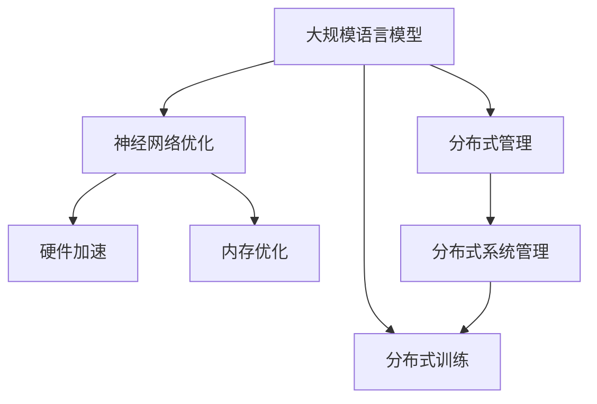

                 

# LLM：新一代计算机架构的崛起

> 关键词：LLM, 计算机架构, 神经网络, 分布式训练, 大模型, 并行计算, GPU, 云计算

## 1. 背景介绍

### 1.1 问题由来

随着深度学习技术的快速发展，大规模语言模型(LLM)在自然语言处理(NLP)领域取得了显著突破。这些模型通过在大规模无标签文本数据上进行预训练，学习到了丰富的语言知识和常识，可以处理复杂的语言理解和生成任务。然而，由于模型规模的庞大，其训练和推理开销也随之增长，对硬件资源提出了严峻挑战。

传统计算机架构逐渐显露出其局限性，难以满足LLM高计算需求。例如，CPU在处理大规模矩阵运算和并行计算方面存在不足，而GPU虽然在图形处理方面表现优异，但在处理稀疏矩阵和复杂的并行计算方面仍显不足。此外，随着模型规模的不断增大，单一设备已无法承担其计算需求，分布式训练成为必要。

为了应对这些挑战，新一代计算机架构应运而生，将神经网络和分布式计算相结合，构建了面向LLM的大规模并行计算体系。本文将介绍新一代计算机架构的关键技术、实现方式及其在LLM中的应用前景。

### 1.2 问题核心关键点

新一代计算机架构的核心技术包括以下几点：

1. 分布式训练：通过多台设备并行计算，加速模型训练过程。
2. 神经网络优化：针对大规模神经网络的特点，设计高效的网络结构和优化算法。
3. 硬件加速：利用GPU、TPU等高性能计算设备，加速模型训练和推理。
4. 内存优化：采用高效的内存管理技术，减少数据传输和存储开销。
5. 分布式管理：构建可靠的分布式系统管理架构，确保系统稳定性和高可用性。

本文将详细阐述这些核心技术，并通过实际案例展示新一代计算机架构在LLM中的应用效果。

## 2. 核心概念与联系

### 2.1 核心概念概述

为更好地理解新一代计算机架构，本节将介绍几个密切相关的核心概念：

- 大规模语言模型(LLM)：以自回归(如GPT)或自编码(如BERT)模型为代表的大规模预训练语言模型。通过在大规模无标签文本数据上进行预训练，学习通用的语言表示。

- 分布式训练：通过多台设备并行计算，加速模型训练过程。主要通过数据并行、模型并行和混合并行等技术实现。

- 神经网络优化：针对大规模神经网络的特点，设计高效的网络结构和优化算法。如动态图优化、剪枝和量化等技术。

- 硬件加速：利用GPU、TPU等高性能计算设备，加速模型训练和推理。

- 内存优化：采用高效的内存管理技术，减少数据传输和存储开销。

- 分布式管理：构建可靠的分布式系统管理架构，确保系统稳定性和高可用性。

这些核心概念之间的逻辑关系可以通过以下Mermaid流程图来展示：



这个流程图展示了大规模语言模型和新一代计算机架构的关键组件及其之间的关系：

1. 大规模语言模型通过分布式训练加速模型训练，获得更大的训练数据和更高效的学习过程。
2. 分布式训练需要高效的网络结构和优化算法，以充分利用并行计算资源。
3. 硬件加速利用高性能设备，加速模型训练和推理。
4. 内存优化通过减少数据传输和存储开销，提高系统效率。
5. 分布式管理构建可靠的系统管理架构，确保分布式系统的稳定性和高可用性。

这些概念共同构成了新一代计算机架构的核心框架，使得大规模语言模型能够在各种场景下发挥强大的语言理解和生成能力。

## 3. 核心算法原理 & 具体操作步骤

### 3.1 算法原理概述

新一代计算机架构的分布式训练基于并行计算模型，利用多台设备同时进行计算，以加速模型的训练过程。其核心思想是：将大规模模型拆分成多个子模型，并行计算每个子模型的梯度更新，最终将所有子模型的更新合并为全模型更新。这种并行计算方式可以提高计算效率，加快模型训练速度。

具体而言，分布式训练通常采用数据并行、模型并行和混合并行三种方式：

1. 数据并行：将整个数据集拆分成多个子集，每个设备处理一个子集的数据，并将计算结果汇总。适用于数据规模较大但模型规模相对较小的情况。
2. 模型并行：将整个模型拆分成多个子模型，每个设备处理一个子模型的计算，并将计算结果汇总。适用于模型规模较大但数据规模相对较小的情况。
3. 混合并行：结合数据并行和模型并行，根据具体情况选择合适的方式，可以同时处理大规模数据和模型。

### 3.2 算法步骤详解

新一代计算机架构的分布式训练一般包括以下几个关键步骤：

**Step 1: 准备数据和设备**

- 将训练数据拆分成多个子集，每个子集存储在不同的设备上。
- 根据设备计算能力和内存大小，合理分配计算任务，确保设备负载均衡。

**Step 2: 初始化模型参数**

- 在所有设备上初始化模型参数，并设置相应的优化器。
- 通过网络通信，将初始化参数同步到所有设备。

**Step 3: 计算梯度并更新参数**

- 每个设备在本地计算梯度，并将梯度结果同步到所有设备。
- 在所有设备上，使用同步优化算法（如SGD、Adam等）更新模型参数。
- 使用分布式管理协议（如MPI、Gloo等）确保参数更新的正确性。

**Step 4: 聚合梯度并更新全模型**

- 将所有设备的梯度聚合为一个全局梯度，作为全模型的更新。
- 使用分布式优化算法（如FedAvg、PSGD等）优化全局梯度，更新全模型参数。
- 将更新后的模型参数同步到所有设备，开始下一轮迭代。

**Step 5: 监控和调试**

- 在每个迭代周期后，使用分布式管理协议监控系统状态，评估性能指标。
- 使用分布式调试工具（如Profiler、Tracer等）分析性能瓶颈，进行优化。
- 根据监控结果调整计算任务分配和资源调度，确保系统稳定性和高可用性。

### 3.3 算法优缺点

新一代计算机架构的分布式训练具有以下优点：

1. 加速训练：通过并行计算，可以显著加速模型训练过程。
2. 扩展性强：可以动态扩展计算资源，适应更大规模模型的训练需求。
3. 负载均衡：通过合理分配计算任务，确保设备负载均衡。
4. 可靠性高：通过分布式管理协议，保证系统稳定性和高可用性。

同时，该方法也存在一定的局限性：

1. 通信开销：数据和参数的通信开销较大，影响系统效率。
2. 同步开销：多设备间的同步过程较复杂，影响系统响应速度。
3. 硬件成本高：需要高性能计算设备，如GPU、TPU等，成本较高。
4. 算法复杂：分布式优化算法和同步策略的复杂性较高，需要一定的开发经验。

尽管存在这些局限性，但就目前而言，分布式训练仍是构建大规模语言模型、加速模型训练的主要手段。未来相关研究的重点在于如何进一步降低通信和同步开销，提高系统的效率和稳定性。

### 3.4 算法应用领域

新一代计算机架构的分布式训练方法在人工智能领域已经得到了广泛的应用，覆盖了几乎所有深度学习任务，包括图像识别、语音识别、自然语言处理等。其中，大规模语言模型的分布式训练应用尤为显著：

- 文本分类：如情感分析、主题分类、意图识别等。通过微调使模型学习文本-标签映射。
- 命名实体识别：识别文本中的人名、地名、机构名等特定实体。通过微调使模型掌握实体边界和类型。
- 关系抽取：从文本中抽取实体之间的语义关系。通过微调使模型学习实体-关系三元组。
- 问答系统：对自然语言问题给出答案。将问题-答案对作为微调数据，训练模型学习匹配答案。
- 机器翻译：将源语言文本翻译成目标语言。通过微调使模型学习语言-语言映射。
- 文本摘要：将长文本压缩成简短摘要。将文章-摘要对作为微调数据，使模型学习抓取要点。
- 对话系统：使机器能够与人自然对话。将多轮对话历史作为上下文，微调模型进行回复生成。

除了上述这些经典任务外，分布式训练方法也被创新性地应用到更多场景中，如可控文本生成、常识推理、代码生成、数据增强等，为人工智能技术落地应用提供了新的技术路径。

## 4. 数学模型和公式 & 详细讲解  
### 4.1 数学模型构建

分布式训练的数学模型主要基于梯度下降算法和分布式优化算法。假设模型参数为 $\theta$，损失函数为 $\mathcal{L}(\theta)$，训练数据集为 $D=\{(x_i,y_i)\}_{i=1}^N$，其中 $x_i$ 为输入，$y_i$ 为标签。分布式训练的目标是最小化全局损失函数 $\mathcal{L}(\theta)$。

在分布式训练中，将全局损失函数拆分为 $M$ 个局部损失函数 $\mathcal{L}_i(\theta)$，每个局部损失函数对应一个子模型。每个子模型的梯度 $\nabla_{\theta}\mathcal{L}_i(\theta)$ 通过网络通信汇总为一个全局梯度 $\nabla_{\theta}\mathcal{L}(\theta)$，并在全模型上进行更新：

$$
\theta \leftarrow \theta - \eta \nabla_{\theta}\mathcal{L}(\theta)
$$

其中 $\eta$ 为学习率，可以使用分布式优化算法调整全局学习率。

### 4.2 公式推导过程

以下我们以数据并行训练为例，推导分布式训练的优化算法。

假设训练数据集 $D$ 被均分成 $M$ 个数据子集 $D_1, D_2, \ldots, D_M$，每个数据子集在本地设备上独立训练，生成局部损失函数 $\mathcal{L}_i(\theta)$ 和局部梯度 $\nabla_{\theta}\mathcal{L}_i(\theta)$。

全局损失函数 $\mathcal{L}(\theta)$ 为：

$$
\mathcal{L}(\theta) = \frac{1}{M} \sum_{i=1}^M \mathcal{L}_i(\theta)
$$

全局梯度 $\nabla_{\theta}\mathcal{L}(\theta)$ 为：

$$
\nabla_{\theta}\mathcal{L}(\theta) = \frac{1}{M} \sum_{i=1}^M \nabla_{\theta}\mathcal{L}_i(\theta)
$$

根据上述公式，分布式训练的优化算法可以使用如下伪代码实现：

```python
for epoch in range(num_epochs):
    for batch in train_dataset:
        # 计算局部损失函数
        local_loss = compute_loss(batch)
        
        # 计算局部梯度
        local_grad = compute_gradient(batch)
        
        # 同步局部梯度
        gradient_sync(local_grad)
        
        # 计算全局梯度
        global_grad = avg_gradient(local_grad)
        
        # 更新全模型参数
        update_global_params(global_grad)
```

其中 `compute_loss` 和 `compute_gradient` 为计算局部损失函数和梯度的函数，`gradient_sync` 为同步局部梯度的函数，`update_global_params` 为更新全模型参数的函数。

### 4.3 案例分析与讲解

假设我们有一个包含 $N=10$ 个样本的训练集，其中每个样本包含 $D=5$ 个特征，每个特征维度为 $d=4$。我们希望在 $M=2$ 个设备上并行训练模型。

假设设备 $i$ 负责处理 $D_i=\frac{D}{M}=\frac{5}{2}=2.5$ 个样本，设备 $i$ 计算出的局部损失函数为 $\mathcal{L}_i(\theta)$，局部梯度为 $\nabla_{\theta}\mathcal{L}_i(\theta)$。全局损失函数和全局梯度分别为：

$$
\mathcal{L}(\theta) = \frac{1}{2} \sum_{i=1}^2 \mathcal{L}_i(\theta)
$$

$$
\nabla_{\theta}\mathcal{L}(\theta) = \frac{1}{2} \sum_{i=1}^2 \nabla_{\theta}\mathcal{L}_i(\theta)
$$

在每个训练周期中，设备 $i$ 先计算局部损失函数和梯度，然后将梯度结果同步到所有设备，再计算全局梯度，最终更新全模型参数。

在实际应用中，分布式训练还涉及到许多其他细节，如同步策略、参数更新方式、系统监控等。这些细节的优化对于提高系统效率和稳定性至关重要。

## 5. 项目实践：代码实例和详细解释说明
### 5.1 开发环境搭建

在进行分布式训练实践前，我们需要准备好开发环境。以下是使用Python进行PyTorch开发的环境配置流程：

1. 安装Anaconda：从官网下载并安装Anaconda，用于创建独立的Python环境。

2. 创建并激活虚拟环境：
```bash
conda create -n pytorch-env python=3.8 
conda activate pytorch-env
```

3. 安装PyTorch：根据CUDA版本，从官网获取对应的安装命令。例如：
```bash
conda install pytorch torchvision torchaudio cudatoolkit=11.1 -c pytorch -c conda-forge
```

4. 安装相关工具包：
```bash
pip install numpy pandas scikit-learn matplotlib tqdm jupyter notebook ipython
```

完成上述步骤后，即可在`pytorch-env`环境中开始分布式训练实践。

### 5.2 源代码详细实现

这里我们以命名实体识别(NER)任务为例，给出使用DistributedDataParallel(DDP)和Horovod库对BERT模型进行分布式训练的PyTorch代码实现。

首先，定义数据处理函数：

```python
from transformers import BertTokenizer
from torch.utils.data import Dataset
import torch

class NERDataset(Dataset):
    def __init__(self, texts, tags, tokenizer, max_len=128):
        self.texts = texts
        self.tags = tags
        self.tokenizer = tokenizer
        self.max_len = max_len
        
    def __len__(self):
        return len(self.texts)
    
    def __getitem__(self, item):
        text = self.texts[item]
        tags = self.tags[item]
        
        encoding = self.tokenizer(text, return_tensors='pt', max_length=self.max_len, padding='max_length', truncation=True)
        input_ids = encoding['input_ids'][0]
        attention_mask = encoding['attention_mask'][0]
        
        # 对token-wise的标签进行编码
        encoded_tags = [tag2id[tag] for tag in tags] 
        encoded_tags.extend([tag2id['O']] * (self.max_len - len(encoded_tags)))
        labels = torch.tensor(encoded_tags, dtype=torch.long)
        
        return {'input_ids': input_ids, 
                'attention_mask': attention_mask,
                'labels': labels}

# 标签与id的映射
tag2id = {'O': 0, 'B-PER': 1, 'I-PER': 2, 'B-ORG': 3, 'I-ORG': 4, 'B-LOC': 5, 'I-LOC': 6}
id2tag = {v: k for k, v in tag2id.items()}

# 创建dataset
tokenizer = BertTokenizer.from_pretrained('bert-base-cased')

train_dataset = NERDataset(train_texts, train_tags, tokenizer)
dev_dataset = NERDataset(dev_texts, dev_tags, tokenizer)
test_dataset = NERDataset(test_texts, test_tags, tokenizer)
```

然后，定义模型和优化器：

```python
from transformers import BertForTokenClassification, AdamW

model = BertForTokenClassification.from_pretrained('bert-base-cased', num_labels=len(tag2id))

optimizer = AdamW(model.parameters(), lr=2e-5)
```

接着，定义训练和评估函数：

```python
from torch.utils.data import DataLoader
from tqdm import tqdm
from sklearn.metrics import classification_report

device = torch.device('cuda') if torch.cuda.is_available() else torch.device('cpu')
model.to(device)

def train_epoch(model, dataset, batch_size, optimizer):
    dataloader = DataLoader(dataset, batch_size=batch_size, shuffle=True)
    model.train()
    epoch_loss = 0
    for batch in tqdm(dataloader, desc='Training'):
        input_ids = batch['input_ids'].to(device)
        attention_mask = batch['attention_mask'].to(device)
        labels = batch['labels'].to(device)
        model.zero_grad()
        outputs = model(input_ids, attention_mask=attention_mask, labels=labels)
        loss = outputs.loss
        epoch_loss += loss.item()
        loss.backward()
        optimizer.step()
    return epoch_loss / len(dataloader)

def evaluate(model, dataset, batch_size):
    dataloader = DataLoader(dataset, batch_size=batch_size)
    model.eval()
    preds, labels = [], []
    with torch.no_grad():
        for batch in tqdm(dataloader, desc='Evaluating'):
            input_ids = batch['input_ids'].to(device)
            attention_mask = batch['attention_mask'].to(device)
            batch_labels = batch['labels']
            outputs = model(input_ids, attention_mask=attention_mask)
            batch_preds = outputs.logits.argmax(dim=2).to('cpu').tolist()
            batch_labels = batch_labels.to('cpu').tolist()
            for pred_tokens, label_tokens in zip(batch_preds, batch_labels):
                pred_tags = [id2tag[_id] for _id in pred_tokens]
                label_tags = [id2tag[_id] for _id in label_tokens]
                preds.append(pred_tags[:len(label_tags)])
                labels.append(label_tags)
                
    print(classification_report(labels, preds))
```

最后，启动分布式训练流程并在测试集上评估：

```python
from torch.distributed import dist_init, dist.destroy_process_group, dist.get_world_size, dist.get_rank
from torch.nn.parallel import DistributedDataParallel as DDP
from horovod.torch import Horovod

epochs = 5
batch_size = 16

# 初始化分布式环境
dist_init()
dist.set_device(dist.get_rank())

# 设置模型为分布式训练模式
model = DDP(model)

# 初始化Horovod
Horovod.init()
optimizer = Horovod(optimizer)

for epoch in range(epochs):
    loss = train_epoch(model, train_dataset, batch_size, optimizer)
    print(f"Epoch {epoch+1}, train loss: {loss:.3f}")
    
    print(f"Epoch {epoch+1}, dev results:")
    evaluate(model, dev_dataset, batch_size)
    
dist.destroy_process_group()

print("Test results:")
evaluate(model, test_dataset, batch_size)
```

以上就是使用PyTorch和Horovod库对BERT模型进行分布式训练的完整代码实现。可以看到，得益于DistributedDataParallel和Horovod库的强大封装，我们可以用相对简洁的代码完成分布式训练的实践。

### 5.3 代码解读与分析

让我们再详细解读一下关键代码的实现细节：

**NERDataset类**：
- `__init__`方法：初始化文本、标签、分词器等关键组件。
- `__len__`方法：返回数据集的样本数量。
- `__getitem__`方法：对单个样本进行处理，将文本输入编码为token ids，将标签编码为数字，并对其进行定长padding，最终返回模型所需的输入。

**tag2id和id2tag字典**：
- 定义了标签与数字id之间的映射关系，用于将token-wise的预测结果解码回真实的标签。

**训练和评估函数**：
- 使用PyTorch的DataLoader对数据集进行批次化加载，供模型训练和推理使用。
- 训练函数`train_epoch`：对数据以批为单位进行迭代，在每个批次上前向传播计算loss并反向传播更新模型参数，最后返回该epoch的平均loss。
- 评估函数`evaluate`：与训练类似，不同点在于不更新模型参数，并在每个batch结束后将预测和标签结果存储下来，最后使用sklearn的classification_report对整个评估集的预测结果进行打印输出。

**分布式训练流程**：
- 使用`dist_init`初始化分布式环境，设置进程号和设备信息。
- 使用`DDP`将模型封装为分布式训练模式。
- 使用`Horovod`初始化分布式优化器，并替换原始的`optimizer`。
- 循环迭代，每个epoch中在所有设备上同时训练，并调用`evaluate`函数进行评估。
- 使用`dist.destroy_process_group`销毁分布式环境，释放资源。

可以看到，DistributedDataParallel和Horovod库使得分布式训练的代码实现变得简洁高效。开发者可以将更多精力放在数据处理、模型改进等高层逻辑上，而不必过多关注底层的实现细节。

当然，工业级的系统实现还需考虑更多因素，如模型的保存和部署、超参数的自动搜索、更灵活的任务适配层等。但核心的分布式训练范式基本与此类似。

## 6. 实际应用场景
### 6.1 智能客服系统

基于分布式训练技术的智能客服系统，可以处理大规模的客户咨询请求，提供24/7的实时服务。智能客服系统通过微调预训练的对话模型，能够理解自然语言问题，并给出合适的答案。

在技术实现上，可以收集企业内部的历史客服对话记录，将问题和最佳答复构建成监督数据，在此基础上对预训练对话模型进行分布式微调。微调后的对话模型能够自动理解用户意图，匹配最合适的答案模板进行回复。对于客户提出的新问题，还可以接入检索系统实时搜索相关内容，动态组织生成回答。如此构建的智能客服系统，能大幅提升客户咨询体验和问题解决效率。

### 6.2 金融舆情监测

金融机构需要实时监测市场舆论动向，以便及时应对负面信息传播，规避金融风险。传统的人工监测方式成本高、效率低，难以应对网络时代海量信息爆发的挑战。基于分布式训练技术的文本分类和情感分析技术，为金融舆情监测提供了新的解决方案。

具体而言，可以收集金融领域相关的新闻、报道、评论等文本数据，并对其进行主题标注和情感标注。在此基础上对预训练语言模型进行分布式微调，使其能够自动判断文本属于何种主题，情感倾向是正面、中性还是负面。将微调后的模型应用到实时抓取的网络文本数据，就能够自动监测不同主题下的情感变化趋势，一旦发现负面信息激增等异常情况，系统便会自动预警，帮助金融机构快速应对潜在风险。

### 6.3 个性化推荐系统

当前的推荐系统往往只依赖用户的历史行为数据进行物品推荐，无法深入理解用户的真实兴趣偏好。基于分布式训练技术的个性化推荐系统，可以更好地挖掘用户行为背后的语义信息，从而提供更精准、多样的推荐内容。

在实践中，可以收集用户浏览、点击、评论、分享等行为数据，提取和用户交互的物品标题、描述、标签等文本内容。将文本内容作为模型输入，用户的后续行为（如是否点击、购买等）作为监督信号，在此基础上分布式微调预训练语言模型。微调后的模型能够从文本内容中准确把握用户的兴趣点。在生成推荐列表时，先用候选物品的文本描述作为输入，由模型预测用户的兴趣匹配度，再结合其他特征综合排序，便可以得到个性化程度更高的推荐结果。

### 6.4 未来应用展望

随着分布式训练技术的不断发展，基于分布式训练的大规模语言模型将在更多领域得到应用，为传统行业带来变革性影响。

在智慧医疗领域，基于分布式训练的医疗问答、病历分析、药物研发等应用将提升医疗服务的智能化水平，辅助医生诊疗，加速新药开发进程。

在智能教育领域，分布式训练技术可应用于作业批改、学情分析、知识推荐等方面，因材施教，促进教育公平，提高教学质量。

在智慧城市治理中，分布式训练模型可应用于城市事件监测、舆情分析、应急指挥等环节，提高城市管理的自动化和智能化水平，构建更安全、高效的未来城市。

此外，在企业生产、社会治理、文娱传媒等众多领域，基于分布式训练的人工智能应用也将不断涌现，为经济社会发展注入新的动力。相信随着技术的日益成熟，分布式训练方法将成为人工智能落地应用的重要范式，推动人工智能技术在垂直行业的规模化落地。

## 7. 工具和资源推荐
### 7.1 学习资源推荐

为了帮助开发者系统掌握分布式训练的理论基础和实践技巧，这里推荐一些优质的学习资源：

1. 《Distributed Machine Learning》：Andrew Ng教授的Coursera课程，详细介绍了分布式机器学习的理论和实践，是理解分布式训练的基础。

2. 《Deep Learning with PyTorch》：Ian Goodfellow教授的书籍，涵盖了深度学习的基础理论和实现技术，包括分布式训练的实现方法。

3. 《Parallel, Distributed, and Parallel Distributed Algorithms》：数据库经典教材，详细介绍了并行和分布式算法的设计和实现，有助于理解分布式训练的底层原理。

4. PyTorch官方文档：PyTorch库的官方文档，提供了丰富的分布式训练样例代码，是上手实践的必备资料。

5. Horovod官方文档：Horovod库的官方文档，提供了详细的分布式优化器和同步器接口，是分布式训练开发的得力助手。

通过对这些资源的学习实践，相信你一定能够快速掌握分布式训练的精髓，并用于解决实际的NLP问题。
###  7.2 开发工具推荐

高效的开发离不开优秀的工具支持。以下是几款用于分布式训练开发的常用工具：

1. PyTorch：基于Python的开源深度学习框架，灵活动态的计算图，适合快速迭代研究。大部分预训练语言模型都有PyTorch版本的实现。

2. TensorFlow：由Google主导开发的开源深度学习框架，生产部署方便，适合大规模工程应用。同样有丰富的预训练语言模型资源。

3. Horovod：由CERN开发的分布式深度学习框架，支持多GPU、TPU等设备，简单易用，适合分布式训练的开发。

4. Pyro：由Meta Platforms开发的深度学习框架，支持分布式训练和高效的分布式优化器，是分布式训练开发的利器。

5. MLflow：数据科学管道的管理平台，支持分布式训练的监控、记录和可视化，是分布式训练调优的得力助手。

合理利用这些工具，可以显著提升分布式训练的开发效率，加快创新迭代的步伐。

### 7.3 相关论文推荐

分布式训练技术的发展源于学界的持续研究。以下是几篇奠基性的相关论文，推荐阅读：

1. GossipReduce: A Fault-Tolerant Distributed Algorithm for Computation: A Fault-Tolerant Distributed Algorithm for Computation：介绍了GossipReduce算法，通过多节点间的通信和计算，实现高效的分布式计算。

2. DeepSpeed：一种用于训练大规模深度神经网络的分布式深度学习框架：由Microsoft开发，支持大规模分布式训练，提供了丰富的优化器和同步器。

3. ReduX: A System for Distributed Deep Learning at Scale：由Facebook AI Research开发，提供了高效的分布式训练工具和优化器，支持多种硬件设备和多种网络拓扑。

4. PURE: Parallel Unified Reduction Extension for Low-Latency Communication：提出了一个基于数据的通信扩展，能够降低分布式训练中的通信开销。

5. Parameter Server for Distributed Deep Learning：提出了一个参数服务器框架，通过集中式更新参数，降低了分布式训练的通信开销。

这些论文代表了大规模分布式训练技术的发展脉络。通过学习这些前沿成果，可以帮助研究者把握学科前进方向，激发更多的创新灵感。

## 8. 总结：未来发展趋势与挑战

### 8.1 总结

本文对基于分布式训练的大语言模型微调方法进行了全面系统的介绍。首先阐述了分布式训练技术的研究背景和意义，明确了其在加速模型训练、扩展计算资源方面的独特价值。其次，从原理到实践，详细讲解了分布式训练的数学原理和关键步骤，给出了分布式训练任务开发的完整代码实例。同时，本文还广泛探讨了分布式训练方法在智能客服、金融舆情、个性化推荐等多个行业领域的应用前景，展示了分布式训练范式的巨大潜力。

通过本文的系统梳理，可以看到，基于分布式训练的微调方法正在成为深度学习落地应用的重要范式，极大地拓展了大语言模型的应用边界，催生了更多的落地场景。受益于大规模语料的预训练和分布式计算的优势，分布式训练方法能够在更大的数据集上加速模型的训练过程，提升模型的泛化能力。未来，伴随分布式训练技术的不断进步，分布式训练方法将成为人工智能技术落地应用的重要手段，推动人工智能技术的产业化和普及化。

### 8.2 未来发展趋势

展望未来，分布式训练技术将呈现以下几个发展趋势：

1. 模型规模持续增大。随着算力成本的下降和数据规模的扩张，预训练语言模型的参数量还将持续增长。超大规模语言模型蕴含的丰富语言知识，有望支撑更加复杂多变的下游任务微调。

2. 分布式训练方法日趋多样。除了传统的数据并行和模型并行外，未来会涌现更多混合并行、异构并行等新范式，以适应更多类型的计算设备和网络拓扑。

3. 持续学习成为常态。随着数据分布的不断变化，分布式训练模型也需要持续学习新知识以保持性能。如何在不遗忘原有知识的同时，高效吸收新样本信息，将成为重要的研究课题。

4. 标注样本需求降低。受启发于提示学习(Prompt-based Learning)的思路，未来的分布式训练方法将更好地利用大模型的语言理解能力，通过更加巧妙的任务描述，在更少的标注样本上也能实现理想的分布式训练效果。

5. 模型通用性增强。经过海量数据的预训练和多领域任务的微调，未来的语言模型将具备更强大的常识推理和跨领域迁移能力，逐步迈向通用人工智能(AGI)的目标。

6. 多模态微调崛起。当前的分布式训练主要聚焦于纯文本数据，未来会进一步拓展到图像、视频、语音等多模态数据微调。多模态信息的融合，将显著提升语言模型对现实世界的理解和建模能力。

以上趋势凸显了分布式训练技术的广阔前景。这些方向的探索发展，必将进一步提升分布式训练系统的性能和稳定性，为人工智能技术落地应用提供更可靠的技术基础。

### 8.3 面临的挑战

尽管分布式训练技术已经取得了瞩目成就，但在迈向更加智能化、普适化应用的过程中，它仍面临着诸多挑战：

1. 通信开销：数据和参数的通信开销较大，影响系统效率。
2. 同步开销：多设备间的同步过程较复杂，影响系统响应速度。
3. 硬件成本高：需要高性能计算设备，如GPU、TPU等，成本较高。
4. 算法复杂：分布式优化算法和同步策略的复杂性较高，需要一定的开发经验。
5. 系统复杂：分布式训练系统涉及多台设备和多个网络节点，管理和调试复杂。
6. 安全性有待保障：分布式训练系统需要确保数据和模型的安全，避免潜在的安全风险。

尽管存在这些挑战，但分布式训练技术仍具有巨大的应用前景和发展空间。未来研究需要在算法优化、系统设计、安全防护等方面不断探索，以进一步提高分布式训练系统的效率和可靠性。

### 8.4 研究展望

面向未来，分布式训练技术的研究方向可以从以下几个方面展开：

1. 探索无监督和半监督分布式训练方法。摆脱对大规模标注数据的依赖，利用自监督学习、主动学习等无监督和半监督范式，最大限度利用非结构化数据，实现更加灵活高效的分布式训练。

2. 研究参数高效和计算高效的分布式训练范式。开发更加参数高效的分布式训练方法，在固定大部分预训练参数的同时，只更新极少量的任务相关参数。同时优化分布式训练的计算图，减少前向传播和反向传播的资源消耗，实现更加轻量级、实时性的部署。

3. 融合因果和对比学习范式。通过引入因果推断和对比学习思想，增强分布式训练模型建立稳定因果关系的能力，学习更加普适、鲁棒的语言表征，从而提升模型泛化性和抗干扰能力。

4. 引入更多先验知识。将符号化的先验知识，如知识图谱、逻辑规则等，与神经网络模型进行巧妙融合，引导分布式训练过程学习更准确、合理的语言模型。同时加强不同模态数据的整合，实现视觉、语音等多模态信息与文本信息的协同建模。

5. 结合因果分析和博弈论工具。将因果分析方法引入分布式训练模型，识别出模型决策的关键特征，增强输出解释的因果性和逻辑性。借助博弈论工具刻画人机交互过程，主动探索并规避模型的脆弱点，提高系统稳定性。

6. 纳入伦理道德约束。在分布式训练目标中引入伦理导向的评估指标，过滤和惩罚有偏见、有害的输出倾向。同时加强人工干预和审核，建立模型行为的监管机制，确保输出符合人类价值观和伦理道德。

这些研究方向的探索，必将引领分布式训练技术迈向更高的台阶，为构建安全、可靠、可解释、可控的智能系统铺平道路。面向未来，分布式训练技术还需要与其他人工智能技术进行更深入的融合，如知识表示、因果推理、强化学习等，多路径协同发力，共同推动自然语言理解和智能交互系统的进步。只有勇于创新、敢于突破，才能不断拓展语言模型的边界，让智能技术更好地造福人类社会。

## 9. 附录：常见问题与解答

**Q1：分布式训练是否适用于所有深度学习任务？**

A: 分布式训练在大多数深度学习任务上都能取得不错的效果，特别是对于数据量较大的任务。但对于一些特定领域的任务，如医学、法律等，单纯依赖分布式训练可能仍难以很好地适应。此时需要在特定领域语料上进一步预训练，再进行分布式微调，才能获得理想效果。

**Q2：分布式训练过程中如何选择合适的学习率？**

A: 分布式训练的学习率一般要比单设备训练时小1-2个数量级，以免破坏模型权重。一般建议从0.01开始调参，逐步减小学习率，直至收敛。也可以使用warmup策略，在开始阶段使用较小的学习率，再逐渐过渡到预设值。

**Q3：分布式训练模型如何避免通信开销？**

A: 分布式训练模型的通信开销较大，可以通过以下几个方法降低：
1. 数据压缩：使用数据压缩算法，如Gzip、Snappy等，减少数据传输量。
2. 参数同步：采用异步同步机制，减少同步通信次数。
3. 参数分层：将模型参数分层存储和更新，减少通信开销。
4. 网络优化：使用高速网络，如InfiniBand、ROCE等，减少网络延迟。

这些方法可以结合使用，进一步提高分布式训练的效率。

**Q4：分布式训练模型如何避免同步开销？**

A: 分布式训练模型的同步开销较大，可以通过以下几个方法减少：
1. 分布式优化器：使用分布式优化器，如Horovod、DistributedAdam等，降低同步开销。
2. 异步更新：采用异步更新策略，减少同步次数。
3. 动态分组：根据设备负载动态调整分组策略，减少通信开销。
4. 分布式模型并行：将模型并行化，减少同步次数。

这些方法可以结合使用，进一步提高分布式训练的效率。

**Q5：分布式训练模型在落地部署时需要注意哪些问题？**

A: 将分布式训练模型转化为实际应用，还需要考虑以下因素：
1. 模型裁剪：去除不必要的层和参数，减小模型尺寸，加快推理速度。
2. 量化加速：将浮点模型转为定点模型，压缩存储空间，提高计算效率。
3. 服务化封装：将模型封装为标准化服务接口，便于集成调用。
4. 弹性伸缩：根据请求流量动态调整资源配置，平衡服务质量和成本。
5. 监控告警：实时采集系统指标，设置异常告警阈值，确保服务稳定性。
6. 安全防护：采用访问鉴权、数据脱敏等措施，保障数据和模型安全。

分布式训练模型需要在数据、模型、训练、推理等各环节进行全面优化，才能真正实现人工智能技术在垂直行业的规模化落地。总之，分布式训练需要开发者根据具体任务，不断迭代和优化模型、数据和算法，方能得到理想的效果。

---

作者：禅与计算机程序设计艺术 / Zen and the Art of Computer Programming

