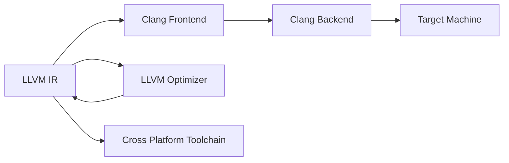

                 

# LLVM/Clang：现代编译器架构剖析

## 1. 背景介绍

### 1.1 问题由来

在当今的软件生态中，编译器扮演着至关重要的角色，负责将高级语言程序转换成目标机器指令或中间表示形式。其中，LLVM（Low-Level Virtual Machine）和Clang是现代编译器架构的代表，它们不仅被广泛用于各种开源项目，如C++编译器、Swift编译器、静态分析工具等，而且成为许多商业产品（如macOS、Apple Hardware Accelerated Code）的底层基础设施。理解LLVM/Clang的架构和实现原理，对于开发高性能和可扩展的编译器系统至关重要。

### 1.2 问题核心关键点

1. **LLVM框架的模块化设计**：LLVM采用了模块化架构，支持动态链接和组合，使其能够灵活地嵌入到不同的编译器、优化器、分析工具中。

2. **Clang编译器的前端后端分离**：Clang通过将前端（源代码到中间表示的转换）与后端（中间表示到目标代码的生成）分离，实现高效、灵活的编译流程。

3. **目标机的多态支持**：LLVM支持多种目标机器，包括CPU和GPU，通过动态多态支持，可以根据目标平台的不同自动调整代码生成策略。

4. **中间表示与代码优化的深度结合**：LLVM的中间表示语言（如IRMLL和LLVM IR）提供了一种高度抽象的表示形式，便于进行广泛的代码优化。

5. **开源与社区驱动**：LLVM/Clang作为开源项目，其发展依赖于全球开源社区的贡献，源代码库定期更新，接受全球开发者提交的贡献和反馈。

6. **跨平台兼容性**：Clang编译器能够跨平台编译，支持Linux、macOS、Windows等多个操作系统，适应不同的软件生态。

通过深入剖析LLVM/Clang的架构和实现原理，本文将帮助读者全面理解现代编译器技术的先进性和灵活性，从而更好地设计和开发编译器工具。

## 2. 核心概念与联系

### 2.1 核心概念概述

为更好地理解LLVM/Clang的工作原理，本节将介绍几个核心概念：

- **LLVM中间表示(LLVM IR)**：LLVM使用一种称为LLVM中间表示的语言，作为编译器的中间表示，便于进行广泛的代码优化和转换。

- **Clang前端(Frontend)**：Clang的前端负责将源代码转换为LLVM中间表示，支持多种编程语言，如C++、Objective-C、Swift等。

- **Clang后端(Backend)**：Clang的后端负责将LLVM中间表示转换为目标代码，支持多种目标机器，如x86、ARM、WebAssembly等。

- **LLVM优化器(Optimizer)**：LLVM包含了一套强大的优化器，用于对LLVM IR进行优化，包括控制流优化、循环优化、死代码消除等。

- **跨平台工具链(Toolchain)**：Clang编译器与LLVM优化器的组合，提供了一套跨平台、高效的软件开发工具链。

这些核心概念之间的逻辑关系可以通过以下Mermaid流程图来展示：



这个流程图展示了LLVM/Clang的工作流程：

1. Clang前端将源代码转换成LLVM IR。
2. Clang后端将LLVM IR转换成目标代码。
3. 与此同时，LLVM优化器对LLVM IR进行优化。
4. 最终输出的目标代码是跨平台的。

## 3. 核心算法原理 & 具体操作步骤
### 3.1 算法原理概述

LLVM/Clang的编译流程主要包括三个主要阶段：

1. **前端阶段**：Clang前端负责将源代码转换成LLVM IR。这涉及到词法分析、语法分析、语义分析、代码生成等过程。
2. **优化阶段**：LLVM优化器对LLVM IR进行各种代码优化，如死代码消除、循环展开、控制流优化等，以提高代码的性能。
3. **后端阶段**：Clang后端负责将优化后的LLVM IR转换成目标代码，这一过程可能包括寄存器分配、指令选择、代码生成等。

### 3.2 算法步骤详解

#### 前端阶段

1. **词法分析**：将源代码分解成一个个词汇（Token），如关键字、标识符、运算符等。
2. **语法分析**：将词法分析得到的Token序列转换成抽象语法树（AST），表示代码的结构。
3. **语义分析**：在语法分析的基础上，进行类型检查、符号解析等，建立符号表，标记变量和函数的定义与使用。
4. **代码生成**：将解析后的AST转换成LLVM IR，这一过程涉及变量绑定、表达式求值、函数调用等。

#### 优化阶段

1. **基本块划分**：将代码划分为基本块（Basic Block），每个基本块包含一条或多条指令。
2. **控制流优化**：通过合并基本块、删除冗余分支、替换条件表达式等方式，优化控制流结构。
3. **循环优化**：针对循环体进行优化，包括循环展开、尾递归优化、循环不变表达式提取等。
4. **死代码消除**：删除不再使用的代码，减少内存占用和执行时间。
5. **常量折叠**：将常量表达式进行合并和简化，提高执行效率。

#### 后端阶段

1. **寄存器分配**：将变量绑定到寄存器中，减少内存访问，提高执行速度。
2. **指令选择**：选择最适合目标机器的指令，生成目标代码。
3. **代码生成**：将优化后的LLVM IR转换成目标机器的汇编代码，最终生成目标文件。

### 3.3 算法优缺点

**优点**：

1. **模块化设计**：LLVM的模块化架构允许不同的组件以动态链接和组合的形式工作，提高了编译器的灵活性和可扩展性。
2. **高效优化**：LLVM内置的优化器可以显著提高代码的性能和效率。
3. **跨平台支持**：Clang编译器支持多种目标机器，能够跨平台编译，适应不同的软件生态。

**缺点**：

1. **学习曲线陡峭**：由于LLVM/Clang的架构复杂，新手入门可能面临较高的学习门槛。
2. **性能优化困难**：对于一些复杂的代码，优化后的性能提升可能有限，特别是在目标机器的特定架构下。
3. **编译时间较长**：由于编译过程涉及多个阶段的复杂转换和优化，编译时间较长。

### 3.4 算法应用领域

LLVM/Clang的架构和实现原理在多个领域得到了广泛应用，包括但不限于：

1. **C++编译器**：Clang被广泛用于GCC等编译器的替代品，提供更快、更安全的编译性能。
2. **Swift编译器**：Clang被Apple用作Swift语言的编译器，支持iOS、macOS等平台的应用开发。
3. **静态分析工具**：LLVM的IRMLL和LLVM IR被用于构建静态分析工具，如Clang-Tidy、LLD等。
4. **中间代码分析**：LLVM的IRMLL和LLVM IR被用于中间代码分析，如控制流分析、数据流分析等。
5. **逆向工程**：LLVM的IRMLL和LLVM IR被用于逆向工程，分析和理解二进制文件和可执行代码。

## 4. 数学模型和公式 & 详细讲解 & 举例说明

### 4.1 数学模型构建

在LLVM中，中间表示（LLVM IR）是一种基于三元组的抽象表示，用于表示指令、数据和控制流结构。LLVM IR的基本块表示为一个由指令组成的列表，每个指令包含操作码、操作数和隐式操作数。

### 4.2 公式推导过程

1. **基本块表示**：
   $$
   \text{Basic Block} = (\text{Instructions}, \text{Terminator}, \text{Next BB})
   $$
   其中，Instructions表示基本块内的指令列表，Terminator表示基本块的出口指令，Next BB表示下一个基本块。

2. **函数表示**：
   $$
   \text{Function} = (\text{Basic Blocks}, \text{Block List}, \text{Argument List}, \text{Return Type})
   $$
   其中，Basic Blocks表示函数内的所有基本块，Block List表示基本块的列表，Argument List表示函数的参数列表，Return Type表示函数的返回类型。

### 4.3 案例分析与讲解

考虑一个简单的C++函数：

```c++
int add(int a, int b) {
    return a + b;
}
```

使用Clang编译器将其转换成LLVM IR的过程如下：

1. **前端阶段**：Clang前端将源代码转换成抽象语法树（AST），并生成相应的LLVM IR代码。
2. **优化阶段**：LLVM优化器对生成的LLVM IR进行各种优化，包括控制流优化、循环优化、死代码消除等。
3. **后端阶段**：Clang后端将优化后的LLVM IR转换成目标代码，生成可执行文件。

## 5. 项目实践：代码实例和详细解释说明
### 5.1 开发环境搭建

为了开始LLVM/Clang的项目实践，需要先搭建开发环境。以下是使用Linux系统搭建LLVM/Clang开发环境的步骤：

1. 安装依赖包：
   ```bash
   sudo apt-get install libclang-6.0-dev clang-6.0 libllvm-11 libllvm-11-dev
   ```

2. 下载LLVM/Clang源代码：
   ```bash
   wget https://llvm.org/releases/13.0.0/llvm.org-13.0.0.src.tar.xz
   tar -xf llvm.org-13.0.0.src.tar.xz
   ```

3. 进入源代码目录，并配置编译选项：
   ```bash
   cd llvm.org-13.0.0.src
   mkdir build
   cd build
   cmake -DLLVM_TARGETS_TO_BUILD=ALL ..
   make -j4
   ```

### 5.2 源代码详细实现

下面以一个简单的C++程序为例，展示如何使用LLVM/Clang进行编译：

1. 编写源代码：
   ```c++
   int add(int a, int b) {
       return a + b;
   }

   int main() {
       int x = 1;
       int y = 2;
       int z = add(x, y);
       return 0;
   }
   ```

2. 使用Clang编译：
   ```bash
   clang -c -o add.o add.cpp
   ```

3. 使用LLD链接：
   ```bash
   lld link add.o -o add
   ```

### 5.3 代码解读与分析

在编译过程中，Clang前端将源代码转换成LLVM IR，LLVM优化器对IR进行优化，Clang后端将优化后的IR转换成目标代码。具体流程如下：

1. **前端阶段**：Clang前端使用AST解析器将源代码转换成AST，然后使用LLVM IR生成器生成LLVM IR代码。
2. **优化阶段**：LLVM优化器对生成的LLVM IR进行各种优化，如控制流优化、循环优化、死代码消除等。
3. **后端阶段**：Clang后端使用LLD链接器将生成的目标代码转换成可执行文件。

## 6. 实际应用场景
### 6.4 未来应用展望

随着LLVM/Clang技术的不断演进，其在多个领域的应用前景广阔，包括但不限于：

1. **跨平台编译**：LLVM/Clang在跨平台编译中的应用将更加广泛，支持更多的目标机器，如RISC-V、ARM等。
2. **AI加速**：LLVM/Clang支持多种硬件架构，可用于加速深度学习模型和AI算法，提升计算效率。
3. **安全编译**：LLVM/Clang可以嵌入安全检测工具，如静态分析工具、漏洞扫描工具，提升软件安全性。
4. **性能优化**：LLVM/Clang将进一步优化代码生成和指令选择策略，提升编译器生成的代码性能。
5. **混合编程**：LLVM/Clang支持多种编程语言，未来将更加灵活地支持混合编程和异构计算。

## 7. 工具和资源推荐
### 7.1 学习资源推荐

为了帮助开发者系统掌握LLVM/Clang的理论基础和实践技巧，这里推荐一些优质的学习资源：

1. **LLVM官方文档**：LLVM官方文档详细介绍了LLVM的架构、实现和应用，是学习LLVM的最佳起点。
2. **Clang官方文档**：Clang官方文档提供了丰富的编译器配置和使用指南，涵盖Clang前端的各种选项和工具链。
3. **《C++ Primer》**：这是一本关于C++语言的经典书籍，其中包含大量关于Clang编译器的介绍和使用技巧。
4. **《LLVM Internals》**：这是一本深入解析LLVM内部机制的书籍，适合有一定C++和编译器背景的读者。
5. **《Clang Cookbook》**：这是一本实用的Clang使用指南，涵盖Clang前端的各种功能和使用案例。

### 7.2 开发工具推荐

高效的开发离不开优秀的工具支持。以下是几款用于LLVM/Clang开发的常用工具：

1. **VS Code**：一款开源的轻量级代码编辑器，支持多种语言，集成了LLVM和Clang的集成开发环境。
2. **CMake**：用于构建编译器的编译系统，支持动态链接和模块化构建。
3. **LLVM IR Viewer**：用于可视化LLVM IR的工具，便于调试和分析编译器生成的中间代码。
4. **Lldb**：LLVM的调试器，支持多种平台和语言，用于调试LLVM IR和生成的目标代码。
5. **Clang-Tidy**：静态分析工具，用于检查和改进C++代码质量，集成到构建流程中。

### 7.3 相关论文推荐

LLVM/Clang的发展得益于众多研究人员和开发者的努力，以下是几篇奠基性的相关论文，推荐阅读：

1. **"LLVM: A Computationally Based Virtual Machine"**：由LLVM项目发起人Mike Zito等人撰写，介绍了LLVM的架构和实现原理。
2. **"Clang: A Comprehensive Developers' Language Front-End"**：由LLVM项目创始人Chris Lattner等人撰写，详细介绍了Clang编译器的设计。
3. **"Fast and Scalable Static Program Analysis via C++ Templates"**：由LLVM核心开发组和PVS-Studio联合撰写的论文，介绍了基于C++模板的静态分析方法。
4. **"Performance-Enhanced Deep Learning Model Compilation with LLVM"**：由Google AI和LLVM团队联合撰写的论文，介绍了使用LLVM优化深度学习模型的技术。

## 8. 总结：未来发展趋势与挑战

### 8.1 总结

本文对LLVM/Clang的架构和实现原理进行了全面系统的介绍。首先阐述了LLVM/Clang在现代编译器中的重要地位，以及它们如何通过模块化设计、前后端分离和中间表示优化等技术，提供高效、灵活的编译器解决方案。其次，从原理到实践，详细讲解了编译流程的各个环节，包括词法分析、语法分析、语义分析、代码生成、优化和后端生成等步骤，并给出了实际代码实例。最后，探讨了LLVM/Clang在实际应用中的场景和未来发展趋势，展示了其在跨平台编译、AI加速、安全编译、性能优化等方面的潜力和挑战。

通过本文的系统梳理，可以更好地理解LLVM/Clang的先进性和灵活性，为开发高性能、可扩展的编译器系统提供重要参考。

### 8.2 未来发展趋势

展望未来，LLVM/Clang技术将呈现以下几个发展趋势：

1. **跨平台优化**：随着芯片和架构的多样化，LLVM/Clang将在更多的平台上提供优化和支持。
2. **AI与编译器融合**：LLVM/Clang将进一步融合AI技术，如机器学习、深度学习等，提升编译器的效果和效率。
3. **编译器的自动化和智能化**：编译器将嵌入更多自动化和智能化功能，如代码自动重构、代码生成优化、自动测试等。
4. **编译器与编程语言结合**：编译器将更多地嵌入到编程语言中，支持编译器的即插即用和无缝集成。
5. **编译器与云平台结合**：编译器将与云平台结合，提供弹性计算和资源优化。

### 8.3 面临的挑战

尽管LLVM/ClVM技术已经取得了显著的成就，但在迈向更加智能化、普适化应用的过程中，它仍面临着诸多挑战：

1. **学习曲线陡峭**：由于LLVM/Clang的架构复杂，新手入门可能面临较高的学习门槛。
2. **性能优化困难**：对于一些复杂的代码，优化后的性能提升可能有限，特别是在目标机器的特定架构下。
3. **资源消耗大**：编译过程涉及多个阶段的复杂转换和优化，编译时间和资源消耗较大。
4. **代码兼容性问题**：编译器与现有代码库的兼容性问题可能会影响编译器大规模部署。
5. **社区维护成本高**：LLVM/Clang作为开源项目，需要大量社区开发者维护，维护成本较高。

### 8.4 研究展望

面对LLVM/Clang所面临的挑战，未来的研究需要在以下几个方面寻求新的突破：

1. **编译器的自动化**：开发自动化的编译器优化工具，减少手动调优的工作量。
2. **编译器与AI的结合**：研究编译器与AI技术的结合方式，提升编译器的效果和效率。
3. **编译器的可扩展性**：提高编译器的模块化和可扩展性，便于添加新的功能模块。
4. **编译器的性能优化**：优化编译器的性能和资源消耗，提升编译器的大规模应用能力。
5. **编译器的生态系统**：构建一个完整的编译器生态系统，促进编译器与其他工具的协同工作。

## 9. 附录：常见问题与解答

**Q1：如何选择合适的LLVM/Clang选项？**

A: 选择合适的LLVM/Clang选项需要考虑目标平台、编译需求、代码优化等因素。可以通过阅读官方文档和使用工具（如Clang-Tidy、LLD等）来了解和测试不同选项的性能和效果。

**Q2：LLVM/Clang编译器是否支持异构编程？**

A: 是的，LLVM/Clang编译器支持多种编程语言和异构计算模型，如OpenCL、CUDA等，可以用于加速并行计算和分布式编程。

**Q3：如何优化LLVM/Clang的编译过程？**

A: 优化LLVM/Clang的编译过程可以通过以下方法：

1. 使用编译器选项进行优化，如优化级别（-O2、-O3）、多线程编译（-j）等。
2. 使用链接器选项进行优化，如代码布局（-Xlinker-loose）、快速链接（--composite-sections）等。
3. 使用LLVM的优化器进行优化，如LLVM pass pipeline等。

**Q4：LLVM/Clang编译器是否支持动态链接？**

A: 是的，LLVM/Clang编译器支持动态链接（即共享库），可以通过指定编译选项（如-shared）来生成动态链接库。

**Q5：LLVM/Clang编译器是否支持多语言混合编程？**

A: 是的，LLVM/Clang编译器支持多种编程语言的混合编程，可以通过使用相应的前端和后端组件来实现。

---

作者：禅与计算机程序设计艺术 / Zen and the Art of Computer Programming

