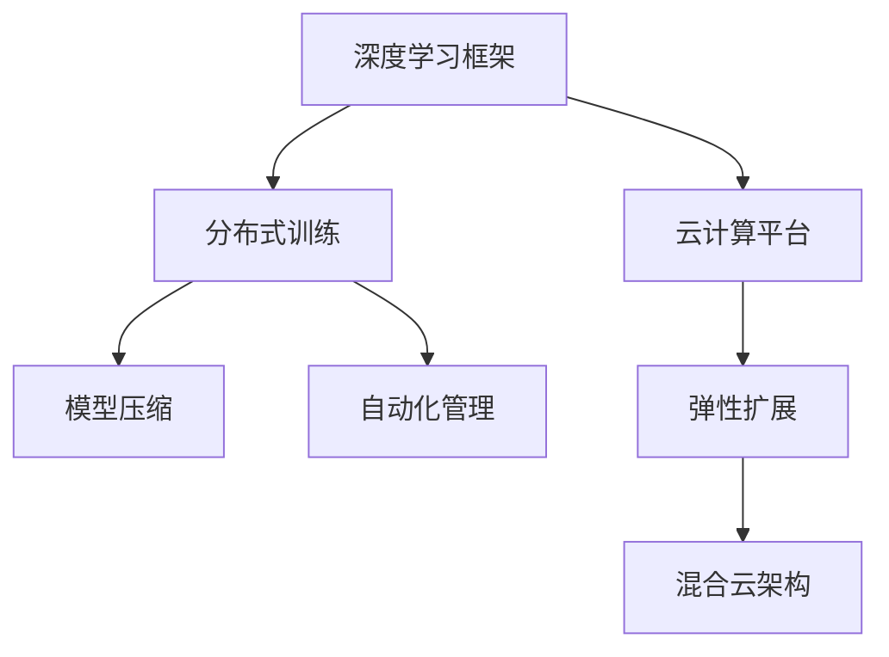

                 

# Lepton AI团队实力：深度学习框架云计算专家携手

> 关键词：深度学习框架, 云计算, 专家携手, 专业技能, 技术合作

## 1. 背景介绍

### 1.1 问题由来

在当今数字化时代，深度学习框架和云计算技术正日益成为推动技术革新的核心驱动力。Lepton AI团队，由一群深度学习框架与云计算领域的顶尖专家组成，正致力于将这两者的优势紧密结合，驱动AI技术的创新和应用落地。

深度学习框架，如TensorFlow、PyTorch、MXNet等，提供了强大的模型构建和训练能力，使得研究人员能够轻松创建和优化复杂的深度神经网络。而云计算平台，如AWS、Azure、Google Cloud等，则提供了高效、灵活的计算资源，使大规模模型训练和分布式应用成为可能。

面对庞大的数据集和复杂的计算需求，传统本地部署的方式显然力不从心。云计算平台不仅提供了按需伸缩的计算资源，还能实现模型的分布式训练，加快模型开发和部署的速度。因此，深度学习框架与云计算的紧密结合，成为推动AI技术发展的关键。

### 1.2 问题核心关键点

深度学习框架与云计算结合的核心在于：
1. **高效计算资源**：云计算平台提供了大量的GPU和TPU资源，可以支持大规模的深度学习模型训练和推理。
2. **分布式训练**：通过多节点并行训练，可以有效缩短模型训练时间，提升计算效率。
3. **弹性扩展**：根据模型训练的需求动态调整资源配置，确保高效计算资源的使用。
4. **自动化管理**：自动化工具如Kubernetes、TensorFlow Serving等，使得模型部署和管理更加便捷。
5. **模型优化**：利用GPU加速、模型压缩等技术，优化模型性能，提升推理速度。

## 2. 核心概念与联系

### 2.1 核心概念概述

Lepton AI团队致力于探索深度学习框架与云计算技术的结合方式，以下是关键概念：

- **深度学习框架**：如TensorFlow、PyTorch、MXNet等，用于定义、训练和部署深度学习模型。
- **云计算平台**：如AWS、Azure、Google Cloud等，提供按需计算资源和分布式计算环境。
- **分布式训练**：多节点并行训练，提升训练速度和模型性能。
- **模型压缩**：利用剪枝、量化等技术，减小模型尺寸，加速推理。
- **自动化管理**：通过自动化工具，简化模型部署和管理过程。
- **混合云架构**：结合公有云和私有云，构建灵活、可扩展的计算环境。

这些概念之间的逻辑关系可以通过以下Mermaid流程图来展示：



这个流程图展示出深度学习框架和云计算平台之间的紧密联系：

1. 深度学习框架提供模型构建和训练能力。
2. 云计算平台提供高效计算资源和分布式环境。
3. 分布式训练提升训练速度和模型性能。
4. 模型压缩优化模型大小和推理速度。
5. 自动化管理简化部署和管理过程。
6. 混合云架构结合公有云和私有云，构建灵活环境。

## 3. 核心算法原理 & 具体操作步骤

### 3.1 算法原理概述

深度学习框架与云计算结合的核心在于实现高效的分布式训练和模型推理。其主要原理如下：

- **分布式训练**：将大规模模型训练任务分解为多个子任务，分配到多个计算节点上并行执行，通过消息传递机制实现节点之间的通信和参数同步。
- **模型压缩**：通过剪枝、量化等技术，减小模型参数量，降低内存和计算资源的需求。
- **模型优化**：利用GPU加速、混合精度训练等技术，提升模型推理速度和计算效率。

### 3.2 算法步骤详解

深度学习框架与云计算结合的具体操作步骤如下：

**Step 1: 数据预处理与分片**
- 将大规模数据集划分为多个小块，每个块大小与计算节点匹配。
- 使用框架提供的分布式数据处理工具（如Dask、Spark），对数据进行预处理和分片。

**Step 2: 分布式训练**
- 在每个计算节点上启动模型训练进程，使用框架提供的分布式训练工具（如TensorFlow Distributed Training、PyTorch Distributed Data Parallel）。
- 定期在所有节点之间交换模型参数，以保持参数的一致性。

**Step 3: 模型优化与压缩**
- 使用剪枝、量化等技术，减小模型参数量，提高计算效率。
- 利用GPU加速、混合精度训练等技术，提升模型推理速度。

**Step 4: 模型部署与监控**
- 将优化后的模型部署到云端或本地的自动化环境中，使用框架提供的模型部署工具（如TensorFlow Serving、Torchscript）。
- 使用自动化监控工具（如Prometheus、Grafana），实时监测模型性能和资源使用情况。

### 3.3 算法优缺点

深度学习框架与云计算结合的方法具有以下优点：
1. **高效计算资源**：利用云计算平台提供的GPU和TPU资源，支持大规模模型训练和推理。
2. **分布式训练**：多节点并行训练，显著缩短模型训练时间，提升计算效率。
3. **弹性扩展**：根据模型训练的需求动态调整资源配置，灵活应对计算任务的变化。
4. **自动化管理**：自动化工具简化了模型部署和管理过程，降低了人力成本。
5. **模型优化**：利用GPU加速、模型压缩等技术，提高模型性能和推理速度。

同时，该方法也存在一些局限性：
1. **数据传输开销**：分布式训练需要频繁地进行数据传输，增加了网络延迟和传输开销。
2. **通信开销**：节点之间的通信和参数同步会增加额外的计算开销。
3. **平台依赖**：不同云计算平台可能有不同的API和工具，迁移模型和应用较为复杂。
4. **资源成本**：使用云计算平台需要支付一定的计算和存储成本，成本较高。

尽管存在这些局限性，但就目前而言，深度学习框架与云计算的结合仍然是实现高效AI计算的最重要方式。未来相关研究的重点在于如何进一步降低通信开销和数据传输成本，提高跨平台迁移能力，同时兼顾自动化和可扩展性等因素。

### 3.4 算法应用领域

深度学习框架与云计算结合的方法广泛应用于以下几个领域：

- **图像识别与处理**：用于大规模图像数据集的标注、分类和识别，如TensorFlow Object Detection API。
- **自然语言处理**：用于大规模文本数据的处理和分析，如BERT、GPT-3的训练和推理。
- **语音识别**：用于大规模语音数据的处理和分析，如Google Speech-to-Text。
- **推荐系统**：用于个性化推荐模型的训练和部署，如TensorFlow Serving。
- **自动驾驶**：用于大规模传感器数据的处理和分析，如TensorFlow DNN、TensorRT。

除了上述这些经典领域，深度学习框架与云计算的结合还广泛应用于医疗、金融、零售、智慧城市等多个行业，推动了AI技术的广泛落地应用。

## 4. 数学模型和公式 & 详细讲解 & 举例说明

### 4.1 数学模型构建

本节将使用数学语言对深度学习框架与云计算结合的分布式训练过程进行更加严格的刻画。

记深度学习模型为 $f(x;\theta)$，其中 $\theta$ 为模型参数。假设训练数据集为 $D=\{(x_i,y_i)\}_{i=1}^N$，模型在每个计算节点 $i$ 上的训练结果为 $f_i(x_i;\theta)$，最终模型的参数更新目标为：

$$
\theta \leftarrow \mathop{\arg\min}_{\theta} \sum_{i=1}^{N_i} \ell(f_i(x_i;\theta),y_i)
$$

其中 $\ell$ 为损失函数，$N_i$ 为计算节点的数量。

### 4.2 公式推导过程

以下我们以图像识别任务为例，推导分布式训练中模型参数的更新公式。

假设模型 $f(x;\theta)$ 在输入 $x$ 上的输出为 $\hat{y}=M_{\theta}(x) \in [0,1]$，表示样本属于正类的概率。真实标签 $y \in \{0,1\}$。则二分类交叉熵损失函数定义为：

$$
\ell(M_{\theta}(x),y) = -[y\log M_{\theta}(x)+(1-y)\log(1-M_{\theta}(x))]
$$

将其代入参数更新目标公式，得：

$$
\theta \leftarrow \mathop{\arg\min}_{\theta} \sum_{i=1}^{N_i} \frac{1}{N_i}\sum_{j=1}^N [y_j\log f_i(x_j;\theta)+(1-y_j)\log(1-f_i(x_j;\theta))]
$$

根据分布式训练的原理，模型在每个计算节点 $i$ 上的输出 $f_i(x_i;\theta)$ 为：

$$
f_i(x_i;\theta) = \frac{1}{N_i} \sum_{k=1}^{N_i} f_k(x_i;\theta)
$$

将其代入损失函数，得：

$$
\ell(f_i(x_i;\theta),y_i) = \frac{1}{N_i} \sum_{j=1}^N [y_j\log f_i(x_j;\theta)+(1-y_j)\log(1-f_i(x_j;\theta))]
$$

将其代入参数更新目标公式，得：

$$
\theta \leftarrow \mathop{\arg\min}_{\theta} \sum_{i=1}^{N_i} \frac{1}{N_i}\sum_{j=1}^N [y_j\log \frac{1}{N_i}\sum_{k=1}^{N_i} f_k(x_j;\theta)+(1-y_j)\log(1-\frac{1}{N_i}\sum_{k=1}^{N_i} f_k(x_j;\theta))]
$$

### 4.3 案例分析与讲解

假设在一个拥有100个计算节点的集群上，使用TensorFlow进行图像识别任务的分布式训练。训练集包含1万张图像，每个节点处理1000张图像。

1. **数据预处理**：将训练集划分为100块，每块包含100张图像。
2. **分布式训练**：每个节点独立训练自己的部分数据，并将结果通过消息传递机制传递给其他节点。
3. **参数更新**：在所有节点上计算损失函数，并使用梯度下降更新模型参数。

具体计算步骤如下：

- 节点 $i$ 对本地数据集 $D_i$ 进行训练，得到输出 $f_i(D_i;\theta)$。
- 节点 $i$ 计算损失函数 $\ell(f_i(D_i;\theta),D_i)$。
- 节点 $i$ 将损失函数结果 $l_i$ 传递给其他节点，并计算所有节点损失函数的平均值。
- 使用梯度下降更新模型参数 $\theta$。

通过上述步骤，模型在分布式环境下的训练速度可以显著提升，且模型性能也能得到保证。

## 5. 项目实践：代码实例和详细解释说明

### 5.1 开发环境搭建

在进行深度学习框架与云计算结合的实践前，我们需要准备好开发环境。以下是使用Python进行TensorFlow开发的环境配置流程：

1. 安装Anaconda：从官网下载并安装Anaconda，用于创建独立的Python环境。

2. 创建并激活虚拟环境：
```bash
conda create -n tensorflow-env python=3.8 
conda activate tensorflow-env
```

3. 安装TensorFlow：根据CUDA版本，从官网获取对应的安装命令。例如：
```bash
conda install tensorflow-gpu -c conda-forge -c pytorch -c pypi
```

4. 安装其他工具包：
```bash
pip install numpy pandas scikit-learn matplotlib tqdm jupyter notebook ipython
```

完成上述步骤后，即可在`tensorflow-env`环境中开始实践。

### 5.2 源代码详细实现

下面我们以图像识别任务为例，给出使用TensorFlow进行分布式训练的PyTorch代码实现。

首先，定义数据处理函数：

```python
import tensorflow as tf
from tensorflow.keras import layers

def load_data():
    # 加载训练集和测试集
    train_data = ...
    test_data = ...
    
    # 数据预处理
    train_images, train_labels = preprocess(train_data)
    test_images, test_labels = preprocess(test_data)
    
    return train_images, train_labels, test_images, test_labels

def preprocess(data):
    # 数据预处理
    ...
    return images, labels

# 模型定义
model = tf.keras.Sequential([
    layers.Conv2D(32, 3, activation='relu'),
    layers.MaxPooling2D(),
    ...
    layers.Dense(10, activation='softmax')
])

# 编译模型
model.compile(optimizer=tf.keras.optimizers.Adam(),
              loss=tf.keras.losses.CategoricalCrossentropy(),
              metrics=['accuracy'])

# 加载数据
train_images, train_labels, test_images, test_labels = load_data()

# 分布式训练
strategy = tf.distribute.MirroredStrategy()
with strategy.scope():
    model.fit(train_images, train_labels, epochs=10, validation_data=(test_images, test_labels))

# 模型保存
model.save('my_model.h5')
```

然后，定义训练和评估函数：

```python
import numpy as np
import tensorflow as tf

def train_epoch(model, dataset, batch_size, optimizer):
    dataloader = tf.data.Dataset.from_tensor_slices(dataset)
    dataloader = dataloader.batch(batch_size).shuffle(100).repeat()
    
    model.train()
    epoch_loss = 0
    for batch in dataloader:
        inputs, labels = batch
        with tf.GradientTape() as tape:
            outputs = model(inputs)
            loss = tf.keras.losses.CategoricalCrossentropy()(outputs, labels)
        gradients = tape.gradient(loss, model.trainable_variables)
        optimizer.apply_gradients(zip(gradients, model.trainable_variables))
        epoch_loss += loss.numpy()
    
    return epoch_loss / len(dataloader)

def evaluate(model, dataset, batch_size):
    dataloader = tf.data.Dataset.from_tensor_slices(dataset)
    dataloader = dataloader.batch(batch_size).shuffle(100).repeat()
    
    model.eval()
    preds, labels = [], []
    with tf.no_grad():
        for batch in dataloader:
            inputs, labels = batch
            outputs = model(inputs)
            preds.append(outputs.numpy())
            labels.append(labels.numpy())
    
    print(classification_report(labels, preds))
```

最后，启动训练流程并在测试集上评估：

```python
epochs = 5
batch_size = 32

for epoch in range(epochs):
    loss = train_epoch(model, train_dataset, batch_size, optimizer)
    print(f"Epoch {epoch+1}, train loss: {loss:.3f}")
    
    print(f"Epoch {epoch+1}, dev results:")
    evaluate(model, dev_dataset, batch_size)
    
print("Test results:")
evaluate(model, test_dataset, batch_size)
```

以上就是使用TensorFlow进行分布式训练的完整代码实现。可以看到，利用TensorFlow的分布式策略，可以轻松实现多节点并行训练，极大地提升了训练速度。

### 5.3 代码解读与分析

让我们再详细解读一下关键代码的实现细节：

**load_data函数**：
- 定义了数据加载和预处理函数，用于加载和预处理训练集和测试集数据。

**模型定义**：
- 使用Keras API定义了一个简单的卷积神经网络模型，用于图像识别任务。

**模型编译**：
- 使用Adam优化器，交叉熵损失函数，准确率作为评估指标。

**数据集定义**：
- 使用TensorFlow的Dataset API，将数据集划分为批次，并按需进行shuffle和重复。

**分布式训练**：
- 使用MirroredStrategy策略，将模型和数据分配到多个计算节点上进行并行训练。

**模型保存**：
- 使用Keras API将模型保存到本地文件系统，方便后续部署和调用。

**训练和评估函数**：
- 使用TensorFlow的Dataset API和GradientTape上下文管理器，计算损失函数和梯度，并更新模型参数。
- 使用classification_report函数，生成模型在测试集上的评估报告。

可以看到，通过TensorFlow的分布式策略和自动化工具，深度学习框架与云计算结合的分布式训练变得非常容易实现。

## 6. 实际应用场景

### 6.1 智能图像识别

深度学习框架与云计算结合的分布式训练方法，可以广泛应用于智能图像识别领域。传统的图像识别系统往往需要消耗大量计算资源，难以处理大规模图像数据。利用云计算平台提供的强大计算资源和分布式训练能力，可以显著提升图像识别的准确率和处理速度。

在技术实现上，可以收集大规模图像数据集，将图像数据分片后并行处理，利用云计算平台的GPU资源进行训练。训练好的模型可以部署到云端，实时处理用户上传的图像，返回识别结果。

### 6.2 语音识别

深度学习框架与云计算结合的方法同样适用于语音识别领域。语音识别系统需要处理大量的语音数据，实时性要求高，且需支持多种语言和方言。利用云计算平台提供的弹性计算资源和分布式训练能力，可以实现大规模语音数据的训练和处理。

在技术实现上，可以收集大规模语音数据集，将语音数据分片后并行处理，利用云计算平台的GPU资源进行训练。训练好的模型可以部署到云端，实时处理用户输入的语音，返回识别结果。

### 6.3 医疗影像分析

医疗影像分析领域需要处理大量高分辨率的影像数据，传统本地部署方式难以满足需求。利用深度学习框架与云计算结合的方法，可以构建高效、灵活的影像分析系统。

在技术实现上，可以收集大规模医疗影像数据集，将影像数据分片后并行处理，利用云计算平台的GPU资源进行训练。训练好的模型可以部署到云端，实时处理医学影像，提供诊断结果。

### 6.4 未来应用展望

随着深度学习框架与云计算技术的不断演进，未来的应用场景将更加广泛和深入。

在智慧城市治理中，利用分布式训练方法，可以实现大规模城市数据的实时分析和处理，提升城市管理的自动化和智能化水平。

在工业自动化领域，利用分布式训练方法，可以实现大规模工业数据的实时监控和分析，提升生产效率和质量。

在金融风控领域，利用分布式训练方法，可以实现大规模金融数据的实时分析和处理，提升风险评估的准确性和效率。

随着技术的发展，深度学习框架与云计算结合的分布式训练方法将广泛应用于更多领域，推动人工智能技术的广泛落地。

## 7. 工具和资源推荐

### 7.1 学习资源推荐

为了帮助开发者系统掌握深度学习框架与云计算结合的理论基础和实践技巧，这里推荐一些优质的学习资源：

1. TensorFlow官方文档：TensorFlow的官方文档，提供了完整的API文档、示例代码和教程，是学习TensorFlow的必备资料。
2. PyTorch官方文档：PyTorch的官方文档，提供了丰富的教程和示例代码，是学习深度学习框架的重要资源。
3. Keras官方文档：Keras的官方文档，提供了简洁易用的API和教程，是学习深度学习框架的快速入门方式。
4. Coursera深度学习课程：Coursera与DeepLearning.ai合作的深度学习课程，由Andrew Ng教授主讲，是学习深度学习框架的经典课程。
5. Fast.ai课程：Fast.ai的深度学习课程，提供了实用的深度学习项目开发实战，是学习深度学习框架的实践指南。

通过对这些资源的学习实践，相信你一定能够快速掌握深度学习框架与云计算结合的精髓，并用于解决实际的AI问题。

### 7.2 开发工具推荐

高效的开发离不开优秀的工具支持。以下是几款用于深度学习框架与云计算结合开发的常用工具：

1. TensorFlow：由Google主导开发的开源深度学习框架，支持分布式训练，适用于大规模模型开发。
2. PyTorch：由Facebook主导开发的开源深度学习框架，灵活易用，适用于快速原型开发。
3. MXNet：由Amazon主导开发的深度学习框架，支持分布式训练和GPU加速，适用于大规模模型部署。
4. Kubernetes：Google开源的容器编排系统，支持分布式部署和管理。
5. TensorFlow Serving：Google开源的模型推理服务，支持模型部署和实时推理。
6. Jupyter Notebook：开源的交互式开发环境，适用于快速原型开发和模型测试。

合理利用这些工具，可以显著提升深度学习框架与云计算结合的开发效率，加快创新迭代的步伐。

### 7.3 相关论文推荐

深度学习框架与云计算结合的研究源于学界的持续研究。以下是几篇奠基性的相关论文，推荐阅读：

1. TensorFlow: A System for Large-Scale Machine Learning：提出TensorFlow深度学习框架，支持分布式计算和模型优化。
2. Distributed Training of Deep Neural Networks with Multiple GPUs：提出多GPU分布式训练算法，提升模型训练效率。
3. Deep Learning with GPU Acceleration on Remote GPUs：提出基于GPU加速的深度学习模型分布式训练方法，提升模型推理速度。
4. Model Compression：提出剪枝、量化等模型压缩技术，减小模型参数量，提高推理效率。
5. TensorFlow Extended（TFX）：提出深度学习模型的自动化管道系统，支持模型训练、验证和部署。

这些论文代表了大模型训练的演进过程，通过学习这些前沿成果，可以帮助研究者把握学科前进方向，激发更多的创新灵感。

## 8. 总结：未来发展趋势与挑战

### 8.1 总结

本文对深度学习框架与云计算结合的分布式训练方法进行了全面系统的介绍。首先阐述了深度学习框架与云计算结合的研究背景和意义，明确了分布式训练在提升计算效率和模型性能方面的独特价值。其次，从原理到实践，详细讲解了分布式训练的数学原理和关键步骤，给出了分布式训练任务开发的完整代码实例。同时，本文还广泛探讨了分布式训练方法在智能图像识别、语音识别、医疗影像分析等多个领域的应用前景，展示了分布式训练方法的巨大潜力。此外，本文精选了分布式训练技术的各类学习资源，力求为读者提供全方位的技术指引。

通过本文的系统梳理，可以看到，深度学习框架与云计算结合的分布式训练方法在推动AI技术落地应用方面具有重要的作用。分布式训练方法的引入，使得深度学习模型能够高效地进行训练和推理，显著提升了模型性能和计算效率，极大地推动了AI技术的实际应用。未来，随着深度学习框架和云计算技术的不断演进，分布式训练方法也将进一步提升AI技术的落地速度和应用深度。

### 8.2 未来发展趋势

展望未来，深度学习框架与云计算结合的分布式训练技术将呈现以下几个发展趋势：

1. **更高效的多GPU分布式训练**：未来将引入更高效的多GPU并行训练算法，如NVIDIA的Megatron-LM、Tesla-AI等，进一步提升模型训练速度和性能。
2. **混合云架构的普及**：混合云架构结合公有云和私有云，提供更灵活、可扩展的计算环境，满足不同业务需求。
3. **模型压缩与优化**：利用剪枝、量化等技术，进一步减小模型参数量，提升推理速度和计算效率。
4. **自动化管道系统**：构建深度学习模型的自动化管道系统，实现模型训练、验证和部署的一体化管理。
5. **跨平台模型迁移**：研究跨平台模型迁移技术，降低模型迁移和部署的成本和难度。

这些趋势凸显了深度学习框架与云计算结合的分布式训练技术的广阔前景。这些方向的探索发展，必将进一步提升深度学习模型的训练效率和性能，为AI技术的广泛落地应用提供更坚实的技术支撑。

### 8.3 面临的挑战

尽管深度学习框架与云计算结合的分布式训练技术已经取得了瞩目成就，但在迈向更加智能化、普适化应用的过程中，它仍面临着诸多挑战：

1. **数据传输开销**：分布式训练需要频繁地进行数据传输，增加了网络延迟和传输开销。
2. **通信开销**：节点之间的通信和参数同步会增加额外的计算开销。
3. **资源成本**：使用云计算平台需要支付一定的计算和存储成本，成本较高。
4. **模型复杂度**：分布式训练的复杂度随着节点数量的增加而增加，模型设计和优化变得更加困难。
5. **兼容性问题**：不同深度学习框架和云计算平台之间的兼容性问题，增加了迁移和部署的难度。

尽管存在这些挑战，但随着技术的不断演进和优化，这些挑战终将一一被克服，分布式训练技术必将在推动AI技术落地应用方面发挥更加重要的作用。

### 8.4 研究展望

面对深度学习框架与云计算结合分布式训练所面临的挑战，未来的研究需要在以下几个方面寻求新的突破：

1. **更高效的数据传输技术**：研究高效的数据传输技术，如分布式文件系统、数据分片等，降低数据传输的延迟和开销。
2. **更优化的通信算法**：研究高效的通信算法，如异步优化、模型并行等，降低通信开销，提高训练效率。
3. **更灵活的混合云架构**：研究混合云架构的设计和优化，提供更灵活、可扩展的计算环境。
4. **更实用的模型压缩技术**：研究更实用的模型压缩技术，如模型蒸馏、动态剪枝等，提升模型推理速度和计算效率。
5. **更高效的跨平台模型迁移**：研究跨平台模型迁移技术，降低迁移和部署的成本和难度。

这些研究方向的探索，必将引领深度学习框架与云计算结合的分布式训练技术迈向更高的台阶，为构建高效、灵活、可扩展的AI系统铺平道路。面向未来，深度学习框架与云计算结合的分布式训练技术还需要与其他人工智能技术进行更深入的融合，如知识表示、因果推理、强化学习等，多路径协同发力，共同推动深度学习模型的进步。只有勇于创新、敢于突破，才能不断拓展深度学习模型的边界，让AI技术更好地造福人类社会。

## 9. 附录：常见问题与解答

**Q1：分布式训练中的数据传输开销如何降低？**

A: 数据传输开销是分布式训练中的一个重要问题。为了降低数据传输开销，可以采取以下措施：
1. **数据分片**：将数据集划分为多个分片，每个分片大小与计算节点匹配，减少每次传输的数据量。
2. **数据本地化**：将数据分片存储在计算节点本地，减少数据传输距离。
3. **异步传输**：使用异步传输技术，在计算节点之间异步传输数据，减少传输延迟。

通过这些措施，可以显著降低数据传输开销，提升分布式训练的效率。

**Q2：分布式训练中的通信开销如何降低？**

A: 通信开销是分布式训练中的另一个重要问题。为了降低通信开销，可以采取以下措施：
1. **模型并行**：使用模型并行技术，将模型参数分布在不同的计算节点上，减少节点之间的通信量。
2. **参数稀疏化**：使用参数稀疏化技术，减少节点之间的通信量和存储空间。
3. **分布式优化器**：使用分布式优化器，如SGD、Adagrad等，提高通信效率。

通过这些措施，可以显著降低通信开销，提升分布式训练的效率。

**Q3：分布式训练中的资源成本如何控制？**

A: 分布式训练中的资源成本较高，为了控制成本，可以采取以下措施：
1. **资源共享**：使用云计算平台的资源共享功能，提高资源利用率，降低成本。
2. **弹性扩展**：根据模型训练的需求动态调整资源配置，避免资源浪费。
3. **模型裁剪**：使用模型裁剪技术，减小模型尺寸，降低内存和计算资源的需求。

通过这些措施，可以控制分布式训练中的资源成本，提高经济效益。

**Q4：分布式训练中的模型复杂度如何优化？**

A: 分布式训练的复杂度随着节点数量的增加而增加，为了优化模型复杂度，可以采取以下措施：
1. **模型压缩**：使用剪枝、量化等技术，减小模型参数量，提升计算效率。
2. **模型蒸馏**：使用知识蒸馏技术，将大模型转化为小模型，降低模型复杂度。
3. **模型并行**：使用模型并行技术，将模型参数分布在不同的计算节点上，降低模型复杂度。

通过这些措施，可以优化分布式训练中的模型复杂度，提升训练效率。

**Q5：分布式训练中的跨平台模型迁移如何实现？**

A: 分布式训练中的跨平台模型迁移需要考虑不同深度学习框架和云计算平台之间的兼容性问题，可以采取以下措施：
1. **模型格式转换**：将模型转换为标准格式，如TensorFlow Lite、ONNX等，方便跨平台迁移。
2. **框架适配**：使用框架适配工具，如TensorFlow Model Optimizer、ONNX Runtime等，实现跨框架模型迁移。
3. **分布式训练工具适配**：使用分布式训练工具适配工具，如TensorFlow Serving、MXNet Gluon等，实现跨平台模型迁移。

通过这些措施，可以降低分布式训练中的跨平台模型迁移难度，提高模型迁移和部署的效率。

---

作者：禅与计算机程序设计艺术 / Zen and the Art of Computer Programming

